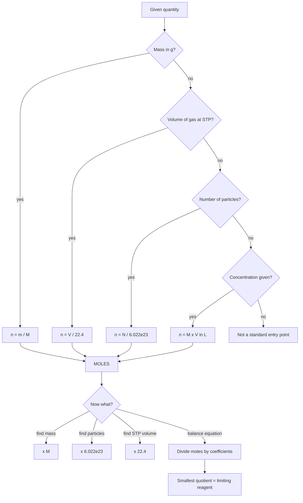

# Some Basic Concepts

Three ideas carry the whole of Class 11–12 chemistry numerical work: the **mole**, the **balanced equation**, and the **concentration unit that matches the question**. If those three are automatic, you can solve Redox, Solutions, Equilibrium, Kinetics and Thermodynamics questions you have never seen before. If they are shaky, every numerical question in those chapters becomes a guess. This note is built around making those three automatic.

### 🟢 Lite — Quick Review (1h–1d)

The single most-tested relationship in this unit is the mole triangle. Whatever you are given, convert to moles first, work in moles, then convert out.

| If you are given | Convert with | Result is |
| --- | --- | --- |
| Mass in grams | n = m / M | moles |
| Number of particles | n = N / N_A | moles |
| Gas volume at STP (1 atm, 0 °C) | n = V / 22.4 L | moles |
| Molarity of a solution | n = M × V(L) | moles |
| Molecules or formula units | n = w / (M × N_A) | moles |

- **N_A = 6.02214076 × 10²³ mol⁻¹** (exact, by SI definition since 2019).
- **Molar mass of a gas at STP** — combine two relations: n = V/22.4 and n = m/M, so **M = 22.4 × m / V** (with V in litres).
- **Mass percent (w/w %)** = (mass of solute / mass of solution) × 100.
- **Mole fraction** x_A = n_A / (n_A + n_B + …). For a binary mixture x_A + x_B = 1.
- **Molarity (M)** = moles of solute per litre of **solution**. Changes with temperature, because volume changes.
- **Molality (m)** = moles of solute per kilogram of **solvent**. Does not change with temperature. This is the unit you must use for ΔT_f, ΔT_b, K_f, K_m, Raoult's law and osmotic pressure.
- **Molecular formula** = n × (empirical formula), where n = molecular mass ÷ empirical formula mass, and n must come out a whole number.

> Trap: molarity and molality give nearly the same number only in dilute aqueous solution where density ≈ 1 g mL⁻¹. In anything more concentrated the solvent/solution mass split changes the answer, and the two values diverge.

### 🟡 Standard — Regular Study (2d–2mo)

#### Classification of matter

Matter is either **pure** or a **mixture**. Pure substances are fixed-composition and have fixed melting/boiling points: they are **elements** (one type of atom) and **compounds** (two or more elements chemically bonded in a fixed ratio). Mixtures are not chemically bonded and their components keep their own properties — **homogeneous** (uniform at all scales: salt solution, air) or **heterogeneous** (distinct phases: sand in water, oil and water). Mixtures come apart by physical means; compounds need a chemical change first. That distinction explains why distillation separates a mixture but never breaks a compound.

#### Dalton's atomic theory and its two corrections

Dalton (1808) proposed that matter is made of indivisible atoms, that all atoms of an element are identical in mass and properties, that atoms combine in small whole-number ratios, and that atoms are neither created nor destroyed in a chemical reaction. Two of these are now known to be wrong: atoms are divisible into protons, neutrons and electrons, and atoms of one element are not all identical because **isotopes** differ in neutron count. The useful idea that survives is the fourth one — fixed whole-number ratios — which is exactly why chemical formulas exist and why the law of conservation of mass holds.

#### Atomic mass, molecular mass, formula mass, molar mass

| Quantity | What it is | Unit | Used for |
| --- | --- | --- | --- |
| Atomic mass | Weighted mean of isotope masses on the ¹²C = 12 scale | u (amu) | atoms: Na = 22.99, Cl = 35.45 |
| Molecular mass | Sum of atomic masses in one molecule | u | CO₂ = 44.01 |
| Formula unit mass | Sum for one formula unit of an ionic solid | u | NaCl = 58.44 (no separate NaCl molecule exists) |
| Molar mass (M) | Mass of one mole of the substance | g mol⁻¹ | every mole calculation |

The numbers are numerically identical — CO₂ is 44.01 u per molecule and 44.01 g per mole — but the unit is not optional. Options in MCQs regularly pair the right number with the wrong unit, and that is the whole point of the question.

Why 35.45 and not 35.5 for chlorine? Because atomic mass is an abundance-weighted average, and chlorine is roughly 75 % ³⁷Cl and 25 % ³⁵Cl. Heavy isotopes are a favourite one-mark trap: given ³⁷Cl and ³⁵Cl abundances, work the average before doing anything else.

#### The mole

The mole is the chemist's counting unit, defined as the amount containing exactly 6.02214076 × 10²³ elementary entities. One mole of atoms, molecules, formula units, electrons or protons all contain the same number of particles. A 12 g sample of ¹²C is exactly one mole because ¹²C is the atomic mass standard.

#### Stoichiometry and the limiting reagent

A balanced equation gives two things at once: the mass relationships, and the mole relationships. The molar ratios come from the coefficients — 2H₂ + O₂ → 2H₂O means 2 : 1 : 2 in moles, always, regardless of grams. To find the limiting reagent, divide moles available by the stoichiometric coefficient for **each** reactant. The smallest quotient is the limiting reagent: it runs out first and sets the yield of everything downstream. The other reactant is in excess, and the leftover is found by subtracting what reacted.

#### Concentration terms side by side

| Term | Formula | Denominator | Temperature-dependent? |
| --- | --- | --- | --- |
| Molarity (M) | n_solute / V_solution(L) | volume of solution | yes |
| Molality (m) | n_solute / m_solvent(kg) | mass of solvent | no |
| Mole fraction (x) | n_solute / n_total | total moles | no |
| Mass percent (w/w) | (w_solute / w_solution) × 100 | mass of solution | no |
| ppm | mg of solute per kg (or per L) of solution | — | no |

Conversion between molarity and molality needs density:

**m = (M × 1000) / (1000ρ − M × M_solute)**

where ρ is density in g mL⁻¹, M is molarity in mol L⁻¹, and M_solute is the solute's molar mass in g mol⁻¹. Check the sign: M_solute enters as a subtraction because the solution's mass includes the solute, so 1 L of solution is (1000ρ − n·M_solute) grams of solvent. If your answer comes out negative, you have used the wrong sign or a nonsense density.

#### Colligative quantities in one line

All four colligative properties (relative lowering of vapour pressure, elevation of boiling point, depression of freezing point, osmotic pressure) depend only on the **number** of dissolved particles, not their identity. In practice that means: for electrolytes use the van't Hoff factor i, and i = 1 for non-electrolytes, roughly 2 for NaCl type salts, and 3 for Al₂(SO₄)₃ type salts. Use the formulas with molality, not molarity — that is why molality exists.

### 🔴 Extended — Deep Study (3mo+)

#### Worked Example 1 — Empirical to molecular formula

A compound is 40.00 % C, 6.67 % H and 53.33 % O by mass, with molecular mass 180 g mol⁻¹.

1. Take 100 g of sample. Moles: C = 40.00/12 = 3.33; H = 6.67/1 = 6.67; O = 53.33/16 = 3.33.
2. Divide by the smallest, 3.33: C : H : O = 1 : 2 : 1. **Empirical formula CH₂O**, empirical formula mass 30.
3. n = 180 / 30 = 6, which is a whole number, so the answer is **C₆H₁₂O₆** (glucose).
4. Sanity check: 6(12) + 12(1) + 6(16) = 72 + 12 + 96 = 180. ✓

If step 3 gives a non-integer, recheck step 1 — you almost certainly divided by the wrong smallest value or rounded too early.

#### Worked Example 2 — Molar mass of a gas from STP data

A 5.6 L flask at STP holds 11 g of an unknown gas.

1. Moles = V / 22.4 = 5.6 / 22.4 = 0.25 mol.
2. M = mass / moles = 11 / 0.25 = 44 g mol⁻¹.
3. Match against the option list: He = 4, N₂ = 28, CO₂ = 44, O₂ = 32. The gas is **CO₂**. Getting 44 rather than 4.4 is the whole test — a misplaced decimal point produces 4.4, which looks plausible and is wrong.

A variation that catches people: 2.5 L of a gas at STP weighing 5.0 g gives M = 22.4 × 5.0 / 2.5 = 44.8, i.e. about 45. Use the combined formula M = 22.4 m / V directly instead of two steps, and carry the unrounded value until the end.

Read the stem for the condition. IUPAC's current STP is 0 °C and 1 bar, which gives 22.711 L mol⁻¹, but school-level questions and NCERT default to 1 atm and 22.4 L mol⁻¹. If the stem says "at 273 K and 1 atm", use 22.4. If it says 1 bar, use 22.7.

#### Worked Example 3 — Limiting reagent and residual concentration

25 mL of 0.10 M H₂SO₄ is mixed with 50 mL of 0.10 M NaOH. H₂SO₄ + 2NaOH → Na₂SO₄ + 2H₂O.

1. Moles H₂SO₄ = 0.10 × 0.025 = 2.5 × 10⁻³. Moles NaOH = 0.10 × 0.050 = 5.0 × 10⁻³.
2. Required NaOH for all the acid = 2 × 2.5 × 10⁻³ = 5.0 × 10⁻³. Exactly equal. **Neither is limiting** — the reaction is stoichiometric and both are fully consumed.
3. Total volume = 75 mL = 0.075 L. Na₂SO₄ formed = 2.5 × 10⁻³ mol, so [Na₂SO₄] = 2.5×10⁻³ / 0.075 = 0.033 M.

This is the classic design of a fair CUET-style MCQ: four options, "acid limiting", "base limiting", "neither", "cannot say", and the correct answer is the third, which is the one most students skip. **Run the division by coefficients before you choose.** Dividing 2.5×10⁻³ by 1 and 5.0×10⁻³ by 2 both give 2.5×10⁻³ — a tie, which is the signature of an exact stoichiometric mixture.

#### Worked Example 4 — Dilution

If 50 mL of 2 M HCl is diluted to 500 mL: M₁V₁ = M₂V₂, so M₂ = 2 × 50 / 500 = 0.2 M. Moles of solute never change during dilution — check with that first. It is a 10× dilution, so the molarity must fall by 10×.

#### Significant figures

| Rule | Example | Significant figures |
| --- | --- | --- |
| All non-zero digits count | 245.3 | 4 |
| Leading zeros are not significant | 0.0042 | 2 |
| Zeros between non-zero digits count | 5007 | 4 |
| Trailing zeros in a decimal number count | 2.500 | 4 |
| Trailing zeros in a whole number are ambiguous | 5000 | often not significant unless a decimal point is shown (5000. → 4) |
| Exact numbers are not limiting | Exact integers, conversion factors like 22.4 given as a constant | ignore for rounding |

CUET-style options are often written to 2 or 3 significant figures, so match that precision before you choose. Rounding 44.82 to 1 sig fig as "50" and then finding no matching option means the question wants 2 sig figs — "45".

#### Mass–volume–mole chain, the safest routine in the syllabus

Whatever the question gives, walk the chain in one direction: **mass → moles → particles**, or **volume/molarity → moles → mass**, or **moles → volume at STP**. Never mix units. Every step written down is a place to catch the error, and CUET options are built so that students who skip steps select the number produced by mixing units.

### 🧠 Memory Anchors

Mnemonics and recall hooks:

- **"22.4 at 1 atm"** — 22.4 L, 0 °C, 1 atm. Three facts, always quoted together. Any one of them wrong makes the answer wrong.
- **Concentration mnemonic — "Molality measures the solvent, Molarity measures the solution."** The first word tells you the denominator: *molality → mass of solvent*, *molarity → volume of solution*.
- **"i counts particles, not moles."** van't Hoff factor is about dissociation, so Al₂(SO₄)₃ gives 3 and K₂SO₄ gives 2 — it has nothing to do with 3 and 2 atoms of anything.
- **"Empirical is the ratio; molecular is the multiple."** If the ratio gives CH₂O, the molecule can only be (CH₂O)ₙ. Never write the empirical formula as the answer when a molecular mass is supplied.
- **"Divide by coefficients, not multiply."** Limiting reagent = min(moles ÷ coefficient). Students lose this by computing moles ÷ coefficient in one place and × coefficient in another. Write the column header once.
- **Flashcard Q&A:**
  - *How many moles are 22 g of CO₂?* → 0.5 (M = 44).
  - *Why is molarity temperature-dependent?* → it uses volume, and volume expands.
  - *Formula unit vs molecule?* → molecule for covalent substances, formula unit for ionic solids like NaCl and MgCl₂.
  - *Sum of mole fractions?* → 1.
  - *What is the limiting reagent when the two quotients tie?* → neither; the mixture is stoichiometric and both reagents are exhausted.

### 🎯 Exam Traps & Error Log

Keep this list open and add to it after every wrong answer in this chapter.

1. **Adding coefficients instead of dividing.** In 2H₂ + O₂ → 2H₂O with 4 mol H₂ and 1 mol O₂: H₂ gives 4/2 = 2; O₂ gives 1/1 = 1. O₂ is limiting, not H₂. The smaller quotient wins, and the yield is 1 × 2 = 2 mol H₂O.
2. **Mole fraction computed from masses.** x_A = n_A / n_total, never g_A / g_total. Mass fractions and mole fractions coincide only for a single-component system.
3. **Wrong volume used in molarity.** Molarity uses volume of **solution**; dilution questions give the final total volume, so use that.
4. **Rounding before the end.** Carry full precision through the chain and round only at the last step, then to the option's precision.
5. **Wrong STP constant.** Read the pressure in the stem. 1 atm → 22.4 L mol⁻¹; 1 bar → 22.7 L mol⁻¹.
6. **Sign error in the molarity–molality conversion.** If the denominator goes negative, the density or the sign is wrong.
7. **Treating a salt as discrete molecules.** Al₂(SO₄)₃ has a formula mass, not a molecular mass.
8. **Assuming isotopes have identical masses.** Isotope data must be weighted-averaged before use.
9. **Ignoring van't Hoff factor** when computing freezing-point depression for a salt; you will get a result exactly i times too small.

### 🧪 Self-Test — 8 Questions with Worked Answers

**Q1.** A compound is 40.0% carbon, 6.7% hydrogen and 53.3% oxygen by mass. What is its empirical formula?
*Take 100 g.* C = 40.0/12 = 3.33 mol, H = 6.7/1 = 6.7 mol, O = 53.3/16 = 3.33 mol.
Divide by the smallest: 1 : 2.01 : 1.0 → **CH₂O**. (The near-exact 2.01 is the signal that the ratios are already whole numbers; do not round it to 2 before dividing, that is how 1:2:1 gets mistaken for a final answer.)

**Q2.** The compound in Q1 has a vapour density of 30. What is its molecular formula?
Molar mass = 2 × vapour density = 60 g mol⁻¹. Empirical formula mass of CH₂O = 12 + 2 + 16 = 30.
n = 60/30 = 2, so the formula is **C₂H₄O₂**. (Vapour density is measured against air, whose molar mass is taken as 29–30; the 2× is where most marks are lost.)

**Q3.** 4 mol of H₂ is mixed with 1 mol of O₂ and the mixture is sparked. 2H₂ + O₂ → 2H₂O. How much H₂O forms, and which reagent runs out first?
Divide each by its coefficient: H₂ 4/2 = 2, O₂ 1/1 = 1. The smaller quotient is 1, so **O₂ is limiting** and the product is 1 × 2 = **2 mol H₂O**, with 2 mol H₂ left over. (This is trap 1 above, restated as a question. "Neither is limiting" is a real option and is wrong unless both quotients match.)

**Q4.** What is the molarity of a solution made by dissolving 11.7 g NaCl in water and making up to 500 mL?
Moles = 11.7/58.5 = 0.200 mol. Volume = 0.500 L (use the final volume of **solution**, not of the water).
Molarity = 0.200/0.500 = **0.400 mol L⁻¹**.

**Q5.** A 1 M solution of H₂SO₄ has density 1.0 g mL⁻¹. What is its molality?
Take 1 L of solution. Its mass is 1000 g and it contains 1 mol H₂SO₄ = 98 g.
Mass of water = 1000 − 98 = 902 g = 0.902 kg. Molality = 1 mol / 0.902 kg = **1.11 mol kg⁻¹**.
Molarity always exceeds molality here, because the denominator is solution mass rather than solvent mass.

**Q6.** Chlorine occurs as Cl-35 (75%) and Cl-37 (25%). What is the atomic mass of natural chlorine?
(35 × 0.75) + (37 × 0.25) = 26.25 + 9.25 = **35.5 u**. Never average the mass numbers without the abundances — that gives 36, which is an isotope, not an element.

**Q7.** What volume does 2.0 mol of an ideal gas occupy at STP?
At 1 atm and 273 K, 1 mol occupies 22.4 L, so V = 2.0 × 22.4 = **44.8 L**.
The same gas at 1 bar occupies 22.7 L mol⁻¹ and would give 45.4 L. Read the pressure in the stem; the two constants are not interchangeable.

**Q8.** Decomposing 10.0 g CaCO₃ gave 4.48 g CaO. What is the percentage yield?
CaCO₃ → CaO + CO₂. 100 g of CaCO₃ would give 56 g of CaO, so 10.0 g should give 5.60 g.
Yield = 4.48/5.60 × 100 = **80%**. A yield above 100% is not a good result, it is an arithmetic error or a wet precipitate.

### 💡 Pro Tips

1. **Write the unit on every intermediate number.** The single highest-yield habit in this unit. A missing unit is where most wrong answers are actually wrong.
2. **Convert to moles first, always.** Even when the question looks like a mass problem, going through moles removes a whole class of errors.
3. **Balance the equation before touching the numbers.** Unbalanced coefficients produce plausible-looking wrong options.
4. **Do the empirical formula by 100 g method** until the ratio step is automatic; then do it by any convenient sample mass, because that is faster under time pressure.
5. **Rehearse the sign and unit of the molarity–molality formula** with one example (M = 1, ρ = 1.0, M_solute = 58.5 for a near-dilute case) so it never surprises you.
6. **Learn 22.4 with its three conditions attached**, not on its own.
7. **Use estimation as a filter.** If 5.6 L of gas at STP weighs 11 g, the molar mass must be 44; options of 4.4 or 440 are decimal and unit traps.
8. **Practise tie-detection in limiting reagent questions.** "Neither reagent is limiting" is a real, testable option and it is the answer whenever both quotients come out equal.

---

## Continue your study

- **[View this topic in your CUET UG roadmap](/roadmap/?exam=cuet&duration=1mo)** — see where "Some Basic Concepts" fits in your personalised plan
- **[Build a quick revision plan](/roadmap/?exam=cuet&duration=1d)** — 1-day sprint covering highest-weight topics
- **[CUET UG exam overview](/exams/cuet/)** — pattern, eligibility, and syllabus
- **[All Chemistry notes](/notes/cuet/chemistry/)** — browse sibling topics in this subject

*Content adapted based on your selected roadmap duration. Switch tiers using the selector above.*
