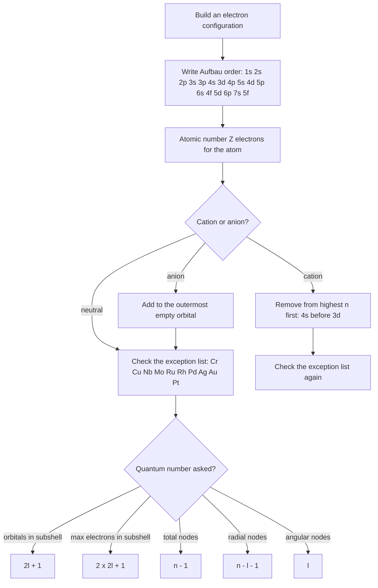

# Atomic Structure

Atomic Structure is the highest-weight topic in this subject and the one that pays back fastest, because almost every question is either a **configurations-and-quantum-numbers question** or a **numbers question** with one formula in it. There is no diagram interpretation, no data analysis, no derivation. Learn the four quantum numbers, the orbital filling order, the ion-formation rule, and the small set of constants, and you can clear this chapter.

### 🟢 Lite — Quick Review (1h–1d)

**The four constants you must know to three figures**

| Constant | Value | Where it is used |
| --- | --- | --- |
| Planck's constant h | 6.626 × 10⁻³⁴ J s | E = hν, λ = h/p |
| Velocity of light c | 3.0 × 10⁸ m s⁻¹ | E = hc/λ |
| Mass of electron mₑ | 9.11 × 10⁻³¹ kg | de Broglie, Rydberg |
| Charge on electron e | 1.602 × 10⁻¹⁹ C | KE = eV, all atomic energies |

**The formulas that appear again and again**

- **Photon energy:** E = hν = hc/λ. Energy in joules, frequency in s⁻¹.
- **Bohr energy of hydrogen:** Eₙ = −13.6/n² eV. n = 1, 2, 3 … → −13.6, −3.4, −1.51 eV.
- **Bohr angular momentum:** mₑvr = nh/2π, i.e. angular momentum is quantised as nh/2π = nħ.
- **de Broglie wavelength:** λ = h/mv. For an electron accelerated through a potential V volts, **λ(Å) = 12.27/√V**.
- **Photoelectric effect:** KE(max) = hν − φ, where φ is the work function. Threshold frequency ν₀ = φ/h; at ν = ν₀ the KE is exactly zero.
- **Uncertainty:** Δx · Δp ≥ h/4π. You cannot know position and momentum together exactly.

**Quantum numbers — ranges, memorise as a pattern**

| Number | Symbol | Allowed values | What it fixes |
| --- | --- | --- | --- |
| Principal | n | 1, 2, 3 … | shell size and (for H) energy |
| Azimuthal | l | 0 to n−1 | subshell shape: 0 = s, 1 = p, 2 = d, 3 = f |
| Magnetic | mₗ | −l to +l in steps of 1 | orientation in space |
| Spin | mₛ | +½ or −½ | spin direction |

Two consequences worth memorising: number of orbitals in a subshell = 2l + 1 (s → 1, p → 3, d → 5, f → 7), and maximum electrons in a subshell = 2(2l + 1) (s → 2, p → 6, d → 10, f → 14).

**Orbital filling order (Aufbau):**

1s → 2s → 2p → 3s → 3p → 4s → 3d → 4p → 5s → 4d → 5p → 6s → 4f → 5d → 6p → 7s → 5f

**Filling rules, in the order you apply them:**
1. **Aufbau** — fill the lowest-energy orbital available.
2. **Pauli** — no two electrons in the same atom may have all four quantum numbers identical, so an orbital holds at most 2 electrons and they must be opposite in spin.
3. **Hund** — within degenerate orbitals (same n, same l), fill each orbital singly with parallel spins before any pairing.
4. **Exception check** — if the configuration is Cr, Cu, Nb, Mo, Ru, Rh, Pd, Ag, Au or Pt, expect a half-filled or fully-filled d subshell instead.

### 🟡 Standard — Regular Study (2d–2mo)

#### How the models failed, and why the next one was needed

**Thomson (1897)** discovered the electron — charge 1.6 × 10⁻¹⁹ C, mass 9.1 × 10⁻³¹ kg — and modelled the atom as a positively charged sphere with electrons embedded, the plum pudding model. It was the first model to put negative charge inside positive charge, and it was destroyed by one experiment.

**Rutherford (1911)** fired alpha particles at gold foil. Most went straight through, showing the atom is mostly empty space. A very small fraction were deflected through large angles, and about one in twenty thousand bounced almost straight back, showing the mass and positive charge are concentrated in a tiny nucleus. The model failed for a different reason: a charged particle in circular motion radiates energy, so an orbiting electron should spiral into the nucleus in picoseconds. No one observes that.

**Bohr (1913)** fixed it with three postulates. Electrons revolve in fixed orbits without radiating. Angular momentum is quantised, mₑvr = nh/2π. Radiation is emitted or absorbed only when an electron jumps between orbits, and hν = E_final − E_initial. The orbits are not a physical picture — they are a way of saying that only certain energies are allowed. That is why Bohr works for hydrogen and hydrogen-like species (He⁺, Li²⁺) and breaks down for anything with more than one electron.

#### The hydrogen spectrum and what it proves

For hydrogen, Eₙ = −13.6/n² eV, so:

- n = 1 → 2: ΔE = 13.6(1 − 1/4) = 10.2 eV, absorbed (Lyman series, ultraviolet).
- n = 2 → 1: ΔE = −10.2 eV, emitted (same energy, Balmer series, visible).
- n = ∞ → 1: 13.6 eV, the ionisation energy of hydrogen.
- n = 3 or higher → 1: Paschen and Brackett series, infrared.

The critical exam point: **lines are discrete, not continuous**, and that alone proves energy is quantised. A continuous spectrum would mean any energy change is allowed, which is false. 1/λ = R_H(1/n₁² − 1/n₂²) with R_H ≈ 1.097 × 10⁷ m⁻¹. Three worked applications: find λ from a transition, find the frequency of a spectral line, and identify which series a given line belongs to from its region of the spectrum.

#### de Broglie, Heisenberg, Schrödinger

**de Broglie (1924)** proposed that matter has a wave character, λ = h/mv. For a cricket ball or a person, λ is absurdly small and irrelevant. For an electron it is not: accelerated through 100 V, λ = 12.27/√100 = 1.227 Å = 0.1227 nm, the same order as interatomic spacing, which is exactly why electron microscopes resolve atoms. Any MCQ asking "for which of these is λ significant" is answered by comparing λ with the object's size.

**Heisenberg** put a hard limit on knowledge: Δx · Δp ≥ h/4π. This is not an instrument defect; it is a property of nature. For an electron in an atom Δx is tiny, so Δp is large, and that is precisely why the idea of a fixed circular orbit was replaced by a probability cloud. An orbital is a region where the probability of finding the electron is high — |ψ|² is the probability density, and |ψ|²dV is the probability of finding it in that small volume.

**Schrödinger (1926)** wrote Ĥψ = Eψ, where ψ is the wave function and Ĥ the Hamiltonian (kinetic + potential energy operators). Solving it for hydrogen gives the same −13.6/n² energies that Bohr postulated by assumption, which is the real significance: quantisation now falls out of the mathematics rather than being imposed. Orbitals are labelled by n, l, mₗ, and the shape follows from l — s is spherical, p is dumbbell (three orientations from mₗ = −1, 0, +1), d and f have more complex shapes.

#### Electron configuration worked properly

**Iron, Z = 26:** [Ar] 4s² 3d⁶. The 4s orbital fills before 3d — lower energy in the neutral atom.

**Iron(III), Fe³⁺:** [Ar] 3d⁵. Electrons are removed from the highest-n shell first, so both 4s electrons go before any 3d electron. This single rule resolves most of the ion-configuration questions in this chapter.

**Iron(II), Fe²⁺:** [Ar] 3d⁶, which is exactly the Fe configuration minus the 4s pair.

**The exceptions, stated correctly.** Chromium is [Ar] 4s¹ 3d⁵, not 4s² 3d⁴, because a half-filled d subshell is more stable. Copper is [Ar] 4s¹ 3d¹⁰, not 4s² 3d⁹, because a completely filled d subshell is more stable. The other commonly-asked ones are Nb ([Kr] 4d⁴ 5s¹), Mo ([Kr] 4d⁵ 5s¹), Pd ([Kr] 4d¹⁰ 5s⁰) and Au ([Xe] 4f¹⁴ 5d¹⁰ 6s¹). If the question names one of these metals, do not write the Aufbau answer.

#### Three experiments that pin down the quantum model

**Rutherford's foil experiment** — the nucleus is small, dense and positive. **Stern–Gerlach** — a beam of silver atoms through a non-uniform magnetic field splits into exactly two components, not a continuous smear, showing space is quantised in the direction of the field, i.e. mₛ = ±½. **Zeeman effect** — putting an atom in a magnetic field splits its spectral lines because orbitals with different mₗ have different energies in the field. The normal Zeeman effect (singlet splitting) ignores spin; the anomalous effect (doublet splitting) includes it, and the anomalous pattern is what you actually observe for most atoms.

### 🔴 Extended — Deep Study (3mo+)

#### Why 4s fills before 3d but is removed first

This looks contradictory and it is the single most-asked "why" in the chapter. In the neutral atom, 3d and 4s are close in energy, and 4s is slightly lower, so it fills first. As 3d fills and its electrons begin to repel each other, the 3d level drops and the 4s level rises. By the time the atom is ionised, 4s is the higher-energy orbital and is emptied first. The filling order and the removal order are answering two different questions — energy in the neutral atom versus energy in the ion — and the two answers are genuinely different. Memorise the rule ("remove from the highest n") rather than trying to remember which orbitals move.

#### Radial nodes, angular nodes and the total

The total number of nodes in an orbital is n − 1. Radial nodes = n − l − 1. Angular nodes = l. The 1s orbital has 0 of each. The 2s has 1 radial node and 0 angular — which is why its probability is non-zero at the nucleus, unlike 2p. The 3d has 1 radial node (3 − 2 − 1) and 2 angular nodes. A very common question gives n and l and asks for the node count, or gives the shape of the angular distribution and asks which l it is; those are the same question in reverse.

#### Photoelectric effect — the three questions it is used for

The effect shows light delivers energy in discrete packets, and it is the experimental proof of the photon.

- **Threshold frequency ν₀ = φ/h.** Below it, no electrons are emitted at all, no matter how intense the light.
- **KE(max) = hν − φ.** Above threshold, intensity changes the *number* of electrons emitted, not their kinetic energy. Only frequency changes the energy.
- **Work function φ = hν₀**, in joules, for the metal.

A stopping-potential question gives eV₀ = hν − φ, where V₀ is the stopping potential; solve for φ, then for ν₀. The trap is mixing up φ in joules and in eV — h in J s gives φ in joules, h in eV s gives it in eV.

#### Worked Example — Bohr energy and emitted wavelength

An electron in hydrogen drops from n = 3 to n = 1.

1. ΔE = E₁ − E₃ = −13.6/1² − (−13.6/3²) = −13.6 + 1.511 = −12.09 eV. Negative, so energy is emitted.
2. Convert to joules: 12.09 × 1.602 × 10⁻¹⁹ = 1.937 × 10⁻¹⁸ J.
3. λ = hc/ΔE = (6.626 × 10⁻³⁴)(3.0 × 10⁸) / 1.937 × 10⁻¹⁸ = 1.026 × 10⁻⁷ m = **102.6 nm**, which is ultraviolet — the Lyman series, as it must be since n_f = 1.

Sanity check that catches most errors: Lyman (→1) is UV, Balmer (→2) is visible, Paschen and beyond (→3 and lower) are IR. If your line came out in the wrong region, check whether you used the right n_f.

#### Worked Example — de Broglie wavelength of an electron

An electron is accelerated through 150 V.

1. Direct route: λ(Å) = 12.27/√V = 12.27/√150 = 12.27/12.247 = 1.002 Å ≈ **0.100 nm**.
2. Check by the long route: energy gained = eV = 1.602 × 10⁻¹⁹ × 150 = 2.403 × 10⁻¹⁷ J. Speed from ½mv² = that energy gives v = 7.26 × 10⁶ m s⁻¹. Then λ = h/mv = 6.626 × 10⁻³⁴ / (9.11 × 10⁻³¹ × 7.26 × 10⁶) = 1.002 × 10⁻¹⁰ m = 1.002 Å. Both routes agree.
3. Interpretation: this is smaller than an atomic radius of about 0.1 nm, which is why the electron can be treated as a wave inside an atom.

#### Schrödinger equation, hydrogen wave functions, and the rest

Ĥψ = Eψ separates into a radial part and an angular part. Solutions are acceptable only when they are single-valued, finite at the nucleus, and normalisable — those three conditions are what force n, l and mₗ to be integers, so quantisation is a consequence of the maths, not an assumption. The 1s wave function is ψ = (1/√πa₀³)e^(−r/a₀), where a₀ = 0.529 Å is the Bohr radius, and |ψ|² is largest at r = 0. For n = 2 there are two subshells (2s, 2p) and three p orbitals; for n = 3 there are 3s, 3p and 3d, with 1 + 3 + 5 = 9 orbitals and a capacity of 18 electrons. The maximum electrons in shell n is 2n².

**Quantum tunnelling** is the other place this model earns marks: a particle with energy below a barrier has a non-zero probability of appearing on the other side. It is why the Sun fuses, why the scanning tunnelling microscope images single atoms, and why a NAND flash memory stores a charge — and it is the direct reason alpha decay happens despite the barrier.

### 🧠 Memory Anchors

- **Orbital order ladder — read it as pairs.** (1s) (2s 2p) (3s 3p 3d) (4s 3d 4p) (5s 4d 5p) (6s 4f 5d 6p) (7s 5f). The rule underneath is real and beats memorising the string: **fill by increasing (n + l); on a tie, fill the lower n first.** 4s has n+l = 4, 3d has n+l = 5, so 4s wins. 4p has n+l = 5 tied with 3d, so lower n wins: 3d first.
- **"S before D before F, and within a tie the lower shell wins."**
- **"Removal is the reverse question."** Fill: lowest energy in the neutral atom. Remove: highest n in the ion. Both rules fit in one breath.
- **"A half-filled d and a full d are both happy."** That single line explains every Aufbau exception on the list.
- **"Lyman UV, Balmer visible, Paschen IR."** Anchor them to n_f = 1, 2, 3.
- **"Intensity is quantity, frequency is quality."** Brighter light ejects more electrons; redder light ejects lower-energy ones.
- **"Nodes add up to n − 1."** Radial + angular = n − 1. Divide them with n − l − 1 and l.
- **Flashcard Q&A:**
  - *How many orbitals in 3d?* → 2(2) + 1 = 5. Max electrons 10.
  - *Max electrons in shell 3?* → 2n² = 18.
  - *Configuration of Cu²⁺?* → Cu is [Ar] 3d¹⁰ 4s¹, remove 4s first, then one 3d: [Ar] 3d⁹.
  - *Why does photoelectric intensity not change KE?* → each photon carries hν regardless of how many arrive.
  - *Angular nodes in 4p?* → l = 1, so 1.
  - *Threshold wavelength?* → ν₀ = c/λ₀ with λ₀ the longest wavelength that works.

### 🎯 Exam Traps & Error Log

1. **Writing 4s² 3d⁴ for chromium or 4s² 3d⁹ for copper.** Both are wrong; the exceptions are 4s¹ 3d⁵ and 4s¹ 3d¹⁰.
2. **Removing 3d electrons before 4s when forming a cation.** Always strip the highest n first.
3. **Allowing l = n.** l runs 0 to n−1, so a 2f orbital does not exist and 3d does.
4. **Forgetting the mₗ step is 1, not 2.** A d subshell has mₗ = −2, −1, 0, +1, +2.
5. **Packing three electrons into one orbital.** Pauli caps an orbital at 2 with opposite spins; Hund's rule puts them in separate orbitals first, which is why 2p² is two unpaired parallel electrons, not a pair.
6. **Saying a photon has mass.** Photons have zero rest mass; they have momentum p = h/λ and energy E = hν.
7. **Using h in eV s where J s is needed,** or writing 13.6 without the negative sign. A value of +13.6 eV for n = 1 is wrong.
8. **Assuming light below the threshold frequency does nothing at all.** Increasing intensity below ν₀ still ejects nothing — that is the finding, and it is the whole point of the experiment.
9. **Confusing ΔE sign.** Falling from 3 to 1 emits energy, so ΔE is negative; only the magnitude enters λ = hc/ΔE.
10. **Writing λ = h/mv for a macroscopic object and expecting it to be visible.** It exists; it is just 10⁻³⁰ m and irrelevant. The question is about magnitude, not existence.

### 🧪 Self-Test — 8 Questions with Worked Answers

Answer these on paper before reading the solution. Each maps to a form the chapter actually uses.

1. **How many orbitals and how many electrons can a 4f subshell hold?**
   l = 3, so orbitals = 2l + 1 = 7, and electrons = 2(2l + 1) = 14. Commonest wrong answer: 4 orbitals, confusing f with the 4th shell.
2. **Write the configuration of S²⁻ and state the total number of unpaired electrons.**
   S is Z = 16: [Ne] 3s² 3p⁴. Adding two electrons fills the remaining 3p orbital, giving [Ne] 3s² 3p⁶. All electrons paired, so zero unpaired.
3. **Which has the larger first ionisation enthalpy, N or O? Why?**
   Oxygen, even though it is further right. N is [He] 2s² 2p³ with three half-filled p orbitals, all unpaired and stable. O is [He] 2s² 2p⁴, which contains one already-paired p orbital; removing an electron from that pair gives a more stable half-filled arrangement. The exception to the left-to-right trend is explained by electron arrangement, not by size.
4. **An electron in hydrogen jumps from n = 2 to n = 4. Absorbed or emitted, and what frequency?**
   Absorbed, because n increased. ΔE = −13.6/16 − (−13.6/4) = −0.85 + 3.4 = +2.55 eV. ν = ΔE/h = (2.55 × 1.602 × 10⁻¹⁹)/(6.626 × 10⁻³⁴) = 6.17 × 10¹⁴ s⁻¹.
5. **Threshold frequency of a metal with work function 2.0 eV. Longest wavelength that will work?**
   ν₀ = φ/h = (2.0 × 1.602 × 10⁻¹⁹)/(6.626 × 10⁻³⁴) = 4.84 × 10¹⁴ s⁻¹. λ₀ = c/ν₀ = 3.0 × 10⁸/4.84 × 10¹⁴ = 6.2 × 10⁻⁷ m = 620 nm. Any longer wavelength fails.
6. **Give the number of radial and angular nodes in 3d, 4p and 5s.**
   Radial = n − l − 1, angular = l. 3d: 0 radial, 2 angular. 4p: 2 radial, 1 angular. 5s: 4 radial, 0 angular. Each pair sums to n − 1 as a check.
7. **Electron diffraction by a crystal proves what?**
   That electrons behave as waves, confirming de Broglie's λ = h/mv, since a crystal acts as a three-dimensional diffraction grating. It is the experimental proof, just as Stern–Gerlach is the proof of spin quantisation.
8. **Why is the Bohr model valid for He⁺ but not for He?**
   The derivation of E = −13.6/n² assumes a single electron outside a nucleus of charge +Ze. He⁺ satisfies that exactly. He has two electrons, so the electron–electron repulsion term has no place in the one-electron equation, and the predicted energy levels are wrong.

### 💡 Pro Tips

1. **Write the Aufbau ladder before every configuration question**, then tick orbitals off. Faster and far more reliable than recalling a 26-electron string.
2. **Convert every electron count back to Z at the end.** If a question says Fe³⁺, count the electrons: 26 − 3 = 23. If your configuration has a different number, you have dropped or added one.
3. **Memorise the two exceptions only if you have time.** Cr and Cu cover almost every question that tests exceptions at all; Nb, Mo and the platinum metals are rare and can be learned later.
4. **Keep a conversion card for h** in J s, eV s, and eV·nm. Most photoelectric and spectroscopy errors are unit errors, not concept errors.
5. **Do spectral-series questions by anchoring first** — identify n_f from the region of the spectrum, then compute. Computing first wastes time on the wrong branch.
6. **Practise the three Bohr calculations until they are boring:** ΔE between two levels, λ from ΔE, and ionisation energy from n = ∞.
7. **Use node count as a cross-check** on any orbital identification question. If the counts do not add to n − 1, the orbital is wrong.
8. **For nucleus-related questions, remember the scale.** Nuclear radius is about 10⁻¹⁵ m and atomic radius about 10⁻¹⁰ m — a factor of 10⁵. "Mostly empty space" is a numerical statement, not a figure of speech.

---

## Continue your study

- **[View this topic in your CUET UG roadmap](/roadmap/?exam=cuet&duration=1mo)** — see where "Atomic Structure" fits in your personalised plan
- **[Build a quick revision plan](/roadmap/?exam=cuet&duration=1d)** — 1-day sprint covering highest-weight topics
- **[CUET UG exam overview](/exams/cuet/)** — pattern, eligibility, and syllabus
- **[All Chemistry notes](/notes/cuet/chemistry/)** — browse sibling topics in this subject

*Content adapted based on your selected roadmap duration. Switch tiers using the selector above.*
