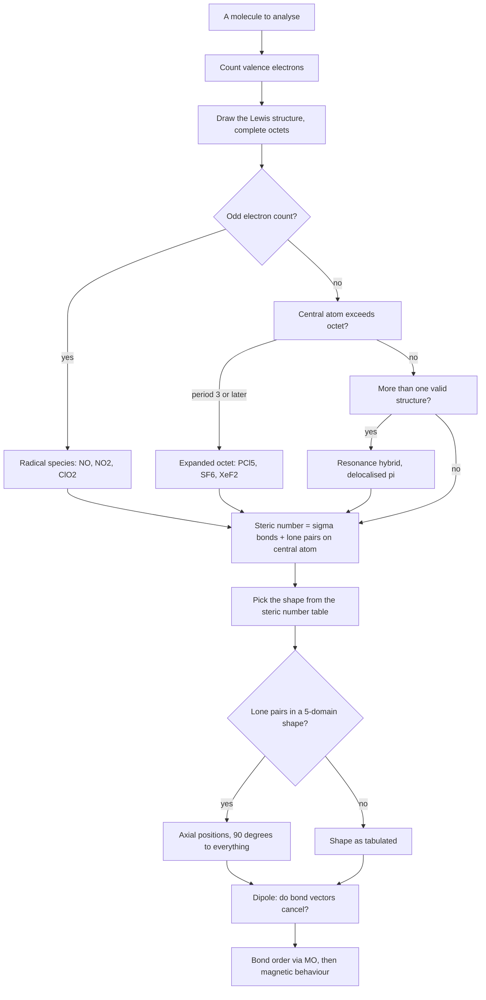

# Chemical Bonding

A chemical bond is a mutual electrostatic attraction that holds atoms together in a stable aggregate. Atoms bond because a bonded arrangement is lower in energy than isolated atoms — the electrons settle into orbitals that are more tightly held, and the nucleus–electron attraction beats the electron–electron repulsion. This chapter is a stack of five questions the exam keeps asking: **how many electrons are in the outer shell, who gets them, what shape results, is the molecule polar, and is it magnetic.** Learn the decision sequence and every question in the chapter reduces to it.

### 🟢 Lite — Quick Review (1h–1d)

| Question you are asked | The decision | The answer that usually follows |
| --- | --- | --- |
| Ionic, covalent or metallic? | Compare electronegativity difference and ionisation enthalpy | Large ΔEN + low IE of metal → ionic; similar EN → covalent |
| Complete the octet? | Count valence electrons against 8 (2 for H, He) | Exception list: BH₃, BeCl₂, NO, PCl₅, SF₆, XeF₂ |
| Shape of the molecule? | Steric number = σ-bonds + lone pairs on the **central atom** | 2 linear, 3 trigonal planar, 4 tetrahedral, 5 TBP, 6 octahedral |
| Is the molecule polar? | Do the bond dipoles cancel by symmetry? | CO₂, BF₃, CCl₄, XeF₄ → μ = 0 |
| Is it magnetic? | MO theory: any electron in a π* or σ* orbital? | O₂, NO → paramagnetic |
| Bond order and length | (N_b − N_a)/2 | N₂ = 3, O₂ = 2, O₂²⁻ = 1.5 |

**Key numbers and facts**
- **Electronegativity (Pauling):** F 4.0, O 3.5, Cl 3.0, N 3.0, Br 2.8, S 2.5, C 2.5, H 2.1, Na 0.9, K 0.8.
- **Dipole moment** μ = q·d; 1 Debye (D) = 3.33564 × 10⁻³⁰ C·m. H₂O = 1.85 D, NH₃ = 1.47 D, CH₄ and CO₂ = 0.
- **Bond order** = (N_b − N_a)/2, where N_b = bonding electrons and N_a = antibonding electrons.
- **Bond angles:** sp 180°, sp² 120°, sp³ 109.5°, sp³d 90° and 120°, sp³d² 90° and 180°.
- **Lone pairs squeeze angles:** CH₄ 109.5° → NH₃ 107° → H₂O 104.5°.

The one result a Lewis structure cannot give you: **O₂ is paramagnetic.** Two unpaired electrons in the π* antibonding orbitals, confirmed experimentally, and impossible to see from a Lewis picture. Any question that asks "explain why O₂ is attracted by a magnet" is an MO question, and MO theory is the only model in the syllabus that answers it.

### 🟡 Standard — Regular Study (2d–2mo)

#### Ionic, covalent and metallic bonding

**Ionic bonding** arises from complete electron transfer between atoms with a large electronegativity difference — typically a metal of low ionisation enthalpy combining with a non-metal of high electron affinity. The driving force is not just the transfer but the **lattice enthalpy**, the energy released when the cation and anion crystals assemble; a large lattice enthalpy overpowers the cost of ionisation. Consequences: high melting and boiling points, hard brittle solids that shatter rather than deform, and electrical conductivity only when molten or in aqueous solution, because the ions must be free to move. NaCl, MgO, K₂O, CaF₂ are the standard examples. Two factors make an ionic compound more stable: a smaller cation and anion, and higher charges. MgO melts higher than NaCl because Mg²⁺ and O²⁻ carry double charges.

**Covalent bonding** arises from sharing electron pairs, between atoms of similar electronegativity. It is what holds together everything organic, and also BF₃, SiO₂, HCl, NH₃, H₂O. Consequences: generally lower melting points, softer solids, and poor conductivity because no free ions exist. A polar covalent bond points toward the more electronegative atom, and that partial polarity is what makes water such a good solvent.

**Metallic bonding** is a sea of delocalised valence electrons held by a lattice of positive metal ions. This is why metals conduct as solids, are malleable and ductile (slip planes let layers move without breaking bonds), and why their conductivity falls with temperature — more lattice vibration scatters the electrons. Interstitial compounds and alloys are the applications.

#### Lewis structures, formal charge and resonance

Count valence electrons. Connect the atoms with single bonds, one pair per bond. Complete the octets of the outer atoms first, then the central atom. Push lone pairs onto the central atom only if it has an available octet. If electrons are still short, convert lone pairs into double or triple bonds.

**Formal charge = V − N − ½B**, where V is the free-atom valence count, N is the number of non-bonding electrons on that atom, and B is the number of bonding electrons around it. The lowest-energy structure minimises the formal charges, and any negative charge belongs on the more electronegative atom. Nitrogen in NH₄⁺ carries a formal charge of +1, which sounds wrong until you remember ammonium is a real, isolable ion; by the same token H is 0 in water and +1 in H₃O⁺.

**Resonance** arises when more than one valid Lewis structure exists for the same skeleton, differing only in electron placement. Ozone has two equivalent structures, benzene has two Kekulé structures, carbonate has three. The molecule is a single **resonance hybrid** — the true structure has a delocalised π system and fractional bond orders, not a molecule flipping between forms. The exam consequence: in ozone both O–O bonds are identical and intermediate in length between a single and a double bond, which is something no single Lewis structure predicts.

#### VSEPR and hybridisation

Electron pairs around the central atom repel each other, and the arrangement that minimises repulsion fixes the shape. Lone pairs occupy more space than bond pairs because their electron density is closer to one nucleus, so they compress the bond angles below the ideal.

| Steric number | Hybridisation | Shape | Ideal angle | Examples |
| --- | --- | --- | --- | --- |
| 2 | sp | Linear | 180° | BeCl₂, CO₂, HC≡CH |
| 3 | sp² | Trigonal planar | 120° | BF₃, SO₃, C₂H₄ |
| 4 | sp³ | Tetrahedral | 109.5° | CH₄, CCl₄, NH₃, H₂O |
| 5 | sp³d | Trigonal bipyramidal | 90°, 120° | PCl₅ |
| 6 | sp³d² | Octahedral | 90°, 180° | SF₆, XeF₄ |

The step students get wrong: **count lone pairs on the central atom only.** H₂O is sp³ because the central oxygen has 2 bonds + 2 lone pairs = 4 electron domains, even though the molecule looks bent and "half-formed". A double or triple bond counts as **one** domain — a C=O double bond is one electron pair for VSEPR purposes, which is why CO₂ is linear and not bent.

In the trigonal bipyramidal case the two **axial** positions are occupied first, because they suffer three 90° interactions, versus two 90° interactions for an equatorial position. That single rule determines every PCl₅, SF₄, ClF₃ and XeF₅ question: lone pairs go axial, and bulky double bonds also prefer equatorial positions.

### 🔴 Extended — Deep Study (3mo+)

#### Molecular orbital theory and bond order

Atomic orbitals combine across the whole molecule to form molecular orbitals. Bonding combinations (s + s, s + p) give one lower and one higher orbital; antibonding combinations give orbitals with a node between the nuclei and energy above the parent atomic orbitals. For molecules up to and including N₂ the relative order is σ1s, σ*1s, σ2s, σ*2s, π2pₓ = π2pᵧ, σ2p_z, π*2pₓ = π*2pᵧ, σ*2p_z. For **O₂, F₂ and 2p⁻ ions the order of σ2p and π2p reverses**, so σ2p_z lies below π2p. This reversal is the single most consequential detail in the topic and it is worth one line of memory: after nitrogen the two 2p levels swap.

Filling O₂: σ1s² σ*1s² σ2s² σ*2s² π2p⁴ σ2p², with two electrons in the degenerate π* orbitals, unpaired by Hund's rule. Bond order = (10 − 6)/2 = 2. Two unpaired electrons → paramagnetic, and the bond is shorter and stronger than O₂²⁻ (bond order 1.5) but longer than N₂ (bond order 3). Higher bond order means shorter bond and higher dissociation energy, always.

| Species | Bonding electrons | Antibonding | Bond order | Unpaired | Magnetic |
| --- | --- | --- | --- | --- | --- |
| N₂ | 10 | 4 | 3 | 0 | diamagnetic |
| O₂ | 10 | 6 | 2 | 2 | paramagnetic |
| O₂⁺ | 9 | 6 | 2.5 | 1 | paramagnetic |
| O₂²⁻ (peroxide) | 10 | 7 | 1.5 | 0 | diamagnetic |
| CO | 10 | 4 | 3 | 0 | diamagnetic |

#### Polarity, dipole moment and why symmetry wins

A bond is polar when the two atoms differ in electronegativity, roughly by more than 0.4 on the Pauling scale. But a **molecule** is polar only if those bond vectors fail to cancel. This is why geometry matters more than electronegativity in dipole questions.

- **CO₂:** two C=O bonds, each strongly polar, 180° apart, cancelling exactly. μ = 0.
- **BF₃:** three polar B–F bonds in a plane at 120°, cancelling exactly. μ = 0.
- **CCl₄:** four polar bonds in a tetrahedron, all components cancel. μ = 0.
- **CHCl₃:** same tetrahedral shape, but one H instead of a Cl breaks the symmetry, so μ ≠ 0. The shape did not change; the substituents did.
- **H₂O:** bent, 104.5°, bond vectors add along the bisector. μ = 1.85 D.
- **XeF₄:** square planar, all four bonds cancel. μ = 0 despite four polar bonds.

#### Hydrogen bonding

A hydrogen bond forms when H is attached to N, O or F and attracted to a lone pair on a neighbouring N, O or F. It is roughly 5–10 % as strong as a covalent bond, which is why it is strong enough to change bulk properties but weak enough to be broken and reformed constantly.

**Intermolecular** hydrogen bonding explains the anomalous boiling points of NH₃, H₂O and HF relative to their group hydrides (PH₃, H₂S, HCl), and water's high surface tension, high specific heat and excellent solvent behaviour. Across a period, H₂O > H₂S because the N, O, F bond is short enough to produce strong intermolecular H-bonds. Down a group, HF > HCl for the same reason — the H–F bond is short.

**Intramolecular** hydrogen bonding (o-nitrophenol, where the –OH reaches the adjacent –NO₂ group) locks a molecule into a closed shape, removes the intermolecular bonding, and therefore **lowers** the boiling point relative to the para isomer, which can only hydrogen-bond to other molecules. o-nitrophenol is also more acidic and more water-soluble. If a question compares ortho and para isomers of a phenol, this is the whole answer.

#### Fajans' rules — when an "ionic" compound is really covalent

Some compounds that look ionic are substantially covalent, and Fajans' rules say which. Covalent character increases when:
- the cation is **small** (higher charge density, stronger polarising power),
- the cation has a **high charge** (Al³⁺ over Na⁺),
- the anion is **large** (a big, easily-distorted electron cloud),
- the anion has a **high charge** (or a lone pair that can be pushed about — a polarisable anion).

So AlCl₃ is markedly covalent and NaCl is ionic; LiI is more covalent than LiF; and Al₂(SO₄)₃ behaves as a covalent compound. The mechanism is polarisation and distortion: the cation pulls the anion's electron cloud toward itself, and enough distortion turns a transfer into a share.

#### Worked Example — XeF₄, end to end

1. **Valence electrons:** Xe gives 8, each F gives 7, total 8 + 4(7) = 36.
2. **Steric number:** 4 bonds + 2 lone pairs on the central Xe = 6 → **sp³d², octahedral electron geometry**.
3. **Molecular shape:** with 2 lone pairs, the only arrangement that keeps all four lone pairs at 90° to each other is **square planar**. (The alternative, placing them trans, is what makes the point; if they were adjacent the dipoles would not cancel.)
4. **Dipole:** four Xe–F bonds in a plane, opposite bonds cancel → **μ = 0**.
5. **Hybridisation and shape:** sp³d², square planar, bond angles 90° and 180°.

Run all five steps in that order for any VSEPR question and you cannot lose marks on geometry, hybridisation and polarity in the same item.

### 🧠 Memory Anchors

- **"Count domains, not lines."** A double bond is one domain. VSEPR counts electron pairs around the central atom, and multiple bonds count once.
- **"Lone pairs go axial, bulky bonds go equatorial"** in trigonal bipyramidal. Both follow from wanting to minimise 90° interactions.
- **"Symmetry kills the dipole."** CO₂, BF₃, CCl₄, XeF₄, SF₆, C₂H₄, C₆H₆ — all non-polar despite polar bonds. One substituent changed flips the answer.
- **"After nitrogen, σ2p drops below π2p."** This one line explains why O₂ is paramagnetic and why N₂ is not.
- **"Bond order is the ruler."** Higher bond order → shorter bond → higher dissociation energy → more unpaired electrons is a separate question, not a related one.
- **"H-bonds need N, O or F."** If H is bonded to C, there is no hydrogen bond, however polar the molecule.
- **"Ortho down, para up."** Intramolecular H-bonding lowers boiling point and raises acidity relative to the para isomer.
- **Flashcard Q&A:**
  - *Shape of ClF₃?* → TBP with 3 equatorial lone pairs, so T-shaped, sp³d.
  - *Why is H₂O sp³ and not sp²?* → the central O has 4 electron domains, not 3.
  - *Bond order of O₂⁺?* → 2.5, one unpaired electron, paramagnetic.
  - *Which is more covalent, LiF or LiI?* → LiI, because I⁻ is larger and more polarisable.
  - *Formal charge on N in NH₄⁺?* → +1, and the ion is nonetheless stable.
  - *μ of CH₂Cl₂?* → non-zero; two Cl and two H in a tetrahedron do not cancel.
  - *How many lone pairs on the central atom in PCl₅?* → 0. Steric number 5, all five are bonds.

### 🧪 Self-Test — 8 Questions with Worked Answers

1. **Classify ClF₃: shape, hybridisation, bond angle, polarity.**
   Steric number 5 (3 bonds + 2 lone pairs) → sp³d, trigonal bipyramidal electron geometry. Lone pairs take the two axial sites, leaving three bonds equatorial, so the shape is **T-shaped** with 90° angles. The two F–Cl bond vectors do not cancel → **polar**, because only two of the three bonds have a directly opposite partner.
2. **Why is BeCl₂ an incomplete-octet exception while CCl₄ is not?**
   Be has only 2 valence electrons, so four bonds around it give 8 electrons total, and the compound is stable as a monomer. Carbon needs 4 bonds to reach an octet and is happy doing exactly that. Incomplete octets appear when the central atom has too few valence electrons to complete one comfortably.
3. **Give the formal charge on every atom of the nitrate ion, NO₃⁻.**
   One N=O double bond and two N–O single bonds, with one lone pair on each oxygen. N: 5 − 0 − ½(8) = 0. Double-bonded O: 6 − 4 − ½(4) = 0. Each single-bonded O: 6 − 6 − ½(2) = −1. Sum = 0 + 0 − 1 − 1 = −1, matching the charge on the ion. The charge is on the oxygens, the more electronegative element — the rule works.
4. **Why is BeF₂ more covalent than BeCl₂?**
   F is smaller and less polarisable than Cl, so it resists the polarising pull of the small, doubly charged Be²⁺. The larger, easily distorted Cl⁻ cloud gives away more electron density, so the bond moves toward sharing. Covalent character rises with cation charge and size, and with anion size — the Fajans' rules applied.
5. **Bond order of the O₂ molecule and the O₂⁺ cation, and which is paramagnetic?**
   O₂ has 10 bonding and 6 antibonding electrons → bond order 2, two unpaired π* electrons, paramagnetic. O₂⁺ loses one electron from π*, the highest-energy occupied level → 9 bonding, 6 antibonding → bond order 2.5, one unpaired electron, still paramagnetic, and the bond is shorter and stronger.
6. **Is ozone a resonance hybrid? Predict its O–O bond length relative to a typical O–O single bond.**
   Yes. Two equivalent Lewis structures, so the true structure has a delocalised π system spread over all three atoms, and both O–O bonds are identical and shorter than a normal O–O single bond. Resonance is a description of one real structure, not a molecule oscillating between two drawings.
7. **Rank the boiling points of HF, HCl, HBr and HI.**
   HCl < HBr < HI < HF. The first three increase down the group because polarisability and dispersion forces grow as the halogen gets larger. HF breaks the pattern and sits far above HCl because it forms strong intermolecular hydrogen bonds, and the H–F bond is short enough for that to happen.
8. **What is the hybridisation and shape of XeF₄, and why is it non-polar?**
   Six electron domains → sp³d², octahedral electron geometry. With two lone pairs in opposite axial positions, the four Xe–F bonds form a square plane, and each bond has an exactly opposite partner, so the vectors cancel and μ = 0.

### 🎯 Exam Traps & Error Log

1. **Deciding ionic versus covalent by a single "transfer or share" test when the species is a polyatomic ion.** A coordinate bond is not a third kind of bond; it is a covalent bond in which both electrons came from one atom, and that is the same bond that already exists in NH₄⁺, H₃O⁺ and the H₃O⁺⋯H₂O hydrogen-bonded complex. Labelling it separately is a description of its origin, not its nature.
2. **Forgetting lone pairs when counting the steric number.** Most wrong shapes come from counting only bonds.
3. **Counting a double bond as two domains** in VSEPR, which turns CO₂ "bent" and breaks the whole question.
4. **Placing lone pairs equatorially in a trigonal bipyramidal shape.** They go axial.
5. **Calling a symmetric molecule polar.** Symmetry cancels; check the geometry before the electronegativities.
6. **Judging polarity from the molecule, not the central atom,** for things like CHCl₃ where the shape is symmetric but the substituents are not.
7. **Assuming any molecule with an odd electron count is paramagnetic without checking O₂⁻, NO₂⁺ and similar radicals** — and assuming a closed-shell species like O₂²⁻ is magnetic when it is not.
8. **Using the N₂ orbital order for O₂.** Reversal happens after nitrogen.
9. **Explaining O₂ paramagnetism with a Lewis structure.** The Lewis structure cannot; that is the entire point of the question.
10. **Forgetting that ortho-nitrophenol hydrogen-bonds to itself,** which is what makes it less volatile and more acidic than the para isomer.
11. **Reversing the Fajans' rules trend.** Covalent character increases with **smaller** cation and **larger** anion, not the reverse.

### 💡 Pro Tips

1. **Answer in a fixed order every time:** Lewis structure → steric number → shape → polarity → bond order/magnetism. Skipping to the shape guesses; the sequence takes 60 seconds and removes the guessing.
2. **Draw the structure before naming it.** Most shape errors come from a mental picture built from the formula alone.
3. **Keep the electronegativity ladder in one line** and use it only for deciding which atom takes the negative charge. Everything else follows from geometry.
4. **Memorise the exceptions as a list of formulas** — BH₃, BeCl₂, NO, NO₂, PCl₅, SF₆, XeF₂ — rather than trying to derive them. They are data, not deductions.
5. **Learn MO order for N₂ and F₂ separately.** They are two different strings, and reading the F₂ one as the N₂ one is the standard mistake.
6. **For dipole questions, draw the symmetry first,** then the arrows. Symmetry explains more than electronegativity does.
7. **Practise the steric-number table until it is reflexive** — six rows, and every VSEPR question in the chapter is a lookup into it.
8. **When a question says "explain", reach for the model, not the observation.** Molecular shape, polarity and magnetism each have a different correct explanation tool, and mixing them is the most common reason a well-known fact loses its mark.

---

## Continue your study

- **[View this topic in your CUET UG roadmap](/roadmap/?exam=cuet&duration=1mo)** — see where "Chemical Bonding" fits in your personalised plan
- **[Build a quick revision plan](/roadmap/?exam=cuet&duration=1d)** — 1-day sprint covering highest-weight topics
- **[CUET UG exam overview](/exams/cuet/)** — pattern, eligibility, and syllabus
- **[All Chemistry notes](/notes/cuet/chemistry/)** — browse sibling topics in this subject

*Content adapted based on your selected roadmap duration. Switch tiers using the selector above.*
