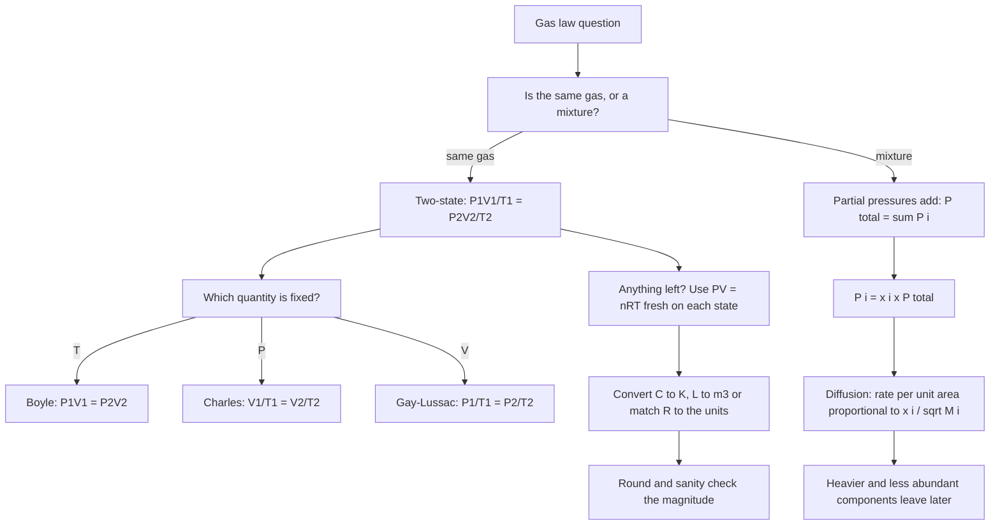

# States of Matter

States of matter is a small chapter with a high hit rate, because almost every question is a single rearrangement of **PV = nRT** and the traps are all unit errors. The three things that lose marks are: using Celsius where kelvin is required, using the 22.4 L figure at the wrong temperature, and inverting Graham's law. Learn the equation, the four named laws, and the three conversions, and this chapter is done.

### 🟢 Lite — Quick Review (1h–1d)

**The one equation:** **PV = nRT**

| Symbol | Value / unit | Trap to avoid |
| --- | --- | --- |
| P | pascal (Pa), 1 atm = 101325 Pa = 101.325 kPa | Mixing Pa and atm in the same line of working |
| V | m³ if P is in Pa; **litres if P is in L·atm** | 1 L = 1 dm³ = 10⁻³ m³ |
| n | moles | — |
| R | 8.314 J mol⁻¹ K⁻¹ (Pa·m³ units); 0.0821 L·atm mol⁻¹ K⁻¹ | Two different R values — match R to the units of P and V |
| T | kelvin, always. K = °C + 273.15 | This is the single most common error in the chapter |

**The four named laws, and what each holds constant**

| Law | Constant | Relation |
| --- | --- | --- |
| Boyle's | T | P₁V₁ = P₂V₂ |
| Charles's | P | V₁/T₁ = V₂/T₂ |
| Gay-Lussac's (Amontons's) | V | P₁/T₁ = P₂/T₂ |
| Avogadro's | P and T | V₁/V₂ = n₁/n₂ |

**The molar-volume figures, and why they differ**

| Condition | T | P | Molar volume |
| --- | --- | --- | --- |
| STP (school convention) | 273 K | 1 atm | **22.4 L mol⁻¹** |
| IUPAC STP | 273 K | 1 bar | **22.7 L mol⁻¹** |
| SATP (room conditions) | 298 K | 1 bar | **24.8 L mol⁻¹** |

These three are the most confused numbers in Class 11. If a question says 22.7 L, it means 0 °C **and 1 bar** — not 25 °C. If it says 22.4 L, it means 0 °C and 1 atm. Read the pressure before you assume the temperature.

**Also in the Lite tier:**
- **Graham's law:** r₁/r₂ = √(M₂/M₁). The ratio of rates is the *square root of the inverse ratio of masses*, so the lighter gas is on the numerator.
- **Dalton's law:** P_total = P₁ + P₂ + …, each Pᵢ being the partial pressure of one component of a gas mixture.
- **Average translational kinetic energy per molecule = (3/2)k_BT**, with k_B = 1.381 × 10⁻²³ J K⁻¹. It depends on temperature only — not on the mass of the molecule. This is why absolute zero is a real floor: kinetic energy cannot be negative.
- **At absolute zero** (0 K = −273.15 °C) the translational motion of an ideal gas ceases.

### 🟡 Standard — Regular Study (2d–2mo)

#### What actually changes between the three states

The state of a substance is set by the balance between **kinetic energy**, which scales with temperature, and **intermolecular forces**, which depend on the molecule.

- **Solids:** particles vibrate about fixed lattice positions, with strong forces holding them. Fixed shape *and* fixed volume. Incompressible.
- **Liquids:** fixed volume, shape of the container. Particles stay in contact but slide past one another. Nearly incompressible, and the only liquids that expand on freezing are water and its close relatives.
- **Gases:** fill the container completely, large empty gaps between particles, freely moving, highly compressible, indefinite volume.

The intermolecular forces that matter, strongest to weakest: **hydrogen bonding** > **dipole–dipole** > **London dispersion forces**. London forces apply to every atom and molecule, and they grow with molar mass and with surface area — which is why higher alkanes have higher boiling points, and why noble gases condense at all.

#### Dalton's law and partial pressures

For a mixture of non-reacting gases, the total pressure equals the sum of the partial pressures, and each partial pressure is what that gas would exert alone in the same volume at the same temperature. P_i = n_iRT/V, so the partial pressures are in the same ratio as the mole fractions: P_i = x_i · P_total.

Two consequences the exam likes. First, the gas that contributes most molecules contributes most pressure. Second, in **Graham's law for a mixture**, the rate of diffusion of each component is proportional to 1/√M_i, so heavy components diffuse more slowly and contribute less per unit time at the same concentration.

#### Kinetic theory and the three laws derived from it

The kinetic theory says a gas is a swarm of point particles in random motion, colliding elastically with each other and with the walls. Collisions with the walls produce pressure. From that single picture all four laws fall out:

- Pressure comes from **momentum transfer at the walls** → halving the volume doubles the number of collisions per second → **Boyle's law**.
- Adding energy at constant volume increases the speed of the particles → more force per collision → **Gay-Lussac's law**.
- At constant pressure, extra energy goes into motion and the gas expands → **Charles's law**.
- Doubling the number of particles doubles the collisions → **Avogadro's law**.

The theory also fixes the ceiling: (3/2)k_BT per molecule cannot be negative, so T cannot go below 0 K. This is the strongest argument for absolute zero as a physical limit rather than a mathematical convenience.

#### Vapourisation, saturated vapour pressure and boiling

**Vapour pressure** is the equilibrium pressure of the vapour above a liquid in a closed container. It depends on the liquid and the temperature — and on nothing else. Not the volume of the container, not the amount of liquid, not the shape of the vessel. A question that tries to make it depend on volume is testing this.

- In an open vessel the vapour escapes, so evaporation continues indefinitely and the rate depends on surface area, temperature, humidity and wind.
- In a closed vessel the vapour builds up until condensation balances evaporation — **dynamic equilibrium** — and the pressure at that point is the saturated vapour pressure.
- **Boiling** happens when the vapour pressure of the liquid equals the external pressure. Raising pressure raises the boiling point, which is exactly how a pressure cooker works, and it is why water boils at 100 °C at 1 atm but not at 250 °C in the Himalayas.
- **Relative humidity** is the ratio of the current vapour pressure to the saturated vapour pressure at the same temperature, as a percentage. It is not a statement about how much water is in the air, which is why it drops when air is heated without adding moisture.

#### Real gases and the van der Waals equation

An ideal gas assumes molecules have **no volume** and **no attractions**. Both are false, so real gases deviate — badly at high pressure and low temperature, which is exactly where molecular volume matters and attraction dominates.

**Compressibility factor Z = PV/nRT.** Z = 1 for an ideal gas. Z > 1 at high pressure, because the molecules have finite volume and the volume measured is not quite the volume available. Z < 1 at moderate pressure and low temperature, because attractions pull molecules inward, requiring a lower external pressure to produce the same PV. Every Z question is a question about which effect is winning.

The van der Waals equation corrects both:

**(P + an²/V²)(V − nb) = nRT**

- **b** accounts for molecular volume: molecules are not points, so the volume available to move in is V − nb.
- **a** accounts for intermolecular attraction: the effective pressure is P + an²/V².

At the **critical point** the liquid and vapour phases become indistinguishable, and above the **critical temperature** no amount of pressure can liquefy the gas — which is why nitrogen cannot be liquefied by pressure alone at room temperature, but can if it is first cooled below 126 K. Below the critical temperature, pressure alone will liquefy it. The corresponding van der Waals constants for a real gas are a = 27R²T_c²/64P_c and b = RT_c/8P_c.

#### The unified gas law

Every two-state question is covered by **P₁V₁/T₁ = P₂V₂/T₂**, from which Boyle's, Charles's and Gay-Lussac's all drop out as special cases. The two-state questions that appear most often:

- **Change in T and V at constant P** → Charles's law, V ∝ T.
- **Change in T and P at constant V** → Gay-Lussac's, P ∝ T.
- **Change in P and V at constant T** → Boyle's, P ∝ 1/V.
- **Adding a gas to a fixed volume** → use PV = nRT twice, or add the partial pressures.
- **Two gases mixed in fixed volumes, then the partition removed** → apply Boyle's to each gas separately over its own expansion, then add pressures. Do not average pressures.

### 🔴 Extended — Deep Study (3mo+)

#### Beyond the three states

**Plasma** is the fourth common state: a gas so energised that electrons have been stripped from nuclei, giving free electrons and ions. It is the state of every star, of lightning, of neon signs and fluorescent tubes, and of the interior of a tokamak. It is also the state reached in an **electrical discharge tube** used in chemistry, where the gas glows because excited atoms emit light as they return to lower states.

**Bose–Einstein condensate** is the opposite extreme. Below a critical temperature of order 10⁻⁹ to 10⁻⁷ K, bosons (particles with integer spin, so not constrained by the Pauli exclusion principle) all fall into the lowest quantum state. A macroscopic number of particles then shares one state, and the condensate shows interference effects visible to the naked eye.

**Liquid crystals** have orientational order but translational freedom: they flow like liquids but have molecules aligned along a preferred direction, and they change sharply between solid, liquid-crystalline and isotropic phases. Thermometers and the displays in calculators use them.

#### Worked Example 1 — Pressure from moles, volume and temperature

A 2.00 L flask at 27 °C contains 0.500 mol of N₂. What pressure does it exert?

1. Convert the temperature: T = 27 + 273.15 = 300.15 K. **Skip this step and the answer is 14 % low**, which is the classic trap.
2. Volume in SI: V = 2.00 × 10⁻³ m³.
3. Use R = 8.314 J mol⁻¹ K⁻¹, which matches Pa and m³.
4. P = nRT/V = (0.500)(8.314)(300.15)/(2.00 × 10⁻³) = 1247.7/0.002 = **6.24 × 10⁵ Pa**.
5. In other units: 6.24 × 10⁵/101325 = 6.16 atm, or 624 kPa.

Check the answer is physically sensible: 0.5 mol in 2 L at 300 K is a dense gas, so several atmospheres is right. A result near 6 Pa would mean you slipped two decimal places somewhere.

#### Worked Example 2 — Molar volume at 25 °C, 1 bar

Molar volume at 1 bar and 25 °C: V = RT/P = (0.08314 L·bar mol⁻¹ K⁻¹)(298.15 K)/(1 bar) = 24.79 L mol⁻¹.

So 1 mol of an ideal gas at room conditions and 1 bar occupies about **24.8 L**, not 22.4 and not 22.7. The 22.4 L figure belongs to 273 K and 1 atm; 22.7 L belongs to 273 K and 1 bar. If a question says 22.7 L, do not use a room temperature in the working.

#### Worked Example 3 — A gas expands while being cooled

A gas occupies 4.0 L at 300 K. The temperature falls to 250 K while the pressure stays constant. What is the new volume?

V₂ = V₁ × T₂/T₁ = 4.0 × 250/300 = **3.33 L**. Lower temperature at constant pressure means a smaller volume, which is the sanity check that catches an inverted Charles's law.

#### Worked Example 4 — Diffusion of two gases

A mixture of hydrogen and oxygen escapes through a small hole. Compare their rates, then find the composition of the gas that emerges first in the first second.

1. M(H₂) = 2, M(O₂) = 32, so r(H₂)/r(O₂) = √(32/2) = √16 = 4.
2. Hydrogen escapes **4 times faster**.
3. Since escape is proportional to mole fraction × rate, the first gas out is enriched in the faster component. With equal mole fractions the H₂ : O₂ ratio in the first fraction out is 4 : 1, not 1 : 1 — this is the basis of the method of fractional distillation and of the enrichment step in the separation of isotopes.

#### Worked Example 5 — Compressibility factor

A gas at high pressure gives Z = 1.4, and another at moderate pressure and low temperature gives Z = 0.9. Explain both.

Z = PV/nRT. For Z = 1.4, PV exceeds nRT, so the measured PV is larger than the ideal value — molecules have **finite size**, so the free volume is smaller than V and pressure rises faster than ideal. For Z = 0.9, PV is smaller than ideal — **intermolecular attractions** reduce the wall collision frequency, so a lower pressure gives the same PV. Z = 1 at intermediate conditions, where the two effects roughly cancel.

### 🧠 Memory Anchors

- **"Kelvin or nothing."** T = °C + 273.15 in every single line of working, written down once at the top.
- **"Match R to the units."** Pa and m³ with R = 8.314; L and atm with R = 0.0821. Mixing the two is the most common way to be wrong by a factor of a thousand.
- **"22.4 / 22.7 / 24.8, in that order, is 273 K-atm / 273 K-bar / 298 K-bar."** Three numbers, one ladder, no ambiguity.
- **"Lighter is faster, and the ratio is a square root."** Inverting either half of Graham's law costs the mark.
- **"Z above 1 means size, Z below 1 means attraction."** One line covers every compressibility question.
- **"Vapour pressure depends on liquid and temperature — nothing else."** Not the container, not the volume, not the quantity.
- **"Kinetic energy depends on T, not on M."** A heavy gas and a light gas at the same temperature have the same average translational kinetic energy, which is why ½mv̄² being equal for all gases at one temperature is a theorem rather than a coincidence.
- **Flashcard Q&A:**
  - *1 atm in Pa?* → 101325 Pa, or 101.325 kPa.
  - *Boyle's law constant?* → temperature.
  - *Gay-Lussac's constant?* → volume. Boyle's fixes T, Gay-Lussac's fixes V.
  - *Graham's law for H₂ : He?* → √(4/2) = 1.41, hydrogen faster.
  - *Why is 22.4 L wrong at 25 °C?* → it is the 0 °C, 1 atm figure; at 25 °C and 1 bar the value is 24.8 L.
  - *Boiling point of water in Leh?* → below 100 °C, because the lower atmospheric pressure lets it boil once the vapour pressure matches it.
  - *Two gases mixed in fixed volumes, partition removed?* → apply Boyle's to each gas separately, then add the pressures.
  - *N₂ critical temperature?* → 126 K, which is why compression alone cannot liquefy it at room temperature.

### 🧪 Self-Test — 8 Questions with Worked Answers

1. **A 3.0 L container holds 0.200 mol of gas at 300 K. Pressure in atm?**
   Use R = 0.0821 L·atm mol⁻¹ K⁻¹ so the litres and atmospheres match: P = nRT/V = (0.200)(0.0821)(300)/3.0 = 4.926/3.0 = 1.64 atm. Using R = 8.314 here gives a number 100 times too large, which is the whole lesson about matching R to the units.
2. **Which has the higher vapour pressure, water at 40 °C or water at 80 °C? Does it change if you double the volume of the container?**
   Water at **80 °C**, because vapour pressure rises with temperature — molecules have more kinetic energy and escape the liquid more readily. Doubling the container volume changes **nothing**: the extra headspace simply allows more vapour to accumulate, and a new equilibrium at the same saturated vapour pressure is reached. Saturated vapour pressure is a function of the liquid and the temperature only.
3. **Two samples of gas, 4 g of He and 4 g of Ar. Which has the greater rms speed, and what is the ratio?**
   v_rms = √(3RT/M), so speed varies as 1/√M. M(He) = 4, M(Ar) = 40, so v(He)/v(Ar) = √(40/4) = √10 = 3.16. Helium atoms move about 3.2 times faster. Note that the ratio is the same form as Graham's law, because both follow from the same kinetic theory.
4. **A real gas gives Z = 0.85. Which correction is larger, the volume effect or the attraction effect, and at what conditions would you expect this?**
   The **attraction effect** is larger, since Z < 1 means PV is less than the ideal nRT. This happens at moderate pressure and low temperature, where molecules are far enough apart to move but close enough that attractions hold them back. At very high pressure the finite-volume term takes over and Z rises above 1.
5. **Explain why a pressure cooker cooks faster than an open pan.**
   The boiling point is set by the condition that the vapour pressure equals the external pressure. Sealing the cooker raises the internal pressure above atmospheric, so the liquid must be heated to a higher temperature before its vapour pressure matches it. The water then works at about 120 °C instead of 100 °C, and food cooks faster. In the Himalayas the opposite happens: lower external pressure, lower boiling point, and water never gets hotter than that.
6. **Convert 2.5 atm into Pa and into bar.**
   2.5 × 101325 = 253,312 Pa, i.e. 2.53 × 10⁵ Pa. In bar, 1 bar = 10⁵ Pa, so 253,312 Pa = 2.533 bar. The atm-to-bar factor is very close to 1.013, which is why the difference between the 22.4 L and 22.7 L molar volumes is only about 1.3 %.
7. **A mixture contains 2 mol of N₂ and 1 mol of O₂ at 1 atm total pressure. Partial pressures?**
   Mole fractions: x(N₂) = 2/3, x(O₂) = 1/3. So P(N₂) = 0.667 atm and P(O₂) = 0.333 atm, summing to 1 atm. Nitrogen contributes two-thirds of the pressure because it is two-thirds of the molecules — pressure tracks mole number, not mass, which is why the 64 g of N₂ and 32 g of O₂ do not contribute equally.
8. **Does the average kinetic energy of a gas depend on its molar mass?**
   **No.** The average translational kinetic energy per molecule is (3/2)k_BT, a function of temperature alone. So 1 g of hydrogen and 1 g of argon at 300 K have the same average kinetic energy per molecule, but the hydrogen molecules move faster because they are lighter: v_rms ∝ 1/√M, and M(H₂) = 2 against M(Ar) = 40, so hydrogen moves √20 ≈ 4.5 times faster. The thermal energy *of the sample* is a different question — it scales with the number of molecules, so 1 g of hydrogen (0.5 mol) holds far more total energy than 1 g of argon (0.025 mol).

### 🎯 Exam Traps & Error Log

1. **Using 22.4 L at 25 °C.** 22.4 L mol⁻¹ belongs to 273 K and 1 atm. At 25 °C and 1 bar the answer is 24.8 L mol⁻¹. This error is baked into a lot of answer keys, so quote the conditions you assumed.
2. **Using 22.7 L as a room-temperature value.** 22.7 L is 0 °C at 1 bar — the IUPAC STP. Mixing it with a 25 °C stem is a double error.
3. **Forgetting °C → K.** Always 273.15, always written down.
4. **Using R = 8.314 with litres, or R = 0.0821 with m³.** Match the two.
5. **Inverting Graham's law** so the heavier gas appears faster. r₁/r₂ = √(M₂/M₁) puts the *other* gas's mass on top.
6. **Treating vapour pressure as volume-dependent.** It is not.
7. **Confusing Boyle's with Gay-Lussac's.** Boyle's holds T constant; Gay-Lussac's holds V constant.
8. **Assuming a gas has no intermolecular forces.** It has weak ones — that is exactly why it deviates from ideal behaviour and why it condenses at all.
9. **Adding pressures in the two-state form.** For mixtures, apply Boyle's to each gas over its own volume and add partial pressures at the end.
10. **Averaging pressures after mixing equal volumes.** Each gas expands to the full combined volume, so the final pressure is the sum of what each exerts in that volume.
11. **Treating total pressure as a mass-weighted average.** Partial pressures follow **mole** fractions, so the more abundant molecules dominate regardless of their mass.

### 💡 Pro Tips

1. **Write the given and required quantities with their units, then convert, then substitute.** Three lines, no room for a unit error.
2. **Put the temperature conversion on the first line of every solution,** even when the number looks obviously right.
3. **Keep a one-line unit ladder on the back of your revision sheet:** Pa, kPa, atm, bar, L, m³, and the two R values.
4. **Sanity-check the magnitude of every answer.** A gas at 300 K and 1 atm is around 24 L per mole. If your answer says 24 m³ per mole, the error is in the powers of ten.
5. **Answer trend questions before calculation.** "Does P rise or fall when V halves at constant T?" is a one-second question; taking it on trust from the law is faster than computing.
6. **Memorise Graham's law as a ratio of rates to one square root**, and rehearse the two-alkane example (CH₄ : C₂H₆ = 1 : 1.22) so the direction is automatic.
7. **For Z questions, name the cause, not just the number.** A full answer says "Z > 1, because of the finite volume of the molecules", and that sentence is most of the mark.
8. **Connect the chapter to the pressure cooker and the mountain kettle.** The vapour-pressure rule is a lab and kitchen fact, and remembering it as one keeps the sign of every boiling-point question right.

---

## Continue your study

- **[View this topic in your CUET UG roadmap](/roadmap/?exam=cuet&duration=1mo)** — see where "States of Matter" fits in your personalised plan
- **[Build a quick revision plan](/roadmap/?exam=cuet&duration=1d)** — 1-day sprint covering highest-weight topics
- **[CUET UG exam overview](/exams/cuet/)** — pattern, eligibility, and syllabus
- **[All Chemistry notes](/notes/cuet/chemistry/)** — browse sibling topics in this subject

*Content adapted based on your selected roadmap duration. Switch tiers using the selector above.*
