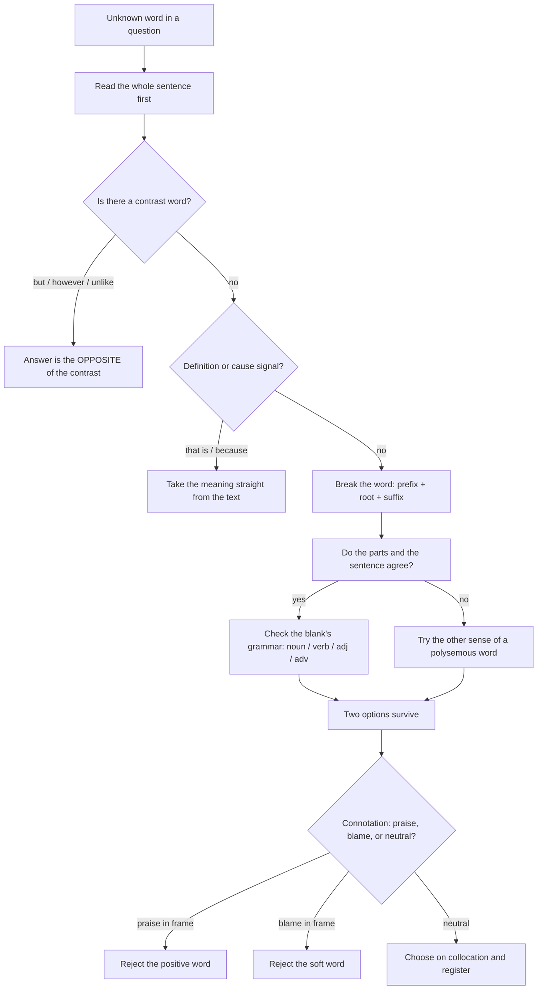

# Vocabulary

Vocabulary in a CUET UG English paper is not a list to memorise. It is a set of *clues* you read in about three seconds, plus the judgement to pick the option that fits the sentence you are actually looking at. Almost every vocabulary question in a language-ability paper arrives wrapped in context: a word inside a passage, a blank in a sentence with grammar doing the work, a near-synonym in a line that already hints at the meaning. That is good news. You do not need a dictionary head of every English word; you need four reliable skills — reading the clue, decoding the word's parts, knowing which words travel together, and telling a near-synonym's *connotation* from its dictionary definition.

Treat the four skills as a chain, and the chain is the whole chapter:

**clue → collocation → connotation → fit.** Read the sentence for a clue. Use collocation to rule out options that cannot sit in that structure. Use connotation to separate the two survivors. Choose on fit, never on how familiar the word looks.

### 🟢 Lite — Quick Review (1h–1d)

**The four context clues, in the order to look for them**

| Clue type | Signal words you will actually see | What it hands you |
| --- | --- | --- |
| Definition | *that is, i.e., refers to, known as, defined as* | The meaning directly, before the options |
| Contrast / contrastive | *but, however, unlike, whereas, rather than, instead of* | The **opposite** of the unknown word — fastest route to the answer |
| Cause–effect | *because, since, therefore, so that, led to, result of* | A situation that produces the unknown word |
| Repetition / example | *such as, for instance, examples include, like* | A family the word belongs to |

Contrast clues are the highest-yield type in objective papers because a contrast word gives you the antonym directly, and antonyms are far easier to recognise than definitions.

**Word families — the affixes that earn marks**

- **Negative prefixes:** un- (unhappy), in-/im-/il-/ir- before *b, m, p* (impossible, imbalanced, illicit, irregular), dis- (disagree, dislike, distrust), non- for neutrality of status (non-smoker, non-violent), mis- for a wrong action (misinterpret, miscalculate).
- **Direction and degree:** re- (rewrite), over- (overstate), under- (underestimate), inter- (interact), trans- (transfer), sub- (submit), super- (supervise), counter- (counter-argument, counterfeit).
- **Verb → noun:** -tion/-sion (solution), -ment (payment), -ance/-ence (importance), -ity (ability), -ship (friendship), -ism (criticism).
- **Adjective → noun:** -ness (darkness), -th (truth, length), -ty/-ety (novelty) — note *novelty* from *novel*.
- **Adjective from verb:** -able/-ible (capable, possible), -ive (active), -ous (dangerous), -al (national), -ful (careful), -less (careless), -ant/-ent (different).
- **Person and field:** -ist (journalist), -ee/-er/-or (volunteer), -ian (musician), -logy (biology), -scope (telescope).

The spellings that trip candidates sit in one family: **-able vs -ible** follows stress, not whim. If the stress falls on the last syllable, use **-ible** (*pos-si-ble*, *in-cre-dible*); if it falls earlier, use **-able** (*ca-pa-ble*, *re-li-a-ble*). The standard exceptions you should stop fighting are *comfortable* and *valuable*.

**The collocation pairs that decide questions**

| Pair | The test that settles it |
| --- | --- |
| make / do | *make* a mistake, a decision, progress; *do* homework, business, damage |
| raise / rise | *raise* is transitive — someone raises something; *rise* is intransitive — it rises by itself |
| affect / effect | *affect* is the verb; *effect* is the noun (and the rare verb, "they effected a change") |
| adopt / adapt | *adopt* a policy or a child; *adapt* yourself to change |
| principal / principle | *principal* = head or chief; *principle* = a rule or belief |
| emigrate / immigrate | both take **to**; *emigrate* leaves, *immigrate* arrives |
| discreet / discrete | *discreet* = tactful; *discrete* = separate, distinct |
| ensure / insure / assure | ensure it happens; insure against loss; assure a person |
| complement / compliment | *complement* completes; *compliment* praises |
| site / sight / cite | where it is; the power of seeing; to quote a source |

**The register ladder.** *Examine, investigate, look into, poke at* sit on one line. A paper that asks for the best fit in a formal passage rejects the wrong register even when the meaning is right.

### 🟡 Standard — Regular Study (2d–2mo)

**Denotation and connotation — the pair that decides every near-synonym question**

Denotation is the dictionary entry. Connotation is the feeling the word carries. CUET-style options are chosen to be denotationally identical and connotationally different, because that is the only distinction left to test.

| Word | Denotation | Connotation |
| --- | --- | --- |
| *slender* | thin | elegant, restrained, flattering |
| *scrawny* | thin | unhealthy, neglected |
| *cheap* | low in price | stingy, of low quality |
| *inexpensive* | low in price | neutral, no judgement |
| *stupid* | lacking intelligence | insulting, casual, informal |
| *foolish* | acting without judgement | milder, more literary |

Read the sentence and ask what tone the writer is holding. "The proposal was *cheap*" criticises the buyer. "The proposal was *inexpensive*" simply reports a number. If the passage's subject is sympathetic to the person, the second is the answer.

**Morphology: decoding a word you have never met**

You do not need to have seen a word to answer a question about it. Break it into parts, use the part you know, and let the sentence confirm.

- *anti-establishmentarianism* → *anti-* (against) + *establishment* + *-arian* (one who) + *-ism* (the state) → opposition to the established order.
- *interdisciplinary* → *inter-* (across) + *discipline* + *-ary* → working across more than one subject.
- *photosynthesis* → *photo-* (light) + *synthesis* (putting together) → building compounds using light.
- *retrospective* → *retro-* (backwards) + *spect* (look) + *-ive* → looking back.
- *intransigent* → *in-* (not) + *trans-* (across) + *igent* (going) → refuses to go across, i.e. refuses to compromise.

Write the guessed meaning on the margin, then test it against the sentence. If the sentence agrees, your answer is defensible even if you could not have defined the word in a dictionary.

**Polysemy — one word, several senses, decided by the sentence**

Words like *bank, bear, run, light, mean, issue, present, second, state, fair* are not "hard vocabulary". They are several words wearing one spelling. The exam never asks you to pick the "correct" sense; the sentence has already picked it.

- "The **issue** was never resolved" — *issue* = a matter/problem, not a magazine number or a blood vessel.
- "They **issue** guidelines every year" — *issue* = publish, not to emit.
- "The river **runs** through the city" — intransitive, continuous.
- "She **ran** the committee" — transitive, meaning *led*.

A quick, reliable drill: find polysemous words in your passage first, write the sense the sentence actually uses, and do not waste options on the others.

**Grammar as a clue — the blank tells you the word class**

In a fill-in-the-blank or sentence-completion item, the grammar around the blank often identifies the answer before the meaning does.

- The blank follows an article → **noun**. *"A person who ___ is called a cynic."* → *doubts* (verb) is impossible; the answer is a noun form.
- The blank follows a determiner with an adjective slot → **adjective**. *"The results were ___ ."* → *significant*, not *signify*.
- The blank follows "to" → **verb** in the infinitive. *"He was accused of ___ the funds."* → verb.
- A singular noun → look for a singular noun or a countable modifier.

Read the shape of the blank first, then the meaning. This alone eliminates half the options in a four-option question.

**Frequently used "usage" pairs you will be asked to correct**

| Wrong | Right | The reason |
| --- | --- | --- |
| *less* items | *fewer* items | *fewer* counts countable nouns, *less* measures uncountable ones |
| *since* he was absent, he... | *because* he was absent, he... | *since* marks time in the main clause, cause in a subordinate one |
| *between* three people | *among* three people | *between* takes two, *among* takes more than two |
| *more better* | *better* | *more* does not double a comparative |
| *one of the students who **is** present* | ... *are* present | *one of* takes a plural verb |
| *He is tallest boy* | *the* tallest boy | superlatives need *the* |
| *no sooner he reached than it rained* | *no sooner **had** he reached **than** it rained* | correlative pair, inversion of the first clause |
| *each of the boys **are** present* | ... *is* present | *each of* is singular |

These are the eight corrections that appear in grammar-based items, and every one of them is decided by structure, not by taste.

**Building a personal high-frequency bank from reading, not lists**

The efficient source of exam vocabulary is the passage you have to read anyway. Keep a two-column page: word on the left, the sentence fragment that made it memorable on the right. Ten such entries a day is more than enough, and unlike a list of two hundred words you will not recognise, ten anchored words survive. Write the *chunk* — "spurn an offer", "a veneer of respectability" — because you will need the chunk on the writing tasks too.

### 🔴 Extended — Deep Study (3mo+)

**The higher-order move: connotation filtering with four live options**

A hard item gives you one definition and four words that all satisfy it. The winner is decided by what the writer wants, and the clue is the emotion in the sentence around it.

> *The report was criticised for being too ______ in its language, when the committee had asked for a blunt assessment.*
> (A) candid **(B) diplomatic** (C) verbose (D) colourful

All four are true descriptions. *Verbose* and *colourful* do not fit a criticism about softening a message. *Candid* means bluntly honest and carries approval, so it cannot be the thing criticised. **Diplomatic** is the answer: it means tactful, careful, avoiding offence — exactly what a critic would attack when bluntness was demanded. The examiner did not test the meaning of *diplomatic*; they tested whether you noticed the mismatch between the criticism and the meaning "honest".

That pattern — one word excluded by praise in the frame, one excluded by the topic, two left, and one ruled out by connotation — is the standard shape of the hardest items in this topic.

**Lexical fields: the vocabulary of academic reading**

CUET passages draw arguments from current affairs, science and social issues. The words that recur are not random; they cluster into fields, and learning a field is faster than learning words one at a time.

- **Reporting evidence:** *study, data, findings, suggest, indicate, point to, attribute to, conclude that, the evidence suggests*. Note that researchers *suggest* and *indicate*; they rarely *prove* unless the study is definitive. Reading for the verb is reading for the strength of the claim.
- **Conceding and countering:** *however, nevertheless, by contrast, in contrast, while, whereas, despite, in spite of, it is true that*. Every one of these marks a turn in the argument, and they are the highest-density vocabulary in a passage because the argument turns there.
- **Evaluating:** *significant, substantial, marginal, negligible, compelling, unconvincing, overstated, well-founded, speculative*.
- **Causation:** *lead to, result in, contribute to, be associated with, give rise to, stem from, trigger, underlie*. Note that *contribute to* is partial and *lead to* is direct; tests often swap them.
- **Quantifying:** *a growing body of evidence, a marked decline, in the region of, a third of, disproportionately, marginally higher*.

Reading with these five fields in mind turns a passage from a wall of words into an argument you can follow — and every question about the author's view is then answerable from the turns you have already located.

**Register as a marked category**

Two register errors cost marks constantly.

**Register too informal for a formal passage.** *kids, stuff, a ton of, gonna, big-time, awesome, sucks.* If a passage says "the scheme was rolled out", an option reading "the scheme was started" may be denotationally correct and still wrong, because "rolled out" is what that register uses.

**Register too strong.** *devastate, catastrophe, catastrophe-level* overstate where the passage says *reduce* or *lower*. Overstatement reads as bias, and an exam that asks for the writer's neutral word is testing whether you can see the difference.

**Morphology as an answer generator in cloze and fill-in-the-blank items**

When the blank is at the end of a line and the options are all word forms of one root, the grammar picks the form and the meaning picks the root.

- "The problem of water scarcity is a pressing ______ concern." → *global* before the noun; *globally* is an adverb and cannot modify a noun.
- "Her ______ to the committee was well received." → noun slot → *contribution*; *contribute* is a verb, *contributive* an adjective.
- "The results were ______ to our prediction." → adjective slot after a linking verb → *consistent*, not *consistently*.
- "He gave a ______ account of the incident." → *vivid* (vividly is a common distractor) or noun slot if followed by "of".

The same mechanism works in the other direction: if you know the answer's meaning and need its form, ask what the blank's grammar demands — noun, verb, adjective, adverb — and convert.

**A repeatable twenty-minute vocabulary drill**

1. **Four minutes** — one unseen passage, underline every word you cannot define in one quick phrase. Do not look them up yet.
2. **Six minutes** — for each underlined word, use the four-clue table: find its contrast signal, its cause signal, or its definition in the text. Guess from the part of the word you understand.
3. **Five minutes** — now look up only the words your guess missed. Fewer than half usually survive step two.
4. **Five minutes** — write four collocations for each of the four hardest words.

Step two is the skill that transfers. Looking up first teaches you the word; guessing first teaches you the method, and the method is what the question is testing.

### 🧠 Memory Anchors

- **"Clue before dictionary."** Ten seconds with the sentence beats thirty seconds of recalling. The sentence is not a hint; it is usually the definition.
- **"Contrast is a shortcut."** *but, however, unlike, whereas* hand you the opposite, and opposites are far easier to recognise than definitions.
- **"Stress picks -able, position picks the rest."** Last-syllable stress → *-ible*; earlier stress → *-able*.
- **"Four words, one blank, two survivors."** After grammar kills two options, connotation decides between the last two. Both steps, every time.
- **"Denotation is what it says; connotation is how it lands."** *Cheap* and *inexpensive* are the same fact told two ways.
- **"The blank tells you the word class."** Article before it → noun. Linking verb before it → adjective. Solve form before meaning.
- **Flashcard Q&A:**
  - *Which do you use: "less students" or "fewer students"?* → **fewer**, it counts countable nouns.
  - *Anti-estranged, anti-hero, anti-establishmentarian?* → All correct. *anti-* = against, and the base word keeps its own shape.
  - *Four words for "cheap": pick the neutral one.* → *inexpensive, low-priced, economical, affordable*.
  - *What does "despite" do?* → Concedes the point and carries the main argument anyway; it is stronger than "although" because it front-loads the contrast.
  - *Propose a rewrite of "the report gave a critical analysis of the failure".* → Choose words for *analysis* and *failure* that match the writer's stance, not stronger words.

### 🎯 Exam Traps & Error Log

1. **Choosing the most familiar word instead of the best fit.** A familiar word is often a synonym at a different register or a different degree. Fit decides, familiarity does not.
2. **Ignoring the contrast word.** "The plan was *ambitious*, not impractical" means the word after *not* is your answer. Reading past *not* is the single most common lost mark in this topic.
3. **Treating every option as denotational.** When all four options "mean" the same thing, the question has already told you it is testing connotation or register. Stop looking for meaning differences that are not there.
4. **Confusing *fewer* and *less*, *between* and *among*, *since* and *because*.** These are structural, not stylistic, and they appear in correction items where the meaning is already correct.
5. **Giving the literal sense of a polysemous word.** *Issue* as a magazine, *bank* as a building beside a river, *light* as a lamp. The sentence has chosen the sense; read it before you define the word.
6. **Ignoring the word class of the blank.** Choosing a verb where the article demands a noun loses a mark even when the meaning is right.
7. **Decoding a word from the suffix alone.** *-ist* gives you a person, not the person's field; *mis-* suggests error but must be confirmed by the sentence.
8. **Confusing *discrete* with *discreet*, *complement* with *compliment*, *principal* with *principle*.** These pairs look identical, sound different, and are designed to be recalled wrong under time pressure.
9. **Trusting a strong word in a neutral passage.** If the passage reports rather than condemns, the answer is a measured word; *devastating* will be wrong even though it is dramatic.
10. **Learning words in isolation.** A word learned alone is forgotten; a word learned inside a chunk — "spurn an offer", "a veneer of" — is available in a sentence.

### 🧪 Self-Test — 8 Questions with Worked Answers

Answer these on paper before reading the solution. Each maps to a form this topic actually uses.

1. **Choose the best word: "The scientist was known for his ______ curiosity about the desert."**
   *Options: insatiable / curious / inquisitive / restless.* All four describe curiosity, and the sentence already contains "curiosity", so all four would be circular. **Inquisitive** is the best fit: it describes curiosity that investigates questions, which is what a researcher's curiosity does. *Insatiable* means never satisfied, which fits appetite or ambition more than inquiry. *Restless* is about inability to stay still. The reason it beats the bare "curious" is that the sentence would otherwise repeat the noun in adjective form, and examiners avoid that.

2. **Choose the best word: "Despite the committee's ______ , the report was released on schedule."**
   *Options: apathy / objection / delay / enthusiasm.* The word sits after *despite*, so it must be the thing being set aside, and the clause after it says the report went ahead regardless. **Apathy** and **objection** both fit "set aside" grammatically, but an *objection* would normally be mentioned as a noun phrase ("despite objections"), and *enthusiasm* is positive and would not need setting aside. **Delay** is the strongest structural answer: it explains why "despite the delay... released on schedule" is worth saying. Exam-wise, note that *despite* takes a noun, not a clause — that is a real trap here.

3. **Give the antonym of *meticulous* and state the degree.**
   *Meticulous* is the careful, detail-obsessed kind of careful. Its antonym in the same gradable pair is **careless** or **sloppy**. A gradiable pair allows middle terms — *meticulous, careful, careless* all sit on one scale — so a question asking for the "opposite" accepts a word at the other end, not a word that is simply "not that".

4. **One word for: "a person who talks much but says little of substance."**
   **Windbag** in British exam usage, more often **babbler** or, in formal registers, **voluble but empty talker**. In Indian competitive exams the expected single word for "one who talks too much" is **babbler**; for "one who talks nonsense" it is **windbag**. Whichever you write, the marking keyword is the same idea: much talk, little content.

5. **Which is correct, and why: "The number of applicants are rising" or "The number of applicants is rising"?**
   **"is rising"** is correct. *The number of* takes a singular verb because the head noun is *number*. The plural verb appears with **"a number of applicants are rising"** and with *"the applicants are rising"*. This is the same structure as *one of the boys is*, and it is one of the most frequently tested agreement rules in correction items.

6. **Decode without a dictionary: "Her intransigent stance delayed the reform for months."**
   *In-* (not) + *trans-* (across) + *-igent* (going) = "not going across", that is, **refusing to go along with others** — unwilling to compromise. The sentence confirms it: a stance that delayed reform is a stance that refused to move. The same root gives *transigent* as a rare adjective and *transigence* as its opposite noun.

7. **Choose the best word: "The new bridge is a ______ to the old one, functionally if not visually."**
   *Options: replacement / substitute / alternative / replica.* The phrase *functionally if not visually* means the new bridge does the old one's job without copying its appearance. **Alternative** fits, because it is another option rather than an exact copy. **Replica** is wrong, since a replica copies appearance — exactly what is denied. **Replacement** and **substitute** are close, but a *replica* is ruled out and an *alternative* is what the concessive clause points to. The stem clue is the word *if not*, which signals one feature differs.

8. **Which word is out of register in a formal analytical passage: "The committee **slammed** the proposal"?**
   **Slammed**. It is informal and emotionally loaded. Formal alternatives are **rejected**, **criticised**, or **dismissed**. Register errors are marked even when the meaning is right, because a formal passage argues rather than reacts. The same applies to *stuff*, *big issue*, *a ton of*, and *gonna* in any analytical context.

### 💡 Pro Tips

1. **Read the whole sentence before the question stem.** The stem often paraphrases the line you need; read them together and the answer usually states itself.
2. **Underline contrast words in the passage itself**, not just in the question. A passage marked with *however* and *whereas* is a passage whose argument turns, and the questions will ask about those turns.
3. **Learn words in chunks of two or three** — "spurn an offer", "a veneer of respectability", "at the expense of". Chunks are retrievable under pressure; single words are not.
4. **Do the morphology drill every day for two weeks.** Five unknown words a day, broken into prefix, root and suffix, is faster and more durable than any word list.
5. **When two options survive grammar and meaning, say the sentence aloud with each one.** The one that sounds like English is the answer; the other is the distractor.
6. **Keep one page of *your* wrong answers** — the pairs you personally get wrong. That page is worth more than any list, because it is the only one that is actually your weak set.
7. **In a cloze or fill-in-the-blank, solve the form before the meaning.** Noun, verb, adjective or adverb — decide that, and half the options disappear before you read the meaning.
8. **Use the passage to build the answer set, not just the answers.** Every passage introduces six to ten words in context; a candidate who mines them has already prepared for the next paper.

---

## Continue your study

- **[View this topic in your CUET UG roadmap](/roadmap/?exam=cuet&duration=1mo)** — see where "Vocabulary" fits in your personalised plan
- **[Build a quick revision plan](/roadmap/?exam=cuet&duration=1d)** — 1-day sprint covering highest-weight topics
- **[CUET UG exam overview](/exams/cuet/)** — pattern, eligibility, and syllabus
- **[All English notes](/notes/cuet/english/)** — browse sibling topics in this subject

---
*Content adapted based on your selected roadmap duration. Switch tiers using the selector above.*
