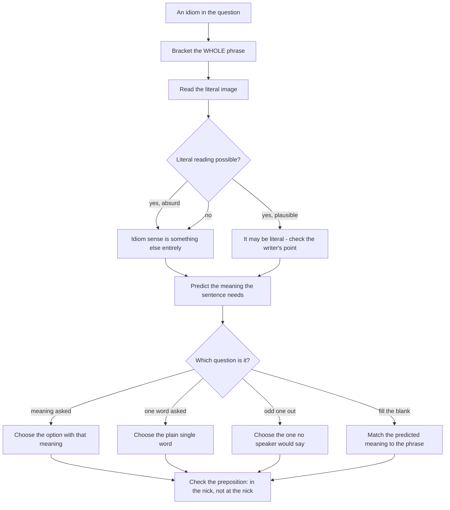

# Idioms and Phrases

An idiom is a fixed expression whose meaning is not the sum of its words. That is the whole reason exam setters use idioms: they remove the possibility of a student answering from the individual words, so only real, contextual reading survives. Every idiom question in a CUET UG English paper is really one of three questions — *what does this phrase mean, what single word or short phrase replaces it, and which of these four expressions is natural English* — and all three are answered the same way: read the sentence, predict what the writer must be saying, then test the options against your prediction.

The prediction habit is what separates students who score from students who memorise. Instead of reading four options and searching your memory, you read the line and say, *"this must mean the speaker is avoiding the main point"*, and then you look for the option that means that. When you predict first, the idiom comes out of the sentence instead of out of a list.

### 🟢 Lite — Quick Review (1h–1d)

**Idiom, phrasal verb, prepositional phrase — know which is which**

| Type | Example | Fixed? | Example sentence |
| --- | --- | --- | --- |
| Idiom | *spill the beans* | Yes, as a whole | *Come on, spill the beans.* |
| Phrasal verb | *put off*, *give up*, *look after* | Partly | *They **put off** the meeting twice.* |
| Prepositional phrase | *in spite of, due to* | Yes | ***In spite of** the rain, we played.* |
| Simile | *as brave as a lion* | Comparison word stays | *He is as brave as a lion.* |
| Proverb | *A stitch in time saves nine* | A complete sentence of advice | *We repaired it early; a stitch in time saves nine.* |

The test: a proverb can stand alone as advice; an idiom cannot be split or reordered and still mean the same thing.

**Twenty idioms worth their weight, with the exact sense**

1. *Kick the bucket* — die.
2. *Let the cat out of the bag* — reveal a secret, usually by accident.
3. *Hit the nail on the head* — describe the situation exactly.
4. *Beat about the bush* — avoid the main point.
5. *A blessing in disguise* — a misfortune that turns out to be good.
6. *Once in a blue moon* — very rarely.
7. *Pull one's socks up* — make a greater effort.
8. *Spill the beans* — disclose information.
9. *A storm in a teacup* — a small quarrel made to look huge.
10. *To cry over spilt milk* — regret what cannot be changed.
11. *The lion's share* — the largest part.
12. *By and large* — on the whole.
13. *In a nutshell* — in a very short summary.
14. *To add fuel to the fire* — make a bad situation worse.
15. *To take something with a pinch of salt* — not believe it completely.
16. *To leave no stone unturned* — try every possible means.
17. *The last straw* — the final thing you can put up with.
18. *To be all ears* — to listen with complete attention.
19. *To face the music* — to accept the consequences of your own action.
20. *To keep one's fingers crossed* — to hope for a good outcome.

**Idioms that a wrong preposition spoils**

*In the nick of time* (just in time) — not *at the nick*. *In a day's work* — not *on*. *In full swing* — not *on full swing*. *On the dot* — not *in the dot*. Note that the preposition is part of the idiom; changing it makes the phrase wrong even when the meaning is close.

**Phrasal verbs: separable or not**

- **Separable:** *pick up, put off, turn down, take off, give in, call off.* With a pronoun object you must separate: *pick **it** up*, never *pick up it*.
- **Not separable:** *look after, look up, look into, give up, put up with, come across, stand out, get over.* Never *look it after*.
- A phrasal verb that is purely idiomatic has a new meaning: *give up* (surrender) is not *give* plus *up*; *put up with* (tolerate) is not *put* plus *up with*.

**Prepositions that are graded against each other**

| Verb | Takes | Do not write |
| --- | --- | --- |
| adhere | to | *adhere on* |
| comply | with | *comply of* |
| compensate | for | *compensate to* |
| deprive | of | *deprived with* |
| blame | on | *blame for* (for a person: blame someone **for** something) |
| prevail | over | *prevail upon* |
| blame / caution | against | — |
| concur | in | *concur on* |
| provide | for | *provide to* |
| refer | to | *refer about* |

### 🟡 Standard — Regular Study (2d–2mo)

**The four question forms and how each is answered**

**Form 1 — meaning of the underlined phrase.** Substitute the literal meaning for the whole phrase and ask whether the sentence still makes sense. *She was dying to see her old friend* literally means she wanted to die in order to see him, which is absurd, so the phrase must mean *eagerly longing to*. When the literal reading is impossible, you have found the idiom's boundary without needing a dictionary.

**Form 2 — substitution of a single word or phrase.** Here you ignore the idiom's flavour and ask for a plain equivalent. *To burn the midnight oil* becomes *to work late at night* or *to study hard*. When a one-word answer is asked for, the expected words are usually plain: *burn the midnight oil* → **burn the midnight oil** requires "to study late at night" or the single word **overwork**.

**Form 3 — find the odd or inappropriate expression.** Read each option in place in the sentence and ask which one no English speaker would actually say. This is a naturalness test, and it rewards fluency far more than memorisation.

**Form 4 — fill the blank with the phrase that completes the meaning.** Here the sentence supplies the idiom's meaning, and you supply the phrase. Predict the meaning first: *"he avoided the question for an hour"* → *he beat about the bush for an hour*.

**The four families idioms come from — learn them as families**

Idioms draw most of their images from a small number of sources, and once you see the family, unknown idioms become guessable.

- **The body and face:** *cold shoulder, a pain in the neck, keep one's head, put one's foot down, give the cold shoulder, shake a leg, hold your horses, a blessing in the disguise of.*
- **Animals:** *the lion's share, the cat's whiskers, a white elephant, the last straw, the goose that laid the golden egg, hold the bag.*
- **Work and money:** *burn the midnight oil, pull one's socks up, face the music, rake it in, a bird in the hand, make ends meet, turn the tables.*
- **Weather and nature:** *under the weather, storm in a teacup, rain cats and dogs, in the doldrums, on the rocks.*

A useful habit: when a new idiom contains an image, ask what that image literally implies about size, force or scarcity, and you will often get the meaning — *a white elephant* is something expensive and useless to maintain, which is why the phrase means a burdensome possession.

**Idioms that need their register checked**

*Hang out, screw up, blow off, knock 'em dead, awesome* are informal. *Examine, defer, procrastinate, terminate* are formal. A passage that says "the committee did not approve the plan" will not be improved by "the committee didn't like the plan", and in a question that asks for the closest meaning, the informal version is often the intended distractor. Where an exam offers both, the register that matches the passage wins.

**Where the grammar inside an idiom catches students**

- **The pronoun is usually the object of the verb inside the idiom:** *He pulled* **his** *socks up*, not *He pulled up his socks* in a phrase that requires the object in the middle. Many idioms are only grammatical in one order: *in the nick of time*, *at the death of*, *by the skin of one's teeth*.
- **Number and agreement follow the noun, not the idiom:** *The boys are in hot water* (plural verb) is right; *The boys is in hot water* is not.
- **A possessive is obligatory in some idioms:** *keep one's fingers crossed*, *beat one's brains out*. Writing *keep fingers crossed* sounds like a translation, not English.
- **Tenses are locked to the phrase:** *He was the last person to bear the brunt of the criticism.* The phrase is used with a past-tense event, so the tense in the sentence must agree with the event, not with the verb in the phrase.

**Decoding an idiom you have never seen**

Four steps, in order.

1. **Bracket the whole phrase** and mark the word that carries the image — usually the noun: *sail through the exam*.
2. **Read the sentence without the phrase** and note what the writer is claiming.
3. **Test the literal sense of the image** against the gap: *sail through* = to make progress easily, and the gap is "he finished quickly without difficulty" → the meaning is *do something quickly and easily*.
4. **Choose on fit**, then check the preposition.

This works on idioms that never appear in any list, which is exactly the point — lists cover the ones that appear, and technique covers the rest.

### 🔴 Extended — Deep Study (3mo+)

**Idioms in reading comprehension, and why they mark the author's stance**

In a passage, an idiom is rarely decoration. It tells you how the writer feels about what is being described, and question writers build options directly out of that feeling.

> *The committee's report, widely criticised as *sweeping under the carpet*, was released without amendment.*

Options will offer "hiding problems" and "covering up evidence" and "arranging documents neatly". The phrase does not mean the committee literally cleaned; it means the report concealed inconvenient material. Note also the word *criticised* in the frame: the passage is telling you the writer's stance, so an option that praises thoroughness is excluded by the frame, exactly as a positive word was excluded in a near-synonym question.

The same device works with *a shot in the arm* (relief), *a thorn in the flesh* (persistent annoyance), *a shot in the dark* (a wild guess), *a storm in a teacup* (a trivial dispute), and *a can of worms* (a complicated tangle). In each case, the passage's own evaluation word — criticised, welcomed, dismissed, defended — tells you which side of the idiom's meaning you must answer from.

**Idiom, proverb, phrase, cliché — the distinctions that decide a substitution question**

- **Idiom:** a fixed expression, usually four or five words, not a complete thought (*to rain cats and dogs*).
- **Proverb:** a complete statement of general wisdom, usable on its own (*A stitch in time saves nine*).
- **Prepositional phrase:** a phrase anchored by a preposition, structurally part of the sentence (*in the long run, by chance*).
- **Cliché:** an over-used expression that still carries meaning but no longer impresses (*at the end of the day*). In a paper, a cliche is safe for meaning and weak for style, so a question asking for a better alternative will reject it.

When a question says "replace the underlined part with a suitable word", a proverb is almost always the wrong answer type: the blank holds a verb or noun, and proverbs are whole sentences.

**Phrasal verbs and the passive voice, the negative, and pronouns**

Three structural traps that show up again and again in grammar-based items.

1. **Passive:** *They have cleaned up the park* → *The park has been cleaned up*. The particle stays attached to the verb. Write *The park has been cleaned*, and you have lost the phrasal verb.
2. **Negative:** *look after*, not *look not after*. You negate the verb, not the particle: *He did not look after the plants* is correct; *He looked not after the plants* is not.
3. **Pronoun object:** *Give it up* and never *Give up it*. This is the classic correction item because the separable phrasal verb looks identical in the two orders and only one is English.

**The one-verb-many-particles table that prevents nearly every preposition error**

| Particle | Meaning | Example |
| --- | --- | --- |
| up | an increase or a completing process | *Prices are up. He gave up the idea.* |
| down | a decrease or a reversing process | *Output is down. He calmed down.* |
| off | separation, cancellation, completion | *The match was called off.* |
| on | continuation, connection | *He carried on working.* |
| out | removal, completion, ejection | *The stain came out.* |
| over | examination, reversal of control | *She looked the data over.* |
| through | a complete process | *He went through the file.* |
| away | separation, disappearance | *The fog cleared away.* |
| apart | separation into pieces | *The joint came apart.* |

The most valuable line in that table is *up = increase*. A question giving *output is up by twelve per cent* can then be answered without a dictionary, and the same reasoning settles *prices fell* → *prices are down*.

**Choosing between an idiom and a plain phrase in a fill-in-the-blank**

When the sentence is neutral and the blank is a single word, choose the plain word. When the sentence is informal, narrating, or full of feeling, choose the idiom. A diary-like sentence about an old man's stubbornness takes *a stubborn old goat*; an official report on the same behaviour takes *refused to revise his position*. A candidate who writes the idiom in the formal register loses the register mark even though the meaning is right.

**Extending your stock without expanding your revision list**

Mine the passages you read for imagery. When a passage says *the proposal was quietly shelved*, you have just met the idiom *shelve* in a context that makes it permanent. Keep three columns — image, phrase, meaning — and revise from the image side, because a remembered image recalls the phrase, while a remembered phrase alone recalls nothing under pressure.

### 🧠 Memory Anchors

- **"Read it literally, find it absurd, you have the idiom."** The absurdity is the clue, not a distraction.
- **"Predict, then look."** Say what the sentence must mean before you read the options; the answer stops feeling like a memory test.
- **"Up is up, down is down."** *Prices up, output down, idea given up* — the particle usually says which direction the action moved.
- **"Image families."** Body, animal, work, money, weather. Learn the family, not forty individual items.
- **"One word asked, plain word given."** *Beat about the bush* → *to avoid the topic*. Never a four-word answer in a one-word blank.
- **"Separable verbs split around a pronoun; inseparable ones never do."** *Pick it up* yes, *look it after* never.
- **"The frame tells you the writer's side."** If the sentence says *criticised as*, the answer is a negative sense.
- **Flashcard Q&A:**
  - *Meaning of "to keep one's fingers crossed"?* → To hope for a good outcome, literally to cross the fingers so luck holds.
  - *What does "at the last straw" mean?* → The correct idiom is *the last straw* — the final thing a person can tolerate.
  - *"A white elephant"?* → Something very expensive to keep and of little use.
  - *Rewrite in the passive: "They have tidied up the room."* → *The room has been tidied up.*
  - *Correct it: "He gave up it."* → *He gave it up* — separable phrasal verbs separate around a pronoun.
  - *What does "burning the midnight oil" describe?* → Working or studying late into the night.

### 🎯 Exam Traps & Error Log

1. **Taking the literal meaning.** The most tempting wrong answer in the whole topic is always the one built from the individual words. If the literal reading is absurd, the literal reading is the distractor.
2. **Answering with the idiom's image rather than its sense.** "About animals" is not a meaning. "A large share" is.
3. **Losing the preposition.** *In the nick of time* is right; *at the nick of time* is a different, nonexistent expression.
4. **Putting a four-word idiom into a one-word blank.** Read the blank's requirement and give a plain word when one is asked for.
5. **Choosing a proverb for an idiom slot.** "A stitch in time saves nine" is a proverb, and it will not fit a blank that expects a verb phrase.
6. **Splitting a phrasal verb that cannot be split.** *Look after it* is correct; *look it after* is a permanent error.
7. **Changing register while keeping the meaning.** *Screw up* may mean *fail*, but in a formal passage it is the wrong word for *fail*.
8. **Choosing the option the writer's attitude rejects.** If the passage says the report was *sweeping under the carpet*, an option praising careful work is excluded by the frame.
9. **Ignoring the object position inside the phrase.** *He pulled his socks up*, not *he pulled up his socks* in idioms that lock the order.
10. **Assuming a familiar phrase is universal.** Some idioms are common in Indian English but flat or unknown elsewhere; if a question pairs a familiar idiom with a genuinely international one, the international one is usually the intended answer in a formal paper.

### 🧪 Self-Test — 8 Questions with Worked Answers

Answer these on paper before reading the solution. Each maps to a form this topic actually uses.

1. **Choose the idiom that fits: "For three weeks the official ______ about the missing files, and the story only broke yesterday."**
   *Options: beat about the bush, made up ground, added insult to injury, turned a blind eye.* **Beat about the bush** means to avoid the main subject — the only option whose sense matches a three-week delay before saying anything. *Made up ground* is fictitious claims, *added insult to injury* is worsening an injury, *turned a blind eye* is pretending not to see. Note that *turned a blind eye* is the nearest in surface meaning and the trap in this question.

2. **Choose the closest meaning: "The vaccine was a shot in the arm for the district hospitals."**
   **Encouragement or a timely boost.** A *shot in the arm* is something that gives fresh energy or hope at a moment of weakness. The literal reading — a medical injection — is close enough in the medical context to be a deliberate trap, which is why this item is a good test: the image is literal but the phrase's use is figurative.

3. **Fill the blank with the prepositional verb: "The laboratory must ______ of any flammable material."**
   **Keep it clear of** any flammable material. The required verb is *keep* with the particle *off*, and the whole phrasal verb is **keep off** (avoid, stay away from). Writing *keep away from* would also be acceptable English, but if the options give one idiom, it is *keep off*. A related trap: *keep off* and *keep out of* are different instructions.

4. **Correct the error: "The new rules comply of the international standard."**
   **comply with the international standard.** *Comply* takes *with*. *Comply of* is not English, and the error is structural, not stylistic, so it is exactly the kind of defect a correction item looks for. The same fix applies to *complying with*, *compliance with* — the noun carries the same preposition.

5. **What does "a storm in a teacup" mean?**
   **A small quarrel or disagreement that has been made to look far bigger than it is.** The image is a storm stirred up in something that holds a cup of tea. In an opinion passage it usually signals the writer's dismissal of a controversy as overblown, so an option that treats the dispute as serious and consequential contradicts the idiom.

6. **Which expression is inappropriate in the sentence: "The manager gave the new recruit the cold shoulder all week, so nobody was surprised when she resigned."?**
   **None is inappropriate — but the reading matters.** *Give the cold shoulder* means to treat a person with deliberate unfriendliness. The sentence is consistent: a week of cold treatment is precisely what would make a resigning unsurprising. A student who reads "cold" as temperature is the one who should be worried; the idiom is about attitude, not weather.

7. **Correct the error: "The teacher looked the new student up after the first question."**
   The sentence is ambiguous rather than ungrammatical: *looked the new student up* means **investigated** the student, while *looked up the new student* means **found information about** the student, and with a full name or a file "look up" is the ordinary meaning. If the intended sense is to search a record, the clear version is *The teacher **looked up** the new student's file* — placing the noun phrase first removes the ambiguity entirely.

8. **Choose the best word: "The two reports ______ considerably in their account of the flood's cause."**
   **Differ** — the verb is *differ*, and the correct preposition here is *in*, because *in* covers a matter or respect in which the two things differ, while *differ from* is used for a person or a thing as a whole. "The two reports differed **in** their account" is correct, and "differed **from** each other in their account" is also acceptable. The classic wrong form is *differed about* or *differed upon*, neither of which exists.

### 💡 Pro Tips

1. **Predict the meaning, then read the options.** Ten seconds of prediction turns a memory test into a comprehension test, and comprehension is the skill that transfers to the rest of the paper.
2. **Learn the image, not the phrase.** *A white elephant*, *a storm in a teacup* and *the last straw* all stay in your memory because each is a picture. A bare list of "meaning = phrase" does not.
3. **Practise the literal test on three idioms a day.** Read each one literally, notice how absurd it is, then state the real meaning. This is the fastest way to break the habit of reaching for the literal answer in the exam hall.
4. **When two options both fit, check the preposition and the register.** The tie-breaker is almost always there.
5. **Mine every passage you read for idioms.** Passage vocabulary comes with its context attached, which is the only form that survives the exam room.
6. **Keep a "stupid as it sounds" column.** Idioms whose literal reading is funniest are the ones you are most likely to answer literally. Write them in red.
7. **For substitution questions, answer in plain words and then convert.** Think *to avoid the topic*, then convert to *to beat about the bush*. Direct recall of the phrase from a list is slower and less reliable.
8. **Learn the separable/non-separable list first.** That short list pays off across phrasal verbs, voice, pronouns and prepositions, which is four topics for one hour of work.

---

## Continue your study

- **[View this topic in your CUET UG roadmap](/roadmap/?exam=cuet&duration=1mo)** — see where "Idioms and Phrases" fits in your personalised plan
- **[Build a quick revision plan](/roadmap/?exam=cuet&duration=1d)** — 1-day sprint covering highest-weight topics
- **[CUET UG exam overview](/exams/cuet/)** — pattern, eligibility, and syllabus
- **[All English notes](/notes/cuet/english/)** — browse sibling topics in this subject

---
*Content adapted based on your selected roadmap duration. Switch tiers using the selector above.*
