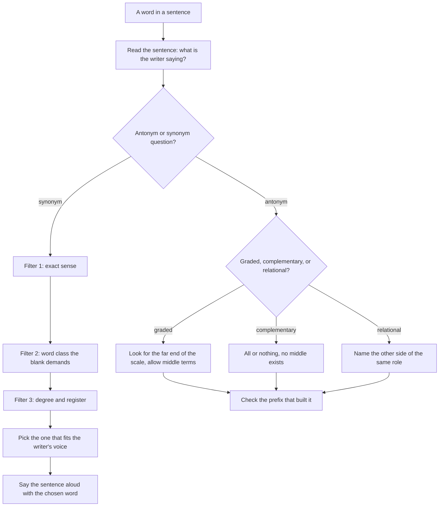

# Synonyms Antonyms

CUET UG does not ask you to list synonyms. It puts a word in a sentence, offers four words that a dictionary would call close, and tests whether you can tell which one belongs in *that* sentence. That means the real syllabus is not "memorise 500 pairs" — it is three things: knowing that antonyms come in kinds, knowing the prefixes that build opposites, and being able to separate words that share a root but differ in degree, in what they refer to, or in how they sound to a reader.

Everything in this topic follows from one distinction that is worth stating once: **most English words that look like synonyms are not identical.** *Big* and *large* name the same property, but *big* covers a wider range, *large* sounds more formal, and *huge* sits further up the ladder. A question that offers all three is not testing whether you know three words; it is testing whether you know which one fits the sentence's meaning and tone.

### 🟢 Lite — Quick Review (1h–1d)

**The three kinds of antonym, and what each one means for the answer**

| Kind | Structure | Test | Examples |
| --- | --- | --- | --- |
| Graded (gradable) | Opposite ends of a scale with middle terms | Can you say *very big*? Is there a middle? | hot / cold, big / small, fast / slow, happy / sad, rich / poor |
| Complementary (perfect) | All-or-nothing, no middle | If it is not A, is it B? | married / unmarried, alive / dead, present / absent, even / odd, legal / illegal |
| Relational (correlative) | One term is only true if the reverse is true of something else | Does the pair work as a pair of roles? | employer / employee, ancestor / descendant, above / below, senior / junior, husband / wife |

A fourth pattern, **reversive** pairs, are verbs or actions that undo each other: *borrow / lend, buy / sell, assemble / disperse, increase / decrease, stop / start.* These behave like complementary pairs, and they are the ones most often misread as relational.

**The prefixes that build an opposite — and the three that do not**

| Prefix | Turns into | Example |
| --- | --- | --- |
| un- | not, the opposite of | *unhappy, untie, unlock* |
| dis- | reverse the action, or the opposite of an opinion | *disagree, dislike, dismantle, distrust* |
| in- / im- / il- / ir- | not, before b, m, p | *inactive, impossible, illegal, irregular* |
| non- | neutral in status, neither | *non-smoker, non-violent, non-verbal* |
| anti- | against, opposed | *anti-war, antisocial, anti-Asian* |
| counter- | against, in response | *counter-attack, counterfeit, counteract* |
| de- | reverse, remove, reduce | *decompose, decrease, defrost* |
| over- / under- | excess / shortage | *overweight / underweight, overestimate / underestimate* |
| ante- | before | *antecedent, anterior* |

Three prefixes are routinely and wrongly treated as negations. **mis-** marks a *wrong* action, not the opposite state: *misunderstand* is not the opposite of *understand*, it is understanding done incorrectly. **semi-, anti-** can name a class rather than a stance, as in *semicolon*. And *un-* does not reverse everything it touches: *unravel* is not the opposite of *ravel*, and *untold* is not the opposite of *told*. Learn the prefix meaning once, and then check the word's actual dictionary sense if the reverse reading sounds strange.

**The intensity ladder you must be able to order**

| Weak | Middle | Strong |
| --- | --- | --- |
| like | enjoy | love |
| say | state | proclaim |
| see | notice | observe |
| ask | request | demand |
| dislike | disapprove | condemn |
| spoil | damage | devastate |
| cut | reduce | annihilate |

When a question gives four verbs that all "mean to make smaller", the sentence decides which rung. *The storm ______ the crops* is not *annihilated* unless the passage is about a total ruin; a scientific report *damaged* the harvest.

**Six pairs that are examined more than any others**

| Pair | The one-line difference |
| --- | --- |
| economic / economical | economic = relating to the economy; economical = thrifty |
| historic / historical | historic = important enough to make history; historical = relating to history, or based on records |
| classic / classical | classic = definitive of its kind; classical = belonging to the ancient Greek and Roman tradition, or the highest period of an art |
| comic / comical | comic = funny, or a comic strip; comical = exaggerated in a way that is merely funny |
| continual / continuous | continual = repeated with gaps; continuous = unbroken |
| considerable / considerate | considerable = large in amount; considerate = thoughtful of others |

### 🟡 Standard — Regular Study (2d–2mo)

**How a synonym question actually decides between four options**

Read the options and find what they share. Often they share a root — *benefit, beneficial, beneficent, benevolent, benign* — and the root tells you the field is "doing good" while telling you nothing about the shade. Then run three filters in this order.

1. **Filter 1 — precise sense.** Does the option match the sense the sentence needs, or only a neighbouring sense? *Vocation* means a calling or profession, not a holiday or a voice; *benevolent* means kindly, not merely harmless.
2. **Filter 2 — part of speech and grammar.** The blank may demand a verb, a noun, an adjective or an adverb, and a noun form will not fit an adjective slot however close its meaning is.
3. **Filter 3 — degree and register.** Among the survivors, pick the one whose intensity and formality match the writer.

The commonest reason a student loses these questions is skipping filter 3 and stopping at filter 1, when three options are still alive.

**Graded antonyms: the question that catches everyone**

> *The film was ______ ; the audience was on its feet within twenty minutes.*
> (A) dull **(B)** engaging **(C)** ordinary (D) ordinary

Options (A) and (C) are near-synonyms, (B) is the antonym of (A). Because the pair *dull / engaging* is graded, an answer key written by someone thinking in graded terms might accept more than one; the safe approach is to choose the option that is not merely the opposite of the frame's word but the one the sentence positively supports. Notice the wording of the item above: the second version, where the frame itself is neutral, removes the trap entirely. **Design the question so the frame favours one answer** — that is what separates a good item from an ambiguous one, and when you meet an ambiguous one in a test, the frame's own emphasis is usually the intended guide.

**Complementary pairs and the trap of the missing middle**

*Married / unmarried* has no middle. That makes it complementary. It also means the antonym of *married* is *unmarried*, not *single*-in-the-sense-of-one-only, and not *alone*. Similarly *empty / full* is complementary, so a sentence about a *partly* full glass is exactly the context in which the pair is used, and a distractor of *almost empty* is not an antonym at all.

**Relational pairs: the answer is only a name for the same relation seen from the other side**

*Above / below*, *inside / outside*, *predecessor / successor*, *senior / junior*. These are not qualities a thing either has or lacks; they describe a position in a pair of roles. That is why the classic "opposite of hot is cold" logic fails here: the opposite of *employer* is not *unemployed*, it is *employee*. Questions test this by asking for the word that completes a pair: *The wage dispute pits the ______ against the ______.* → *workers against employers*.

**Register as a synonym test**

*Eternal, everlasting, perpetual, ceaseless* all mean without end. In a formal report you write *perpetual*; in a piece of reportage, *endless* or *ceaseless*; in speech, *never-ending*. So when two options differ only in register, the passage decides. A passage written in the third person and the present tense is telling you the answer will be formal; a narrative with dialogue is telling you the opposite.

**Which word a clause demands, and the words that refuse the slot**

- A verb slot after *to* takes the infinitive: *He was accused of **embezzling** the funds*, not *embezzlement*.
- A noun slot after an article takes a noun: *There was a marked **decline** in sales*, not *declined*.
- An adjective slot after a linking verb takes an adjective: *The results were **significant***, not *significantly*.
- An adverb slot after an adverb takes an adverb: *She spoke **eloquently***, not *eloquent*.

This filter is faster than any meaning analysis, and in a synonym question with four word-classes among the options it removes three instantly.

**Building a pair list that actually works**

Never list a word alone. Write the word in a short phrase, then the opposite, then the prefix that produced it. This single format — **word | phrase | opposite | prefix** — is a fraction of the size of a word list and covers nearly every item, because exam antonyms are overwhelmingly built with prefixes.

- *expand* | *the shop expanded its range* | *contract* | not a prefix — a Latin root pair, so the prefix method does not help
- *agree* | *the two sides agreed* | *disagree* | *dis-*
- *legal* | *the practice is legal* | *illegal* | *il-* before *l*
- *possible* | *a possible outcome* | *impossible* | *im-* before *p*
- *polite* | *a polite refusal* | *impolite* | *im-*; note *impolite*, not *inpolite*, even though *il-* and *ir-* are also possible before *l*

### 🔴 Extended — Deep Study (3mo+)

**The connotation ladder: near-synonyms ranked by feeling**

Several sets of words name one action while differing in the judgment they pass on it. A question built on this table is a reading question wearing a vocabulary costume.

| Mild | Neutral | Stronger | Strongest |
| --- | --- | --- | --- |
| say | state | assert | proclaim / declare |
| object | protest | condemn | denounce |
| ask | request | demand | insist on |
| change | modify | alter | transform |
| stop | halt | suspend | abolish |
| look at | examine | scrutinise | interrogate |
| give | offer | present | bestow |

*Ask* and *demand* are both imperative, but only *demand* implies entitlement. *Stop* and *abolish* both mean to end something, but *abolish* says the thing should not exist. In a passage that takes a position, the writer's ladder rung is the answer; in a neutral report, the middle rung is the answer.

**Synonyms and the subject-verb agreement trap**

Choosing a "better" synonym can break the sentence's grammar, because synonyms differ in number and in whether they take a plural verb. *Group, committee, team, family, crowd, staff* are all singular nouns; *crowd* and *family* can take *are* in British usage when the members are considered individually, but the standard exam answer treats *a group of*, *a committee*, *a team of* as singular. The point for this topic: when a question offers *a group of students was* and *a group of students were*, the deciding factor is not synonymy but the head noun of the phrase, and the head of *a group of students* is *group*.

**The near-synonym pairs that most often settle an exam**

| Pair | Distinguishing question |
| --- | --- |
| collaborate / collude | working together openly / conspiring secretly |
| avarice / greed | excessive love of money / wanting more than you need, of any thing |
| credible / credulous | believable / too ready to believe |
| callous / candid | unfeeling / frank, usually kindly meant |
| cautious / cowardly | careful out of respect for risk / failing to act through fear |
| animated / vivacious | full of movement and energy for a moment / lively as a lasting character |
| reticent / reserved | unwilling to speak of a thing / slow to show feeling in general |
| compliant / submissive | following a rule / obeying a person in a servile way |
| versatile / versatile-looking | able to do many things / changing appearance, as in *versatile fabric* |
| ingenious / ingenuous | inventive / innocent and unguarded |
| eminent / imminent | distinguished / about to happen |

*Ingenious / ingenuous* and *eminent / imminent* are the two pairs that appear in almost every competitive paper, and both are caught by the same rule: the prefix *in-* here does not negate anything. *Ingenious* comes from *ingenia*, cleverness. *Imminent* comes from *minari*, to threaten. Learn them as words, not as prefix patterns.

**One word for a phrase, and the ambiguity of "a suitable word"**

A phrase-substitution question that says "give a one-word substitute" accepts only a single word, and the usual traps are wrong word class and wrong degree. *A person who loves mankind* → **philanthropist**, not *humanitarian* (that is the quality, not the person) and not *philanthropy* (that is the activity). *A government by the people* → **democracy**. *Something that cannot be defeated* → **invincible**. The discipline is: name the head of the phrase first (person, place, thing, quality), then find the word of that class, then check the degree.

**Why absolute synonyms barely exist, and why that matters**

Two words with the same dictionary gloss almost always differ in register, in frequency, or in the collocations they enter. *Couch* and *sofa* are the textbook example: same object, but *couch* is more British and informal, *sofa* is the neutral international word. *Sick* and *ill* differ in register. *Deceased* and *dead* differ in register and in euphemism. When a question offers two absolute synonyms, the intended distinction is always one of these three, and the passage tells you which: a formal passage wants the formal term, a narrative wants the familiar one.

**A method for the part you never prepared**

The one-word-substitution and near-synonym families overlap heavily, so the efficient study order is: learn the prefix system (it covers most antonyms), learn the confusable pairs list (it covers most near-synonyms), and mine reading passages for the rest. In a passage, a word used three times is a word the writer considers central, and the question about it will ask for its synonym or its opposite. Six passages a week gives you a working pair list without a single word-list page.

### 🧠 Memory Anchors

- **"Three kinds of antonym, three different questions."** Graded asks for the far end; complementary asks for all-or-nothing; relational asks for the other side of a pair.
- **"Relational opposites are job titles."** Employer ↔ employee, ancestor ↔ descendant, predecessor ↔ successor. Not *unemployed*.
- **"in- never means inwards."** Impossible, inactive, illegal, irresponsible — *in-* is the negative prefix there, not a direction.
- **"mis- is wrong, not opposite."** Misunderstand is not the reverse of understand.
- **"Sense, then class, then colour."** Precise meaning, word class, then degree and register, in that order.
- **"The frame decides intensity."** If the writer says *criticised as*, the answer is the negative rung of the ladder.
- **"A phrase needs its head."** *A person who loves mankind* → a person → philanthropist.
- **Flashcard Q&A:**
  - *What is the antonym of continual?* → **Continuous** (unbroken). *Continual* is repeated with gaps.
  - *What is the antonym of historic?* → **Historical** as a description of the record, or **unhistoric/ordinary** in the sense of not important. The usual exam answer is *historical* = based on history, so the safe pair is *historic event* vs *historical novel*.
  - *Economical or economic for "an economical car"?* → **Economical** = thrifty with money.
  - *What does -ient / -ious do?* → Marks a state, quality or action: *obedient, gracious, cautious, gracious.*
  - *Antonym of feasible?* → **Infeasible**; *impractical* is a near neighbour but means impractical, not impossible.
  - *Synonym of "mitigate"?* → **Alleviate, lessen, ease** — all imply reducing severity, not removing the cause.

### 🎯 Exam Traps & Error Log

1. **Answering a relational pair as a quality.** *Employee* is not the opposite of *employer* in the sense of *unemployed*; it is the other side of the same relationship.
2. **Looking for a graded opposite when the pair is complementary.** *Married* does not have a middle term, so "partly married" is meaningless; options built on middle terms are wrong.
3. **Assuming prefix + word always reverses it.** *Unravel, untold, untie* — not all of them are opposites, and *un-* is not a machine.
4. **Taking the first synonym that looks right and stopping.** Three options usually survive meaning; the last filter — degree and register — is the one that scores.
5. **Confusing two near-synonyms that share a root.** *Historic / historical, continuous / continual, considerable / considerate, comic / comical.* The root is identical; the ending carries the difference.
6. **Matching a noun to a verb slot.** *The report was ______ by the committee* needs a passive participle; *denounced* works, *denunciation* does not.
7. **Ignoring number in a collective noun.** *A group of students* has *group* as its head, so the verb is singular.
8. **Overstating.** If the passage reports a fall in sales, *annihilated* is wrong even though it means "destroyed"; intensity beyond the text is a marked error.
9. **Confusing reversing verbs with relational pairs.** *Borrow / lend* and *buy / sell* undo each other; *above / below* describes a position. They are tested differently.
10. **Assuming there are exact synonyms.** There are almost none, so a question offering two identical-meaning options is offering two different registers, and the passage has already indicated which one it wants.

### 🧪 Self-Test — 8 Questions with Worked Answers

Answer these on paper before reading the solution. Each maps to a form this topic actually uses.

1. **Choose the best word: "His argument was ______ ; it collapsed the moment anyone examined the premises."**
   *Options: (A) tenable (B) tenuous (C) compelling (D) lucid.* **Tenuous** — thin, weak, held together by almost nothing, which is exactly what the second clause reports. *Tenable* is a real word meaning able to be defended, and it is the trap: it is a difficult word, so it feels right, but it is the opposite of what the sentence says. *Compelling* and *lucid* are both positive, so the frame (*collapsed*) excludes them.

2. **State the kind of antonym and give its partner: "employer / ______".**
   **Relational**, and the partner is **employee**. The two are names of the two ends of one relationship; neither has a middle term and neither is a quality. *Unemployed* is not the antonym of *employer* — it is the antonym of *employed*, a word from a different pair.

3. **Give the antonym of *frugal* from: generous, extravagant, stingy, thrifty.**
   **Extravagant** — spending far more than one should. *Stingy* and *thrifty* are synonyms of *frugal*, not its opposite, and *generous* describes giving freely to others, which is a different sense from spending lavishly on oneself. The pair *frugal / extravagant* is graded, so *lavish* and *wasteful* would also be accepted; *generous* is a shade off the scale.

4. **Give the prefix-built antonyms: "He was ______ to help, although he came."** → **unwilling** (*un-* + willing). And: "Smoking is ______ to a person of his health." → **prejudicial / harmful**. And: "The opposite of *agree*." → **disagree** (*dis-*). And: "A person who does not drink alcohol." → **non-drinker** (*non-*). Note that *un-* is correct for *unwilling* and *dis-* is correct for *disagree*; swapping them is the standard error.

5. **Correct the error: "Neither the manager nor the clerks were present at the briefing."**
   With *neither ... nor*, the verb agrees with the subject **nearest** to it. The nearest subject here is *clerks*, a plural, so **were** is correct. This is the standard rule and the standard question; the error version that people remember wrongly is "neither ... nor takes a singular verb", which is false.

6. **Choose the best word: "The report was criticised for being ______ in its account of the losses; it had named no source."**
   *Options: (A) reticent (B) evasive (C) taciturn (D) clandestine.* **Evasive** — avoiding answering or evading the point. *Reticent* and *taciturn* describe a person's habitual unwillingness to speak and are about character, not about a report's failure to name sources. *Clandestine* means secret and hidden, which suggests the report was hiding something, not merely failing to answer. The frame word *criticised for* tells you the answer must be a negative, and the clause *named no source* supplies the meaning.

7. **Which of these pairs consists of a synonym pair? (A) continuous / continual (B) historic / historical (C) ample / sufficient (D) benevolent / beneficent.**
   **(C) ample / sufficient.** Both mean "enough", and the difference is small: *ample* tends to suggest generous or more than enough, *sufficient* is the plainer word for meeting a requirement. In (A) and (B) the two words are opposites, not synonyms, and in (D) *benevolent* means kindly and *beneficent* means doing good, which is a related but distinct sense.

8. **Place these in order of increasing force: request, demand, beg, ask.**
   **ask < request < demand < beg** is the usual ranking by pressure, but note the twist the sentence supplies: *beg* is the most emotionally loaded and the least demanding in institutional terms. If the sentence is "he asked for a transfer, which his superiors ______ after three months", the answer is **demanded** — an institution demands, it does not beg. Ranking words without reading who is speaking is the commonest failure in this question type.

### 💡 Pro Tips

1. **Memorise the three antonym types, not thirty antonym pairs.** The types generalise to every pair you have not met, which is most of them.
2. **Learn confusable pairs as a single page of root-and-ending contrasts.** *Continuous / continual, historic / historical, considerable / considerate* all resolve in seconds once the endings are attached to their senses.
3. **Read the frame's emotion before the options.** One word of the sentence — *criticised, praised, refused, agreed* — eliminates a third of the field.
4. **Say the sentence aloud with the chosen word.** Fluency is a real test; a correct word in a sentence nobody would say is usually the wrong word.
5. **Do the word-class filter first in fill-in-the-blank items.** It is instant and it is free.
6. **Keep a "prefix ledger" — one column for *un-*, one for *dis-*, one for *in/im/il/ir-*, one for *non-*.** Every new word goes in a column, and the opposite is written beside it. It is the shortest possible revision list for antonyms.
7. **Never write a synonym without a phrase around it.** The phrase is what you will recognise in a passage; the bare word is what you will forget.
8. **Practise substitution in reverse.** Take a word, write a one-sentence example for it, then find its opposite. Producing an answer is far stronger evidence of knowing it than recognising one.

---

## Continue your study

- **[View this topic in your CUET UG roadmap](/roadmap/?exam=cuet&duration=1mo)** — see where "Synonyms Antonyms" fits in your personalised plan
- **[Build a quick revision plan](/roadmap/?exam=cuet&duration=1d)** — 1-day sprint covering highest-weight topics
- **[CUET UG exam overview](/exams/cuet/)** — pattern, eligibility, and syllabus
- **[All English notes](/notes/cuet/english/)** — browse sibling topics in this subject

---
*Content adapted based on your selected roadmap duration. Switch tiers using the selector above.*
