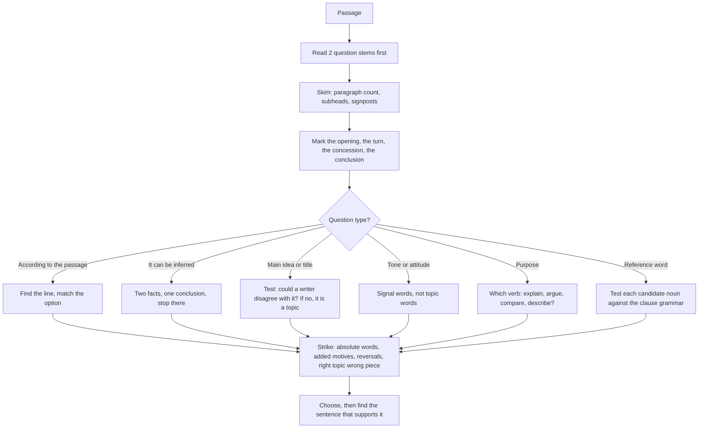

# Reading Comprehension

CUET UG comprehension passages are not tests of literary appreciation. They are question-driven texts: the question tells you which piece of information the writer put on the page, and the marks are for finding that piece without being misled by the details around it. The skills being tested are locating, inferring one step beyond the text, identifying stance, and summarising — in that order of frequency and of difficulty.

The most useful reframe is this: **a comprehension passage is an argument, and the questions are about the argument, not the details.** Facts in a passage are scenery. The claim, the concession, the recommendation and the tone are what the questions are built from. A student who hunts for the "main point" while reading will find it; a student who reads for facts will find the facts and miss the point.

**The six question types, and what each one needs**

| Type | What it asks | What you need |
| --- | --- | --- |
| Factual / stated | Who did what, when, how many | Location plus careful reading of the exact words |
| Inference | What can be concluded | The text plus one logical step — no more |
| Main idea / central idea | What is the passage mostly about | The claim, not the topic |
| Title / headline | Which phrase sums the passage | The claim, compressed |
| Tone / attitude | How does the writer feel or sound | The evaluative words, not the topic words |
| Purpose / structure | Why did the writer write it, and how is it built | The paragraph roles in order |

Everything else — reference words, assumptions, titles, "compared with the first paragraph" — is one of these six wearing different clothes.

### 🟢 Lite — Quick Review (1h–1d)

**The five-step passage workflow**

1. **Read the questions first.** Two of them, at least. This is the step that separates a fast candidate from a slow one, because you now know what you are looking for and you read the passage as a hunt instead of a chore.
2. **Skim the passage for shape.** Note the paragraph count, any subheadings, any obvious signposts — *however, but, in fact, therefore, in short, the first reason* — and any paragraph that looks like it holds the claim. Signposts are the writer telling you where the argument turns, and questions frequently ask about the turn.
3. **Answer the direct questions.** These are the fastest marks in the section. Find the line, read the line, match the option. Do not leave them for later.
4. **Take the inference and tone questions last.** They need the whole passage in mind, not one paragraph.
5. **Never leave a question unattempted.** There is no penalty in a multiple-choice paper for a guess, and a guessed option is right a quarter of the time.

**The reference-word decoder — this alone is worth several marks per passage**

| Word | Points to |
| --- | --- |
| *this, that, these, those* | The immediately preceding sentence or clause |
| *such* | A noun phrase already named: *"students who fail such exams"* → the exams just described |
| *the former, the latter* | The first and second of two items just named |
| *it, its, they, their, this effect* | The nearest plausible antecedent — check the grammar, not the distance |
| *however, but, yet, still* | The contrast with whatever came before |
| *such is the case with X* | Everything said about X, not just the last clause |
| *the same* | The previously mentioned thing, or the same thing at a different place |
| *the two of them, the rest* | A group already listed |

The test for *it* is simple: it must refer to something that can stand alone as a noun phrase. If the last noun was *policy* and the new clause needs a person, *it* cannot be the policy — look back for a candidate that can.

**The inference ladder — how far you may go**

| Rung | Status | Example from a passage about libraries |
| --- | --- | --- |
| 1 | Stated outright | "Most of them are ageing." |
| 2 | Supported with no new facts | The buildings are old → the author treats the collections as inadequate infrastructure. |
| 3 | A conclusion the writer would endorse | The passage argues for funding by use → the writer thinks current funding measures are wrong. |
| 4 | Going beyond the passage | "No city in the world will ever..." |

Rung 1 and 2 questions are the bulk of the paper. Rung 3 appears as inference and main-idea questions. Rung 4 is the trap, and it almost always signals itself with **absolute words: always, never, all, none, only, every, must, impossible.**

**The four-strike elimination method**

When an option is not obviously right, test it for each of these and one strike will land.

- **Absolute quantifier** (*all, none, every, only*) when the passage says *often, often, in several cases*. One example never proves a rule.
- **Added motive or cause** the passage never gives. If the writer says a scheme failed, do not pick "because the minister was unwilling".
- **Reversal** of the writer's direction. Passage: cost fell and use rose. Option: cost rose and use fell.
- **Right topic, wrong piece.** The option paraphrases an example or a side remark, not the claim. This is the single most productive strike in main-idea questions.

**The eight words that carry an attitude**

*However, but, yet* mark a turn. *Ironically, surprisingly, paradoxically* mark a gap between expectation and result — and the answer to "what does this suggest" is the expectation the author is correcting. *Obviously, clearly, of course* mark contempt: the writer is dismissing a view as foolish. *Admittedly, admittedly, certainly, admittedly* mark concession. *Remarkably, notably* mark approval. *Unfortunately, regrettably, shamefully* mark disapproval. If you can spot which of these a paragraph uses, you can answer tone and attitude questions without reading every word.

### 🟡 Standard — Regular Study (2d–2mo)

**Read the question as a specification**

Every question stem contains its own answer. Learn to mine it.

- *The author mentions X in order to...* → you are being asked for the **function** of X, not its meaning. The answer explains why the writer put it there: to define a term, to give an example, to concede an objection, to introduce a contrast, to show a consequence.
- *According to the passage, X is...* → the answer is **in the passage**, in the writer's words, and no inference is required.
- *It can be inferred from the passage that...* → the answer is **not in the passage** and is not too far from it. This is the only clue word that licenses an inference.
- *The word "X" most probably means / refers to* → look at the sentence itself; substitution is the method.
- *Which of the following would the author be least likely to agree with?* → find the author's position, then invert it.
- *The primary purpose of the passage is to* → **to explain, to argue, to describe a process, to compare two views, to narrate.** Pick the verb, not the subject. "To describe the rise of X" is weak; "to argue that X is mismeasured" is a purpose.

**Paragraph roles: map the passage before you answer**

A well-built passage has a job for each paragraph, and the jobs are almost always the same.

1. **Opening** — the topic, sometimes a scene or anecdote, and the claim in a thesis sentence.
2. **Development** — evidence, examples, definitions, or the first strand of an argument.
3. **Turn or contrast** — *however, but, in fact, yet.* This is where the author's real position arrives.
4. **Concession** — *admittedly, it is true that* — the writer's own strongest objection, fairly stated.
5. **Conclusion or recommendation** — what should be done, or the claim restated in stronger form.

If you can label the paragraphs, you can answer any structure question without reading the passage again, and you will know in advance which paragraph the main-idea answer sits in — the opening, the conclusion, or the turn.

**The main idea versus the topic, stated once**

- The **topic** is what the passage is *about*: "libraries in small towns."
- The **main idea** is what the passage *says about* the topic: "libraries are now study infrastructure, so they should be measured and funded by use."

An option that only names the topic is a distractor, however plausible it sounds. *Libraries in Small Towns* is a topic, not an idea. *Libraries That Are More Than Bookshops* is an idea. Any main-idea or title option must contain a **claim**, which you can test by asking whether a writer could disagree with it.

**Inference: the one-step rule with a worked case**

> *Passage: "Fewer students are reading long novels. Librarians report that demand for study guides and exam material has risen sharply. The change is usually described as a decline in reading."*
>
> *Q: It can be inferred that the author regards "a decline in reading" as...*

The passage never says the author rejects that description. What it does is juxtapose falling novel-reading with rising study-material demand, and then quotes a description the author plainly distrusts. One step from those facts: the author thinks the label "a decline in reading" is inaccurate or at least incomplete, because reading has not declined so much as changed shape. Anything that goes further — "the author believes novels are obsolete" — is rung 4 and is wrong.

The technique is the same in every inference item: **state the two facts, ask what a careful reader would conclude, and stop at the first conclusion.**

**Tone and attitude: the reliable signals**

| Signal in the passage | Tone of the answer |
| --- | --- |
| Data, dates, neutral reporting | Informative, measured, analytical |
| *Ironically, contrary to expectations* | Wry, corrective, slightly ironic |
| *Obviously, plainly, of course* | Dismissive of an opposing view |
| *Remarkably, encouragingly* | Approving |
| *Unfortunately, regrettably* | Regretful, critical |
| Repeated second person, direct address, imperatives | Direct, instructional, engaging |
| Hypotheticals (*if, were to, in principle*) | Speculative, exploratory |

Never answer a tone question with a topic word. Asked "how does the author feel about X", the answer is a feeling word; the topic word is the subject of the feeling, not the feeling.

**Reference and pronoun questions: the grammar test**

When you cannot see what *it* or *they* refers to, do this. List the last three candidate nouns, then test each against the grammar of the clause that uses the pronoun. The pronoun must agree in number and be able to head the clause. *"The scheme failed because it was underfunded"* — *it* is the scheme. *"The minister defended the scheme, saying it was underfunded"* — *it* is still the scheme. In both, agreement is not enough; test whether the resulting sentence makes sense as written.

**The vocabulary-in-passage method**

When a question asks the meaning of an unfamiliar word, do not look it up and do not skip it. Substitute the plausible meaning directly into the clause and read it forward. *"Most of the funding is tied to outputs"* — substitute *results* → "most of the funding is tied to results" reads correctly, so *outputs* means results. Substitution solves the question in fifteen seconds and needs no vocabulary knowledge at all.

### 🔴 Extended — Deep Study (3mo+)

**When a passage is too dense to understand**

Dense passages are common in exams, and the correct response is structural, not heroic.

1. **Read the last paragraph.** Conclusions and recommendations are written in plainer language than the argument that supports them, because writers simplify for the reader at the end.
2. **Scan the first and last sentence of each paragraph.** Those two lines carry the paragraph's job in most cases.
3. **Use the subheadings and signposts.** *In the second place, But the evidence, A brief history of* — each tells you the paragraph's role before you read it.
4. **Answer what you can and move on.** Direct questions in a dense passage are the easiest marks in the set, because the information is stated plainly somewhere in the mess.
5. **Return to the inference questions last, with the whole passage read.** Density means the argument is richer, and the inference questions are where the marks are.

**Handling a question you cannot locate**

If the answer is not where you expect, work the question stem word by word, then search for that idea using a synonym, not the same word. Exams paraphrase deliberately; the passage says *the number of hours rose* and the option says *working time increased*. Also search the neighbourhood — the answer to a question about a contrast is in the sentence before or after the contrast word, not in the sentence containing it.

**The synthesis questions: main idea, summary, and title**

**Main idea** needs the claim. Test candidate options with the "could a writer disagree?" question. If nobody could disagree, it is a topic. Then check that your choice covers the *whole* passage and not just a paragraph, because a single-paragraph idea is a good distractor for a whole-passage question.

**Summary** questions offer four passages of different lengths. Choose the one that keeps the main claim and its essential support, and drops the illustration, the anecdote and the repeated example. A summary is a compression, not a cut: an option that leaves out the claim is a distractor, and an option that keeps the anecdote is one too long.

**Title** compresses further. Titles rarely contain the writer's name, the place, or the emotional colour. They are a noun phrase or a claim, and a title with a question mark in it is almost always wrong because the writer is answering, not asking.

**Purpose questions: the four verbs**

- **To explain** — the passage informs; there is no disagreement.
- **To argue** — the passage takes a side; look for the claim and the support.
- **To compare and contrast** — the passage holds two things side by side and says which matters more.
- **To narrate or describe** — the passage reports a sequence or a state of affairs; questions here are mostly factual.

Purpose is the paragraph-role question one level up. If the passage concedes an objection, it is arguing. If it only adds detail after detail, it is describing.

**Assumption questions**

An assumption is something that must be true for the writer's argument to hold, but which the writer does not say. Test each option by negating it: if the negation destroys the argument, the option is the assumption.

> *Argument: "Libraries should be funded by use rather than by circulation of novels, because that is how residents actually use them."*
>
> Candidate: "Some residents use libraries for purposes other than borrowing novels." Negate it: suppose no one used them for anything else. Then funding by use and funding by circulation would be the same thing, and the argument has no content. So the candidate is the assumption. ✓

**Comparative questions: "unlike the first paragraph, the second…"**

These are the highest-yield structural questions because they are answerable with a paragraph-role map. Note what is being compared: the *function* of the paragraph, not its content. The first paragraph announces; a later one demonstrates, qualifies or recommends. Options that name a topic are wrong; options that name a function are right.

**Answering with a citation, not just a word**

When you finish, check that you can point at the sentence that supports your answer. If you cannot, you have chosen an option that is true in general but not supported here, which is the most common wrong answer in the whole topic. The support does not have to be an exact word match — it can be a paraphrase or an inference — but it must exist.

### 🧠 Memory Anchors

- **"Questions first, text second."** Read two stems before the passage and you will read the passage as a hunt.
- **"The passage is an argument, not a scene."** Details are scenery; the claim, turn and recommendation are the exam.
- **"Could a writer disagree? If not, it is a topic."** The fastest test for a main-idea or title option.
- **"Two facts, one step, stop."** That is the entire method for inference.
- **"Signal words are the writer talking."** *Obviously* means contempt, *ironically* means expectation being corrected, *admittedly* means concession.
- **"Absolute words are nearly always wrong."** *All, never, only, every* in an option against *in several cases* in the passage.
- **"Support or it is not an answer."** Finish by naming the sentence that justifies your choice.
- **Flashcard Q&A:**
  - *What does "it can be inferred" license?* → One conclusion beyond the stated facts, and no further.
  - *Which question words mean "find the function"?* → *in order to, mainly to, the author mentions X to*.
  - *Right topic, wrong piece?* → An option that paraphrases an example or a side remark, not the claim. The commonest main-idea distractor.
  - *What is the role of a concession paragraph?* → It states the writer's strongest objection fairly, so the writer can defeat it and earn the reader's trust.
  - *Tone question: what is the wrong move?* → Answering with a topic word. Ask for the feeling, not the subject.

### 🎯 Exam Traps & Error Log

1. **Reading the whole passage before the questions.** You arrive at question one with no idea what is being asked, and you burn time on a first reading that is not yet targeted.
2. **Answering with a detail instead of the claim.** The option that paraphrases an example is nearly always the trap in a main-idea question.
3. **Inferring too far.** Two facts plus two steps of logic is a rung-4 answer. One step is inference; two is invention.
4. **Accepting absolute options.** *Always, never, only, all* fail against a passage that says *often, in several cases, may*.
5. **Adding a motive the passage never gave.** Why someone did something is not stated unless the writer says it, and "because he was unwilling" is a guess dressed as an answer.
6. **Reading tone as topic.** "The author is informative about libraries" describes the subject; "the author's tone is sceptical of the usual description" describes the writer.
7. **Mis-resolving a pronoun by distance.** Take the *nearest* candidate that the grammar allows, not the nearest word.
8. **Missing a turn.** The author's real position often arrives after *however* or *in fact*, and reading only the opening paragraph picks up the topic, not the claim.
9. **Leaving a question blank.** In a multiple-choice paper, a guess is free, and this topic is where the habit of skipping costs the most.
10. **Taking the first plausible option in a synthesis question.** Main-idea and title options are ranked from too narrow to too broad; the middle ones are the traps and the broadest is usually too broad.

### 🧪 Self-Test — 8 Questions with Worked Answers

Read the passage, then answer all eight on paper before reading the solutions.

> **Passage**
>
> Community libraries in small towns have quietly become something other than rooms full of books. In several districts, librarians report that the busiest hours are after school, and that the most requested material is not fiction at all but material for school projects, competitive exam preparation and online classes. The buildings themselves are ageing, and in most of them the heating is unreliable and the reading rooms are shared between children and adults.
>
> What has changed is not the size of the collection but the reason people come. A library is now, for many of its visitors, a room with a roof, a table, electricity and an adult within sight. That is a modest description, and it should not be dismissed: a public building that is free, warm and supervised is precisely what a village without a reliable connection at home does not have.
>
> None of this makes the case for closing the reading rooms. It makes the case for measuring them by use rather than by circulation of novels, and for arguing the next budget in terms of seats, sockets and study hours.

1. **What is the main idea of the passage?**
   *Options: (A) Village libraries in small towns are badly maintained. (B) Libraries in small towns now function largely as study infrastructure, and should be measured and funded by how they are used. (C) Competitive exam preparation has become the most popular use of libraries. (D) Reading habits among adolescents have declined.*

   **(B).** It is the only option that states a claim covering the whole passage. (A) is a detail from the first paragraph, and the passage moves past it. (C) is one example of a wider change. (D) is a topic the passage does not discuss at all. Test applied: a writer could disagree with (B) — the author is arguing for a change in measurement — but nobody can disagree with (A) or (C) as descriptions.

2. **What does the author mean by "That is a modest description, and it should not be dismissed"?**
   *Options: (A) The author thinks the description of a library as a warm room is accurate but inadequate, and expects readers to underestimate it. (B) The author considers the description irrelevant to the village. (C) The author is apologising for the state of the buildings. (D) The author doubts the figures given by librarians.*

   **(A).** The word *modest* is the author's warning that the description sounds small, and *should not be dismissed* is the instruction not to treat it as small. The colon that follows carries the reason: a free, warm, supervised public building is exactly what the village lacks. (B) contradicts the colon, (C) misreads *modest* as apology, (D) is unsupported — the author reports the librarians' figures without doubting them.

3. **What is the writer's attitude to the description "a decline in reading"?**
   *Options: (A) Full agreement (B) Acceptance with regret (C) Scepticism (D) Indifference.*

   **(C) Scepticism.** The passage's own attitude is never stated, so this is an inference, and it rests on the juxtaposition: novel borrowing is down while demand for study material is up sharply. A writer who agreed with the label would not insist that the library must be "measured by use rather than by circulation of novels". (B) is a good trap because regret is present elsewhere in the passage about the buildings; it is not present about the label.

4. **What does "in terms of seats, sockets and study hours" refer to?**
   *Options: (A) The practical facilities and usage that make the library useful to students. (B) The annual budget categories used by the district. (C) The building materials used in renovation. (D) The number of books donated each year.*

   **(A).** *In terms of X* means *measured by X*, and the three items are all features of a study space: somewhere to sit, a power socket, and time in which work can be done. Only (a) is consistent with the paragraph's argument, which is that measurement should follow use. (b) and (c) introduce facts never mentioned.

5. **Why does the author write "None of this makes the case for closing the reading rooms"?**
   *Options: (A) To introduce evidence for closing them. (B) To anticipate an objection and separate the description from the recommendation. (C) To show that the author has changed his mind. (D) To criticise librarians who favour fiction.*

   **(B).** The sentence does two things: it disposes of a conclusion the reader might have drawn from the ageing, crowded buildings, and it then narrows the argument to the actual recommendation in the next clause. This is a **concession-plus-pivot** move. (a) is contradicted by the following clause, (c) is unsupported, (d) attributes a motive that the passage never mentions.

6. **Which of the following does the argument assume?**
   *Options: (A) Some residents use libraries for purposes other than borrowing novels. (B) Libraries are better funded in cities than in villages. (C) Reading long novels is harmful. (D) Government should never spend money on public buildings.*

   **(A).** Negate it: suppose every visitor came only to borrow novels. Then "use" and "circulation of novels" would be the same measure, and the author's recommendation would be pointless. The argument therefore requires (a). (b) and (c) are nowhere supported, and (d) is the opposite of what the passage concludes.

7. **Which is the best title?**
   *Options: (A) Libraries in Small Towns (B) More Than a Reading Room (C) The Problems Facing Rural Libraries (D) How to Raise Funds for Libraries.*

   **(B).** A title must be a claim, not a topic, so (a) is out. (c) picks up the first paragraph's problem and drops the argument. (d) promises instruction the passage never gives. (b) is the compressed claim: the library is more than a room of books.

8. **The passage is best described as a piece of —**
   *Options: (A) narration of a personal experience (B) argument with a recommendation (C) comparison of two countries (D) a purely factual report.*

   **(B).** The passage observes a change, concedes what it does not imply, and ends with a recommendation about measurement and budgets. (d) is the trap, because the passage is full of reported facts; reporting facts is not the same as a report without an argument.

### 💡 Pro Tips

1. **Always read at least two question stems before the first line of the passage.** It is the single change that most reliably improves the time you spend per question.
2. **Underline every turn word as you read** — *however, but, in fact, none of this, it makes the case for*. Those words mark the argument's skeleton and answer half the structure questions.
3. **Write the paragraph roles in the margin** — opening, development, turn, concession, conclusion. Five words, and every structure question becomes a lookup.
4. **Substitute meanings instead of looking up words.** Read the sentence with your guess in place; the guess that survives a full read is your answer.
5. **Search with synonyms, never with the question's exact words.** The passage and the option are written by different hands on purpose.
6. **Strike absolutes first.** It is the fastest elimination available and it never wastes a correct option.
7. **For tone questions, write a feeling word before you look at the options** — *sceptical, regretful, dismissive, encouraging, urgent*. An option is right only if it carries that word.
8. **If a question resists you, mark it and move.** Coming back after the other seven is far better than spending three attempts on one item, and your later reading usually makes it obvious.

---

## Continue your study

- **[View this topic in your CUET UG roadmap](/roadmap/?exam=cuet&duration=1mo)** — see where "Reading Comprehension" fits in your personalised plan
- **[Build a quick revision plan](/roadmap/?exam=cuet&duration=1d)** — 1-day sprint covering highest-weight topics
- **[CUET UG exam overview](/exams/cuet/)** — pattern, eligibility, and syllabus
- **[All English notes](/notes/cuet/english/)** — browse sibling topics in this subject

---
*Content adapted based on your selected roadmap duration. Switch tiers using the selector above.*
