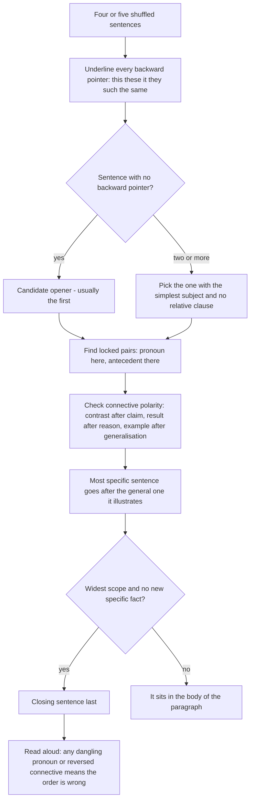

# Para Jumbles

A para-jumble question is a very small reading-comprehension question with the text taken away. Four or five sentences from one paragraph are shuffled, and you must restore the order in which they were written. Nothing is missing and nothing is invented, so the answer is not a judgement call: the sentences were adjacent in a real paragraph, and only one arrangement reads like English written by a person.

That is why this topic rewards four specific abilities rather than general "reading skill": recognising which sentence can open a paragraph, matching references to their antecedents, respecting connectives, and reading the shape of a paragraph — claim, development, illustration, conclusion. A candidate who learns to spot **anaphora** (a word that points back) and **connectives** solves almost every item in this topic.

**The four link types, in the order you should look for them**

| Link | Signal words | What it fixes |
| --- | --- | --- |
| Reference (anaphora) | *this, these, such, it, they, he, she, the former, the same, one* | The pointed-back sentence must come first |
| Connective | *however, therefore, hence, moreover, nevertheless, in addition, for example, thus, consequently* | Position relative to the sentence it comments on |
| Lexical chain | The same noun phrase or verb repeated, sometimes with a pronoun or synonym | Which sentences are neighbours |
| Logic and tense | Past before present, claim before illustration, specific after general | The paragraph's overall shape |

Reference is the strongest link because a pronoun that has no antecedent is a grammatical impossibility, and a paragraph is always grammatical.

### 🟢 Lite — Quick Review (1h–1d)

**The five rules that do most of the work**

1. **The first sentence points at nothing.** A paragraph opener cannot contain *this, these, such, it, they, the former, the same, such a, in this way* — unless the phrase refers to something inside the same sentence. Two openers in the set means one of them is a decoy; a sentence starting with any of those words is never first.
2. **Every connective has a fixed polarity.** *However / but / yet / nevertheless / on the contrary* must follow a claim. *Therefore / hence / thus / consequently / so* must follow a reason or a fact. *Moreover / in addition / furthermore* must follow something it adds to. *For example / such as / namely* must follow a generalisation. Reading a sentence out of order breaks this polarity, which is how you catch it.
3. **Illustrations come after the point they illustrate.** A sentence with a specific case, a number, a name or a quotation almost always follows the general statement it belongs to. Specifics are introduced, not announced.
4. **The last sentence generalises.** It repeats, concludes, interprets or recommends, and it usually introduces no new specific fact. A closing sentence is the one whose vocabulary is the most general and whose logical force is "so what?"
5. **Tense is a fixed sequence.** If a sentence reports something that happened and another describes a general truth, the event usually comes first and the general truth second — unless the general truth is setting up the event, in which case the connective tells you (*Before, After, When, Once*).

**A linked pair beats a guessed sequence.** Instead of building the paragraph one sentence at a time, find two sentences that must be adjacent and lock them. Two or three locked pairs usually leave one arrangement, and you finish by joining the pairs.

**The opener test, in practice**

| Sentence starts with | Can it be first? |
| --- | --- |
| *This trend… Such situations… These findings…* | No |
| *It is often argued that…* | No, unless it is genuinely the first sentence in a source passage |
| *The problem, however, is not…* | No — the *however* needs a preceding claim |
| *Therefore, X follows…* | No |
| *For instance, when X…* | No |
| *There are three reasons for this…* | No — points back |
| *A dictionary is a reference book…* | Yes — no backward pointer |
| *Many students believe that…* | Yes — a general opening move |

**The fastest reliable algorithm**

1. Underline every backward-pointing word in all the sentences.
2. Cross out the sentence with the most backward pointers from being first, and the one with the least as a candidate opener.
3. Find the sentence that a connective locks to a claim, and put the claim before it.
4. Place the most specific sentence (with a number, name or example) after the general sentence it illustrates.
5. Read the assembled paragraph aloud. If a pronoun has no antecedent or a connective points at nothing, you have the order wrong.

### 🟡 Standard — Regular Study (2d–2mo)

**Paragraph shapes you will meet again and again**

**Definition → example → implication.** The opener defines or classifies; the second gives a case; the third says what it means. Keywords: *which is called, this refers to, for example, hence, therefore, this shows.*

**Claim → objection → reply.** The opener states a claim; the second introduces the strongest counter-argument, usually introduced by *however, it may be argued, critics say*; the third answers it with *this is true, but, yet, nonetheless.* The reply sentence is the most common place to test whether you have found the middle: if a sentence contains "this is true, but", it must be third.

**General → specific → general.** Open with the general claim, give the specific evidence, and close by returning to the general with a widened meaning. The last sentence often restates the opening in new words; if you find two sentences that say almost the same thing, the one that adds a consequence is last.

**Chronology.** Past events in order, then a present generalisation, then a recommendation about the future. Tense alone fixes most of the sequence in this shape, and it is the shape where the students who rely on connectives alone fail, because a chronological paragraph may have no connectives at all.

**Cause and effect.** Cause first, effect second. A sentence beginning *this led to, consequently, the result was, it follows that* must follow the sentence containing the cause. A sentence beginning *because, since, owing to, due to* must follow the sentence containing the effect — and this is the exception that catches everyone, because *because* is a cause-word that points backwards from the effect to its reason.

**Locating the topic sentence among three candidates**

A topic sentence is defined by three properties: it has the **widest scope** (it uses the general nouns, not the specific ones), it has **no backward reference**, and it **asserts something**. Test each candidate:

- Does it contain a specific detail, a figure, a name or a quotation? It is probably not the topic sentence.
- Does it start with *this, these, it, they*? Not the topic sentence.
- Can a writer disagree with it? Only an assertion can be the topic sentence; a description of what exists is a detail.

The paragraph's topic sentence is frequently also its last, in the "return to the general" shape — which is why "which sentence is the topic" and "which sentence comes last" are sometimes the same answer, and why examiners avoid asking both about one paragraph.

**Building chains from lexical repetition**

Repetition is a link. If sentence 3 contains *study hours* and sentence 1 contains *study hours*, they are neighbours, and the more specific one comes first — the general term introduces, the specific term narrows. The chain often looks like this: *rural libraries* → *the buildings* → *those buildings* → *the buildings themselves*, and each step is a reference the previous one supplies.

**Working an example, sentence by sentence**

> *P1: City corporations in several states have begun counting the trees on the streets they maintain.*
> *P2: The first survey of one southern district found that barely a third of the roads listed on paper had any shade at all.*
> *P3: Where numbers are this low, the usual planting targets become meaningless.*
> *P4: Counting, in other words, is not paperwork; it is the first step towards finding out what was lost.*

- **P1 opens.** No backward pointer; it introduces the topic and a new agent, *city corporations*, which nothing else in the set supplies.
- **P2 follows P1.** *The first survey* refers back to the counting introduced in P1, and the past perfect logic — a survey being done after the practice began — is the natural order.
- **P3 follows P2.** *These numbers* and *this low* have no antecedent until P2 supplies the figures. *Where* introduces a consequence, so it must come after the fact.
- **P4 closes.** *In other words* re-reads the whole set, and the claim it makes is an interpretation of everything, not a new fact. A paragraph does not end on a statistic it has just introduced.

Reading the set in the order P1-P2-P3-P4 gives a paragraph with a topic, a fact, a consequence and a conclusion. Every other arrangement breaks a reference or a connective.

**The two-sentence trap**

In a four-sentence set there are six possible adjacencies; in a five-sentence set there are more, and the options sometimes differ only in the position of two sentences that are hard to place individually. When that happens, look for the pair that are *both* specific or *both* general, and remember the shape rule: an interpretation sentence goes after the thing it interprets, and an interpretation never opens.

### 🔴 Extended — Deep Study (3mo+)

**Discourse markers that lock a position, ranked by how often they appear**

1. **Anaphora:** *this, that, these, those, such, it, they, them, their, the same, the former, the latter, one, both, each.* Absolute certainty that the antecedent sentence comes first.
2. **Subordinators that introduce a reason:** *because, since, as, given that, owing to.* The reason comes **after** the effect, so a sentence with *because* is never first unless the effect is in the same sentence.
3. **Connectives of addition:** *also, too, likewise, similarly, in the same way, again.* These need a preceding item, and *too* especially must not open a paragraph.
4. **Connectives of contrast:** *however, but, yet, still, nevertheless, nonetheless, in contrast, by contrast, on the other hand, on the contrary.* Always second or later.
5. **Connectives of result:** *therefore, hence, thus, consequently, so, as a result, accordingly.* Always after a reason.
6. **Illustration markers:** *for example, for instance, such as, namely, like, to take one case.* Always after a generalisation.
7. **Sequence markers:** *first, second, then, next, finally, last, subsequently, meanwhile.* These give away the order outright if the set contains more than one.

Note the two near-identical pairs that are opposites in position: *like* and *such as* both introduce examples, but *like* must follow the general term within the same sentence (*roads like this one*), while *such as* starts a new example sentence and so must follow a completed generalisation. And *because* looks like a forward connector but is grammatically backward: it points from the effect back to the reason.

**The opener that is not an opener**

A frequent trap is a sentence that seems self-contained but cannot open a paragraph because its *relative* clause or participle points back: *"The scheme that was launched in 2019 has now been wound up."* Read as an opener it sounds fine, but the writer must have introduced *the scheme* earlier. When several sentences look like openers, prefer the one with the simplest subject and no relative clause.

**The closer that is not a closer**

A sentence with a new specific fact in it is rarely last, even if it contains a summary word. Real closing sentences are built from the paragraph's own vocabulary, use the writer's judgement (*it is this that…, the lesson is, what matters is…*), and add no data. If a candidate closing sentence introduces a figure, it belongs in the middle.

**Working by pairs instead of by sequence**

With five sentences the linear approach means too many trials. Do this instead:

1. Find the two sentences that are locked to each other by the tightest link — usually a pronoun in one and its noun in the other.
2. Find the sentence that must be first (the one with no backward link) and the sentence that must be last (the one with the widest scope and the most general vocabulary).
3. You now have a first, a last and at least one locked pair; place the pairs between them in the order their own connectives force.
4. Read the result once, checking polarity of every connective and antecedent of every pronoun.

This method is faster and it is also more reliable, because it never requires you to decide between two sentences in isolation — the pair tells you their order.

**What para jumbles are really testing**

The skill is **discourse competence**, the same skill that makes a written paragraph readable. The same four abilities appear in every item:

- **Cohesion** — the surface ties: pronouns, connectives, repeated vocabulary.
- **Coherence** — the logic: does this sentence belong between those two?
- **The rhetorical shape** — does a paragraph normally open with a general claim and close with a judgement?
- **Discourse markers** — the explicit signals a writer uses to tell a reader where they are.

Because the same four abilities appear every time, a candidate who solves ten items carefully will solve the next ten, which is why this is one of the most reliably learnable topics in the paper.

**Extended practice: from shuffled paragraph to self-checking**

Take any well-written paragraph of four to five sentences from a newspaper editorial, shuffle it in your head, and try to restore it. Then check yourself against three questions: does every pronoun have an antecedent? does every connective point the right way? does the paragraph have a topic, a development and a close? Writing down the three answers turns a passive reading into a deliberate one, and it is a practice you can do with any article in five minutes.

### 🧠 Memory Anchors

- **"The opener points at nothing."** *This, these, such, it, they, the former* cannot open a paragraph.
- **"Contrast after claim, result after reason, example after generalisation."** The polarity rule catches more mistakes than any other single habit.
- **"*Because* is backward."** It links the effect back to the reason, so it never opens a paragraph.
- **"Like stays inside, such as starts."** *Roads like this one* is in-sentence; *such as, for example* is a new sentence and must follow.
- **"Specifics are introduced, not announced."** A figure, a name or a case almost never opens a paragraph.
- **"No new facts at the end."** The closing sentence interprets; it does not introduce statistics.
- **"Lock pairs, do not build sequences."** Two anchored pairs usually decide a four-sentence set faster than any linear attempt.
- **Flashcard Q&A:**
  - *Which connective must never open a paragraph?* → Any connective: *however, therefore, hence, moreover, for example, besides* — all need something before them.
  - *A sentence begins "This trend shows that...". Can it be first?* → No, unless the referent is inside the same sentence.
  - *Which sentence is the topic sentence?* → The one with the widest scope, no backward reference, and a claim a writer could disagree with.
  - *Where does a specific example go?* → After the generalisation it illustrates, never before.
  - *What does "in other words" signal?* → A re-reading of the whole preceding set, so it belongs last.

### 🎯 Exam Traps & Error Log

1. **Putting a sentence with a backward reference first.** *This, these, such, it, they* cannot open a paragraph, and an item exists to punish exactly that.
2. **Reading connectives only in the forward direction.** *Because* and *since* point back from an effect to its reason, so a sentence containing them belongs after the one it explains.
3. **Putting the most specific sentence first.** A number, a name or a quotation is introduced, not announced, and it needs its generalisation in front of it.
4. **Closing on a new fact.** A sentence with a fresh statistic is a mid-paragraph sentence even if it also contains a summary word.
5. **Trusting the most recent noun as a pronoun's antecedent.** The grammar of the clause decides, not the distance; check whether the candidate can head the clause.
6. **Ignoring the tense sequence.** Chronological paragraphs can have no connectives at all, and past-before-present is then the only clue available.
7. **Deciding sentences in isolation.** Two sentences that each look like openers are resolved by the sentence they both point back to.
8. **Assuming chronological order because the topic is historical.** Chronology is a shape, not a default; check whether a claim-then-evidence shape fits the connectives better.
9. **Leaving a pair unresolved and guessing the whole order.** Lock the tightest pair first; it eliminates half the arrangements on its own.
10. **Stopping before the read-aloud check.** The fastest verification is reading the assembled paragraph once; dangling references and reversed connectives announce themselves.

### 🧪 Self-Test — 8 Questions with Worked Answers

Answer each on paper before reading the solution. The sets are drawn from the same method the chapter teaches.

**Set A — arrange into the correct order:**
- **P1** City corporations in several states have begun counting the trees on the streets they maintain.
- **P2** The first survey of one southern district found that barely a third of the roads listed on paper had any shade at all.
- **P3** Where numbers are this low, the usual planting targets become meaningless.
- **P4** Counting, in other words, is not paperwork; it is the first step towards finding out what was lost.

1. **What is the correct order of Set A?**
   **P1 → P2 → P3 → P4.** P1 has no backward pointer and introduces a new agent, so it opens. P2's *the first survey* refers back to the counting introduced in P1. P3's *these numbers* and *this low* need P2's figures, and *where* introduces a consequence, so it follows the fact. P4 re-reads the whole set with *in other words* and adds no new data, so it closes.

2. **Which sentence of Set A must come first, and why?**
   **P1**, because it is the only sentence containing nothing that points back. P2 points to a survey, P3 to numbers, P4 to the act of counting. A paragraph cannot open by referring to something the reader has not been given.

3. **Which sentence of Set A must come last, and why?**
   **P4.** It is the only sentence that interprets rather than reports, and its second clause states the writer's judgement, which is what a paragraph ends on. P2 also contains a figure, and a figure is introduced, never used to close.

4. **What would go wrong if P3 were placed before P2?**
   P3 contains *these numbers* and *this low*, which would have no antecedent at all. The sentence would be ungrammatical. This is the fastest check available: place the two sentences both ways and see which order produces a complete reference.

**Set B — arrange into the correct order:**
- **Q1** Sleep research has moved a long way from the advice that adults need eight hours.
- **Q2** What matters more consistently is the timing of the sleep window and how stable it is.
- **Q3** A person who sleeps at two and wakes at nine on Sunday has not rested; they have shifted the window instead.
- **Q4** Hence the recommendation that has survived the evidence: keep the same hours, not merely the same number of hours.

5. **What is the correct order of Set B?**
   **Q1 → Q2 → Q3 → Q4.** Q1 opens — it introduces sleep research and a well-known claim, with no backward reference. Q2 contrasts with it: *what matters more consistently* is a correction of what Q1 reported, so it comes second. Q3 illustrates Q2 with a specific case, and *they* in Q3 refers back to the person in the same sentence, so it is self-contained. Q4 begins with *hence* and draws a conclusion from the whole set, so it closes.

6. **In Set B, which sentence contains the connective that fixes its position most securely?**
   **Q4**, because *hence* is a result-marker and therefore must follow a reason. Once you know Q4 is last, the remaining three are ordered by Q1 opening and Q3 illustrating Q2. Note that *hence* is a weaker clue than the references in Set A, which is why the two sets test different strengths of the same method.

7. **Why is Q3 a poor candidate for the first position?**
   It is very specific — a named time, a named day, a numerical implication — and it illustrates the claim in Q2 without introducing it. A paragraph that opened with this case would be giving the reader an example before the point the example serves, which is the most common structural mistake in shuffled sets.

8. **In Set B, is Q1 or Q2 the topic sentence? Explain the difference.**
   **Q1 is the topic sentence.** It carries the widest scope, asserts something a writer could disagree with (that the old advice has been superseded), and refers back to nothing. Q2 is a **claim within the paragraph**: it is the second thing the writer wants to say, and it is the point that Q3 illustrates. A candidate who picks Q2 as the topic sentence has picked a strong sentence, not the opening one, and the difference between those two is exactly what the question tests.

### 💡 Pro Tips

1. **Underline backward pointers first, before you read for meaning.** Ninety seconds of marking turns a guessing problem into a reference problem, and reference problems are solvable.
2. **Find the opener by elimination, not by liking.** The sentence you find most interesting is very often not the first one.
3. **Lock the tightest pair.** A pronoun in one sentence and its noun phrase in the other is a certainty; use it before you look at any connective.
4. **Read connective polarity out loud.** If a sentence starting with *but* or *therefore* comes immediately after another sentence starting the same way, the order is wrong.
5. **Watch for the summary sentence and park it for last.** *In other words, hence, what this means, the point is that* — it is almost never first and almost never in the middle.
6. **Use specificity as a position marker.** The sentence with the most concrete detail is in the body of the paragraph, after the general claim it supports.
7. **Practise on editorial paragraphs, not on random lists.** Paragraphs from opinion columns have clear shape — claim, evidence, rebuttal, close — which is exactly the shape examiners rearrange.
8. **Finish with a ten-second read-aloud.** Dangling pronouns and reversed connectives are obvious when the text is spoken and invisible when it is scanned.

---

## Continue your study

- **[View this topic in your CUET UG roadmap](/roadmap/?exam=cuet&duration=1mo)** — see where "Para Jumbles" fits in your personalised plan
- **[Build a quick revision plan](/roadmap/?exam=cuet&duration=1d)** — 1-day sprint covering highest-weight topics
- **[CUET UG exam overview](/exams/cuet/)** — pattern, eligibility, and syllabus
- **[All English notes](/notes/cuet/english/)** — browse sibling topics in this subject

---
*Content adapted based on your selected roadmap duration. Switch tiers using the selector above.*
