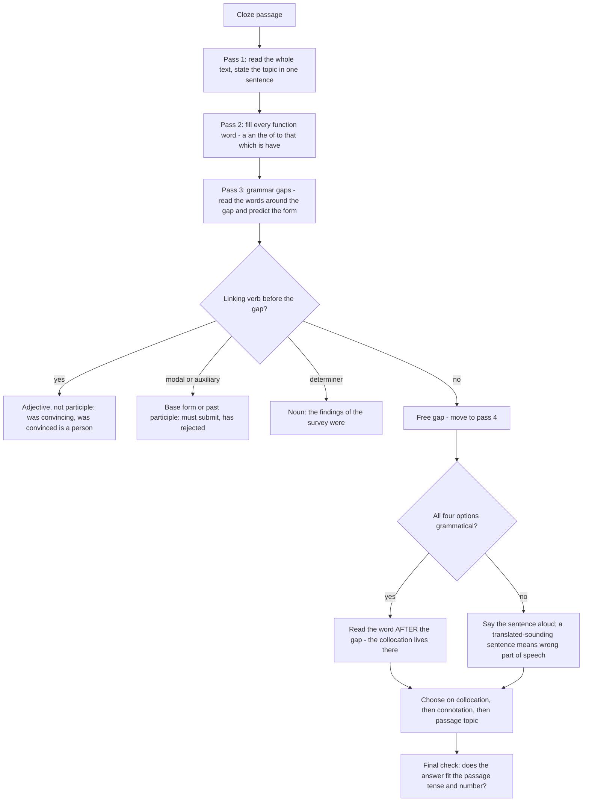

# Cloze Tests

A cloze test is a passage with gaps, and it looks like a vocabulary test while being mostly a grammar test. That is the first thing to understand: the options for a gap are designed so that several of them make sense in the world, and only one of them is the right word *in that structure*. The candidate who reads the sentence for meaning will sometimes guess correctly and will sometimes not; the candidate who checks the structure first will be right far more often, because structure is a checkable thing and meaning is not.

Every gap belongs to one of three types, and they are solved in three different ways:

| Gap type | What is tested | How you solve it |
| --- | --- | --- |
| **Function word** | Articles, prepositions, pronouns, auxiliaries, conjunctions | Recall the fixed usage; no context needed |
| **Grammar-constrained** | Number, tense, degree, part of speech, agreement | Read the words immediately around the gap and predict the form |
| **Free or lexical** | Word choice between plausible options | Collocation, connotation, and the paragraph's own topic |

Roughly speaking, a page of cloze contains gaps of all three types, and a good cloze pass works through them in a fixed order rather than reading the text once and hoping.

### 🟢 Lite — Quick Review (1h–1d)

**The four-step pass**

1. **Read the whole passage once without stopping**, including the gaps. Get the topic and the flow. Closes are written about a specific subject, and the subject is the most reliable clue available to the free gaps.
2. **Fill the function words on sight.** *The, of, to, that, which, is, have, however* are not questions; they are memory. Each one is a guaranteed mark if you know it, and a guaranteed loss if you guess.
3. **Fill the grammar-constrained gaps** by predicting the form: plural or singular, past or present, noun or verb, adjective or adverb.
4. **Leave the free gaps to last**, then attack them with collocation and connotation rather than with vague resemblance.

**The position tells you the word class — use it before anything else**

| What sits immediately before the gap | The gap must be |
| --- | --- |
| a / an / the / this / that / my / his / her | a **noun** (or a noun used as adjective) |
| to | a **verb** in the infinitive, or a noun if *to* belongs to a phrase |
| a linking verb (*is, was, seems, became, remained*) | an **adjective** or a noun |
| an adverb (*very, quite, deeply, highly*) | an **adverb**, or an adjective after *very* in older usage |
| a modal (*can, may, must, should*) | a **verb** in the base form: *must submit*, never *must submits* |
| an auxiliary (*has, have, will, would, had*) | a **past participle**: *has rejected*, never *has reject* |
| nothing in the same sentence | anything is grammatically possible; use the passage's topic |

**The inflections to read aloud as you go**

- Plural **-s** on the gap: the verb must be third-person singular (*the committee **decides***) or the noun plural (*many **sources***).
- **-ed** after *has, have, was, were, had*: past participle, and the verb must be transitive (*has been **revoked***).
- **-ing** after *to, enjoy, avoid, by*: a gerund or present participle.
- **-er / -est**: comparative and superlative, which need *more* and *most* or the *-er/-est* form, never both.

**The prepositions worth memorising as one block**

*depend **on**, consist **of**, result **in**, lead **to**, attributed **to**, based **on**, due **to**, capable **of**, aware **of**, afraid **of**, similar **to**, different **from**, concerned **about**, interested **in**, familiar **with**, remind **of**, accuse **of**, warn **against**, prefer **to**, superior **to**, apologise **for**, blame **on**, congratulate **on**.

**The uncountable nouns that have no plural**

*Advice, information, furniture, luggage, news, progress, research, evidence, equipment, work, homework, work, knowledge, work* — for all of these you use **much, little, a piece of, an item of**, never *many* or a plural **-s**. *An advice* and *informations* are permanent errors, and they are among the most frequently set cloze and error-spotting items there is.

### 🟡 Standard — Regular Study (2d–2mo)

**Type 1 — function words**

These carry almost no meaning, which is exactly why they are the cheapest marks in the section and the most commonly thrown away by nervous candidates.

**Articles.** The decision tree that handles nearly every case:

1. Is the noun countable? If not (*advice, information, furniture, news, water, work, progress, evidence*), no article and no plural: *I gave him some **advice***.
2. Is it the first mention of a countable noun? Use **a / an**.
3. Is it mentioned again later? Use **the**.
4. Is it unique in the situation (the sun, the president, the only one)? Use **the**: *"She is **the** only teacher in the department who volunteers."*
5. Is it used in a general sense, "all such things"? Use the **zero article**: *"Education **is** a right."*
6. Are you naming something that belongs to someone? Use **the** plus an adjective: *"the roof **of** the house."*

**Pronouns.** The gap must agree with its antecedent in number and gender, and it must be capable of heading the clause. *The team decided that **they** would finish* — *they* refers to the members, which is correct usage; *it* would be correct if the sentence referred to the team as a single decision-maker. Test by making the resulting sentence read naturally aloud; a pronoun that sounds like a non-native sentence is the wrong one.

**Auxiliaries and modals.** *have/has/having* take the past participle; *do/does/did* takes the base form (*does not **matter***, not *does not matters*); *will, would, shall, can, may, must, should* take the base form; *be* is irregular in three forms (*am, is, are, was, were, been, being*).

**Type 2 — grammar-constrained vocabulary**

Here the word class is decided by position and the form by grammar, and only after that do you choose the meaning.

> *The findings of the survey were ______ (informative / inform / information / informed).*

*Were* demands a participle or an adjective, so *informative* and *informed* survive. The plural subject *findings* rules out a singular reading of *information*, and the sentence wants a description, so **informative**. Both eliminations were structural, and neither required a dictionary.

> *Her explanation was ______ (convincing / convince / convinced / conviction).*

*Was* takes an adjective; *convincing* describes the explanation, *convinced* would describe a person. **Convincing**. A large share of cloze items are exactly this shape: a linking verb, four forms of one root, one grammatical.

**Type 3 — free vocabulary**

Now the context decides. Use three filters in order: **collocation** (which word does the verb or noun actually take?), **connotation** (which word matches the writer's stance?), and **topic** (which word is the passage actually about?). The gap's neighbours usually contain the collocation directly — *"took a very ______ view of the proposal"* wants a word that goes with *view*, not with *proposal*.

**Correlative pairs, which are tested more than any other cloze feature**

| Pair | Requirement |
| --- | --- |
| *either ... or* / *neither ... nor* | The verb agrees with the subject **nearer** it: *"Neither the manager nor the clerks **were** present."* |
| *not only ... but also* | The verb agrees with the **first** subject: *"The report is not only lengthy but also **conceals** the source."* |
| *both ... and* / *either ... and* | Usually plural: *"Both the cost and the delay **were** acceptable."* |
| *so ... that* / *such ... that* | *so* + adjective or adverb, *such* + a noun phrase: *so clear that*, *such a clear result that* |
| *as ... as* / *not so ... as* | The two items must match in class: adjective with adjective, adverb with adverb |
| *no sooner ... than* | The first clause is inverted: *"No sooner **had** he left than the phone rang."* |

**A worked cloze passage with the reasoning shown**

> *When a research team (1)______ a result that nobody else has reported, the first duty is to check whether the result can be repeated. A single experiment is evidence, not (2)______ . Replication is what converts a promising finding into knowledge, and the (3)______ of replicating a result is that it exposes the small mistakes — a mislabelled tube, a misread chart — that a lone experiment, run by the people who built it, is unlikely (4)______ . Researchers who publish a single unrepeated measurement have, in effect, asked readers to trust a (5)______ they have not had time to test.*

1. **announces / refuses / repeats / denies.** The gap follows *team* and needs a verb, so *refuses* and *denies* fail on meaning only if the sentence is read: a team refuses a result? No. The object is *a result that nobody else has reported*, and the sense is "made public" → **announces**.
2. **proof / rule / method / law.** The logic of the sentence is that one experiment is real evidence but not certainty. "Evidence, not **proof**" is the correct opposition, and the other three are categories of method, not levels of certainty.
3. **value / risk / excuse / argument.** The clause after it is positive — replication exposes mistakes — so the word must be positive too. **Value** is the only option that fits the construction *the value of doing something is that…*.
4. **to notice / for noticing / of noticing / in noticing.** After *unlikely* only the infinitive is grammatical: **to notice**.
5. **claim / fact / rule / finding.** *Claim* is what is asserted without independent test; a *fact* is by definition established, so asking readers to trust an untested *fact* would contradict the sentence's own logic. **Claim** is the answer, and the noun fits the article *a* as a countable noun.

**Consistency as a fourth check**

Closes are usually written in one tense. If the passage is in the past perfect, a present-tense gap is suspicious. If the passage is in the present, a past gap needs a reason — a *since* clause, a *used to* phrase or a reported speech frame. The topic sentence's tense usually sets the passage's tense, and one gap that is out of step with the whole is often the wrong one.

### 🔴 Extended — Deep Study (3mo+)

**The order that maximises marks in a multi-gap passage**

Most cloze passages give one set of options for every gap, which changes the strategy completely: options are not deleted after use, so the same word can be right in more than one gap, and the gaps are not independent. Work in this order.

1. **Every function word**, straight down the page. Guaranteed, fast, and it settles the sentence structure so the harder gaps become easier.
2. **Grammar-constrained gaps** that share a root: if options for gap 3 and gap 7 include the same family, solve them together, because the passage's tense or number settles both at once.
3. **One-word-of-meaning gaps**, taking the most confident first. Confidence order matters more than order of appearance; a correct early answer keeps your reading flow, and a doubtful late answer does not.
4. **The two or three hardest gaps**, by elimination rather than by inspiration.

**Test the option in place, out loud**

The most reliable check in a cloze is not understanding; it is substituting and reading. Say the full sentence with the option in it. If the sentence sounds like English, the option is probably right; if it sounds translated — *"the report is not only lengthy but also concealment the source"* — the option is the wrong part of speech even if its root is right. This check takes five seconds and catches the majority of errors.

**The all-four-look-fine problem, and the rule that solves it**

Sometimes all four options produce a grammatical sentence, and meaning has to decide. The rule that resolves it fastest: **read the word after the gap, not the word before it.** The noun after a verb, or the noun before a preposition, is what decides the collocation, and one of the four will not collocate with it. *"He took a very ______ view"* — *courageous view* is grammatical and wrong, because *view* collocates with *bold, controversial, moderate, dogmatic*, and only one of the four options is in that set.

**Distractors in a cloze are not random**

Each wrong option is placed there for a reason, and reading the reason tells you what the question is testing.

| Distractor type | Why it is there | What to do |
| --- | --- | --- |
| Same root, wrong part of speech | Tests whether you checked the grammar | Use the position of the gap |
| Same part of speech, wrong collocation | Tests lexical knowledge | Read the neighbouring noun |
| Plausible in meaning, wrong in the passage's logic | Tests whether you read for sense | Use the paragraph's topic |
| Correct in a different context | Tests whether you can discriminate | Ask which context *this* passage is |
| Grammatical but absurd | Tests idiom | Read the whole sentence aloud |

Once you can name the distractor type in front of you, you know exactly which test to apply, and the question stops being a guessing game.

**Word formation, which is the highest-yield technical revision for cloze**

If the gap is surrounded by adjectives, the answer may be a verb, an adverb or a noun from the same root. Learn the endings as a system: **-tion/-sion/-ment/-ance/-ity/-ness/-ship** make nouns; **-able/-ible/-ous/-ive/-al/-ful/-less/-ist/-ic** make adjectives; **-ly** makes adverbs; **-ise/-ify/-ate** make verbs. The question then becomes: which form does the position demand? And the secondary question: which degree? *Significant, significantly, significance* is one testable unit, and a cloze gap anywhere near that root can be answered from the grammar alone.

**Reading a passage with gaps: three practice modes**

1. **Gist only** — read it through without filling anything, then state the topic in one sentence. This activates the topic clue for every later gap.
2. **Closed gaps** — fill the function words only. The passage becomes readable, and readability is what lets you answer the rest.
3. **Open gaps** — now attack the free vocabulary with the passage in front of you.

Ten minutes of this on a real cloze is worth more than an hour of reading lists, because it trains the three passes as separate reflexes.

### 🧠 Memory Anchors

- **"Structure first, meaning second."** The options are built so that meaning alone leaves two alive and grammar leaves one.
- **"Read the position, not the passage."** Determiners want nouns, linkers want adjectives, modals want base verbs.
- **"Read the word after the gap."** When all four options fit, the collocation that decides is usually after the blank.
- **"No plural for the uncountables."** Advice, information, furniture, luggage, news, progress, research, evidence. Much and little, not many.
- **"Nearest subject wins, first subject wins."** *Neither…nor* follows the nearer subject; *not only…but also* follows the first. Both are tested constantly.
- **"Name the distractor."** Same root wrong class, same class wrong collocation, right meaning wrong logic — each needs a different test.
- **"Unlikely to, capable of, afraid of."** Verb plus preposition is a fixed pair; memorise them as pairs, never as words.
- **Flashcard Q&A:**
  - *Linking verb, then a gap: what form?* → Adjective, or a participle describing a person. *The explanation was convincing*, not *convinced*.
  - *After "has", what form?* → Past participle. *has rejected*, never *has reject*.
  - *After a modal, what form?* → Base form. *must submit*, never *must submits*.
  - *All four options fit and you are stuck?* → Read the word after the gap and test the collocation.
  - *Which single error in a cloze is most avoidable?* → Putting a plural **-s** on an uncountable noun, or dropping the article on a first-mention countable noun.

### 🎯 Exam Traps & Error Log

1. **Choosing on meaning alone.** With four plausible words, meaning is the slow filter; the position of the gap decides the word class in seconds.
2. **Dropping the article on a countable noun.** *"She is teacher in my school"* is wrong; the first mention needs *a*, a repeat needs *the*, a unique one needs *the* as well.
3. **Putting a plural on an uncountable noun.** *Informations, advices, furnitures, knowledges, researchs* are all wrong.
4. **Forgetting the -s on a third-person singular verb.** *"The committee decide"* is wrong even when the meaning is perfect; the subject has moved you.
5. **Putting a past participle where a base form is required.** After *has, have, will, would, must, can* you need the participle after *has* and the base form after the modals; mixing them is the commonest tense error in cloze.
6. **Ignoring the sentence's tense.** A present-tense gap inside a past-tense passage needs a stated reason, and a past-tense gap in a present passage usually means a *since* clause or reported speech.
7. **Losing the *-ing* on a gerund after *to, by, enjoy, avoid, without*.** *"By the report" → **by reporting**.*
8. **Filling correlative gaps independently.** *Either…or* and *neither…nor* must be solved together, because the agreement of one clause is decided by the other.
9. **Using the same option twice when the passage allows it.** In shared-option sets an option may be right in two gaps, and avoiding repeats is a superstition that loses marks.
10. **Reading a long gap as a long answer.** A long option is not more likely than a short one; option length is often a deliberate decoy, so judge only fit.

### 🧪 Self-Test — 8 Questions with Worked Answers

Fill the gaps on paper before reading the solutions. The passage is followed by four targeted gap questions.

> **Passage**
>
> When a research team (1)______ a result that nobody else has reported, the first duty is to check whether the result can be repeated. A single experiment is evidence, not (2)______. Replication is what converts a promising finding into knowledge, and the (3)______ of replicating a result is that it exposes the small mistakes — a mislabelled tube, a misread chart — that a lone experiment, run by the people who built it, is unlikely (4)______. Researchers who publish a single unrepeated measurement have, in effect, asked readers to trust a (5)______ they have not had time to test.

1. **Gap 1: "the team ______ a result that nobody else has reported."**
   *Options: (A) announces (B) repeats (C) refuses (D) denies.* **(A) announces.** The phrase *a result that nobody else has reported* is new information, so the verb must be about making it public. *Repeats* is contradicted by *nobody else has reported*; *refuses* and *denies* need an offer or a claim, not a result.

2. **Gap 2: "A single experiment is evidence, not ______."**
   *Options: (A) proof (B) law (C) method (D) science.* **(A) proof.** The sentence sets two levels against each other — some evidence, but not certainty — and *proof* is the level above evidence. The other three are kinds of system or method, so the opposition the sentence draws does not hold with them. This gap is decided by the logic of the sentence, not by grammar.

3. **Gap 3: "the ______ of replicating a result is that it exposes the small mistakes."**
   *Options: (A) risk (B) value (C) excuse (D) warning.* **(B) value.** The clause after *is that* is positive — replication is a good thing — so the noun must be positive too. *Risk* and *warning* would require the clause to describe a danger, and *excuse* is nonsense in this construction. Grammatically all four survive, so the gap is decided entirely by the logic of the sentence.

4. **Gap 4: "is unlikely ______."**
   *Options: (A) to notice (B) for noticing (C) of noticing (D) in noticing.* **(A) to notice.** After an adjective such as *unlikely, likely, unable, eager* only the infinitive is grammatical. *For, of, in* + *-ing* require a different verb (*responsible for*, *capable of*, *interested in*), so all three fail on structure.

5. **Gap 5: "asked readers to trust a ______ they have not had time to test."**
   *Options: (A) fact (B) claim (C) rule (D) census.* **(B) claim.** A *fact* is by definition established, so an untested fact contradicts the sentence. A *claim* is precisely something asserted that others have not verified, and it takes the article *a* as a countable noun. *Rule* and *census* do not fit an untested assertion.

6. **Choose the article: "She is ______ only teacher in the department who volunteers for the outreach programme."**
   ***the***, because *the only* makes the noun unique in the situation, and a unique noun takes *the*. The distractor here is *an*, which is what a first mention would take, and *a* is impossible before *only*. This is the single most-tested article rule in competitive papers.

7. **Choose the correct form: "The police gave much ______ about the cause of the accident."**
   ***information***, which is uncountable and pairs with *much*. *Information* has no plural, so *informations* is wrong, and *advice, news, knowledge* — the other common answers — do not match *about the cause*; advice and knowledge are not given "about causes", and news is a mass noun that would not be pluralised either. The rule is: *much + uncountable*, and the sense must be *details of fact*, which is *information*.

8. **Complete the correlative pair with the right forms: "The report is not only ______ but also ______ the original source of the data."**
   ***long, conceals*** — the full sentence being *not only long but also conceals the original source*. Two points: the verb agrees with the **first** subject, *the report*, so it is *conceals* and not *conceal*; and the second blank must be a verb in meaning because it shares the subject with the first clause. The wrong forms that are usually offered are *longer* (a comparative the sentence does not call for) and *conceal* (wrong agreement after *not only*).

### 💡 Pro Tips

1. **Do the function words first, every time.** They are the fastest marks in a cloze and they settle the sentence structure for the harder gaps.
2. **Say the position out loud before you look at the options** — "determiner before the gap, so a noun". Naming the slot cuts the options in half.
3. **Use the paragraph's topic as a clue for the free gaps.** A passage about tree cover will not accept an option about a library, however grammatical the sentence is.
4. **When four options fit, read the word after the gap.** The collocation that decides is almost always downstream.
5. **Learn word families, not words.** If you know *significant, significantly, significance*, you can answer any of a dozen gaps from the grammar alone.
6. **Memorise uncountable nouns as a single list of ten.** Ten words, four minutes, and it removes a recurring source of lost marks in cloze, error spotting and sentence correction alike.
7. **Do correlative pairs out loud, with the subject repeated.** *"Neither the manager nor the clerks **were**"* — saying it makes the nearest-subject rule automatic.
8. **Read each filled sentence aloud once at the end.** Translated-sounding English is the fastest error detector there is, and it costs no extra time because you are already checking the grammar.

---

## Continue your study

- **[View this topic in your CUET UG roadmap](/roadmap/?exam=cuet&duration=1mo)** — see where "Cloze Tests" fits in your personalised plan
- **[Build a quick revision plan](/roadmap/?exam=cuet&duration=1d)** — 1-day sprint covering highest-weight topics
- **[CUET UG exam overview](/exams/cuet/)** — pattern, eligibility, and syllabus
- **[All English notes](/notes/cuet/english/)** — browse sibling topics in this subject

---
*Content adapted based on your selected roadmap duration. Switch tiers using the selector above.*
