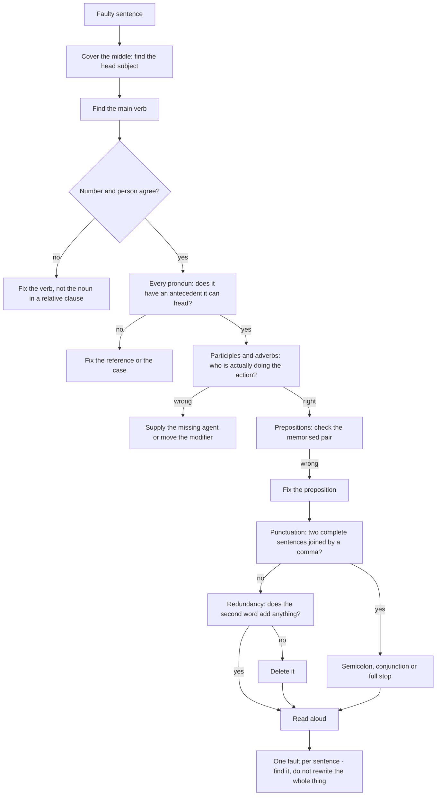

# Sentence Correction

A sentence-correction item gives you a sentence with one fault in it, and asks you either to rewrite the sentence correctly or to choose the corrected version. The fault is never a matter of taste. It is one of a small number of things: an agreement failure, a wrong word class, a misplaced modifier, a preposition in the wrong place, a dangling reference, a punctuation splice, or a phrase that is simply redundant. Every one of them can be found by inspection if you know what to inspect.

The reason so many students miss these is that they read the sentence for meaning. A sentence with a faulty verb still says something, and reading for sense produces no alarm. The fix is to stop reading the sentence and start **taking it apart**: find the subject, find the verb, make them agree, then check everything that is hanging off the main clause.

**The error families — every item belongs to one**

| Family | Typical fault | Test |
| --- | --- | --- |
| Verb | tense, agreement with the subject, misuse of modal or infinitive | Subject + verb must agree in number and person |
| Noun | plural missing or wrongly added, article missing | Countable or not? First mention or repeat? |
| Pronoun | wrong antecedent, wrong case, wrong number | Can it head the clause it appears in? |
| Part of speech | adjective for adverb, noun for participle, preposition for conjunction | What does the position demand? |
| Modifier | misplaced or dangling participle, adjective in the wrong place | Who is actually doing the action? |
| Preposition | wrong collocation | Memorised as a pair |
| Punctuation | comma splice, missing comma after an introductory clause, wrong apostrophe | Read the sentence as two breaths |
| Redundancy | *free gift, return back, final conclusion* | Does the second word add anything? |

### 🟢 Lite — Quick Review (1h–1d)

**The six-step routine**

1. **Find the main subject.** Cover the words between the subject and its verb with your thumb. Whatever is left is the head.
2. **Find the main verb.** It is the first form of *be* or the first verb that matches the subject.
3. **Make them agree.** Number first, then person, then tense.
4. **Check the pronouns.** Every one must have an antecedent and be able to head its clause.
5. **Check the modifiers.** A participle or adjective must sit next to the noun it modifies.
6. **Read it aloud.** A comma splice, a missing comma or a repeated meaning is obvious when spoken.

**Agreement, the rules that are actually tested**

- *A number of* students **are** — but *the number of* students **is**, because the head is *number*. The same holds for *a group of, the majority of, the list of, none of, either of, neither of*, all of which take a singular verb.
- *Each, every, either, neither, one of* → singular verb. *"Neither of the answers **is** correct."*
- *A subject joined by **and** takes a plural verb; a subject joined by **or / nor / either…or / neither…nor** takes the verb of the subject **nearer** it; a subject with **along with, as well as, together with, besides, in addition to, apart from** takes the verb of the **main** subject.*
- *There is* one thing, *there are* two. Never decide from the noun that follows *there* without checking the verb.
- Uncountable nouns take a singular verb: *The news **is** disturbing, the information **was** useful, the furniture **is** old.*
- A collective noun takes a singular verb in the standard exam treatment: *The committee **has** decided.* (*Members of the committee have* is the plural form and is also correct, so avoid options built on it.)

**The twenty corrections worth memorising**

| Wrong | Right | Why |
| --- | --- | --- |
| The number of applicants **are** rising | ... **is** rising | Head noun is *number* |
| A number of applicants **is** rising | ... **are** rising | After *a number of*, plural |
| He gave me some useful **informations** | ... some useful **information** | Uncountable |
| If I **would have** known | If I **had** known | Third conditional uses *had* |
| No sooner he reached **than** it rained | No sooner **had** he reached **than** it rained | Inversion after *no sooner* |
| He is **more taller** than his brother | He is **taller** | No double comparative |
| One of the boys **are** absent | One of the boys **is** absent | *One of* is singular |
| Each of the boys **have** their reasons | Each of the boys **has** his or her reason | *Each* is singular |
| I am used to **work** hard | I am used to **working** hard | *used to + -ing* |
| He **used to** smoke | He **does not** smoke any more | *used to* is the past habit |
| The scenery's beautiful | The scenery **is** beautiful | *Scenery* is uncountable |
| He is **one of the best reporters that** the paper has | ... **whom** the paper has | Pronoun as object of a preposition |
| She gave it to John and **I** | ... to John and **me** | Case follows the preposition |
| **Between** you and **I** | **Between** you and **me** | Case after *between* |
| A free **gift** | A gift | Redundancy |
| Please **return back** the form | Please **return** the form | Redundancy |
| **Advance planning** is required | **Planning** is required | Redundancy |
| He **discussed about** the plan | He **discussed** the plan | *Discuss* takes no preposition |
| This is a **matter of** fact | This is a **matter of** fact — *but* "a fact of life" and "as a matter of fact" are the fixed phrases | Prepositional phrase misuse |
| I am **irrespective** of his opinion | **Regardless of** his opinion | *Irrespective* is an adjective |

### 🟡 Standard — Regular Study (2d–2mo)

**The anatomy of a sentence and where faults hide**

Take a sentence and split it: **subject — verb — object — modifiers.** Faults cluster at the joints.

- **At the subject–verb joint:** agreement, and the trap is the long subject with a noun in the middle. *"The box of chocolates that arrived yesterday **is** on the table."* The subject is *box*, singular; *chocolates* is inside a relative clause and does nothing.
- **At the verb–object joint:** the wrong word class. *"He **gave** a **complement**"* is fine; *"He gave a **compliment**"* changes the meaning. Verbs that need particular objects — *suggest, propose, discuss, describe, explain, mention* — take no preposition at all.
- **At the modifier joint:** a participle must attach to the noun it describes. *"Lacking the necessary funds, the project was postponed"* says the project lacked funds, which is not the intended sense. The fix is to give the missing human: *Lacking the necessary funds, **the team** postponed **the** project.*
- **At the pronoun joint:** the antecedent must exist and must be capable of heading the clause. *"The government issued a statement that **it** would review the policy"* — *it* is ambiguous between the government and the statement, so the sentence is faulty until the antecedent is fixed.
- **At the punctuation joint:** two complete sentences joined by a comma is a comma splice. Fix with a semicolon, a conjunction, or a full stop. A missing comma after an introductory clause (*After the meeting ended, we left*) is the other common one.

**The dangling and misplaced modifier, taught properly**

- **Misplaced:** an adjective or adverb in a position where it can attach to the wrong noun. *"She had only a small **cold**" → *"a small **cold** only"*?* The standard example is *"Walking down the lane, the **car** fell into the ditch"* — the car does not walk. The writer is fixed by choosing a human subject or by moving the modifier into the main clause: *"As she walked down the lane, she saw the car fall into the ditch."*
- **Dangling:** the subject of the main clause is not the one doing the action of the participle. *"Awarded the first prize, the **judges** smiled."* Fix: *"The **judges**, who were awarded the first prize, smiled"* — no, that is wrong. The correct fix supplies the missing agent: *"After being awarded the first prize, **she** smiled"*, or recast as *"**Having been** awarded the first prize, **she** smiled."* The rule to remember: a participle can never act as a subject of the main clause, so if the participle's real subject is not in the sentence, the sentence is incomplete.

**The preposition test**

Prepositions are the largest single source of marks in correction items, because they are learned as pairs. Learn these as pairs and check each one mechanically:

*discuss about, enter into (wrong as a verb of meeting: you enter a room, you enter **into** an agreement), emphasise on, explain me, inquire into, marry with, reach to, request for (wrong when meaning ask a person to do something: *request you to send*), resemble with, surprise to, worry about, listen, arrive at/in to a place, deprive of, remind of, consist of, depend on, rely on, insist on, insist that, search for, blame for a person / blame on a thing, warn against, congratulate on, prevail over, provide for, conform to, comply with, submit to, object to, refer to, succeed in, participate in, preside over, interfere with, coincide with, combine with, cope with, charge with, fill in, dwell on, insist upon.*

**The redundancy list, and why it is a real fault**

Some phrases in English are duplicated words, and a duplicated word is an error of logic, not of style. *Free gift* (a gift is free), *return back* (to return is to go back), *final conclusion* (a conclusion is final), *advance planning* (planning is done in advance), *past history* (history is past), *new innovation* (an innovation is new), *cancelled cancellation* (the noun for the action of undoing a cancellation), *repeat again*, *end result*, *coincide together*, *each and every* (and not *each and every one*), *first and foremost* (only in the fixed phrase), *close proximity*, *complete destruction* is fine but *completely destroyed* is better. Redundancy is tested in both correction and error-spotting items and is recognised instantly if you read the phrase slowly.

**The infinitive, gerund and participle, the three -ing/-to forms**

- **Infinitive** after *to, and, or* when the two verbs have the same subject: *"He came **to see** and **to meet** her."* A bare *and* between two infinitives drops the second *to*.
- **Gerund** after a preposition: *"by **checking**, without **asking**, after **looking**."* And after *enjoy, avoid, finish, mind, consider, risk*: *"She avoided **answering**."*
- **Present participle** in a continuous tense: *"She **is writing**."*
- **Past participle** after *have, has, had, was, were, be, been, being*: *"The letter **has been** sent"*, *"The work **is being** done"*, *"She **is** well **known**."*

### 🔴 Extended — Deep Study (3mo+)

**The reconstruct-and-compare technique**

The most powerful correction method is also the simplest, and almost nobody uses it.

1. **Hide the options.**
2. **Rewrite the sentence in your own words**, saying what you think the writer meant. Fix everything that is wrong as you go.
3. **Compare your version with the given sentence**, part by part, and mark every difference.
4. **Choose the option closest to your version.**

This works because a correction item is always a comparison between a faulty sentence and a correct one, and the differences between them are exactly what the item is testing. It also works for options you would never have produced from memory, because you are no longer recalling a rule — you are checking a hypothesis.

**Rewriting the sentence as a question and a negative**

A second method that catches agreement and word-class faults: turn the sentence into a question and then into a negative, and see which parts survive.

> *"The committee have decided to postpone the meeting."*
> **Question:** *Has the committee decided…?* — singular survives, so the singular is correct.
> **Negative:** *"The committee haven't decided"* — sounds wrong; *"The committees haven't decided"* — fine.

The same trick for word class:

> *"The report is a lengthy analysis that discusses the causes."* → Question: *"Is the report a lengthy analysis?"* The gap is a noun phrase, so a noun belongs there. An adjective would fail the question test.

**Long and complex sentences: the thumb technique**

Errors concentrate in long subjects and in long tails of modifiers. Cover the middle of the subject with your thumb and check the joint; then find the end of the verb phrase and check the joint there. Most of the missed errors in practice are in these two places and nowhere else.

Specifically:

- **The false-attendant problem.** *"The number of people who were killed in **the accident**, which happened in the hills, **were** ten."* The subject is *number*, singular. If a relative clause intervenes, the singular verb can look like a mismatch with the plural noun inside the clause, and the candidate changes a correct verb.
- **The near-miss preposition.** *"He was blamed for the delay"* (person) vs *"The delay was blamed on the manager"* (thing). The error items frequently offer the wrong member of this pair.
- **The nested clause with its own subject.** *"The report that the committee wrote says that the funds **was** misused."* Two verbs, two subjects, and only the second is at issue. Do not fix the first one.

**Punctuation faults worth the marks**

- **Comma splice:** two independent clauses joined by a comma. Fix with a semicolon, a conjunction or a full stop.
- **Missing comma after an introductory element:** *After the meeting ended, we left.* / *On the contrary, the figures fell.* / *However, the figures fell.*
- **Apostrophes:** *the teachers' room* (plural possessors) vs *the teacher's room* (one owner); *its*, *it's*, *their*, *there*, *your*, *you're* — the single most common set of errors in error-spotting and correction papers.
- **No comma before a coordinating conjunction joining two long independent clauses:** *The plan was expensive, and it was approved.*
- **Unnecessary comma between subject and verb:** *"The report, which was long, was useful"* is right; *"The report, was useful"* is wrong.

**A short, high-yield revision routine for a full paper**

- **Round one (fast):** look for plural **-s** on verbs after plural subjects, *-ed* after auxiliaries, and doubled comparatives. These three account for a large share of the marks in a typical set.
- **Round two (medium):** scan for articles before countable nouns, for *-ing* after prepositions, and for the twenty preposition pairs.
- **Round three (slow):** the whole sentence again for sense, redundancy and modifier attachment.
- **Never leave an item.** If the options are all wrong-looking, choose the least wrong; there is no penalty, and a skipped item is a certain zero.

### 🧠 Memory Anchors

- **"Thumb on the subject, eyes on the verb."** The agreement error is always at that joint, even when a plural noun hides in the middle.
- **"The number of is singular; a number of is plural."** One of the most reliable marks in any set, and it is set roughly every time.
- **"Nearest subject wins with nor; main subject wins with along with."** *Neither … nor* follows the nearer subject; *along with, as well as* leaves the verb with the main subject.
- **"A participle can never be the subject of the main clause."** If the real doer is missing, the sentence is broken.
- **"Discuss, explain, describe, mention, suggest — no preposition."** *Discuss about* is the single most common preposition error.
- **"Two full sentences, one comma — that is a splice."** Semicolon, conjunction or full stop.
- **"Free gift, return back, advance planning."** Read the noun phrase slowly; the second word is usually doing nothing.
- **Flashcard Q&A:**
  - *The number of people who were invited ___ (is/are).* → **is**. The subject is *number*.
  - *Each of the students ___ submitted a copy.* → **has**.
  - *Neither the manager nor the clerks ___ present.* → **were**, the nearer subject is plural.
  - *Correct: "He returned back the book."* → **He returned the book.**
  - *Correct: "She is taller than me."* → **than I**. After *than* the case is that of a subject.
  - *Correct: "Lacking funds, the scheme was dropped."* → **Lacking funds, the committee dropped the scheme.**

### 🎯 Exam Traps & Error Log

1. **Fixing the wrong part of the sentence.** The error is in one place; if you change a second place to make your first fix work, you have invented a fault.
2. **Changing a correct verb to match a noun inside a relative clause.** *The number of people who **were** killed **is** ten* — the plural verb is correct, the singular is the answer.
3. **Correcting a sentence that has no error.** Some sets include this, and a candidate hunting for a fault will invent one. If a sentence is clean, leave it.
4. **Fixing *than* to *then*, or vice versa.** *Than* is a conjunction for comparisons; *then* is an adverb for time and sequence.
5. **Putting a preposition where a verb takes none.** *Discuss about, emphasise on, explain me, inquire into.*
6. **Confusing *its* and *it's*, *their* and *there*, *your* and *you're*.** These are the most frequently set faults in competitive papers and they are pure memory.
7. **Repairing a dangling participle by adding a word that still does not fix it.** The missing doer must become the subject of the main clause, not a bystander in the modifier.
8. **Over-correcting register.** Replacing a correct plain word with a fancy one is not a correction; the fault must be grammatical.
9. **Ignoring punctuation because it feels like a style choice.** A comma splice is a grammatical error, not a stylistic preference.
10. **Leaving a blank.** The best candidate in a bad set still scores, and a skipped item never does.

### 🧪 Self-Test — 8 Questions with Worked Answers

Correct each sentence on paper before reading the solution. Each has exactly one fault.

1. **"The teacher, along with her students, were absent on the day of the test."**
   The verb must agree with the **main subject**, *the teacher*. **"The teacher, along with her students, was absent on the day of the test."** A phrase introduced by *along with, as well as, together with, besides, in addition to* is a supplement, not a second subject, so it does not make the verb plural. The same sentence with *and* instead would be wrong the other way round, because *and* would make *teacher and students* a genuine compound subject.

2. **"Neither of the two answers are correct."**
   **"Neither of the two answers is correct."** *Neither*, like *each, every, either* and *one of*, is singular and takes a singular verb — even when the noun after it is plural. This is one of the four most reliable corrections in any set.

3. **"Walking down the lane, the car suddenly fell into the ditch."**
   **"As I walked down the lane, the car suddenly fell into the ditch."** The participle *walking* needs a subject who can walk, and *the car* cannot. Either give the modifier a human subject (*As I walked down the lane, …*) or make the walker the subject of the main clause (*While walking down the lane, **she** saw the car fall into the ditch*). The original attributes a walking action to a car, which is a dangling participle.

4. **"He was present, and many of the relatives had travelled a long way to attend."**
   The fault is a **comma splice**: two independent clauses joined only by a comma. Correct with a semicolon — **"He was present; many of the relatives had travelled a long way to attend."** — or join them properly with a conjunction: **"He was present, and many of the relatives had travelled a long way to attend."** The two sentences are both complete, so a comma alone cannot hold them together.

5. **"She is one of the best reporters that the newspaper has."**
   **"She is one of the best reporters whom the newspaper has."** The relative pronoun is the object of the preposition *has*, and an object takes the objective case, so *whom* is required. *That* is acceptable in strict American usage but is not accepted in Indian competitive papers. In a passage rewriting the sentence so that the relative clause is not a preposition complement — *whom the newspaper employs* — the problem disappears entirely, which is why that alternative is offered.

6. **"He gave me a few useful informations about the entrance examination."**
   **"He gave me a few useful pieces of information about the entrance examination."** *Information* is uncountable and has no plural, so *informations* is wrong. Note that the same sentence with *much* instead of *a few* would also work, because *much* is the correct quantifier for a mass noun, while *a few* and *many* belong to countable nouns.

7. **"If I would have known about the deadline, I would have submitted the form in time."**
   **"If I had known about the deadline, I would have submitted the form in time."** A third-conditional *if* clause takes the past perfect, *had + past participle*. *Would* belongs in the main clause, which is already correct. The commonest variant of this error is *If I would have* in the *if* clause, and it appears in nearly every set.

8. **"Each of the boys have their own reasons for staying away."**
   **"Each of the boys has his or her own reasons for staying away."** *Each* is a singular subject and takes a singular verb; the prepositional phrase *of the boys* does not change that. The plural alternative **"The boys have their own reasons"** is equally acceptable, because the subject has become plural. What is not acceptable is the mixed version in the original.

### 💡 Pro Tips

1. **Use the thumb.** Covering the words between subject and verb finds half the agreement faults in two seconds, and it stops you from being fooled by a plural noun inside a relative clause.
2. **Rewrite the sentence in your own words before you look at the options.** The difference between your version and the given one is the answer.
3. **Turn the sentence into a question.** A singular subject that survives *has the committee decided?* must have taken a singular verb.
4. **Learn the twenty preposition pairs as pairs.** No one remembers forty prepositions, and no one needs to; the errors are concentrated in a dozen of them.
5. **Read noun phrases slowly.** *Free gift, return back, final conclusion* fall apart the moment you say them at natural speed.
6. **Check the apostrophes last but carefully.** *Its / it's, their / there, your / you're* are pure recall, and they are set constantly.
7. **Assume one fault, and only one.** If your fix requires a second change, you have the wrong fix.
8. **Never leave an item.** Choosing the least bad option is free, and in a correction set the least bad option is often right anyway because the distractors are built with additional faults.

---

## Continue your study

- **[View this topic in your CUET UG roadmap](/roadmap/?exam=cuet&duration=1mo)** — see where "Sentence Correction" fits in your personalised plan
- **[Build a quick revision plan](/roadmap/?exam=cuet&duration=1d)** — 1-day sprint covering highest-weight topics
- **[CUET UG exam overview](/exams/cuet/)** — pattern, eligibility, and syllabus
- **[All English notes](/notes/cuet/english/)** — browse sibling topics in this subject

---
*Content adapted based on your selected roadmap duration. Switch tiers using the selector above.*
