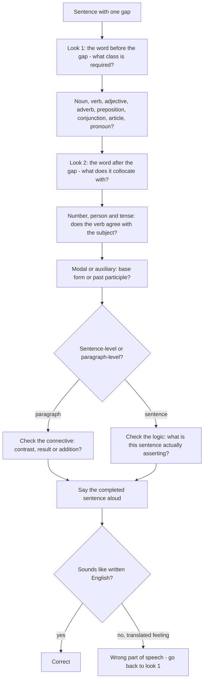

# Fill in the Blanks

A fill-in-the-blank item gives you a sentence with one gap and four options, and exactly one of them completes it. The options are built so that they look equally plausible in a bare list and unequal the moment you put them back into the sentence. The whole skill is that moment: the right answer is not the one that "means something", it is the one that produces a sentence a writer would have written.

That is why the winning move is not to read the options first. It is to **predict the answer before you look** — the word class, the number, the tense, the degree — and then let the options confirm or destroy your prediction. A candidate who predicts finds one option that fits and three that are visibly wrong. A candidate who reads first finds four plausible words and must eliminate by feel.

**The four decisions, in the order you make them**

1. **Word class** — noun, verb, adjective, adverb, preposition, conjunction. This is decided by the position of the gap and it removes most of the field.
2. **Number and person** — singular or plural, third person or not. A singular subject before the gap rules out a bare **-s** verb.
3. **Tense and aspect** — past, present, perfect, continuous, and the fixed collocations after a modal or an auxiliary.
4. **Collocation and logic** — which word the neighbouring verb or noun actually takes, and which one the sentence's logic requires.

The first three are checkable by inspection. Only the fourth requires vocabulary, and by the time you reach it you will usually have one option left.

### 🟢 Lite — Quick Review (1h–1d)

**Predict the shape of the gap in one line**

| Look at what is before the gap | Predict |
| --- | --- |
| a / an / the / this / that / his / her / their | a **noun** |
| a linking verb (*is, was, seems, became, remained, felt*) | an **adjective**, or a noun used as a label |
| *to* | a **verb** in the infinitive, or a noun belonging to a phrase |
| a modal or auxiliary (*can, must, has, will, would*) | the **base form** or the **past participle** |
| an adverb (*deeply, highly, carefully, largely*) | an **adverb** |
| a singular subject | a verb **without** a plural **-s** |
| *than* or *as … as* | the same word class on both sides |

**The eight questions the position of the gap answers immediately**

1. Is the blank a noun? (determiner before it) — if so, singular or plural, countable or uncountable?
2. Is the blank a verb? — which tense, and which subject does it agree with?
3. Is the blank an adjective? (linking verb before it)
4. Is the blank an adverb? (another adverb before it, or a manner verb such as *work, run, speak, arrive*)
5. Is the blank a preposition? (a noun or adjective before it, a noun after it)
6. Is the blank a conjunction? (two clauses around it)
7. Is the blank an article? (a countable noun before it)
8. Is the blank a pronoun? (a clause it must head)

**The highest-frequency fixes**

| Wrong | Right |
| --- | --- |
| discussed **about** | discussed |
| explained **me** the rule | explained the rule **to me** |
| married **with** | married |
| reached **to** | reached |
| enter **in** the room | entered the room |
| one of the students **are** | one of the students **is** |
| a number of people **is** | a number of people **are** |
| informations, advices, furnitures | information, advice, furniture |
| more better, more easiest | better, easiest |
| I am used to **work** | I am used to **working** |
| discuss, explain, mention **about** | no preposition at all |
| can **submits** | can submit |
| has **reject** | has rejected |

**The three connective words that decide logic blanks**

| Connective | Requires | Rejects |
| --- | --- | --- |
| *however, nevertheless, yet* | a preceding statement to contrast with | being first, or a cause-and-effect clause |
| *therefore, hence, thus, consequently* | a preceding reason or fact | a contrast |
| *moreover, in addition, furthermore, besides* | a preceding point to add to | a contradiction |

**Read the sentence with the gap in place, out loud.** If the completed version sounds like translated English, the option is the wrong part of speech even when its meaning is right. This single test is worth several marks and it takes five seconds.

### 🟡 Standard — Regular Study (2d–2mo)

**Articles: the six decisions that cover every case**

1. **Uncountable → no article, no plural.** *Advice, information, furniture, luggage, news, progress, research, evidence, work, knowledge, equipment, traffic.* Use *much, little, some, a piece of*.
2. **First mention of a countable noun → a / an.**
3. **Second and later mentions → the.**
4. **Unique in the situation → the.** *"She is **the** only technician who can do it."*
5. **General sense → zero article.** *"Water is essential", "Music influences mood."*
6. **Second of two comparable things → the.** *"the first chapter and **the** second"*.

Note the commonest article error in these papers: dropping the article before a singular countable noun used generically — *"Honesty is the best policy"*, never *"Honesty is best policy"*.

**Prepositions as blanks**

A preposition blank is decided by the word before it, and the pair must be memorised. The most set:

*depend on, consist of, result in, lead to, basis of, capable of, afraid of, aware of, believe in, belong to, concerned about, disappointed in, familiar with, interested in, similar to, different from, superior to, surprised at, annoyed with, worried about, good at, responsible for, famous for, known for, essential to, necessary for, advisable to, reluctant to, used to, due to, owing to, according to, prior to, in spite of, in front of, in the middle of, in the presence of, with regard to, in addition to, as regards.*

The pairs that trip students most often: *by / until* for time (*by 2020* = at any point up to, *until 2020* = continuously up to); *between* and *among* (*between two people, among many*); *in, at, on* for place (*in a room, at a station, on a bus*); *besides* and *beside*; *since* and *from*; *into* and *in to*.

**Verb–object and verb–adverb collocations**

| Verb takes a direct object | Verb takes no object |
| --- | --- |
| make a mistake, do duty, reach a conclusion, meet a demand, pay attention, take a decision, draw a conclusion, seek permission, grant permission | die, arrive, belong, consist, depend, lack, resemble, suffice, matter |

And the pairs that are tested individually: *rise / raise* (intransitive / transitive), *lie / lay* (*lie down* / *lay it down*), *borrow / lend* (*borrow from* / *lend to*), *bring / take* (*bring someone something* / *take something away*), *speak / talk* (to a person / about a thing, and *talk* needs no object), *hear / listen* (*hear a sound* / *listen to*).

**Comparative and superlative blanks**

- One syllable: *tall, tall**er**, the tall**est***.
- Two syllables ending in **-y**: *easy, eas**ier**, eas**iest*** — the **y** becomes **i**.
- Two or more syllables: *beautiful, more beautiful, most beautiful.*
- Never both: *not more better*.
- With *than* the compared items match in class: *He is more **careful** than **his brother** is**.* With *as … as* the same rule applies: *as **tall** as **he**.*

**A worked set, with the reasoning shown**

1. **The proposal was rejected ______ lack of funds.**
   (A) for (B) due (C) owing (D) on
   **Answer: (A) for.** *Rejection **for** something* is the fixed collocation: he was arrested **for** theft, the plan was abandoned **for** cost. *Due* and *owing* are adjectives here — *due to*, *owing to* — and a preposition slot cannot take an adjective without the word *to*. *On* has no sense.

2. **The court not only found him guilty but also ______ him to five years.**
   (A) sentence (B) sentenced (C) sentencing (D) sentences
   **Answer: (B) sentenced.** Two eliminations, both structural. *Sentence* is a noun, and the gap is a finite verb after *also*. *Sentencing* is a gerund. *Sentences* is third-person singular, but the subject of the sentence is *the court*, singular — the verb must be *sentenced* to agree with it. This is the *not only … but also* agreement rule in action: the verb agrees with the **first** subject.

3. **The evidence was so ______ that even the defence could not dispute it.**
   (A) conclusive (B) conclude (C) conclusion (D) conclusively
   **Answer: (A) conclusive.** *Was* is a linking verb, so an adjective follows. The comparative form *conclusively* is an adverb and cannot follow *was*. This gap is decided entirely by the position.

4. **She ______ a strong case for reform in her first speech.**
   (A) did (B) made (C) put (D) carried
   **Answer: (B) made.** *Make a case* is the collocation; *do a case* does not exist, and *put* and *carry* require different objects (*put forward, carry out*). Note that the sentence has no trap in it: this is a pure vocabulary item, and it is included in every set because the topic is decided by how many of these there are.

5. **The police could give no ______ about the cause of the fire.**
   (A) informations (B) information (C) advices (D) knowledge
   **Answer: (B) information.** *Information* is uncountable, so *informations* is impossible. *Advice* and *knowledge* are also uncountable but do not match the sense *details about the cause*, and *about* is the usual preposition with *information*. A candidate who knows only the uncountable rule still reaches this answer; a candidate who also knows the sense reaches it faster.

6. **She was ______ the risk and signed the form without reading it.**
   (A) indifferent for (B) indifferent to (C) indifferent with (D) indifferent about
   **Answer: (B) indifferent to.** *Indifferent **to** a risk* is the fixed phrase. *About* is close enough to sound right and is the trap, because it does collocate with *indifferent* in the sense of *indifferent about the details* — but in this frame the blank is followed by a noun naming a thing one is unconcerned about, and that construction is *indifferent to*. When two options are both collocations, choose the one whose preposition governs the noun's role as a target, not its role as a topic.

### 🔴 Extended — Deep Study (3mo+)

**Fill-in-the-blank inside a paragraph: the gaps that need cohesion**

When the items are part of a passage rather than standalone sentences, four of the gaps are structural rather than grammatical, and they are decided by the paragraph.

- **Pronoun reference.** *"The committee has not yet decided ______ to do with the surplus funds."* The gap takes **what**, not *which* or *that*. The structure is a *to*-infinitive relative clause: *decide what to do*. The tell is that the gap sits between a verb and a bare infinitive, so the relative pronoun must be able to head that clause — *what* can, *which* and *that* cannot head *to do*.
- **Connectives.** The whole paragraph's logic is decided by the connective blanks, so solve them in order and then read the argument it produces. A paragraph that says *however* after a claim is a contradicting paragraph; if the logic of the surrounding sentences does not match the connective you chose, you have chosen wrong.
- **Repetition and synonym chains.** A gap that repeats a noun used three sentences earlier is a cohesion anchor. The correct word is usually the exact noun the writer has been building toward, not a near-synonym, because the writer is being repetitive on purpose.
- **Time reference.** *Earlier, later, then, subsequently, since, by that time.* The tense of the neighbouring sentences fixes which one fits: a past-tense gap after a past-tense clause needs *later* or *subsequently*, not *soon*.

**The two-look method**

When a sentence-level blank defeats you, look at exactly two things: **the word immediately before the gap and the word immediately after it**. The first gives you the required word class; the second gives you the collocation. *"She was ______ about the delay."* — *was* gives an adjective, *about* gives the preposition, and you have the answer in two seconds without reading the whole sentence again. This works for roughly four out of five blanks, and it is faster than rereading.

**Reading the distractor design**

The four options are not random; each is placed to fail a specific test, and knowing the test tells you what to check.

| Distractor | Test it fails | Your move |
| --- | --- | --- |
| Same root, wrong part of speech | Position | Ask what word class the gap demands |
| Right word class, wrong preposition | Collocation | Recall the pair |
| Right form, wrong meaning | Logic | Ask what the sentence is actually saying |
| Synonym that is too strong or too weak | Degree | Ask how strong the context makes the action |
| Right word, wrong register | Style | Ask whether the sentence is formal or conversational |
| A word that belongs to a different topic | Meaning | Ask what the sentence is about |

The **odd-one-out** variant of this question type asks which option does **not** fit the frame. In such items, three options share a meaning and one has a different sense, and the method is to state the shared meaning in your own words first. *Break down, break out, break up* all mean a process of coming apart; *break in* means to force an entry, so **break in** is the one that does not belong.

**Sentence quality as the final test**

After the four decisions, ask one more question: **would a competent writer have written this sentence?** Not "is it grammatical" — grammatical options remain — but "is it the sentence". *The committee denied the allegations* is a sentence. *The committee denied of the allegations* is a translation. Among four grammatical options, the one that reads like written English is almost always the intended answer, and this is the single most reliable tie-breaker available in a fill-in-the-blank set.

**Handling the two you are unsure about**

Do not spend the bulk of your time on the first hard item. The efficient pattern is: solve everything that resolves in seconds, mark the two hardest, finish the set, and return. By that point you have the topic of the whole section in your head, and the marked items are usually obvious. In a timed objective test, two marked items revisited is a better return than one item fought for three minutes.

**From fill-in-the-blank to sentence completion and word substitution**

Three formats in this family reward the same four decisions, so it is worth knowing how they differ:

- **Fill in the blank:** one gap, four options, one sentence.
- **Sentence completion:** a half-written sentence, and sometimes no options — the skill is the same plus the confidence to commit.
- **Word substitution:** a sentence with a phrase underlined, and you replace the whole phrase with one word. The extra demand is compression: *"He is a person who never keeps his word"* → **unreliable**.

The extra step in substitution is deciding the head of the phrase first (person, place, thing, quality, action), exactly as in one-word substitution, and then finding the word of that class.

### 🧠 Memory Anchors

- **"Predict, then look."** Say the word you expect before you see the options; you will recognise it instantly when it appears.
- **"Two looks: before and after."** The word before gives the class, the word after gives the collocation.
- **"Rejection is for, failure is due to."** Verb-plus-preposition is a pair, and the pairs are worth more than the individual words.
- **"*Not only … but also* takes the first subject's verb."** *The court not only found him guilty but also **sentenced** him.*
- **"Uncountables have no plural."** Information, advice, furniture, luggage, news, research, evidence, equipment, knowledge.
- **"After a modal, the base form."** *Can submit, must submit, would submit* — never *can submits*.
- **"Would a writer have written that?"** The final tie-breaker between two grammatical options.
- **Flashcard Q&A:**
  - *decided ______ to do* → **what**; the gap must head a *to*-infinitive clause.
  - *The teacher was ______ about the delay but unconcerned ______ the cause.* → **careless / about, indifferent / to** — the first takes *about* because it describes his handling of it, the second *to* because it names the target.
  - *The evidence was so ______ that …* → **conclusive**; *was* takes an adjective, never an adverb.
  - *more ______ than his brother* → **careful**; the items after *than* must match in class.
  - *Which is the odd one out: break down, break out, break up, break in?* → **break in**, which means to force an entry.

### 🎯 Exam Traps & Error Log

1. **Reading the options before the sentence.** Options are designed to be attractive in isolation; the sentence is what makes them wrong.
2. **Fixing the form and ignoring the logic.** Choosing the right part of speech with the wrong meaning is still wrong, and the logic of the sentence is what the fourth decision checks.
3. **Forgetting the preposition in a pair.** *Rejected **for**, indifferent **to**, discuss **no preposition***, and a dozen more.
4. **Writing a plural on an uncountable noun,** or a singular where the count is plural (*the number of, a number of*).
5. **Adding a third-person **-s** where the subject is plural,** or omitting it where the subject is singular.
6. **Choosing an adverb after a linking verb.** *"He was **highly** regarded"* is right; *"He was **high** ly"* is not, and *"The evidence was conclusively conclusive"* is the shape of the error.
7. **Using two comparatives.** *More better, more easiest, most tallest* — none exist.
8. **Ignoring the register.** A formal sentence does not take *a bit of a problem* or *kinds of*, and a casual one does not take *endeavour*.
9. **Spending the whole allowance on the first hard item.** Solve what resolves, mark the rest, return. It is the standard technique and it works.
10. **Assuming a well-known phrase is a fixed phrase.** *Revert back, repeat again, free gift, cancel the cancellation* — the second half of each is redundant, and a phrase is not automatically correct because it is familiar.

### 🧪 Self-Test — 8 Questions with Worked Answers

Answer each on paper before reading the solution. Each gap tests a different decision.

1. **"The proposal was rejected ______ lack of funds."**
   *Options: (A) for (B) due (C) owing (D) on*
   **(A) for.** *Reject someone/something **for** a reason* is the fixed collocation. *Due* and *owing* belong to the adjectives *due to* and *owing to* and cannot occupy a bare preposition slot here, and *on* has no sense. This gap is decided by collocation alone.

2. **"The court not only found him guilty but also ______ him to five years."**
   *Options: (A) sentence (B) sentenced (C) sentencing (D) sentences*
   **(B) sentenced.** *Sentence* is a noun, and the gap is a finite verb after *also*. *Sentencing* is a gerund and cannot complete the clause. *Sentences* is third-person singular, but the subject is *the court*, which is singular, so the correct verb is *sentenced*. The rule being tested: after *not only … but also*, the verb agrees with the **first** subject.

3. **"The evidence was so ______ that even the defence could not dispute it."**
   *Options: (A) conclusive (B) conclude (C) conclusion (D) conclusively*
   **(A) conclusive.** *Was* is a linking verb and must be followed by an adjective, so *conclude* and *conclusion* fail on word class, and *conclusively* is an adverb. Nothing about the meaning was needed; the position decided the question.

4. **"She ______ a strong case for reform in her first speech."**
   *Options: (A) did (B) made (C) put (D) carried*
   **(B) made.** *Make a case* is the fixed collocation, as in *make a case for, make an argument, make a point*. *Do a case* does not exist; *put* and *carry* require *put forward* and *carry out* with different objects. This is a pure collocation item, and sets regularly include several.

5. **"The police could give no ______ about the cause of the fire."**
   *Options: (A) informations (B) information (C) advices (D) knowledge*
   **(B) information.** *Information* is uncountable, so *informations* is impossible — and *advice* and *knowledge* are also uncountable, so all three plurals are wrong for the same reason. The sense chooses *information*, because the phrase *information about* is the standard one, while advice and knowledge do not fit a cause.

6. **"She was ______ the risk and signed the form without reading it."**
   *Options: (A) indifferent for (B) indifferent to (C) indifferent with (D) indifferent about*
   **(B) indifferent to.** *Indifferent to* is the standard collocation, as in *indifferent to risk, indifferent to criticism*. *About* is the trap here: it collocates with *indifferent* when the following phrase is a topic one is indifferent towards (*indifferent about the details*), but a **risk** is the object of the indifference, and that role takes *to*.

7. **"The scheme failed, ______ it had been poorly designed."**
   *Options: (A) therefore (B) however (C) moreover (D) otherwise*
   **(B) however.** The two clauses contradict each other: the scheme failed *despite* being poorly designed being the expected outcome, or more precisely the writer is setting a failure against an obvious explanation. *Therefore* and *so* express result and are wrong, *moreover* expresses addition, and *otherwise* means "in a different way" or "or else". *However* is the only contrastive connective in the list.

8. **"The committee has not yet decided ______ to do with the surplus funds."**
   *Options: (A) what (B) which (C) that (D) whom*
   **(A) what.** The blank is followed by the infinitive *to do*, so the relative pronoun must be able to head an infinitive clause: *decided what to do* is a *to*-infinitive relative construction. *Which* and *that* cannot head *to do*, and *whom* is for people. Grammar eliminated three options before meaning was considered.

### 💡 Pro Tips

1. **Write the predicted word in the margin before you look at the options.** Recognition is faster than retrieval, and this item is a recognition test.
2. **Use the two-look method when stuck.** The word before the gap gives the class, the word after gives the collocation, and the question is usually solved in one pass.
3. **Learn verb–preposition pairs in sentences, never as lists.** *Indifferent to, rejected for, accompanied by, blame on, rely on* — the pair is the unit of memory.
4. **Say the whole completed sentence aloud.** Translated-sounding English identifies a wrong part of speech faster than any other test.
5. **Solve the order of your options:** function words, then grammar, then logic. The first two are marks you cannot lose.
6. **Mark and move.** Two items marked and revisited beat one item fought for three minutes in every timed set.
7. **Watch the uncountables.** Seven words with no plural covers a recurring source of errors in this topic and in error spotting too.
8. **On the last pass, read the blanks in the order of the section, not of the options.** Reading them in sequence turns the set into a paragraph and lets you hear whether the sentences belong together.

---

## Continue your study

- **[View this topic in your CUET UG roadmap](/roadmap/?exam=cuet&duration=1mo)** — see where "Fill in the Blanks" fits in your personalised plan
- **[Build a quick revision plan](/roadmap/?exam=cuet&duration=1d)** — 1-day sprint covering highest-weight topics
- **[CUET UG exam overview](/exams/cuet/)** — pattern, eligibility, and syllabus
- **[All English notes](/notes/cuet/english/)** — browse sibling topics in this subject

---
*Content adapted based on your selected roadmap duration. Switch tiers using the selector above.*
