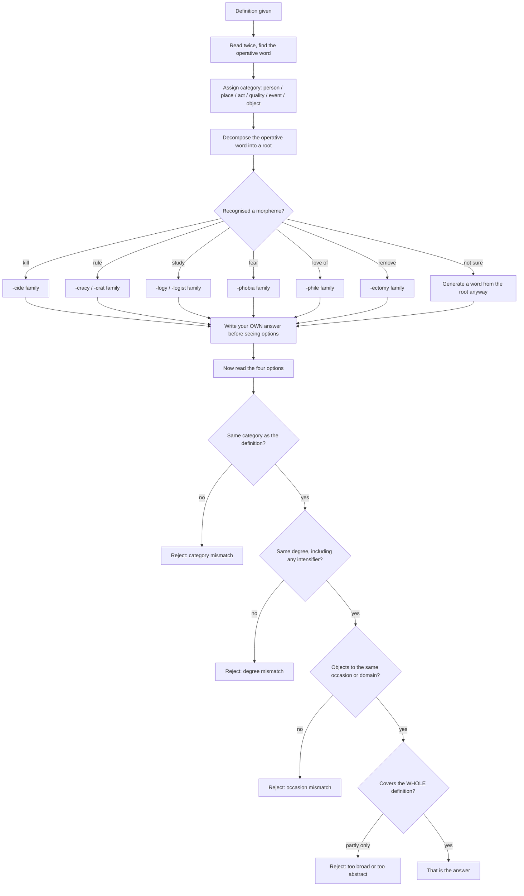

# One Word Substitution

One-word substitution asks a single, deceptively simple thing: a short definition is given, and you must produce the one English word that means it. The difficulty is not that the options are hard. It is that three of them are nearly right. A definition reading "one who is present at a place without being noticed" has four plausible answers in a good dictionary; the exam needs the one that also matches the *category*, the *degree* and the *occasion*. Candidates who read the definition quickly and grab the first word they recognise lose marks they had in hand.

The topic rewards a narrow kind of expertise, and it is worth being honest about that. The vocabulary here is highly conventional — it is the vocabulary of dictionaries and crosswords, not of newspapers. Once you know roughly two hundred words and a dozen Greek and Latin roots, you can handle most items in the topic. That is a smaller and more learnable burden than a general vocabulary chapter, which is why one-word substitution is a good place to invest a fixed number of hours and then move on.

The method is fixed too. **Category first, root second, sense last.** Almost every item is decided before you read the options, and the candidates who lose marks are the ones who read the options first and let them choose the question for them.

### 🟢 Lite — Quick Review (1h–1d)

**The seven categories every definition belongs to.** Nearly all definitions are one of these with a modifier attached, and the modifier is where the difficulty lives.

| Category | The shape of the definition | Word class demanded | Example |
| --- | --- | --- | --- |
| **Person** | *one who…*, *a person who…* | noun for a human | *pacifist* — one who opposes war |
| **Agent / instrument** | *one who or that which…* | noun for a doer or a tool | *penicillin* — a thing that kills germs |
| **Place** | *a place where…* | noun for a location | *aviary* — a place where birds are kept |
| **Act** | *the act of…* | abstract noun | *necrology* — an account of the dead |
| **Quality / state** | *the state of being…* | abstract noun or adjective | *sobriety* — the state of being serious |
| **Event** | *an event characterised by…* | noun for an occurrence | *ferocious* — savagely violent |
| **Document / object** | *a written record of…* | noun | *epitaph* — an inscription on a tomb |

**The roots and suffixes that let you read an unknown option.** This is the highest-value part of the topic. Learn these and you can decode a word you have never seen.

| Element | Meaning | Example |
| --- | --- | --- |
| *-logy* | study of | *biology* — the study of life |
| *-logist* | one who studies | *geologist* |
| *-crat / -cracy* | ruler / rule | *democracy* — people-rule |
| *-cide / -icide* | killing | *regicide* — king-killing |
| *-phile* | lover of | *bibliophile* — book-lover |
| *-phobe / -phobia* | hater / fear of | *acrophobia* — fear of heights |
| *-mancy* | divination by | *chiromancy* — palm reading |
| *-latry / -iatry* | worship / treatment | *idolatry*, *podiatry* |
| *-cide* as suffix | killer | *suicide*, *pesticide* |
| *-dom* | state of | *freedom*, *kingdom* |
| *-ship / -hood* | state, condition | *friendship*, *childhood* |
| *-itis* | inflammation | *arthritis* |
| *-ectomy* | surgical removal | *appendectomy* |
| *-oma* | tumour or swelling | *melanoma* |
| *-scope* | instrument for looking | *telescope*, *microscope* |
| *-meter / -metry* | measuring | *thermometer*, *geometry* |
| *-graph / -graphy* | writing, record | *autobiography*, *telegraph* |

**The high-frequency items, grouped so they are learnable.**

| Definition as it appears | The word | How to decode it |
| --- | --- | --- |
| One who studies handwriting | **graphologist** | *graph* writing + *-ologist* one who studies |
| Murder of a king | **regicide** | *regi* king + *-cide* killing |
| Killing of one's own brother | **fratricide** | *frater* brother + *-cide* |
| One who believes in equality of sexes | **feminist** | *feminine* + *-ist* |
| One who hates mankind | **misanthrope** | *mis-* wrong + *anthrope* human + *-e* one who |
| A government by the few | **oligarchy** | *oligo* few + *-archy* rule |
| A government by one person | **autocracy** | *auto* self + *-cracy* rule |
| A place where money is kept | **bank / treasury** | category check |
| A place where books are kept | **library** | *libr* book + *-ary* place |
| A place where clothes are washed | **laundry** | *launder* |
| A place where birds are kept | **aviary** | *avi* bird + *-ary* place |
| The art of speaking well in public | **oratory** | *orator* speaker + *-y* |
| The art of writing speeches** | **rhetoric** | Greek *rhetor* — beware the *rhetoric* trap |
| Speaking without preparation | **extempore** | Latin *ex tempore* — from the moment |
| Speaking so as to excite emotions | **declamation** | |
| A speech praising someone, usually after death | **eulogy** | Greek *eu* well + *logos* speech |
| A speech of condemnation | **invective** | |
| Words used to deceive, plausibly delivered | **sophistry** | *sophist* — a false reasoner |
| A word in sharp, biting tone | **taunt** | |
| An indirect way of blaming | **taunt / insinuation** | |
| Talking at length without substance | **harangue** | |
| Speech made to excite a crowd's anger | **incendiary speech** | |
| A fictional human character | **dramatis personae** | |
| A false statement made to injure reputation | **libel** | |
| A written statement of wrong done, but no public accusation | **slander** | libel written, slander spoken |
| The art of finding a suitable word | **sesquipedalian** | |
| A long word used for ordinary short meaning | **sesquipedalian** | *sesquipedalis* — a foot and a half |
| One who cannot read or write | **illiterate** | *in-* not + *liter* letters |
| One who hates writing | **bibliophobic** | *biblio* book + *-phobe* |

**The one-line method.** Category → root → exact sense → check the option that survives all three. If you do nothing else from this topic, do that.

### 🟡 Standard — Regular Study (2d–2mo)

**How the item is actually built.** A good item gives a definition, and the four options are constructed so that they fail for four *different* reasons. Knowing the four reasons turns a guessing question into a checking question.

1. **Category mismatch.** The definition describes a person; the option is a place. *Poulterer's shop* is not *poulterer*.
2. **Degree mismatch.** Two words mean "very large"; one means "extremely large". *Enormous* and *immense* are close; *staggering* is a degree beyond both, and *vast* is a degree below.
3. **Occasion or domain mismatch.** Two words mean "to stop"; one is for a machine, one is for a person, one is for a legal proceeding. *Break* a machine, *halt* a vehicle, *suspend* a proceeding, *repose* a person.
4. **Connotation mismatch.** Two words are synonyms in the dictionary; one carries contempt. *Ignoble* and *ignominious* both mean disgraceful, but *ignoble* is the general word and *ignominious* is the stronger, more public disgrace.

A candidate who reads the definition and generates a word *before* looking at the options prevents most of the first two errors automatically, because the generated word fixes the category and roughly the degree.

**The six-step method, in full.**

1. **Read the whole definition, twice.** The second reading is where you catch the word doing the real work. Definitions bury the operative word in a pile of modifiers: "the state of being **excluded** from a group" is the definition of *ostracism*, and the operative word is *excluded*, not *state*.
2. **Assign the category.** Person, place, act, quality, event, object. Write it down if you are being asked to learn, just think it if you are answering.
3. **Decompose.** Identify the operative word and reach for a root: *kill* → *-cide*; *book* → *biblio-*; *hate* → *-phobe*; *study* → *-logy*; *rule* → *-cracy*; *king* → *regi-*.
4. **Generate your own answer before reading the options.** This is the step that matters. It stops anchor bias — the tendency to pick the option that looks most familiar rather than the one that matches.
5. **Compare option against definition word by word.** Not "does this word seem related?" but "does this word cover *the whole* definition, at the right degree, in the right category?"
6. **Reject anything that is only *partly* right.** An option that captures one clause of a two-clause definition is a distractor, even if that clause is the more memorable one.

**The suffix families that generate the most items.** Learn these as families, not as isolated words, because a family is learned once and yields many items.

**The *-cide* family — all meanings are "killing of".** *Regicide* (king), *fratricide* (brother), *parricide* (parent, or murder of a traitor), *suicide* (self), *homicide* (a human being generally, and the legal charge), *matricide* (mother), *infanticide* (infant), *pesticide* (pests), *herbicide* (weeds), *fungicide* (fungi). The pattern is *X + cide*, and you do not need to have met *matricide* before to be able to pick it as the killing of a mother.

**The *-cracy / -crat* family — all meanings are "rule".** *Democracy* (people), *aristocracy* (nobility), *oligarchy* (few), *autocracy* (one), *bureaucracy* (bureaus, officeholders), *theocracy* (god), *monocracy* (one), *plutocracy* (wealth), *meritocracy* (merit), *gerontocracy* (old people), *epistocracy* (experts). Once you know the Greek numerals — *demos* people, *aristo* best, *oligo* few, *auto* self, *theo* god, *ploutos* wealth — the family is free.

**The *-mania* family.** *Bibliomania* (books), *monomania* (one idea), *kleptomania* (theft), *pyromania* (fire), *sophobia* (fears), * dipsomania* (drink), *kleptomania* is the interesting one because the impulse is irrational and the person is not a deliberate thief.

**The *-phobe / -phobia* family.** Fear, usually irrational, usually specific. *Acrophobia* (heights), *arachnophobia* (spiders), *agoraphobia* (open spaces, or the fear of leaving a safe place), *xenophobia* (strangers or foreigners), *monophobia* (being alone), *thalassophobia* (deep water), *bibliophobia* (books), *cyanophobia* (the colour blue), *heliophobia* (the sun). Note that *xenophobia* and *monophobia* follow the same pattern, which is a good reason to distrust students who claim these words are unrelated.

**The *-phile / -ophilous* family.** Love or affinity. *Bacteriophage* aside, the useful ones are *bibliophile* (books), *bibliophile*'s opposite *bibliophobe*, *anglophile* (English things), *philhellene* (Greece), *thermophile* (heat), *psychrophile* (cold), *halophile* (salt).

**A worked example, done slowly.** This is the item type broken into its parts.

> **Definition:** The act of an official taking bribes.
> *Options: (a) embezzlement (b) bribery (c) corruption (d) venality*

- **Category:** an act or a state. Both (b) and (d) are candidates; (a) is a specific theft and (c) is broader.
- **Operative word:** *bribes* — a payment given to influence an official.
- **Check (a) embezzlement:** that is misappropriating money **already in your own trust**. The money here is handed to you, not entrusted. Wrong.
- **Check (c) corruption:** this covers bribery **and** nepotism, favouritism and misuse of office. It is true but **too broad** — a definition that names one specific act is asking for the specific word.
- **Check (d) venality:** this means "the quality of being open to bribery", and it takes "the *venality* of" — it is an abstract quality noun. Grammatically possible, but it names the trait, not the act.
- **Answer: (b) bribery**, the act itself, the exact degree, the right category.

The pattern of the whole item is worth noticing: the two wrong answers are not nonsense, they are **one clause too broad** and **one clause too abstract**. That is how these distractors are built, every time.

**Common roots that appear in harder items.** *Anthro-* human (*anthropology*, *anthropomorphic*), *chrono-* time (*chronology*, *chronic*), *pathy* suffering or feeling (*sympathy*, *apathy*, *empathy*, *telepathy*), *-sophy* love of wisdom (*philosophy*), **-gen* producing (*pathogen*, *allergen*), *scrib/script* writing (*manuscript*, *prescription*, *transcript*), *-spect* looking (*inspect*, *prospect*, *retrospect*, *conspicuous*), *-fer* carrying (*transfer*, *confer*, *proliferate*), *-volv/volut* rolling (*revolve*, *involve*, *convoluted*).

### 🔴 Extended — Deep Study (3mo+)

**Decoding options you have never seen.** The mature skill in this topic is reading an unknown word as if it were a machine with parts. Do it in three passes: strip the affixes, translate the root, reconstruct the whole.

Worked examples.

- **Bibliography** → *biblio-* book + *-graphy* writing → "a list of books". An option reading *bibliography* matches "a list of books written down"; the distractor *bibliophile* is a person who loves books, a **category error**.
- **Anachronism** → *ana-* against, beside + *chron-* time + *-ism* → "something out of its proper time". The distractor *anecdote* shares the *ana-* opening but has no time component; *chronograph* has time but means a record of it, not a mistake about it.
- **Hagiography** → *hagio-* holy + *-graphy* writing → "a biography of a saint, often idealised". The trap here is that *-graphy* alone suggests something written about a person, and candidates choose *biography*. *Hagiography* is the specialist term, and a definition that mentions saints is asking for it.
- **Cacophony** → *caco-* bad, ugly + *-phony* sound → "a harsh discordant sound". The distractor *euphony* is its opposite and shares the root; *symphony* shares the *-phony* ending and means harmonious combination. Two roots, two traps, one answer.
- **Obfuscate** → *ob-* against + *fusc* dark, from *fuscus* dusky → "to make obscure, to confuse deliberately". *Obfuscate* vs *obtuse* vs *abfuscate* — the first deliberately darkens, the second is simply dull.
- **Paucity** → Latin *paucus* few → "scarcity, a small number". The distractor *piosity* shares the spelling opening. Reading the Latin saves the item.
- **Recalcitrant** → *re-* back + *calci-* to tread, to kick, from *calcis* heel + *-ant* → literally "kicking back", that is, stubbornly resisting. Candidates who know the phrase "stubborn as a mule" intuit this; candidates who know the root do it reliably.

**The two hardest sub-skills: degree and occasion.**

**Degree** is where the near-miss lives. English stacks near-identical intensifiers, and a definition that includes the intensifier is pointing straight at the trap. Learn these ladders.

| Weaker | Stronger | Strongest | Typical definition cue |
| --- | --- | --- | --- |
| *big* | *huge* | *enormous / gigantic / colossal* | "so large as to be overwhelming" |
| *small* | *tiny* | *minuscule / infinitesimal* | "so small as to be almost unobservable" |
| *famous* | *renowned* | *celebrated / illustrious* | "famous, with honour attached" |
| *sad* | *miserable* | *wretched / desolate* | "overwhelmed by sorrow" |
| *angry* | *furious* | *incandescent with rage* | "violently angry" |
| *new* | *recent* | *novel / unprecedented* | "new, and unlike what came before" |

The cue column is the important one. A definition saying "so large as to be overwhelming" does not want *big* or *huge*. It wants the word whose *own* connotation carries the excess.

**Occasion** works the same way. Several English words share a core meaning and differ only in the situation they are licensed for.

| Core meaning | Licensed for machines | Licensed for vehicles | Licensed for proceedings | Licensed for people |
| --- | --- | --- | --- | --- |
| stop | *break* | *halt* | *suspend* | *repose* |
| make angry | *enrage* (a person) | *irritate* | *exasperate* | *incense* |
| kill | *destroy* | *wreck* | *annul* | *slay* |
| finish | *finish off* | *run down* | *conclude* | *dispatch* |
| look at | *inspect* | — | *examine* | *view* |

A definition that names the *thing being acted on* — not just the action — has already told you which column you are in. "The act of stopping a vehicle" and "the act of stopping a proceeding" are different words, and the object is the clue that separates them.

**How one-word substitution connects to the rest of the paper.** The same root analysis that lets you pick *regicide* also lets you read an unknown word in a comprehension passage, and the same category discipline that fixes a substitution item also fixes a "which word best completes the sentence" item. In that sense the topic is not a separate memory bank; it is a method that pays off twice. Practise it deliberately on passage vocabulary even when you are not doing substitution questions.

**A repeatable twenty-minute substitution drill.**

1. **Four minutes** — take ten definitions from a dictionary-style source and write the category for each, without attempting the word.
2. **Six minutes** — for each, generate your own candidate word from the root before you look at any options. This is the step that builds the skill rather than the list.
3. **Six minutes** — now look up the real word and compare. For each miss, write down *why* you missed: wrong category, wrong degree, or you simply had never met the word. The three need different remedies and only the third needs more vocabulary.
4. **Four minutes** — write one sentence of your own using two of today's words. A word you can use is a word you will recognise; a word you can only define is a word you will drop under time pressure.

Step three is the one that makes the topic get easier. Without it, the same words get missed in the same way for weeks.

### 🧠 Memory Anchors

- **"Category, root, sense."** Three words, in that order, and the first two are decided before you see a single option.
- **"Generate before you scan."** The reason is anchor bias. The first option you *understand* feels correct whether or not it is, and once your eye lands on it, your judgement has already been made.
- **"Partly right is wrong."** If a two-clause definition has an option that answers only the memorable clause, that option is the trap. The correct word covers all of it.
- **"Rejections come in four kinds."** Category, degree, occasion, coverage. Name which one killed an option and you have diagnosed the item.
- **"*X + cide* is always an X-killing."** The family is free once you learn it, and it covers a dozen possible items.
- **"Never, always, and a body that is a fight."** *Never* and *always* in a definition signal an absolute; look for the word that means exactly that. *Body* in the phrase "a forcible encounter" signals *belligerent*, and *encounter* is the giveaway.
- **Flashcard Q&A:**
  - *Give me the word for "a speech delivered without preparation".* → **extempore** (Latin *ex tempore*, "from the moment").
  - *"-cide" is Latin for what?* → **killing**. So *matricide* is the killing of a mother, *regicide* of a king.
  - *What is the difference between *bibliography* and *bibliophile*?* → One **writes about** books, the other **loves** them. Same root, opposite suffixes, and the category differs.
  - *Define "the state of being excluded from a group".* → **ostracism**, from Greek *ostrakon*, a potsherd used in a vote of exile.
  - *Which is stronger, "famous" or "celebrated", and how would a definition tell you?* → **Celebrated** is stronger; a definition saying "famous, with honour attached" points to it.

### 🎯 Exam Traps & Error Log

1. **Reading the options before forming your own answer.** This produces anchor bias: the first option you can parse is chosen because it is parseable, not because it is correct. Generate first, always.
2. **Accepting a partly correct answer.** A definition with two clauses and an option covering one is the single most reliable trap in the topic.
3. **Confusing near-synonyms of different degree.** *Big / huge / enormous* are three words, not one. If the definition says "so large as to be overwhelming", two of the three are wrong.
4. **Ignoring the object of the action.** "To stop a vehicle", "to stop a proceeding" and "to stop a machine" are three different words. The object is the clue that separates them.
5. **Confusing a person-word with a place-word or an act-word.** *Poulterer* is a person, a poultry shop is a place; *bibliophile* is a person, *bibliography* is a document. Same root, different category.
6. **Letting the spelling trick you.** *Paucity* and *piosity*, *censure* and *censer*, *cogent* and *cogitate* — near-spelling words are placed as options precisely because you will confuse them.
7. **Mistranslating the Latin or Greek.** *Hagiography* is a saint's life, not any biography. *Inculpate* is to exonerate, not to accuse. The root is right there in the word; read it.
8. **Ignoring the intensifier in the definition.** Words like *so*, *utterly*, *absolutely* and *once and for all* are not padding. They are the degree, and the degree picks the answer.
9. **Answering the topic instead of the definition.** A definition about a "storm" that is used for *turbulent* human conflict is asking for a word that fits both. The answer is the word that works in the context the definition supplies.
10. **Memorising a list instead of learning the families.** Two hundred unconnected words is far harder to hold than six families of eight. The families generate their own members; a bare list does not.
11. **Spending too long per item.** One-word substitution is a recognition skill, not a puzzle. If a definition and its options have not resolved in under a minute, the fastest correct action is to eliminate, guess from the category, and move on — the remaining time is worth more than the doubtful item.
12. **Confusing a real word with a fake one built to look right.** Some distractors are not words at all, or are words from a neighbouring field. Read the option's morphology and ask whether it is a real formation; a suffix attached to a stem that does not take it is a fake.

### 🧪 Self-Test — 8 Questions with Worked Answers

Work these on paper before reading the solutions. Each is built on one of the rejection categories above.

1. **Definition: "The murder of a brother." Options: (a) regicide (b) matricide (c) fratricide (d) patricide.**
   **Fratricide**, from *frater* (brother) + *-cide* (killing). *Regicide* is a king, *matricide* a mother, and *patricide* a parent or a traitor. All four are the *-cide* family, so this item does not test the family — you could have learned it in one minute. It tests whether you can read *frater* and hold four Latin kinship terms apart at the same time. Under time pressure the tempting error is (d), because *pater* (father) is more familiar than *frater*.

2. **Definition: "A forcible encounter." Options: (a) sedate (b) quiescent (c) bellicose (d) pugnacious.**
   The operative words are *forcible* and *encounter*, and both point to a fight. **Bellicose** is the answer: it means warlike, and the noun *bellicosity* means warlike conduct. *Pugnacious* is nearly a synonym and is the dangerous distractor — it is a **person** adjective, meaning ready to pick a fight, and a definition that names an act rather than an agent wants the act-word. *Sedate* means calm and *quiescent* means at rest; both are the opposite and exist to make the pair easier to hold.

3. **Definition: "A speech delivered without preparation." Options: (a) extempore (b) verbatim (c) panegyric (d) malapropism.**
   **Extempore**, from Latin *ex tempore*, "from the moment" — spoken at the time, prepared in the mind but not on paper. *Verbatim* is a trap because it also means word-for-word; the error-spotting version of this item usually shows "a speech delivered *verbatim* without preparation", which is self-contradictory. *Panegyric* is a speech of praise. *Malapropism* is the comic misuse of a word, not a speech type at all.

4. **Definition: "A biography of a saint, ideally presented." Options: (a) biography (b) bibliography (c) hagiography (d) autograph.**
   **Hagiography**, from Greek *hagios* (holy) + *-graphia* (writing). *Biography* is a trap: it is a life story, and it is exactly what the definition describes if you skip the word "saint". The item exists to see whether you read the whole definition. *Bibliography* is a list of books, from *biblio-* (book) + *-graphia*. *Autograph* is a signature, or a book signed by its author — the *auto-* is self, and the two roots here, *hagio-* and *biblio-*, are the whole test.

5. **Definition: "A person who hates mankind." Options: (a) philanthropist (b) misanthrope (c) misogamy (d) hermit.**
   **Misanthrope**: *mis-* (hate, wrong) + *anthrope* (mankind) + *-e* (one who). The root literally says the answer. *Philanthropist* shares the *anthrop-* element with the opposite meaning — *phil-* (love) against *mis-* (hate) — and is the standard trap. *Misogamy* is the dislike or fear of marriage. *Hermit* is a person who withdraws, which is behaviour, not attitude toward humanity.

6. **Definition: "The state of being excluded from a group." Options: (a) ostracism (b) apathy (c) anonymity (d) iconoclasm.**
   **Ostracism**, from Greek *ostrakon*, a potsherd — the Athenian practice of writing a citizen's name on a potsherd and expelling them by vote if the count was large enough. *Apathy* means indifference, which is a different failure entirely: the excluded person was actively cast out, whereas the apathetic person simply does not care. The two are confused because both are common in political vocabulary, and the *-cism* suffix on the correct answer marks a condition imposed from outside. *Anonymity* is the condition of being unnamed, and *iconoclasm* is the destruction of images or of established beliefs — a different kind of exclusion entirely.

7. **Definition: "The act of setting fire to one's own property." Options: (a) arson (b) incineration (c) immolation (d) oblation.**
   **Arson** is the criminal act. *Incineration* is the general, often legitimate process of burning — a crematorium incinerates remains, a municipal authority incinerates waste — so a definition that names *criminality* rules it out. *Immolation* is specifically the sacrifice of a living being, and *oblation* is a religious offering of something. The trap is *incineration*, which is a real word with a real fire in it and the wrong degree of blame.

8. **Definition: "One who studies handwriting and character." Options: (a) calligraphy (b) graphology (c) cartography (d) bibliography.**
   **Graphology**: *grapho-* writing + *-logy* the study of. *Calligraphy* is beautiful handwriting, an art, not a diagnostic study. *Cartography* is map-making, *carto-* paper — the near-spelling trap. *Bibliography* is the study of books. Note that the definition itself is a mixture: the *study* part is *-logy* and the *handwriting* part is *grapho-*; the item is testing that you can assign each half of the definition to one morpheme.

### 💡 Pro Tips

1. **Always write a candidate word before you look at the options.** Two seconds of decoding beats the anchor bias that reading the options first will cost you, and the habit is the entire method.
2. **Learn the six families, not two hundred words.** *-cide*, *-cracy*, *-logy*, *-phobe*, *-phile* and *-mania* between them generate a large share of the items you will meet, and a family learned once is never lost under pressure.
3. **Underline the intensifier in every definition.** "Utterly", "so large as to be", "once and for all" — these words are the degree, and the degree is what separates the last two options.
4. **Note the object of every action.** "To stop a vehicle" and "to stop a proceeding" are different words. If the definition names the thing, the thing has already narrowed the answer.
5. **Keep a failure-reason column in your practice notes.** Wrong category, wrong degree, or word never met. These three need different remedies and only the third is fixed by learning more words.
6. **Read the suffix, not the whole word, under time pressure.** If the item is hard and slow, find the suffix, let it choose the category, and pick the option in the right category with the right root. That alone clears a large share of difficult items.
7. **Use the topic as passage-vocabulary practice.** Every time you decode a root for a substitution, note the root. Those roots are the same ones that unlock unknown words in comprehension passages, so the practice is worth doing twice over.
8. **Budget your time by elimination, not by resolution.** If an item has not resolved in about a minute, eliminate on category and degree, choose the survivor, and move. The marks from the next item are guaranteed; the mark from this one is not.

---

## Continue your study

- **[View this topic in your CUET UG roadmap](/roadmap/?exam=cuet&duration=1mo)** — see where "One Word Substitution" fits in your personalised plan
- **[Build a quick revision plan](/roadmap/?exam=cuet&duration=1d)** — 1-day sprint covering highest-weight topics
- **[CUET UG exam overview](/exams/cuet/)** — pattern, eligibility, and syllabus
- **[All English notes](/notes/cuet/english/)** — browse sibling topics in this subject

---
*Content adapted based on your selected roadmap duration. Switch tiers using the selector above.*
