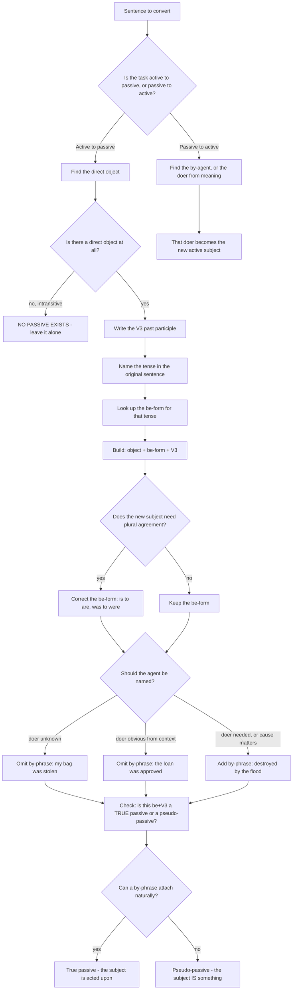

# Active Passive Voice

The active voice puts the doer first: *Ravi writes a letter.* The passive voice puts the thing acted on first and demotes the doer to a phrase at the end: *A letter is written by Ravi.* That is the whole transformation at the level of word order, and almost everything else in this topic is a consequence of it — the tense moves into an auxiliary, the verb loses its person and number and becomes a participle, and the subject must now agree with a noun that was previously an object.

What makes the topic feel harder than it is is that candidates convert in the wrong direction. They look at a passive sentence and try to remember a rule about it, when in fact every rule is about the active sentence. **The active sentence is the source. The passive sentence is the output.** Fix that in your head and the topic reduces to three questions, asked in order, every single time:

1. **What is the object?** That becomes the new subject.
2. **What is the past participle (V3) of the main verb?** That is what the new structure needs.
3. **What form of *be* matches the original tense?** That is the only free variable.

Everything else in this chapter is a special case of those three answers.

### 🟢 Lite — Quick Review (1h–1d)

**The two formulas.**

- **Active:** Subject + finite verb + object
- **Passive:** Object + *be* (correct form) + V3 + *by* + agent

**The *be*-form table.** This is the single thing that must be automatic. If you can produce this table from memory, every straightforward conversion item is solved.

| Active tense | Auxiliary in the passive |
| --- | --- |
| Simple Present | *am / is / are* |
| Present Continuous | *am / is / are* + *being* |
| Present Perfect | *has / have* + *been* |
| Simple Past | *was / were* |
| Past Continuous | *was / were* + *being* |
| Past Perfect | *had* + *been* |
| Simple Future | *will* + *be* |
| Future Continuous | *will* + *be* + *being* |
| Present Perfect Future | *will have* + *been* |
| Modal | *modal* + *be* (can be done, must be taken) |
| Modal perfect | *modal* + *have* + *been* (should have been done) |
| Modal continuous | *modal* + *be* + *being* (must be being repaired) |

**The three-step method, applied once.** *The gardener is watering the plants.* Object → *the plants*. V3 → *watered*. Tense is Present Continuous → *is being*. Result: **The plants are being watered by the gardener.** Three questions, one item.

**The verbs that cannot be passivised.** If the verb has no direct object, there is nothing to promote to subject, and the sentence simply has no passive.

- **Intransitive verbs:** *happen, occur, arrive, sleep, die, rise, fall, seem, appear, belong, exist, last, remain, flee, blush.*
- **Stative possession verbs:** *have, own, possess, lack, resemble, suit, contain, deserve* — "He has a car" does not become "A car is had by him" in ordinary English.
- **Verbs with no object in that sentence:** *He laughed* cannot become "He was laughed", even though *laugh* can be transitive with a different object. A verb's potential is not enough; **this sentence must have an object.**

**The four traps worth a line each.**

- **V2, never V3.** "The ball was kicked" is correct; "The ball was kick" is not. The passive always takes the third form.
- **Never invent *was happened*.** Intransitives have no passive: "The accident happened", "The bell rang", "He arrived".
- **The *by*-phrase is optional, not mandatory.** "My bag was stolen" is correct English with no agent at all.
- **Do not add *by* to a sentence that is not passive.** "He is a murderer" contains no passive, and it cannot be one.

### 🟡 Standard — Regular Study (2d–2mo)

**Full tense conversions, active beside passive.** Practise this table until you can produce the passive column without reading the active one.

| Active | Passive |
| --- | --- |
| She writes a poem. | A poem is written by her. |
| She is writing a poem. | A poem is being written by her. |
| She has written a poem. | A poem has been written by her. |
| She wrote a poem. | A poem was written by her. |
| She was writing a poem. | A poem was being written by her. |
| She had written a poem. | A poem had been written by her. |
| She will write a poem. | A poem will be written by her. |
| She will have written a poem. | A poem will have been written by her. |
| She can write a poem. | A poem can be written by her. |
| She should have written a poem. | A poem should have been written by her. |
| She must be writing a poem. | A poem must be being written by her. |

Notice the pattern across the whole table: **the tense never disappears, it moves into the auxiliary chain.** Simple Present is *is*; Present Perfect is *has been*; Modal perfect is *should have been*. Nothing is lost in the conversion, which is why a passive sentence is often longer than the active one it came from.

**Subject–verb agreement is where most marks are actually lost.** The new subject is the old object, and the new verb must agree with it — not with the person who happens to be reading.

- *The **letter** **was** written by the boy.* — singular subject, singular *was*.
- *The **letters** **were** written by the boy.* — plural subject, plural *were*.
- *One of the students **is** absent.* — *one of* takes a singular verb even when the noun after it is plural.
- ***A** number of students **are** absent*, but *the **number** of students **is** absent* — the head noun decides.
- *The quality of the mangoes **was** poor.* — *quality* is the head, so singular, even though *mangoes* is close and plural.

Under time pressure this agreement error is the most frequent mistake in the topic, because candidates keep the *be*-form they expected in the active sentence instead of the one the new subject requires.

**Converting questions and imperatives.** Both are regular, and both are worth recognising because they appear in transformation items.

- *Did you write the letter?* → *Was the letter written by you?*
- *Will she take the exam?* → *Will the exam be taken by her?*
- *Who taught you French?* → *By whom were you taught French?* — the wh-word goes to the front and the remaining wh-word becomes the by-phrase agent.
- *Whom did the teacher punish?* → *By whom was the teacher punished?*
- *How did you solve the problem?* → *How was the problem solved by you?* — the wh-word is the question-word and is kept; the implied agent becomes *by you*.
- **Imperative:** *Open the door.* → *Let the door be opened.* The imperative uses *let* plus object plus *be* plus V3, which is a structure worth memorising on its own.
- **Negative imperative:** *Do not touch the wires.* → *Let the wires not be touched.* or, far more natural, *The wires must not be touched.*

**Ditransitives: one active sentence, two correct passives.** When a verb takes two objects — an indirect one (to whom) and a direct one (what) — English allows two passive versions, and both are right.

Active: *He gave me a book.*

- **Indirect object promoted:** *I was given a book.* — the recipient becomes the subject, and this is the more natural of the two in English.
- **Direct object promoted:** *A book was given to me.* — the thing given becomes the subject and the recipient keeps the preposition *to*.

Both are correct. What is **not** correct is dropping the preposition while promoting the direct object: "A book was given me" is wrong, because *give* is one of the verbs that requires *to* when the indirect object follows in the passive. The same applies to *send, lend, offer, sell, show, tell, write, hand, pay, supply, deliver, read, explain, suggest, propose, grant, refuse, owe, charge, recommend, send* and *address*. Learn the list of verbs that keep their preposition — it is a standard source of items.

Active: *She showed the class the specimen.*
→ *The class was shown the specimen.* (indirect object promoted) or *The specimen was shown to the class.* (direct object promoted, *to* retained).

**The *by*-agent: when to keep it and when to drop it.** A passive sentence does not require an agent. The rule is about **information**, not grammar: keep the agent when the reader needs to know who did it, drop it when the doer is unknown, obvious, unimportant, or deliberately concealed.

| Active | Passive | Why |
| --- | --- | --- |
| The manager approved the loan. | The loan was approved. | The doer is already known from context; *by the manager* would be redundant. |
| Someone stole my bag. | My bag was stolen. | The doer is the point of the question and is unavailable. |
| The flood destroyed the crops. | The crops were destroyed by the flood. | The cause matters, so it is promoted to the agent. |
| People speak English here. | English is spoken here. | The active subject is generic, so the agent is dropped. |
| The letter was found lying in the dust. | — | No agent is available or relevant; the sentence is already a pseudo-passive. |

Note the third row. When the *cause* of an event matters, the cause occupies the *by*-slot. This is why "the crops were destroyed **by the flood**" is better English than "the flood destroyed the crops" when you want to emphasise the damage rather than the agent.

**Passive inside a reporting structure.** Reporting verbs take a *that*-clause, and a passive inside that clause is a separate conversion with its own traps.

- *He said that she **had stolen** the money.* → *He said that the money **had been stolen**.* The tense inside the reported clause is not changed by this transformation; the tense shift belongs to reported speech, a different topic, and both are legitimate depending on the context.
- *They believe that he **is guilty**.* → *He **is believed to be** guilty.* — the passive-plus-*to*-infinitive pattern.
- *It is said that the scheme **will fail**.* → *The scheme **is said to fail**.*

These inverted structures are the highest-value recognition items in the topic, because the tense no longer looks like the tense at all.

### 🔴 Extended — Deep Study (3mo+)

**Why the passive exists, and why that matters for choosing the right form.** The passive is not a decorative variant. Each of its uses solves a specific problem, and recognising which problem the writer had tells you whether the agent should be present.

**1. The doer is unknown or irrelevant.** *The shop was burgled overnight.* The point is the loss, not the thief. Adding "by a thief" adds nothing.

**2. The doer is known from context.** *The proposal was rejected at the meeting.* Everyone in the discussion knows who was in the room. *By the committee* would be padding.

**3. The doer is deliberately concealed.** *Mistakes were made.* This is the passive's most famous use in official and institutional writing, and it is worth knowing as a **rhetorical** fact: the passive can hide an agent in plain sight. When a comprehension passage asks you why a writer used the passive, this is usually the answer being tested.

**4. Politeness or delicacy.** *It is generally believed that the policy will be revised* is softer than *the government believes the policy will be revised*, because it removes the institution from the position of asserting. This is why the passive appears so heavily in reports, minutes, obituaries and academic prose.

**5. Objectivity, in scientific and legal writing.** *The sample was heated to 60 degrees* puts the procedure, not the researcher, in the subject position. This is the standard in experimental reporting and it is the reason scientific writing is saturated with passives.

**The pseudo-passive, which is not a passive at all.** A sentence of the form *The letter **was written** in ink* has *was written* in the position that looks passive, but the subject is not the patient of the action in the relevant sense — the writing is being described as a property or a circumstance, not an event with an agent. The test: can you put a *by*-phrase in?

- *The letter was written in ink.* → *The letter was written **in ink by Ram**.* The *by*-phrase attaches, so the verb is a **true passive**.
- *The shop **was closed** on Sunday.* → *The shop was closed on Sunday **by anyone**.* That makes no sense, because being closed is a state, not an event performed on the shop. This is a **pseudo-passive**, and it is one of the most-tested distinctions in advanced grammar.

The same applies to *The bridge is built of stone*, *The problem is explained by ignorance*, *The window was broken*. All state-describing, all non-passive. A true passive names something **done to** the subject; a pseudo-passive names something the subject **is**.

**Two structures that are not passives but look like them.** Both are common exam traps.

**Causative *have/get* something done.** *She had the car repaired at the garage.* Here *had* is an active causative verb and the subject is **not** passive at all — she is actively arranging the repair. Rewriting it as "The car was repaired by her" changes the meaning, because it removes the implication that she arranged it rather than doing it. The same holds for *get*: *I got my hair cut.* These are extremely frequent in speech and they are never passives.

**The passive *to*-infinitive.** *There is nothing to be done* is a genuine passive infinitive, and *He is to be informed* is a genuine passive that many candidates miss. In the first, *to be done* is the subject; in the second, the whole clause is the subject and *to be informed* is the complement.

**The be + V3 versus be + V-ing distinction.** Both appear in passive contexts and they are not interchangeable.

- *The letter **is written**.* — passive, the writing is the event.
- *The letter **is being written**.* — passive progressive, the writing is in progress *now*.
- *The letter **was written** on Monday.* — true passive, past event.
- *The letter **was written** in a clear hand.* — pseudo-passive, a state.

A comprehension question keyed to *was written* is therefore unanswerable without knowing which sense is in play, and the test is always the same: try the *by*-phrase.

**Verbs whose passivisation is debatable but grammatical.** A few verbs passivise in careful formal English but not in ordinary usage, and an item may exploit the boundary.

- *He lacks confidence.* → "Confidence is lacked by him" is grammatical but not idiomatic. In a formal administrative register it can appear; in an exam item, the safe reading is that *lacks* is stative and resists the passive.
- *She resembles her mother.* → "Her mother is resembled by her" is not idiomatic for the same reason. *Resemble* is a relation, not an action, and relations are not passive events.
- *He lacks a degree.* → "He is lacking in a degree" is the correct idiomatic form, and the naive conversion "A degree is lacked by him" is wrong. Here *lack* behaves as a prepositional verb, and prepositional verbs take the preposition in the passive: *looked after* → *was looked after*, *accounted for* → *was accounted for*, *referred to* → *was referred to*.

**A repeatable fifteen-minute conversion drill.**

1. **Three minutes** — write the *be*-form column of the tense table from memory, on paper, closed book. This is the part that must be automatic and it is the part that is easiest to leave to chance.
2. **Four minutes** — take eight active sentences of different tenses. Convert each, and for each one write the tense name **before** you write the sentence. Naming the tense first removes the guesswork from the auxiliary.
3. **Four minutes** — reverse six of them. Passive back to active. This is the direction that reveals whether the table is truly learned, because you must *find* the object rather than be given it.
4. **Four minutes** — for each sentence, mark whether the *by*-agent should be present or absent, and write one word saying why. "Unknown", "obvious", "cause matters", "generic" — the vocabulary of agent decisions.

Step four matters more than it looks. On a comprehension passage, the presence or absence of *by* is evidence about the writer's stance, and a candidate who knows why the agent is there can answer a question about the author that a candidate who only memorised the table cannot.

### 🧠 Memory Anchors

- **"The active sentence is the source; the passive is the output."** Every rule is a rule about the active sentence. Stop trying to remember rules about passives.
- **"Three questions: object, V3, be-form."** In that order. The tense question is last because it is the only one with any variation.
- **"V3, never V2."** The one form that matters. "Was kick" is the error that appears in every single careless solution.
- **"No object, no passive."** The verb being capable of taking an object is irrelevant; the sentence in front of you must have one. "The accident happened" and cannot become anything.
- **"Try the *by*-phrase to test a real passive."** If *by someone* attaches naturally, it is a passive. "The shop was closed" is a state, not an event.
- **"*Had/get* something done is not passive."** "She had the car repaired" is active and causative; converting it removes the point.
- **"Agreement is with the new subject."** A letter **was**; letters **were**. Nothing else in the conversion is missed as often.
- **Flashcard Q&A:**
  - *Present Perfect active "He has finished it" — give the passive.* → "**It has been finished** by him." The *has* survives as *has been*.
  - *Is "The door was broken" a true passive?* → Yes, and the test is that "*was broken **by someone***" attaches naturally.
  - *Is "The door was broken" (meaning it has a crack) a passive?* → No — the second reading is a pseudo-passive describing a state.
  - *Convert "He has stolen the money" to passive.* → "The money **has been stolen** by him."
  - *Why is "The accident was happened" wrong?* → *Happen* is intransitive; there is no object, so there is no passive.
  - *Give both passives of "She taught us grammar".* → "We **were taught** grammar by her" and "Grammar **was taught** to us by her."

### 🎯 Exam Traps & Error Log

1. **Using V2 instead of V3.** The single most common error. "The letter was wrote" instead of "was written". The passive takes the third form every time, including with irregular verbs.
2. **Inventing a passive for an intransitive verb.** "The accident was happened", "The bell was rung", "The war was broke out". All wrong. The verbs have no object in that sentence, so there is no passive form.
3. **Losing subject–verb agreement.** Keeping *is* with a plural new subject: "The books **is** written". The new subject is always the old object, and it decides the *be*-form.
4. **Dropping the *by*-agent when it carries the meaning.** "The crops were destroyed" instead of "destroyed by the flood" loses the cause, which is often the point of the sentence.
5. **Forcing an agent into a sentence that has none.** "My bag was stolen **by someone**" is clumsy and, in a formal register, wrong.
6. **Confusing a pseudo-passive with a real passive.** *The shop was closed on Sunday* describes a state. If a comprehension question asks whether an action occurred, answering from this sentence leads you astray.
7. **Converting the causative *have/get* something done.** "She had the car repaired" is active. Turning it into "the car was repaired by her" destroys the meaning, because it removes the idea that she arranged it.
8. **Dropping the preposition with a ditransitive verb.** "A book was given me" is wrong; it must be "given to me", or the other passive "I was given a book". *Give, send, lend, offer, sell, show, tell, teach, hand, pay, supply* all behave this way.
9. **Changing the tense during the conversion.** "The work has been completed" becoming "The work was completed" is not a conversion; it is a tense change. The tense must survive intact in the auxiliary chain.
10. **Misreading a passive *to*-infinitive as an active one.** *He is to be informed* and *It is believed that he is honest* are both passives wearing unusual clothes.
11. **Assuming the passive always contains a *by*-phrase.** It is optional in every case. Students who have memorised "object + be + V3 + by + agent" as a single formula will over-insert.
12. **Treating "is a murderer" as a passive.** *A murderer* is a noun, not a participle, and *is* here is a copula. No *by*-phrase is possible.

### 🧪 Self-Test — 8 Questions with Worked Answers

Work these on paper before reading the solutions. Each is built on one of the failure modes above.

1. **Convert to passive: "The committee has rejected the proposal."**
   Object → *the proposal*. V3 → *rejected* (regular). The tense is Present Perfect, so the auxiliary is *has been*. **The proposal has been rejected by the committee.** Note that *has* is preserved, which is the check that the tense survived: a candidate who writes "was rejected" has changed the tense rather than converted it.

2. **Convert to passive: "They are building a new bridge over the river."**
   Object → *a new bridge*. V3 → *built*, and the participle is irregular. The tense is Present Continuous, so the auxiliary is *are being*. **A new bridge is being built over the river by them.** The *by*-agent is optional here, because the sentence's interest is the bridge, not the builders; "a new bridge is being built over the river" is equally correct English.

3. **Spot the error: "The accident was happened on the highway last night."**
   **There is no passive form of *happen*.** *Happen* is intransitive — it has no direct object, so there is nothing to promote to subject and no *by*-agent to place. The correct sentence is **"The accident happened on the highway last night."** The same error appears in "the war was broke out", "the meeting was held by everyone attending" (confusing *attend* with *hold*), and "he was born in Patna" (which *is* a genuine passive, and shows that the trick is the transitivity, not the sentence's subject).

4. **Convert to passive: "She has written the letter."**
   Object → *the letter*. V3 → *written*, irregular again. Tense is Present Perfect → *has been*. **The letter has been written by her.** Then convert it back: the *by*-agent is the new subject, giving *She has written the letter* again. Doing the round trip is the fastest way to check that your auxiliary chain is right.

5. **Convert to passive, and give both versions: "He gave the girl a bicycle."**
   This is ditransitive, so there are two correct passives. **The girl was given a bicycle by him** (indirect object promoted) and **A bicycle was given to the girl by him** (direct object promoted, *to* retained). The version "a bicycle was gave the girl" is wrong twice over: it uses V2, and it drops the preposition. *Give* is one of the verbs that requires *to* before an indirect object in the passive, along with *send, lend, offer, sell, show, tell, hand, pay, supply, deliver*.

6. **Is this a true passive or a pseudo-passive? "The document was signed in two colours."**
   **Pseudo-passive.** Try the *by*-phrase: "the document was signed in two colours **by the registrar**" attaches naturally if the act is meant, which shows the *by*-phrase test is not decisive here on its own. The decisive reading is the other one: if the sentence means the document **has** two-coloured signatures — that is, describes its state — the *was signed* is not passive at all. The reliable test is whether the sentence describes an **action performed on** the subject or a **state the subject is in**. "The shop was closed on Sunday" is the same construction and the same state.

7. **Convert to passive: "He is building the model."**
   Object → *the model*. Tense is Present Continuous → *is being*. **The model is being built by him.** The item is a classic because the passive progressive is easy to skip: candidates write "the model is built", which changes a present in-progress action into a general or completed state. If the original sentence had been "He builds the model", the passive would be "the model is built", and the two originals are not interchangeable.

8. **Convert to passive: "The teacher praised the student."**
   Object → *the student*. V3 → *praised* (regular). Simple Past tense → *was*. **The student was praised by the teacher.** Now the harder version: if the *by*-agent is not wanted, "the student was praised" is correct and usually better, since the teacher is obvious from context. This item exists to test that the *by*-phrase is genuinely optional, and that a candidate who mechanically appends *by the teacher* to every conversion will over-insert it in comprehension passages where its absence is the evidence the question depends on.

### 💡 Pro Tips

1. **Always convert from the active.** If you are given a passive and asked for the active, find the doer first and rebuild the active sentence from it. Working backwards from the participle is where the errors start.
2. **Name the tense out loud before you write the auxiliary.** "Present Perfect" produces "has been" automatically; "what should I put here" produces a guess. Naming removes the guess.
3. **Check agreement before you finish every conversion.** Does the *be*-form match the new subject's number? This is the most common avoidable error in the topic.
4. **Learn the preposition-retaining verb list.** *Give, send, lend, offer, sell, show, tell, teach, hand, pay, supply, deliver, write, address, explain.* Ditransitive items are decided by this list and nothing else.
5. **Practise both directions.** Active to passive is easy; passive to active is where the table gets tested. Do a set of each per session.
6. **Use the *by*-phrase as your reading tool in passages.** Its presence tells you the writer thought the doer mattered; its absence tells you they hid, omitted, or found it obvious. That is answer material for author-intent questions.
7. **Keep a short list of your *-less* verbs.** When you convert something and it comes out wrong because the verb was intransitive, write the verb down. That list grows small, stops growing, and then permanently prevents a class of error.
8. **Do not over-insert the agent.** "My bag was stolen" is better English than "my bag was stolen by someone", and in a formal passage the unnecessary *by*-phrase is a register error as well as a stylistic one.

---

## Continue your study

- **[View this topic in your CUET UG roadmap](/roadmap/?exam=cuet&duration=1mo)** — see where "Active Passive Voice" fits in your personalised plan
- **[Build a quick revision plan](/roadmap/?exam=cuet&duration=1d)** — 1-day sprint covering highest-weight topics
- **[CUET UG exam overview](/exams/cuet/)** — pattern, eligibility, and syllabus
- **[All English notes](/notes/cuet/english/)** — browse sibling topics in this subject

---
*Content adapted based on your selected roadmap duration. Switch tiers using the selector above.*
