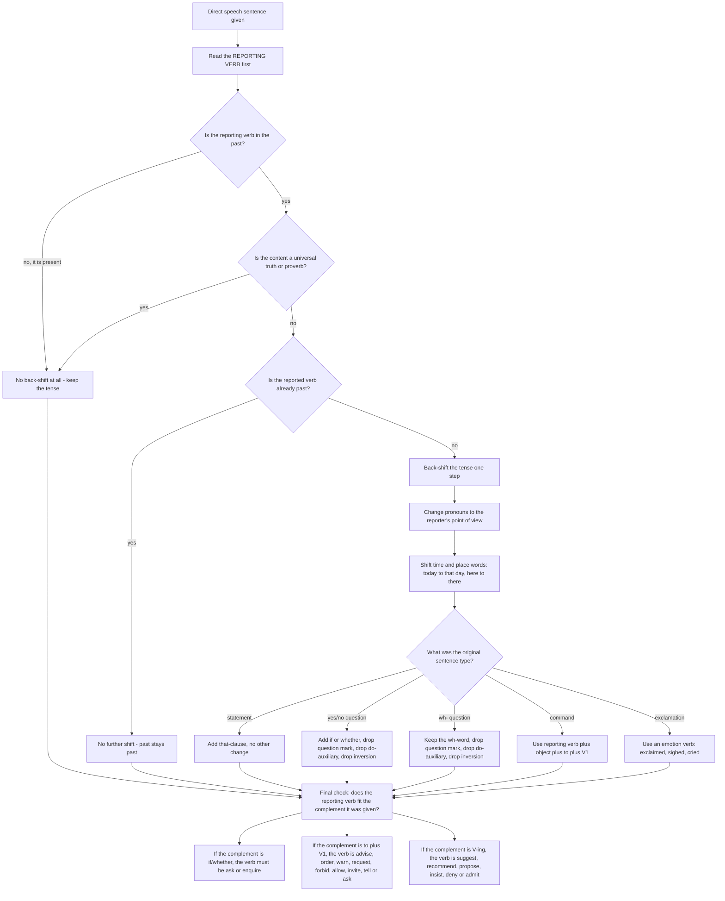

# Direct Indirect Speech

Direct speech reproduces a speaker's exact words, wrapped in quotation marks: *She said, "I am tired."* Indirect speech reports the content without reproducing it: *She said that she was tired.* Between those two forms there are four simultaneous changes — tense, pronoun, time-and-place words, and sentence type — and the difficulty of the topic is not any one of them. It is that candidates perform three of the four and forget the fourth.

The single most useful idea in the whole chapter is this: **the reporting verb is the control switch.** Read the reporting verb first, and you know whether back-shift happens at all. A past reporting verb shifts the tense; a present reporting verb does not; a universal truth never shifts. Everything about tense in reported speech follows from that one word, and candidates who begin with the quoted sentence rather than with the reporting verb are already behind.

The second useful idea is that indirect speech has a **new point of view**. Once the words leave the speaker's mouth, every *here, now, today, I, my* is measured from the reporter's position, not the speaker's. A conversion that shifts the tense perfectly but leaves *here* in place is the most common error in the topic, and it is the one candidates rarely check.

### 🟢 Lite — Quick Review (1h–1d)

**The core formulas.**

- **Statement:** *Reporting verb + (that) + subject + changed verb*
- **Yes/no question:** *Reporting verb + object + **if/whether** + subject + changed verb* (statement word order, no question mark, no *do/does/did*)
- **Wh- question:** *Reporting verb + object + **wh-word** + subject + changed verb* (same three removals)
- **Command / request / advice:** *Reporting verb + object + **to + V1***

**The four checklists, in the order you should work through them.**

**1. Tense — only if the reporting verb is past.**

| Direct | Indirect |
| --- | --- |
| Simple Present (*am/is/are + V1*) | Simple Past (*was/were + V1*) |
| Present Continuous (*am/is/are + V-ing*) | Past Continuous (*was/were + V-ing*) |
| Present Perfect (*have/has + V3*) | Past Perfect (*had + V3*) |
| Present Perfect Continuous (*have/has been + V-ing*) | Past Perfect Continuous (*had been + V-ing*) |
| Simple Past (*V2*) | Simple Past — **no further shift** |
| Past Continuous (*was/were + V-ing*) | Past Continuous |
| Past Perfect (*had + V3*) | Past Perfect |
| Simple Future (*will + V1*) | *would + V1* |
| Present Perfect Future (*will have + V3*) | *would have + V3* |

Note the last three rows. A past simple stays a past simple — back-shift moves one step back on the tense line, and the past simple is already at the back. A simple past in the direct speech does not become a past perfect.

**2. Pronoun and point of view.**

| Direct | Indirect |
| --- | --- |
| I | he / she (or **you**, if the reporter is the person being addressed) |
| we | they (or **you**) |
| my, mine | his, her (or **your**) |
| my | his, her (or **your**) |
| you, your | I, me, my / we, us, our — **only if** the reporter is the addressee; otherwise he / she / they |

**3. Time and place.** *today → that day*, *tomorrow → the next day*, *yesterday → the day before*, *now → then*, *ago → before*, *here → there*, *this → that*, *these → those*, *tonight → that night*, *last week → the week before*, *next week → the following week*.

**4. Sentence type.** Questions lose their inversion and their question mark and gain *if/whether* or a wh-word. Imperatives become *to*-infinitives. Exclamations become flat reported clauses with an emotion-noun in the reporting verb.

**The three reporting-verb pairs that cause the most damage.**

- ***say* takes no object; *tell* always takes one.** "He said **me**" and "He told" (with no listener) are both wrong. Correct: *He said that…* / *He told me that…*
- ***suggest, recommend, propose, advise, insist* reject the *to*-infinitive.** Write *He suggested going home*, never "he suggested to go home". But *advise, warn, order, command, request, allow, forbid, invite* all **do** take it: *He advised me to leave*, *He warned me to be careful*.
- ***ask* takes an object and a complement.** *He asked me what I wanted*, never "He asked me what did I want".

**The one exemption, memorised as a single sentence.** Universal truths, proverbs, and permanent facts do not back-shift. *She said, "The earth revolves around the sun"* becomes *She said that the earth revolves around the sun* — unchanged — because no one believes the sun began revolving in the 1990s.

### 🟡 Standard — Regular Study (2d–2mo)

**Modals have their own back-shift, and it is not identical to the tense rule.** The pattern is: modals of **future and past ability** shift, modals of **deduction and past state** do not.

| Modal in direct speech | Indirect, when the shift is required | Note |
| --- | --- | --- |
| *will* | *would* | Future → future-in-the-past |
| *can* | *could* | Present ability → past ability |
| *may* | *might* | Present permission or possibility → past |
| *shall* | *should* | *Shall I…?* offers become *should I…?* |
| *must* (obligation) | *had to* | "I must go" → "he had to go" |
| *must* (deduction) | *must* | "He must be inside" → "he must be inside" — no shift |
| *mustn't* (prohibition) | *must not* | "You mustn't smoke" → "he must not smoke" |
| *would, could, should, might, ought to* | unchanged | These are already past-tense modals |
| *used to* | *used to* | "I used to live here" → "he used to live there" |
| *had better* | *had better* | Unchanged in form; check the following verb separately |

The *must* split is the one that catches people, and it is decided by meaning, not by form. *Must* meaning **obligation** shifts to *had to*. *Must* meaning **logical deduction** does not shift at all, because a deduction about the present is still a deduction about the present from the reporter's viewpoint.

**A full worked conversion, every change marked.** This is the item type done slowly.

> **Direct:** The teacher said, "I **have** been waiting here **since morning**, and I **will not leave** **until the manager arrives**."

| Element | Direct | Indirect | Rule applied |
| --- | --- | --- | --- |
| Reporting verb | *said* | *said that* | past reporting verb → back-shift applies |
| Pronoun | I | she | speaker ≠ reporter |
| Tense | have been waiting | **had been** waiting | Present Perfect → Past Perfect |
| Place word | here | **there** | measured from the reporter's position |
| Time word | since morning | **since that morning** | "since" is retained; the time expression is specified |
| Modal | will not | **would not** | will → would |
| Main verb | arrives | **arrived** | Simple Present → Simple Past |

**Indirect:** The teacher said that she **had been** waiting **there since that morning**, and she **would not leave until the manager arrived**.

Every one of the four checklists was used, and the order of the checklists matters: tense first because it is the biggest change, then pronouns, then time-and-place, then sentence type. A candidate who does the sentence-type conversion first has usually forgotten half the others by the time they finish.

**Questions.** The rules for both question types, with the three things that are always removed.

*Yes/no question.* **Direct:** *He asked me, "Do you know the answer?"* **Indirect:** *He asked me **whether/if** I knew the answer.*

Removed: the question mark, the *do* auxiliary, and the inversion.

*Wh- question.* **Direct:** *She asked, "Where do you live?"* **Indirect:** *She asked **where** I lived.*

Removed: the question mark, the *do* auxiliary, and the inversion. The wh-word survives and moves in front of the reported clause.

*Wh- word as the subject.* **Direct:** *"Who broke the window?"* **Indirect:** *She asked **who had broken** the window.* When the wh-word is the subject, back-shift applies as normal.

*Reported question with no explicit subject.* **Direct:** *"What happened?"* **Indirect:** *She asked **what had happened**.* Note that if the subject is *it*, the word *it* is usually retained even though it is the logical subject: *She asked what it was*, not "She asked what was it".

*There-questions.* **Direct:** *"Are there any vacancies?"* **Indirect:** *He asked **whether there were** any vacancies.* The existential *there* survives the shift.

**Commands, requests, advice and warnings — the *to*-infinitive table.**

| Reporting verb | Construction | Example |
| --- | --- | --- |
| *order, command* | object + **to** + V1 | He ordered the boys to leave. |
| *tell, ask* | object + **to** + V1 | She told me to wait. |
| *request, advise, warn* | object + **to** + V1 | He warned us to be careful. |
| *invite* | object + **to** + V1 | They invited her to join. |
| *allow, permit, forbid* | object + **to** + V1 | He forbade them to enter. |
| *suggest, recommend, propose* | **object + V-ing** | He suggested going home. |
| *insist* | **object + V-ing** | She insisted on paying. |
| *admit, deny, mention, propose* | **that-clause** | He admitted that he had lied. |
| *apologise* | **for + V-ing** | He apologised for being late. |
| *thank* | object + **for + V-ing** | She thanked me for helping. |

The *suggest*/*recommend*/*propose* row is the one to learn properly. "He suggested **to go** home" is wrong; "He suggested **going** home" and "He suggested **that he should go** home" are both right. The same applies to *recommend* and *advise* — with the single exception that *advise* takes both forms: *He advised going home* and *He advised me to go home* are both correct, and the difference is whether an object is named.

**Exclamations.** The *what* and *how* of direct exclamatory speech is dropped, and the emotion is carried by the reporting verb.

- *"What a beautiful day!"* → **He exclaimed that it was a very beautiful day.**
- *"How lovely the garden is!"* → **She said that the garden was very lovely.**
- *"Bravo!"* → **He applauded.**
- *"Alas! He is dead."* → **She lamented that he was dead.**

The reporting verbs carry the emotion by themselves: *exclaimed, cried, shouted, whispered, murmured, muttered, sighed, replied, answered, retorted, added, observed*. In a transformation item the verb often has to be supplied, and choosing *replied* where *exclaimed* was required loses the mark, because the emotion is part of what is being reported.

**When back-shift does not apply.** Four cases, and together they explain every legitimate exception you will meet.

1. **The reporting verb is in the present.** *She **says** that she is leaving.* No shift, because the report is being made now about a current situation. Modern usage is consistent about this.
2. **The content is a universal truth, a proverb, or a permanent fact.** *He said that honesty is the best policy.* Proverbs are frozen, so they cannot move.
3. **The direct speech is already in the past.** *He said that he **had finished** the work* reports a past perfect; there is no further step back.
4. **The direct speech expresses past habit, with *would* or *used to*.** *"I would visit her every Sunday"* → *He said that he **would visit** her every Sunday.* The *would* is the past-habit form and it stays.

Modern English usage is generally more relaxed about back-shift than the textbooks suggest — a reported clause in the present tense after a past reporting verb is widely accepted. **In an examination item, however, back-shift is what is being tested.** Apply it, and the item will match the key.

### 🔴 Extended — Deep Study (3mo+)

**Reporting verbs as a system, and what each one forces.** The choice of reporting verb is not free. Each one imposes a specific pattern on the complement, and knowing the pattern lets you infer the verb from a sentence you have been given — which is how "choose the correctly reported sentence" items are actually solved.

| Reporting verb | Complements it takes |
| --- | --- |
| *say, state, mention, note, observe* | a *that*-clause; **no object** before it |
| *tell, inform, notify, warn, remind, assure* | a *that*-clause; **requires an object** |
| *ask, enquire, wonder* | object + *if/whether/wh-* clause |
| *suggest, propose, recommend, insist, deny, admit* | object + **V-ing**, or a *that*-clause |
| *advise, warn, order, command, request, allow, forbid, invite, tell, ask* | object + **to** + V1 |
| *exclaim, cry, shout, whisper, sigh, reply, answer, retort* | *that*-clause; the emotion is in the verb |
| *apologise* | *for* + V-ing |
| *thank, blame, accuse, praise, congratulate* | object + *for* + V-ing |
| *wish* | a *that*-clause with **subjunctive** form: *He wished that he **were** there* |
| *promise, threaten, agree* | *to* + V1, with no object |

Three consequences follow immediately, and they are worth internalising because they let you solve items rather than guess them.

- If the complement is an *if/whether* clause, the verb **must** be *ask, enquire, wonder* or *demand*. No other verb takes it, so seeing "…wondered whether…" is correct and "…said whether…" is not.
- If the complement is object + *to* + V1, the verb **must** be from the *advise/warn/order/command/request/allow/forbid/invite/tell/ask* row. This lets you identify the reporting verb from the shape of what follows.
- If the complement is object + V-ing, the verb **must** be *suggest, recommend, propose, insist, deny, admit, apologise* or *thank*. This is the reverse of the *advise* row and the two are tested against each other constantly.

**The subjunctive after *wish*, *as if*, *as though*, *would rather*, and *it is time*.** A small family of forms that no ordinary back-shift table covers, and which appear in the hardest items.

- *"I wish I **were** taller."* → *He said that he **wished** he **were** taller.* No back-shift of the *were*.
- *"I wish I **had** known."* → *She said she **wished** she **had known**.* The past perfect is retained.
- *"He behaves as if he **knew** everything."* → *She said he behaved as if he **knew** everything.* The subjunctive *knew* is the past form of *know* but is not a tense statement.
- *"It is time we **left**."* → *He said it was time they **left**.*

The rule in one line: after these words, use the **subjunctive** forms — *were* for all persons, and the bare infinitive after *would rather*. Do not back-shift them, because the form is already doing the work that tense would otherwise do.

**Modals of deduction, and the trap inside the trap.** When a reporting verb carries a modal of deduction, the meaning can change on conversion, and this is one of the genuinely hard items.

- *"He **must** have stolen it."* (certain) → *She said that he **must have** stolen it.* Certainty is reported as certainty.
- *"He **may/might** have stolen it."* (possible) → *She said that he **may/might have** stolen it.* Possibility is reported as possibility.
- *"He **can't/couldn't** have stolen it."* (certainly not) → *She said that he **couldn't have** stolen it.* Certain denial is reported as denial.

Note that *may, might, can't, couldn't* do **not** shift here, even though *may* and *can* normally do. The reason is that these modals are already pointing backwards at a past situation, and the reported clause is pointing backwards at the same past situation. The item is designed to catch students who apply the modal back-shift table mechanically.

**Mixed direct and indirect speech in one sentence.** When a speaker is quoted inside a quotation, the time reference of the inner report is relative to the *original* speaker, not the reporter.

> **Direct:** He said, "I told you yesterday that I **would leave** on Friday."

Here *yesterday* and *would* are measured from **him**, and the outer conversion shifts them relative to the narrator: *He said that he had told me the day before that he would leave on Friday.* The inner report's *would* is already a shifted form, so it does not shift again, while *told* does. This is a well-known examiner's construction and it is easier to solve if you do it in two separate steps, converting the inner clause first.

**Reporting a past general truth versus a personal opinion.** The exemption for universal truths applies only to genuinely universal ones. A statement that was true *for the speaker* but is now dated still shifts, and misclassifying it is a common error.

- *"Water boils at 100 degrees Celsius."* → *She said that water boils at 100 degrees Celsius.* **No shift** — universal truth.
- *"The old bridge was built in 1912."* → *He said that the old bridge **had been** built in 1912.* **Shift** — a historical fact, not a law of nature.
- *"Rice is the staple food of the region."* → *He said that rice **was** the staple food of the region.* **Shift** — a habit that can change, not a natural law.

The dividing line is: could this have been false at another time? If yes, it shifts.

**A repeatable twenty-minute drill.**

1. **Four minutes** — write the tense back-shift table and the modal table from memory, closed book. These two are the entire topic and they must be automatic.
2. **Six minutes** — convert six direct statements. After each one, mark on paper which of the four checklists you used, so you see immediately which checklist you are skipping.
3. **Five minutes** — convert four questions (two *if/whether*, two wh-) and two commands. The three removals — question mark, *do*-auxiliary, inversion — are the whole skill, so do them deliberately.
4. **Five minutes** — go back and convert two of the six statements *forwards again*, from indirect back to direct. This is the harder direction and it exposes gaps the forward direction hides, because in reverse you must reconstruct the original pronouns and time words rather than merely change them.

### 🧠 Memory Anchors

- **"The reporting verb is the switch."** Past reporting verb shifts the tense; present reporting verb does not; universal truth never shifts. Decide this before anything else.
- **"One step back, then stop."** Past simple stays past simple. A shift is one step, not a collapse to the deepest past.
- **"*Say* no object, *tell* always one."" The shortest rule in the topic and the most frequently broken.
- **"Suggest takes *-ing*; advise takes *to*."** "He suggested to go" is the single most-misspelled form in reported speech.
- **"Questions die in threes."** Question mark, *do*-auxiliary, inversion — all three go, every time, in both question types.
- **"Here and now belong to the speaker."** If you have shifted the tense and left *here* alone, you have done the easiest half of the conversion.
- **"Must has two jobs."** Obligation shifts to *had to*; deduction stays *must*.
- **Flashcard Q&A:**
  - *Convert: "He asked me, 'Do you know the way?"* → "He asked me **whether/if** I knew the way." Question mark, *do*, inversion all removed.
  - *Convert: "I suggested, 'Let us go now.'"* → "I suggested **going** then" or "I suggested **that we should go** then." Never "to go".
  - *Convert: "He said, 'I must leave at six.'"* → "He said he **had to** leave at six." Obligation, so *must* → *had to*.
  - *Does "The sun rises in the east" back-shift?* → **No.** Universal truth; the reporting verb does not touch it.
  - *Convert: "She told me, 'I was tired.'"* → "She told me she **was** tired." Already past; no further shift.
  - *What is wrong with "He asked me where did I live"?* → Inversion survives. Correct: "He asked me where **I lived**."

### 🎯 Exam Traps & Error Log

1. **Starting from the quoted sentence instead of the reporting verb.** The reporting verb decides whether back-shift happens at all. Reading the wrong thing first guarantees wasted effort and a coin-flip answer.
2. **Back-shifting a past simple.** *"I had seen him"* must not become "he had **had** seen him". Past simple and past perfect both sit at the back of the tense line and do not move.
3. **Forgetting the *to*-infinitive after orders and requests.** "He ordered me **leave**" is missing the *to*; the structure is *ordered + object + to + V1*.
4. **Writing "He suggested to go home."** *Suggest, recommend* and *propose* take **object + V-ing** or a *that*-clause, never a *to*-infinitive. This is the most-penalised single error in the topic.
5. **Keeping inversion in a reported question.** "He asked me **where did I live**" is wrong; reported questions use statement word order, always.
6. **Keeping the question mark or the *do*-auxiliary.** "He asked me **do** I know" and "…where **do** you live?" both retain an auxiliary that has no place in a reported clause.
7. **Writing "He said me" or "He told."** *Say* takes no object; *tell* requires one. There is no version of this rule that permits *said me*.
8. **Leaving *here, now, today* unchanged.** The speaker's point of view becomes the reporter's. *Here* → *there*, *today* → *that day*, *now* → *then*.
9. **Back-shifting a universal truth or a proverb.** *Honesty is the best policy* does not become *honesty **was** the best policy*. A moment's thought about whether the statement could have been false at another time settles it.
10. **Applying the modal table mechanically to modals of deduction.** *"He must have gone"* must become "he **must have** gone", not "he **had to have** gone". The modal already points at the past.
11. **Shifting the subjunctive after *wish*, *as if* and *as though*.** *"I wish I were there"* → "he said he **wished** he **were** there", with *were* retained for every person.
12. **Back-shifting the inner report of a mixed quotation twice.** In a sentence nested two levels deep, convert the inner clause first, then the outer. The inner *would* is already shifted and must not shift again.

### 🧪 Self-Test — 8 Questions with Worked Answers

Work these on paper before reading the solutions. Each is built on one of the failure modes above.

1. **Convert to indirect: The teacher said, "I have been waiting here since morning."**
   The reporting verb is *said*, which is **past**, so back-shift applies. Present Perfect → Past Perfect, giving *had been waiting*. The pronoun *I* becomes *she*, since the teacher is reporting her own words to someone else. *Here* becomes *there*, because the position is now the listener's. *Since morning* becomes *since that morning*, since the reference point has moved. **The teacher said that she had been waiting there since that morning.** The item tests all four checklists at once, and a candidate who changes only the tense has completed a quarter of the work.

2. **Convert to indirect: He asked me, "Do you know the way to the station?"**
   It is a yes/no question, so it takes *if/whether*. Three things must go: the question mark, the *do* auxiliary, and the inversion. *Do you know* becomes *I knew* — the *do* is removed and the tense back-shifts because the reporting verb is past. *The way to the station* is a thing that does not change its name when the speaker changes. **He asked me whether I knew the way to the station.** "He asked me if I knew the way to the station" is equally correct; *that* is not.

3. **Convert to indirect: She suggested, "Let us take a taxi."**
   The word *suggest* is the whole item. It does **not** take a *to*-infinitive, so "She suggested to take a taxi" is wrong. It takes object plus **V-ing** — and because the suggestion is about both of us, the object is implied rather than named — or a *that*-clause with *should*. **She suggested taking a taxi** or **She suggested that we should take a taxi.** Note also that *let us* has been converted into a plain subject, which is what happens to a first-person inclusive in reported speech. If the verb had been *advised*, the answer would be "She advised **us to take** a taxi" — the contrast is the point of the item.

4. **Which sentence is correct, and why is the other wrong?**
   (a) The manager said that he must leave at six.
   (b) The manager said that he had to leave at six.
   Both are defensible, and the difference is the sense of *must* in the original. If the direct speech was *"I must leave at six"* meaning **obligation** — he is required to leave — then (b) is right, because obligation shifts to *had to*. If the direct speech meant **deduction** — he is certainly leaving at six — then (a) is right, because a deduction is a judgment of the speaker, and the reporter's judgment about the same present situation does not move into the past. This item exists because the *must* split is the one place where the modal table has an exception, and the exception is decided by meaning.

5. **Convert to indirect: He said, "Honesty is the best policy."**
   **He said that honesty is the best policy.** Nothing shifts, because the content is a proverb, and proverbs are frozen. The test is simple and worth memorising: could this statement have been false at some other time? If no, it is a universal truth and does not back-shift. By contrast, *"The old bridge was built in 1912"* is a historical fact, not a universal one, and it does shift — "he said that the old bridge **had been** built in 1912". Candidates who treat every reported statement the same get the first of these right by accident and the second wrong, which is the worst outcome.

6. **Convert to indirect and supply a suitable reporting verb: "What a beautiful morning!"**
   The *what*-exclamation cannot survive as a question or as an exclamation in indirect speech. The *what* is dropped, the degree is folded into a comparative or an intensifier, and the emotion is carried by the reporting verb. **He exclaimed that it was a very beautiful morning** or **He said that it was a very beautiful morning.** Both are acceptable; *exclaimed* or *cried with delight* is preferred because it preserves the emotion that the original exclamation expresses. *"He exclaimed that what a beautiful morning it was"* is wrong, and so is retaining the exclamation mark.

7. **Spot the error: He asked me what did I want.**
   The error is **surviving inversion**. A reported question uses statement word order. The wh-word survives, the question mark is gone, the *do* auxiliary is gone, and the subject comes before the verb. **He asked me what I wanted.** The same sentence with the wh-word opening — "What did I want" becomes "He asked me what I wanted", not "He asked what did I want" — is the same single error. A candidate who knows the three removals has the whole item; a candidate who does not will usually leave either the inversion or the question mark behind.

8. **Convert to indirect: The officer said, "I told you yesterday that I would leave on Friday."**
   Do this in two steps, inner clause first. The inner report was already indirect, so its *would* is already a shifted form and **does not shift again**. Then convert the outer layer, which does shift: *I told you yesterday* becomes *he had told me the day before*, and *would leave on Friday* keeps its *would* and changes only the main verb, giving *would leave on Friday*. **The officer said that he had told me the day before that he would leave on Friday.** The item is designed to punish anyone who converts in one pass, and it is the single most useful exercise in the topic because it forces you to hold two time frames at once.

### 💡 Pro Tips

1. **Read the reporting verb first, every time.** It decides whether anything shifts. Nothing else in the sentence matters until you know that.
2. **Run the four checklists in a fixed order.** Tense, pronouns, time-and-place, sentence type. A fixed order means you never skip one, and skipping is the usual cause of a lost mark.
3. **Circle the time and place words before you start.** *Here, now, today, tomorrow, yesterday, this, these, ago* — mark them in the direct sentence and hunt each one down in the converted version. This is the check candidates almost never do and the error they almost always make.
4. **Learn the *suggest/advis* contrast as a pair.** They are the two verbs most often confused, they take opposite complements, and one line of memory fixes both.
5. **Practise reverse conversion too.** Indirect to direct forces you to reconstruct the speaker's pronouns and time words instead of merely changing them, and it is the direction that reveals what you have not learned.
6. **Handle nested quotations one layer at a time.** Convert the innermost clause first, then work outward. It is slower for two seconds and vastly faster than a single pass.
7. **Keep the reporting verb semantically close to the original where the item allows a choice.** If the original says *asked*, do not upgrade it to *inquired* unless the option specifically requires a change; an unnecessary change is a new error.
8. **Memorise the universal-truth test as one question.** *Could this have been false at another time?* If no, do not shift. That single question settles more items than the whole back-shift table.

---

## Continue your study

- **[View this topic in your CUET UG roadmap](/roadmap/?exam=cuet&duration=1mo)** — see where "Direct Indirect Speech" fits in your personalised plan
- **[Build a quick revision plan](/roadmap/?exam=cuet&duration=1d)** — 1-day sprint covering highest-weight topics
- **[CUET UG exam overview](/exams/cuet/)** — pattern, eligibility, and syllabus
- **[All English notes](/notes/cuet/english/)** — browse sibling topics in this subject

---
*Content adapted based on your selected roadmap duration. Switch tiers using the selector above.*
