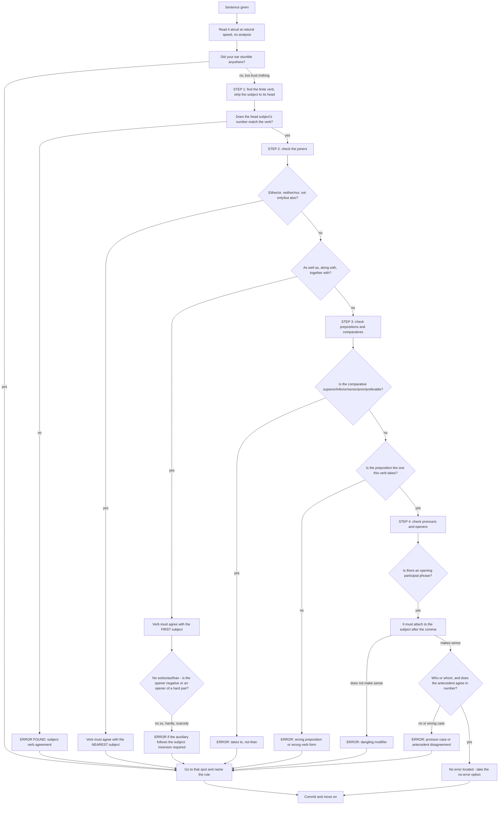

# Error Spotting

Error spotting asks you to find the one place in a sentence where English grammar breaks, and to say nothing about the rest. The skill looks mechanical and is not, because a sentence in an error-spotting item is deliberately constructed to be *almost* right everywhere. The writer has gone to real trouble to make the rest of the sentence fluent, so that your attention goes straight to the flaw. Students who read the whole sentence carefully at a uniform speed spend their time admiring the parts that were never in question.

The reliable method is therefore to **scan for specific structures, not for general correctness.** You are not looking for "a mistake". You are looking for a verb and its subject, a correlative conjunction, a preposition, an opening participle, a comparative, an uncountable noun. Each has a rule, each rule can be checked in a couple of seconds, and together they cover almost every item you will meet.

The two things that make this topic winnable are worth stating plainly. First, **errors are systematic, not random.** Test writers do not invent new mistakes; they reuse the seven or eight high-frequency ones, because those are the ones a well-prepared candidate can be expected to spot. Second, **you only need one error per item.** The rest of the sentence is irrelevant to your score, which means a candidate who checks four structures quickly and reliably will beat a candidate who reads the whole sentence beautifully three times.

### 🟢 Lite — Quick Review (1h–1d)

**The eight checks, in the order to run them.** Ninety seconds on a sentence should consist of these eight glances and nothing else.

**1. Find the finite verb. Find its real subject.** The real subject is often several words away, and a phrase in between is a trap. *The quality of the mangoes **was** poor.* The head of the subject is *quality*, singular, so *was* is right and *were* is the error. Immediately rule out a verb that is matching the nearest noun.

**2. Check the subject's number and the verb's.** The highest-frequency error in the topic.

| Subject | Verb |
| --- | --- |
| *Each, every, everyone, everybody, anyone, anybody, no one, nobody, neither, either* | **singular, always** |
| *One of the + plural noun* | **singular** (*One of the students **is** absent*) |
| *The number of + plural noun* | **singular** (*The number of errors **is** high*) |
| *A number of + plural noun* | **plural** (*A number of errors **are** high*) |
| *News, mathematics, physics, economics, information, advice, furniture, luggage, scenery, machinery, equipment* | **singular** |
| *Either … or, neither … nor, not only … but also* | agrees with the **subject nearest the verb** |
| *As well as, along with, together with, in addition to, besides, accompanied by* | agrees with the **first subject** |
| *A pair of, a set of, a kind of, a series of* | **singular** |

**3. Check correlative pairs for balance.** *Not only* … *but also*, *either* … *or*, *neither* … *nor*, *both* … *and*, *so* … *that*, *such* … *that*, *as* … *as*, *no sooner* … *than*, *hardly* … *when*, *rather* … *than*, *the more* … *the more*. The elements on both sides must be the same part of speech. *"She not only visited Paris but also London"* is wrong because the first element is a verb and the second is a noun. Correct: *"She visited not only Paris but also London."*

**4. Look at the first word for inversion.** If the sentence opens with *seldom, rarely, scarcely, hardly, little, never, not only, no sooner*, the auxiliary must come before the subject. *"Scarcely **had he** left the room **when** the phone rang."* Two things to check here: the inversion, and the correlative — *no sooner* pairs with **than**, while *hardly, scarcely* and *barely* pair with **when**.

**5. Check the preposition.** A small set of collocations carries most of the preposition errors: *according to, because of, due to, despite, besides, apart from, in addition to, consist of, comprised of, different from, similar to, anxious about, capable of, aware of, fond of, proud of, responsible for, superior to, prefer to, insist on, depend on, rely on, concentrate on, blame X for, comply with, agree with, deprive of, prevent from, apologize to someone for something.*

**6. Check the openers for redundancy.** *Despite of*, *comprises of*, *return back*, *revert back*, *repeat again*, *cope up with*, *new innovation*, *free gift*, *past history*, *final conclusion*, *completely annihilated*, *cooperate together*, *marry with*, *discuss about*, *describe about*, *entrust with* (in the sense of entrusting someone to a task, no preposition).

**7. Check the opening modifier.** A participial phrase before the main clause must attach to the subject immediately after the comma. *"Walking through the garden, **the roses** smelled lovely"* is impossible, because the roses were not walking.

**8. Read it aloud for the last check.** This is not mysticism. An error-spotting sentence almost always has one word that the mouth stumbles on, because the ear is faster than the parser. If a phrase sounds wrong, it usually is, and you can then go back and name the rule.

**The item format.** In a divided-sentence item, the sentence is broken into labelled parts and you choose the part containing the error, with an extra option meaning "no error". Two consequences: **the error is in one segment, so you can read the segments independently**, and **the "no error" option is frequently correct**, so do not hunt for a mistake that is not there.

### 🟡 Standard — Regular Study (2d–2mo)

**The full error taxonomy, with the rule, the wrong form and the right form.** This is the working reference for the Standard tier.

| Error domain | The rule | Wrong | Right |
| --- | --- | --- | --- |
| **Correlative agreement** | With *either/or, neither/nor, not only/but also*, the verb agrees with the **nearest** subject | *Neither the captain nor the players **was** ready.* | *Neither the captain nor the players **were** ready.* |
| **Parenthetical agreement** | With *as well as, along with, together with, in addition to, accompanied by*, the verb agrees with the **first** subject | *The teacher, along with her students, **were** honoured.* | *The teacher, along with her students, **was** honoured.* |
| **Indefinite pronoun** | *Each, every, everyone* and their relatives are singular | *Everyone **are** ready.* | *Everyone **is** ready.* |
| **Possessive with indefinite pronoun** | Use *his/her/their* singular, or *of* + plural noun | *Each must bring **their own** equipment.* | *Each must bring **his or her own** equipment.* |
| **Uncountable noun** | No plural form; singular verb; quantify with a counter | *The furnitures **were** imported.* / *He gave me many advices.* | *The furniture **was** imported.* / *He gave me much **advice**.* |
| **Article before a singular countable** | Every singular countable noun needs an article on first mention | *I bought **mobile** yesterday.* | *I bought **a mobile** yesterday.* |
| **Comparative degree** | *Superior, inferior, senior, junior, prior, anterior, preferable* take **to**, not *than* | *This model is superior **than** that one.* | *This model is superior **to** that one.* |
| **Double comparative** | Never combine *more/most* with a comparative suffix | *more better, most easiest, more superior* | *better, easiest, superior* |
| **Subjunctive after demand verbs** | After *insist, recommend, suggest, demand, require, request, order, urge*, use the **bare infinitive** | *He insisted that she **submits** the essay.* | *He insisted that she **submit** the essay.* |
| **Who versus whom** | *Who* is a subject, *whom* an object; test with *he/him* | *The man **whom** won the prize.* | *The man **who** won the prize.* |
| **Comparative of dissimilar things** | Never compare a thing to a whole using a comparative | *The climate of Pune is cooler than **Delhi**.* | *The climate of Pune is cooler than **that of** Delhi.* |
| **Wrong verb after *than*** | Use *was/were*, not *than was/were*, after a comparative | *He ran faster **than I was**.* | *He ran faster **than I**.* |
| **Wrong verb after *no sooner/hardly*** | Use **had + V3**, not *did* | *No sooner **did** he arrive **than** it rained.* | *No sooner **had** he arrived **than** it rained.* |
| **Wrong verb after *as well as*** | Use a singular verb, not a compound | *She, as well as her friends, **were** late.* | *She, as well as her friends, **was** late.* |
| **Wrong verb after *either/or* with *not*** | *Not either* takes a singular verb | *Not only **were** the results negative.* | *Not only **were** the results negative* is right, but *Not either the plan **were** adequate* must be **was**. |
| **Wrong infinitive after *should/would/could/must*** | These are followed by the **bare infinitive** | *You should **to** leave by seven.* | *You should **leave** by seven.* |
| **Wrong verb after *one of*** | *One of* takes a singular verb | *One of the members **are** absent.* | *One of the members **is** absent.* |

**Parallelism in series, comparison and correlative structures.** Parallelism is the most reliably tested structural concept in the topic, because the rule is absolute: elements in a series must share the same grammatical form.

- *She enjoys **swimming**, **hiking** and **reading**.* — three gerunds, parallel.
- *She enjoys **swimming**, **hiking** and **to read**.* — the third element breaks the pattern. This is the error.
- *He neither **lied** nor **stole**.* — two finite verbs, parallel.
- *He neither **lied** nor **in stealing**.* — broken.

The same rule governs comparisons and the *both…and* / *not only…but also* pairs. Whatever form follows the first element must be repeated in each subsequent element. A useful memory line: **match the first element, and copy its form three times.**

**Comparisons with *that of* and *those of*.** When a comparison uses a possessive phrase on one side only, the other side needs a substitute word or phrase so the two sides are the same kind of thing.

- *The climate of **Bangalore** is cooler than **that of Delhi**.* — *that* stands for *the climate*, and *of* keeps the structure even.
- *The streets of **Tokyo** are cleaner than **those of New York**.* — *those* stands for *the streets*.
- *The population of Bihar is larger than **that of Goa**.*

The single number is the giveaway: if one side is possessive and the other is a bare plural noun, the bare noun is the error.

**Conditionals and their tense harmony.** The four patterns must be so familiar that checking them takes no time.

| Type | If-clause | Main clause | Example |
| --- | --- | --- | --- |
| Zero (general truth) | Simple Present | Simple Present | If you heat ice, it **melts**. |
| First (real future) | Simple Present | *will* + V1 | If it rains, we **will stay** in. |
| Second (unreal present) | Past Simple / *were* | *would* + V1 | If I **were** you, I **would accept**. |
| Third (unreal past) | Past Perfect (*had + V3*) | *would have* + V3 | If she **had studied**, she **would have passed**. |

Two errors follow directly and are worth naming because they are common:

- **"If I would have known" is always wrong.** In a third conditional the *would* belongs in the *main* clause, never in the *if*-clause. Write *If I had known* and *I would have known*.
- **"If I was" in a second conditional is usually wrong** in exam items. The unreal present takes *were* for all persons: *If he were a king, he would abolish the tax.* A factual past question correctly takes *was*: *If he was present at the meeting, he said nothing.*

**The subjunctive, in all four of its homes.** The subjunctive is a distinct mood, not a tense, and it appears after a small closed set of triggers.

1. **After verbs of demand or proposal** — *insist, recommend, suggest, demand, require, request, order, urge, command, propose*: use the **bare infinitive**, with no third-person *-s*. *"The board insisted that every member **submit** a written objection."*
2. **After *wish* expressing an unreal situation** — *I wish I **were** at home*, *He wished he **had known*.* No back-shift, and *were* serves for every person.
3. **After *as if* and *as though* suggesting something untrue** — *"He speaks as if he **knew** everything."* Past forms, used because the situation is not real.
4. **After *would rather* and *it is time that*** — *"I would rather he **went** home."* / *"It is time we **left**."*

Note the shape of the error in all four: the indicative is used where the subjunctive belongs. The correction is always to **drop the tense marking** and use the bare or past-of-*be* form, regardless of the subject's person.

**Question tags, and the one rule that matters.** The tag agrees in truth value with the main clause, and in person and number with the subject.

- Positive main clause → **negative** tag. *He is coming, **isn't he**?*
- Negative main clause → **positive** tag. *They haven't arrived, **have they**?*
- I statements take *aren't I* in careful usage.
- The tag's verb form copies the main clause's auxiliary: *He **has** gone, **hasn't he**?*

The error always follows the same shape: a positive clause with a positive tag, or a negative clause with a negative tag.

### 🔴 Extended — Deep Study (3mo+)

**Gerund and infinitive: the two structures that are interchangeable almost everywhere and fatally different in a few places.** This is the deepest area of the topic and the one where careful candidates lose marks.

**The possessive before a gerund.** A noun or pronoun immediately governing a gerund takes the possessive form.

- *"I objected to **him** smoking in the conference room."* → **"I objected to **his** smoking in the conference room."**

The reasoning matters, because it tells you when the possessive is *not* needed. The object of *objected to* is the **act of smoking**, not the man. The same applies to: *I remember **his** leaving early*, *She resented **their** criticising her*, *It is no use **your** worrying*, *I don't mind **him** using my pen* — the last is a standard exception where the gerund is close to a full clause, and both forms appear in careful usage.

**Verbs that take one form and refuse the other.** The list is long but the ones that appear in items are short.

| Takes only the **-ing** form | Takes only the **to**-infinitive | Takes **either**, with a difference |
| --- | --- | --- |
| *enjoy, avoid, finish, mind, risk, admit, deny, suggest, consider, imagine, miss, delay, postpone, tolerate* | *agree, decide, hope, plan, promise, refuse, offer, manage, afford, pretend, threaten, fail, promise* | *remember, forget, regret, try, stop, mean* |

The third column is where the hardest items live, because the two forms produce genuinely different meanings.

- *"I remember **locking** the door"* — I recall doing it, and I did it.
- *"I remember **to lock** the door"* — I recall that it needs locking, but I have not done it.
- *"He stopped **smoking**"* — the habit ended.
- *"He stopped **to smoke**"* — he halted something else in order to smoke.
- *"I tried **opening** it"* — made an attempt.
- *"I tried **to open** it*" — made the attempt and failed.

**The split infinitive, and how to treat it.** *To carefully consider* splits the infinitive marker from the verb. The older formal rule was that the infinitive should not be split, so it should be *to consider carefully*. Modern usage accepts the split infinitive unless it creates genuine ambiguity — *to visibly mark the page* is clearer than *to mark the page visibly*. In an error-spotting item, the split infinitive alone is **not** a reliable error; look for a genuine ambiguity instead. Do not build a strategy around flagging it, and do not be shaken when it appears in a correct sentence.

**Hypothetical subjunctive against factual indicative — the one distinction that matters.** The *were* form marks something unfulfilled or counterfactual.

- *"If he **were** the finance minister, he would cut the deficit."* — **were**, because this is not the case. *Was* would claim he might have been, which changes the sentence into a guess.
- *"If he **was** at the meeting, he made no contribution."* — **was**, because this is an open question of fact, not a counterfactual.

The exam convention is that an unreal condition takes *were* and a factual uncertainty takes *was*. Read the sentence for *would* plus a wish-like framing, and use *were*.

**Agreement across a long subject, and the trap inside the trap.** A subject with a prepositional phrase in the middle looks plural to the eye and is not. The rule is that the verb agrees with the **head noun** at the front.

- *The **quality** of the mangoes **was** poor.* — *quality* governs.
- *The **number** of applications **received** was disappointing.* — *number* governs; *applications* is inside the phrase.
- *The **quality** of the arguments **were** poor* — wrong on the same rule.
- *A **variety** of opinions **were** expressed* — usually accepted as plural, because *a variety of* behaves like *several*, though careful style guides prefer *was*. **The one hard rule: *the* + singular noun always takes a singular verb.** *The number, the majority, the fact, the list, the quality, the sum, the total* — all singular.

**The pairs that are always confusable, listed once.** These generate error items reliably and cost nothing to learn.

- *its* (belonging to it) / *it's* (it is) — *its* is the only one that is a possessive.
- *their* (belonging to them) / *there* (in that place) / *they're* (they are).
- *your* (belonging to you) / *you're* (you are).
- *then* (at that time) / *than* (in comparisons).
- *loose* (not tight) / *lose* (to be deprived of).
- *advice* (uncountable) / *advices* (not a word in standard English).
- *principal* (head) / *principle* (rule).
- *stationary* (not moving) / *stationery* (writing materials).
- *accept* (to receive) / *except* (excluding).

**A tactical four-step routine for a divided-sentence item.** Under time pressure, run exactly this and do not deviate.

1. **Identify the finite verb and its head subject.** Strip every prepositional phrase, every relative clause and every parenthetical from the subject. What remains is the head. Check its number.
2. **Check the joiners.** Correlatives, *as well as*-type phrases, and *no sooner/hardly* pairs. These account for a large share of all items.
3. **Check the preposition and the comparative.** Is the preposition the one this verb takes? Is the comparative one of the *to*-taking words?
4. **Check the pronoun.** Does every *who/which/that* have an unambiguous antecedent, and is it in the right case?

If none of the four produces an error, the answer is the "no error" option. Resist the feeling that you must have missed something: in a divided-sentence item the "no error" choice is a genuine answer, and reaching for it too late costs more than reaching for it too early.

**Reading for the seam.** One technique complements all four steps. Read the sentence aloud, at natural speed, without analysing. Almost every constructed error produces a stumble — *"Neither the captain nor the players was ready"* slips at *was*; *"I have many advices"* slips at *advices*; *"He ran faster than I was"* slips at *was*. The stumble localises the error, and only then do you name the rule. This is fastest in the first reading and is a good way to avoid the trap of analysing a long correct phrase and missing a short flawed one.

### 🧠 Memory Anchors

- **"Find the verb, strip the subject to its head."** Prepositional phrases and relative clauses in the middle of a subject are the commonest single trap. *The quality of the mangoes was poor* — the head is *quality*.
- **"Nearest for either/or, first for as well as."** Two different rules, and mixing them up is a guaranteed loss.
- **"*The* plus a singular noun takes a singular verb."** *The number, the majority, the fact, the list, the quality, the sum.* No exceptions worth arguing about in an exam.
- **"No sooner takes *than*; hardly and scarcely take *when*."** And all four need the auxiliary before the subject.
- **"Suggest and insist take the bare infinitive."** *He insisted that she submit the essay* — no *-s*, whatever the subject.
- **"Superior, inferior, prior, senior, junior, preferable take *to*."** Never *than*.
- **"Never *despite of*, never *comprises of*."** Two redundancy errors that appear in nearly every practice set.
- **"Copy the first element's form three times."** That is parallelism, and it applies to series, comparisons and correlatives alike.
- **"Read it aloud before you analyse."** The stumble finds the error faster than the parser, and the rule can be named afterwards.
- **Flashcard Q&A:**
  - *One of the students, along with two others, ___ absent.* → **is**. *One of the students* is the first subject and governs; the *along with* phrase is a parenthetical.
  - *Not only ___ the results negative, but the follow-up was also poor.* → **were**. The subject *results* is plural, and the tag *but the follow-up was* confirms the negative.
  - *He is senior ___ me.* → **to**, not *than*.
  - *The manager insisted that the clerk ___ the form in triplicate.* → **submit** (or *submits*, in modern usage, but the bare infinitive is the exam convention after verbs of insistence).
  - *Each of the candidates must submit ___ own certificate.* → **his or her**. Singular *each* requires a singular possessive.
  - *She was taller than he ___ tall.* → The sentence is clean. *Than I was* would be the error; the *was* is not needed after a comparative.

### 🎯 Exam Traps & Error Log

1. **Matching the verb to the nearest noun.** The nearest noun is often inside a prepositional phrase. *The nature of the problems **are** complex* — the head is *nature*, so *is*.
2. **Applying the proximity rule where the first-subject rule applies.** *The teacher, as well as her students, **were** late* is wrong; with *as well as* the verb agrees with the first subject.
3. **Hunting for an error that is not there.** The "no error" option is a real answer in a divided-sentence item, and forcing a finding loses the mark.
4. **Analysing the whole sentence at a uniform speed.** Correct long stretches are deliberately long. Your time is better spent on eight structural glances.
5. **Missing a short error because a long phrase absorbed your attention.** This is where reading aloud for the seam genuinely helps.
6. **Overloading a sentence with two changes.** "Supposing **if** you are selected" is a redundancy, and it is the only error. A candidate rewriting the whole clause will not find it.
7. **Treating the subjunctive as a tense error.** *"He insisted that she submits"* is not a tense problem; it is a **mood** problem, and the fix is the bare infinitive.
8. **Writing "If I would have known."** The *would* belongs in the main clause of a third conditional, never in the *if*-clause.
9. **Taking *the more … the more* literally with a comparative.** In that construction, *more* and *less* never take *than*, and *most* and *least* never take *the*.
10. **Confusing *its* with *it's* and *their* with *there* and *they're*.* These are the most common spelling-level errors and they are invisible to a parser that is thinking about agreement.
11. **Accepting a bare infinitive after a modal.** *Should, would, could, must, may, might* all take the **bare** infinitive. *You should to leave* is wrong.
12. **Counting the "no error" option as a trick.** If four structural checks find nothing, the sentence is correct. Trusting the method is the whole point of having one.

### 🧪 Self-Test — 8 Questions with Worked Answers

Work these on paper before reading the solutions. Each is built on one of the checks above.

1. **Find the error: "Neither the managing director nor the branch managers was willing to take responsibility for the discrepancy."**
   **The verb.** *Was* should be **were**. The pair is *neither … nor*, and under the proximity rule the verb agrees with the subject **nearest** to it. Here *the branch managers* sits immediately before the verb and is plural, so the singular *was* is the error. Note the trap in the other direction: *Neither the branch managers nor the managing director **was** willing* is **correct**, because now the nearest subject is singular. The rule is proximity, not plurality, and an item that reverses the order tests exactly that.

2. **Find the error: "One of the main reasons for his catastrophic downfall were his inability to delegate."**
   **The verb.** *Were* should be **was**. The subject is the whole phrase *One of the main reasons*. The preposition *for his catastrophic downfall* is inside a second prepositional phrase and changes nothing. The *one of* construction takes a **singular** verb, and the plural *reasons* sits inside *of*, so it cannot govern. This is the mirror image of error one, and the pair is worth learning together: a plural noun after *of* never controls the verb.

3. **Find the error: "No sooner had the bell rung when all the children rushed out of the classrooms."**
   **The correlative conjunction.** *When* should be **than**. The pair *no sooner … than* is fixed. The inversion is already correct — *had the bell rung* is right — so a candidate who stops after checking step 4 of the routine will miss the error entirely. The related pairs to hold alongside it: *hardly, scarcely, barely* all take **when**, while *no sooner* takes **than**, and *as soon as* takes **as**.

4. **Find the error: "She is one of those rare authors who has successfully maintained both critical acclaim and commercial popularity."**
   **The verb in the relative clause.** *Has* should be **have**. The antecedent of *who* is not *one*; it is the plural noun phrase *those rare authors*. In a construction of the form *one of those + plural + who*, the relative clause is plural. The sentence is a well-known trap precisely because *one* is sitting right there in front of *of those*, and the eye grabs it as the antecedent. The correct general rule: the relative pronoun agrees in number with the **noun it points back to**, and *those rare authors* is the nearest such noun.

5. **Find the error: "Supposing if you are selected for the scholarship, will you accept the offer to study abroad?"**
   **The redundancy at the start.** *Supposing* and *if* are two conditional introducers doing one job, and both are present. Either alone is correct: *"Supposing you are selected for the scholarship, will you accept the offer?"* or *"If you are selected for the scholarship, will you accept the offer?"* The rest of the sentence is entirely sound — the inversion after *will you* is a question, not a clause opening, so it needs no change. The item is a good illustration of the instruction to change **one** part and to check the whole clause before rewriting anything.

6. **Find the error: "The committee insisted that every member submits the objection in writing."**
   **The mood, not the tense.** *Submits* should be **submit**. After *insist* — and after *recommend, suggest, demand, require, request, order, urge* — the dependent clause takes the **subjunctive**, which in this construction is the bare infinitive with no third-person *-s*, whatever the subject. It is worth naming what the error is *not*: the tense is not wrong, and the subject-verb agreement is not wrong, because *every member* is singular and *submits* agrees with it perfectly. The mood is the only thing at issue, and a candidate checking only agreement and tense will mark this sentence correct.

7. **Find the error: "This model is superior than the one it replaced."**
   **The preposition.** *Than* should be **to**. A small closed set of comparatives takes *to* rather than *than*: *superior, inferior, senior, junior, prior, anterior, preferable*. The reason is historical — these words descend from Latin comparatives that were followed by a preposition — but the rule has to be learned as a list, because the words behave like ordinary comparatives in every other respect. Two related errors worth checking in the same sentence: *more superior* is a double comparative and wrong, and *better than* takes *than* and is correct, so do not generalise the *to* form to every comparison.

8. **Say whether this sentence contains an error: "The number of applications received for the post was far higher than last year."**
   **There is no error, and the "no error" answer is correct.** This sentence is built to trigger three separate false alarms, and all three are the same error. *The number* is singular, so *was* is correct and *were* would be wrong — candidates read "applications" and reach for the plural. *Higher than last year* compares a quantity with a period, and the missing noun phrase is not a parallelism error, because *than* here is elliptical for *than the number last year*, which is a standard and correct contraction. And *received* is a reduced relative clause modifying *applications*, not a second verb needing a subject. Recognising when a sentence is clean is a trained skill, not a failure of attention.

### 💡 Pro Tips

1. **Run the eight checks, not a general read.** You are looking for structures, not for "something being wrong". A uniform careful read spends most of its time on parts that were never in question.
2. **Strip the subject to its head before judging the verb.** Cross out every prepositional phrase, every relative clause and every parenthetical. What remains is the only word whose number matters.
3. **Mark the two agreement rules as opposites and never merge them.** *Either/or, neither/nor, not only/but also* take the nearest subject; *as well as, along with, together with, in addition to* take the first. Two separate memory hooks, not one.
4. **Check the opening word first on long sentences.** It costs three seconds and it catches inversion, the *no sooner/hardly* correlatives, and dangling modifiers before you have invested any reading in the rest.
5. **Read aloud for the stumble, then name the rule.** The stumble is fast and reliable; the naming is what earns the mark, and doing them in that order is quicker than analysing first.
6. **Trust the "no error" option when your four steps find nothing.** An item with no error is a real design choice, and the candidates who lose these are the ones who decided in the first ten seconds that an error must exist.
7. **Keep an error-type tally in your practice notes.** Mark each mistake you get wrong as agreement, mood, preposition, structure or redundancy. After a few sets one type will dominate, and that type is where your remaining marks are.
8. **Change one part and stop.** Rewriting a whole clause introduces fresh errors and tells you nothing about which segment the key will accept. Correct the segment, leave the rest, and move to the next item.

---

## Continue your study

- **[View this topic in your CUET UG roadmap](/roadmap/?exam=cuet&duration=1mo)** — see where "Error Spotting" fits in your personalised plan
- **[Build a quick revision plan](/roadmap/?exam=cuet&duration=1d)** — 1-day sprint covering highest-weight topics
- **[CUET UG exam overview](/exams/cuet/)** — pattern, eligibility, and syllabus
- **[All English notes](/notes/cuet/english/)** — browse sibling topics in this subject

---
*Content adapted based on your selected roadmap duration. Switch tiers using the selector above.*
