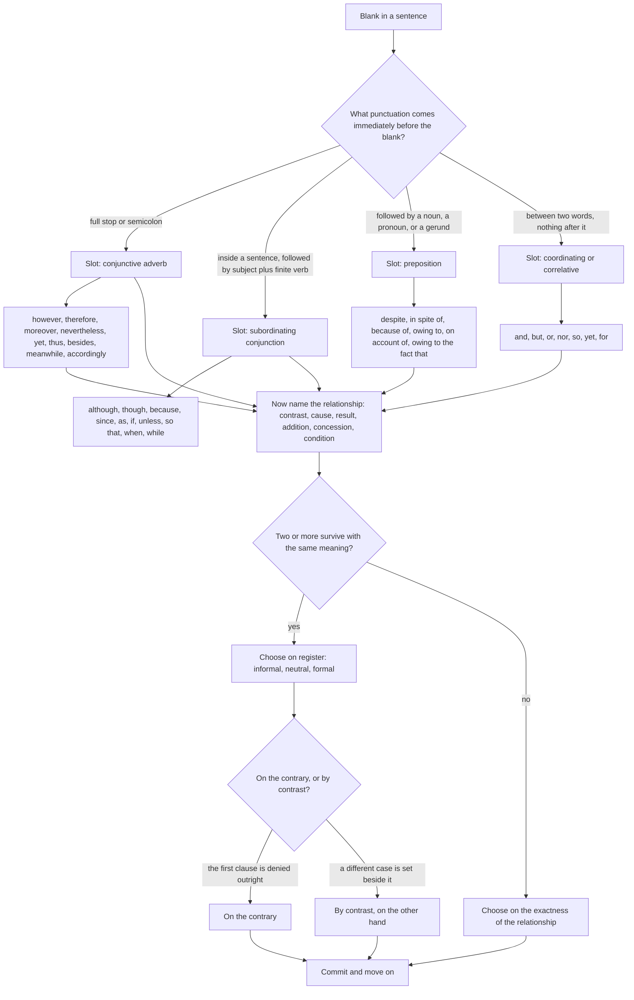

# Sentence Connectors

A connector is a word that tells the reader how two ideas relate. That is its whole job, and it is a bigger job than it looks: *however* and *therefore* carry no meaning of their own, and everything they do is derived from the relationship they signal. Get the relationship right and the connector is forced. Get it wrong and no amount of familiarity with the word will save you.

The method that follows from this is short: **identify the relationship before you look at the options.** Read the two halves of the sentence and ask the reader-facing question — does the second half *oppose* the first, *explain* it, *result* from it, *extend* it, *depend* on it? — and then choose a connector that answers exactly that question. Candidates who read the options first choose the word that looks most familiar, which is precisely the wrong criterion, because all the options look familiar.

There is a second filter, and it is the one candidates forget. **A connector's grammatical shape is determined by its position.** *However* and *therefore* are conjunctive adverbs: they need a full stop, a semicolon or a comma around them, and they can never join two parts of a single clause without help. *Although* and *because* are subordinators: they must be followed by a complete clause. *Despite* and *because of* are prepositions: they must be followed by a noun or a gerund. Choosing the right relationship and then the wrong shape loses the mark, and that happens more often than choosing the wrong relationship at all.

### 🟢 Lite — Quick Review (1h–1d)

**The six relationships, with the connectors that signal each.** Learn these as six families, not as a word list, because the families are what the question is really testing.

| Relationship | The reader's question | Connectors |
| --- | --- | --- |
| **Addition** | What else is true, or what more? | *and, also, besides, moreover, furthermore, in addition, what is more, as well as, likewise, similarly* |
| **Contrast** | Does the opposite hold? | *but, however, nevertheless, yet, on the other hand, by contrast, on the contrary, whereas, while* |
| **Concession** | What is admitted, but overridden? | *although, though, even though, even if, despite, in spite of, admittedly, granted, notwithstanding* |
| **Cause** | Why is this so? | *because, since, as, seeing that, given that, on account of the fact that, owing to the fact that, due to* |
| **Result** | What followed from this? | *so, therefore, thus, hence, consequently, accordingly, as a result, it follows that, in consequence* |
| **Condition** | On what terms? | *if, unless, provided that, as long as, in case, on condition that, in the event that, subject to* |

Contrast and concession are the pair that causes the most damage, so learn their difference now. **Contrast** says the second idea is simply incompatible with the first. **Concession** says the second idea is true but does not change the conclusion. *He was tired, but he worked* is contrast — working when tired is the opposite of resting. *Although he was tired, he worked* is concession — the tiredness is admitted, and the working happened anyway. The words are close enough to be confusing and the distinction is absolute.

**The placement rule, in one table.** This is the filter that settles most items.

| Shape | Needs | Examples |
| --- | --- | --- |
| **Conjunctive adverb** (connects two independent clauses) | a full stop or semicolon before it, a comma after it | *He was tired. **However**, he continued.* / *He was tired; **however**, he continued.* |
| **Subordinating conjunction** (opens a dependent clause) | a complete clause after it | *Although **it rained**, the match went ahead.* |
| **Preposition** (before a noun or gerund) | a noun phrase, never a clause | ***Despite the rain**, the match went ahead.* |
| **Coordinating conjunction** (joins like elements) | matching elements on both sides | *He read the paper **and** wrote a reply.* |
| **Correlative pair** | both halves present and parallel | ***Both** the cost **and** the delay were high.* |

**The punctuation slot tells you the connector class before you read the meaning.** This is the most useful single shortcut in the topic.

- **Blank at the start of a new sentence**, preceded by a full stop: a conjunctive adverb — *However, Therefore, Moreover, Nevertheless, Thus*.
- **Blank at the start of a new sentence**, preceded by a semicolon: also a conjunctive adverb, and this is the classic slot — *; however,* / *; therefore,* / *; nevertheless,* / *; besides,* / *; meanwhile.*
- **Blank in the middle of a sentence, followed by a subject and a finite verb**: a subordinating conjunction — *although it rained*, *because he left*, *if she comes*.
- **Blank followed by a noun, a pronoun, a gerund, or *the + noun***: a preposition or preposition-led phrase — *despite the rain*, *because of the delay*, *owing to the failure*, *in spite of the delay*.
- **Blank between two words with no clause or noun after it:** a coordinating conjunction or a correlative — *and, but, or, nor, so, yet, for, both … and*.

That last row is the reason *but* and *yet* sit on the border between two categories. *But* is a coordinating conjunction and takes no comma. *However* is a conjunctive adverb and does.

**The four-step method, applied to any item.**

1. **Locate the punctuation** and note whether the blank is sentence-initial, mid-sentence, or word-joining.
2. **Read both halves and name the relationship** in one or two words — contrast, cause, result, addition, concession, condition.
3. **Eliminate every connector of the wrong class** for that slot. This alone removes half the options.
4. **Choose between the survivors on register**, since the last two or three will express the same relationship and differ only in formality.

Step 4 is where the marks are. If three connectors all mean contrast, the question is not asking which one means contrast — it is asking which one fits the register of the sentence.

### 🟡 Standard — Regular Study (2d–2mo)

**The full inventory, organised by what each one actually does.**

**Addition — extending rather than contradicting.** *Moreover, Furthermore, In addition, Besides, What is more, Additionally, Likewise, Similarly, Equally, To begin with, Furthermore.* All of these add a second point of the same kind or a strengthening point. *Also* and *as well as* are the everyday members of the family; *moreover* and *furthermore* are their formal equivalents, and a formal stem usually wants the formal member. Note that *and* is the default addition connector, and in a formal sentence it is often replaced rather than kept.

**Contrast — the two ideas are incompatible.** *However, Nevertheless, Yet, On the other hand, By contrast, Conversely, On the contrary, Whereas, While, Instead, Rather, In contrast, Even so, That said.*

Two sub-divisions matter here. **Conjunctive adverbs** need punctuation: *however, nevertheless, yet, conversely, instead.* **Comparative connectors** take two like clauses: *whereas, while, unlike, compared with, rather than.* *On the contrary* and *by contrast* are not interchangeable with plain contrast: *on the contrary* denies the previous statement outright, while *by contrast* merely sets a different case beside it. If the first half says "he is not rich" and the second says "he is not poor either", that is *on the contrary*; if it says "she, on the other hand, owns a shop", that is *by contrast*.

**Concession — the point is admitted and overridden.** *Although, Though, Even though, Even if, While, Despite, In spite of, Notwithstanding, Granted, Admittedly, In any event, At any rate, Much as.*

The grammatical split inside this family is absolute and is the single most-tested fact in the topic:

| Takes a **clause** | Takes a **noun / gerund** |
| --- | --- |
| *although it rained* | *despite the rain* |
| *though he was tired* | *in spite of his tiredness* |
| *even though she objected* | *notwithstanding her objection* |
| *even if it rains* | — |

The error is always in the direction of mixing them: *"Despite it rained"* and *"Although the rain"* are both wrong, and both appear regularly as distractors. The fix is a one-second check: **after your chosen word, is there a subject and a finite verb, or not?**

**Cause and result — the pair that reverses cleanly.** *Because, Since, As, Given that, Seeing that, Now that* introduce a reason. *So, Therefore, Thus, Hence, Consequently, Accordingly, As a result, Accordingly* introduce a result. The test is positional: the reason follows *because*, the result follows *therefore*, and swapping them inverts the logic. A related trap is *since*, which is polysemous — it can be temporal ("since 1990") or causal ("since he was ill"). The verb form disambiguates: a perfect tense with a past participle points to a starting point in time, while a clause explaining the present situation points to cause.

**Condition.** *If, Unless, Provided that, Providing that, As long as, In case, In the event that, On condition that, Subject to, So far as, Insofar as.* The two to know cold are *unless*, which means **if not**, and *in case*, which means **just in case** and carries a sense of precaution rather than neutral condition. *"You will fail unless you revise"* = "if you do not revise". *"Take an umbrella in case it rains"* = take it in case it might, not because it will.

**Purpose — the family that is missing from most lists.** *So that, in order that, in order to, so as to, with a view to, with the object of, to the end that.* These are routinely omitted from connector lists and they are tested. *So that* is followed by **may / might / should / would + V1**; *in order to* is followed by the plain infinitive. *"He revised so that he **might** pass"* and *"He revised in order to pass"* — the two are equivalent and the modal is the tell.

**Reason and purpose, and the *so … that* structure.** *So* alone expresses result. *So … that* expresses degree. *"The exam was so difficult that most candidates left early."* A frequent item gives you *so* and asks whether it is followed by *that*; the answer is that result-*so* takes no *that*, degree-*so* requires it.

**Register: the ladder that decides the last two options.** Every relationship has a formal, a neutral and an informal member, and a formal sentence wants the formal one.

| Relationship | Informal | Neutral | Formal |
| --- | --- | --- | --- |
| Addition | *also, plus, anyway* | *and, besides* | *moreover, furthermore, in addition* |
| Contrast | *but, though* | *yet, however* | *nevertheless, nonetheless, by contrast, whereas* |
| Concession | *anyway* | *although, despite* | *notwithstanding, even though, in spite of* |
| Result | *so, that's why* | *thus, hence* | *consequently, accordingly, it follows that* |
| Condition | *if, in case* | *unless, provided that* | *provided that, in the event that, subject to* |

An item whose stem is written in a formal register will reject *but*, *so* and *plus* even when the meaning is exactly right. This is the same register principle that decides vocabulary items, and it operates identically here: **the last two survivors differ in register, not in meaning.**

**The connectors that take two halves.** Correlative pairs must be complete and parallel, and an incomplete one is an error rather than a stylistic choice.

- *Both the cost **and** the delay were high.* — two nouns, two nouns.
- *Either the manager **or** his assistants **will** attend.* — with *either/or* the verb agrees with the **nearest** subject.
- *Neither the cost **nor** the delay **was** acceptable.*
- *Not only did he pass, **but** he also topped the list.* — inversion is required after *not only* at the start.
- *The more you practise, **the** better you get.* — *the* … *the*, never *the more … the most*, and never *than*.
- *Sooner or later* and *whether or not* — both can be split or kept together, but the halves must match: *whether … or not*, not *whether … or*.
- *Such … that* and *so … that* — degree structures, both halves required.
- *Lest* — a rare and formal connector, always followed by **should / may / might + V1**, and never by *that*: *"She pressed her palms to her ears lest she **hear** the news."*

### 🔴 Extended — Deep Study (3mo+)

**The polysemous connectors, and how context disambiguates them.** A small group of words carries two, three or four meanings, and choosing the wrong one is the most sophisticated error in the topic. The disambiguation is always grammatical, never intuitive.

**While** — three functions.
- **Temporal:** *While he was cooking, the phone rang.* Both clauses describe overlapping time. The key is that the *while*-clause is normally an extended one with a continuous verb.
- **Concessive:** *While he admitted the error, he refused to apologise.* The clause is a complete admission that does not change the main assertion.
- **Comparative contrast:** *She reads novels, while her brother reads only reports.* Two present-tense clauses with the same structure, compared side by side. In this use *whereas* is a formal alternative and is often preferred in writing.
- The disambiguator: if the *while*-clause's tense is a long past continuous and the main clause's is a single event, it is temporal. If both clauses have the same tense and describe standing facts, it is contrast.

**As** — four functions.
- **Reason:** *As it was getting late, we left.* ≈ *because*.
- **Time:** *As the years passed, the village shrank.* ≈ *while*, but with the earlier of two events.
- **Manner:** *She sang as if she meant it.* / *He behaved as though he owned the place.* Note that *as if* and *as though* take the **subjunctive** — a past-tense form for an unreal situation.
- **Role or capacity:** *He works as a systems analyst.*
- The disambiguator: *because* may be moved and removed, *while* cannot; *as* in manner is always followed by a verb phrase with a comparative or by *if/though*.

**So** — three functions.
- **Result:** *He was ill, so he stayed home.* A coordinating conjunction; no comma normally.
- **Degree:** *It was so cold that the pipes froze.* Requires *that*.
- **Conjunctive adverb:** *He was late. So, he missed the train.* Rare and informal.
- The disambiguator: does a *that*-clause follow? If yes, it is degree.

**Since** — two functions, plus a third that appears mainly in formal legal prose.
- **Time:** *She has worked here since 2015.* A perfect tense with a point in time.
- **Cause:** *Since you insist, I will agree.* A full clause explaining the present decision.
- **In the sense of "considering":** *Since the report is the only record, it must be preserved.* Formal, and increasingly used in written English to avoid *as*.
- The disambiguator: does the phrase after *since* name a point in time or a clause? A point in time is temporal; a clause is causal.

**It** — the connector that is not a connector, and the most under-examined item in this family.
- *It is clear that the policy failed.* The anticipatory *it*, standing for the coming clause.
- *It is raining.* The dummy *it*, standing for the weather.
- *It was the chairman who resigned.* The emphatic *it*, standing for the subject.
- *It is no use crying over spilled milk.* Fixed idiomatic pattern.
- The disambiguator: replace the *it*-clause with the clause itself. *It is obvious that he lied* → *"That he lied is obvious"* works. *It is that he lied* works. In the emphatic use, *It was the chairman who resigned* → *"The chairman was the one who resigned"*, which changes the emphasis. The rule is that the anticipatory *it* can always be removed, and the emphatic *it* cannot.

**How connectors do double duty in comprehension and rearrangement.** Connector knowledge is not confined to the fill-in-the-blank item, and treating it as a single-topic skill wastes most of its value.

**In a rearrangement item**, the connectors are structural evidence about the original order. *However, Moreover, Nevertheless, Therefore, In contrast* all point backwards to something already said. A sentence opening *However,* cannot be first, and a sentence opening *Moreover* must come after a sentence that has already made a point. Marking the connector on every sentence of a jumbled set is often faster than reading for content, because connector evidence is unambiguous where content evidence requires interpretation.

**In a comprehension passage**, the connectors mark the author's argumentative moves, and questions about the author's view are usually answerable once the moves are located. A passage with four *however* and one *therefore* is arguing four objections and one conclusion. A passage dense with *therefore, consequently, thus* is building a causal chain. Knowing which connectors are present tells you the shape of the argument before you understand a word of its content.

**A systematic elimination routine that beats reading the options.** Fill-in-the-blank connector items are solved faster by process than by judgement.

1. **Circle the punctuation immediately before the blank.** Full stop, semicolon, or nothing.
2. **Write the relationship in one word.** This is the only judgement call in the routine.
3. **Cross out every option that cannot occupy that slot.** If the blank is sentence-initial after a semicolon, *because*, *although*, *if* and *despite* are all eliminated on grammar alone, whatever they mean.
4. **Only now read the meaning of the survivors.** You will have two or three left, and they will express the same relationship in different registers.
5. **Choose on register, and on the exactness of the relationship.** If *however* and *on the contrary* both survive, ask whether the first clause is being denied or merely set aside.

Step 3 is the one candidates skip, and skipping it is why they get stuck: without it you are comparing five words when you should be comparing two.

**A twenty-minute drill.**

1. **Five minutes** — write the six-relationship table from memory, with five connectors per row. This is the one thing that must be automatic.
2. **Five minutes** — for ten sentences containing a blank, identify the **slot type** only. Do not try to solve them. *Sentence-initial after a semicolon*, *mid-sentence before a subject*, *before a gerund.* Speed matters here; the classification is a mechanical skill.
3. **Five minutes** — now solve the same ten, writing the relationship word before each answer.
4. **Five minutes** — rewrite five of them using a different connector of the same relationship but a different register. This is the only practice that makes the register ladder usable, because it forces you to hold the relationship constant and vary only the register.

Step 4 is what separates a candidate who knows the words from one who can use them, and it is also the skill that shows up in the written component, where cohesion is judged directly.

### 🧠 Memory Anchors

- **"Relationship first, word second."** Name the logical link in one word before you read a single option. This is the whole method.
- **"The punctuation tells you the class."** Semicolon or full stop before the blank means conjunctive adverb; subject-and-verb after it means subordinator; noun or gerund after it means preposition.
- **"Clause for although, noun for despite."** After *although* there must be someone doing something. After *despite* there must be a thing. This is the most-tested split in the topic.
- **"Contrast refuses; concession admits."** *But* says the two cannot both hold. *Although* says the first is true and does not matter.
- **"Reason follows because, result follows therefore."** The two never swap, and swapping them reverses the logic of the argument.
- **"The last two options differ in register, not meaning."** If three connectors all mean contrast, the question is a register question. Pick the formal one for a formal stem.
- **"*Lest* takes should, and never *that*."** The rarest connector in the list and the easiest to fix once known.
- **Flashcard Q&A:**
  - *Slot: after a semicolon, meaning "nevertheless".* → **;** however**, / ;** nevertheless **,** — a conjunctive adverb with one comma after it.
  - *Fill in: "___ he was warned, he returned."* → **Although / Though**. A clause follows, so a subordinator is required.
  - *Fill in: "___ being warned, he returned."* → **Despite**. A gerund follows, so a preposition is required.
  - *Fill in: "He revised ___ he might pass."* → **so that**. A modal follows, which is the signature of the purpose connector.
  - *What does "on the contrary" do that "by contrast" does not?* → It **denies** the previous statement; *by contrast* only sets a different case beside it.
  - *In "It is obvious that he lied", can the "it" be removed?* → **Yes** — that marks it as the anticipatory *it*, which can always be dropped.

### 🎯 Exam Traps & Error Log

1. **Choosing the connector you recognise rather than the one that fits.** Familiarity is not relevance, and all four options will be familiar words.
2. **Ignoring the punctuation slot.** Selecting *because* or *although* for a blank that sits after a semicolon is wrong on grammar, however perfect the meaning.
3. **Mixing *although* and *despite*.** *"Despite it rained"* and *"Although the rain"* are both wrong. After *despite* there must be a noun or gerund; after *although* there must be a clause.
4. **Swapping cause and result.** *Because* introduces the reason and *therefore* the outcome. A candidate who reads quickly puts *therefore* in a cause slot, and the sentence then says the opposite of what the stem means.
5. **Using *since* in the wrong sense.** *Since* is either temporal or causal, and the disambiguator is whether a point in time or a clause follows it.
6. **Confusing *on the contrary* with *on the other hand*.** *On the contrary* denies what was said; *on the other hand* adds a contrasting consideration.
7. **Leaving out half a correlative pair.** *Both the cost and the delay*, *not only … but also*, *either … or*. A missing half is an error, not a stylistic choice.
8. **Picking the informal member of a relationship.** *But*, *so* and *plus* are wrong in a formal stem even when the logic is exact.
9. **Treating *unless* as a synonym for *if*.** *Unless* means **if not**, and a sentence that is not negative in meaning will not accept it.
10. **Confusing result-*so* with degree-*so … that*.** *"So he was late that he missed the bus"* and *"He was late so that he missed the bus"* use the same two words for two different relations.
11. **Omitting *that* after *so that*, *such … that*, or *in order that*.** The conjunction is incomplete without it.
12. **Reading only the connector and never the clauses.** The connector's job is to name a relationship; if you have not checked that the relationship actually exists between these two specific ideas, you are guessing.

### 🧪 Self-Test — 8 Questions with Worked Answers

Work these on paper before reading the solutions. Each is built on one of the failure modes above.

1. **Fill in the blank: "He had submitted all the required documents; ________, his application was rejected without explanation."**
   *Options: therefore, although, however, because.* The semicolon puts the blank in the **conjunctive-adverb slot**, which rules out *although* and *because* on grammar alone — neither can stand after a semicolon opening a clause. That leaves *therefore* and *however*. The relationship is opposition: a complete application met rejection, which is not a smooth causal result, so *therefore* is wrong. **However** is the answer, and the finished sentence is *"He had submitted all the required documents; however, his application was rejected without explanation."* The item is a two-stage test — slot first, relationship second — and the *although* distractor exists to catch candidates who answer on meaning alone.

2. **Fill in the blank: "________ the heavy snowfall, the airport remained operational."**
   *Options: Although / Despite / However / Because.* The word after the blank is **the heavy snowfall** — a noun phrase, with no subject and no verb. That single observation eliminates three of the four options: *although* needs a clause, *however* needs a semicolon or a full stop before it, and *because* likewise needs a clause. **Despite** is the only connector that can stand directly before a noun phrase. A useful generalisation: **if the word immediately after the blank is a noun, a pronoun or a gerund, the connector is a preposition**, and the preposition family here is *despite, in spite of, because of, owing to, on account of*.

3. **Fill in the blank: "She revised for months; ________, she finished second."**
   *Options: therefore / however / besides / because.* All three semicolon-valid connectors are possible on grammar, so the relationship decides. *Therefore* is a result, and finishing second does not follow naturally from revising. *Besides* adds, and there is no additional point being added. The relationship is opposition between sustained effort and a disappointing outcome, so the answer is **however**. *Nevertheless* and *yet* would be equally defensible if offered, which is the standard examiner's move: when several connectors express the right relationship, the item is usually also testing register, and in a formal sentence the safest choice is the most formal survivor.

4. **Choose the correct sentence.**
   (a) Despite the door was locked, he entered.
   (b) Although the door was locked, he entered.
   (c) However the door was locked, he entered.
   (d) Because of the door was locked, he entered.
   **(b) is correct.** *Although* takes the clause *the door was locked*, which is exactly what follows the blank. (a) mixes the preposition *despite* with a clause, and *despite of* would be needed before a bare noun. (c) uses the conjunctive adverb *however* in a subordinator's slot, and as an adverb it needs punctuation on both sides. (d) pairs the preposition *because of* with a clause; the noun-taking form would be *because of **the** locked door*. The whole item is decided by the shape of the words that follow the blank, not by the meaning.

5. **Fill in the blank: "The scheme was expensive; ________, it was introduced."**
   *Options: nevertheless / therefore / moreover / because.* This is the same shape as item one and the test is whether you learned the method or only the answer. The semicolon forces a conjunctive adverb, which rules out *because*. *Moreover* adds a point, and there is no second point. *Therefore* claims the expense caused the introduction, which the sentence does not say. The relationship is that the cost was admitted but did not prevent the introduction — **nevertheless**. The contrast with item one, where *however* was right and *therefore* wrong, is the point of the pair: identical structure, different relationship, different answer.

6. **What is the error in: "Not only he passed the examination, but he also secured the first division."**
   The error is **the missing inversion after *not only***. When *not only* opens a sentence, the first auxiliary must come before the subject, and there is an additional *-s* on the verb because the subject is singular. The corrected sentence is: **"Not only did he pass the examination, but he also secured the first division."** Two changes, and both are required. The same inversion rule covers *never, seldom, rarely, hardly, scarcely, little, nor* at the start of a sentence. A common near-miss answer changes the tense but keeps the word order, which gets the *-s* right and the inversion wrong.

7. **Replace the underlined word with the right connector: "He was the best player in the tournament; ______, the team lost the final."**
   *Options: nevertheless / consequently / moreover / therefore.* Four connectors, three of which point in a forward direction. *Consequently*, *therefore* and *moreover* all treat the second clause as following from the first, and none fits, because losing the final does not follow logically from having the best player. **Nevertheless** concedes the first point and overrides it, which is the only relationship the sentence actually expresses. The general lesson: **check the direction of the logic before the strength of the logic.** A sentence full of *therefore* and *consequently* is building a chain; the instant a result contradicts the premise, the connective must be concessive.

8. **Rewrite this using a formal connector: "The report is old. However, its data are still useful."**
   A correct formal rewrite is: **"Although the report is old, its data are still useful."** The formal member of the concessive family is *although* used as a subordinator, and using it lets the two ideas sit in a single sentence rather than two. Other acceptable answers: *"Though the report is old, its data are still useful"*; *"Notwithstanding the report's age, its data are still useful"*; *"While the report is old, its data are still useful."* The item tests the register ladder in the direction that matters in the writing component, where cohesion is judged and the everyday *however* reads as informal in an extended argument. Note also that this rewrite changes the punctuation as well as the word, which is the point of the placement rule.

### 💡 Pro Tips

1. **Name the relationship in one word before you look at the options.** One second of labelling removes most of the guesswork and is the single highest-value habit in the topic.
2. **Read the punctuation before the meaning.** A semicolon or full stop before the blank settles the connector's grammatical class on its own, and that is a free elimination of two or three options.
3. **Look at the word immediately after the blank.** If it is a noun or a gerund, the answer is a preposition — *despite, in spite of, because of*. If it is a subject and a verb, the answer is a subordinator. This check takes one second and it is decisive.
4. **Keep the clause-and-noun contrast as two solid lines.** *Although he left* against *despite his departure*. One memorised pair fixes a whole family of items.
5. **When several options mean the same thing, choose the register.** Three contrast options survive on meaning in about one item in five, and the stem's formality is the only remaining discriminator.
6. **Read a passage and mark every connector before answering anything.** The connectors give you the argument's shape, and a question about the author's view is usually a question about that shape. This is the cheapest possible use of the skill in a comprehension section.
7. **Use connectors in the same way when you write.** A paragraph whose links are *however, therefore, moreover* is a paragraph that is easy to mark. Vary the connectors and vary their position, and the cohesion is visible.
8. **Rewrite your own sentences with a different register.** The practice that makes the register ladder usable is changing *however* to *notwithstanding* and *but* to *although* in sentences you wrote yourself, because then the relationship stays fixed and only the register moves.

---

## Continue your study

- **[View this topic in your CUET UG roadmap](/roadmap/?exam=cuet&duration=1mo)** — see where "Sentence Connectors" fits in your personalised plan
- **[Build a quick revision plan](/roadmap/?exam=cuet&duration=1d)** — 1-day sprint covering highest-weight topics
- **[CUET UG exam overview](/exams/cuet/)** — pattern, eligibility, and syllabus
- **[All English notes](/notes/cuet/english/)** — browse sibling topics in this subject

---
*Content adapted based on your selected roadmap duration. Switch tiers using the selector above.*
