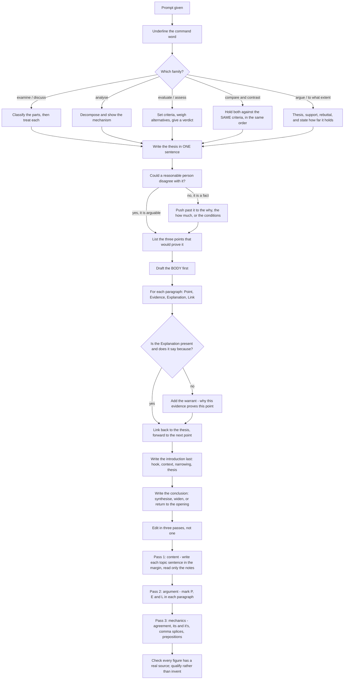

# Essay Writing

An essay task is not a memory test. Nobody is marking whether you can list a policy's launch date or reproduce a statistic. What is being assessed is whether you can **hold a position in writing, organise material around it, and express it accurately** — and those four things are learnable in a way that recalled facts are not.

That matters for how you should prepare. An essay does not improve by memorising more content; it improves by removing the mechanical problems that stop a competent argument from reading as a competent argument. The overwhelming majority of lost marks come from a handful of structural faults: a thesis that cannot be argued against, paragraphs that state a point and never develop it, transitions that announce instead of connect, and a conclusion that stops one sentence after the introduction. Each of those is a habit rather than a knowledge gap, and habits are fixable in a fortnight of deliberate practice.

The other durable fact is that **specific rubrics vary and are not something you should try to game.** Different examining bodies describe different performance bands, weight them differently, and publish them in their own official notification. Trying to write to a percentage breakdown you have heard second-hand is both unreliable and counterproductive, because it tempts you to pad. What is stable across every version of the task is the underlying set of qualities: a clear and defensible central claim, material organised so that each part advances that claim, support that is relevant and honestly presented, and language that is accurate and controlled. Write to those, and you are writing to whatever rubric the actual paper uses.

### 🟢 Lite — Quick Review (1h–1d)

**The order of operations.** Almost every weak essay is weak because it was drafted instead of planned. Use a proportional budget of roughly **one part planning, three parts drafting, one part editing** — if you have any length of time at all, spend the first tenth of it on an outline.

1. **Read the prompt twice and underline the command word.** *Examine, evaluate, analyse, discuss, compare and contrast, argue, to what extent, critically assess* — these ask for different things and mistaking one for another is the single most expensive error in the topic.
2. **Write the thesis in one sentence, before anything else.** Not the introduction — the thesis. If you cannot write it in one sentence, you do not yet know what the essay argues.
3. **List the points that would prove it.** Three is enough. More than three and you will not develop any of them.
4. **Draft the body before the introduction.** Body paragraphs teach you what your introduction needs to say; drafting the introduction first means writing it twice.
5. **Write the introduction last.** It becomes a funnel: a hook, a narrowing of scope, and the thesis.
6. **Edit with a checklist, not by re-reading.** Re-reading finds nothing. A checklist finds things.

**The four-move body paragraph.** This structure is the highest-yield thing in the topic, because it converts a vague instruction to "add more" into four specific slots.

| Move | The job | The test |
| --- | --- | --- |
| **Point** | One sentence stating what this paragraph will argue | Is it a claim, or is it a heading? "There are many causes" is a heading. "The cost of that delay fell hardest on small manufacturers" is a claim. |
| **Evidence** | A concrete instance: an example, a case, a documented fact you actually know | Is it specific enough that a reader could check it? |
| **Explanation** | The part that earns the mark — why the evidence proves the point | Does it say *because*, or does it merely restate? |
| **Link** | Tie back to the thesis and forward to the next paragraph | Does it move the argument, or just announce the next topic? |

The **Explanation** move is the one candidates skip, and it is the one that separates a competent paragraph from a list of assertions. Evidence without explanation is decoration. If you cannot write two or three sentences connecting your evidence to your claim, you do not yet understand the evidence, and the reader cannot tell the difference between not understanding it and not explaining it.

**The register swaps that make prose sound written rather than spoken.** These are free marks. Each pair is a real rewrite, not a synonym hunt.

| Spoken or padded | Written or analytical |
| --- | --- |
| "A lot of people think that…" | "A substantial body of research argues that…" |
| "Nowadays everyone…" | "Across much of the contemporary period…" |
| "It is kind of obvious that…" | "The available evidence indicates that…" |
| "This shows that…" | "This pattern demonstrates that…" |
| "To sum up everything…" | "Taken together, these factors suggest that…" |
| "Very, very important" | One precise adjective, or none |
| "The government did a lot of things" | "The government introduced three specific measures" |
| "You can't just ignore this" | "This consideration cannot be set aside" |
| "So basically" | Delete it; it carries no content |
| "I think" | Delete it; the essay's voice is not the writer's opinion |

**The three-command-word families, and what each obliges you to do.**

| Command word | What the examiner wants | Structural obligation |
| --- | --- | --- |
| **Examine / discuss / explain** | An account that covers the main parts | Classification, then a part-by-part treatment |
| **Analyse** | The parts *and* how they relate | Decomposition and the mechanism connecting them |
| **Evaluate / critically assess** | A judgement, weighed against alternatives | Criteria, then a verdict, with the counter-case acknowledged |
| **Compare and contrast** | The two things held up against each other | Both treated on the *same* criteria, in the same order, throughout |
| **Argue / to what extent** | A defended position with a limit | Thesis, support, rebuttal, and an honest statement of how far it holds |

If the prompt says *to what extent*, your essay must end by saying **how far**, not simply *that*. A "to what extent" essay with no concession in it has answered a different question.

### 🟡 Standard — Regular Study (2d–2mo)

**Building a thesis that can actually be argued.** A thesis must be a claim, a claim must be arguable, and a claim that nobody could disagree with is not a thesis at all.

- **Not a thesis — an uncontestable fact:** "Climate change is altering rainfall patterns." Nobody disagrees, so there is nothing to argue.
- **Not a thesis — a topic statement:** "Artificial intelligence has both advantages and disadvantages in education." This only announces a debate; it takes no side, so the essay has no direction.
- **A thesis — a defended position with a scope:** "The benefits of AI-assisted tutoring depend less on the technology than on whether schools can afford the training that makes it work."

The third version is arguable, specific, and already contains the qualifications a good essay will develop. A useful test: **could a reasonable person disagree with this sentence?** If not, it is a fact, and you need to push past it to the claim beneath it. The claim beneath a fact is almost always a *why*, a *how much*, or a *under what conditions*.

**The introduction as a funnel.** Four moves, in order, about four sentences long.

1. **The hook** — a concrete instance, a quotation, a piece of data, or a short problem. Not a dictionary definition, and not "Since time immemorial".
2. **The context** — one or two sentences placing the topic in a frame, showing that it is a live question rather than a settled one.
3. **The narrowing** — a sentence that identifies which dimension of the topic you are addressing, and why it is the interesting one.
4. **The thesis** — the last sentence, unambiguous and arguable.

A weak introduction opens with a generality and reaches the thesis at the last moment. A strong one makes the reader see the problem in the first two sentences and states the position in the last.

**The conclusion: three jobs, and only one of them is restatement.** A conclusion should do at least two of the following.

- **Synthesise** — say what the parts together add up to, in a sentence that could not have been written before the essay was written. This is the difference between a summary and a conclusion.
- **Widen** — move to the broader implication or the question left open. *"What this analysis leaves unresolved is whether the same pattern holds outside metropolitan districts."*
- **Return to the opening** — close the circle deliberately, showing the argument has moved. If you opened with an image or example, ending by re-reading it in light of what you have argued is the strongest available move.

The conclusion that fails most often is the one that stops. *"In conclusion, education is important in today's society."* This adds nothing, repeats the topic, and leaves the essay feeling unfinished. The test is simple: **if your final sentence could be the first sentence of a different essay on the same subject, it is not a conclusion.**

**Discourse signposting, and how to avoid sounding like a robot.** Signposts are necessary, but a paragraph that opens *Furthermore, it is also important to note that* has already wasted a clause. Use one signpost per logical move, at a position where it carries information, and vary the position.

| Purpose | Markers | Where to put it |
| --- | --- | --- |
| Contrast | *By contrast, Conversely, Whereas, On the other hand* | Between the two claims being contrasted |
| Addition | *Moreover, Furthermore, In addition, Notably* | Where the new point genuinely extends the last |
| Concession | *Admittedly, Granted, While this is true* | Opening the counter-argument paragraph |
| Inference | *Consequently, It follows that, Hence* | After the explanation, before the link |
| Emphasis of a limit | *Even so, To that extent, In this respect* | Where you are narrowing your own claim |
| Illustration | *As… illustrates, A case in point is* | Before the specific instance |

The most effective signposts are the ones that carry argument in their own right. *"A case in point is the 2019 revision of the syllabus"* tells the reader what kind of evidence follows. *"Furthermore"* tells them nothing except that you have run out of ideas for transitions.

**Cohesion and coherence: they are not the same, and markers notice.** **Cohesion** is the surface linking — pronouns with clear antecedents, repeated key terms, connectives that signal relation. It is mechanical, and it is what many candidates aim for. **Coherence** is the underlying logic — the sense that the essay is one argument rather than four paragraphs filed next to each other. You can achieve perfect cohesion and zero coherence: a paragraph full of beautiful transitions that advances nothing. Coherence comes from the *link* move at the end of every paragraph, and from every paragraph genuinely advancing the thesis rather than merely discussing a related subject.

**Sentence-level craft: the three adjustments that most improve prose.** These work at the level of a single sentence and can be practised anywhere.

- **Vary length deliberately.** A paragraph of uniform fifteen-word sentences reads as monotonous and slightly mechanical. Combine a short sentence with a longer one: *"The scheme failed. It failed for a reason that had nothing to do with money."* The second sentence is a refinement of the first, and the length change carries the emphasis.
- **Prefer the active voice for the actor and the passive for the unknown.** *"The Supreme Court struck down the notification"* tells the reader who acted. *"The notification was struck down"* withholds the actor, which is appropriate only when the actor is genuinely the point. A paragraph of passive constructions makes the reader work to find out who is doing anything.
- **Cut the adverb before cutting the noun.** In almost every weak sentence the problem is a hedging adverb or a vague verb. *Significantly improved* becomes *improved*. *Made a decision* becomes *decided*. *Gave consideration to* becomes *considered*. The single biggest improvement available to most writers is deleting the words that describe the degree of something instead of the thing.

**Handling a prompt you disagree with.** You are not required to like the topic, and arguing badly against a position is as visible as arguing badly for one. The workable approach is to take the strongest charitable version of the other side, state it in its best form, and then explain why your own position is stronger on some specified criterion. This is not only more persuasive; it is also the most efficient way to build material, because the counter-argument tells you exactly what your essay must answer.

### 🔴 Extended — Deep Study (3mo+)

**The Toulmin model, and what it actually buys you.** Argument theory gives you a vocabulary for the moves you are already making, and the vocabulary is useful because it tells you which move is missing.

- **Claim** — the assertion you are defending.
- **Grounds** (or data) — the evidence you put forward.
- **Warrant** — the bridge between them. The most commonly skipped element and the most important, because it is where you state *why* this evidence supports this claim.
- **Backing** — the further justification that the warrant is sound.
- **Qualifier** — the conditions under which your claim holds. Every honest claim has one.
- **Rebuttal** — the strongest objection, and your response to it.

The two that candidates never write are the **warrant** and the **qualifier**, and they are the two that most improve an essay. The warrant is the sentence "this example shows X because it shares the causal feature Y, which the other examples lack". The qualifier is the sentence "this holds in cases such as these, though not where Z is different". Writing both turns a list of examples into an argument, and it is also what stops an essay from being refuted by the first counter-example a reader thinks of.

**Paragraph-level diagnostics.** When a paragraph is weak, do not rewrite it — diagnose it, because the weakness is almost always in one of five specific places.

1. **No claim.** The paragraph is about a subject rather than making a point. Fix: write a topic sentence that someone could disagree with.
2. **Claim, no evidence.** The paragraph asserts and moves on. Fix: add one concrete, checkable instance.
3. **Evidence, no explanation.** The paragraph describes an example and never says what it proves. Fix: add the causal bridge — the warrant.
4. **No link.** The paragraph is self-contained and the essay reads as a list. Fix: end it by tying back to the thesis and forward to the next claim.
5. **The wrong claim.** The paragraph is a good paragraph about a point that does not advance the thesis. Fix: change the point, not the writing. This is the hardest fault to see, because the prose is fine.

As a rule, if a paragraph is well written and irrelevant, the problem is the fifth one. A well-written paragraph proves a point nobody asked about, and no amount of editing will fix it.

**Evidence, honestly used.** This deserves stating directly, because the temptation to manufacture a statistic is strong and the cost of doing it is severe. A fabricated figure in a written answer is not a stylistic weakness; it is a factual error, and it is the fastest way to lose credibility on the rest of the essay. The durable practice is:

- **Use what you actually know to be true**, and attribute honestly with the kind of source rather than a date you are unsure of. *"Contemporary research on adolescent sleep"* is an honest attribution. A specific percentage attributed to a specific unnamed study is not.
- **Prefer a concrete case you understand** over a statistic you half-remember. If you can say why the case is typical and what makes it informative, it does more work than a number would.
- **Never quote a number you cannot place.** If you cannot name where it comes from, do not use it. A paragraph built on an example you understand is stronger than a paragraph built on a figure you invented.
- **Qualify rather than fabricate.** If you are unsure of a magnitude, write "a substantial share" or "a marked increase" — and then make sure the surrounding argument does not depend on the precise figure.

**Managing a word limit.** Two techniques do most of the work. First, **write the thesis, the three body topics, and the conclusion as four lines before you start**, and treat those lines as the fixed skeleton — every sentence you add must attach to one of them, and anything that attaches to none of them is cut. Second, **cut in a fixed order when you are over**: adjectives before adverbs, before repeated examples, before the second sentence of any pair making the same point, before the sentence that restates what the previous one said. Cutting a *second* example is cheaper than cutting a *first* one, and cutting a qualifying clause is usually wrong.

**A fast, structured edit.** Re-reading an essay finds almost nothing, because the writer reads what they meant rather than what they wrote. Use three passes instead, each with one question.

- **Pass one, content.** For each paragraph, write the topic sentence in the margin. If any paragraph's margin note does not advance the thesis, that paragraph is either irrelevant or badly placed. Read only the margin notes — if they do not form a coherent outline on their own, the essay's structure is the problem and no sentence-level editing will save it.
- **Pass two, argument.** For each paragraph, mark P, E and L. Any paragraph missing an **Explanation** mark is underdeveloped, and that is where the marks are.
- **Pass three, mechanics.** Now, and only now, read the sentences. Look for the specific, named faults: subject–verb agreement across a long subject, an *its*/*it's* confusion, a comma splice, a *because of* in front of a clause, a superlative doubling a comparative, a sentence that could be thirty words shorter.

Three passes, three questions, and the third pass is the one that should take the least time. Doing them in the wrong order is why so many candidates spend their editing time hunting commas in an essay whose argument does not hold together.

**How the objective paper and the written task connect.** Even where a paper is set as multiple choice, the underlying skills are the same ones this topic teaches. Paragraph-level organisation shows up in questions about what a paragraph is chiefly concerned with, and the structure of an argument shows up in questions about a writer's stance and about the function of a transition. Practising the written task is therefore not only preparation for the written task; it is the most direct way to improve the objective questions, because it makes argument structure visible rather than something you feel without being able to name.

### 🧠 Memory Anchors

- **"Could someone disagree with it?"** If not, it is a fact and there is no essay in it. The claim is always one level below the fact.
- **"Draft the body before the introduction."** The introduction is a summary of an argument you have not made yet, so writing it first means writing it twice.
- **"Explanation is the mark."** Point, evidence and link are structural; explanation is intellectual. It is the part that shows you understood the evidence rather than found it.
- **"Claim, evidence, no explanation is a list."** If the paragraph never says *because*, the reader learns nothing from your example.
- **"*To what extent* must end with an extent."** A concession is not optional in that genre; it is the question being asked.
- **"Edit by margin notes."** Write each paragraph's claim in the margin and read only those. If the notes do not form an outline, the structure is broken and no comma-fixing will help.
- **"Never invent a figure."** Use a case you understand and attribute honestly by kind rather than by date. A fabricated number costs more credibility than it buys.
- **"Cut adjectives, then adverbs, then the second example."** A fixed cutting order saves you from making every deletion decision from scratch.
- **Flashcard Q&A:**
  - *Is "Artificial intelligence has advantages and disadvantages in education" a thesis?* → **No.** It takes no side, so it gives the essay no direction.
  - *Why write the introduction last?* → Because you cannot summarise an argument you have not yet made; the thesis should emerge from the body.
  - *What is the "warrant" in a paragraph?* → The bridge that says **why** the evidence proves the claim. It is the sentence candidates omit.
  - *My conclusion is "In conclusion, education is important today." What is wrong?* → It adds nothing, restates the topic, and could open a different essay on the same subject.
  - *A paragraph is well written but irrelevant. What do I fix?* → The **point**, not the prose. Fault type five: a good paragraph proving a claim nobody asked about.
  - *How do I use evidence when I am unsure of a statistic?* → Qualify honestly — "a marked increase" — and make sure the argument does not depend on the precise figure.

### 🎯 Exam Traps & Error Log

1. **Writing the introduction first.** It becomes a preamble to an argument you have not yet made, and it is usually the part you rewrite.
2. **A thesis that is a fact.** Nobody can dispute that change is happening, so there is nothing to argue and nothing to prove.
3. **A thesis that is a topic.** "There are advantages and disadvantages" announces a debate without entering it, leaving the essay with no position to defend.
4. **Writing the conclusion as a restatement and stopping.** One sentence after the introduction, the essay ends without having said anything the introduction did not.
5. **Paragraphs with a point and no explanation.** The most common structural fault. Evidence without analysis is decoration, and markers read the analysis.
6. **Paragraphs that are well written and irrelevant.** Diagnosing this is hard because the prose gives no signal. Check the margin note against the thesis, not the sentence quality.
7. **Padding with empty intensifiers.** *"This is a very important and highly significant development."* Enlarging an adjective adds no content and is visible as a symptom of having none.
8. **Over-signposting.** *Furthermore, it is also important to note that, additionally* uses a clause to say nothing. One signpost per logical move, placed where it carries information.
9. **Inventing or misremembering a statistic.** A fabricated figure is a factual error, and it discredits the rest of the essay along with it.
10. **Missing the command word.** Writing an *examine* essay that argues, or a *to what extent* essay that ends with an unqualified yes, has answered a question that was not asked.
11. **The comma splice.** Two independent clauses joined by a comma with no conjunction. It is the commonest mechanical fault in otherwise competent prose, and it appears three or four times in an average weak essay.
12. **Subject–verb agreement lost across a long subject.** *"The range of opinions expressed at the consultation were wide."* This is the error from the grammar topics showing up where it costs marks, in the sentence the marker reads last and most attentively.

### 🧪 Self-Test — 8 Questions with Worked Answers

These are diagnostic tasks rather than multiple-choice items, because that is what the writing section is. Attempt each one on paper before reading the analysis.

1. **This thesis is too weak to argue: "Social media has changed how young people communicate." Rewrite it.**
   The diagnosis is that the original is a **fact with no position in it** — nobody thinks communication is unchanged. The fix is to push down to the layer where a claim lives: a *why*, a *how much*, or an *under what conditions*. A rewritten version: *"While social media has increased the volume of communication among young people, it has narrowed the range of relationships in which that communication feels obligatory — a trade-off that policy responses have largely ignored."* Three things changed: the writer took a position, a *while* structure was introduced so the claim has a limit, and the thesis now points at something that can be argued and developed. The test of a good rewrite is the disagreement question: could a reasonable person disagree with the new version? They could.

2. **Diagnose this paragraph: "Clean water is important for health. Many people do not have access to clean water. Water-borne disease affects millions of people every year. Access to clean water must be improved."**
   Run the five-point diagnostic. There is **no claim** (fault one): the paragraph is *about* clean water rather than arguing anything about it. There is no specific evidence (fault two): "millions of people" is a vagueness, not a case, and it is the kind of figure a marker will notice as unplaced. There is no explanation (fault three): nothing says *why* improved access produces better health outcomes. And there is no link (fault four): the paragraph does not connect to any thesis. A repaired version: *"The health returns from piped water exceed its cost, which is why investment in supply is the highest-yield intervention available to district governments.* **Evidence:** households in regions where pipelines reached within the previous decade reported a marked fall in reported diarrhoeal illness relative to matched households without supply. **Explanation:** the return is high because the benefit accrues daily and the capital cost is one-off, so the intervention repays its cost within a period shorter than a single budget cycle. **Link:** this arithmetic strengthens the case for prioritising network expansion over point-of-use treatment."* The paragraph went from a statement of the obvious to an argument.

3. **Rewrite this in academic register: "You can't just ignore the fact that a lot of people can't get to a hospital."**
   Two faults, one register and one structure. The spoken hedges — *just, a lot of, can't* — are removed, and the repeated second person is eliminated in favour of a stated proposition. A rewritten version: *"The geographic distance between a substantial share of the population and the nearest functional health facility cannot be disregarded in the design of primary care delivery."* The rewrite is not longer-winded for its own sake; each added word is doing a job. *Cannot be disregarded* replaces *you can't just ignore*, *a substantial share of the population* replaces *a lot of people*, and *the nearest functional health facility* replaces *a hospital* — which also fixes a small accuracy problem, since not every building called a hospital is one that provides care.

4. **This conclusion is weak: "In conclusion, technology is changing education, and it has both good and bad effects. It depends on how it is used." Rewrite it.**
   The diagnosis is fault four: the conclusion **stops**. It restates the topic, takes no position, and could open a different essay on the same subject. Three repairs are available — synthesise, widen, or return to the opening — and the best rewrite uses at least two. A rewritten version: *"The evidence assembled above suggests that the decisive variable is not the technology itself but the institutional capacity to deploy it, which is why the most successful programmes documented so far are distinguished less by their hardware than by the training and curriculum design that surround it. Whether that capacity can be built at scale in systems where teacher numbers are already stretched remains the open question, and it is a question of public investment rather than of innovation."* The first sentence **synthesises** — it says what the parts together add up to, which is something that could only be written after the essay. The second **widens** to the unresolved implication. Neither sentence could have been written before the essay existed, which is the test.

5. **This thesis cannot be defended because nobody would argue with it: "The Industrial Revolution had a significant effect on British society." Fix it.**
   *Significant* is the tell — it is a word that hides the absence of a claim. Nobody thinks the Industrial Revolution had no effect, so there is no argument. The fix is to specify **which** effect and **under what conditions**, and to commit to a judgement about them. A rewritten version: *"The Industrial Revolution improved aggregate income in Britain far more slowly than popular memory suggests, because productivity gains were absorbed by population growth rather than translating into sustained improvements in living standards."* This version is arguable, it is specific, it names the mechanism, and it takes a position that a historian could dispute on evidence. The general technique is worth more than the example: **when a thesis contains *significant, important, considerable* or *has an effect on*, it has not yet said anything**, and the word is a signal to go and find the actual claim.

6. **This paragraph is well written but does not help the essay. The essay's thesis is about exam reform. Diagnose the problem and fix it.**
   The paragraph reads: *"Music has been part of human life for thousands of years. The earliest written notations survive on clay tablets. In every culture that leaves written records, music appears. Its role is social, spiritual and practical at once."* The prose is fine — the sentences are varied, the vocabulary is accurate, the paragraph is coherent. And it is irrelevant. This is diagnostic fault five: **a good paragraph proving a claim nobody asked about.** Nothing in it advances the thesis about exam reform, and no amount of rewriting will fix it, because the sentences are not the problem. The repair is to replace the point, not the prose. Either cut the paragraph, or find the version that serves the thesis: *"Music functions in schools as a low-stakes activity students are rarely assessed on, which makes it one of the few settings in the school day where peer judgement is largely suspended — a dynamic that recent studies of collaborative learning suggest is worth studying for its own sake."* The music material survives, but now it is doing argumentative work.

7. **This paragraph has evidence but no explanation. Add the missing move.**
   *"Many countries have introduced digital identification for the purpose of welfare delivery. India has rolled out an Aadhaar-linked system at very large scale. Brazil has a comparable programme. Both systems have been criticised for excluding citizens without documents or connectivity."* The paragraph has a point, it has evidence, and it has a link of a sort, but the **Explanation** is missing. Nothing says what the evidence means or what follows from it. The repair is the warrant plus a qualifier, which are the two moves that convert a description into an argument: *"The common feature of both systems is that exclusion is produced not by the design of the identifier but by the reliance of other services on it — the digital identity itself works for those who can reach it, and the harm falls on the last mile of access, where a single missing document or a single uncharged phone disables a set of entitlements. This means the relevant policy question is not whether a digital identifier is reliable, but whether any service should be made conditional on possessing one, and that question is separable from the technical merits of either programme."* The added sentences say *why* the evidence matters, and they narrow the claim, which is what the qualifier always does.

8. **This signposting is clumsy. Show two better ways to place it.**
   Original: *"Furthermore, it is also important to note that the committee was appointed in 2019. The committee's composition has been criticised."* The first sentence spends nine words on a transition and zero on content. Two repairs, using different positions. **Repair one — carry the argument in the signpost itself:** *"The committee's 2019 appointment, the detail that appears in every official account of the reform, has been the subject of sustained criticism since."* The signal is now attached to the content rather than standing in front of it, and the clause does work. **Repair two — place the signpost between the two ideas, and add a contrast that carries information:** *"The committee was appointed in 2019, and its composition has been criticised since."* With only two ideas and an obvious relation, the best signpost is no signpost: a coordinating conjunction is enough. The lesson generalises — **a transition earns its place by carrying information that the logic alone does not already make obvious**, and in a short pair of related sentences the best one is usually nothing at all.

### 💡 Pro Tips

1. **Write the thesis in one sentence before you write anything else.** It costs thirty seconds and it prevents the most common failure in the topic, which is an essay that argues nothing.
2. **Apply the disagreement test.** If nobody could reasonably disagree with your thesis, you have written a fact, and there is no essay inside it.
3. **Draft the body before the introduction.** Write the last four sentences of the essay first; the introduction will then be obvious.
4. **Give every paragraph an Explanation, and check you have one by marking P, E and L in the margin.** Paragraphs missing an E are where the marks are, and they are invisible without a mark.
5. **Prefer one concrete case you understand to three figures you half-remember.** And never use a number you cannot place — write a qualified version instead.
6. **Edit in three passes, and put the mechanics pass last.** Margin-note check first, argument check second, grammar third. Reversing the order is how candidates spend their editing time on commas in an essay that does not hold together.
7. **Vary sentence length deliberately.** Two short sentences after a long one is a rhythm, and rhythm is what makes prose sound written rather than generated.
8. **Learn to cut in a fixed order.** Adjectives, then adverbs, then the second example, then any sentence restating the one before it. A fixed order means you never spend time deciding what to remove.

---

## Continue your study

- **[View this topic in your CUET UG roadmap](/roadmap/?exam=cuet&duration=1mo)** — see where "Essay Writing" fits in your personalised plan
- **[Build a quick revision plan](/roadmap/?exam=cuet&duration=1d)** — 1-day sprint covering highest-weight topics
- **[CUET UG exam overview](/exams/cuet/)** — pattern, eligibility, and syllabus
- **[All English notes](/notes/cuet/english/)** — browse sibling topics in this subject

---
*Content adapted based on your selected roadmap duration. Switch tiers using the selector above.*
