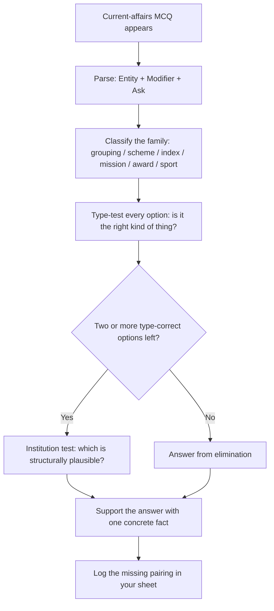

# Current Affairs

Current affairs is the one part of the General Test where you cannot revise "the chapter" — there is no fixed syllabus page to memorise, and the paper is written after the events happen. So the subject is not a memory test, it is a **filter** test: NTA takes a very large pool of current events and asks four or five questions a year from it. What you can revise is the *shape* of that pool and the decoding method, because the pool of possible stems is small even though the content is fresh. This note gives you that shape and the method. It deliberately avoids telling you "the 2024 X was Y" for events that age in a year — instead it tells you which categories get asked, which attributes of an event get asked about, and how to answer an item you have genuinely never seen before.

### 🟢 Lite — Quick Review (1h–1d)

**The four families that supply almost every current-affairs MCQ**

| Family | What it covers | The attribute usually asked |
| --- | --- | --- |
| **International events** | Summits, groupings, treaties, bilateral exercises | Membership, host country, partner, theme |
| **Indian government & schemes** | Flagship schemes, indices, national missions | Nodal ministry, beneficiary, benefit amount |
| **Science, space & technology** | ISRO launches, scientific results, defence tech | Agency, vehicle, first-of-its-kind, outcome |
| **Rankings, awards & sport** | Global indices, Nobel/ Padma type awards, tournaments | Publishing body, sport, country, first |

**The decode rule — three questions, every time.** A current-affairs MCQ is built from an **entity** (the scheme, summit, mission or award), a **modifier** (a year, an edition, a host city, a partner country) and a **ask** (who, where, how much, which body). Write those three down before you touch the four options. Most wrong answers in this section are caused by knowing the entity and ignoring the modifier.

**Minimum viable store — six lines you can rebuild in an hour**

- **Groupings:** G20, BRICS, SCO, Quad, ASEAN, SAARC, IBSA. For each: how many members, which region, one purpose.
- **Structures:** the *entity* answer is a noun, the *modifier* answer is a place or a year, the *ask* answer is usually a body or a ministry.
- **The trap:** an option that names a *right kind of thing but wrong pairing* is the intended distractor — France for a naval exercise with India, say.
- **The give-away:** if you know the entity but not the modifier, eliminate options whose modifier contradicts your knowledge and keep the rest.
- **Negative marking reality:** treat a coin-flip as wrong unless you can name one concrete fact that eliminates the other options.

**Time budget.** Twenty minutes a day for six months beats six hours the week before the exam, because the return on the first method is linear (each day adds facts) while the second is logarithmic (you cannot cram fresh events).

### 🟡 Standard — Regular Study (2d–2mo)

#### What CUET General Test actually rewards

The General Test is not a current-affairs paper with reasoning attached. Reasoning, verbal ability and quantitative comparison are all present and all are *deterministic* — a method exists that gets you the right answer. Current affairs is the *stochastic* slice, and it is small. The consequence for your preparation is that the ratio of hours you give to current affairs should be small, and the ratio of hours you give to the deterministic sections should be large. Most students do the reverse, because current affairs feels like studying and puzzles feel like talent.

What the section rewards is breadth of *category*, not depth of *event*. If you know one member of every family above and can parse a stem, you can survive a paper that contains four items you have never read about. If you know fifty events from one family, you will still be lost when the paper tests the other three.

#### International groupings — learn the structure, not the summit

Summit questions rotate host countries and themes year to year, so a memory of "which city hosted last year" decays fast. What does not decay is the *shape* of each grouping. Learn the permanent skeleton:

| Grouping | Permanent skeleton | Durable purpose |
| --- | --- | --- |
| **G20** | 19 countries + the European Union + the African Union, a grouping of major economies | Global economic governance; the AU sitting inside the grouping as a bloc, alongside the EU |
| **BRICS** | Brazil, Russia, India, China, South Africa, plus Egypt, Ethiopia, Iran and the UAE among the newer full members | Cooperation among emerging economies; debate over a common currency settlement mechanism |
| **SCO** | China, Kazakhstan, Kyrgyzstan, Russia, Tajikistan, Uzbekistan, India, Pakistan, Iran, Belarus | Regional security and counter-terrorism in Central and South Asia |
| **Quad** | India, United States, Japan, Australia | Indo-Pacific maritime awareness and supply-chain resilience |
| **ASEAN / SAARC / IBSA** | Ten members / eight South Asian states / India-Brazil-South Africa | Regional trade and cultural cooperation; IBSA is a forum, not a trade bloc |

The **India–France defence trio** is worth knowing as a set because exercise questions are almost always asked as "which exercise with which country". India and France conduct *Shakti* (army), *Garuda* (air) and *Varuna* (naval). India and the United States conduct *Yudh Abhyas* (army), *Malabar* (multilateral naval), and the US runs its own exercises with Japan and Australia. India and Japan run *Dharma Guardian* (army) and *JIMEX* (naval). India and the United Kingdom run *Ajeya Warrior* (army) and *Konkan* (naval). Learn the pattern — *each pair has one exercise per service branch* — and you can reconstruct most of a missing pair.

A deliberate caution: membership lists change. Saudi Arabia's participation in BRICS was widely reported but never formally confirmed as full membership, and several countries across groupings change status. When a question hinges on a membership detail you are not certain of, the safe play is the option you *can* support with a reason, not the most recent headline you half-remember.

#### Indian government schemes — the attribute that is always asked

Scheme questions in this section almost never ask "what is the scheme called". They ask one of four attributes: **nodal ministry**, **beneficiary**, **benefit quantum**, or **launch year**. If you store only the name, you cannot answer. If you store the four attributes as one row, you can.

| Scheme | Nodal ministry | What it does | Stated benefit |
| --- | --- | --- | --- |
| **PM-KISAN** | Agriculture and Farmers Welfare | Income support to landholding farmer families, paid direct to bank accounts | ₹6,000 a year in three equal instalments, per the scheme's operational guidelines |
| **Ayushman Bharat PM-JAY** | Health and Family Welfare | Health cover for hospitalisation to listed vulnerable families | ₹5 lakh per family per year of secondary and tertiary care, per the scheme design |
| **PM Awas Yojana** | Rural Development (Gramin) and Housing and Urban Affairs (Urban) | Assistance for pucca housing, toilets and drinking water | Assistance varies by component, area classification and beneficiary category |
| **PM Surya Ghar Muft Bijli Yojana** | New and Renewable Energy | Rooftop solar for households without reliable supply | Support for up to 3 kW of rooftop capacity |
| **PM Vishwakarma** | Micro, Small and Medium Enterprises | Credit and skill training for traditional artisans in 18 trades | Collateral-free credit plus training |

The **indices** family is best learned as a map of *who publishes what*, because the publisher is the stable fact and India's rank is not:

- **UNDP** publishes the Human Development Report and the *Human Development Index* — life expectancy, schooling, and income per person, combined.
- **WIPO** publishes the Global Innovation Index — patent filings, scientific output, research spending, infrastructure.
- **WEF** publishes the Global Gender Gap Report — the gap between women and men in economic participation, education, health and politics.
- **World Bank / IMF** publish macroeconomic data and the World Economic Outlook.
- **Reporters Without Borders** publishes the World Press Freedom Index.

Learn *body → index → what it measures*. A rank question is then a lookup you may miss, but you can still eliminate options that name the wrong publisher or the wrong metric — and on a four-option MCQ that is often enough.

#### Science, space and technology — the pairing is the question

ISRO items are almost never "what did the mission achieve". They are "which mission did what", and the trap is two missions doing similar things. The durable map:

- **Chandrayaan-3** — India's first soft landing near the lunar south pole; the rover Pragyan found sulphur on the surface, which is the reason lunar polar water became a mainstream story.
- **Aditya-L1** — India's first dedicated solar observatory, placed in a halo orbit around the Sun–Earth L1 point.
- **Gaganyaan** — India's crewed Earth-orbit programme, the human-spaceflight mission.
- **Navic** — the indigenous satellite-navigation system, a technology-sovereignty item.
- **UPI** — the real-time retail payment system, the digital-infrastructure item.

Store missions as *agency → purpose → the one differentiating fact*. The differentiating fact is what an option distractor gets wrong.

### 🔴 Extended — Deep Study (3mo+)

#### Building a store that survives six months

The store has to be built in a way you can *query* in the exam hall, which means it cannot be a stream of headlines. Use a fixed four-column sheet, one row per event:

| Event | Entity | Modifier | What was actually new |
| --- | --- | --- | --- |
| A scheme launch, a summit, a launch, a result | the name, exactly | date, host, edition | one sentence, the delta from before |

The fourth column is the one that pays. "X was held in city Y" is a lookup; "X was the first to do Z" is what the option is built from. When you read an event, force yourself to write the delta. If you cannot state what was new, it was probably not the kind of event that gets asked.

Review the sheet on a **weekly rotation by column, not by date**. Sunday: read the *What was new* column for the week aloud. Wednesday: turn random rows into stems and answer them. This converts passive reading into active retrieval, which is the only form that survives without a full re-read.

#### A four-step method for an item you have never seen

Apply this when the entity is unfamiliar. It is the difference between a lucky guess and a rule.

- **Step 1 — Parse.** Write the entity, the modifier and the ask. Most of the time the ask is "which body/ministry/partner", and the entity is a proper noun you can look at in the options.
- **Step 2 — Classify.** Which family is it? Grouping, scheme, index, mission, award, sport. Classification alone often removes one option.
- **Step 3 — Test each option against type.** An option of the wrong type is dead. "Which nation hosts the G20?" is never answered by a currency. "Which ministry runs the scheme?" is never answered by a beneficiary class.
- **Step 4 — Use contrast.** If two options are both type-correct, find the one you can support. If none can be supported, prefer the option that is *institutionally* plausible — an Indian scheme is run by a Union ministry, not by a state body; a UN index is published by a UN body, not by an NGO or a ministry.

**Worked example 1.** *Stem: "The 2024 G20 summit held under India's presidency included a declaration on which cross-continent economic corridor?"* Parse — entity: G20 2024, modifier: India's presidency, ask: the name of a corridor. Classify: international grouping, economic outcome. Type-test: an option that is a summit, a country or a currency is dead on arrival. A corridor connecting India, the Gulf and Europe is the only shape that answers "cross-continent economic corridor". You can reach the answer without having memorised the summit text, because the *shape* of the ask constrains the answer.

**Worked example 2.** *Stem: "Which of the following is published by the World Intellectual Property Organization?"* Parse — entity: WIPO is the modifier-free target; the ask is a publication. Classify: indices. Type-test: the Human Development Index is a UNDP product, the Gender Gap Index is a WEF product, the Press Freedom Index is an NGO product. The only innovation-flavoured option belongs to WIPO. Here the *map* is the whole answer.

**Worked example 3.** *Stem: "The Chandrayaan-3 rover detected sulphur near the lunar south pole. Which ISRO mission is designed to study the Sun?"* Parse — entity: ISRO; modifier: the Sun; ask: mission name. Classify: science and space. Method: you do not need the rover result. The Sun mission is Aditya-L1; lunar missions are Chandrayaan series. The knowledge required is a two-way pairing, not an event.

#### The last six weeks — what to stop doing

Stop starting new schemes in the final six weeks. The marginal value of a scheme you have not seen before is low and your recall will not survive the exam. Start instead on the **pairing drills**: ministry-to-scheme, body-to-index, agency-to-mission, country-to-exercise. A pairing is a finite, closed set — a few dozen items — and you can convert the whole set to a stable score in three weeks. Events are an open set and you can never finish them.

Also stop reading aggregator lists that contain no delta. "Ten new schemes launched" wastes twenty minutes unless each entry names the nodal ministry and the benefit. Filter aggressively: if a headline cannot fill a row in the four-column sheet, skip it.

### 🧠 Memory Anchors

- **"Entity, modifier, ask"** — write all three before reading option A. It is the single habit that separates a reasoned answer from a guess.
- **"Right kind of thing, wrong pair"** is the standard distractor. France, Japan, the UK and the US each conduct exercises with India, so a plausible-looking country is not an answer.
- **"Publisher is stable, rank is not."** Learn UNDP/WHO-style publisher-to-index pairings; treat any rank number as edition-specific.
- **"One exercise per service branch, per country."** Shakti–Garuda–Varuna is France; Dharma Guardian–JIMEX is Japan; Konkan–Ajeya Warrior is the UK; Yudh Abhyas–Malabar is the US.
- **"Store the delta, not the headline."** What was new is the part an MCQ option is built from.
- **Flashcard Q&A:**
  - *Which grouping includes the African Union as a bloc alongside the European Union?* → G20, whose composition is major economies plus two blocs.
  - *Which body publishes the Global Innovation Index?* → WIPO.
  - *What is India's first dedicated solar observatory?* → Aditya-L1, at the L1 point.
  - *Which ministry runs PM-KISAN?* → Agriculture and Farmers Welfare.
  - *What did Chandrayaan-3's rover detect at the lunar south pole?* → Sulphur in the regolith.
  - *Four-country Indo-Pacific grouping?* → The Quad — India, United States, Japan, Australia.

### 🎯 Exam Traps & Error Log

1. **Reciting a summit host city for the year of the exam.** The host rotates and last year's answer is usually wrong. Learn the grouping's permanent membership and purpose instead.
2. **Treating a reported-but-unconfirmed membership as fact.** Some countries' participation in BRICS-type expansions has been reported without formal confirmation; a question built on that distinction will punish you for the headline you read instead of the notification.
3. **Confusing a scheme with the ministry that runs it.** Questions ask for the nodal ministry; PM-KISAN is Agriculture and Farmers Welfare, not Finance.
4. **Attaching a rank number to an index without an edition.** India's rank in a global index changes every year it is published. If the question does not name the edition, be suspicious of options that quote a bare rank.
5. **Naming an NGO or a ministry as the publisher of a UN index.** The Human Development Index is UNDP's; the Gender Gap Index is the World Economic Forum's.
6. **Guessing a mission from a similar-sounding mission.** Chandrayaan is lunar, Aditya is solar, Gaganyaan is crewed. These are three separate pairings and mixing them is the standard distractor.
7. **Choosing a plausible country over the right one in a defence-exercise item.** Every major partner conducts exercises with India; the answer is the specific pairing, not the general region.
8. **Answering the modifier when the stem asks the entity.** Read the ask last and mark it.
9. **Trying to recall an event you have never studied instead of applying the four-step method.** Unknown item plus no method equals a coin flip, and coin flips under negative marking are losses.
10. **Spending the last month on new schemes rather than pairings.** Closed sets convert to marks; open sets do not.

### 🧪 Self-Test — 8 Questions with Worked Answers

Answer these on paper first. The point is the method, so apply entity–modifier–ask and the type test before you look for recall.

1. **A CUET General Test item asks: "Which of the following bodies publishes the Human Development Index?"** Options are the World Economic Forum, UNDP, the World Bank and WIPO. *Worked answer:* **(B) UNDP.** Parse — the ask is a publisher, so the entity is the index itself. Type-test — all four are institutions, so type alone does not separate them; go to the publisher map. UNDP's Human Development Report produces the HDI from life expectancy, schooling and GNI per capita; the WEF produces the Gender Gap Index and the World Bank produces development data. The knowledge is a three-way pairing, not an event.

2. **"The African Union sits inside which grouping alongside the European Union?"** *Worked answer:* **G20.** Method — classify the item as an international grouping. The stem gives the modifier (alongside the EU) and the ask (the grouping). Options that are regional trade blocs or security organisations are dead on type: the G20 is the grouping of major economies that includes both the European Union and the African Union as blocs. You can eliminate by shape before recalling any summit text, and the answer does not depend on which year the paper was written.

3. **"Aditya-L1 is India's first mission in which field?"** Options: lunar, solar, Mars, communication. *Worked answer:* **(B) solar.** Method — this is a pairing item. Aditya-L1 is a solar observatory placed near the Sun–Earth L1 point. Lunar work is the Chandrayaan series, Mars has no Indian dedicated mission, and communication is the responsibility of other agencies. If you know only that Aditya sounds like a sunrise, that is enough to reject the rest.

4. **A bilateral naval exercise between India and France is conducted as part of a well-known trio of India–France defence exercises. Name the naval one.** *Worked answer:* **Varuna.** Method — the stem gives the modifier (naval, France) and asks the name. Recall the pattern: each partner conducts one exercise per service branch, so the naval one for France is Varuna, the army one is Shakti and the air one is Garuda. If your first thought was Malabar, note that Malabar is the multilateral exercise the US participates in, not the France–India pair.

5. **"Which ministry is the nodal ministry for the Pradhan Mantri Kisan Samman Nidhi?"** Options: Rural Development, Agriculture and Farmers Welfare, Finance, Health and Family Welfare. *Worked answer:* **(B) Agriculture and Farmers Welfare.** Method — this is a scheme-to-ministry pairing. Rural Development runs the rural housing and rural employment schemes; Finance is never the nodal ministry for a beneficiary scheme in this style of question; Health runs PM-JAY. The trap is picking the biggest-sounding ministry, so always store the ministry alongside the scheme name.

6. **"Sulphur detected near the lunar south pole was reported by the rover of which Indian mission?"** *Worked answer:* **Chandrayaan-3.** Method — the rover name is the shortcut. Chandrayaan-3 deployed the rover **Pragyan**, and the surface analysis that produced the sulphur result came from it. Aditya-L1 carries no rover and orbits the Sun. The lesson: store one differentiating fact per mission, not a paragraph of description.

7. **You have never read about a scheme named in a General Test question. What is the fastest route to a reasoned answer?** *Worked answer:* **Classify, then type-test.** Write the entity, the modifier and the ask; decide the family; then eliminate every option that is the wrong *kind* of thing — a beneficiary class where a ministry is asked, a summit where a treaty is asked. If two type-correct options remain, apply the institution test: for an Indian government scheme the plausible answer is a Union ministry, not a state department or a private body. The method is worth more than the fact you are missing, because it still works in the exam hall.

8. **"Which organisation publishes the Global Innovation Index?"** *Worked answer:* **WIPO, the World Intellectual Property Organization.** Method — publisher map, as in Q1. The GII measures patent filings, scientific output, R&D spending and technology adoption; that metric profile belongs to WIPO, while UNDP's belongs to human development and the WEF's to the gender gap. Learn the body-to-index map once and several stems become free.

### 💡 Pro Tips

1. **Write the four-column sheet before you read anything new.** A stream of headlines with no column structure cannot be queried in the exam hall.
2. **Twenty minutes daily, never a weekend binge.** Fresh events decay in weeks; a small daily deposit survives the whole syllabus period.
3. **Store attributes, not names.** Name + ministry + beneficiary + quantum is one row; the name alone is useless.
4. **Drill pairings as flashcards, not lists.** Ministry-to-scheme and agency-to-mission are closed sets and flashcard decks force recall.
5. **Mark every stem's ask before you read option A.** Half the losses in this section are answering a different question than the one asked.
6. **When the entity is unknown, lean on the modifier.** The modifier often constrains the family even when the entity name is meaningless to you.
7. **Prefer the institutionally plausible option on a tie,** and be honest that it is a tie — negative marking punishes false confidence far more than a calculated guess.
8. **Log every miss in the same sheet, in the "What was new" column.** A paper post-mortem that only records scores teaches you nothing; one that records the missing pairing does.

---

## Continue your study

- **[View this topic in your CUET UG roadmap](/roadmap/?exam=cuet&duration=1mo)** — see where "Current Affairs" fits in your personalised plan
- **[Build a quick revision plan](/roadmap/?exam=cuet&duration=1d)** — 1-day sprint covering highest-weight topics
- **[CUET UG exam overview](/exams/cuet/)** — pattern, eligibility, and syllabus
- **[All General Test notes](/notes/cuet/general-test/)** — browse sibling topics in this subject

*Content adapted based on your selected roadmap duration. Switch tiers using the selector above.*
