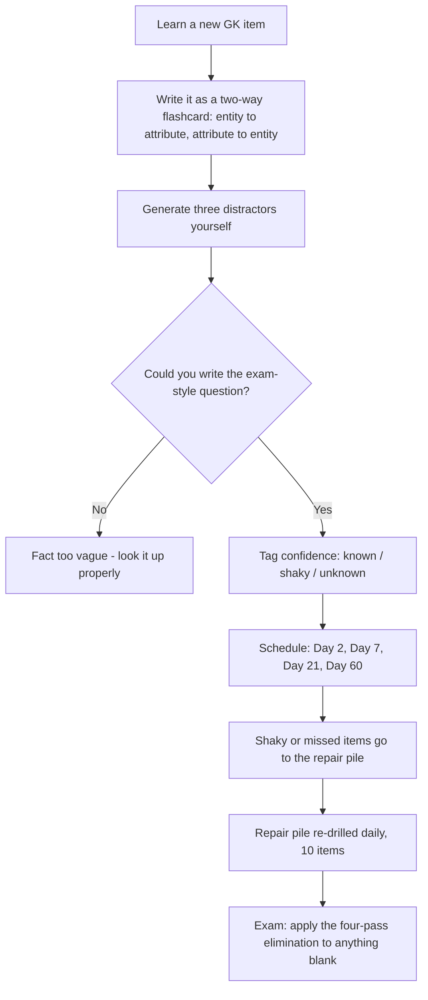

# General Knowledge

General Knowledge looks like the hardest thing to revise in this paper, because it has no syllabus page, no formula sheet and no obvious end point. That impression is wrong, and correcting it is the whole subject. GK is not an open set of things to know; it is a **closed set of domains**, and within each domain the questions almost always ask about a small number of *attributes*. A domain × attribute matrix turns an apparently infinite subject into a finite list of a few hundred items you can actually finish. The rest of this note is that matrix, the retrieval schedule that keeps it in your head, and the elimination method that saves you on the items you still miss.

### 🟢 Lite — Quick Review (1h–1d)

**The domain × attribute idea.** A GK fact is only useful if you can attach it to the *question type* that will ask for it. Ask of any fact: what would a question about this look like?

| Domain | Typical attributes asked |
| --- | --- |
| Indian polity & Constitution | Article number, office holder, amendment year, committee name |
| Geography | Location, extreme point, boundary, highest, climate type |
| History | Year, ruler, battle, treaty, reformer, cause |
| Science | Inventor, unit, element, process, disease-cause |
| Economics & economy | Institution, index, currency, concept definition |
| Culture & heritage | Site, monument, classical form, festival, state |
| Awards & honours | Award name, field, country, year |
| Current institutions | Headquarters, founder, mandate, member list |

**The five-question self-test for any fact you read.** Who or what is it? Where? When? Connected to what? Contrasts with what? The last one is the highest-value question, because MCQ options are usually built as contrasts.

**The 3-day rule.** A fact you read once is gone in three days. A fact you retrieve five times across a month is permanent. Budget your GK time by retrieval count, not by pages read.

**Minimum viable store — ten facts per domain.** Ten well-connected facts per domain beats a hundred unconnected ones, because the exam asks relationships as often as it asks names.

**The two-minute exam rule.** If a GK item cannot be attacked with a type test in two minutes, mark it and move. A marked question is worth more than a burned one.

### 🟡 Standard — Regular Study (2d–2mo)

#### Why general knowledge is finite even though it feels infinite

The reason GK feels open is that the *answer space* is open — anything in the world could be the answer to "which of the following". But the *question space* is not. Look at how these questions are actually phrased in entrance papers:

- "Which Article of the Constitution provides for the appointment of the Attorney General?" — the ask is an *article number* attached to a *provision*.
- "The Tropic of Cancer passes through which of the following Indian states?" — the ask is *place membership*.
- "The 'Nansen Passport' is issued for which purpose?" — the ask is *purpose*.
- "Which organisation publishes the Global Innovation Index?" — the ask is *institution attached to a work*.
- "The Battle of Plassey was fought in which year?" — the ask is *date attached to an event*.

Notice that each of these is a **relationship**, not a free-standing fact. This is the single most useful idea in the subject. A student who memorises "Article 148" without knowing it belongs to the Comptroller and Auditor General will not answer the question; a student who stores the link "Attorney General → Article 76" in both directions will answer it and probably also a question phrased the other way round.

So the unit of revision is not the fact, it is the **link**: entity → attribute, and attribute → entity. That is what flashcards force you to do, and it is why active recall beats re-reading by such a wide margin.

#### Building the matrix: domains, sub-domains, and what to stop at

Turn each domain into a list of sub-domains, then cap the list. The cap is what makes the project finishable.

- **Polity** — constitutional provisions, fundamental rights and their articles, directive principles, constitutional bodies, amendments, election and party system, federalism. Stop when you can name the article for each of the twenty-odd rights and provisions that get asked.
- **Geography** — India: physical divisions, rivers and basins, passes, soils, climate types, national parks, extreme points. World: continents, oceans, important straits, capitals, deserts, mountain ranges, climate classifications. Stop when you can place every item on a mental map.
- **History** — ancient, medieval, modern, nationalist movement, and Constitution-making. Stop when you can attach a year and a cause to each major event.
- **Science** — physics, chemistry, biology at general-knowledge depth, plus technology and medicine. Stop when you can name the unit, the scientist and the process for each basic idea.
- **Economy** — institutions, indices, basic concepts, currency and trade. Stop when you can define each concept in one sentence and name its institution.
- **Culture and heritage** — classical dance and music forms, UNESCO World Heritage sites in India, architectural styles, festivals, folk traditions, literature and languages.
- **Awards and honours** — the major national and international awards, the field, and the awarding body.
- **General science and health** — nutrition, diseases, vitamins, the body, common technology.

This is a large list. It becomes manageable because each bullet has a stopping rule. Without a stopping rule you read for six months and feel you have covered nothing; with one you can finish the first pass in a fixed number of weeks and know it.

#### The retrieval schedule that actually works

Re-reading a chapter produces a *feeling* of familiarity that is a well-known illusion. Retrieval produces the real thing. A schedule that fits a student preparing over three to six months:

- **Day 0** — read the item, write it as a two-way flashcard (front: the entity; back: the attribute, and vice versa).
- **Day 2** — first retrieval. Most misses happen here, and that is the point.
- **Day 7** — second retrieval. Anything still missed goes into a "repair pile" of ten items you re-drill daily.
- **Day 21** — third retrieval. The item is now roughly stable.
- **Day 60** — final check, purely to catch decay.

Each session should be timed, not leisurely. Twenty minutes, one domain, cards in random order, self-graded on whether you produced the answer or merely recognised it. A card you *recognise* but cannot *produce* is a card you do not yet own — this is the single most important distinction in the whole subject.

#### Turning a source into cards in under a minute

Read one line. Ask: what would four options look like for this? If you can generate three distractors yourself, you have your card. If you cannot, the fact is too vague and you should look it up properly. A typical week of genuine reading should yield 30–50 cards, not 300. If you are producing 300, you are copying text, not learning it.

One more rule: **write the card as a question, not as a heading.** "Polity — Fundamental Rights" is a heading and teaches nothing. "Which Article abolishes untouchability?" is a question, and it is the exam's own shape.

### 🔴 Extended — Deep Study (3mo+)

#### The four-question elimination method for an unknown item

This is what converts a blank into a mark when the fact is gone. Run the options in this order.

- **Pass 1 — type.** Delete any option that is the wrong *kind* of thing. "Which Article provides for the Attorney General?" cannot be answered by a date, a court name or a state. This pass alone often removes two options.
- **Pass 2 — scale and scope.** Does the option's scale match the question? A question about a *national* provision is not answered by a state-level body; a question about a *global* index is not answered by an Indian ministry.
- **Pass 3 — internal consistency.** Does the option contradict something you *do* know? If an option says a war was fought in the nineteenth century and you remember it involved steam trains and a ruler you associate with the early 1800s, that is a real elimination even though you cannot name the year.
- **Pass 4 — institutional plausibility.** Which option would an official body plausibly have produced? Official attributions follow administrative sense: constitutional things to constitutional bodies, economic indices to international organisations, awards to awarding institutions.

**Worked example.** *Stem: "The Permanent Settlement of 1793 was associated with which part of India?"* You have forgotten the date detail but you do remember it reorganised land revenue in Bengal under Lord Cornwallis. Pass 1 — all options are regions, so type does not help. Pass 3 — the option naming a southern Indian region is eliminated because the arrangement is tied to the Bengal presidency; the option naming Punjab fails because the Punjab land settlement came later and separately. What is left is the correct region. The method works even when the fact has decayed.

#### The relationship-first study technique

If you had to choose between learning 200 facts as a list or 80 facts as 40 connected pairs, choose the pairs. Two reasons.

First, MCQ options are generated from *near neighbours*. A question about the Attorney General will be surrounded by the Comptroller General, the Solicitor General and the Advocate General. Knowing which is which is worth more than knowing a fifth article number, because the distractors live in the same neighbourhood as the answer.

Second, connected facts survive partial loss. If one node of a network drops, the rest of the network still lets you reconstruct it. Isolated facts die the moment you forget them. This is the same argument that makes the current-affairs pairing drills in gt-001 worth more than a list of headlines, and it applies to static GK as much as to fresh events.

Practically: after every study session, spend two minutes writing the *links* you touched. "Cabinet → Council of Ministers → advice to the President" is a link. "Cabinet is a body" is a list.

#### Calibration — knowing what you do not know

GK is the section where students lose the most marks through overconfidence, because a plausible-sounding fact feels exactly like a known one. Two habits fix it.

The first is a **confidence tag on every card**: *known*, *shaky*, *unknown*. Cards marked shaky are the only ones worth studying; cards marked known rarely are. Most students spend their time on cards they already own.

The second is the **two-source rule** for any fact you are about to bet marks on. If you have only ever met a fact in one place — one article, one video, one coaching note — you do not actually know it, you have met a claim. In the exam hall, a single-source fact is the definition of a coin flip.

#### What to do in the last month

Stop adding domains. Nobody starts learning constitutional economics in the final month. Do three things instead: run the repair pile until it is empty, run two full mixed timed sets so you can see which domains still leak under time pressure, and rehearse the *elimination method* on unfamiliar items so it is automatic in the hall. A student who can pass two of four passes on an unknown item is scoring far above a student who blanked on all four.

### 🧠 Memory Anchors

- **"Facts are links, not labels."** Store entity→attribute *and* attribute→entity or you have not stored it.
- **"Type, scale, consistency, institution."** The four passes of elimination, in order, for any item you cannot recall.
- **"Distractors live next door to the answer."** Learn the neighbourhood (Advocate General / Solicitor General / Attorney General) rather than a fifth isolated fact.
- **"Recognise is not know."** A card you can identify but not produce is still lost.
- **"One source is a claim, not a fact."** The two-source rule before you bet marks.
- **Flashcard Q&A:**
  - *Which Article deals with the Attorney General?* → Article 76.
  - *What is a Permanent Settlement associated with?* → The 1793 land-revenue arrangement in Bengal under Cornwallis.
  - *Which body publishes a Human Development Report?* → UNDP.
  - *What is the Tropic of Cancer?* → The line of latitude at which the Sun is directly overhead at the June solstice, about 23.5 degrees north.
  - *What does "static" mean in Static GK?* → A fact that does not decay with the news cycle, unlike current affairs.

### 🎯 Exam Traps & Error Log

1. **Re-reading instead of retrieving.** Familiarity is not knowledge. A card you have only re-read is a card you do not own.
2. **Storing facts as lists instead of links.** A heading like "Fundamental Rights" is not a card; "Which Article abolishes untouchability?" is.
3. **Picking the option that sounds most official.** Plausibility of language is not evidence; run the type and consistency passes instead.
4. **Confusing a related officer with the one asked.** Advocate General, Solicitor General and Attorney General are three different offices, and options will contain all three.
5. **Ignoring the scale of the question.** A question about a *global* index is not answered by a national body, and vice versa.
6. **Learning an answer without an edition or a qualifier.** A rank, a figure or a membership list without its date is not a fact, it is a snapshot.
7. **Confidently ticking a single-source claim.** You did not know it, you met it once. Under negative marking this is a loss, not a guess.
8. **Spending final-week time on new domains** instead of clearing the repair pile and drilling the elimination method.
9. **Counting "nearly correct" as correct during practice.** In a four-option MCQ, the near misses are the whole difficulty; if you cannot defend the exact option, you have not solved the item.
10. **Burning three minutes on a blank GK question.** The expected value of a marked question is higher than the expected value of a third attempt with no new information.

### 🧪 Self-Test — 8 Questions with Worked Answers

Work the method, not the recall. Apply type, scale, consistency and institution to each item before you check the answer.

1. **A question asks which Article of the Constitution deals with the Comptroller and Auditor General of India. You have forgotten the number. What is your route to the answer?** *Worked answer:* **Run the elimination passes.** Pass 1 — the options should be article numbers or descriptions; delete anything that is not a constitutional provision. Pass 3 — the Comptroller and Auditor General is a constitutional body created under the directive in Article 148, so an option describing a *statutory* body is wrong. Pass 4 — among the surviving numbers, the constitutional-body articles sit in the 140s to 150s, since rights (12–35), directive principles (37) and fundamental duties (51) are already excluded by the question's subject matter. The structure gives you the answer even when the digit does not.

2. **"Which of the following organisations publishes the Human Development Report?"** *Worked answer:* **UNDP.** Method — this is a publisher-pairing item. The World Economic Forum publishes the Global Gender Gap Report, the World Bank publishes development data, and WIPO publishes the Global Innovation Index. Each publisher owns one report, so once the map is stored the options separate immediately. Store it as a link in both directions.

3. **Explain the difference between a "shaky" card and an "unknown" card, and say which one to study.** *Worked answer:* **A shaky card is one you produced but slowly, or only after seeing a cue; an unknown card is one you could not produce at all. Study the shaky cards first**, because the unknown ones are usually facts you never captured, and re-drilling a fact you never learned wastes a session. A useful rule: if you needed more than five seconds, the card is shaky even if you got it right.

4. **Why do MCQ options in the General Test cluster near the correct answer?** *Worked answer:* **Because the distractors are generated from the same semantic neighbourhood as the answer.** A question on the Attorney General is surrounded by the Advocate General and the Solicitor General; a question on the G20 is surrounded by BRICS and the SCO. Learning the neighbourhood therefore removes two options automatically, whereas learning a fifth unrelated fact removes none. This is why relationship-first study beats list study in this section.

5. **"How many Indian states does the Tropic of Cancer pass through?"** *Worked answer:* **Eight — Gujarat, Rajasthan, Madhya Pradesh, Chhattisgarh, Jharkhand, West Bengal, Tripura and Mizoram.** Method — the stem asks a *count*, so the durable memory is an ordered west-to-east list, because the options will be permutations of it. The list has a shape worth keeping: the line enters at Kutch in the west and leaves at Mizoram in the east, dipping furthest south where it clips Tripura. For contrast, the Tropic of Capricorn crosses only four Indian states — Tamil Nadu, Kerala, Karnataka and Maharashtra — because it just grazes the southern tip. If you know one line you should know the other, since "which latitude line crosses which states" is a recurring stem and the 8-versus-4 contrast is a favourite distractor pair.

6. **You face a General Test item at minute 40 of the paper, know nothing about the entity, and have 90 seconds. Describe the exact procedure.** *Worked answer:* **Parse the ask, then run four passes in order.** Parse: what *kind* of thing is the answer — a year, a place, a person, an institution, a provision? Pass 1 type: delete anything of the wrong kind. Pass 2 scale: keep only options whose scope matches a national or global question as asked. Pass 3 consistency: delete options that contradict any adjacent fact you do remember. Pass 4 institution: among survivors, choose the one an official body would plausibly have produced. If two survive after 90 seconds, mark the item and move — the marginal value of a third minute is lower than the value of the next three questions.

7. **Why is the "two-source rule" worth applying before the exam, and what does it protect you from?** *Worked answer:* **It protects you from betting marks on a claim you have only met once.** Facts that appear in a single article, video or coaching note can be misremembered, misquoted or superseded, and in a four-option MCQ a misremembered fact is not a partial credit, it is a wrong mark. Requiring two independent sources before you mark a fact *confident* moves borderline items into the repair pile, which is exactly where they belong.

8. **"Which of the following battles is associated with the year 1757?"** *Worked answer:* **The Battle of Plassey.** Method — even if you had forgotten the year, pass 3 works. The eighteenth century and a *bengal* context points to Plassey, not to a later nineteenth-century conflict such as the earlier ones. The general lesson: a century hint narrows the field faster than a name hint, because centuries contain far fewer events than names.

### 💡 Pro Tips

1. **Count retrievals, not pages.** Twenty sessions of active recall on one domain beats five re-reads of ten.
2. **Cap every sub-domain with a stopping rule** so the first pass actually ends and you can move to spacing.
3. **Write two-way cards on day one.** A one-way card fails half the time the exam asks the question.
4. **Generate the distractors yourself.** If you cannot invent three wrong options, the fact is too vague to be useful.
5. **Keep a repair pile of ten items.** Small, daily, and never allowed to exceed ten — that is what keeps it drillable.
6. **Learn neighbourhoods, not singletons.** The distractor cluster is where the marks are.
7. **Tag confidence honestly.** Shaky is the useful label; "known" is usually optimism.
8. **Practise the elimination method on unfamiliar items** so the four passes run automatically under exam pressure.

---

## Continue your study

- **[View this topic in your CUET UG roadmap](/roadmap/?exam=cuet&duration=1mo)** — see where "General Knowledge" fits in your personalised plan
- **[Build a quick revision plan](/roadmap/?exam=cuet&duration=1d)** — 1-day sprint covering highest-weight topics
- **[CUET UG exam overview](/exams/cuet/)** — pattern, eligibility, and syllabus
- **[All General Test notes](/notes/cuet/general-test/)** — browse sibling topics in this subject

*Content adapted based on your selected roadmap duration. Switch tiers using the selector above.*
