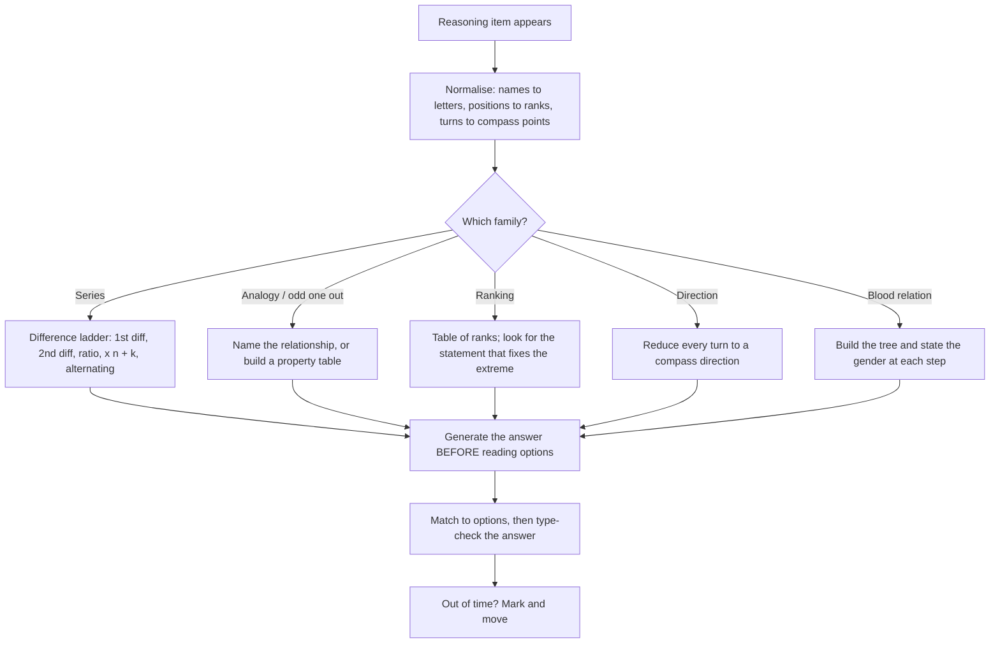

# Reasoning

Reasoning questions look like intelligence tests, and that is exactly why students over-invest in them. They are not intelligence tests. Every item in this family obeys a rule that already exists in the stem, and the entire skill is **finding the rule before choosing the option**. Two students can have identical general ability and score very differently, because one writes down the pattern before reading the options and the other reads the options first. This note teaches the mechanical order of operations: normalise the stem, find the pattern, generate the answer, then check it against the options. Applied to a question you have never seen, that order is a complete method.

### 🟢 Lite — Quick Review (1h–1d)

**The five-step attack for any reasoning item**

1. **Rewrite** the stem in a neutral form — numbers as a sequence, names as symbols, positions as numbers.
2. **Find the pattern** before reading any option.
3. **Generate the answer yourself.**
4. **Match** your answer to the closest option.
5. **Sanity-check** it against the type the question wants (a number, a direction, a name).

**The seven question families and the one rule for each**

| Family | The rule to find first |
| --- | --- |
| Number series | Constant difference, then second difference; then ratio; then ×n ± k; then alternating |
| Letter / word series | Shift, skip pattern, or opposite letters (A↔Z, B↔Y) |
| Analogy | Relationship word: part-whole, cause-effect, degree, function, sequence |
| Odd one out | A property, not a topic — all four share a rule and one breaks it |
| Ranking / ordering | Convert every statement into a rank number, then build a table |
| Direction sense | Convert every turn into a compass direction, then add the vectors |
| Blood relations | Draw the tree; say the gender at each step before you answer |

**The two time-honoured facts.** Odd-one-out asks for a *shared property*, and the options almost always belong to the same surface category, so topic-based elimination fails. Blood relations require the *gender* of the person asked about before you answer — "his mother's only son's wife" is not a relation you can see until you have placed the son's gender.

**When to skip.** A series with no rule visible after 25 seconds, or a blood-relation chain longer than four links, is worth marking only if the clock says so. Do not burn two minutes.

### 🟡 Standard — Regular Study (2d–2mo)

#### Number series — the difference ladder

Most series are found by climbing a fixed ladder of tests, in this order, and stopping at the first hit. The ladder exists because it is ordered by how *cheap* the test is to run.

1. **First differences.** Subtract consecutive terms. A constant difference (4, 4, 4, 4) means an arithmetic series.
2. **Second differences.** If the first differences form their own pattern — a constant, or doubling, or +5 each time — that pattern governs. This is the single most productive test in the whole topic.
3. **Ratios.** Divide consecutive terms. A constant ratio means a geometric series.
4. **×n ± k.** Test a multiplying pattern with a constant offset: ×2+1, ×2+2, ×3−4, and so on.
5. **Alternating.** Take every other term and test the ladder again on the odd positions and on the even positions separately. A series that resists every test is usually alternating.
6. **Squares, cubes, factorials, primes** as a final check on the level of the whole series.

**Worked series A — second differences.** 3, 7, 16, 35, 74, ?
First differences: 4, 9, 19, 39. Second differences: 5, 10, 20. The second differences are doubling, so the next second difference is 40, the next first difference is 39 + 40 = 79, and the next term is 74 + 79 = **153**.
*Confirmation on a different rung:* 3 → 7 is ×2 + 1; 7 → 16 is ×2 + 2; 16 → 35 is ×2 + 3; 35 → 74 is ×2 + 4; so 74 → 153 is ×2 + 5. Two independent rules giving the same number is the standard you should hold yourself to.

**Worked series B — the level of the series.** 2, 6, 12, 20, 30, ? The terms are 1×2, 2×3, 3×4, 4×5, 5×6, so the answer is 6×7 = **42**. Note how much faster the "look at the level" test is than the difference ladder: the first difference is 4, 6, 8, 10, which is also a rule, but the n(n+1) reading is the one that generalises.

**Worked series C — alternating.** 3, 10, 4, 12, 5, 14, ? Odd positions are 3, 4, 5 (+1). Even positions are 10, 12, 14 (+2). The next term sits in an odd position, so it is **6**. The instant you notice the two interleaved sequences, the question is finished; the ladder on the whole series will never work, which is exactly why step 5 exists.

#### Analogy and odd-one-out — relationship, not resemblance

**Analogy** is a statement about a relation, so your first job is to name the relation in words before you look at the second pair. The relation set worth memorising, with one clear example each:

- **Part–whole:** Book : Chapter :: Building : Storey.
- **Cause–effect:** Fire : Smoke :: Bloom : Fragrance.
- **Degree or intensity:** Hot : Warm :: Cold : Chilly.
- **Function or tool:** Hammer : Nails :: Scissors : Cloth.
- **Sequence:** Day : Night :: Summer : Winter.
- **Material or origin:** Chair : Wood :: Ring : Gold.
- **Opposition in pairs:** Prefix : Suffix :: Male : Female.

Once named, the relation name is your search key. If you have named *part–whole*, any option that is a synonym pair, a cause pair, or a material pair is dead on arrival, and you are choosing between two part–whole options rather than four.

**Odd one out** is the same skill run in reverse. The options share a surface category by design, so topic elimination is useless. Instead build a property table: is it divisible by 3, is it a perfect square, is it a two-letter word, does it follow a letter pattern. The one option whose property cell is empty is the answer.

**Worked odd-one-out.** 8, 27, 64, 100, 125. Property cell: perfect cube? 8 = 2³, 27 = 3³, 64 = 4³, 125 = 5³, and 100 is 10² but not a cube. Answer: **100**. Notice that 100 is a perfect square and a perfect tenth power, so a careless property table with only "perfect square" would flag 8, 27, 64 and 125 as the odd ones out. The rule must be *shared by most and broken by exactly one*, which is a better test of your rule than it is of the options.

#### Ranking and ordering puzzles

These are solved by **tabulation, not by imagination**. Convert every statement into a number and put it in a table.

**Worked example.** *In a row of children, A is 11th from the left and 31st from the right. B is 18th from the right. How many children are between A and B?*
- Total children = 11 + 31 − 1 = **41**. (This "add and subtract one" rule is the single most-tested line in ordering problems: when a person is counted from both ends, the two positions overlap by exactly one person.)
- B from the right is 18, so B from the left is 41 − 18 + 1 = **24**.
- Children between A (11) and B (24) = 24 − 11 − 1 = **12**.

Apply the same table method to age puzzles ("A is older than B, C is younger than B, D is the youngest"), to rank problems with more than one attribute, and to superordinate rank problems. Write the table even if it looks unnecessary; the writing is what stops you from making an ordering error.

#### Direction sense and blood relations

**Direction sense.** Reduce every turn to a compass direction and add the vectors. If you start north, turn right you are east; from east, right is south; from south, right is west. A 90° left turn from north is west.

*Worked example.* *A person walks 4 km north, turns right and walks 3 km, turns right and walks 4 km. How far and in which direction is the person from the start?* North 4 then east 3 then south 4: the two vertical moves cancel exactly, leaving 3 km **east** of the start. The commonest error is treating the two right turns as one, which would leave you walking east and then east again. Count the turns, do not guess them.

Clock and calendar sit in the same family. The angle between the hands at H hours and M minutes is |30H − 5.5M| degrees, and the same expression run backwards gives the time from a given angle. One day has a fixed working week in examination logic questions: if today is a given day, add modulo 7 to move forward and subtract modulo 7 to move back, and never let the result go below 1 or above 7.

**Blood relations.** Draw the tree, and *state the gender of every person as you build it*. The chain "She is the daughter of the only son of my grandfather" is solved in one line once you notice that a grandfather's only son is the speaker's father, so the girl is the speaker's sister. Chains longer than four links should be rewritten in this form before you answer.

#### Coding, decoding and the message problem

Coding items are substitution puzzles. Two rules cover almost all of them: a **constant shift** (every letter moves by the same amount, forward or backward) and a **reversal** (write the word backwards, or swap the halves, or swap the first and last letters). Identify the rule by testing letter 1 against letter 2 first — the first pair usually shows the whole rule — and then apply it.

*Worked example.* *If TEACHER is coded as VGCEJGT, how is STUDENT coded?* T→V, E→G, A→C, C→E, H→J, E→G, R→T: every letter is shifted forward by two, and the pattern is consistent across all seven letters. Applying +2 to S, T, U, D, E, N, T gives **UVWFGPV**. The trap is assuming the shift must wrap in one direction or that the length changes; check that the code length always equals the word length first.

### 🔴 Extended — Deep Study (3mo+)

#### The universal procedure, and why the order matters

Nearly every lost mark in reasoning comes from one procedural error: **reading the options before you have the answer**. Options are designed to attract a half-formed pattern. The correct order is fixed and should be automatic.

- **Normalise.** Rewrite the stem in the simplest possible form. Names become letters, positions become ranks, directions become compass points, pictures become description. This step is not optional: most blood-relation and puzzle errors are representation errors, not logic errors.
- **Pattern.** Run the difference ladder or the named-relation list. If nothing appears, go back to normalising — the pattern is usually hidden by a cluttered representation, not absent.
- **Generate.** Produce the answer *before* looking at the options. This is what prevents option-shaped thinking.
- **Match.** Find the option equal to your answer. If none is equal, your answer is wrong or the option is approximate — check the second before assuming the latter.
- **Sanity-check.** Does the answer have the *type* and *magnitude* the question implies? A percentage that comes out at 4% when the stem implies an increase should be re-checked.

#### Time allocation: the accuracy curve

Reasoning is the one General Test area where going slower measurably pays, but only up to a point. The practical rule for a computer-based paper: give a series or a coding item up to 40 seconds, a direction or blood-relation item up to 30, a multi-constraint ordering puzzle up to 90. If you hit the limit without a rule, mark and return. The reason is a simple expected-value argument — a marked question can still be picked up later, but a wrong answer costs more than a blank under negative marking, and a time-expired question gives you both costs at once.

In practice, the fastest gain comes from **pre-commitment**: decide before the exam that you will attempt every series question but will abandon any ordering puzzle that has not made progress in 90 seconds. Students who decide in the hall waste 20 seconds per item negotiating with themselves.

#### Mixed sets — the transfer problem

A mixed set is a set in which several families are interleaved. The transfer problem is that your method changes with every item, and the switching cost is where the time goes. Three ways to reduce it: read the whole set once before starting, so you know how many of each family you face; do all items of the same family in one block if the order is free, because your working memory stays loaded; and keep your scratch work in a fixed place on the page so you do not lose a partially-built table when you switch families.

#### Worked example — a three-statement ordering puzzle

*Statements: P is taller than Q. R is taller than P. S is the shortest. Who is the tallest?*
- Convert to ranks from the top: S = 4 (shortest), Q = ?, P = ?, R = 1.
- P is taller than Q, so P < Q in rank. R is taller than P, so R = 1.
- The tallest is therefore **R**, and the puzzle is finished after two statements — do not use the third unless the question asks about the shortest.
The general lesson: **look for the statement that already fixes an extreme** before you build the whole table. In any ordering set, one statement usually determines the answer to the question being asked, and the rest are noise for this particular sub-question.

### 🧠 Memory Anchors

- **"Differences, then ratios, then ×n±k, then alternate."** The ladder, in order, stops at the first hit.
- **"Second differences are the workhorse."** A series whose first differences form a pattern is the most common non-arithmetic case.
- **"Odd one out is a property, not a topic."** Four options always share a topic; the answer breaks the rule, not the category.
- **"Name the relation, then search."** Part–whole, cause–effect, degree, function, sequence, material, pair-opposition.
- **"Add and subtract one."** Counting the same person from both ends of a row means total = left + right − 1.
- **"Turns, not guesses."** Right turns cycle north → east → south → west.
- **Flashcard Q&A:**
  - *Angle between clock hands at 3:00?* → 90°, from |30H − 5.5M|.
  - *Next term in 2, 6, 12, 20, 30?* → 42, the series is n(n+1).
  - *Odd one out of 8, 27, 64, 100, 125?* → 100; the rest are cubes.
  - *Book is to Chapter as?* → Building is to Storey (part–whole).
  - *Total in a row when a child is 11th left and 31st right?* → 41.
  - *TEACHER → VGCEJGT means what shift?* → Every letter forward by two.

### 🎯 Exam Traps & Error Log

1. **Reading the options before finding the pattern.** Options are built to attract half-formed rules; generate the answer first.
2. **Running only the first-difference test.** A series with a pattern in its first differences will not appear under constant difference; always take the second difference before giving up.
3. **Assuming a series must be arithmetic or geometric.** A large share of series are alternating, and the two interleaved sequences are usually visible within two glances.
4. **Answering "no relation" for a chain of three or more links.** Convert the chain into "the daughter of the only son of…" form and it collapses to a single step.
5. **Forgetting the −1 when counting from both ends.** It is the most common single arithmetic slip in ordering problems.
6. **Choosing an odd-one-out answer on topic.** The options are chosen to share a topic; the answer breaks a property.
7. **Forcing one rule onto four options when a shared rule is simpler.** Search for a property that four options share before hunting for what makes one different.
8. **Assuming a coding rule from the first two letters only.** Verify the rule against at least three pairs before applying it.
9. **Turning a "younger than" or "shorter than" into a bigger number.** Rank order in these puzzles is positional, not numerical; "shorter" means a later rank.
10. **Spending 90 seconds on one item and losing three.** Pre-commit to a time limit per family and honour it.

### 🧪 Self-Test — 8 Questions with Worked Answers

Do these on paper with a timer. For every item, normalise first and generate the answer before you look at the options.

1. **Find the next term: 3, 7, 16, 35, 74, ?** *Worked answer:* **153.** Method — first differences 4, 9, 19, 39; second differences 5, 10, 20, which are doubling, so the next second difference is 40, the next first difference is 79, and 74 + 79 = 153. Check on another rung: each term is ×2 then add an increasing constant (+1, +2, +3, +4, so next is ×2+5 = 153). Two independent rules agreeing is the reliability standard.

2. **Find the next term: 2, 6, 12, 20, 30, ?** *Worked answer:* **42.** Method — the terms are 1×2, 2×3, 3×4, 4×5, 5×6, so the sixth is 6×7. The difference ladder also works (4, 6, 8, 10, next 12, giving 42), which is a useful reminder: when two rungs of the ladder agree, the answer is almost certainly right.

3. **In a row of children, A is 11th from the left and 31st from the right. B is 18th from the right. How many children are between A and B?** *Worked answer:* **12.** Method — total = 11 + 31 − 1 = 41 children. B from the left = 41 − 18 + 1 = 24. Between A (11) and B (24) = 24 − 11 − 1 = 12. The two things students get wrong are the initial −1 and the final −1; both exist for the same reason, that the person at the boundary is counted in both positions.

4. **A person walks 4 km north, turns right and walks 3 km, then turns right and walks 4 km. How far, and in which direction, is the person from the starting point?** *Worked answer:* **3 km east.** Method — reduce the turns to compass directions: north, then a right turn from north is east, then a right turn from east is south. Add the vectors: the 4 km north and 4 km south cancel, leaving 3 km east. The trap is treating the two right turns as one, which would wrongly leave 7 km east.

5. **Pointing to a photograph, a man says, "She is the daughter of the only son of my grandfather." How is the girl related to the man?** *Worked answer:* **His sister.** Method — build the tree with genders. My grandfather's only son is my father. The daughter of my father is my sister. The trap is answering "daughter" from the word "daughter" in the stem, or "granddaughter" from "grandfather"; the chain has to be walked link by link, and each link changes the relationship by a full generation.

6. **If TEACHER is coded as VGCEJGT, how is STUDENT coded?** *Worked answer:* **UVWFGPV.** Method — test the first pair: T→V is +2. Verify with two more: E→G is +2, A→C is +2, R→T is +2. The rule is a constant forward shift of two, and the code length equals the word length in every position. Apply +2 to S, T, U, D, E, N, T to get U, V, W, F, G, P, V. The trap is a reversal, an alternating shift, or a wrap in the opposite direction.

7. **Which is the odd one out: 8, 27, 64, 100, 125?** *Worked answer:* **100.** Method — build a property table. Four of the five are perfect cubes (2³, 3³, 4³, 5³); 100 = 10² is not. The trap is testing "perfect square": 8, 27, 64 and 125 fail that test, which gives four odd ones out instead of one, and therefore a wrong rule. The rule must be satisfied by most options and broken by exactly one.

8. **What is the angle between the hands of a clock at 3:00, and what does the general formula look like?** *Worked answer:* **90°, and the general formula is |30H − 5.5M| degrees** where H is the hour and M the minutes, giving the smaller of the two angles. At 3:00 that is |90 − 0| = 90. The hour hand moves 0.5° per minute and the minute hand moves 6° per minute, so they separate at 5.5° per minute; that single fact is worth more than memorising the formula, because it also solves a time-from-angle question in reverse.

### 💡 Pro Tips

1. **Always write the normal form.** Most reasoning errors are representation errors, not logic errors.
2. **Generate the answer before reading the options.** This one habit recovers more marks than any other.
3. **Learn the difference ladder as an ordered checklist,** not as a list of tricks — the order is what makes it fast.
4. **Confirm with a second rung whenever the stakes are high.** Two rules agreeing is a ten-second check that catches most series errors.
5. **For ordering puzzles, hunt the extreme first.** One statement usually fixes the answer the question is asking for.
6. **Count from both ends with the −1 written down,** not in your head.
7. **Say the gender out loud in blood-relation chains** before you commit to an answer.
8. **Pre-commit to per-family time limits** and honour them, because a marked question is always worth more than a slow one.

---

## Continue your study

- **[View this topic in your CUET UG roadmap](/roadmap/?exam=cuet&duration=1mo)** — see where "Reasoning" fits in your personalised plan
- **[Build a quick revision plan](/roadmap/?exam=cuet&duration=1d)** — 1-day sprint covering highest-weight topics
- **[CUET UG exam overview](/exams/cuet/)** — pattern, eligibility, and syllabus
- **[All General Test notes](/notes/cuet/general-test/)** — browse sibling topics in this subject

*Content adapted based on your selected roadmap duration. Switch tiers using the selector above.*
