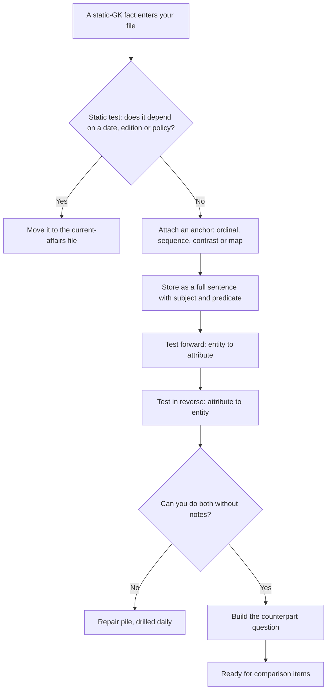

# Static GK

"Static" means the fact does not decay. The Treaty of Amiens, Article 32, the Narmada flowing west, the Ganga being India's longest river in the plains — these were true last year, they are true now, and they will be true when you sit the exam. That property makes static GK the single most reliable block of marks in the General Test, and it is also the block most students neglect, because it does not feel urgent. Nothing in it is trending, so nothing in it reminds you to open the book. The subject is therefore not about learning facts; it is about **converting a small, closed list into a set you can retrieve under two minutes of exam pressure**. That is what this note does.

### 🟢 Lite — Quick Review (1h–1d)

**The static test.** If the fact was true ten years ago and is true today, it is static and it is worth learning. If it depends on an edition, a year or a ranking, it is not static — put it in your current-affairs file instead.

**The seven blocks that make up almost all of it**

| Block | Core content |
| --- | --- |
| Constitution | Rights with article numbers, bodies, landmark amendments |
| Indian geography | Rivers and their basins, extremes, passes, national parks, soils |
| History | Independence movement, Constitution-making, post-1947 milestones |
| Science | Units, elements, vitamins, diseases, named discoveries |
| Culture | Classical dance and music forms, heritage sites, literature |
| Economy | Institutions, indices, basic terms |
| Awards | National decorations, sport honours, literary and film awards |

**The three highest-value lists**, because they are closed, short and heavily tested:
- **Fundamental Rights with article numbers** (Articles 12–35).
- **Classical dance forms with their states.**
- **Unit names with their quantities** (newton, joule, watt, pascal, hertz, tesla, ampere, mole).

**The one-sentence rule.** Every fact in your static file must be stored as a sentence with a subject and a predicate. "Narmada — west" is not a fact you can answer a question with; "The Narmada flows west into the Arabian Sea" is.

### 🟡 Standard — Regular Study (2d–2mo)

#### Constitution — the lists that close the topic

The Constitution of India gives you the highest density of testable, unchanging items in the entire General Test, because it is a numbered document. Learn it as three lists.

**Fundamental Rights, Articles 12–35:**
- **Right to Equality** — Articles 14–18 (equality before law, special privileges for specified groups, equality in public employment, untouchability abolished).
- **Right to Freedom** — Articles 19–22 (six freedoms of speech, assembly, association, movement, residence, profession; protection in respect of conviction; protection of life and personal liberty; education for children up to fourteen years).
- **Right against Exploitation** — Articles 23–24 (traffic in human beings and forced labour abolished; child labour in factories prohibited).
- **Right to Freedom of Religion** — Articles 25–28.
- **Cultural and Educational Rights** — Articles 29–30.
- **Right to Constitutional Remedies** — Article 32, which gives a citizen the right to move a court for the enforcement of the other rights. This is the article most often asked, and the most often mis-attributed.

The three lists are a different constitutional idea entirely: **List I (Union), List II (States), List III (Concurrent)**, and their parallel three lists under the **Seventh Schedule**. The two "three lists" ideas are frequently confused in questions, so store them as two separate cards with a contrast line: Fundamental Rights are a single list of justiciable rights; the Seventh Schedule is three lists of legislative subjects.

**Landmark amendments that recur:**
- **42nd Amendment (1976)** — added the Fundamental Duties, expanded the amending power, and is often called the "Mini-Constitution".
- **44th Amendment (1978)** — put the right to life and personal liberty beyond the reach of suspension, and substituted "armed rebellion" for the older language on national emergency.
- **73rd and 74th Amendments (1992)** — constitutionalised Panchayati Raj institutions and municipalities, which is why three-tier local government is a constitutional fact, not an administrative one.
- **52nd Amendment (1985)** — the anti-defection law.
- **101st Amendment (2016)** — created the Goods and Services Tax, a constitutional change because GST is levied under a constitutional provision.

**Constitutional bodies worth knowing as pairs:** the Comptroller and Auditor General (Article 148), the Election Commission, the Union Public Service Commission, the Finance Commission, the Attorney General (Article 76), the Advocate General, the Chief Justice of India, the Comptroller and Auditor General. A question will usually offer you two of these in the wrong pairing, so store *body → what it does*, not just the name.

#### Indian geography — the facts that organise themselves

Geography is easy to learn and easy to lose because it has no order. Impose one: **north to south, and west to east**.

**Rivers.** The Ganga is the longest river in the plains; the Yamuna is its longest tributary and meets it at Prayagraj; the Brahmaputra rises in Tibet and enters India through Arunachal Pradesh; the Indus rises in Tibet and enters India in Ladakh. The **Godavari is the longest river of peninsular India** and rises in Maharashtra, as does the Krishna. The **Kaveri rises in Karnataka**. Two facts about west-flowing rivers do a lot of work: the **Narmada and the Tapti both rise in Madhya Pradesh and flow west into the Arabian Sea**, and because they enter the sea through estuaries rather than building deltas, a question contrasting "west-flowing river" with "delta-forming river" is answerable on structure alone.

**Extremes.** The northernmost point of India is **Indira Col in Ladakh**. The southernmost point of the *mainland* is **Kanyakumari in Tamil Nadu**, while the southernmost point of the *country*, counting the islands, is **Indira Point on Great Nicobar**. This mainland-versus-country distinction is one of the most reliable traps in the topic, and it is worth learning the moment because it will be asked at least once.

**National parks as animal pairings:** **Gir** for the Asiatic lion, **Kaziranga** for the one-horned rhinoceros, **Sundarbans** for the Royal Bengal tiger in a mangrove delta, **Periyar** for elephants, and **Ranthambore, Kanha, Bandipur, Corbett and Nagarhole** for tigers. Store park → state → animal as one card.

**Climate and soil.** The black soil is the regur of the Deccan, formed from basalt; the alluvial soil is the northern plains' gift from the river systems; laterite is associated with heavy rainfall and high-temperature regions of the peninsular west. "Black soil is found in the Deccan" is a static fact; "which soil has the highest water retention" is a comparison question you can answer from the same card.

#### History — anchors, not a timeline

Learn history as **event → year → cause → outcome**, never as a narrative, because questions ask for any one of the four and a narrative only lets you find it if you remember the whole story.

Anchor points that recur: the revolt of **1857**; the founding of the Indian National Congress in **1885**; the partition of Bengal and the Swadeshi movement in **1905**; the Home Rule movement in **1915**; **Jallianwala Bagh in 1919**; the launch of the Non-Cooperation Movement in **1920**; the **Dandi March in 1930**; the **Quit India Movement in 1942**; independence in **1947**; the Constitution coming into force on **26 January 1950**; the first general election in **1952**; and the economic liberalisation of **1991**. The 26 January 1950 and 26 November 1949 distinction is a classic two-date question: the Constitution was *adopted* on 26 November 1949 and came into *force* on 26 January 1950.

#### Science, culture, economy, awards

**Units.** Force is newton, energy and work are joule, power is watt, pressure is pascal, frequency is hertz, magnetic flux density is tesla, electric current is ampere, amount of substance is mole, luminous intensity is candela, and thermodynamic temperature is kelvin. Two more worth storing: the speed of light in a vacuum is *c*, and the gravitational acceleration near the Earth's surface is *g*.

**Vitamins and deficiency diseases.** Vitamin A — night blindness; Vitamin C — scurvy, and chemically ascorbic acid; Vitamin D — rickets; Vitamin K — delayed blood clotting. **Iodine** — goitre. **Iron** — anaemia.

**Named discoveries.** The periodic table is Mendeleev's. Blood groups are Karl Landsteiner's. The law of heredity is Mendel's. Radioactivity was discovered by Henri Becquerel. The law of universal gravitation is Newton's. Penicillin is Fleming's. Each of these is a static pairing, and each is a possible option-distractor.

**Culture.** The classical dance forms: **Bharatanatyam** (Tamil Nadu), **Kathak** (North India, associated with Uttar Pradesh and Madhya Pradesh), **Odissi** (Odisha), **Kuchipudi** (Andhra Pradesh), **Manipuri** (Manipur), **Mohiniyattam** (Kerala), **Kathakali** (Kerala), and **Sattriya** (Assam). Kathakali and Mohiniyattam being two different Kerala forms is a favourite confusion. On classical music, the guru-shishya tradition, the khayal and the dhrupad forms, and the dhrupad being one of the oldest, are the durable items.

**Economy.** Learn institutions as a list: the **Reserve Bank of India** (central bank, monetary policy), the **NITI Aayog** (policy think tank, which replaced the Planning Commission), the **Finance Commission** (constitutional, recommends the division of taxes), the **SEBI** (securities regulator), the **Election Commission of India**, the **CAG**, the **GST Council** (a constitutional body created by the 101st Amendment, which is why it works by consensus and why a weighted-vote dispute is a recurring topic).

**Awards.** **Bharat Ratna** is the highest civilian award. The Padma awards — **Padma Vibhushan, Padma Bhushan, Padma Shri** — are in descending order, and that order is asked. **Param Vir Chakra** is the highest wartime gallantry award. In sport, the **Major Dhyan Chand Khel Ratna** is India's highest sporting honour, followed by the Arjuna Award. In literature, the **Jnanpith Award**; in cinema, the **Dadasaheb Phalke Award**.

### 🔴 Extended — Deep Study (3mo+)

#### The static/current boundary, decided properly

A great deal of wasted effort comes from misfiling. The rule is simple and it is about *what the fact depends on*.

- A fact that depends on a **date** is current unless the date is itself the anchor — "the Constitution came into force on 26 January 1950" is static; "the current President of India" is not.
- A fact that depends on an **edition** is not static. India's rank in a global index, the number of UNESCO World Heritage Sites in India, the number of members of any grouping — all of these rise. Do not memorise a bare number; memorise the anchor sites and the *pattern* of addition.
- A fact that depends on a **policy** is not static. Scheme budgets, subsidy amounts and eligibility thresholds are revised.
- A fact that depends on **nothing but itself** — a river's direction, an article number, a unit name, a battle year — is static and should be mastered.

Applying this test is the difference between a static file that raises your floor and a static file that quietly contains wrong answers. A rank you memorised two years ago is not a neutral fact; it is a confident error.

#### The anchor technique — attach every fact to a number or a shape

Facts that hang on a structure survive better than facts stored alone. Four anchor types cover most of the static file:

- **Ordinal anchors.** "Third-largest planet", "second-longest river in the plains", "second-highest civilian award" — ordinals force a comparison, and a comparison is far more memorable than a bare value.
- **Sequential anchors.** The list of dance forms ordered by state, the list of Rights in article order. Sequence gives each item a position, and position is what retrieval uses.
- **Contrast anchors.** "Mainland versus country" for the southernmost point; "constitutional versus statutory"; "adopted versus in force". A contrast pair survives as a unit.
- **Map anchors.** Geography is best learned as a picture. Draw the rivers, the passes and the parks on a blank outline map from memory; the errors you make are exactly the ones the exam will offer as options.

**Worked example — using structure to answer without recall.** *Question: "Which of the following rivers of India flows into the Arabian Sea?"* You do not need to remember every river. Apply the structure: the rivers of the northern plains are Ganga-basin rivers that flow east into the Bay of Bengal. The two named exceptions that flow **west**, both from Madhya Pradesh, are the **Narmada and the Tapti**. Options naming the Ganga, the Brahmaputra or the Mahanadi are eliminated by direction alone. A one-sentence structural fact removed three options.

#### The mastery check — closed-set testing

Static GK is a closed set, which means you can measure mastery instead of guessing at it. Three tests, in increasing difficulty:

- **List test.** Write a full list from memory — the six classical dance forms and their states, the six Fundamental Rights groups and their articles. Anything missing is a hole.
- **Reverse test.** Given the state, produce the form; given the article, produce the right. Reverse retrieval is harder and is what the exam actually asks, because the stem gives the entity and the options give the attribute.
- **Contrast test.** Name the counterpart of every fact you know: the other Narmada-like west-flowing river, the other extreme point, the Padma award below the one you can name. Counterparts are how MCQ options are built, so knowing them is worth as much as knowing the fact.

Set a pass mark of full marks on the list test and 80% on the reverse test before you consider a block done. Anything less means re-reading, not moving on.

#### Where the remaining marks are

Once the closed lists are secure, the last gains come from **comparative questions** — "which of these is the largest / longest / oldest / southernmost" — because they are constructed by taking four real facts and asking you to rank them. Every such question is answerable from the ordered list you already have. Practise ranking deliberately: put the states of India in order of area, the rivers in order of length, the awards in order of precedence, the Fundamental Rights in constitutional order. Rank training converts recall into comparison, and comparison is the exact shape the question takes.

### 🧠 Memory Anchors

- **"Static means it does not decay."** If it depends on an edition, a rank or a budget, it belongs in current affairs.
- **"Mainland is not country."** Kanyakumari versus Indira Point is the classic extreme-point trap.
- **"Narmada and Tapti, both from Madhya Pradesh, both west."** Learn them as a pair and one answer removes three options.
- **"Adopted 26 November 1949, in force 26 January 1950."** Two dates, one document, always tested together.
- **"Rights in order, articles in order."** Right to Equality 14, Freedom 19, against Exploitation 23, Religion 25, Cultural 29, Remedies 32.
- **"Learn the counterpart."** The distractor in a comparison question is almost always the fact you already know, reversed.
- **Flashcard Q&A:**
  - *Which article gives the right to constitutional remedies?* → Article 32.
  - *Longest river of peninsular India?* → Godavari.
  - *Northernmost point of India?* → Indira Col, Ladakh.
  - *Which classical dance form is from Kerala?* → Kathakali and Mohiniyattam — two, not one.
  - *Highest civilian award of India?* → Bharat Ratna.
  - *Unit of magnetic flux density?* → Tesla.
  - *Which amendment added the Fundamental Duties?* → The 42nd, 1976.
  - *Highest sporting honour in India?* → Major Dhyan Chand Khel Ratna.

### 🎯 Exam Traps & Error Log

1. **Memorising a rank or a site count that has since changed.** Edition-dependent numbers become confident errors; store the anchor, not the total.
2. **Confusing the southernmost point of the mainland with that of the country.** Kanyakumari versus Indira Point is a guaranteed distinction item.
3. **Merging the two "three lists" ideas** — Fundamental Rights versus the Seventh Schedule's Union, State and Concurrent lists.
4. **Attributing a scheme to the wrong ministry** because the scheme's name contains a keyword that belongs to a different portfolio.
5. **Assuming every river in India flows east.** Narmada and Tapti flow west, and that exception structures a whole class of questions.
6. **Saying the Constitution was adopted on 26 January 1950.** It came into force then; it was adopted on 26 November 1949.
7. **Assuming there is only one Kerala classical dance form.** Kathakali and Mohiniyattam are both Kerala.
8. **Writing a fact as a fragment.** "Narmada — west" is not retrievable under pressure; a full sentence is.
9. **Never testing in reverse.** If you can go entity → attribute but not attribute → entity, the exam's usual direction will defeat you.
10. **Reading static GK last and never.** It does not announce itself, and the block with no deadline is the block that gets abandoned.

### 🧪 Self-Test — 8 Questions with Worked Answers

Attempt all eight closed-book. Apply the static test and the anchor technique before you reach for recall.

1. **Which Article of the Constitution of India provides the right to constitutional remedies?** *Worked answer:* **Article 32.** Method — the stem names a provision, so the options are article numbers. Use structure: Articles 12–35 hold the Fundamental Rights; the Right to Freedom occupies 19–22, against Exploitation 23–24, Religion 25–28 and Cultural and Educational Rights 29–30, which leaves 32 as the closing article of the list and the one that gives a citizen the right to move a court. Counting the spaces in the list reconstructs the answer even if the digit is gone.

2. **Name the two Indian rivers that flow west into the Arabian Sea.** *Worked answer:* **The Narmada and the Tapti, both of which rise in Madhya Pradesh.** Method — the contrast anchor. Every other major river system in India drains east into the Bay of Bengal; the two exceptions flow west. Because they enter the Arabian Sea through estuaries rather than building deltas, the pair also answers the commonest follow-up question about them. Learn them as one card with two entries, not as two separate facts.

3. **What is the southernmost point of the Indian mainland, and how does it differ from the southernmost point of India?** *Worked answer:* **Kanyakumari in Tamil Nadu is the southernmost point of the mainland; Indira Point on Great Nicobar Island is the southernmost point of the country.** Method — the contrast anchor. The word "mainland" is doing the work in the stem, and the option naming an island is the intended distractor if you read only "southernmost point of India". Recognising that the question is testing the mainland/island distinction is worth more than memorising either name alone.

4. **The Constitution of India was adopted on one date and came into force on another. Give both, and the amendment that added the Fundamental Duties.** *Worked answer:* **Adopted 26 November 1949, in force 26 January 1950; the Fundamental Duties were added by the 42nd Amendment of 1976.** Method — contrast anchor plus ordinal anchor. The 42nd Amendment is the one that expanded the amending power and added Part IV-A, and it is so often described that "the Mini-Constitution" label belongs to it. Note that Republic Day is 26 January because that is the date the Constitution began to operate, not the date it was signed.

5. **Write two classical dance forms of Kerala, and name the state of Bharatanatyam and Kuchipudi.** *Worked answer:* **Kerala has two: Kathakali and Mohiniyattam. Bharatanatyam is Tamil Nadu and Kuchipudi is Andhra Pradesh.** Method — the sequence anchor. There are eight recognised classical forms, and the efficient way to store them is one per state, with Kerala as the single state that has two. The full map is Bharatanatyam (Tamil Nadu), Kathak (North India, centred on Uttar Pradesh and Madhya Pradesh), Odissi (Odisha), Kuchipudi (Andhra Pradesh), Manipuri (Manipur), Mohiniyattam (Kerala), Kathakali (Kerala) and Sattriya (Assam). The most common error is giving Kerala only Kathakali, which loses the Mohiniyattam item every time it appears.

6. **Which vitamin deficiency causes scurvy, and what is the chemical name of that vitamin?** *Worked answer:* **Vitamin C, chemically ascorbic acid.** Method — a static pairing with a two-part answer. The distractors are rickets (Vitamin D) and night blindness (Vitamin A), both of which students confuse because the deficiency names look alike. The pairing to memorise is: C for scurvy, D for rickets, A for night blindness, K for delayed clotting, iodine for goitre, iron for anaemia.

7. **A question asks which is the highest Indian sporting honour.** *Worked answer:* **The Major Dhyan Chand Khel Ratna.** Method — ordinal anchor, and the question is really a ranking question. The full order is Khel Ratna above the Arjuna Award above the Dronacharya and Dhyan Chand Awards. Because the options will be the other three awards, storing the order as a ladder is what answers the question; storing any one of them in isolation does not.

8. **You know a fact but not the year it happened. Should you still store it?** *Worked answer:* **Yes — as a *static* fact if the year is not the target, and as a *current* fact only if it changes.** Method — apply the static test from the anchor chart. A battle's year is a genuine anchor and you should memorise it. A scheme's current budget is not: it is revised, so storing a number there is storing an error with a deadline. The test is not "is this fact important", it is "does this fact depend on a date, an edition or a policy". If it does, it belongs in the current-affairs file with its date attached, and if it does not, it belongs in the static file permanently.

### 💡 Pro Tips

1. **Apply the static test to every fact before you file it.** One minute of classification saves a wrong answer six months later.
2. **Store sentences, not fragments.** Retrieval works on the same shape the question is written in.
3. **Learn the lists in constitutional order.** Sequence is free structure and the exam preserves it.
4. **Build every comparison as a ladder,** because that is exactly how comparison questions are constructed.
5. **Draw the geography from a blank map.** The mistakes you make are the options you will be offered.
6. **Always test in reverse,** because the stem gives the entity and the options give the attribute.
7. **Pair your facts.** Narmada–Tapti, adopted–in force, mainland–country. Pairs survive when single facts die.
8. **Schedule static GK early and finish it.** It is the only block in this paper that gets *more* reliable as the exam approaches — if you let it run to the last week, you have thrown away the only section that was guaranteed.

---

## Continue your study

- **[View this topic in your CUET UG roadmap](/roadmap/?exam=cuet&duration=1mo)** — see where "Static GK" fits in your personalised plan
- **[Build a quick revision plan](/roadmap/?exam=cuet&duration=1d)** — 1-day sprint covering highest-weight topics
- **[CUET UG exam overview](/exams/cuet/)** — pattern, eligibility, and syllabus
- **[All General Test notes](/notes/cuet/general-test/)** — browse sibling topics in this subject

*Content adapted based on your selected roadmap duration. Switch tiers using the selector above.*
