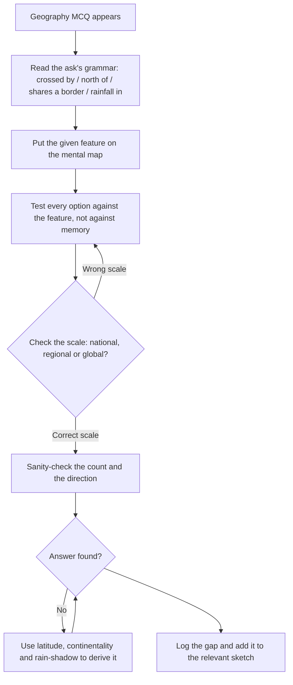

# Geography

Geography questions in a general aptitude paper are not really geography. Almost all of them are **locational reasoning** dressed in a map: given a line, a direction, a climate type or a border, work out which places satisfy a condition. That is a rule, and the rule is teachable. The subject fails students who try to memorise "the physical divisions of India" as a list and then cannot answer a question that puts Kanyakumari and Kutch in the same option. It passes students who learn geography as a **set of relationships** — north to south, east to west, layer by layer, with everything attached to a place. This note builds that structure: the grid, the layers, the adjacency graph, and the method for using each one on a question you have never seen.

### 🟢 Lite — Quick Review (1h–1d)

**What the three question types actually ask**

| Type | The move you make |
| --- | --- |
| "Which of the following is crossed by X?" | Put X on the map, then test each option against it |
| "Which is the southernmost / largest / highest?" | Build an ordered list, then read off the position |
| "A is north of B, C is east of A. Where is C relative to B?" | Convert to compass vectors and add them |

**The four anchors every question leans on**
- **The grid:** latitude runs 0° at the Equator to 90° at the poles; longitude runs 0° at the prime meridian, east and west. North of the Equator is northern latitude, south is southern latitude; east of the prime meridian is eastern longitude.
- **The key lines:** Equator 0°, Tropic of Cancer about 23.5° N, Arctic Circle about 66.5° N, Tropic of Capricorn about 23.5° S, Antarctic Circle about 66.5° S.
- **The Indian extent:** roughly 8°–37° N and 68°–97° E, with the **standard meridian at 82°30′ E** and Indian Standard Time at **UTC + 5:30**.
- **The adjacency graph:** know, for every Indian state, which states touch it. This single graph answers a large share of "which of the following" items.

**The rule that beats memorising lists.** Learn everything as an ordered sequence — states north to south, rivers west to east, soil belts inner to coastal — because an ordered sequence can be searched from either end, while a list can only be searched from the front.

### 🟡 Standard — Regular Study (2d–2mo)

#### The grid and how to use it without a map

Every locational question is really a statement about two numbers. Get used to reading them.

Latitude increases away from the Equator: 0°, then 10°, then 20°, and so on, up to 90° at the poles. Longitude increases away from the prime meridian, which runs through Greenwich: east to the International Date Line at 180° E, and west to 180° W. The two hemispheres that matter are therefore the **Northern and Southern** (separated by the Equator) and the **Eastern and Western** (separated by the prime meridian). A place at 10° S, 20° W is in the Southern and Western hemispheres — and almost every such question can be answered by checking hemispheres alone.

**Worked example — locating by coordinate.** *A place lies at 20° N, 80° E. What is it?* The 20° N line puts it in the Northern Hemisphere and well inside the tropics. The 80° E line, moving east from the prime meridian, runs down through Central Asia, across the Indian subcontinent and into the Bay of Bengal. The intersection falls in **central India**, in the interior — well away from the coasts, which lie nearer 68° E in the west and 97° E in the east. Options naming a coastal location, a location north of 30° N, or a location in the Southern Hemisphere are all eliminated by the coordinates alone, before any memorised fact is used.

Indian Standard Time is a useful one-off to know precisely: India uses the meridian at **82°30′ E**, which is why IST is **UTC + 5:30**. A question asking for the time difference between IST and Greenwich is then arithmetic.

#### Building India in layers, north to south

Do not learn the physical divisions as a list of names. Learn them as **stacked bands**, because that is how the land actually runs and how questions are built.

**Layer 1 — the Northern Mountains.** Three parallel ranges running west to east: the **Himadri** or Greater Himalaya, which contains Kangchenjunga, India's highest peak at 8,586 m; the **Himachal** or Lesser Himalaya, with valleys such as Kashmir and Kangra; and the **Shivalik** or Outer Himalaya, the youngest and lowest. Between the Shivaliks and the plain lie the **Duns**. At the very foot of the Shivaliks is the **Bhabar**, a gravel belt where streams disappear, and immediately south of it the **Terai**, a marshy, forested belt.

**Layer 2 — the Indo-Gangetic Plain.** Built by the Ganga, Yamuna, Brahmaputra and their tributaries. It divides into the **Bhabar and Terai** at the north, the **alluvial plain** in the middle, and the **Delta** at the east where the Ganga, Brahmaputra and Meghna build the Sundarbans. Within the plain, the **Khadar** is the low land beside a river that floods often, and the **Bangar** is the older, higher terrace behind it. A question contrasting Khadar with Bangar, or asking which belt is newest, is answerable from the flood-cycle logic alone.

**Layer 3 — the Peninsular Plateau.** An old, hard, uplifted block. Its main parts are **Malwa** in the north, the **Chota Nagpur** plateau in the east, the **Karnataka** plateau, and the **Telangana** region. Between the plateau and the west coast lie the **Western Ghats**; the discontinuous hills along the east coast are the **Eastern Ghats**. The plateau's **Deccan Trap** of basalt is the parent rock of the black soil, which is the single most useful soil fact in Indian geography.

**Layer 4 — the Desert.** The **Thar** in western Rajasthan, with the **Luni** as its principal river and the dunes giving way to saline lakes on the western edge. The **Banni** grasslands and the **Rann of Kutch** sit to the south-west.

**Layer 5 — the coasts and the islands.** The west coast is narrow, steep and indented, with the **Konkan**, **Kannada** and **Malabar** segments; the east coast is wider and smoother, with the **Coromandel** coast. The **Andaman and Nicobar** islands lie in the Bay of Bengal and are volcanic in origin, while the **Lakshadweep** islands lie in the Arabian Sea and are coral atolls. The sea-versus-origin contrast is a direct question in this topic.

#### Rivers, arranged not listed

**The Himalayan system (perennial, north Indian):** the Indus, Ganga and Brahmaputra, running roughly parallel west to east. **The peninsular system (mostly rain-fed, seasonal):** the Godavari, Krishna, Kaveri, Mahanadi, Brahmani and Tapi. The **Narmada and the Tapti** are the two that flow **west** into the Arabian Sea, and because they enter through estuaries rather than deltas, they are the two that do not build deltas — which is why "which river does not form a delta" is answerable on structure.

The most tested river facts: the **Ganga** is the longest river in the plains and the Yamuna is its longest tributary; the **Brahmaputra** rises in Tibet and enters India through Arunachal Pradesh; the **Indus** rises in Tibet and enters India in Ladakh; the **Godavari** is the longest river of the peninsular system and rises in Maharashtra; the **Kaveri** rises in Karnataka. Learn each with *source + course + basin*, and the ordering questions fall out.

#### Climate: the monsoon mechanism, not the list of seasons

The NCERT four-season division — cold weather (December to February), hot weather (March to May), southwest monsoon (June to September) and retreating monsoon (October to November) — is the frame the exam uses. The mechanism matters more than the frame, because the mechanism generates the questions.

The southwest monsoon advances over the Arabian Sea branch and the Bay of Bengal branch, arriving on the mainland in early June and covering the country by mid-July. It **retreats from the north-west first** in September, and from the southern tip last in December. Consequences you can derive: rainfall decreases from the coast inland; the Western Ghats get a windward-side deluge and the leeward side of the same mountain is dry, which is why the Deccan interior is semi-arid; and the Tamil Nadu coast receives most of its rain in the retreating monsoon season, which is why Chennai is wet in October–December and dry in June. A question about "which region receives most of its rainfall in the retreating monsoon" is answered by the mechanism, not by memory.

**The world belt system** is the same idea at global scale: the **equatorial** belt near the Equator, the **tropical** belts with a wet and a dry season, the **Mediterranean** belt with wet winters and dry summers, the **temperate** belt with year-round rain, and the **polar** belt. Because the belts are driven by latitude, any place's climate can be estimated from its coordinates — which is exactly what a "which of these locations has a Mediterranean climate" question requires.

#### The adjacency graph

Draw a rough map of India, label every state, and write the neighbours of each. Then be able to answer: which state borders the maximum number of others, which two states share a border but are not connected by a named corridor, which state is bordered by exactly one other state in the far north-east. Learn the north-eastern cluster as a block — it is small, it is frequently asked, and it is where most adjacency errors happen.

### 🔴 Extended — Deep Study (3mo+)

#### Six sketches that will hold an entire exam

Instead of reading geography, draw it. Six blank-page sketches, repeated until they are accurate, cover almost everything a general aptitude paper can ask:

- **India's outline with the three Himalaya ranges, the Thar, the plateau, both coasts and both island groups.**
- **The river map** — Indus, Ganga, Brahmaputra, Godavari, Krishna, Kaveri, Narmada, Tapti, each drawn as a line with its source marked.
- **The climate map** — isotherm bands and the four rainfall regimes (heavy on the Western Ghats windward side, moderate on the Gangetic plain, low in the rain-shadow interior, and a second wet season on the Tamil Nadu coast).
- **The soil map** — alluvial in the north, black in the Deccan Trap, red and laterite on the peninsular margins, desert soil in the west, and the coastal alluvium.
- **The world belt diagram** — Equator, tropics, circles, and the climate type each implies.
- **The adjacency graph** — a labelled map with neighbour lists.

The value is diagnostic. Every gap in a sketch is a gap you would otherwise discover in the exam hall, and the act of drawing forces you to know the *shape* of each thing, which is what "which of the following" questions test.

#### The five-pass method for a "which of the following" geography item

- **Pass 1 — read the ask's grammar.** "Crossed by", "lies north of", "receives maximum rainfall in", and "shares a boundary with" each demand a different test. Naming the test first stops you applying the wrong one.
- **Pass 2 — draw the line.** Put the given feature on the mental map: the Tropic of Cancer, the 80° E meridian, the west-flowing river, the leeward side of a mountain.
- **Pass 3 — test each option against the drawn feature.** Not against your memory of the option, against the *feature*. This is the step that converts a vague sense into a decision.
- **Pass 4 — check the scale.** A question about a national scale is not answered by a global fact, and a district-level option is wrong for a country-level question.
- **Pass 5 — sanity-check the count and the direction.** A "how many states" question is verified by counting the traced line west to east, never by recalling a number.

**Worked example.** *Which of the following states is NOT crossed by the Tropic of Cancer?* Pass 2 — the line enters India in Kutch, runs east through Rajasthan, Madhya Pradesh, Chhattisgarh, Jharkhand and West Bengal, and dips to touch Tripura and Mizoram. Pass 3 — test each option against that traced line. Any option on the traced list is eliminated. Pass 5 — the survivor is the option that is either far to the north, far to the south, or on a peninsula outside the line. The count also confirms the list: eight states lie on it, so if an option claims nine, it is wrong by counting.

#### Deriving climate from coordinates

A generalisable method: latitude tells you the solar angle and hence the temperature band; longitude tells you distance from the sea and hence continentality; the presence or absence of a mountain between the place and the wind decides windward or rain-shadow. Apply it to a location you have never heard of and the climate type falls out. This is the highest-leverage method in the topic, because it works on the many items whose specific place name is unfamiliar to you.

**Worked example.** *A coastal city lies at about 34° S on the east side of a continent, and a mountain range runs along that coast. What is its climate?* At 34° S you are in the temperate belt of the Southern Hemisphere. The latitude is too far from the Equator for tropical conditions and too far from the pole for polar. The east coast at this latitude, on the poleward side of the subtropical high, gets prevailing westerlies, and the coastal mountain puts the site in the rain shadow of the prevailing wind. The combination of a temperate latitude, a dry prevailing wind and a mountain barrier gives a **Mediterranean-type dry-summer climate**. Every step was derived; nothing was recalled.

#### The monsoon-derivation drill

Write five questions of the "which region gets rainfall when" type and answer them purely from the mechanism, then check against the map. The reason this drill works is that monsoon questions are the most common climate item in Indian general aptitude papers, and the mechanism generalises to places you have never studied, while a list of rainfall figures does not.

### 🧠 Memory Anchors

- **"North to south, west to east."** Ordered sequences can be searched from either end; lists cannot.
- **"82°30′ E and UTC+5:30."** The standard meridian behind Indian Standard Time.
- **"Bhabar, Terai, Bangar, Khadar."** Four belts from the mountains to the delta, in order, youngest to oldest.
- **"The Narmada and Tapti flow west — and do not build deltas."** One structure answers two questions.
- **"Kerala has two classical dance forms; most states have one."** Learn the exception, not the base case.
- **"Windward side gets the rain."** A mountain decides rainfall for hundreds of kilometres behind it.
- **Flashcard Q&A:**
  - *Which two Indian rivers flow west?* → Narmada and Tapti.
  - *What is the state of the Chota Nagpur plateau?* → Jharkhand, with parts of Chhattisgarh, Odisha and West Bengal.
  - *Which island group is coral and in the Arabian Sea?* → Lakshadweep.
  - *What is the soil of the Deccan Trap called?* → Black soil, or regur.
  - *Which river is the longest in the Indian plains?* → The Ganga.
  - *Which climate belt has wet winters and dry summers?* → The Mediterranean belt, around 30°–40° on the west sides of continents.
  - *Which bay are the Andaman and Nicobar Islands in?* → The Bay of Bengal.
  - *What is the parent rock of black soil?* → Basalt, from the Deccan Trap.

### 🎯 Exam Traps & Error Log

1. **Reading a "which of the following" item from memory instead of tracing the feature on a map.** Tracing is what makes the elimination mechanical rather than hopeful.
2. **Confusing latitude with longitude, or north with east.** A place at 20° N, 80° E is not "80 degrees north".
3. **Answering a national question with a global fact** or a district-level option for a country-level stem.
4. **Forgetting that the two west-flowing rivers do not build deltas.** The estuary consequence is a free second mark.
5. **Reversing the monsoon retreat order.** The monsoon leaves the north-west first and the southern tip last.
6. **Assuming the retreating monsoon is dry everywhere.** The Tamil Nadu coast gets its peak rainfall in the retreating season, which is why Chennai's rain season looks inverted.
7. **Placing the Bhabar and the Terai in the wrong order.** Gravel belt first, marshy belt second, measured from the mountains southward.
8. **Confusing the Konkan, Kannada and Malabar segments with the Coromandel coast.** The east coast has one long name, the west has three.
9. **Guessing a "how many states" answer from memory.** Trace the line and count; the memory number is the one thing guaranteed to be tested wrong.
10. **Learning the physical divisions as names without shapes.** Every "which of the following" question is a shape question in disguise.

### 🧪 Self-Test — 8 Questions with Worked Answers

Do these with a blank page and no map. The skill being tested is the derivation, not the recall.

1. **India uses a standard meridian. Give its longitude and the resulting time offset from Greenwich.** *Worked answer:* **82°30′ E, giving Indian Standard Time = UTC + 5:30.** Method — the grid anchor. India spans roughly 68° E to 97° E, and the meridian chosen for time is the one near the centre of the populated area rather than the geometric centre, because that is where people are. The time offset follows because the Earth turns 15° an hour and 82.5° ÷ 15 = 5.5 hours. The whole answer is derivable from the longitude, so a student who knows only the offset can still reconstruct the meridian and vice versa.

2. **Which Indian rivers flow into the Arabian Sea, and what distinguishes them from the rest?** *Worked answer:* **The Narmada and the Tapti, both rising in Madhya Pradesh.** Method — the direction structure. Every other major Indian river drains east into the Bay of Bengal; these two are the exceptions, which is precisely what makes them examinable. The derived consequence is that they enter the sea through estuaries rather than building deltas, so a follow-up asking which river does *not* form a delta is answered by the same card. Learn the pair as one item.

3. **Explain the order of the Bhabar, Terai and the Gangetic alluvial plain, moving south from the foot of the Himalaya.** *Worked answer:* **Bhabar, then Terai, then the alluvial plain.** Method — the flood-cycle logic. At the mountain foot, streams drop steeply, drop their gravel, and disappear below the boulder bed, which is the Bhabar. South of it the water re-emerges and the slower gradient turns the flow into swamp and forest, which is the Terai. Beyond that the rivers spread out and deposit fine alluvium across the plain. A question asking which belt is the newest, or which is the gravel belt, is answerable from that sequence without memorising the names in isolation.

4. **A city lies at about 34° S on the east coast of a continent with a mountain range running along it. What is its climate, and how did you get there?** *Worked answer:* **Mediterranean-type, with dry summers and wetter winters.** Method — derive it. The latitude puts it in the temperate belt of the Southern Hemisphere, too far from the Equator for tropical and too far from the pole for polar. At this latitude on an east coast the site is on the poleward side of the subtropical high, where prevailing winds are westerlies. Those westerlies blow off the continent, so they are dry, and the coastal mountain puts the site in their rain shadow. Temperate latitude plus dry prevailing wind plus a mountain barrier gives a dry-summer climate. Nothing here was recalled.

5. **Why does the Tamil Nadu coast receive much of its rainfall in October to December while most of India receives it in June to September?** *Worked answer:* **The retreating monsoon.** Method — mechanism, not memorisation. The southwest monsoon withdraws from the north-west first, so the Tamil Nadu coast lies in the path of the returning winds while the rest of the country has already lost its monsoon. The Bay of Bengal branch of the retreating monsoon gives the southeast coast its peak. This single fact explains both the rainfall pattern and the odd inverted rain calendar of Chennai, and it is the answer to a very common style of question.

6. **Give three reasons why a "which of the following" geography question should be answered by drawing rather than by recalling.** *Worked answer:* **First, drawing puts the given feature and the options into the same frame, so each option can be tested rather than guessed. Second, it converts a vague familiarity into a yes or no, which is what elimination needs. Third, it exposes the shape of the answer, and options in these questions are usually wrong shapes — a coast, a peninsula, a wrong latitude band.** Method — the deeper reason is that recall fails silently: you may feel that a coastal Karnataka option is plausible, but only a map tells you the line does not reach it.

7. **Which island group lies in the Arabian Sea, which lies in the Bay of Bengal, and how do they differ in origin?** *Worked answer:* **Lakshadweep lies in the Arabian Sea and is coral; the Andaman and Nicobar group lies in the Bay of Bengal and is volcanic.** Method — the contrast anchor. The two groups are the standard pairing in this topic, and the sea and the origin are stored together, so a question naming either attribute is answered from one card. The distractor that fails students is the one that swaps the sea, because both groups are tropical and both are famous.

8. **You are asked whether a given Indian state shares a boundary with the given one. What is the fastest way to be sure?** *Worked answer:* **Use the adjacency graph, not memory.** Draw the two states, or recall the single labelled map you built during revision, and check whether the borders actually meet. A border is either shared or it is not, and this is a purely factual question with no derivation available — so the only way to be sure is to have the graph stored as a picture. This is the clearest example in the topic of a fact that is worthless without a shape attached to it.

### 💡 Pro Tips

1. **Draw, do not read.** Six sketches repeated will cover more of this paper than three chapters of prose.
2. **Name the ask's grammar before answering.** "Crossed by" and "receives rainfall in" are different questions.
3. **Test options against the drawn feature,** never against your memory of the option itself.
4. **Learn India north to south in bands.** The land is layered, and the questions follow the layers.
5. **Store each river as source + course + basin.** That one card answers ordering and comparison items.
6. **Derive climate from latitude, continentality and rain-shadow** so unfamiliar places are still answerable.
7. **Count traced lines instead of recalling counts.** Counting is reliable; remembered numbers are not.
8. **Build the north-eastern adjacency cluster as a block.** It is small, frequently asked, and the usual source of adjacency errors.

---

## Continue your study

- **[View this topic in your CUET UG roadmap](/roadmap/?exam=cuet&duration=1mo)** — see where "Geography" fits in your personalised plan
- **[Build a quick revision plan](/roadmap/?exam=cuet&duration=1d)** — 1-day sprint covering highest-weight topics
- **[CUET UG exam overview](/exams/cuet/)** — pattern, eligibility, and syllabus
- **[All General Test notes](/notes/cuet/general-test/)** — browse sibling topics in this subject

*Content adapted based on your selected roadmap duration. Switch tiers using the selector above.*
