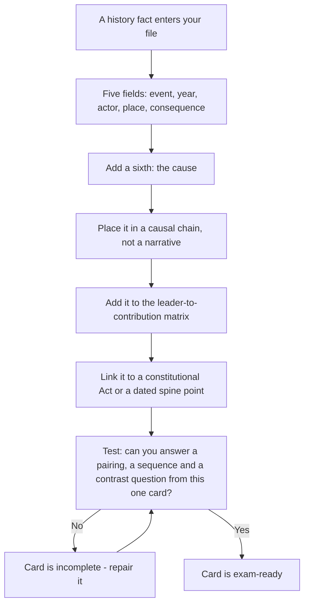

# History

History in a general aptitude paper is not tested as a story. It is tested as a **grid of pairings and dates**, and the grid is finite: a leader, a movement, a year, a treaty, a consequence. Students lose marks here for a specific and fixable reason — they revise history as narrative, in order, so that when a question asks which year belongs to an event in the middle of the sequence, they have to reconstruct a century of context to answer it. Narratives are for reading. Pairings are for marks. This note rebuilds the subject as a set of anchored cards, gives you the causal links that let you derive a date you have forgotten, and explains how to attack a history item whose event you cannot identify at all.

### 🟢 Lite — Quick Review (1h–1d)

**The five-field card.** Every history fact you keep should carry five fields: **event, year, actor, place, consequence**. A card with three fields will not answer a question; a card with five will answer any of the standard forms.

**The four eras and what each is anchored to**

| Era | Anchors |
| --- | --- |
| Ancient | Indus cities, Vedic texts, Maurya and Gupta, Chola |
| Medieval | Delhi Sultanate's five dynasties, the Mughals, Bhakti and Sufi movements |
| Modern (to 1857) | European arrival, Plassey, Buxar, 1857 |
| National movement and after | INC 1885, phases of the freedom struggle, constitutional development, post-1947 |

**The dated spine you must not fumble.** 1857 revolt · 1885 INC founded · 1905 partition of Bengal · 1915 Home Rule · 1919 Jallianwala Bagh · 1920 Non-Cooperation · 1930 Dandi March · 1942 Quit India · 1947 independence · 1949 Constitution adopted · 1950 Constitution in force · 1952 first general election · 1991 economic reforms.

**The one habit that beats chronology practice.** Ask *why* each event happened as well as *when*. Causal links let you rebuild a date; bare dates do not.

### 🟡 Standard — Regular Study (2d–2mo)

#### Ancient India — four anchor clusters

**The Indus civilisation.** Cities with grid-planned streets, baked bricks, drainage systems and standardised weights, at **Harappa, Mohenjo-daro, Dholavira, Rakhigarhi and Lothal**. The script has not been deciphered, so the civilisation is known largely through archaeology — which is itself a favourite point of difference between Harappan and Vedic chronology. Anchor it as: urban, planned, undeciphered, roughly the third millennium BCE.

**The Vedic period.** The **Rigveda** is the oldest of the four Vedas and is largely a collection of hymns; the later Vedas, the Brahmanas, the Upanishads and the epics the **Mahabharata** and **Ramayana** follow it. Do not attach precise dates with confidence — the chronology of the early Vedic period is a matter of scholarly debate, and a question that demands one is testing whether you know it is contested.

**The Mauryan Empire.** Founded by **Chandragupta Maurya** in the third century BCE, expanded by **Bindusara**, and brought to its extent by **Ashoka**, whose Kalinga war is the turning point that turned him towards Buddhist dhamma and produced the **rock and pillar edicts**. The **Third Buddhist Council at Pataliputra** under **Moggaliputta Tissa** is the associated institutional fact. Two Mauryan administrative anchors that recur: the * Arthashastra * attributed to Kautilya (Chanakya) and the mauryan concept of a highway and royal road network.

**The Guptas and the Cholas.** **Chandragupta I** founded the dynasty; **Samudragupta** took the title of "Indian Caesar" in the classical account of his campaigns; **Chandragupta II** is associated with the Sanchi Stupa; **Nalanda** was the era's great university. The **Cholas**, under **Rajaraja I** and **Rajendra I**, built the **Brihadeeswarar temple at Thanjavur** and are remembered for naval expeditions to South-East Asia. The Gupta-Chola contrast — north versus south, temple and learning versus naval power — is a standard comparison item.

#### Medieval India — the Sultanate, the Mughals, the devotional movements

**The Delhi Sultanate** is five dynasties in order: **Mamluk (or Slave)**, **Khalji**, **Tughlaq**, **Sayyid** and **Lodi**. The dynasty order is the easiest thing to test and the most commonly muddled, so learn it as a chant. The most examinable individual is **Muhammad bin Tughlaq**, remembered for the **token currency** experiment and for shifting the capital; **Alauddin Khalji** for market price control; **Iltutmish** for the **Bengal Sultanate**; **Firoz Shah Tughlaq** for canals and towns.

**The Mughals, as a chain.** **Babur** defeated the Lodis at **Panipat in 1526** and defeated Rana Sanga at Khanwa. **Humayun** lost and regained the empire. **Akbar** is the largest node: the **Din-i Ilahi**, the **mansabdari** system, the **abolition of jizya**, and the **Dinpanah** coin. **Jahangir** and his *Tuzuk*; **Shah Jahan** and the **Taj Mahal** and the **Red Fort**; **Aurangzeb**, under whom the empire reached its greatest extent and then began to fracture, with the **removal of jizya** and long wars with **Shivaji** in the Deccan. After Aurangzeb the empire declines quickly, and the vacuum it left is what the 1857 revolt tried to fill.

**The devotional movements** are a different kind of fact and a common source of questions. **Kabir** (weaver-poet of the Bhakti tradition), **Guru Nanak** (founder of **Sikhism**, fifteenth century), **Mirabai** (devotee of Krishna), **Tulsidas** (author of the *Ramcharitmanas*), **Basava** (the Kannada vachana movement in the Deccan) and **Chaitanya Mahaprabhu**. A question naming a movement and asking for its region is answered by these pairings; a question naming a region and asking for its movement is the same card read backwards.

**Vijayanagara** is the last major medieval anchor: founded in **1336** by Harihara and Bukka, capital at **Hampi**, at its height under **Krishnadevaraya**, and destroyed after the battle of **Talikota in 1565**.

#### Modern India — arrival, consolidation, revolt

The European sequence is short and heavily tested. **Vasco da Gama reached Calicut in 1498**, opening the Portuguese route. The **English East India Company received its royal charter in 1600**. The decisive battles are **Plassey (1757)**, which transferred effective power in Bengal, and **Buxar (1764)**. **Warren Hastings** became the first Governor-General of Bengal in 1773.

**The revolt of 1857** is anchored on Meerut, Delhi, **Bahadur Shah Zafar** as the symbolic emperor, **Rani Lakshmibai** of Jhansi, **Tantia Tope**, and **Begum Hazrat Mahal** in Lucknow. The consequences are as examinable as the events: the end of Company rule, the transfer of power to the Crown, and the 1858 proclamation of Queen Victoria as Empress of India, which the 1857 revolt directly caused.

#### The national movement, by phase

Treat it as five phases with one or two names each, and it is a small list.

- **Early nationalist (1885 onwards):** the **Indian National Congress** founded in **1885**; the leaders who matter most here are Dadabhai Naoroji, Gopal Krishna Gokhale and Surendranath Banerjee.
- **Extremist (after 1905):** the **partition of Bengal in 1905** and the **Swadeshi and Boycott** movement; **Bal, Lala and Pal**; the partition was annulled in 1911.
- **Revolutionary:** the Ghadr Party abroad, and in India **Bhagat Singh, Chandrashekhar Azad, Rajguru and Sukhdev**, alongside figures such as **Ram Prasad Bismil** and **Ashfaqulla Khan**. The **Jallianwala Bagh massacre of 1919** and Bhagat Singh's actions at the Central Legislative Assembly are the anchors.
- **Gandhian:** the **Non-Cooperation Movement of 1920** (suspended after Chauri Chaura, 1922), the **Civil Disobedience and the Dandi March of 1930**, the **Quit India Movement of 1942**, and the **Indian National Army** formed overseas by **Subhas Chandra Bose** with the Japanese.
- **Socialist and Ambedkarite:** **Jawaharlal Nehru** and the socialist current, and **B. R. Ambedkar** as the principal voice of the labour and Dalit movements, whose campaigns produced the **Poona Pact of 1932**.

**Constitutional development** is a closed list of Acts and is a reliable source of marks because each Act has one clear purpose: the **Regulating Act 1773** (first recognition of Company political power, and a Governor-General of Bengal), **Pitt's India Act 1784** (the "double government" of the Company and the Crown), the **Charter Acts of 1813, 1833 and 1853** (the 1833 Act creating the Governor-General of India and open competition for civil service exams), the **Government of India Act 1858** (Crown rule, the Secretary of State, and the Viceroy), the **Indian Councils Act 1909** (Morley–Minto reforms, introducing separate electorates by religion), the **Government of India Act 1919** (Montagu–Chelmsford, dyarchy in the provinces), the **Government of India Act 1935** (provincial autonomy and the federal structure), and the **Indian Independence Act 1947** (partition and the two dominions).

#### After 1947

**Integration of the princely states**, with **Sardar Vallabhbhai Patel** and **V. P. Menon** as the two names attached to it, was the first task of the new state. **Hyderabad** was taken in 1948 and **Goa** was liberated in 1961. The **States Reorganisation Act of 1956** redrew the map on linguistic lines — a question about which states were created or reorganised by linguistic demand is answered by knowing that this Act is where the demand was met.

The wars are **1962** against China, **1965** and **1971**; the **Bangladesh Liberation** and the return of **Nagaland to the Indian Union** in 1963 are frequently paired with 1971. The nuclear tests are **Pokhran-I in 1974** and **Pokhran-II in 1998**, the second under the codename **Operation Shakti**. The Emergency of **1975–77** is the other fixed post-independence event. The **economic reforms of 1991** are the pivot of the entire post-1991 economy, and every subsequent question about liberalisation, privatisation or globalisation is downstream of that year.

### 🔴 Extended — Deep Study (3mo+)

#### Causal chains — the thing that makes dates derivable

A date you have memorised is a date you will lose. A date you can *reconstruct from a cause* is a date you will keep, because in the exam the cause is usually still available to you even when the date is not. So every card gets a fourth field: **why did this happen?**

The Indian National Congress exists because political association appeared necessary to a new professional class; the partition of Bengal in 1905 exists because the partition was meant to break the nationalist base, and it produced the Swadeshi movement instead; the Non-Cooperation Movement of 1920 exists because the Rowlatt Act and the Jallianwala Bagh massacre of 1919 destroyed faith in gradual constitutionalism; the Dandi March of 1930 exists because a salt tax was a tax everyone could see and everyone felt; the Quit India Movement of 1942 exists because the Second World War made continued cooperation impossible; the Government of India Act 1935 exists because the round-table conferences failed and the Government of India Act 1919 could not be made to work.

Now read the causal chain aloud and you will notice you can date events relative to one another even without a single number: the massacre precedes Non-Cooperation, which precedes Civil Disobedience, which precedes Quit India, which precedes independence. A question that gives you one of these as a clue and asks for another becomes a spacing question rather than a recall question.

#### The matrix method: leader to contribution

Build a two-column matrix. Left column: every leader you know. Right column: the specific contribution you would answer with. Fill it until each name has exactly one entry — not three. A leader with three entries is a leader you cannot answer for; a leader with one confident entry is a leader you can.

- **Gandhi** — non-violence, the three mass movements, and the Dandi March.
- **Nehru** — the socialist current, and the Tryst with Destiny speech on the eve of independence.
- **Ambedkar** — the labour movement, the Dalit movement, and the principal architect of the Constitution.
- **Bose** — the Indian National Army and the Azad Hind government formed abroad.
- **Gopal Krishna Gokhale** — the moderate leader, mentor to Gandhi, and the advocate of gradual constitutional progress.
- **Lala Lajpat Rai** — the Punjab, the "young India" stream, and the leadership of the boycott after the partition of Bengal.
- **Bipin Chandra Pal** — the Swadeshi and the "nationalist" alternative to the moderates.
- **Rajendra Prasad** — the presidency of the Constituent Assembly.
- **Sarojini Naidu** — the first Indian woman to preside over the Indian National Congress, and later the first woman Governor of an Indian state.
- **Bhagat Singh** — revolutionary action in the Assembly, and the symbol of the revolutionaries.
- **V. P. Menon** — the integration of the princely states.
- **Raja Rammohun Roy** — the reform of religious practice, and the Brahmo Samaj.

#### Attacking an item whose event you cannot identify

Some history questions name an event you have simply never met. A method that still works:

- **Read the actors.** If the stem names a year and a place and a ruler you recognise, you have an era, and the event is probably a battle, a treaty or a rebellion from that era.
- **Read the verb.** "Signed", "founded", "reigned", "revolted" and "abolished" each imply a category of answer.
- **Type-test the options.** A treaty cannot be a ruler; a battle cannot be a document. This pass frequently removes two options.
- **Use elimination on the modifier.** If the stem's year falls in the nineteenth century, any option from the sixteenth is dead on date alone.
- **Fall back on the era.** If two options remain and you know only the era, choose the one whose other fields — actor, place — are consistent with what the stem gave you.

**Worked example.** *Stem: "Which treaty ended the Anglo-Mysore war in which Tipu Sultan was defeated?"* You may not recall the treaty's name. You do know the actor and the era. Type-test: the options will be a mix of treaties, wars and rulers — anything that is a person is dead, anything that is a war rather than a treaty is dead. The **Treaty of Seringapatam (1792)** is the treaty that ended it, and if two treaty names survive, the one whose *place* matches the campaign's theatre is the one. Note the trap that catches students: the war with **Hyder Ali** ended earlier, and the treaty of 1792 is the one that ended the war with **Tipu Sultan**. Matching the actor to the treaty is the whole solution.

#### What history MCQs actually test

Look at the shape of the questions and a pattern appears: they ask for a **pairing** (who with what), a **date** (which year), a **sequence** (which came first), a **cause** (because of which event) and a **contrast** (which statement is correct about X). Of these, pairing and contrast are learnable, sequence and cause are derivable if you know the causal chain, and dates are the weakest. That is why this note spends its effort on pairings, chains and contrasts: they are the three question types with a method, and they are also the three that account for most of the paper.

### 🧠 Memory Anchors

- **"Cause, not chronology."** If you know why it happened, you can date it approximately even if the number is gone.
- **"1857 ends Company rule; 1858 starts Crown rule."** The two years are a classic two-date item.
- **"1949 adopted, 1950 in force."** Two documents, one Constitution, always paired.
- **"Five dynasties, one chant."** Mamluk, Khalji, Tughlaq, Sayyid, Lodi.
- **"1935 for provinces, 1919 for dyarchy, 1909 for separate electorates."** One Act, one purpose.
- **"1947 to 1956 is the map-fixing decade."** Integration, then linguistic reorganisation.
- **Flashcard Q&A:**
  - *Who founded the INC and when?* → 1885, at Bombay, as a professional body.
  - *Which event turned Gandhian strategy?* → The Jallianwala Bagh massacre of 1919.
  - *Who wrote the Arthashastra?* → Kautilya, adviser to Chandragupta Maurya.
  - *Which war ended with the Treaty of Seringapatam?* → The second Anglo-Mysore war, 1792.
  - *Which Act first proposed dyarchy in the provinces?* → The Government of India Act of 1919.
  - *What was the Azad Hind government?* → The provisional government formed abroad by Subhas Chandra Bose with the INA.
  - *Which two Ambedkarite campaigns preceded the Poona Pact?* → The temple-entry and the separate electorates movements.
  - *What was Operation Shakti?* → The 1998 Pokhran-II nuclear tests.

### 🎯 Exam Traps & Error Log

1. **Saying the Constitution was adopted in 1950.** It was adopted on 26 November 1949 and came into force on 26 January 1950.
2. **Confusing the 1857 revolt with the 1858 Act.** The revolt ended Company rule; the Act that followed transferred power to the Crown.
3. **Attributing the partition of Bengal to 1911.** The partition was 1905; the annulment was 1911.
4. **Ending Non-Cooperation at the exact wrong trigger.** It was suspended after the Chauri Chaura incident of 1922, not because of any constitutional decision.
5. **Naming the treaty for the wrong Mysore war.** The 1761 defeat was against Hyder Ali; the 1792 Treaty of Seringapatam is the one that ended the war with Tipu Sultan.
6. **Giving the freedom-struggle phases in a single undifferentiated block.** The five phases are the structure; losing them turns the topic into memorisation.
7. **Confusing 1909 separate electorates with 1935 provincial autonomy.** Two Acts, two different reforms.
8. **Assuming the 1935 Act granted dominion status.** The Indian Independence Act of 1947 did that.
9. **Learning years as a bare list.** Dates without causes are the first thing lost under pressure.
10. **Answering a two-date question with one date.** When a question offers both 1949 and 1950 as options, the test is which verb follows.

### 🧪 Self-Test — 8 Questions with Worked Answers

Answer closed-book, then check the worked solution. Where you miss, repair the card rather than re-reading the chapter.

1. **The Constitution of India was adopted on 26 November 1949 and came into force on 26 January 1950. Why is the distinction tested?** *Worked answer:* **Because the test is which verb follows each date.** "Adopted" refers to the signing by the Constituent Assembly, and "in force" refers to the day the Constitution began to govern. Republic Day is 26 January precisely because that is when it became operative, not when it was signed. The general lesson is that in history questions the option that is otherwise correct is usually wrong in exactly one word, so read the verb in the stem and in the option together.

2. **Name the dynasty that ended the Delhi Sultanate period and the dynasty that followed it.** *Worked answer:* **The Sayyid dynasty, followed by the Lodi dynasty.** Method — the five-dynasty chant: Mamluk, Khalji, Tughlaq, Sayyid, Lodi. The Lodi dynasty is the last, and it is the one the Mughals displaced at Panipat in 1526, which links the medieval and modern sections of the timeline. Learning the order as a chant removes the commonest error in this area, which is to put the Khalji dynasty last because Ibn Battuta's account of it is the most famous.

3. **What was the Dandi March, when did it happen, and what was its immediate cause?** *Worked answer:* **The Dandi March of 1930, when Mahatma Gandhi walked from Sabarmati to Dandi to break the salt law by making salt from seawater. The immediate cause was the imposition of a salt tax on an essential commodity, chosen because every Indian could see and feel it.** Method — the causal chain. Because the item asks for a *cause*, the answer must include the reason and not only the year. The chain that matters runs: the 1919 massacre produces Non-Cooperation, which is withdrawn, which produces the demand for complete independence, which produces Civil Disobedience, which begins with the salt march.

4. **Which Act introduced provincial autonomy and dyarchy in the provinces, and which earlier Act was its failed predecessor?** *Worked answer:* **The Government of India Act of 1935 provided provincial autonomy, and the Government of India Act of 1919 (Montagu–Chelmsford) was its failed predecessor, which had introduced dyarchy in the provinces.** Method — one Act, one purpose. A question phrased as "the Act that followed the failure of" is a chain question, so learn the Acts as a sequence: Regulating 1773, Pitt's 1784, Charter 1813/1833/1853, Government of India 1858, Indian Councils 1909, Government of India 1919, Government of India 1935, Independence 1947. The sequence is the syllabus.

5. **Name the two wars fought between India and China and the years.** *Worked answer:* **1962 and 1965.** Method — a simple pairing item. The trap is the 1971 war, which was against Pakistan and led to the creation of Bangladesh, and the 1962 war is frequently mis-stated as 1960 by students who confuse it with Chinese occupation of Tibet. If you know only that there were two Sino-Indian wars in the 1960s, you can still eliminate every 1970s option.

6. **Tipu Sultan was defeated in a war that ended with a treaty. Which treaty, and what is the standard trap?** *Worked answer:* **The Treaty of Seringapatam, 1792.** Method — match the actor to the treaty. Hyder Ali's earlier defeat and the 1761–63 war are different events, and the trap is answering with a treaty from that earlier conflict. Type-test the options first: a treaty cannot be a ruler and cannot be a war, which usually removes half of them before you need any history at all.

7. **Which movement was launched in 1920, suspended in 1922, and what caused the suspension?** *Worked answer:* **The Non-Cooperation Movement, launched 1920 and suspended after the Chauri Chaura incident of 1922**, when a violent clash led Gandhi to call it off. Method — the three-part card: movement, dates, cause of the end. A question that gives you only the dates 1920 and 1922 and asks for the movement is therefore answerable from two numbers. This is the argument for storing dates as numbers you can search rather than as a list you must traverse.

8. **The Azad Hind government and the Indian National Army were formed by which leader, and in what context?** *Worked answer:* **Subhas Chandra Bose, formed abroad with Japanese support during the Second World War, operating as a provisional government-in-exile and a military force aimed at freeing India from British rule.** Method — the post-1947-free section of the timeline is not a list of domestic events; a substantial part of it happened outside India. Storing the movement phase under Bose alongside the Gandhian phase keeps the five-phase structure of the freedom struggle complete, and it prevents the common error of ending the narrative at 1942.

### 💡 Pro Tips

1. **Keep five fields, and insist on the cause.** A card with a cause survives; a card with only a date does not.
2. **Learn the constitutional Acts as a sequence.** Each Act has exactly one purpose and the sequence is the syllabus.
3. **Fill the leader-to-contribution matrix with one entry per leader.** Three entries per leader means none.
4. **Practise the five phases aloud.** Phases are the fastest way to bound an unfamiliar question.
5. **Type-test options on every unknown item.** A treaty is not a ruler, and that alone sometimes settles the question.
6. **Anchor every date to a neighbouring event** so it can be re-derived if it is lost.
7. **Learn the Acts, the dynasties and the years as chants.** Order is the structure; loose lists have none.
8. **Do not stop history at 1947.** The map-fixing decade, the wars, the tests and 1991 are all examinable, and they are the part of the timeline most students skip.

---

## Continue your study

- **[View this topic in your CUET UG roadmap](/roadmap/?exam=cuet&duration=1mo)** — see where "History" fits in your personalised plan
- **[Build a quick revision plan](/roadmap/?exam=cuet&duration=1d)** — 1-day sprint covering highest-weight topics
- **[CUET UG exam overview](/exams/cuet/)** — pattern, eligibility, and syllabus
- **[All General Test notes](/notes/cuet/general-test/)** — browse sibling topics in this subject

*Content adapted based on your selected roadmap duration. Switch tiers using the selector above.*
