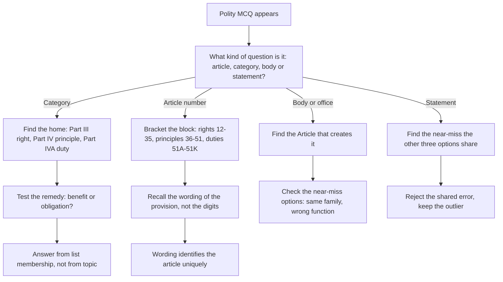

# Polity

Polity is the most *structural* subject in the General Test, and that is why it is the most learnable. Nothing in it changes with the news cycle: the rights sit in Articles 12 to 35, the Directive Principles sit in Part IV, the duties sit in Part IVA, the writs have fixed meanings, and the amendment power has a fixed address. The students who lose marks here do not lack knowledge — they have *lists* rather than a *map*, so a question that says "which of the following is a Directive Principle rather than a Fundamental Right" defeats a student who can recite all six rights but has never seen them in their constitutional neighbourhood. This note rebuilds the subject as a map: what lives where, which things look alike and must be kept apart, and how to answer a provision question when you have forgotten the article number.

### 🟢 Lite — Quick Review (1h–1d)

**The four kinds of question, and the test for each**

| Kind of question | The test that answers it |
| --- | --- |
| "Which Article provides for X?" | Find the number-block X sits in |
| "Is X a Right, a Principle or a Duty?" | Find the Part, not the topic |
| "Which body performs X?" | Find the Article that creates it |
| "Which is the correct statement about X?" | Find the near-miss the other options share |

**The number map — where each thing lives**

- **12–35** — Fundamental Rights. **Article 32** is the one that enforces them.
- **36–51** — Directive Principles of State Policy. Article 37 states the general principle.
- **51A–51K** — Fundamental Duties, added by the **42nd Amendment (1976)**, borrowed from the Irish Constitution of 1937.
- **74** — Rajya Sabha, 238 elected and 12 nominated. **80** — Rajya Sabha's constitution. **81** — Lok Sabha's constitution.
- **76** — Attorney General. **148** — Comptroller and Auditor General. **280** — Finance Commission. **315** — Public Service Commissions. **324** — Election Commission of India.
- **352 / 356 / 360** — National Emergency, President's Rule in a state, Financial Emergency.

**The three pairs that must never be confused**
- **Adopted 26 November 1949 / in force 26 January 1950.**
- **Seventh Schedule List I / II / III** (legislative subjects) versus **the list of Fundamental Rights** (Part III). Both are "three lists", and they are unrelated.
- **Certiorari and Prohibition** — one brings an order up, the other stops an order going further.

**The single most useful habit.** Do not learn a provision without its article number, and do not learn an article number without knowing the Part it belongs to. One of the two will save the other.

### 🟡 Standard — Regular Study (2d–2mo)

#### The architecture

The Constitution has a **Preamble** declaring India a Sovereign Socialist Secular Democratic Republic, and a body of Parts. Four of them carry almost all the marks:

- **Part III** — Fundamental Rights.
- **Part IV** — Directive Principles of State Policy, non-enforceable by any court, but "fundamental in the governance of the country" and the standard against which courts read the Constitution.
- **Part IVA** — Fundamental Duties, the newest Part, added in 1976 and placed *after* the Directive Principles, a placement that matters because it tells you the framers saw duties as a natural sequel to principles.
- **Part V** — the Union executive and legislature, and Part VI the States, with the two mostly parallel so you can learn one and transfer it.

**Article 13** deserves a line of its own. It says that laws inconsistent with the Fundamental Rights are void, and it also says that "the laws" include pre-Constitution laws. That retroactivity clause is why pre-1950 legislation can be tested against the rights, and it is the reason the subject is not just a list of articles.

#### Fundamental Rights, article by article

**Right to Equality (14–18):** equality before the law (14) and equal protection of the laws (15) — the distinction is that 14 is a *rule of law* and 15 is a *substantive* guarantee, which is one of the most tested pairs in the subject. Then reservations for backward classes (15(4), 16(4)), equality of opportunity in public employment (16), and abolition of untouchability (17).

**Right to Freedom (19–22):** **Article 19** lists six freedoms — speech and expression, assembly, association, movement, residence, and profession — each of which carries "subject to reasonable restriction" clauses that differ between them. Protection against conviction for offences (20), protection of life and personal liberty (21), and protection of children below fourteen years of age (21A, added by the 42nd Amendment). **Article 21** is the most litigated article in Indian constitutional history and is a standing favourite in any exam.

**Right against Exploitation (23–24):** prohibition of traffic in human beings and forced labour, and prohibition of employment of children below fourteen years in factories and hazardous work.

**Right to Freedom of Religion (25–28):** freedom of conscience and free profession, practice and propagation of religion, freedom to manage religious affairs, no religious instruction in educational institutions maintained wholly or partly by the State, and freedom from taxes for promotion of a particular religion.

**Cultural and Educational Rights (29–30):** protection of the interests of minorities, and the right of minority educational institutions to establish and administer.

**Right to Constitutional Remedies (32):** the enforcement article, and the only Fundamental Right itself available directly to a citizen without first going to a court. Five writs issue under it, and their meanings are pure definitions:

- **Habeas corpus** — "you may have the body": produce a detained person before the court, to examine the legality of detention.
- **Mandamus** — "we command": the court orders a public authority to perform a duty it has failed to perform.
- **Prohibition** — an order to a lower court or authority to stop proceedings that are beyond its jurisdiction.
- **Certiorari** — "to be certified": the court brings up and quashes the order of a lower court or authority acting beyond its jurisdiction or in error of law.
- **Quo warranto** — "by what authority": the court asks a person to show under what authority they are holding a public office.

The distinction students lose is **Prohibition versus Certiorari**: prohibition stops a proceeding *going further*, certiorari pulls in an order *already made*. One is preventive, one is curative.

#### Directive Principles and Fundamental Duties

The Directive Principles are grouped around four aims: **socialistic** (equal pay, living wage, promotion of cottage industries, prohibition of intoxicating drinks and child labour), **Gandhian** (village panchayats, promotion of cottage industries, khadi, prohibition of cow slaughter, education), and **libertarian** (uniform civil code, provision of free and compulsory education for children, separation of the judiciary from the executive, promotion of international peace and security). A question asking "which principle does this belong to" is asking you to name the *aim*, not the article.

Two Principles are so heavily tested that they are worth individual cards: **Article 40** on the organisation of village panchayats, and **Article 44** on a uniform civil code for the citizens. The three-tier Panchayati Raj structure that Article 40 envisages is the same structure the 73rd Amendment constitutionalised, and the connection between them is a standard question.

The **Fundamental Duties** are a closed list of eleven, and the ones that get asked are the ones that name an institution or a value: respect the National Flag and the National Anthem, cherish the noble ideals of the freedom struggle, uphold the sovereignty, unity and integrity of India, protect and improve the natural environment, develop the scientific temper, safeguard public property and abjure violence, strive towards excellence, and take part in the common defence and security. The Duty to provide education for children aged six to fourteen was added later, by the 86th Amendment, which is a useful illustration that the list itself is amendable.

#### Constitutional bodies — body to function, in one card

- **The Comptroller and Auditor General (Article 148):** audits the accounts of the Union and the States and of bodies substantially financed from public funds, and reports to Parliament. Note that CAG is independent of executive control, which is the point repeatedly tested.
- **The Election Commission of India (Article 324):** superintends the conduct of elections, and is equal in rank to a Cabinet minister but is not a minister.
- **The Union Public Service Commission (Article 315):** recruitment to the central civil services, on the advice of the State Public Service Commissions for the all-India services. The UPSC advises; the executive makes the final appointment.
- **The Finance Commission (Article 280):** a constitutional body, appointed every fifth year as the Constitution directs, which recommends the vertical distribution of tax proceeds between the Centre and the States and the horizontal distribution among the States.
- **The Attorney General (Article 76):** the highest law officer of the country, appointed under the President, a member of the Council of State, and by convention a member of the Cabinet. The **Solicitor General** and **Advocate General** are not constitutional offices under the same article, and a question that offers all three is testing exactly this.
- **The Chief Election Commissioner and Chief Justice of India** are constitutional office-holders under the relevant articles, and both are removable only by the same impeachment route as a judge.

#### Parliament, the Emergency, and amendment

**The two Houses.** Article 81 for the House of the People, Article 80 for the Council of States, and the standard is the composition: the **Rajya Sabha** has a maximum of 250 members of whom **12 are nominated by the President** and 238 are elected by the State legislatures; the **Lok Sabha** has a maximum strength of 550, of whom not more than 550 are elected by the people — the point being that the two Houses are constitutionally maximums, not fixed working strengths, and that the nominated Rajya Sabha members are the distinctive feature. The **Speaker of the Lok Sabha** is elected from among its members, and the **Vice-President of India** is the ex officio Chairman of the Rajya Sabha.

**The Emergencies.** **Article 352** is the national emergency, requiring a written recommendation from the Union Cabinet and approval by both Houses within a month. **Article 356** is President's Rule, which begins when the President is satisfied that a state government cannot be carried on and asks the State's Governor to report, with the approval of both Houses required within two months. **Article 360** is the financial emergency. The often-asked contrast is that 352 is for national stability, 356 is for a state government's inability to function, and 360 is for financial instability.

**Amendment.** The power is in **Article 368**, and the procedure — a bill passed by each House by a special majority, then ratified by the State legislatures — is the part that is always asked. Three parts of the Constitution cannot be amended under Article 368: the **election of the President, its extent and the manner of election, and its term of office**. The substantive limit is the **basic structure doctrine**, which holds that Parliament's amending power does not extend to altering the framework of the Constitution, a doctrine the Supreme Court developed beginning with the **Kesavananda Bharati** decision. A question may ask you to name the case; it may also ask only for the idea, and the idea is what survives.

**Special provisions.** The **Tenth Schedule** holds the anti-defection provisions added by the **52nd Amendment of 1985**. Article 371 and its successors provide special provisions for certain States. And **Article 35A**, for years read as conferring special status on Jammu and Kashmir, was rendered inoperative in 2019 when Parliament decided that J&K would be reorganised into two Union Territories with legislature-less status — a case in which the constitutional position has genuinely changed, so the durable knowledge is the mechanism, not an old label.

### 🔴 Extended — Deep Study (3mo+)

#### The wrong-list method — how to answer "which of these is a right / principle / duty"

A large family of polity questions is built by mixing items from three lists and asking you to pick the member of one named list. The four options are deliberately drawn from all three, so topic knowledge is useless and list membership is everything. The method:

- **Locate the item's home.** Is it enforceable by a court in the first instance? Then it is in Part III, the Fundamental Rights. Is it a guideline for the State, with no remedy? Then it is a Directive Principle in Part IV. Is it a citizen's obligation? Then it is a Fundamental Duty in Part IVA.
- **Test the remedy.** If the item promises a benefit to the citizen, it is usually a Right or a Principle; if it imposes a duty, it is a Duty. This is a fast heuristic and it is right far more often than it is wrong.
- **Use the strongest counter-examples.** "Right to Education" sounds like a right but the underlying Constitutional obligation is a Directive Principle under Article 21A, with the right to education itself given statutory force. "Equal pay for equal work" reads like equality but it is a Directive Principle. These borderline items are precisely what the question is testing, so store the border cases deliberately.

**Worked example.** *Options: (a) promotion of cottage industries in rural areas; (b) freedom of speech; (c) to protect and improve the natural environment; (d) abolition of untouchability. Which is a Fundamental Duty?* Apply the home test. Freedom of speech is Part III and abolition of untouchability is Article 17, both rights. Promotion of cottage industries in rural areas is a Gandhian Directive Principle in Part IV. Protection of the natural environment is a Fundamental Duty under Part IVA, inserted in 1976. The answer is (c), and note that the structure — two rights, one principle, one duty — is the shape the options are always in.

#### Reconstructing a forgotten article number

Article numbers are not arbitrary, and the blocks have a logic that lets you bracket a number you have lost. Suppose a question asks which article creates the Election Commission and you have forgotten the number.

- Bracket it by **neighbours you do know.** The Attorney General is 76 and the Comptroller and Auditor General is 148, and the Comptroller's number tells you that the constitutional organs of the Union are being created across this range rather than clustered at one end.
- Bracket it by **Part.** The provisions on the Union executive and the judiciary sit in Part V, which follows the States in Part VI only in part numbering, so the election machinery sits in the same numeric neighbourhood as the Union's own organs.
- Bracket it by **purpose.** Article 324 concerns "superintendence, direction and control of elections to Parliament, to the office of the President and to the legislatures of States", and the only article in the Constitution whose subject is elections is the one the question is asking about. So if you can recall the *wording* of the provision even without the number, you have a unique referent.

That third step is the general lesson. In a numbered document, the *text* of a provision identifies it uniquely even when the *number* is gone, and a partial recollection of the text is far more reliable than a partial recollection of the digits.

#### Comparing the three lists — the most common trap

Constitution students routinely mix up the **list of Fundamental Rights** with the **Seventh Schedule's three lists of legislative subjects**, and the two Shared lists of the Centre and the States. Set them side by side and the confusion disappears:

- **Fundamental Rights** are in Part III, are justiciable, and are addressed to the citizen. There are six groups and they occupy Articles 12 to 35.
- **Seventh Schedule List I** is Union subjects, **List II** is State subjects, and **List III** is Concurrent subjects on which both may legislate. These concern *legislation*, not *rights*.
- **The two Shared Lists** in Part XI of the Fourth Schedule are administered by the Governor of a State but are not of local application, which is a different arrangement again.

A question that says "which of the following is a Union subject under the Seventh Schedule" is answered by the second row alone. The trap works because the two frameworks share the words "list" and "three", and a student who has memorised one has a false confidence about the other. Learning them as a side-by-side table rather than two separate lists is the whole defence.

#### A sensible revision order for this topic

1. **Article blocks**, so that any number can be bracketed. One evening.
2. **The six rights and the five writs**, with the Rights-to-Principles contrast kept in the same place. The most examinable content in the subject.
3. **Constitutional bodies, body to function**, as a two-column table. One evening.
4. **The Emergency articles, the amendment procedure and the Schedules.** These are structural and they recur across papers.
5. **The borderline cases last** — the items that straddle a Right, a Principle and a Duty — because they only make sense once the lists are in place.

### 🧠 Memory Anchors

- **"12–35, 36–51, 51A–51K."** Rights, Principles, Duties. Three blocks, three Parts, in that order.
- **"Certiorari pulls up; Prohibition stops."** Curative versus preventive is the whole distinction.
- **"CAG audits, UPSC advises, EC supervises, FC distributes."** Four bodies, four verbs, no overlap.
- **"352 is national, 356 is a state, 360 is the treasury."** Three emergencies, three triggers.
- **"Three lists in Part III, three lists in the Seventh Schedule, and they are not the same lists."**
- **"Wording finds the article, not digits."** In a numbered document, the text is the reliable key.
- **Flashcard Q&A:**
  - *Which Article provides the right to constitutional remedies?* → Article 32.
  - *Which writ means "we command"?* → Mandamus.
  - *Which writ asks by what authority a person holds office?* → Quo warranto.
  - *Which Article creates the Election Commission?* → Article 324.
  - *Which Article creates the Comptroller and Auditor General?* → Article 148.
  - *Which Article deals with village panchayats?* → Article 40, a Directive Principle.
  - *Which amendment added the Fundamental Duties?* → The 42nd, 1976.
  - *Which amendment brought the anti-defection law?* → The 52nd, 1985, with the Tenth Schedule.
  - *How many Rajya Sabha members are nominated?* → 12, under Article 80.
  - *What is the term of the Rajya Sabha?* → A permanent House, one-third of its members retiring every second year.

### 🎯 Exam Traps & Error Log

1. **Confusing Fundamental Rights with Directive Principles.** They sit in adjacent Parts, both are "fundamental", and only the Rights are enforceable by a court.
2. **Confusing Article 14 (rule of law) with Article 15 (protection of laws).** The distinction is procedural versus substantive and is a standard item.
3. **Swapping Prohibition and Certiorari.** One stops a proceeding, the other quashes a completed order.
4. **Mixing the Part III rights with the Seventh Schedule's Union, State and Concurrent lists.** Two different "three lists" in the same document.
5. **Treating the Directive Principles as unenforceable and therefore unimportant.** They are the interpretive standard the courts read the Constitution through.
6. **Saying the Comptroller and Auditor General audits only central accounts.** State accounts and publicly funded bodies' accounts are within its scope.
7. **Confusing the Attorney General with the Advocate General or the Solicitor General.** Only the Attorney General is a constitutional office under Article 76.
8. **Attributing the Election Commission's power to the Chief Election Commissioner alone.** The Commission as an institution superintends elections.
9. **Naming a State-level body as the answer to a Union-level question,** or vice versa. Part V and Part VI are parallel, and the trap is the mix-up.
10. **Believing every article number can be recalled on demand.** It cannot, and the note's own advice is to bracket the block and reconstruct the wording.

### 🧪 Self-Test — 8 Questions with Worked Answers

Work these closed-book. Where you cannot place an item in a Part, use the remedy test — is it enforceable, or is it a guideline?

1. **Which of the following is a Fundamental Duty rather than a Directive Principle: (a) promotion of cottage industries in rural areas, (b) freedom of speech, (c) protection of the natural environment, (d) abolition of untouchability?** *Worked answer:* **(c) protection of the natural environment.** Method — the home test. Freedom of speech is a Fundamental Right in Part III, and abolition of untouchability is Article 17, also a Right. Promotion of cottage industries in rural areas is a Gandhian Directive Principle in Part IV. Protection of the natural environment is a Fundamental Duty in Part IVA. The options are deliberately two rights, one principle and one duty, so the answer is the only option whose *category* matches the stem.

2. **A court orders a public authority to perform a duty it has failed to perform. Which writ is that?** *Worked answer:* **Mandamus.** Method — the word means "we command", and the situation is a command to a public authority to do what the law requires of it. Contrast it with the four others: habeas corpus concerns producing a detained person, prohibition stops a lower court from proceeding further, certiorari brings up and quashes an order already made, and quo warranto asks by what authority a person holds a public office. Only mandamus is about compelling performance of a duty.

3. **Give the difference between certiorari and prohibition.** *Worked answer:* **Prohibition prevents a proceeding or action from going further, and is issued against a lower court or authority that is acting beyond its jurisdiction. Certiorari brings up and quashes an order that has already been made by a lower court or authority acting beyond its jurisdiction or in error of law.** Method — memorize the direction of travel: prohibition pushes back on a proceeding in progress, certiorari pulls up a completed order. If the stem says "a proceeding is ongoing", the answer is prohibition; if it says "an order has been passed", the answer is certiorari. The stem's verb settles the question.

4. **The Constitution was adopted in 1949 and came into force the following January. Give both dates and say why the distinction is tested.** *Worked answer:* **Adopted on 26 November 1949 and in force on 26 January 1950.** Method — the verb test. "Adopted" is the signing by the Constituent Assembly; "in force" is the day the Constitution began to operate. Republic Day is 26 January because that is the operative date, not the signature date. A question offering both years is testing whether you read the verb in the option, so read the verb before you read the year.

5. **Name the constitutional body that recommends the distribution of tax proceeds between the Centre and the States, and give its article.** *Worked answer:* **The Finance Commission, under Article 280.** Method — body to function. It is a constitutional body, appointed at intervals the Constitution directs, and it advises on the vertical division of resources between the Centre and the States and the horizontal division among the States. The distractors are the other constitutional bodies — the Election Commission under Article 324, the CAG under Article 148, the UPSC under Article 315 — so the answer is found by function even if the article number is only half-remembered.

6. **Distinguish Article 352 from Article 356.** *Worked answer:* **Article 352 is the national emergency, proclaimed when the security of India or public order is threatened, on the written recommendation of the Union Cabinet and subject to approval by both Houses within a month. Article 356 is President's Rule, which begins when the President, on the Governor's report, is satisfied that a state government cannot be carried on, and requires both Houses' approval within two months.** Method — the scope test. 352 is about the country, 356 is about a state, and the trigger in each case is different. A stem that names a state government that has "ceased to function" is a 356 item, and a stem that names a threat to the sovereignty or integrity of India is a 352 item.

7. **Which Part of the Constitution cannot be amended under Article 368?** *Worked answer:* **The provisions relating to the election of the President, the extent and manner of that election, and the term of office of the President.** Method — the procedure first. Amendment is by Article 368, requiring a special majority in each House and ratification by at least half the State legislatures. Within that procedure, three provisions are beyond the reach of amendment, and the Supreme Court has read the basic structure doctrine into the article to protect the framework itself. Stating the three provisions is worth more than naming the case, because the provisions are stable and the case name is not always the point of the question.

8. **You are asked which article creates the Comptroller and Auditor General and you have forgotten the number. How do you recover it?** *Worked answer:* **Bracket the block, then recall the wording.** CAG is created by a single article in Part V, in the same numeric range as the other constitutional authorities of the Union — the Attorney General sits at 76 and the Election Commission at 324, so the financial audit authority is bracketed between them in the body of provisions creating Union institutions. More usefully, recall that the article says the Comptroller and Auditor General shall be appointed by the President and shall have the same removal procedure as a judge, and that his functions include the audit of the accounts of the Union and the States. That wording is unique to one article, and in a numbered document the wording identifies the article even when the digits are gone.

### 💡 Pro Tips

1. **Store every provision with its number and its Part.** One of the two will rescue the other under pressure.
2. **Keep the Rights, Principles and Duties in the same table, side by side.** The category is what these questions test, and side-by-side is the only layout that shows the category.
3. **Learn the five writs from their meanings, not their numbers.** "We command" and "you may have the body" are unrehearsable-away facts.
4. **Brackets beat digits.** If you know the block a provision sits in, you can often answer a category question without the number.
5. **Put the two "three lists" in one table, in one sitting.** Never revise them separately.
6. **Memorise body-to-function, not body names.** The function is what an MCQ offers as the options.
7. **Learn the Emergency articles as scope, not numbers.** National, state, financial.
8. **Save the borderline cases for last,** and revise them as contrasts — right versus principle, Article 14 versus 15, certiorari versus prohibition.

---

## Continue your study

- **[View this topic in your CUET UG roadmap](/roadmap/?exam=cuet&duration=1mo)** — see where "Polity" fits in your personalised plan
- **[Build a quick revision plan](/roadmap/?exam=cuet&duration=1d)** — 1-day sprint covering highest-weight topics
- **[CUET UG exam overview](/exams/cuet/)** — pattern, eligibility, and syllabus
- **[All General Test notes](/notes/cuet/general-test/)** — browse sibling topics in this subject

*Content adapted based on your selected roadmap duration. Switch tiers using the selector above.*
