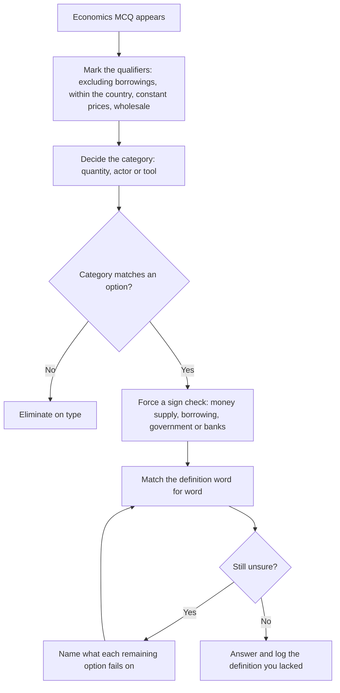

# Economics

Economics in a general aptitude paper is not a course. It is a **vocabulary with arithmetic attached**, and almost every question reduces to one of three moves: name the term that matches the description, identify the institution that does the job, or do a two-line calculation from a small table. That is a finite problem, and it is solved by learning a small number of definitions precisely rather than by reading an economics textbook. What students usually do instead is memorise policy announcements, which is the wrong half of the subject — the announcements decay and the definitions do not. This note teaches the definitional half properly, the arithmetic half with worked examples, and the three-step method for a term you do not recognise.

### 🟢 Lite — Quick Review (1h–1d)

**The three question types and the move each needs**

| Type | Example stem | The move |
| --- | --- | --- |
| Definition | "The gap between the value of exports and imports of goods is called…" | Match the phrase to the term |
| Institution | "Which body formulates monetary policy?" | Institution to function |
| Calculation | "A fall in the price level from 100 to 94 is…" | Two lines of arithmetic |

**Eight terms that carry most of the weight**
- **GDP** is the value of all final goods and services produced within a country in a year, at market prices.
- **Inflation** is a sustained rise in the general price level, measured by an index of prices rather than by one price.
- **Fiscal policy** is the government's spending and borrowing; **monetary policy** is the central bank's control of money and interest rates.
- **Fiat money** is money that is acceptable because the state says it is, not because it has intrinsic value.
- **A trade deficit** is imports exceeding exports; a **current account deficit** is broader, and the difference is examinable.
- **CRR** is cash kept with the central bank; **SLR** is gold and government securities; neither earns full market interest.
- **Value added** is the output of a sector minus what it bought from other sectors; GDP is the sum of value added, which is how double counting is avoided.
- **Repo** is the central bank buying from banks, and it is a tightening instrument; **reverse repo** is the opposite.

**The definition trap.** Most wrong answers in this topic are a near-miss term: *inflation* substituted for *deflation*, *revenue* for *revenue plus capital*, *GDP* substituted for *GNP*. Read the stem's qualifiers before you match the word.

### 🟡 Standard — Regular Study (2d–2mo)

#### National accounting — the distinctions that generate the questions

**GDP** is the market value of all **final** goods and services produced **within** a country in a given period. Three words in that sentence are the three questions.

- **Final**, not intermediate: wheat is final, flour is intermediate when the flour is used by a bakery, and counting both would double count. The measurement solution is the **value added** approach — add up the value each sector adds, not the gross value of its output.
- **Within** a country, not by its nationals: that is the difference between **GDP** and **GNP**, where GNP (gross national product) counts what the country's residents produce wherever they are. A question testing that the two are computed differently is testing the word "within" versus "by".
- **At market prices**, so **nominal** GDP rises when prices rise even if output does not. The version that removes price rises is **real GDP**, valued at constant prices. The bridge between the two is the **GDP deflator**, which is nominal GDP divided by real GDP, expressed as an index with base 100. A question that gives you both nominal and real GDP and asks for the deflator, or asks by how much the price level rose, is this distinction being used.

**Per capita** figures divide by population, which is why a country can have a large GDP and a low per capita GDP. **GNP minus depreciation** gives net national product, and the difference between gross and net is capital consumption. Learn gross/net as one idea applied twice rather than as four separate terms.

#### Inflation — the concept, the measure, the response

Inflation is a **sustained** increase in the **general** price level. Three consequences follow, and each is separately examinable. First, a single price rising is not inflation, so questions offering "the price of one commodity rose" are not describing inflation. Second, it is measured by an **index of prices**, not by an absolute price, so the stem usually supplies two index values. Third, the response comes from two different authorities with two different instruments.

**The measures.** The **Consumer Price Index**, published in India by the statistical office of the Ministry of Statistics and Programme Implementation, tracks retail prices consumed by households. The **Wholesale Price Index**, published by the Office of the Economic Adviser in the Department for Promotion of Industry and Internal Trade, tracks prices at the wholesale stage and is weighted more heavily towards manufactured and traded goods. A question distinguishing them is testing *which stage of the market is being sampled*. The relationship is that a rise in wholesale prices tends to precede a rise in consumer prices, since input costs feed into retail prices.

**The two causes.** **Demand-pull** inflation comes from too much spending chasing too few goods — typically from expansionary fiscal or monetary policy, a large fiscal stimulus, or a boom in a commodity price. **Cost-push** inflation comes from rising input costs — an oil price rise, a wage increase, or a supply shock — and it is distinguished by the fact that output falls at the same time as prices rise. A question that gives you rising prices *and* falling output has handed you the answer: that is cost-push.

**The two responses.** **Monetary policy** is the central bank's: it raises the policy interest rate, sells securities, or raises the reserve requirement, all of which make borrowing dearer and reduce the money multiplier. **Fiscal policy** is the government's: it cuts spending or raises taxes, reducing aggregate demand directly. The framework to know is that India's central bank operates under a statutory monetary policy framework established by the 2016 amendment to the Reserve Bank of India Act, which created the Monetary Policy Committee and gave the central bank a statutory inflation target expressed as a headline consumer price inflation rate with a tolerance band either side of it. The mechanism to understand is that a supply shock cannot be fixed by raising rates, because raising rates makes a supply problem worse — which is why the framework specifies a *target with a band* rather than an exact number.

#### Fiscal policy and the deficit arithmetic

**The budget has two sides.** Receipts are **revenue** (taxes and non-tax income) and **capital** (asset sales and recoveries). Expenditure is **revenue expenditure** (salaries, interest, subsidies, pensions — recurring) and **capital expenditure** (building roads, schools, equipment). The distinction is between what is consumed and what is created, and it is the reason a budget that cuts capital spending is described as contractionary even if the headline number is unchanged.

**Three deficits, three formulas.**
- **Fiscal deficit** = total expenditure − total receipts **excluding** borrowings. In other words, it is the government's total borrowing requirement.
- **Revenue deficit** = revenue expenditure − revenue receipts. It measures borrowing to fund consumption rather than asset creation.
- **Primary deficit** = fiscal deficit − interest payments. It measures borrowing for current spending, with the cost of servicing past borrowing removed.

A question that gives you expenditure, receipts and interest and asks for the primary deficit is a three-line subtraction. Get the definitions right and the arithmetic is trivial; the marks are in the definitions.

**The instrument that changed Indian public finance.** The **Goods and Services Tax** was created by the **101st Constitutional Amendment in 2016** and subsumed most indirect taxes — excise, service tax, VAT and several others — into one destination-based system administered by the **GST Council**, a constitutional body under Article 279A that works by consensus between the Centre and the States. The exam-relevant structure is: one tax, two rates of revenue division, and a Council that requires State consensus to change rates. A question on "who decides the GST rate" is answered by the Council's consensus rule, not by the Centre alone.

#### Monetary policy and banking

The **Reserve Bank of India** was constituted under the Reserve Bank of India Act of 1935 and nationalised in 1949. It conducts monetary policy, manages foreign exchange reserves, regulates banking and securities markets, and acts as banker to the government and to commercial banks.

**The instruments, with the direction of each.**
- **Repo rate** — the rate at which the central bank lends to banks against securities. Raising it tightens, because borrowing becomes costlier.
- **Reverse repo** — the rate at which the central bank absorbs liquidity from banks. Raising it loosens.
- **Cash Reserve Ratio** — the share of net demand and time liabilities of a bank that must be kept as cash with the central bank, and which earns the central bank the right to use. Because those funds cannot be lent, a higher CRR shrinks the system's lending capacity.
- **Statutory Liquidity Ratio** — the share of net demand and time liabilities that must be held in gold, government securities or cash. Held largely in government securities, so it links to the government borrowing requirement.
- **Marginal Standing Facility** — the overnight facility at which banks can borrow against securities, generally at a penalty rate, and which functions as a ceiling on money-market rates.
- **Open market operations** — the purchase or sale of securities by the central bank, the standard instrument for injecting or withdrawing durable liquidity.

**The money multiplier.** In the simplest form, the deposit multiplier is **1 / CRR** — the fraction of a new deposit that a bank keeps and the multiple of deposits it can support. This is a genuinely derivable result: with a reserve requirement of 10 per cent, a bank keeps 10 and can lend 90, that 90 generates a further 81, and so on, summing to 100. The full figure in practice is lower because banks hold excess reserves, borrowers repay, and cash leaks out, but the idealised version is what an exam asks. The point of the calculation is the intuition: **a small change in the reserve requirement produces a large change in lending capacity**, which is why CRR is a blunt instrument.

#### Balance of payments and the external sector

**The current account** records trade in goods and services, primary income (interest and dividends paid abroad), and secondary income (remittances and transfers). **The capital and financial account** records capital flows — foreign direct investment, foreign portfolio investment, loans and reserves. A **trade deficit** is only about goods; a **current account deficit** is the wider measure. A question that says "imports of goods exceeded exports of goods" has described a trade deficit, and an option saying "current account deficit" is *not* automatically correct.

**Foreign exchange reserves** are held by the central bank and are used to manage the exchange rate. India's exchange rate is described as managed, meaning the central bank intervenes to smooth excessive movement rather than fixing a rate. The durable point for a question is the mechanism: a deficit is financed by capital inflows and reserve use, which is why a country with large reserves and stable capital inflows can sustain a current account deficit for long periods, and why a sudden stop in capital flows forces sharp adjustment.

#### Institutions and the policy architecture

- **The Reserve Bank of India** — central bank, monetary and financial regulation.
- **The NITI Aayog** — the policy think tank that replaced the Planning Commission in 2015, with no fund allocation power, which is the distinction most often asked about it.
- **The Finance Commission** — constitutional, recommends the division of tax proceeds between the Centre and the States.
- **The Securities and Exchange Board of India** — the securities market regulator, established in 1988 and given statutory powers by the SEBI Act of 1992.
- **The GST Council** — constitutional, decides GST rates by consensus.
- **The Central Board of Direct Taxes and the Central Board of Indirect Taxes and Customs** — the two revenue-administration arms, with the second administering GST.
- **The National Income and Product Accounts** — the statistical basis for GDP, maintained by the national statistical office under the Ministry of Statistics.

Two more distinctions worth locking down. **FDI** is a direct investment in an enterprise, bringing management interest; **FPI** is portfolio investment in securities with no management control, and is more easily reversed — which is why a sudden FPI exit is described as hot money. And the **multidimensional poverty index**, published by the UNDP with the Oxford Poverty and Human Development Initiative, measures deprivation across health, education and living standards, unlike the **human development index**, which combines life expectancy, education and income. Learn the distinction, not a rank, because ranks are revised with every edition.

### 🔴 Extended — Deep Study (3mo+)

#### The three-step method for an unknown economics term

- **Step 1 — mark the qualifiers.** The stem's qualifiers carry the definition: "excluding borrowings", "within the country", "at constant prices", "at the wholesale stage", "of the government", "of the central bank". Every near-miss answer violates a qualifier.
- **Step 2 — decide the category.** Is the answer a *quantity* (a deficit, a ratio, an index), an *actor* (an institution or a ministry), or a *tool* (a rate, a ratio, a mechanism)? A category mismatch eliminates instantly.
- **Step 3 — apply the sign and the direction.** Is the effect on money supply or on borrowing positive or negative? Is the effect on the government or on the banks? Most near-misses are sign errors, and a forced sign check catches them.

**Worked example — definition with a qualifier.** *Stem: "Total government expenditure minus total receipts excluding borrowings is called:"* Step 1 — the qualifier is "excluding borrowings", which is doing all the work. Step 2 — the answer is a quantity. Step 3 — with borrowings excluded, the gap is the total borrowing requirement, which is the **fiscal deficit**. A candidate answer of "revenue deficit" is eliminated because revenue deficit subtracts only revenue expenditure from revenue receipts; "primary deficit" is eliminated because it additionally removes interest payments. Neither definition matches the stem's wording.

**Worked example — the multiplier.** *If the cash reserve ratio is 10 per cent and a bank receives a new deposit of 100, what is the maximum total deposit expansion, ignoring leakages?* The bank keeps 10 against the reserve requirement and can lend 90. The next bank keeps 9 and lends 81, then 7.29, and so on. The sum is a geometric series with first term 100 and ratio 0.9, which is 100 ÷ (1 − 0.9) = **1000**, equivalently 1/CRR = 10 times the initial deposit. Note the honest qualification: real expansion is smaller because of excess reserves, repayments and cash leakage, and an exam question that mentions those will expect the reduced figure.

**Worked example — reading a small table.** *Nominal GDP in year 1 is 120 and real GDP at base-year prices is 100. What is the GDP deflator and the price rise?* The deflator is nominal ÷ real × 100 = **120**, meaning the price level is 20 per cent above the base year. If the table also gives year 2 — nominal 132, real 104 — then the deflator for year 2 is 132/104 × 100 ≈ 127, and the *inflation between the years* is the percentage change in the deflator, about 5.8 per cent, not the 10 per cent you would get by comparing nominal GDPs directly. That last point is the reason the deflator exists, and it is the standard trap in this question family.

#### Policy instruments as a decision tree

A useful way to hold monetary and fiscal policy together is as a decision tree. If the objective is to **reduce inflation caused by excess demand**, the textbook pairing is contractionary fiscal policy (lower spending, higher taxes) with contractionary monetary policy (higher repo rate, higher CRR, open market sales). If the objective is to **raise output in a slump**, both are expansionary. If the objective is to **raise revenue** without depressing activity, the instrument is tax administration and compliance rather than a rate rise. The exam draws from the first two branches, and the trap is pairing a fiscal instrument with a monetary objective — a tax cut is not a monetary tool, and a repo rate is not a fiscal one.

#### Why "which of the following" economy questions are unusually generous

Economics definitions have a property that most subjects lack: **the wrong options are usually definable**. If a stem describes a gap between total expenditure and receipts excluding borrowings, the three distractors are *near* definitions, and you can rule each out by naming the word it fails on. This means an economics question can often be answered without complete knowledge — by knowing three definitions precisely enough to see that the others are wrong. That is the practical argument for spending revision time on definitions rather than on policy narratives: **definitions generate eliminations, narratives generate nothing**.

#### Reading policy announcements as structure, not content

A policy announcement in a general aptitude paper is nearly always asking one of four things: **which ministry or institution** runs it, **who benefits**, **how it is funded**, or **what mechanism it uses**. Learn the mechanism and the four questions become generic. The GST subsumes indirect taxes and is administered by a Council that works by consensus — that structure answers "who decides the rate" without any date. Financial inclusion and digital payment schemes are about delivering services to accounts that previously had none — that structure answers "what is the objective" and "which infrastructure". Learn the mechanism, and the announcement's specific numbers become optional.

### 🧠 Memory Anchors

- **"Final, within, market prices."** Three words in GDP, three questions.
- **"Real GDP strips out price; GDP deflator puts the price back."** Nominal ÷ real × 100.
- **"CPI is the household, WPI is the factory gate."** Stage of the market is the whole distinction.
- **"Repo tightens, reverse repo looses."** The central bank lends in the first and borrows in the second.
- **"Multiplier = 1 ÷ CRR."** A small reserve change moves lending capacity a long way.
- **"Fiscal, revenue, primary — in that order of subtraction."** Each strips one more thing out.
- **"NITI Aayog thinks, it does not allocate."** No fund-allocation power is the distinction most asked.
- **Flashcard Q&A:**
  - *GDP minus depreciation is?* → A net concept; GNP minus depreciation is net national product.
  - *Which index does the Office of the Economic Adviser publish?* → The Wholesale Price Index.
  - *Inflation from a supply shock, with falling output, is?* → Cost-push.
  - *Which body recommends the tax division between Centre and States?* → The Finance Commission.
  - *Which body decides GST rates?* → The GST Council, by consensus.
  - *The simple deposit multiplier is?* → 1 divided by the CRR.
  - *FDI versus FPI — which brings management control?* → FDI.
  - *Which body regulates the securities market?* → SEBI.

### 🎯 Exam Traps & Error Log

1. **Dropping a qualifier from the definition.** "Excluding borrowings", "within the country" and "at constant prices" are the three words that separate the right term from its twin.
2. **Saying a single price rise is inflation.** Inflation is a sustained rise in the *general* price level, measured on an index.
3. **Confusing CPI with WPI.** One samples retail prices to households, the other samples wholesale prices.
4. **Calling a trade deficit a current account deficit.** The current account is wider, including services, income and transfers.
5. **Swapping revenue and capital expenditure** when computing deficits, or forgetting that fiscal deficit excludes borrowings from receipts.
6. **Pairing a fiscal instrument with a monetary objective** — a tax cut is not a monetary tool.
7. **Reading "cost-push" as "demand-pull."** Rising prices with falling output is cost-push; rising prices with rising output is demand-pull.
8. **Forgetting that the multiplier is an idealisation** and writing 1/CRR as a guaranteed figure in a question that mentions cash leakage or excess reserves.
9. **Attributing a policy to the wrong institution** — a rate decided by the central bank against one decided by the GST Council.
10. **Betting marks on a current-policy figure** — the CRR, the repo rate and the current inflation rate all change, and only the *framework* is durable.

### 🧪 Self-Test — 8 Questions with Worked Answers

Do these closed-book. Where an option is rejected, name the word in the definition it fails.

1. **Total government expenditure minus total receipts excluding borrowings is called what?** *Worked answer:* **The fiscal deficit.** Method — the qualifier. "Excluding borrowings" tells you the gap being measured is the government's total borrowing requirement. A revenue deficit subtracts only revenue expenditure from revenue receipts, and a primary deficit further removes interest payments; neither matches the stem's wording. A candidate answer of "budget deficit" is not a standard term and loses to the precise one.

2. **If the cash reserve ratio is 10 per cent, and a bank receives a new deposit of ₹100, what is the maximum total deposit expansion ignoring leakages?** *Worked answer:* **₹1000.** Method — the multiplier. The bank keeps ₹10 and lends ₹90; the next keeps ₹9 and lends ₹81; the series is geometric with ratio 0.9, so the total is 100 ÷ (1 − 0.9) = 1000, which is 1/CRR times the original deposit. The honest qualification to add in an exam: actual expansion is lower because of excess reserves, cash leakage and repayment, so a question that mentions those expects a reduced figure.

3. **Prices are rising and output is falling. Is this demand-pull or cost-push inflation?** *Worked answer:* **Cost-push.** Method — the two-part signature. Cost-push inflation comes from rising input costs, which squeezes margins and raises final prices *while* production falls. Demand-pull inflation comes from spending outrunning supply, and there output and prices rise together. The stem gives you both halves of the signature, so the answer is determined by the co-movement rather than by any knowledge of which country is meant.

4. **Which index does the Office of the Economic Adviser publish, and what does it sample?** *Worked answer:* **The Wholesale Price Index, which samples prices at the wholesale stage of the market.** Method — institution to function. The Office of the Economic Adviser sits in the Department for Promotion of Industry and Internal Trade, which is a clue to the stage being measured. The Consumer Price Index, which samples retail prices consumed by households, is published by the statistical office of the Ministry of Statistics and Programme Implementation. The institution is the discriminator, and a wholesale price rise typically feeds into consumer prices with a lag.

5. **Nominal GDP is 120 in year 1 and real GDP at base-year prices is 100. What is the deflator, and what does it mean?** *Worked answer:* **The GDP deflator is 120, since it is nominal divided by real multiplied by 100, so the price level stands 20 per cent above the base year.** Method — the bridge. The deflator exists to strip prices out of one figure and put them back explicitly, which is why real GDP is valued at constant prices while nominal GDP is at current prices. If a second year's figures are given, the inflation rate is the percentage change in the *deflator*, not in nominal GDP, and that distinction is the standard trap in this family of questions.

6. **What is the difference between a trade deficit and a current account deficit?** *Worked answer:* **A trade deficit is when the value of imports of goods exceeds the value of exports of goods. A current account deficit is the wider position, adding services trade, primary income such as interest and dividends paid abroad, and secondary income such as remittances.** Method — scope. A stem saying "imports of goods exceeded exports of goods" has described only the trade balance, so an option saying "current account deficit" is not automatically right. The examinable point is that a country can run a goods deficit and still have a current account surplus if services and transfers are large enough, which is why the two must be stored as separate scopes.

7. **Which body decides GST rates, and why does the answer not simply say "the central government"?** *Worked answer:* **The GST Council, a constitutional body under Article 279A.** Method — mechanism, not assertion. GST was created by the 101st Constitutional Amendment in 2016 and subsumes most indirect taxes into a destination-based system. The Council's composition includes the Union finance minister, the state finance ministers and officials from both, and it takes decisions by consensus, with the central government having a weighted vote in certain specified cases. The mechanism — one tax, two revenue shares, rates by consensus — answers the question without needing any date.

8. **A question asks about the institution that replaced the Planning Commission. What exactly is the difference, and how would you answer if you had forgotten the name?** *Worked answer:* **The NITI Aayog, which is a policy think tank with no fund-allocation power, replaced the Planning Commission in 2015.** Method — function first. Even with the name forgotten, the function is recoverable: the Planning Commission allocated plan funds across States, and its successor advises policy and does not allocate. An option describing an institution that "allocates funds to States" is therefore eliminated by function, and an option describing a "policy advisory think tank" survives. Naming the function and eliminating is worth more in the hall than the name alone.

### 💡 Pro Tips

1. **Learn definitions word for word, including the qualifiers.** Near-miss answers are made of the dropped qualifier.
2. **Practise the three-line arithmetic twice a week.** Deficit and multiplier problems are marks that go begging.
3. **Keep one index-to-publisher table.** Publisher and stage of the market are the stable facts; ranks are not.
4. **Use a sign-and-direction check on every policy question.** Most policy errors are sign errors.
5. **Learn instruments as pairs** — fiscal with monetary, inflation with the right tool — so a mismatched option stands out.
6. **Separate instruments from agencies.** A rate is set by a body, but the body is not the instrument.
7. **Teach the mechanism of a policy, not its date or budget.** Mechanisms survive; figures are revised.
8. **Read an economy question as a definition with a missing word.** Find the word, find the answer.

---

## Continue your study

- **[View this topic in your CUET UG roadmap](/roadmap/?exam=cuet&duration=1mo)** — see where "Economics" fits in your personalised plan
- **[Build a quick revision plan](/roadmap/?exam=cuet&duration=1d)** — 1-day sprint covering highest-weight topics
- **[CUET UG exam overview](/exams/cuet/)** — pattern, eligibility, and syllabus
- **[All General Test notes](/notes/cuet/general-test/)** — browse sibling topics in this subject

*Content adapted based on your selected roadmap duration. Switch tiers using the selector above.*
