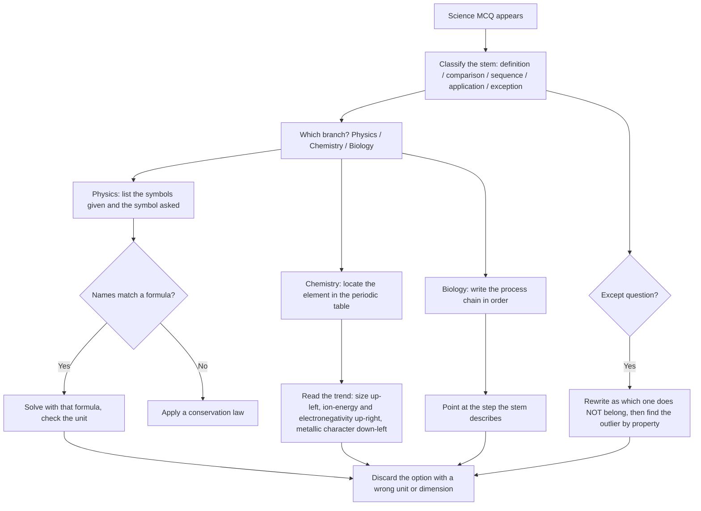

# General Science

General Science in the CUET UG General Test is the one part of the paper where everything is *knowable*. Unlike current affairs, there is no news cycle that invalidates what you learned. Unlike logical reasoning, there is no puzzle to be stuck on. The whole subject rests on Class 10–12 concepts in Physics, Chemistry and Biology, and almost every question is answerable from a fact you already met in school if you were paying attention the first time.

The trap is that most candidates treat it as a memory subject and try to memorise isolated "fun facts". That approach fails on the questions that decide the paper, because those questions are built to separate a student who *understands* a concept from one who once read a definition. So the method in this note is not "learn more facts" — it is "learn the small number of principles, then derive the fact you have never seen".

**Concept → relation → derive.** Recall the concept, locate the relation that ties it to the stem, and derive the answer. If you can only do the first step, you will get the easy half of the questions and lose the hard half, and the hard half is what separates a competitive score from an average one.

### 🟢 Lite — Quick Review (1h–1d)

**The three branches and what each one actually tests**

| Branch | What is examined most often | The skill being tested |
| --- | --- | --- |
| **Physics** | Units, laws of motion, work-energy, heat, electricity, light | Applying a formula to a described situation, not deriving it |
| **Chemistry** | Periodic trends, acids/bases and pH, bonding, redox, balancing | Reading a property's *direction* from the position of an element |
| **Biology** | Cell biology, genetics, human physiology, ecology, nutrition | Reading a process in sequence and finding the step asked for |

**Physics — the small set of formulas that carry most items**

- **Speed** = distance / time; **velocity** adds direction, and a circular path makes speed constant while velocity changes.
- **Acceleration** = change in velocity / time. Zero acceleration does not mean zero velocity; it means constant velocity.
- **Newton's second law:** F = ma. Mass is the quantity in F = ma; weight is the force, and on the Earth w = mg.
- **Work, energy, power:** work is force multiplied by displacement **in the direction of the force**; W = F·s·cos θ. Power is work per unit time.
- **Kinetic energy** = ½mv², **potential energy** = mgh. Because KE grows with the square of speed, doubling speed makes the energy four times.
- **Ohm's law:** V = IR. Current is the same everywhere in a series circuit; voltage divides.
- **Power (electrical):** P = VI = I²R = V²/R.
- **Density** = mass / volume; **specific gravity** = density of a substance divided by density of water, so it is unitless.
- **Wave speed** = frequency × wavelength. Sound is a longitudinal wave needing a medium; light is transverse and does not.
- **Heat and temperature:** temperature is a measure of average kinetic energy; heat is energy transferred. A large body and a small body at the same temperature contain different amounts of thermal energy.

**Chemistry — trends, not lists**

- Across a period, atomic radius **decreases** and electronegativity **increases** (Li → F).
- Down a group, atomic radius **increases** and electronegativity **decreases** (F → I).
- Group 1 elements form +1 ions, group 2 form +2, group 17 form −1. Group 18 are noble gases and do not react readily because their outer shell is full.
- Metals on the left, non-metals on the right; a diagonal band of metalloids (B, Si, Ge, As) separates them.
- Acids: pH below 7, **pH = −log[H⁺]**, so a tenfold change in concentration changes pH by 1. Bases are above 7; neutral is exactly 7.
- Indicators change colour with pH: litmus red in acid, blue in base; phenolphthalein is colourless below roughly 8 and pink above.
- Oxidation is gain of oxygen or loss of hydrogen or loss of electrons; reduction is the mirror image. **OIL RIG** — Oxidation Is Loss, Reduction Is Gain (of electrons).
- Ionic compounds are soluble in water and conduct when molten or dissolved; covalent compounds are generally poor conductors.
- Catalysts change rate, not position of equilibrium, and are not consumed.

**Biology — the sequences you must be able to recite in order**

- **Photosynthesis:** light energy → 6CO₂ + 6H₂O → C₆H₁₂O₆ + 6O₂, with chlorophyll and sunlight required. Respiration reverses the carbon path: glucose + O₂ → CO₂ + H₂O + ATP.
- **Cell:** plants have a cell wall, chloroplasts and a large central vacuole; animals have only a membrane-bound cytoplasm. Both have mitochondria, ribosomes, a nucleus and a cell membrane.
- **Mitosis** produces two genetically identical daughter cells for growth and repair; **meiosis** produces four haploid gametes, and it is where recombination and independent assortment generate variation.
- **Mendel's laws:** law of dominance, law of segregation (each gamete gets one allele), law of independent assortment (applies only to genes on different chromosomes, or far apart on the same one).
- **Central dogma:** DNA → (transcription) → RNA → (translation) → protein. A codon is three bases and specifies one amino acid.
- **Human physiology:** blood circulates through heart → lungs → heart → body; oxygen diffuses across alveoli, carbon dioxide diffuses back. Haemoglobin carries oxygen, and iron is required to make it.
- **Vitamins:** water-soluble are the B-complex and C; fat-soluble are A, D, E and K. Vitamin C is required for collagen synthesis; vitamin D for calcium absorption.
- **Ecology:** producers make their own food, consumers do not, decomposers break down dead matter and return nutrients to soil. Energy flows one way through a food chain and is lost at each level; matter cycles.

**The one universal rule for an unseen science question.** Read the stem and ask: is it describing a *definition*, a *comparison*, a *sequence*, an *application*, or an *exception*? Each type has its own reading move, and the moves are listed in the Standard tier below.

### 🟡 Standard — Regular Study (2d–2mo)

**Five stem types and the move each one demands**

Science MCQs are not random. They are generated from templates, and once you see the template the question becomes routine. There are five common ones.

**Type 1 — Definition items.** The stem restates a definition and asks for the term, or gives the term and asks for its meaning. The move is to *rephrase* the stem in your own words and match, not to search your memory for a similar-sounding word. "A chemical change that releases heat and light" is combustion; "a process of combining with oxygen giving off heat" is the same thing, and the answer is decided by the presence of a *new substance with different properties*, which is what separates a chemical change from a physical one.

**Type 2 — Comparison items.** "Which of the following differs from the others?" or "Which property is correctly matched?" The move is to write the *defining property* of each option in one word, then find the odd one out by property, not by topic. If three options are metals and one is a non-metal, you are done; if three are metals and one is a metal with a different ion charge, you have to work.

**Type 3 — Sequence items.** "Which of the following occurs in the correct order?" The move is to write the process out as a chain and check the stem's order against your chain. Photosynthesis, digestion, the water cycle, the carbon cycle, the Krebs cycle, transmission of a nerve impulse — all are order questions in disguise.

**Type 4 — Application items.** "A body is projected upward; what happens at the highest point?" The move is to identify *which single physical quantity is at its extreme*, because that determines everything else. At the top of a vertical throw, velocity is zero but acceleration is still g downward, which is the classic trap.

**Type 5 — Exception items.** "All of the following are... except." The move is to rewrite the stem as "which one does *not* belong", which changes what you are searching for in your memory. Almost everyone loses a mark here by continuing to look for something that fits.

**Worked example of Type 2.** *Stem: "Which of the following does not belong to the same group: (a) copper (b) iron (c) sulphur (d) sodium?"* The property test first: copper, iron and sodium conduct electricity and are ductile and sonorous, and they all form positive ions. Sulphur is a non-metal, brittle, and forms a negative ion. **Answer: sulphur** — and note that this was decided entirely on a property rule, with no lookup of a "group" number needed.

**Worked example of Type 3.** *Stem: "In a food chain, the organism that receives the least energy is:"* Chain: grass → grasshopper → frog → snake → eagle. Energy is lost at every transfer, so the last named level receives the least. You do not need numbers; the principle alone decides it. The trap option is usually the producer, on the reasoning that plants "make" food — but a producer receives its energy from sunlight, not from the chain.

**Physics reasoning you can reuse: read the question for quantities, not objects**

Most physics errors are quantity errors, not arithmetic errors. Before solving, list what is given and what is asked, in symbols. A question that gives mass and velocity and asks for kinetic energy is not solvable by any conservation law; it is solvable by noticing the two names of the single formula ½mv². A question that gives no mass and no time but gives height and asks for energy is ½mv² again, because m cancels. A question that gives only a ratio asks for a ratio, and the cleanest way to answer is to set the first quantity to 1 and scale.

Three reusable moves:

- **Ratio questions:** if only the ratio of two quantities matters, set one to 1. "If the speed doubles, the kinetic energy becomes how many times?" Set v = 1, then v = 2. Energy goes ½m(1)² = ½m, and ½m(2)² = 2m, which is four times. The answer falls out in two lines.
- **"Which stays constant?" questions:** conservation of charge, conservation of mass, and energy conservation are the three that get tested. A pendulum at two extreme positions has the same energy twice; a body in an inelastic collision loses mechanical energy to heat, which is why "energy is conserved" and "mechanical energy is conserved" are different claims.
- **Unit questions:** a mismatch in units is always a wrong answer regardless of the arithmetic. Work is in joules (newton-metre), power in watts (joule per second), and energy in joules too. If an option has a wrong dimensional form, discard it before computing anything.

**Chemistry reasoning you can reuse: position predicts property**

Instead of memorising property lists, learn the *shape of the trend* and read off any element.

- **Metallic character** increases down a group and decreases across a period. So sodium is more metallic than lithium, and calcium is more metallic than potassium? No — potassium is in group 1 below calcium, but across a *period* (period 4: K, Ca, Sc...), metallic character falls left to right. Metallic character is greatest at the bottom left and least at the top right.
- **Ionisation energy** is the mirror image: greatest at the top right (helium, fluorine, neon), least at the bottom left (caesium, francium).
- **Atomic size** is largest at the bottom left, smallest at the top right.
- **Oxidising and reducing nature:** a non-metal high in the group and high in the period is the strongest oxidising agent; a metal low and to the left is the strongest reducing agent.

Write the periodic table as a small grid with three arrows — size up-left, ionisation energy up-right, metallic character down-left — and every trend question becomes a two-second lookup. This is worth an hour of your time; a memorised list of exceptions is worth nothing and will mislead you.

**pH questions without panic.** Two facts do almost all the work: pH = −log[H⁺], and each tenfold change in concentration shifts pH by exactly 1. So if a solution is diluted tenfold, its pH increases by 1. If a solution at pH 3 is made ten times more acidic, the pH is 2. Neutralisation of a strong acid with a strong base at pH 7 requires equal moles only when both are strong — that is a genuine exception and examiners use it, so learn it as a deliberate special case rather than a general rule.

**Biology reasoning you can reuse: locate the step**

A biology question about a process is almost always asking about *one step in a chain*, and your only job is to name the step. If the stem asks what happens "in the dark reaction" or "in the light reaction", write the photosynthesis chain and point. If the stem describes a plant with white or pale leaves, the answer is failure to make chlorophyll, which is a deficiency of magnesium — and recognising a *deficiency* as a category is the generalisable move: symptoms on old leaves point to mobile nutrients (N, K, Mg), symptoms on young leaves point to immobile ones (Ca, S, Fe, B), because mobile elements are moved to new growth first.

**Connecting physics, chemistry and biology in a single answer.** Some questions cross two branches — a plant absorbing carbon dioxide for photosynthesis, an athlete breathing harder after a sprint, a pressure cooker raising boiling point. Handle these by translating the biological or everyday description into the physical or chemical concept and then answering in concept language. "Why does a pressure cooker cook faster?" becomes "why does increased pressure raise the boiling point of water", and the answer is that a higher boiling temperature means a higher cooking temperature, so food is cooked at a greater rate.

### 🔴 Extended — Deep Study (3mo+)

**The five-minute derivation drill — the habit that makes general science a full-mark section**

Take any fact you do not know and derive it from something you do. This is the single highest-return practice in the subject, and it is possible because science is internally consistent.

- *Derive why the sky is blue from the fact that white light contains all colours and that a prism separates it.* Shorter wavelengths scatter more strongly off small particles than longer ones, and blue is shorter than red, so blue is scattered across the whole sky while red mostly travels straight. From that one derivation you also get why sunsets are red — at sunset the light travels a longer path through the atmosphere and loses its blue to scattering before reaching you.
- *Derive the pH scale from the water dissociation constant.* A pure substance at concentration 1 mol/dm³ ionises to a hydrogen-ion concentration of 10⁻⁷, which by definition is pH 7. Every other pH is a power of ten away from that.
- *Derive the second law's feel from the first.* In an elastic collision, total kinetic energy is unchanged; in a perfectly inelastic collision it is not, and it is lost as heat and sound. The system conserves energy; the *ordered* energy does not.
- *Derive why hereditary variation exists from meiosis.* Independent assortment in meiosis I and crossing over in prophase I both reshuffle allele combinations, so offspring differ from parents even when the parents are genetically identical in every allele.

If you can do twenty derivations, you can answer a large fraction of a paper on general science without having memorised it.

**Dimensional analysis as a check, not a computation**

You rarely need to *use* dimensional analysis to solve an exam question. You use it to *discard* one option in five seconds. Every quantity has dimensions: mass M, length L, time T, current I, temperature Θ, amount N, luminous intensity J.

- Force = MLT⁻²
- Work and energy = ML²T⁻²
- Power = ML²T⁻³
- Pressure = ML⁻¹T⁻²
- Power (electrical) = ML²T⁻³ — the same dimensions as mechanical power, which is a satisfying consistency check on Ohm's law
- Charge = IT, current = charge per time
- Frequency = T⁻¹

If a question gives pressure, force and area and asks for work, write the dimensions: pressure × volume = ML⁻¹T⁻² × L³ = ML²T⁻², which is work. Every physics option in a numeric question is designed with at least one dimensional mismatch, and this kills it without arithmetic.

**Chemistry's periodic table as a single diagram**

Reduce the whole periodic table to three questions you can answer instantly:

1. **Where is the most reactive metal?** Bottom left, group 1. Compare lithium and potassium, or sodium and caesium.
2. **Where is the most reactive non-metal?** Top right, group 17.
3. **Where is the most electronegative element?** Top right, fluorine.

From those three positions, every other property follows: metals below and left lose electrons easily and are strong reducing agents; non-metals above and right gain electrons easily and are strong oxidising agents; atomic size runs opposite to electronegativity. A question like "which of these reacts most readily with water" is answered by *position*, not by memory of individual reactions.

**Human physiology as a set of linked transports**

Rather than memorise systems separately, treat the body as a set of materials moving between compartments, each moved by a named mechanism. This makes "why" questions answerable.

- Nutrients move from gut to blood by diffusion *and* by active transport because the concentration can be against the gradient.
- Oxygen moves from alveoli to blood by simple diffusion, driven by partial-pressure gradient, and is carried bound to haemoglobin, whose effectiveness depends on iron.
- Carbon dioxide moves the other way, mostly as bicarbonate in plasma after conversion by an enzyme, because a small fraction is transported dissolved and a larger fraction as carbaminohaemoglobin.
- Nitrogenous waste leaves as urea because ammonia is toxic and must be converted, which happens in the liver.
- Blood pressure is maintained by the heart's output and the resistance of the vessels; arteries carry blood away, veins carry it back, and capillaries are where exchange happens because they are one cell thick.

**Ecology: energy flows, matter cycles, population follows a curve**

Two sentences carry most of the subject. *Energy flows in one direction and is lost as heat at every trophic level, so a food chain can have only about four or five links.* *Matter cycles, because decomposers break down dead organisms and return nutrients to the soil, which plants take up again.* Everything else — why a pyramid of energy is always upright while a pyramid of numbers can be inverted (one tree, many insects), why a species' population grows exponentially then levels off as carrying capacity is reached, why a community's species diversity tends to fall as one species becomes dominant — follows from those two.

**How to revise a fact you keep getting wrong**

Use the *error-first* method instead of re-reading. Write the wrong answer you chose and, next to it, the one-sentence reason it was wrong. "I chose 'evaporation' because I thought only water evaporates — actually sublimation is solid directly to gas (dry ice, camphor)." The reason is the revision unit; the fact alone will not stay. Re-read the error list weekly and nothing on it will come back.

### 🧠 Memory Anchors

- **"Concept, not formula, is the question."** You are given a situation and must recognise the law. Reading the stem as a formula to remember wastes the question; reading it as "which law is this" is the whole skill.
- **"Zero acceleration is not zero velocity."** The most-physicised trap in the syllabus: constant velocity and no velocity are different claims.
- **"Atomic size up-left, electronegativity up-right, metallic character down-left."** One sentence, and the periodic table stops being a list.
- **"pH steps by one per tenfold concentration."** Doubling or tenfold changes are always simple arithmetic.
- **"OIL RIG."** Oxidation Is Loss, Reduction Is Gain — of electrons. Never fail the direction.
- **"Energy flows, matter cycles."** That single contrast answers most ecology questions.
- **"Mitosis identical, meiosis varied."** Repair and growth versus gamete formation and variation.
- **Flashcard Q&A:**
  - *What is pH of a neutral solution at 25 °C?* → 7, by definition of the water ionisation product at that temperature.
  - *Which is the most reactive metal and how do you know?* → The one at the bottom left of the periodic table; reactivity increases down a group and decreases left to right.
  - *At the highest point of a vertical throw, what is zero?* → Velocity. Acceleration remains g, directed downward.
  - *What makes a chemical change different from a physical one?* → A new substance with different properties is formed.
  - *Name the four fat-soluble vitamins.* → A, D, E, K. Everything else in the B-complex and vitamin C is water-soluble.
  - *Which vitamin deficiency causes bleeding gums and poor wound healing?* → Vitamin C, because it is required for collagen synthesis.
  - *If sound needs a medium but light does not, what kind of waves are they?* → Sound is longitudinal and mechanical; light is transverse and electromagnetic.
  - *What does Ohm's law say and what does it not say?* → V = IR. It says current is proportional to voltage and inversely proportional to resistance; it says nothing about how R itself depends on temperature.

### 🎯 Exam Traps & Error Log

1. **Answering "no" to "is velocity zero at the top of a throw?"** Velocity is zero; acceleration is not. The height question and the velocity question have different answers and the stem usually tests the confusion.
2. **Assuming a sound wave needs no medium.** Sound is mechanical and cannot travel through a vacuum; only electromagnetic radiation crosses a vacuum.
3. **Reversing periodic trends.** Atomic radius increases going *down* a group, not up, and electronegativity increases going *up* a group, not down. A single trend reversed ruins several questions.
4. **Writing "evaporation" when the substance goes solid to gas.** That is sublimation; evaporation is liquid to vapour, and both are endothermic.
5. **Ignoring the word "except".** Rewrite the stem in the opposite polarity before you start searching your memory. Continually looking for something that fits is how this mark is lost.
6. **Confusing mass with weight.** Mass is constant everywhere and is the m in F = ma; weight is the force due to gravity and changes with location, and it is what a spring balance reads.
7. **Saying chemical changes are only combustion or rusting.** Any reaction that forms a new substance is chemical, including cooking, digestion, and neutralisation of an acid.
8. **Taking pH changes linearly with concentration.** A tenfold change moves pH by 1, not by 0.3 or by 10.
9. **Confusing transpiration with evaporation.** Transpiration is water vapour leaving a living leaf through stomata; evaporation is the physical change from any liquid surface.
10. **Answering a biology question at the level of the organ, not the step.** "Where does the exchange of gases take place?" is alveoli, but "which step of the process follows X?" needs the whole chain written out first.

### 🧪 Self-Test — 8 Questions with Worked Answers

Answer all eight on paper before reading any solution. Apply the stem-type classification before you try to recall.

1. **"Which of the following is not a physical change: (a) melting of ice (b) burning of magnesium (c) dissolution of salt in water (d) sublimation of camphor?"**
   *Worked answer:* **(b) burning of magnesium.** Type — comparison, so test the property first. The defining property of a physical change is that no new substance is formed. Melting changes state, dissolution separates a mixture, and sublimation changes state; all three keep the substance chemically identical. Burning magnesium forms magnesium oxide, a genuinely new substance, so it is the outlier. The method here is a one-word property test, not any recall of chemistry.

2. **"A body is thrown vertically upward. Which quantity is zero at the highest point — (a) acceleration (b) velocity (c) momentum (d) potential energy?"**
   *Worked answer:* **(b) velocity.** Method — read the question for the extreme. Momentum is mass times velocity, so if velocity is zero then momentum is zero too, which is why the paper usually pairs velocity and momentum in the explanation. Acceleration is never zero on a vertical throw; gravity acts the whole way, which is the actual trap. Potential energy is at its *maximum*, never zero. Note the question asks for the one that is zero: exactly one of velocity and momentum qualifies, and both point to the same physical fact.

3. **"Which has the highest electronegativity: (a) sodium (b) oxygen (c) iodine (d) fluorine?"**
   *Worked answer:* **(d) fluorine.** Method — position, not recall. Electronegativity increases up a group and left to right across a period, so the maximum sits at the top right of the periodic table. Sodium is bottom left and cannot compete. Iodine is the same group as fluorine but far lower, so it is less electronegative. Oxygen is in the same period as fluorine and to its left, so fluorine wins. The position rule answers this in a few seconds and generalises to every similar item.

4. **"If a solution has pH 5 and it is diluted tenfold, the new pH is approximately: (a) 2 (b) 5 (c) 6 (d) 7."**
   *Worked answer:* **(c) 6.** Method — apply the tenfold rule. A tenfold dilution reduces hydrogen-ion concentration to a tenth, and the pH scale is logarithmic, so a tenfold drop in [H⁺] raises pH by exactly 1. Going from 5 to 6. The distractor (a) is what you get if you think dilution increases acidity, and (d) is what you get if you think tenfold dilution means neutral. The whole question is one rule.

5. **"In a food chain grass → grasshopper → frog → snake, which level receives the least energy: (a) grass (b) grasshopper (c) frog (d) snake."**
   *Worked answer:* **(d) snake.** Method — write the principle before the chain. Energy enters as sunlight at the producer, and at every transfer a large fraction is lost, mainly as heat and in movement. So energy decreases up the chain, and the last named level receives the least. Note that the grass is not the lowest energy *in the chain* — it captures the incoming sunlight, which is the largest single input; the losses occur between levels, not at the first one.

6. **"Which vitamin deficiency causes poor night vision: (a) vitamin A (b) vitamin B1 (c) vitamin C (d) vitamin D."**
   *Worked answer:* **(a) vitamin A.** Method — link the function, not the name. Vitamin A is required for the visual pigment in the retina; deficiency impairs dark adaptation, so the symptom is night blindness. Vitamin C is for collagen and wound healing, vitamin D for calcium absorption and bone, vitamin B1 for carbohydrate metabolism and nerves. The transferable habit is to store each vitamin as *one function plus one symptom*, because that is exactly how a stem tests it.

7. **"Two bodies have equal masses. Body A moves at twice the speed of body B. How does A's kinetic energy compare with B's?"**
   *Worked answer:* **Four times.** Method — set B to 1 and scale. KE = ½mv². Let B be speed 1: KE(B) = ½m(1)² = ½m. Let A be speed 2: KE(A) = ½m(2)² = 2m, which is 4 × ½m. The mass cancels, which is why the question could state "equal masses" and go no further. The trap is the "double" answer, which is what you get if you forget the square. A ratio question is almost never solvable by direct computation — normalise to 1 and compare.

8. **"A 60 kg body has its mass and weight measured on the Earth and on the Moon. Which is correct?"**
   *Worked answer:* **The mass is 60 kg in both places; the weight is lower on the Moon.** Method — separate the two quantities explicitly. Mass is the amount of matter and is invariant; weight is the gravitational force on that mass, w = mg. Because the Moon's gravitational field is roughly one-sixth of the Earth's, the same body's weight there is roughly one-sixth of its Earth weight, while a balance that *compares against reference masses* still reports 60 kg. A spring balance, which measures force, reports the lower number. A question that gives you both numbers and asks which changed is testing whether you can do this separation on demand.

### 💡 Pro Tips

1. **Classify the stem before you recall anything.** Definition, comparison, sequence, application, exception — the type tells you what to do, and the type is visible in five seconds.
2. **Learn trends, not lists.** Three arrows for the periodic table and four factoids for chemistry will outlast twenty memorised exceptions.
3. **Write the chain for every process you revise.** Photosynthesis, digestion, the water cycle, meiosis, the Krebs cycle. Sequence questions then become free.
4. **Store every vitamin and mineral as function-plus-symptom.** "Vitamin C → collagen → bleeding gums" survives; "Vitamin C" does not.
5. **Do one derivation a day for a month.** Twenty minutes of deriving a fact from another fact is worth more than an hour of re-reading, because derivation is what a question is actually testing.
6. **Kill options by unit before you compute.** A wrong dimension means a wrong option, whatever the arithmetic says.
7. **Keep an error-first list, not a fact list.** One line per wrong answer with the *reason* it was wrong. Re-read it weekly.
8. **Read the option list before you solve when time is short.** Comparison and exception questions can often be answered from the shape of the options alone, and that saved minute is worth more than the question.

---

## Continue your study

- **[View this topic in your CUET UG roadmap](/roadmap/?exam=cuet&duration=1mo)** — see where "General Science" fits in your personalised plan
- **[Build a quick revision plan](/roadmap/?exam=cuet&duration=1d)** — 1-day sprint covering highest-weight topics
- **[CUET UG exam overview](/exams/cuet/)** — pattern, eligibility, and syllabus
- **[All General Test notes](/notes/cuet/general-test/)** — browse sibling topics in this subject

*Content adapted based on your selected roadmap duration. Switch tiers using the selector above.*
