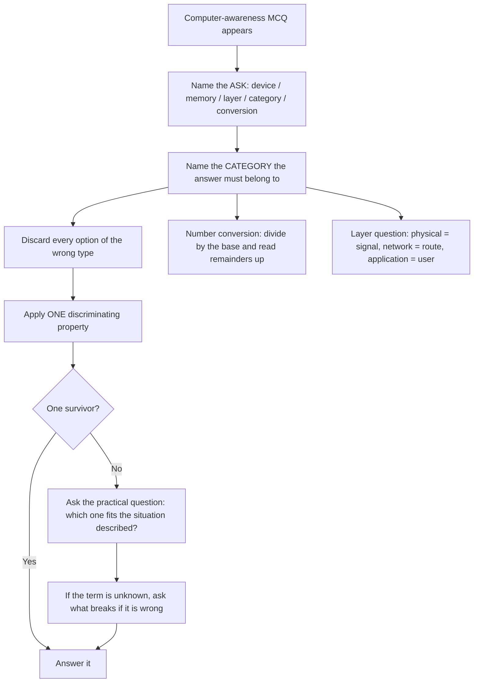

# Computer Awareness

Computer Awareness in the CUET UG General Test tests understanding, not operation. Nobody is asked to type a formula, drag a cell, or write a line of code. What is asked is whether you know *what a thing is for*, *which of two similar things belongs to which category*, and *what happens when one component is swapped out*. That is a vocabulary and classification subject wearing a technical costume, and it is very learnable because the categories are closed and finite.

The reason candidates lose marks here is not ignorance but vagueness. They know a "cache" speeds things up but cannot say whether it is hardware or software, or whether more of it is always better in every case. They know the binary system exists but cannot convert 25 to 11001. So the method in this note is to replace every vague half-knowledge with a **one-line definition plus its category plus its purpose**, because a computer-awareness MCQ is almost always decided by category.

**What is it → which layer → what breaks if it is wrong.** Identify the term, place it in the hardware/software/network layer stack, and reason about consequences. With that habit, an option can often be eliminated without knowing the answer at all.

### 🟢 Lite — Quick Review (1h–1d)

**The layer stack — memorise the order once**

Data flows down and results flow up: **user → input → software (OS) → hardware → output → storage → network → user.** Almost every computer-awareness question reduces to "which layer is this in", and the stack is the only map you need.

| Layer | What lives here | The question it answers |
| --- | --- | --- |
| Input | Keyboard, mouse, scanner, mic, touchscreen | "What receives the user's data?" |
| Processing | CPU, ALU, registers, RAM | "Where is the work done?" |
| Storage | HDD, SSD, pen drive, optical disc, cloud | "Where is data kept when the machine is off?" |
| Output | Monitor, printer, speaker, projector | "What shows the result to the user?" |
| Software | Operating system, application, utility | "What tells the hardware what to do?" |
| Network | Router, switch, LAN, WAN, protocol | "How do two machines talk?" |

**Hardware vs software — the distinction the whole subject rests on**

- **Hardware** is physical, can be touched, wears out, and is manufactured. CPU, RAM, keyboard, monitor.
- **Software** is a set of instructions, cannot be touched, does not wear out physically, and is created. Windows, Linux, MS Word, a browser.
- **Firmware** sits between: instructions stored permanently in a chip (ROM, BIOS/UEFI), so the machine can start.
- **The classic trap:** RAM is hardware even though it holds data, and a hard disk is hardware even though it holds files. "Stores data" does not make something software.

**Input and output devices — sorted by function**

- **Input:** keyboard, mouse, scanner, microphone, webcam, touchscreen (also output), barcode reader, joystick, biometric device.
- **Output:** monitor, printer, speaker, projector, headphones, plotter.
- **Both:** touchscreen, headphones with mic, multifunction printer. A device listed in the options that does both is a strong answer to a "which is both" item.

**Storage, ranked by the two things exams ask about — speed and permanence**

| Medium | Speed | Volatile? | Typical use |
| --- | --- | --- | --- |
| **Cache (SRAM)** | Fastest | Yes | Holds data the CPU is using right now |
| **Primary memory / RAM** | Fast | Yes | Holds programs currently running |
| **Secondary memory (SSD)** | Moderate–fast | No | Permanent storage; SSD is faster and has no moving parts |
| **Secondary memory (HDD)** | Slower, mechanical | No | Permanent storage at lower cost per unit |
| **ROM** | Read-only | No | Firmware, boot instructions |
| **Cloud / network storage** | Depends on network | No | Access from anywhere, needs connectivity |

**RAM vs ROM in one line each.** RAM is *Random Access* and *read-write* and *volatile* — power off, data gone. ROM is *Read Only Memory*, non-volatile, and holds start-up instructions. "Which memory loses data when power is removed?" → RAM. "Which memory cannot be written to after manufacture?" → ROM.

**The CPU in one diagram of words**

- **ALU** does the arithmetic and the logic. **Control unit** coordinates and issues instructions. **Registers** hold the current instruction and intermediate results.
- **Clock speed** is measured in hertz and indicates cycles per second, not actual work done. A higher clock speed does not guarantee a faster machine; cache size, architecture and memory also matter.
- **Cores** are independent processing units on one chip. More cores helps with multitasking and parallel work, not with every single task.
- **Cache** sits between CPU and RAM: small, fast, expensive memory that holds recently used data. More cache usually helps, but it is not a universal guarantee.

**Input / output / storage of data — the data lifecycle**

Data is entered by an **input device**, processed by the **CPU** with software in memory, held temporarily in **RAM**, saved permanently to **storage**, and produced through an **output device**. When data travels between machines it becomes **data in transit**, and while encrypted it is still data in transit that is protected — encryption does not stop the packet travelling.

**Networking vocabulary that gets asked repeatedly**

- **LAN** — small geographic area, one organisation, high speed, privately owned.
- **WAN** — very large area, spans cities and countries, slower, typically leased.
- **PAN** — personal area, a few metres, Bluetooth.
- **MAN** — between a LAN and a WAN, spanning a city.
- **Router** joins two *different* networks and decides the path. **Switch** connects devices *within* one network and forwards by MAC address. **Hub** is the obsolete version that sends to every port. **Modem** converts digital data to a signal for a line. **Repeater** boosts a signal. **Gateway** connects to a different *system* entirely, not just a different network.
- **IP address** identifies a host; **MAC address** identifies a network interface. **DNS** translates a name to an address.

**Number systems — the only computation the subject asks**

- Binary: base 2, digits 0 and 1.
- Octal: base 8, digits 0–7.
- Decimal: base 10.
- Hexadecimal: base 16, digits 0–9 then A–F.

**Convert decimal to binary by repeated division by 2, reading remainders bottom to top.** Convert binary to decimal by positional weight: 11001 = 1·16 + 1·8 + 0·4 + 0·2 + 1 = **25**. Hex is often used because one hex digit equals four binary bits, so 25 is `19` in hex, and memory addresses are conventionally written in hex.

**Software categories you must be able to name**

- **System software** — operating system, device drivers, utilities.
- **Application software** — word processor, spreadsheet, browser, media player, designed for the end user.
- **Programming languages** — the medium used to write software.
- **Firmware** — permanently stored boot instructions.
- **Open source vs proprietary:** source code available vs not.

**Databases and file systems**

- A **DBMS** is the software that manages data (organises, stores, retrieves, secures). MySQL, Oracle, MS Access are DBMS products; SQLite is another; a **database** is the data itself; **SQL** is the language used to query it.
- **Primary key** uniquely identifies a row and cannot be null. **Foreign key** links tables. **Record** = a row, **field** = a column, **table** = a relation.
- In a file system, a **directory** holds files; **file extensions** suggest type but do not define it, since you can rename a file.

**Cyber safety — the durable rules**

- **Malware** is malicious software: virus (attaches to a file, needs a host), worm (self-propagating over a network), trojan (disguised as legitimate), spyware (secretly records), ransomware (encrypts and demands payment), adware.
- **Phishing** deceives a person into revealing credentials; **vishing** does it by voice; **smishing** by SMS. A generic, urgent, slightly odd message with a link is the universal tell.
- **Firewall** controls traffic in and out according to rules. **Antivirus** detects known malicious programs. **Backup** is the only real defence against data loss, and an offline or separate copy is the one that survives ransomware.
- **Password hygiene:** long and unique beats short and complicated; never reuse across sites; enable two-factor authentication where offered.
- **Secure connection cues:** a lock icon and *https* mean the channel is encrypted; the padlock does **not** mean the site is honest.

**Emerging technology — know what each word means, not the news**

- **Artificial intelligence** performs tasks that normally need human intelligence. **Machine learning** is a subset that learns patterns from data rather than from explicit rules. **Deep learning** uses many-layered neural networks and is a further subset. **A neural network** is a layered structure of weighted connections, inspired by the brain's structure.
- **Big data** is characterised by volume, velocity, variety and veracity — the three or four V's.
- **Cloud computing** delivers computing resources over the internet, with on-demand, pay-per-use and measured service being the defining traits; common models are IaaS, PaaS and SaaS.
- **IoT** is a network of physical devices that collect and exchange data.
- **Blockchain** is a distributed append-only ledger whose tampering would be evident across copies; its defining properties are distributedness, immutability and traceability.
- **Virtualisation** lets one physical machine run multiple isolated virtual machines; a hypervisor manages them.

### 🟡 Standard — Regular Study (2d–2mo)

**How to attack an unfamiliar computer-awareness item**

The subject is mostly concept recall, but a large fraction of the questions are *classification* items, and classification can be reasoned rather than recalled.

The method has four steps:

- **Step 1 — Name the ask.** Is it "which device", "which type of memory", "which layer of the OSI model", "which software category", or "what is the conversion"?
- **Step 2 — Name the *category* the answer must belong to.** If the question asks for a networking device, options that are storage media or input devices are dead without any knowledge of the specific devices.
- **Step 3 — Apply one discriminating property.** Not all devices, but *this* device: a router connects different networks, a switch connects one network, a hub is obsolete. One property kills two options.
- **Step 4 — If two survive, use the practical test.** Which one would actually appear in the situation described? A LAN in a single building would not use a WAN; a home internet connection does not have a mainframe in it.

**Worked example 1 — classification without recall.** *Stem: "Which of the following is used to connect two different networks: (a) switch (b) router (c) hub (d) repeater?"* Step 2 — all four are networking devices, so type alone does not help. Step 3 — the discriminating property is *different networks*: only the router joins two distinct networks. A switch and a hub operate inside one network, and a repeater strengthens a signal along the same network. **Answer: router**, decided entirely on one property.

**Worked example 2 — storage classification.** *Stem: "Which memory is volatile and directly accessible by the CPU: (a) ROM (b) hard disk (c) RAM (d) pen drive?"* Step 2 — all four are memory/storage, so the discrimination is on two properties: volatility and CPU access. RAM is volatile and directly addressed. ROM is non-volatile; a hard disk and pen drive are non-volatile secondary storage. **Answer: RAM**, from two properties.

**Worked example 3 — application by scenario.** *Stem: "A company wants to give employees file access from home with no local installation. Which model suits?"* Step 1 — the ask is a cloud service model. Step 2 — the options are IaaS, PaaS, SaaS, and a local install. Step 3 — "no local installation" means the application is delivered by the provider, which is **Software as a Service**. PaaS would give developers a platform to build on; IaaS would give raw virtual machines on which the user must still install everything. The sentence's phrase *no local installation* is the whole clue.

**Storage questions: know the two axes**

Nearly every storage question turns on exactly two dimensions, and answering on both dimensions is a guaranteed mark.

| | Fast | Slow |
| --- | --- | --- |
| **Volatile** | Cache, RAM | — |
| **Non-volatile** | SSD | HDD, pen drive, optical disc, tape, cloud |

The two questions examiners ask are: *is it volatile?* and *is it primary or secondary?* Primary memory is directly CPU-addressable and volatile (RAM); secondary memory is not directly addressable by the CPU and is non-volatile. Cache is a special case of primary memory that is much faster and smaller.

A specific trap worth naming: **SSD versus HDD.** Both are non-volatile secondary storage. The SSD has no moving parts, so it has no seek time, is faster, and is more resistant to shock. The HDD has moving platters and an actuator arm and is cheaper per gigabyte. If an option describes "a spinning disk with a read/write head", that is unambiguously an HDD.

**The OSI model, lightly — you need the layer, not the protocol**

Network questions sometimes ask which layer does what. The seven layers bottom to top are Physical, Data Link, Network, Transport, Session, Presentation, Application. You do not need all of them; you need three anchors that carry almost every question:

- **Physical** — the actual medium: cables, radio, connectors, electrical signals. Hub and repeater live here.
- **Network** — addressing and routing between networks: IP addresses, the router. This is the layer that moves data from one network to another.
- **Application** — what the user actually interacts with: HTTP, email, the browser.

If a question mentions IP addresses or routers, the answer is Network layer. If it mentions cables or signals, it is Physical. If it mentions a browser or a web page, it is Application. Three anchors handle most items.

**File extensions as signals, not definitions**

- Documents: `.docx`, `.pdf`, `.txt`
- Spreadsheets: `.xlsx`
- Presentations: `.pptx`
- Images: `.jpg`, `.png`, `.gif`, `.svg`
- Audio/video: `.mp3`, `.wav`, `.mp4`
- Archives: `.zip`, `.rar`
- Web: `.html`, `.css`, `.js`

A frequent question asks which extension is for a *read-only distributable document* — that is PDF, not DOCX, because PDF is designed to preserve layout and is typically not intended for editing. Another asks which is *lossless compression*: PNG and ZIP are lossless, JPEG and MP3 are lossy. Learn the lossless/lossy pairing, it appears often.

**Shortcuts and formulae worth knowing without a calculator**

- **File size ≈ number of characters × bits per character.** Eight bits make a byte, so a file of 100 characters of plain English is about 100 bytes.
- **Storage units:** 1 KB = 1024 bytes, 1 MB = 1024 KB, 1 GB = 1024 MB. 1024 = 2¹⁰, which is why binary prefixes are exact.
- **Transfer rate:** time = size / rate. A 100 MB file at 10 MB per second takes about 10 seconds.
- **Data rate in decimal vs binary:** manufacturers usually use 1000-based units while software reports 1024-based units, which is why a "1 TB" drive shows as slightly under 1 TB.

**Excel-specific facts that appear in general-awareness papers**

- A cell reference is written as column then row, so `B5` is column B, row 5. A range is `B5:B10`.
- A formula always begins with `=`. The `=` is what makes it a formula rather than text.
- Relative references change when you copy a formula; absolute references (written `$A$1`) do not. This is the single most tested spreadsheet idea.
- `SUM`, `AVERAGE`, `MAX`, `MIN` and `COUNT` are aggregate functions.
- A **pivot table** summarises a large dataset by grouping; a **chart** visualises the summary. Which to use depends on whether you want a number or a picture.

### 🔴 Extended — Deep Study (3mo+)

**Reason about consequences instead of recalling definitions**

The most robust way to learn this subject is to be able to answer "what breaks if X?" for every component. A definition you can derive a consequence from is learned; a definition you have only read is fragile.

- **No RAM, plenty of hard disk space.** The machine boots and can store files, but cannot hold many programs at once; it will feel extremely slow, because swapping to disk is orders of magnitude slower than RAM.
- **No secondary storage.** Everything works until a restart, then everything is gone. This is what volatile means in practice.
- **More cache.** Usually faster, because the CPU reads frequently used data from cache instead of waiting for RAM. The cost is expense and heat, which is why cache stays small relative to RAM.
- **A firewall but no antivirus.** Network traffic is filtered, but malware that arrived through a USB drive or a malicious document is not blocked by the firewall. The two tools do different jobs.
- **A backup on the same machine as the original.** It protects against accidental deletion, not against ransomware, a fire, or theft. The 3-2-1 habit — three copies, two media types, one off-site — is the standard answer and the reason it exists.
- **Encryption without a key.** Useless; the key is what makes it decryptable. This is why key management is treated as a separate discipline.

**Number systems taught as a method, not as a table**

Learn the two algorithms and you can do every conversion asked.

*Decimal to another base:* divide repeatedly, recording the remainder each time, then read the remainders **bottom to top**. For 25: 25 ÷ 2 = 12 r 1; 12 ÷ 2 = 6 r 0; 6 ÷ 2 = 3 r 0; 3 ÷ 2 = 1 r 1; 1 ÷ 2 = 0 r 1. Reading up gives **11001**.

*Another base to decimal:* multiply each digit by its positional weight and add. For 11001: 1·2⁴ + 1·2³ + 0·2² + 0·2¹ + 1·2⁰ = 16 + 8 + 0 + 0 + 1 = **25**.

*Why hex exists:* one hex digit maps to exactly four binary bits (0→0, 1→1, …, F→1111), so hex is written as four bits at a time. 25 in binary is 11001; pad to 0001 1001 and read as `19` in hex. This is why memory addresses, MAC addresses and colour codes all use hex.

The same algorithm handles octal. One trap: a valid octal digit runs 0–7 only, so a "number" containing 8 or 9 is not octal at all — that observation alone answers several questions.

**Boolean logic and why it matters to reasoning ability**

Digital circuits work on three operators, and a general-test paper may test them directly.

- **AND** is true only if *both* inputs are true.
- **OR** is true if *either* input is true.
- **NOT** inverts.

Truth tables are worth memorising because they take thirty seconds and make the rest obvious. AND: 0·0=0, 0·1=0, 1·0=0, 1·1=1. OR: 0,1,1,1. NOT: inverts. Everything else in digital logic is built from these, including NAND and NOR, which are the NOT of AND and OR respectively.

**Artificial intelligence taught properly — the nesting, and the vocabulary that separates the terms**

Most candidates use these four words interchangeably. The correct structure is a nesting, and knowing it converts a vague answer into a defensible one:

**AI ⊃ Machine Learning ⊃ Deep Learning**, and a neural network is the structure deep learning is built on. Machine learning differs from ordinary programming in the direction of the rules: in traditional programming you write the rules and the machine applies them to data; in machine learning you supply the data and the machine infers the rules. **Training** is the process of fitting those rules to data, and **overfitting** is when the model learns the training data so specifically that it performs badly on new data — a concept the general reasoning part of the paper is perfectly capable of testing.

**Cloud service models — the dividing line is who manages what**

| Model | You manage | Provider manages | Fits |
| --- | --- | --- | --- |
| IaaS | OS, apps, data | Servers, storage, networking | You want an isolated machine |
| PaaS | Apps, data | OS, runtime, servers | You want to deploy code fast |
| SaaS | Your data and settings | Everything else | You just want to use the software |

A question that says "no installation, no maintenance" is SaaS. One that says "you choose the operating system yourself" is IaaS. The line between them is always *how much of the stack the customer is responsible for*, and that single sentence is enough to answer a whole family of items.

**Security concepts that are asked in the abstract**

- **Confidentiality, integrity, availability** — the classic triad. Confidentiality means only authorised people can read it; integrity means it has not been altered; availability means authorised people can get to it. Every control maps onto one: encryption is confidentiality, hashing and digital signatures are integrity, backups and redundancy are availability.
- **Authentication vs authorisation.** Authentication asks *who are you*; authorisation asks *what may you do*. Passwords are the first, permissions are the second, and questions that swap the two are common.
- **Threat, vulnerability, risk, exploit.** A threat is a potential source of harm, a vulnerability is a weakness that could be exploited, a risk is the likelihood times the impact, and an exploit is code or a technique that takes advantage of a vulnerability. Conflating these is the standard distractor.
- **Phishing vs pharming vs shoulder surfing.** Phishing uses a deceptive message; pharming redirects a typed address through a compromised DNS; shoulder surfing is simply someone reading your screen.

**A repeatable one-week revision plan for this subject**

- **Day 1** — draw the layer stack and label every device you can name onto it.
- **Day 2** — make one card per storage medium with three fields: volatile?, speed, primary/secondary.
- **Day 3** — do binary conversions in both directions until it is mechanical.
- **Day 4** — networking devices, one line each, with the discriminating property.
- **Day 5** — cyber security terms, paired as threat/vulnerability/control.
- **Day 6** — AI/ML/Cloud/IoT vocabulary, writing the *nesting* rather than a list.
- **Day 7** — mixed timed set, then only the error log.

Two hours a day for a week converts this topic from your weakest to one of your most reliable, because it is finite and the errors are visible.

### 🧠 Memory Anchors

- **"Hardware is touchable, software is instructions."** RAM holds data and is still hardware; a hard disk holds files and is still hardware. "Stores data" never makes something software.
- **"Volatile or permanent?"** The first question for any memory. RAM volatile, everything else on the list not.
- **"Router between, switch within."** One phrase settles the four-device question.
- **"Read the remainders bottom to top."** The single step candidates get wrong in decimal-to-binary conversion.
- **"Four bits make one hex digit."** Explains why addresses and colour codes are in hex.
- **"AI contains ML contains DL."** Nesting, not a list, is what the question tests.
- **"Who manages the OS?"** That question answers every IaaS/PaaS/SaaS item.
- **"A padlock means encrypted, not honest."** The misconception this subject tests most often.
- **Flashcard Q&A:**
  - *Which memory is volatile?* → RAM; cache too. ROM, HDD and pen drives are not.
  - *What does an SSD have that an HDD does not?* → No moving parts, so no seek time; faster and shock-resistant.
  - *Which device joins two different networks?* → Router.
  - *Convert 25 to binary.* → 11001.
  - *What is 25 in hexadecimal?* → 19, because 11001 padded to four-bit groups is 0001 1001.
  - *Differentiate authentication and authorisation.* → Authentication identifies the user; authorisation decides what that user may do.
  - *Name the three properties of big data.* → Volume, velocity, variety (with veracity often added).
  - *Which is lossless: PNG or JPEG?* → PNG; JPEG discards data permanently on each save.
  - *What is the difference between a firewall and antivirus?* → The firewall filters traffic by rule; antivirus detects malicious programs.
  - *Where is data kept when the power goes off?* → Non-volatile secondary storage, not RAM.

### 🎯 Exam Traps & Error Log

1. **Believing a high clock speed means a fast computer.** Clock speed is one factor among cache size, architecture, core count and memory speed, and a question built on "which is the fastest" is usually testing exactly this.
2. **Treating a touchscreen as only an input device.** It displays as well; "which of these is both input and output" items are built around it.
3. **Confusing a switch and a router.** A switch works inside one network; a router connects different ones. This is the most common networking error.
4. **Converting decimal to binary by reading remainders top to bottom.** The algorithm is correct and the reading order is wrong, and the result looks like a valid number, so it goes unnoticed.
5. **Assuming a higher pH means a larger quantity.** pH is logarithmic and, for an acid, a lower value means more hydrogen-ion concentration.
6. **Believing a padlock icon means the site is safe.** It means the channel is encrypted. A fraudulent site can have a valid certificate, and the syllabus wording is usually "the connection is encrypted".
7. **Calling a database the software that manages a database.** The DBMS is the software; the database is the data; SQL is the language.
8. **Confusing a virus with a worm.** A virus needs a host file and user action to spread; a worm spreads by itself across a network. The difference is the single most-tested malware distinction.
9. **Treating AI, ML and DL as synonyms.** They are nested, and a question on which is the broadest is decided by the nesting.
10. **Renaming a file changes its type.** Extensions are signals to software, not definitions; converting a file changes its format, renaming only changes the label.

### 🧪 Self-Test — 8 Questions with Worked Answers

Answer all eight on paper first. Apply the four-step method — name the ask, name the category, apply one property, then the practical test.

1. **"Which memory is volatile: (a) ROM (b) hard disk (c) RAM (d) DVD?"**
   *Worked answer:* **(c) RAM.** Method — the ask is a memory property, and all four are memory, so type does not separate them. Apply the one property: volatile means data is lost when power is removed. RAM is working memory and is volatile by design, because the CPU needs fast, rewritable memory. ROM holds firmware and is non-volatile; a hard disk and a DVD are non-volatile secondary storage. Two facts settle it: volatile, and primary memory.

2. **"Which device is used to connect devices within a single network: (a) router (b) modem (c) switch (d) repeater?"**
   *Worked answer:* **(c) switch.** Method — category first: all four are networking devices, so the type test does nothing. Apply the discriminating property: a switch forwards frames to the specific destination port using MAC addresses, inside one network. A router joins two *different* networks, a modem converts digital data to a line signal, and a repeater simply strengthens a degraded signal. This is the mirror image of the router question and appears just as often.

3. **"Convert the decimal number 25 into binary."**
   *Worked answer:* **11001.** Method — repeated division, read up. 25 ÷ 2 = 12 r 1; 12 ÷ 2 = 6 r 0; 6 ÷ 2 = 3 r 0; 3 ÷ 2 = 1 r 1; 1 ÷ 2 = 0 r 1. Reading the remainders from the last division back to the first gives 1, 1, 0, 0, 1. The check is to convert back: 1·2⁴ + 1·2³ + 0·2² + 0·2¹ + 1·2⁰ = 16 + 8 + 1 = 25. The reading order is the only place candidates lose the mark.

4. **"A startup wants employees to use office software without installing anything on their laptops. Which cloud model fits?"**
   *Worked answer:* **SaaS.** Method — the clue is *without installing anything*. Ask who manages what: in SaaS the provider manages everything below your data and settings, and you just use the application. PaaS would still require you to deploy an application, and IaaS would require you to install an operating system and the software yourself. The single phrase in the stem decides it, and no knowledge of any specific product is needed.

5. **"Which of the following is malware that spreads on its own across a network without a host file: (a) virus (b) worm (c) trojan (d) spyware?"**
   *Worked answer:* **(b) worm.** Method — apply the discriminating property from the stem: *spreads on its own across a network without a host file*. A worm is self-propagating over a network. A virus must attach to a host file and needs something to carry it. A trojan disguises itself as legitimate software and does not self-propagate. Spyware records activity quietly. Note that the stem has already done the work: it describes the worm, and the task is matching the description to the name.

6. **"What is the main difference between a firewall and antivirus software?"**
   *Worked answer:* **A firewall inspects and controls network traffic according to rules; antivirus detects and removes malicious programs on the device.** Method — classify by *what each one operates on*. The firewall is boundary control — it sits between networks and looks at packets. Antivirus is endpoint protection — it looks at files and running programs. This distinction has a practical consequence the question may probe: a firewall will not stop malware that arrived on a pen drive, and antivirus will not stop a network attack it has never seen. Knowing the consequence tells you the answer even if you forget the definitions.

7. **"Is machine learning the same as artificial intelligence?"**
   *Worked answer:* **No — machine learning is a subset of AI.** Method — apply the nesting: AI ⊃ ML ⊃ deep learning, with neural networks the structure deep learning uses. The precise difference is the direction of the rules. In traditional programming a developer writes the rules and the machine applies them to data. In machine learning the developer supplies data and the machine infers the rules. A question asking which is the broadest, or which is a subset of which, is answered by the nesting alone.

8. **"You have never heard of a specific piece of software. What is the fastest route to a reasoned answer?"**
   *Worked answer:* **Name the ask, name the required category, then apply one discriminating property.** Method — the generic algorithm that works for the whole subject. If the question asks "which type of software", discard anything that is hardware. If all four options are software, use the practical test: does it need an operating system underneath, is it installed, does it need a licence, does it run without a network? Software named in a question about device control is usually a *driver*; software named in a question about file management on disk is usually a *file system*; software named in a question about retrieving records is a *DBMS*. The method still works when the name is meaningless to you, which is the real point.

### 💡 Pro Tips

1. **Classify before you recall.** Type kills more wrong options in this subject than knowledge does.
2. **Make a one-card-per-term deck with three fields:** what it is, which layer, what breaks if it is wrong. The third field is the one that makes it stick.
3. **Practise binary in both directions until it is mechanical.** It is the only computation asked, and it is decided by habit rather than by memory.
4. **Learn three anchors, not seven, of the OSI model.** Physical = signal, Network = route, Application = user. Most questions live at those three.
5. **Store extensions as lossless/lossy and as editable/fixed.** That pairing answers twice as many questions as memorising the whole list.
6. **Never write "a padlock means the site is genuine."** Write "it means the connection is encrypted."
7. **Read AI questions as nesting questions.** AI, ML and DL are three levels of one hierarchy, and the level is what is being asked.
8. **Keep a second-error log for this subject.** Because the content is finite, a small list of recurring wrong answers will empty out, and an emptied log is measurable progress you can see.

---

## Continue your study

- **[View this topic in your CUET UG roadmap](/roadmap/?exam=cuet&duration=1mo)** — see where "Computer Awareness" fits in your personalised plan
- **[Build a quick revision plan](/roadmap/?exam=cuet&duration=1d)** — 1-day sprint covering highest-weight topics
- **[CUET UG exam overview](/exams/cuet/)** — pattern, eligibility, and syllabus
- **[All General Test notes](/notes/cuet/general-test/)** — browse sibling topics in this subject

*Content adapted based on your selected roadmap duration. Switch tiers using the selector above.*
