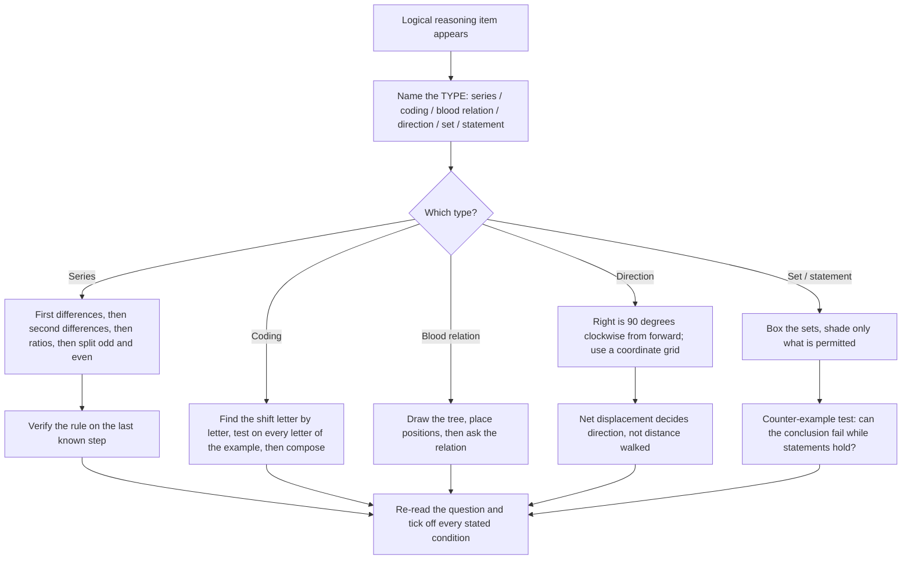

# Logical Reasoning

Logical Reasoning in the CUET UG General Test has no syllabus, no formula sheet and nothing to memorise about the world. What it tests is whether you can hold a rule in your head, apply it consistently, and not import an assumption the question never gave you. Every item is a short argument in disguise, and the score comes almost entirely from technique discipline rather than from cleverness.

The reason students plateau on this topic is that they solve by *recognition* — they look at a question, half-remember a similar one, and guess. That works until the paper varies its surface. The method that works is **extract the rule, apply it mechanically, check the answer satisfies every stated condition**. You do not need to feel the answer. You need to be able to show your working. The single most common avoidable loss is a plausible answer that violates one condition in the question.

**Rule → apply → verify.** Write the rule the question gives you, use only that rule, and then test the chosen option against every condition including the ones that were obviously true. A candidate who verifies rarely loses a logical-reasoning mark to overthinking.

### 🟢 Lite — Quick Review (1h–1d)

**Number series — four patterns that cover most items**

1. **Constant difference.** 3, 7, 11, 15, ? → +4 each time → **19**.
2. **Alternating difference.** 2, 5, 11, 23, ? → ×2+1, ×2+1... or more usually +3, +6, +12, **+24 → 47**. When differences themselves form a series, you have found it.
3. **Difference of differences.** 2, 3, 5, 9, 17, ? → differences 1, 2, 4, 8 (doubling) → next difference 16 → **33**.
4. **Multiplicative with a fixed addend.** 3, 8, 18, 38, ? → ×2+2, ×2+2, ×2+2 → **78**.

Two faster habits: **always compute the differences first**, and if the differences are not constant, look at the *ratio* instead. A series that resists a constant difference almost always has a constant ratio or a growing difference.

**Letter series — the alphabet is circular**

- Cyclic stepping: C, F, I, L, O, **R** (+3).
- Two interwoven series: positions 1,3,5,… and 2,4,6,… each follow their own rule. Split every item with an unclear pattern.
- Letter + number pairs: AZ, BY, CX, **DW** — first letters go forward, second go backward.
- Vowel/consonant alternation: A, B, C, D… with one letter shifting, e.g. AZ, AY, CX, **BW**.

Always write the letter positions (A=1 … Z=26) before deciding. Most letter-series errors are counting errors.

**Coding-decoding — the three operations**

- **Shift:** each letter moves a fixed number of places. CAT → DBU is +1. Backward shifts wrap around, so A shifted back 1 is Z.
- **Substitution:** a different letter always becomes the same letter. FIST → WXYZ means F→W, I→X, S→Y, T→Z. To decode, look for a *word* among the options.
- **Reverse + shift:** the most common final step in a chain. A, B, C become Z, Y, X if the alphabet is simply reversed; A, B, C become C, B, A if the sequence order is reversed.

**The chain pattern that appears repeatedly.** If CAT is coded DBU and DBU is coded EVW, then CAT is coded **EVW** — apply the rules in sequence, do not guess. A → B is +1 and B → C is +1, so two steps is +2.

**Blood relations — build the tree, never guess**

- A is the **father/mother** of B. B is the **son/daughter**. C is the **wife** of A. A's **father** is the grandfather.
- A's **son**'s wife is A's **daughter-in-law**.
- A's **father**'s son is A's **brother** (unless the son is A himself).
- A's **mother**'s husband is A's **father**.
- The most common trap: "A's mother's son's wife" — if the son is A himself, the wife is A's *wife*, not A's sister-in-law.
- Positional phrases: *second to the left of*, *third from the right of*, *immediate left of*. Convert each to a fixed slot before combining.

**Direction sense — the whole system is one rotation**

- Face **north**, and the senses are: forward = north, right = east, back = south, left = west.
- Face **south**: forward = south, right = west, back = north, left = east.
- Face **east**: forward = east, right = south, back = west, left = north.
- Face **west**: forward = west, right = north, back = east, left = south.

Rather than memorise four rows, memorise **right is always 90° clockwise from forward**. That one fact derives all sixteen combinations.

- **Turning rules:** a person facing north turns 90° clockwise → faces east. 180° → faces south. 45° is a *half-turn category change* (north-east, south-west) rather than a cardinal point, and questions using 45° want a diagonal answer.
- **Shadow logic:** in the morning the sun is in the east, so a shadow points **west**; in the evening the sun is in the west, so a shadow points **east**; at noon a vertical object has little or no horizontal shadow. If a question says "in the morning", turn the stated direction through 180°.
- **Overlapping direction:** if a person says "I go 5 km south, then 5 km north", the net is zero. If south and east are combined, the net is a diagonal.

**Odd-one-out — always find the rule before you look for the answer**

Read all five options, write the property shared by four of them, and the fifth is the answer. Choosing first and justifying afterwards is backwards and produces guesses.

**Statement–conclusion — the discipline that decides it**

- A conclusion **definitely follows** only if it is true in *every* case consistent with the statements. Test with a counter-example: try to build a world where the statement is true and the conclusion false. If you can, the conclusion does not follow.
- A conclusion that **may follow** is consistent with the statements but not forced — it must at least be *possible*, with no new fact introduced.
- A conclusion that **definitely does not follow** is one that introduces a new fact, or contradicts the statements, or is merely a restatement of common sense rather than a deduction.

The most common trap: converting a possibility into a certainty. "Some trains are delayed" never supports "All trains are delayed".

### 🟡 Standard — Regular Study (2d–2mo)

**Series: the three-step method that works even on an unfamiliar pattern**

- **Step 1 — Get the first differences.** Write them. If they are constant, done.
- **Step 2 — If not, look at the second differences** (difference of the differences). Constant second differences mean the terms are roughly quadratic.
- **Step 3 — If still nothing, look at ratios** and check whether a fixed multiplier or a multiplier-plus-constant works. Test on at least two consecutive pairs, because a coincidence on one pair is common.
- **Step 4 — Check for an alternating pattern.** If none of the above works across *all* gaps, split the series into odd-position and even-position terms and solve two small series separately. This is the most commonly missed step and it rescues questions that look unsolvable.

Verification is not optional. Take your answer and check it produces the pattern on the *last* known step as well as on the step before. A rule that works on three transitions out of four is a coincidence, not a pattern.

**Worked example 1.** *Series: 2, 6, 12, 20, 30, ?* First differences: 4, 6, 8, 10. They increase by 2 each time, so the next difference is 12 and the answer is **42**. Verification: 30 + 12 = 42, and the differences would then read 4, 6, 8, 10, 12, a perfect arithmetic progression. Note that the naive first guess, "these look like n(n+1) products", also gives 42 — both derivations agree, which is the strongest possible confirmation.

**Worked example 2 — the alternating case.** *Series: 3, 1, 8, 2, 15, 3, 24, ?* Odd positions: 3, 8, 15, 24 — differences 5, 7, 9, so next would be +11. Even positions: 1, 2, 3. The fourth even term is **4**. Both sub-series are simple; the whole thing looks impossible until you split it. This is the pattern that separates a scored answer from a guess.

**Worked example 3 — letter series.** *A, C, F, J, O, ?* Positions 1, 3, 6, 10, 15. The differences are 2, 3, 4, 5, so the next difference is 6 and the answer is position 21, which is **U**. Naming each step type — a growing difference, which is the second-difference rule in letter form — is what makes this reliable rather than lucky.

**Coding-decoding: the method that generalises**

Never decode letter by letter in your head. Do it in three passes.

- **Pass 1 — check for a shift.** Compare the first coded pair with the first plain pair. If *F→W* in one pair and *I→X* in another, the shift is constant (+1) and you have the rule.
- **Pass 2 — check whether the shift is uniform or positional.** Some codes shift the first letter by +1, the second by −1, and the third by +2, and reading it as a single shift will mislead you. Apply the rule letter *by letter* using its position.
- **Pass 3 — test your rule on every letter of the example before applying it to the question.** A rule that fails on the fourth letter is wrong, no matter how well it fit the first three.

For a *statement* question ("if BAT is coded ABC, how is DOG coded?"), the letters are often being *replaced by the letter immediately before or after them in the alphabet*, and the distractor is to shift by more than one place. For a *conditional chain*, write the two rules side by side and check they agree, then compose them.

**Blood relations: a placement discipline that prevents nearly every error**

The mistake is trying to hold six people in your head at once. Instead, convert the question into a statement about **positions** and draw it.

Worked example. *"A is the father of B. C is the mother of B. D is the brother of B. E is the wife of D. How is E related to A?"* Draw: A and C are a couple; their children are B and D; E is married to D. So E is A's **daughter-in-law**. The trap option is *sister-in-law*, which is true of C's side and false of A's. A different version — *"A is the mother of B; C is the brother of B; D is the wife of C; how is D related to B?"* — gives *mother-in-law*, and the classic distractor is *aunt*, which is what D would be to A's spouse.

Two extra rules that appear constantly: if the question says *son of my mother's only son*, that is your **father** (or your own self if your father has one son); and *paternal* means father's side, *maternal* means mother's side, and a question that uses the two side by side is testing the distinction.

**Direction sense: derive, do not memorise**

Convert the whole question to a coordinate grid, with east as +x and north as +y. Then *any* movement is arithmetic, and the final compass direction is the sign of the coordinates. This handles questions that memorising four rows cannot, because it handles diagonal movement and multi-step paths.

*Worked example.* "A person walks 4 km north, then 3 km east, then 4 km south. How far and in which direction from the start?" North 4 then south 4 cancels, leaving 3 km east. Net displacement is **3 km east**. The distractor is 11 km, which is the distance *walked* rather than the displacement, and the pair "how far" versus "how far from the start" is precisely the distinction being tested.

A second example with rotation: "A man facing north turns 90° clockwise, walks 2 km, turns 180° anticlockwise, walks 3 km. Where is he relative to the start?" Start facing north; 90° clockwise → east; walk 2 km east. Then 180° anticlockwise from east → west; walk 3 km west. Net = 1 km **west** of the start. The 180° rule is direction-agnostic, which is why you never need a table for it.

**Statement–conclusion taught as a formal test**

Given statements and a conclusion, run three checks in order. **Check 1 — the counter-example test:** can I build a consistent situation where the statements hold and the conclusion fails? If yes, the conclusion does not definitely follow. **Check 2 — the new-fact test:** does the conclusion mention anything the statements never said? If yes, it may follow at best, never definitely. **Check 3 — the range test:** is the conclusion *narrower* than what the statements support? A conclusion narrower than the evidence is safe; a conclusion broader than the evidence is the standard trap.

*Worked example.* Statements: "All the pens on the table are red. Some of the objects on the table are pens." Conclusion I: "Some objects on the table are red." — this **definitely follows**, because those pens are objects on the table and they are red. Conclusion II: "All objects on the table are red." — this **does not follow**, because the table may hold a blue book as well. Conclusion III: "Some objects on the table are not red." — this **may follow**, and it is not contradicted; the statements simply do not exclude other, non-red objects. The three answers come from three different tests, which is why the method rather than the intuition is what scores.

### 🔴 Extended — Deep Study (3mo+)

**Conditional reasoning and the two words that decide half the paper**

A large class of general-test items is conditional: *if P then Q*, *P only if Q*, *all A are B*, *no A is B*, *some A are B*. The words "only if" and "if" are not interchangeable, and reversing them is the single largest source of avoidable loss.

- **"P if Q"** means Q → P. Q is sufficient for P. Example: "You may enter if you have a ticket" means ticket → entry. A ticket guarantees entry; an entry does not guarantee a ticket.
- **"P only if Q"** means P → Q. Q is necessary for P. Example: "You will pass only if you study" means passing → studied. Studying is necessary for passing, but studying does not guarantee passing. A student who reverses this concludes that studying guarantees a pass, which is the error the question is built on.
- **"All A are B"** means A → B. It never means B → A. This is the same reversal as the one above, in logical dress.
- **"No A is B"** means A and B have empty intersection. "Some A are not B" means the A-set has members outside B.
- **"Some A are B"** gives no direction at all. It does not license "all A are B" and it does not license "no A is B".

The reliable way to hold all of this is the **box method**: draw a rectangle for A, put a second for B, and shade only what the statement permits. One shade for "all A are B", a dotted region for "some A are B", no shade for "no A is B". Any conclusion you can draw is one the picture allows, and any you cannot draw is not a definite consequence. This works for syllogism, blood-relation-style set questions and statement–conclusion alike.

**Rank problems: the position formula, and when it does not apply**

When ranks from both ends are given, the formula is exact and the exam will use it:

**position from one end = (sum of the two ranks) − (total number + 1).**

*Worked example.* "In a row of 40 students, Ritu is 18th from the left and Sita is 22nd from the right. How many students sit between them?" Sita from the left = 40 − 22 + 1 = 19. Ritu at 18, Sita at 19, so they are adjacent and the answer is **0**. The formula gives 18 + 22 = 40 = 40 − 41 + 1, confirming adjacency. The trap is reading "22nd from the right" as if it were from the left.

The same formula reverses cleanly: *position from left = total + 1 − position from right.* Learn one and you have the other.

Three checks that catch most errors: the answer must be an **integer**, it must lie between 1 and *n*, and two people cannot occupy the same seat. An answer that is negative, fractional or duplicated tells you the reading was wrong, not the formula.

**Grid/linear seating: never simulate in your head**

Draw it. Fix the seats first (all facing north in a row, or all facing the centre in a ring), then place the given people one at a time, and only then place the unknowns. Three habits remove nearly all errors:

- **Fix a direction before starting.** For a linear row, "left to right". For a circular arrangement, choose a start seat and a fixed direction (clockwise) and never change them.
- **Do not assume the seating is symmetric.** The commonest seating error is assuming that if A is second to the left of B, then C is second to the right of B. Nothing in the question says the arrangement is symmetric.
- **Translate "immediate" and "second to the left" separately.** "Second to the left" is not "immediate left"; a seat count of two is a real offset that you must draw.

**Complex statement groups: the only four forms that appear**

Almost every multi-statement puzzle is a combination of a small number of forms. Recognising the form tells you which tool to use.

- **Either–or with a negative:** "Either A is not true or B is not true." This is the disjunctive form; it forbids *both* being true simultaneously, so if the options include a pair that cannot both hold, that pair is the answer. This is a genuinely solvable structure and candidates miss it because they treat it as a syllogism.
- **Both–and:** "Both A and B are true." The conclusion must be true whenever both hold; test it against a case where only one holds and the conclusion fails, and it is eliminated.
- **Unless:** "A unless B" means if B is false then A is true, i.e. ¬B → A. It does not mean A → B, and it does not mean A and B cannot both hold.
- **Nested conditionals:** "If A then B, only if C." The "only if" attaches to the *second* clause and gives C as the necessary condition for B; chain them as A → B → C.

**A timed method for the whole section, and why speed comes from templates**

The items are not equally hard, and treating them as equally hard wastes the paper. Sort into three buckets on sight:

- **Pattern-recognition items** (series, coding) — mechanical once identified, roughly one minute each. Do them first while you are fresh; they build a run of easy marks that protects the rest.
- **Relationship items** (blood relations, directions, ranking) — need a small diagram, roughly one and a half to two minutes. Do these second, and draw *every* time even when the question looks trivial.
- **Set/argument items** (syllogism, statement–conclusion) — need a box or a counter-example, roughly two minutes. Do these last, and never spend more than three minutes on one; if the boxes do not resolve it, move on and return if time allows.

The reason this ordering works is that the pattern items have a *bounded* solution time, so a fixed budget can be set for them. The set items have an *unbounded* tail, so they must be abandoned rather than nursed. Managing that tail is worth more marks than any extra speed on series.

**Training the verification habit deliberately**

The habit to build is not "solve carefully" but "solve, then check the answer against every stated condition". Practise it mechanically: after you choose an option, re-read the question and tick off each condition, including the ones so obvious you skipped them. A conclusion that answers the question but violates a condition stated in the third line is the most common wrong answer in this section, and a five-second tick list prevents all of them.

A second habit: **never let a first impression lock the method.** If the question looks like a series, it may be an alternating series; if it looks like a simple syllogism, it may turn on the reversal of "only if". Twenty seconds of asking "what *kind* of item is this" is cheaper than a wrong two-minute solution.

### 🧠 Memory Anchors

- **"Differences first."** A series that looks impossible is usually a constant second difference or an alternating pair.
- **"Split odd and even."** The rescue step when a series resists everything else, and it works more often than candidates expect.
- **"Right is 90° clockwise from facing."** Derive all sixteen direction combinations from one fact instead of memorising four rows.
- **"Morning means west, evening means east."** The sun is east in the morning, and a shadow points away from it.
- **"Only if points backwards."** P only if Q means P → Q. This single distinction is the most valuable fact in the whole topic.
- **"Some A are B has no arrow."** It licenses neither "all" nor "no".
- **"Draw every time."** Every relationship error is a diagram that was not drawn.
- **Flashcard Q&A:**
  - *You will pass only if you study. Does studying guarantee a pass?* → No. Studying is necessary, not sufficient.
  - *Some pens are red. Are all pens red?* → No conclusion follows; "some" gives no direction.
  - *2, 6, 12, 20, ?* → 42, from differences 4, 6, 8, 10.
  - *A man walks 3 km north then 4 km south. Direction and distance from start?* → 1 km south — net displacement, not 7 km walked.
  - *Shadow of a pole in the morning points which way?* → West, because the sun is in the east.
  - *In a row of 40, A is 18th from left, B is 22nd from right. Gap?* → Adjacent, 0 between; 18 + 22 = 41 − 1.
  - *"Either A is false or B is false" — what does it forbid?* → A and B both being true at the same time.
  - *Is a symptom of a mother-in-law a daughter-in-law?* → No; the daughter-in-law is the son's wife, and the mother-in-law is the wife's mother.

### 🎯 Exam Traps & Error Log

1. **Reversing "only if".** "P only if Q" is P → Q. Reversing it turns a necessary condition into a sufficient one and produces the wrong answer almost every time.
2. **Reading "22nd from the right" as if it were from the left.** Convert every positional phrase to a single coordinate system before combining two of them.
3. **Assuming a seating arrangement is symmetric.** If A is second left of B, nothing follows about C. Symmetry is never given.
4. **Forgetting to check odd/even splitting on a hard series.** A 24, 18, 12, … style sequence that looks impossible is often two interleaved progressions.
5. **Reading remainders in the wrong order in decimal-to-binary conversion.** The result is a valid-looking wrong number.
6. **Turning a possibility into a certainty.** "Some trains are delayed" does not support "All trains are delayed", and the "definitely follows" option is the trap.
7. **Solving a blood relation from memory instead of a diagram.** A's mother's son's wife is A's wife if A is her only son, and the sister-in-law option is designed for exactly that error.
8. **Answering "how far walked" when the question asks "how far from the start".** Path length and displacement differ whenever the path is not a straight line.
9. **Assuming a shadow points where the sun is.** It points away from the sun; morning shadow is west.
10. **Choosing the answer that reads well instead of the one the rule produces.** Logical reasoning distractors are written to sound sensible. Judge by the rule, never by the sound.

### 🧪 Self-Test — 8 Questions with Worked Answers

Answer all eight on paper first, and apply the type-identification step before any recall.

1. **"Find the next term: 3, 8, 18, 38, ?"**
   *Worked answer:* **78.** Method — differences first: 5, 10, 20, each doubling. Next difference is 40, giving 38 + 40 = 78. The same pattern reads as ×2+2 each step: 3×2+2 = 8, 8×2+2 = 18, 18×2+2 = 38, 38×2+2 = 78. Two independent readings that agree is the strongest verification available. The distractor 76 comes from applying ×2 and forgetting the addend.

2. **"If TEACHER is coded VGCEJGT, how is STUDENT coded in the same pattern?"**
   *Worked answer:* **UVWFPEV.** Method — read the pattern from the example, letter by letter. T→V is +2, E→G is +2, A→C is +2, C→E is +2, H→J is +2, E→G is +2, R→T is +2. The rule is a uniform +2 shift, so S→U, T→V, U→W, D→F, E→G, N→P, T→V, giving **UVWFPEV**. The trap is a mixed shift, applying +2 to some letters and +1 to others because the eye follows the printed word rather than the alphabet. Always verify the rule on all seven letters before applying it to eight.

3. **"Pointing to a man, a woman said, 'He is the son of the only daughter of my mother.' How is the man related to the woman?"**
   *Worked answer:* **Her husband.** Method — unpack in stages. "The only daughter of my mother" is the woman herself, assuming she is female and has no sister. "The son of" that person is her son. So the man is her **son**, not her husband. Note the deliberate wording: because she is the *only* daughter, her mother's only daughter is herself. A version reading "the son of the only son of my mother" would give her husband. Always resolve each clause into a person before combining.

4. **"A person walks 5 km towards the south, then turns left and walks 3 km, then turns left again and walks 5 km. In which direction is he from the starting point?"**
   *Worked answer:* **North-east.** Method — coordinate grid, do not simulate. Facing south, 5 km south. Turn left from south means turning to the east, so 3 km east. Turn left from east means north, so 5 km north. Now cancel: the 5 km south and the 5 km north cancel exactly, leaving a net displacement of **3 km east**. The answer is *east*, and the direction question is settled by cancellation rather than by any rule about lefts. The distractor "north" is what you get by ignoring the first turn.

5. **"Statements: All roses are flowers. Some flowers are red. Which conclusion follows? (I) Some roses are red. (II) No rose is red. (III) Some flowers are not roses."**
   *Worked answer:* **Only III definitely follows.** Method — draw the boxes. Put the rose box inside the flower box. Then place a region of flowers outside the rose box; the statement "some flowers are red" tells you that some flowers are red, and it need not be inside the roses. Conclusion I: the red flowers could all be outside the rose box, so it does not definitely follow. Conclusion II: nothing stops every rose from being red, so it does not follow. Conclusion III: the flowers outside the rose box exist by construction, so it definitely follows. The lesson is that "all A are B" plus "some B are C" gives you nothing about where the C's are.

6. **"A, B, C, D, E are standing in a row. C is at the extreme left, B is second to the right of A, and D is at the extreme right. Who is in the middle?"**
   *Worked answer:* **A.** Method — draw the five slots before placing anyone. Left to right the slots are 1, 2, 3, 4, 5. C is at slot 1, D is at slot 5. B is second to the right of A, so the pair occupies two adjacent slots in that order. The remaining free slots are 2, 3 and 4, and the only adjacent pair among them in the order A-then-B is 2 and 3. So A is at slot 2, B at slot 3, and A is in the middle at slot 3 of 5 counting the whole row. Note the two errors this method prevents: placing A before B, and assuming a symmetric arrangement with C and D at both ends.

7. **"'You are intelligent only if you study hard.' If the statement is true, which must be true?"**
   *Worked answer:* **Anyone who is intelligent studied hard.** Method — parse the conditional carefully. "P only if Q" is P → Q, so P is *intelligent* and Q is *studied hard*. This means studying hard is necessary for being intelligent, and being intelligent guarantees it. It does **not** mean that studying hard guarantees being intelligent, and the option saying so is the standard distractor. Every question built on "only if" is testing this one reversal.

8. **"Next in the series: 2, 5, 11, 23, ?"**
   *Worked answer:* **47.** Method — check the differences before anything else: 3, 6, 12, each doubling, so the next difference is 24 and 23 + 24 = **47**. The identical result comes from ×2+1: 2×2+1 = 5, 5×2+1 = 11, 11×2+1 = 23, 23×2+1 = 47. Note that the simple difference reading and the multiplicative reading agree, which is the check you should perform on every series before you commit — and note also that the earlier item in this set used ×2+2, so do not carry a rule between questions.

### 💡 Pro Tips

1. **Name the type of item in five seconds before you start solving.** Series, coding, relation, direction, set, statement — each has a fixed method, and the wrong method costs two minutes.
2. **Differences first, ratios second, odd/even split third.** That order solves almost every series, and skipping to "it looks like ×2" is how guesses get made.
3. **Verify the pattern on the last known step, not just the first.** A rule that fits three transitions out of four is a coincidence.
4. **Draw for every relationship question, however simple it looks.** Blood relations, seating and ranking are all diagram questions wearing prose clothes.
5. **Convert every positional phrase to a coordinate before combining.** "From the right", "second to the left" and "extreme end" are all errors waiting to happen if you mix systems.
6. **Answer a series of questions in type order.** Mechanical items first while you are fresh, relationship items second, set items last where you can abandon a hard one without panic.
7. **Set a two-minute ceiling on set and statement items.** These have an unbounded tail, and protecting the rest of the paper is worth more than resolving one of them.
8. **Tick off every stated condition before you commit.** The most common wrong answer is the one that answers a nearby question, and a five-second check removes it.

---

## Continue your study

- **[View this topic in your CUET UG roadmap](/roadmap/?exam=cuet&duration=1mo)** — see where "Logical Reasoning" fits in your personalised plan
- **[Build a quick revision plan](/roadmap/?exam=cuet&duration=1d)** — 1-day sprint covering highest-weight topics
- **[CUET UG exam overview](/exams/cuet/)** — pattern, eligibility, and syllabus
- **[All General Test notes](/notes/cuet/general-test/)** — browse sibling topics in this subject

*Content adapted based on your selected roadmap duration. Switch tiers using the selector above.*
