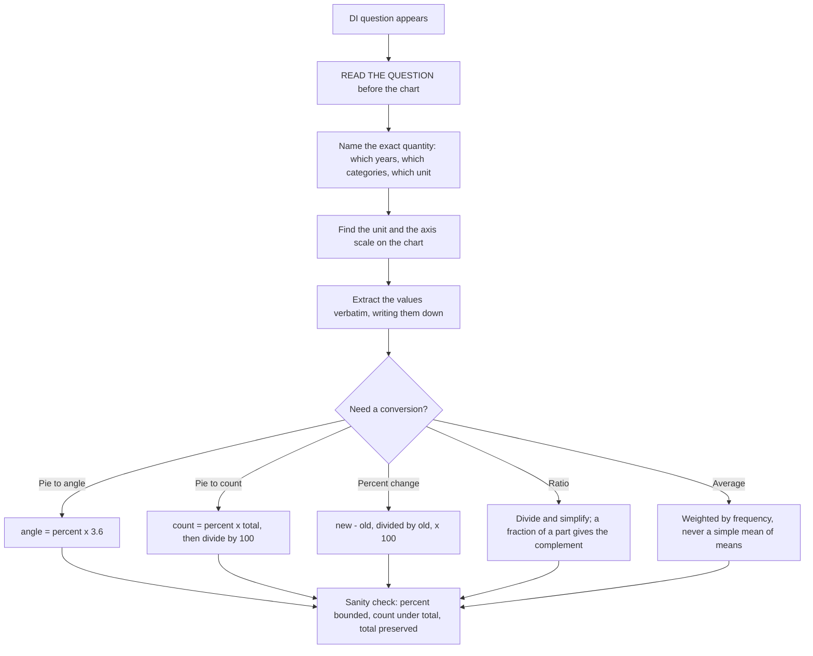

# Data Interpretation

Data Interpretation is not a maths subject with a chart attached. It is a *reading* subject where a small amount of arithmetic is required. The candidates who lose marks here are almost never the ones who cannot divide; they are the ones who took the wrong number off the chart, mixed up two years, or answered a question about 2019 when the stem asked about the change from 2019 to 2020. The arithmetic in a well-set DI set is deliberately simple — the difficulty is entirely in the extraction step.

So the method is fixed: **read the question first, identify the exact quantity it names, find that quantity, then compute**. Not the reverse. The single habit that separates a good DI score from a poor one is to never look at a chart before reading the question, because the chart then becomes a hunt for something you half-recognise rather than a lookup of something you need.

**Question first → extract exactly → compute → sanity check.** Four steps, and the fourth is the one people skip: verify the answer is the *right kind of number* before you commit. A percentage between 0 and 100, a count that fits inside the total, a ratio that reduces — these checks catch most extraction errors at zero cost.

### 🟢 Lite — Quick Review (1h–1d)

**The five formats and what each one demands**

| Format | The reading risk | The safe habit |
| --- | --- | --- |
| **Bar chart** | Misjudging the value from bar height | Read the axis scale first; bars start at zero, so height is proportional |
| **Line graph** | Reading the wrong point or the wrong year | Mark each year; the question names the year, not the trend |
| **Pie chart** | Confusing percentage with degrees | Convert once, deliberately: angle = share ÷ 100 × 360 |
| **Table** | Reading the wrong row/column intersection | Underline the row label and the column label before reading |
| **Caselet** | Missing values | Write the known values in a scratch table; compute the rest from totals |

**Pie chart conversion — the one formula that appears in nearly every set**

A share of *p* percent corresponds to an angle of **p × 3.6 degrees**, because 100% is 360°. And the reverse: an angle of *θ* degrees is **θ ÷ 3.6 percent**.

Worked conversions: 25% → 90°; 50% → 180°; 10% → 36°; 1% → 3.6°. Useful anchors: a quarter is 90°, a third is about 120°, a fifth is 72°.

If a chart gives angles and asks for a percentage, and the options are given as percentages, divide by 3.6. If it gives percentages and options are angles, multiply by 3.6. Do the conversion once and commit; converting twice in your head is where the errors are.

**The percentage set — five forms, all worth memorising**

- **Percent change** = (new − old) / old × 100.
- **Percent of a number**: x% of n = n × x / 100.
- **Percentage points vs percent**: a rise from 20% to 25% is a rise of 5 *percentage points* but a rise of 25% *in relative terms*. Exam items on "share" and "growth" often test this distinction.
- **Successive percentage change** never adds: a 10% rise followed by a 10% fall is not a return to the start. It is 100 × 1.10 × 0.90 = 99, so 1% below. A × b then ÷ b, or ÷ b then × b, does return to the start.
- **Percentage of a percentage**: 20% of 30% is 6%, not 50%.

**Ratio and proportion**

- Ratio *a : b* means the two parts are in that proportion. If total is *T*, the parts are *aT/(a+b)* and *bT/(a+b)*.
- Ratios must be simplified before use. 4 : 6 is 2 : 3, and using 2 : 3 saves arithmetic.
- When the same quantity appears in two different ratios, convert to a common scale first — the least common multiple of the ratio numbers, or express both as fractions of the whole.
- *A is 3/5 of B* means A : B = 3 : 2, because the remaining 2 parts belong to B. This inversion is the most common ratio error.

**Average (arithmetic mean)**

Sum ÷ number of values. Two shortcuts earn real time:

- **Averages of averages:** if the two groups are equal in size, average of averages is just the average. If they are *not* equal in size, it is not, and you must go back to totals.
- **Weighted average:** if group A has average *x* with *n* members and group B has average *y* with *m* members, the combined average is (nx + my) / (n + m). Guessing a simple mean is the standard trap.

**Growth rate over multiple years**

Average annual growth for *n* periods is **((final ÷ initial)^(1/n) − 1)**, but exam items almost never need the exact root. They need: total growth over the whole period, and the *relative* comparison of growth between two quantities, which can be done by comparing **final ÷ initial** for each and comparing those ratios. A quantity that grew from 100 to 200 doubled; one that grew from 20 to 60 tripled. Doubling beats tripling in percentage terms (100% against 200%) — and the raw increase (80 against 40) can point the other way, which is exactly the trap.

### 🟡 Standard — Regular Study (2d–2mo)

**The four-step method, applied to a full question**

*Worked example — table format.* A table shows sales of four products across two years:

| Product | Year 1 (units) | Year 2 (units) |
| --- | --- | --- |
| A | 200 | 300 |
| B | 400 | 300 |
| C | 300 | 500 |
| D | 100 | 400 |

*Question: "What is the percentage increase in the combined sales of A and B from Year 1 to Year 2?"*

- **Step 1 — read the ask.** It asks for a *percentage increase* in the *combined* sales of *two named products*, across *two named years*. All four qualifiers matter.
- **Step 2 — extract exactly.** Year 1: A = 200, B = 400, combined = 600. Year 2: A = 300, B = 300, combined = 600.
- **Step 3 — compute.** Increase = 600 − 600 = 0, so percent change = 0 / 600 × 100 = **0%**.
- **Step 4 — sanity check.** Zero is a legitimate answer and it is exactly the kind of answer a set includes deliberately, because A rose 50% and B fell 25%, and they cancelled. A candidate who computed A's change and B's change separately and added them would get 25%, which is wrong because the two products have different starting values and cannot be averaged.

That last sentence is the general lesson: **you must combine the values first and then compute the change, or compute each change against a common base.** Never average two percentage changes unless the bases are equal.

**Bar and line charts: the two reading rules**

- **Read the scale before the bars.** A chart whose axis starts at 50 and ends at 120 does not have bars proportional to their values from the baseline; you must read against the gridline the bar actually reaches, not against the bottom of the plot. This is the single largest source of chart-reading errors.
- **A line graph is about points, not slopes.** A question asking for the value in a particular year wants that year's point. A question asking about the *difference* between two years wants the vertical gap. A question asking about the *fastest growth* wants the steepest segment, which is the largest vertical change per unit of horizontal movement — so check both the change and the interval.

*Worked example.* On a line graph, a series goes 20, 45, 50, 80 across four years. The year-on-year changes are +25, +5, +30. The largest is +30, so the fastest growth is in the last interval. Note that 45 to 50 is also a 100%-ish relative change in a different sense, so specify whether you mean absolute or relative growth — and if the question is ambiguous, use the one the options match, having checked that the options are unambiguous.

**Pie charts: the three recurring questions and how to answer each**

- **"What percentage does X represent?"** Use the angle or the label directly. If the chart gives only a total and one share, subtract to find the rest.
- **"What is the ratio of X to Y?"** Divide the two percentages, or the two angles, then simplify. 30% to 15% is 2 : 1.
- **"What is the difference in the number of people, not the percentage?"** Multiply the percentage by the total. Percentage points and counts are different quantities and a question that gives a headcount total is testing whether you remember to multiply.

The missing-slice version: if a pie chart shows five slices and one is labelled "Others", and the question asks for a slice you must derive, subtract all known shares from 100 first, then multiply by 3.6 for the angle.

**Caselet (missing-value) problems: reconstruct the whole table first**

A caselet gives a total and a partial table with one or two blanks. The method is to **complete the table before answering anything**, because most sub-questions need a value that is not printed.

*Worked example.* A factory makes three products A, B, C totalling 1200 units, and it is known that B is half of A and C is 20% of the total. Find C. C = 20% of 1200 = 240. B = half of A, so A + B = 1.5A, and A + B + C = 1200, so 1.5A = 960, giving A = 640 and B = 320. Now every cell exists, and any follow-up question — the ratio A : B : C, or the percentage of A — is a lookup. The discipline is: **never answer a sub-question from a partial table when the table can be completed in two lines.**

A variant is the row-total or column-total problem, where you subtract the known cells from the total. Write the subtraction explicitly rather than mentally, because mental subtraction of five terms is where the error occurs.

**Data sufficiency: read the ask, then find the minimum**

When a question supplies two or more statements and asks whether you can determine an answer, the test is: **can you determine the answer using each statement alone, or only by combining them?**

- **Either statement alone is enough** → the answer is determinable.
- **Both are needed together** → determinable only in combination.
- **Even together is not enough** → not determinable.

The reliable technique is to attempt the question using statement 1 alone, in your head, and note the information you lack; then do the same with statement 2; then combine. Students often test the combination first and then cannot tell which answer to select, so work in the order 1, 2, then 1+2.

**A worked DI set, end to end, on a pie chart**

A chart shows the distribution of 800 books across four categories: A 45%, B 30%, C 15%, D 10%.

*Q1. How many books are in category A?* 45% of 800 = 360. Method: percentage × total, and the sanity check that 360 is less than 800 and is about half of it.
*Q2. What is the angle for category B?* 30 × 3.6 = 108°. Method: percentage × 3.6, and 108° is a plausible slice slightly larger than a right angle.
*Q3. What is the ratio of C to D?* 15 : 10 = 3 : 2. Method: divide and simplify; do not convert to counts, since the ratio is identical either way.
*Q4. If 20% of category A is moved to B, what is B's new percentage?* A loses 45 × 0.20 = 9 points, so A falls to 36% and B rises to 39%. The sanity check that the total is still 100% (36 + 39 + 15 + 10 = 100) is the step that catches most of these errors.
*Q5. How many more books are in A than in C?* (45 − 15)% of 800 = 30% of 800 = 240. Method: difference of percentages × total.

The set is representative: every sub-question uses one of percentage-to-count, percent-to-angle, ratio, transfer, and difference, and each has a single reliable move. There is no sub-question that requires a novel idea.

### 🔴 Extended — Deep Study (3mo+)

**The four sanity checks — learn these and you cannot commit a bad answer**

- **Percentage check:** a percent of a population is between 0 and 100. If your answer is 130%, either the total you used is wrong or you are computing a *change* percentage and mislabelled it. Change percentages legitimately exceed 100%, so the check is: a *share* is bounded, a *change* is not.
- **Count check:** no count may exceed the stated total, and a count should generally be a whole number. If you get 187.5 books, the question either wants a rounded answer or you have used the wrong total.
- **Ordering check:** if the question says "which is the largest", verify by direct comparison, not by impression of a chart. A label that looks biggest is often not.
- **Reversibility check:** after any transfer or percentage change, confirm the total is unchanged. This catches essentially every redistribution error.

**Comparative and index questions**

Two quantities are compared by taking the ratio of their *growth factors*, not by comparing their absolute increases.

*Worked example.* Product X goes from 200 to 260; product Y goes from 50 to 110. X's increase is 60, Y's is 60 — equal in absolute terms, so a question asking "which increased more?" tempts you to answer "equal". The correct comparison is of growth factors: X's factor is 260/200 = 1.3 (a 30% rise) and Y's is 110/50 = 2.2 (a 120% rise), so **Y grew far more**. The identical absolute increases are the entire design of the question. Whenever two items show the same absolute change, expect the question to be about relative growth.

**Averages of grouped data, and why simple averaging fails**

When a set is grouped by a common frequency, the simple mean is wrong. With values 2, 4, 4, 6 appearing once, twice, twice and once, the simple mean of 2, 4, 6 is 4, but the true mean is (2 + 8 + 8 + 6)/6 = 24/6 = 4 — equal here by coincidence, which is exactly what makes it dangerous. Change the frequencies and the simple mean is simply wrong. The rule: **whenever frequencies differ, go through totals.** Group the data, multiply each value by its frequency, add, divide by total frequency. And when combining two averages, always check whether the group sizes are equal; if they are not, weighted average is mandatory.

**Growth over a span: total change, CAGR and the direction of comparison**

Three different questions produce three different answers, and mixing them is a common error.

- *"What is the total growth over five years?"* → (final − initial) / initial.
- *"What is the average annual growth?"* → the compound annual rate, or simply total change ÷ 5 if the question defines it that way. Read the stem for which definition it wants.
- *"Which grew faster, X or Y?"* → compare the growth *factors*, final ÷ initial, for each.

*Worked example.* A rises 400 → 500, factor 1.25. B rises 800 → 1000, factor 1.25. Their percentage growths are identical at 25% even though B's absolute increase is double. A question showing exactly this and asking "which grew faster" is testing growth factor, and the honest answer is that both grew at the same rate. Candidates see the larger number and pick B.

**The reading techniques that make a chart set fast**

- **Underline the unit on every axis before you start.** "In thousands" changes every value by a factor of a thousand, and a missed unit is an instant five-figure error.
- **For a multi-part set, answer the easiest sub-question first** to establish the reading convention, then use the remaining time on the harder ones. The first answer is often a multiple-choice sanity anchor for the rest.
- **Never interpolate a value the question does not need.** Chart reading is only accurate to the nearest gridline; if an option requires a precise value the chart does not give, the question wants a computation from given numbers instead.
- **For a line graph, note the shape of the question.** "Which year saw the highest increase?" → steepest segment. "In which year was the value highest?" → the topmost point. These are different questions and are frequently confused; a series can peak in one year and have its steepest rise in another.

**Guessing well when a chart is unreadable**

Sometimes a chart is genuinely hard — a pie with eight thin slices, or a bar chart with a broken axis. The approach is to use what you can bound. You know each share is between 0 and 100 and that all shares sum to 100, so a slice that visibly exceeds a quarter is above 25%. You know the largest option cannot exceed the total, and the smallest possible value for a missing slice is 100 minus the sum of the largest possible values of the others. Bounding eliminates three of four options in a single line, and then a single precise estimate finishes the job. This is a legitimate method, not a guess, and it is far better than committing to an option that violates a bound you could have checked.

**Building a DI habit that generalises outside this section**

Every one of these techniques — extract exactly what is asked, combine before comparing, use growth factors rather than absolute change, check the total is preserved — is a general reasoning skill, and it is worth naming as such. The candidates who do well in data interpretation are the same candidates who do well in the analytical and quantitative-comparison parts of the paper, because the difference is one of surface, not of capability. Practising DI deliberately develops transferable extraction discipline, which is why it carries a higher weight than a purely memorisable topic of the same length.

### 🧠 Memory Anchors

- **"Question first, chart second."** Looking at a chart before reading the question turns an extraction into a hunt.
- **"360 over 100 is 3.6."** Percent × 3.6 = degrees. The only pie-chart formula you need.
- **"Combine before you compare."** Two products cannot have their percentage changes averaged unless their bases are equal.
- **"Growth factor, not increase."** Doubling from 100 to 200 and tripling from 20 to 60 are different; equal absolute increases say nothing about relative growth.
- **"Weighted average, always."** If the group sizes differ, the simple mean is wrong.
- **"Preserve the total."** After any transfer, the pieces must still sum to 100 or to the stated total.
- **"Read the unit."** "In thousands" is the difference between 800 and 800,000.
- **Flashcard Q&A:**
  - *25% as a pie angle?* → 90°, since 25 × 3.6 = 90.
  - *A rises from 20% to 25% — what is that?* → 5 percentage points, which is a 25% relative increase.
  - *A goes up 10% then down 10% — back to start?* → No; 100 × 1.1 × 0.9 = 99, one percent below.
  - *A : B is 3 : 5 and the total is 40.* → A = 15, B = 25, since the parts are 15 and 25 out of the 8 total parts.
  - *If A is 3/5 of B, what is A : B?* → 3 : 2, because B retains the remaining two fifths.
  - *Two groups average 60 and 80 with 20 and 40 members.* → Combined = (1200 + 3200)/60 = 4400/60 ≈ 73.3, not 70.
  - *X goes 200→260 and Y goes 50→110; who grew more?* → Y, since 1.3× against 2.2×, even though both rose by 60.
  - *Total 800, category 45%.* → 360, and the sanity check is that it is under 800.

### 🎯 Exam Traps & Error Log

1. **Reading the chart before the question.** You then extract a plausible-looking number that is not the number asked for, and the arithmetic is performed correctly on the wrong value.
2. **Ignoring the axis scale or the unit.** A bar chart with a broken baseline, or a table headed "in thousands", produces an answer that is right in shape and wrong by three orders of magnitude.
3. **Averaging two percentage changes.** Only valid when the two changes share a base. Otherwise compute the combined values and then the change.
4. **Treating a percentage-point change as a percentage change.** 20% to 25% is +5 points and +25% relative, and a question will not tell you which one it wants unless you check the options.
5. **Reading a line graph's steepest point as its highest point.** A series can rise fastest in one year and peak in another; these are separate questions.
6. **Converting percentage to counts and forgetting the division by 100.** 45% of 800 is 360, not 36,000.
7. **Taking a simple average of two unequal groups.** Use the weighted average; the simple mean is only valid when the group sizes are equal.
8. **Reversing a fraction-of-a-part question.** If A is 3/5 of B, the ratio is 3 : 2, not 3 : 5, because B holds the remainder.
9. **Answering from a partial table when it can be completed.** Caselet blanks are meant to be filled first, and most sub-questions need the filled values.
10. **Forgetting that a transfer must preserve the total.** Check the sum after any redistribution; this catches essentially every such error.

### 🧪 Self-Test — 8 Questions with Worked Answers

Answer all eight on paper first, and read the question before the data in every case.

1. **"A pie chart shows 20%, 35%, 25% and the rest. What is the angle for the 'rest' segment?"**
   *Worked answer:* **72°.** Method — subtract first, convert once. The rest is 100 − 80 = 20%. Then 20 × 3.6 = 72°. The trap answers come from converting each known slice and subtracting the angles: 72 + 126 + 90 = 288, and 360 − 288 = 72, which agrees — do the subtraction *before* converting and the check is free. Note also that the answer happens to be the same as the first slice, which is a coincidence and not a reason to doubt the result.

2. **"Sales were 250 units in Year 1 and 325 units in Year 2. What is the percentage increase?"**
   *Worked answer:* **30%.** Method — (new − old)/old × 100 = (325 − 250)/250 × 100 = 75/250 × 100 = 30. The base is the *old* value, and the sanity check is that 75 is exactly 30% of 250. The most common wrong answer here is 23% (75/325), which divides by the new value; that figure answers a different question. When the stem says "increase", the denominator is always the earlier value.

3. **"The average age of 30 students is 14 years. Four new students with an average age of 10 join. What is the new average?"**
   *Worked answer:* **about 13.5 years.** Method — never average two averages unless the groups are the same size, and here they are not. Go through totals: 30 × 14 = 420; 4 × 10 = 40; combined 460 over 34 students, so 460 ÷ 34 ≈ 13.53. The simple average of 14 and 10 is 12, which is the trap answer and is impossible here, because the new students are a small minority — the overall average must lie between 10 and 14 but much closer to 14, since they are only 4 of 34. That bound check rejects 12 immediately and is the fastest way to see the error.

4. **"Two brands: Brand X grew from 400 to 500 units; Brand Y grew from 800 to 1000 units. Which grew faster?"**
   *Worked answer:* **Both grew at the same rate — 25%.** Method — compare growth factors, not increases. X: 500/400 = 1.25. Y: 1000/800 = 1.25. Both are 1.25, so both grew 25%. X's absolute increase is 100 and Y's is 200, which is what tempts you to answer Y. The question is designed on exactly that appearance, and the growth-factor comparison is the entire answer.

5. **"A factory makes 1200 items. Product B is half of A, and C is 20% of the total. Find C."**
   *Worked answer:* **240.** Method — C is directly given as a share of the total, so no derivation is needed: 20% of 1200 = 240. The reason to compute the whole table anyway is the follow-up questions, and here they are ready: A + B = 960, and since B = A/2, 1.5A = 960, so A = 640 and B = 320. Check: 640 + 320 + 240 = 1200. The verification that the parts sum to the stated total is what confirms the interpretation.

6. **"In a bar chart of exports (in '000 tonnes) for four years, the bars read 40, 55, 55, 70. What is the increase from the first to the last year in tonnes?"**
   *Worked answer:* **30,000 tonnes.** Method — extract the numbers, note the unit, compute, then convert. The increase in the chart's units is 70 − 40 = 30, and the axis is in thousands, so 30 thousand tonnes = **30,000 tonnes**. The trap is to report 30, or 30 tonnes, having ignored the multiplier entirely. This is the single most common DI error and the reason "read the unit" is the first step rather than an afterthought.

7. **"Data: A 30, B 20, C 50. If A is increased by 20% and B decreased by 20%, what is the total change?"**
   *Worked answer:* **Increase of 2.** Method — apply the changes to the values, then compare totals. A: 30 × 1.2 = 36, a gain of 6. B: 20 × 0.8 = 16, a loss of 4. C is unchanged at 50. Original total 100, new total 102, so the total rises by **2**. The tempting answer is 0, from adding +20% and −20%, which is the successive-percentage error in a different guise: a rise of 20% on 30 is worth 6 while a fall of 20% on 20 is worth only 4, because the bases differ. The general rule: compute in value space, never in percentage space.

8. **"Statement 1 gives the number of men and women in a group. Statement 2 gives the number of men. Can the number of women be determined?"**
   *Worked answer:* **Statement 1 alone is enough.** Method — test each statement separately, in order. From statement 1, women = total − men, and both figures are given, so women is determined without statement 2. Statement 2 alone is useless, because a count of men says nothing about women. The trap is to conclude "both are needed" because two statements were supplied, or to answer from the combination without testing the individual statements. Testing 1, then 2, then 1+2 in that order is the only reliable way to answer these.

### 💡 Pro Tips

1. **Read the question before you look at any data.** It is the one habit that eliminates the most marks lost in this topic.
2. **Write extracted values down before computing.** Mental arithmetic on chart-read numbers multiplies two error sources.
3. **Note the unit on the axis before you read a single bar.**
4. **Convert once, deliberately, and check the total is preserved** whenever you redistribute.
5. **Compare growth factors when the question asks which grew faster,** and absolute increases only when it asks which grew by more units.
6. **Complete a caselet table before answering any part of it.** The blanks exist to be filled.
7. **Use bounds to eliminate.** A share cannot exceed 100%, a count cannot exceed the total, and an average must lie between the smallest and largest values in its group.
8. **Answer the easiest sub-question first** in a set, to fix the reading convention and confirm your extraction before the harder items build on it.

---

## Continue your study

- **[View this topic in your CUET UG roadmap](/roadmap/?exam=cuet&duration=1mo)** — see where "Data Interpretation" fits in your personalised plan
- **[Build a quick revision plan](/roadmap/?exam=cuet&duration=1d)** — 1-day sprint covering highest-weight topics
- **[CUET UG exam overview](/exams/cuet/)** — pattern, eligibility, and syllabus
- **[All General Test notes](/notes/cuet/general-test/)** — browse sibling topics in this subject

*Content adapted based on your selected roadmap duration. Switch tiers using the selector above.*
