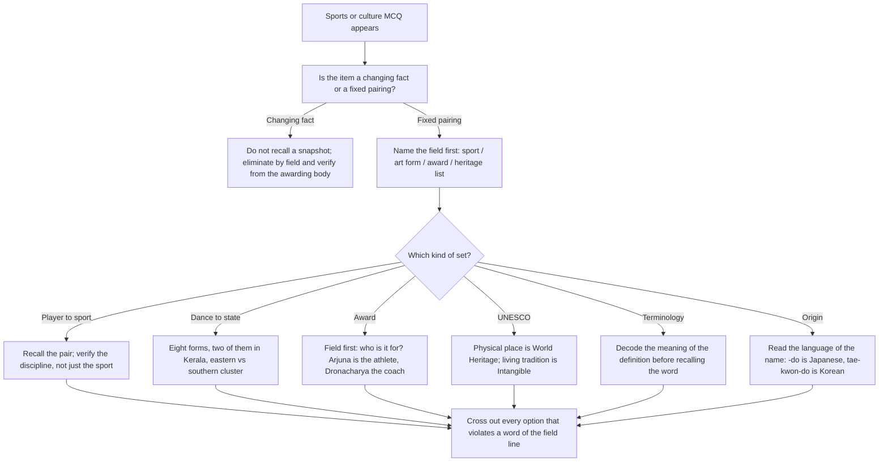

# Sports & Culture

Sports and Culture looks like a memory subject and is treated like one, which is why it scores badly. In reality almost every question in it is a **pairing** question or a **classification** question, and both of those are closed sets. There are a fixed number of player–sport pairs worth knowing, a fixed number of Indian classical dance forms, a fixed hierarchy of awards, and a fixed set of cultural categories. Nothing here is open-ended. You are not being asked to know everything; you are being asked to know a small number of lists well enough that a stem can be matched to its partner.

The second thing to understand is the *decay problem*. Current recipients, current tournament winners and the current host of a rotating championship all change on a cycle. A note that lists last year's names is wrong next year and gives you a false sense of security. A note that teaches you the **structure** — which body awards what, which state a form belongs to, which list a tradition goes on — stays correct indefinitely. That is the difference between a fact that ages and a frame that does not, and this topic is almost entirely made of the second kind.

**Pair → classify → eliminate.** Find the partner for the given item, place it in its category, and let the category kill the wrong options. For anything that genuinely varies by year, learn where to verify it rather than learning a snapshot.

### 🟢 Lite — Quick Review (1h–1d)

**Frame 1 — the player–sport map**

| Sport | Names you should be able to place |
| --- | --- |
| **Badminton** | P. V. Sindhu, Saina Nehwal, Satwik Sairaj Rankireddy, Srikanth Kidambi, HS Prannoy |
| **Boxing** | Mary Kom, Vijender Singh, Lovlina Borgohain, Nikhat Zareen |
| **Wrestling** | Bajrang Punia, Sakshi Malik, Yogeshwar Dutt, Aman Sehrawat, Sangram Singh |
| **Weightlifting** | Mirabai Chanu, Sushil Kumar, Kunjarani Devi |
| **Shooting** | Abhinav Bindra, Gagan Narang, Manu Bhaker, Anjali Bhagwat |
| **Archery** | Deepika Kumari, Atanu Das, Tarundeep Rai, Limba Ram |
| **Athletics** | P. T. Usha, Anju Bobby George, Dutee Chand, Hima Das, Neeraj Chopra (javelin) |
| **Tennis** | Leander Paes, Sania Mirza, Sumit Nagal, Yuki Bhambri |
| **Chess** | Viswanathan Anand, Pentala Harikrishna, Vidit Gujrathi, Praggnanandhaa |
| **Hockey** | Balbir Singh Sr, Dhyan Chand, P. R. Sreejesh, Harmanpreet Singh, Rupinder Pal Singh |
| **Cricket** | Sachin Tendulkar, Sunil Gavaskar, Kapil Dev, Rahul Dravid, Saurav Ganguly, Virat Kohli, M. S. Dhoni, Jasprit Bumrah |
| **Football** | Bhaichung Bhutia, Sunil Chhetri, Anirudh Thapa |
| **Kabaddi** | Pro Kabaddi players generally appear in team-based or league questions; recognise the sport from the mat and the "raider/chaser" vocabulary |

**Two corrections that are worth memorising because they are asked as traps.** Neeraj Chopra is an **athletics** athlete who competes in the javelin — he is not a "javelin thrower" as a separate sport, and if the options split athletics events against team sports he belongs with athletics. Aman Sehrawat and Sakshi Malik are **wrestlers**, not boxers, and questions that offer both sports in the option list are testing exactly that. Mary Kom is a boxer and has also won at the Asian Games in a different weight category; when a question says "boxing", she is the unambiguous name.

**Frame 2 — the eight classical dances and their states**

This is a closed eight-item set, and questions almost always present seven correct pairings and one wrong, or shuffle the states.

| Dance | State |
| --- | --- |
| Bharatanatyam | Tamil Nadu |
| Kathak | Uttar Pradesh |
| Kathakali | Kerala |
| Kuchipudi | Andhra Pradesh |
| Odissi | Odisha |
| Manipuri | Manipur |
| Mohiniyattam | Kerala |
| Sattriya | Assam |

Two observations that turn this list into a method. **Two dances belong to Kerala** (Kathakali and Mohiniyattam), so a state is not a unique key — if an option says "only one classical dance form belongs to this state", Kerala is the answer. And the dances cluster by geography: the eastern belt (Odisha, West Bengal, Manipur, Assam) has narrative, temple-linked forms with elaborate make-up, while the southern forms (Bharatanatyam, Kuchipudi, Mohiniyattam) are temple and devadasi traditions. Knowing the cluster tells you which costume and make-up an option describing a performance belongs to.

**Frame 3 — the award hierarchies**

*Civilian awards, ascending:* **Padma Shri → Padma Bhushan → Padma Vibhushan → Bharat Ratna**. Bharat Ratna is the highest civilian award. Remember the mnemonic: *Shri, Bhushan, Vibhushan* — the suffix **-shan** stays, and the prefix grows in seriousness: Shri, Bhushan, Vibhushan.

*Sporting awards:* **Arjuna Award** (for sportspersons) → **Dronacharya Award** (for coaches) → **Major Dhyan Chand Khel Ratna** (the highest sporting honour). The distinguishing feature is *who* each is for, not the order: Arjuna for the athlete, Dronacharya for the coach, Khel Ratna for lifetime contribution. A question offering "Dronacharya" for a player is eliminating itself.

*Military decorations, highest first:* **Param Vir Chakra** (wartime, the highest) → **Ashoka Chakra** → **Kirti Chakra** → **Vir Chakra** (all peacetime gallantry, in that order). The wartime-versus-peacetime distinction is the tested one, and it is worth internalising rather than memorising the list top to bottom.

*Literature, from the Sahitya Akademi:* **Saraswati Samman** for overall contribution to literature, **Bhasha Samman** for translation, and the **Jnanpith Award** for outstanding contribution. The Sahitya Akademi also gives the **Balamani Amarnath Shastri Award** for Maithili. A question that says "Sahitya Akademi" narrows the field to this family.

*Others in the same family:* the **Dadasaheb Phalke Award** is India's highest honour in cinema; the **Sangeet Natak Akademi Awards** cover music, dance and drama; the **Nari Shakti Puraskar** is the national honour for women's achievements; the **Tulsidas Samman** and **Premchand Fellowship** are literary honours with narrower remits. The transferable fact is that each award belongs to a *field*, and the field is what the question usually gives you.

**Frame 4 — the two different UNESCO lists, and why the distinction earns marks**

| List | What goes on it | Indian examples in the same family |
| --- | --- | --- |
| **World Heritage List** | Physical places: sites, buildings, monuments, natural features | Forts, temple complexes, cave sites, national parks |
| **Intangible Cultural Heritage** | Practices, traditions, performances, knowledge | Classical dances, ritual forms, martial traditions, oral traditions |
| **Memory of the World** | Documents, manuscripts, records | Rare books and archives |

The single most useful cultural fact for this subject is that **India's classical dances, ritual traditions and martial arts are inscribed on the Intangible list, not the World Heritage list.** If a question offers a temple complex against a dance form and asks which is intangible heritage, the dance form is the answer, and the reasoning is the list's definition rather than a memorised entry. Similarly, a hill fort or a cave complex is a World Heritage site, and a UNESCO question about "sites" is a different question from one about "traditions".

The **six selection criteria** are the other durable item: they run from (i) a unique or exceptional masterpiece of human creative genius, through (ii) a place of significant universal value showing interchange of human values, (iii) testimony to a tradition or civilisation, to (iv) outstanding example of a building or landscape, (v) an exemplary tradition of settlement or land use, and (vi) an event or tradition directly associated with living heritage. Almost any World Heritage question can be answered by asking which criterion the stem is describing.

**Frame 5 — cricket and football terminology, decoded by meaning**

The reliable way to handle a sports-terminology question is to read the word as plain English.

- **Maiden over** — an over in which no run is scored. *Maiden* means "unmarried" historically, i.e. untouched, so an over that is untouched.
- **Googly / yorker / no-ball / wide** — all are deliveries or outcomes. A **googly** is a delivery that spins away from the expected direction; a **yorker** is delivered to bounce on the batter's stumps; a **no-ball** is an illegal delivery that still counts one run; a **wide** is a delivery too far outside the batter's reach.
- **LBW** — "leg before wicket", a dismissal decision where a ball that would have hit the wicket hits the leg instead.
- **Duck / century / half-century** — scores. A duck is a score of zero; a century is 100; a half-century is 50 but under 100.
- **Over / innings / powerplay** — structure. An over is a fixed set of legal deliveries; an innings is one side's whole batting turn.
- **Bunt / stump / crease / bails** — a bunt is a dead-ball placement; stumps are the three posts; a crease is the marked line; bails are the small pieces on top of the stumps.
- **Off side / leg side** — which side of the batter the field is on, defined relative to the batter's own position, not the crowd's.
- **Bicycle kick / volley / dribble / offside** — football. A bicycle kick is striking the ball while airborne with the legs raised; offside is a positional rule about where an attacker is relative to the defensive line and the ball.

**Frame 6 — origins, read from the word itself**

Many sport and martial-art names are transliterations from another language, and the language tells you the country. This is a method, not a list.

- **Taekwondo** — Korean (tae = foot, kwon = fist, do = way) → South Korea.
- **Judo, karate, judo-jitsu variants** — Japanese (all ending in *-dō*, "the way") → Japan.
- **Wushu / kung fu** — Chinese → China.
- **Kalaripayattu** — South Indian → Kerala.
- **Silambam** — Tamil → Tamil Nadu.
- **Aikido, kendo** — Japanese.
- **Sumo** — Japanese.
- **Kurash, sambo** — Russian/Post-Soviet sphere.

The tell is the suffix: *-dō* signals a Japanese martial art, and a Korean name has the three-part tae-kwon-do structure. This lets you answer an origin question about an unfamiliar martial art by examining the word.

**Frame 7 — the durable way to handle anything that changes yearly**

For current awardees, current tournament champions, current title holders and rotating hosts, the correct study behaviour is different from static GK, and it is worth saying plainly. **Do not memorise a snapshot; learn where the authoritative list lives and learn the pattern by which it is announced.** The awarding body's own notification is the source; a news headline is not. The check you should apply in the exam hall is: if the question asks for a current holder and you do not know, treat the options that name *the right kind of thing in the right field* as your candidates and eliminate by field, not by recall. Most of the marking is available from the category even when the name is unknown.

### 🟡 Standard — Regular Study (2d–2mo)

**Why this topic underperforms, and the fix**

The failure mode is collecting names. A student ends up with forty athletes and no structure, then meets a question pairing a sport they know with a name they half-recognise and picks wrongly. The fix is to store **pairs in a single table with the sport named in every row**, and to revise by *covering the sport column* rather than the name column. Covering the names forces recall of the pairing; covering the sport column leaves you reading, which feels like revision and produces no retrieval at all.

The second failure is treating the cultural half as decoration. It is not: the classical-dance-to-state set, the UNESCO list distinction, and the award hierarchies are all closed sets that can be fully memorised, and together they are worth several marks on a small weight topic.

**The classification method, worked through**

*Worked example 1 — a question that looks like recall and is really classification.* Stem: "Which of the following is a form of intangible cultural heritage?" Options: a hill fort, a cave complex, a classical dance form, a national park. Method: the ask is a *category*, so use the definition of the list. Intangible heritage is practices, traditions and performances — things that are intangible, that is, not physical places. A fort, a cave and a park are all physical. The answer is the **classical dance form**, and you got it from the definition, with no recall of any specific inscription.

*Worked example 2 — a pairing question where elimination does the work.* Stem: "Which sport does the Arjuna Award recognise?" Options: coaches, sportspersons, sport administrators, journalists. Method: the award's defining feature is *who it is for*. The coach option is the Dronacharya, the administrator and journalist options are associated with lifetime or other honours, and the athlete option is the Arjuna. The whole answer is one field-level fact, and the other three options are eliminated by the same fact.

*Worked example 3 — terminology decoded by meaning.* Stem: "In cricket, an over in which the batting side scores no run is called a ____." Method: read the description. "No run scored" and "untouched" are the same idea, and the word derived from "maiden", meaning untouched, is **maiden over**. Candidates who do not know the word can still narrow it enormously, because almost every other cricket term in an options list would be about scoring runs, wickets or dismissals. Decoding the meaning of the definition, rather than trying to recall the term, is the generalisable skill here.

**Culture: the three sub-topics that carry the questions**

*Classical dance and music.* Beyond the eight forms, questions test **the distinguishing features**: Kathakali is known for elaborate make-up and costume depicting characters, Kuchipudi combines speech, song and dance and traditionally included female roles played by men, Mohiniyattam is a solo feminine form from Kerala, Manipuri is associated with martial and devotional themes, Sattriya is a monastic tradition from Assam, and Odissi is known for the *chowka* (tribhanga, the characteristic triple-bend posture) and temple origins. Learn one signature feature per form and a "which form is described" question becomes solvable.

*Music.* The durable frame is the two systems — **Hindustani**, associated with the north and with the Hindustani musicological tradition, and **Carnatic**, associated with the south — and within them the principal vocal forms. Hindustani: **khayal** and **thumri** as the common vocal forms, **dhrupad** as the oldest, and instrumental forms including the sitar, sarod, sarangi, bansuri, shehnai, tabla and harmonium. Carnatic: forms include the **varnam**, **kriti**, **padam** and **javali**, with instruments including the **veena**, **mridangam**, **ghatam**, **mridangam** and **nadaswaram**. The Samaveda is the Veda associated with musical chanting. And the *guru-shishya parampara* is the transmission system in which knowledge passes from teacher to student; questions about an "apprenticeship model of musical training" want that term.

*Literature and awards.* Store author-title pairs, and store awards with their awarding body. The Sahitya Akademi family, the **Jnanpith** for outstanding contribution, the **Sahitya Akademi Award** itself, and the language of "first Indian to win a major international literary prize" are best approached by keeping the *body → prize → field* triple in one line each.

**Folk and tribal traditions: the state-anchoring method**

Folk forms are anchored to a region, and the anchor is usually the name itself. Bihu → Assam, Bhangra and Bhangra-related harvest forms → Punjab, Garba and Dandiya → Gujarat, Lavani and Powada → Maharashtra, Kalbelia → Rajasthan, Chhau → Odisha and West Bengal, Ghoomar → Rajasthan, Yakshagana → Karnataka, Theyyam → Kerala, Gajan → Maharashtra, Huli Vesha → Karnataka. The method is: learn the name–region pairs, and use the *costume and occasion* in the stem as a second check. Kalbelia dancers wear long mirror-worked skirts and move in long processions at fairs, which no other western Indian form resembles, so a description of that costume identifies the form without needing the name.

**Martial arts of India as a cultural category**

Because martial arts sit on the intangible heritage list, they appear in cultural questions as well as sporting ones. The Indian set: **Kalaripayattu** (Kerala), **Silambam** (Tamil Nadu), **Thang-Ta** and **Silambam** (Manipur), **Kalar** traditions, **Mardani Khel** (central India, Madhya Pradesh), **Gatka** (Punjab), **Akhara** wrestling. The distinguishing frame is: Kalaripayattu is the oldest and combines grappling, weapons and flexibility work; Silambam is a stick-and-weapon form; Mardani Khel is an indigenous travelling-warrior tradition; Gatka is a Sikh martial tradition centred on the *chakram*. Learn the region and one signature weapon or technique for each.

### 🔴 Extended — Deep Study (3mo+)

**A four-week build plan for this topic**

This is a small, closed topic, and that means it can be *finished* — which is rare and worth exploiting.

- **Week 1 — the player map.** Twenty names, each written with its sport and its discipline. Revise by covering the name column. Add five more per week only if the first twenty are secure.
- **Week 2 — the cultural sets.** Eight dances with their states, one signature feature each; the two music systems with their principal forms; the award hierarchies with the field each belongs to.
- **Week 3 — terminology.** Cricket and football terms, each defined in one line and matched to its meaning. This is pure closed-set memorisation and it converts quickly.
- **Week 4 — the full timed set**, then nothing new. Only the error log after that.

The rule for all four weeks: **add nothing you cannot revise.** A list of thirty names you can test yourself on beats a list of ninety you have only read, and this topic punishes the second kind harder than most because the option lists are long.

**How to build an option-elimination habit for pairing questions**

Long option lists are the signature of this topic, and long option lists mean the answer is usually found by elimination rather than by recognition. Practise the following on every pairing question: before reading option A, write the *defining feature* of the answer in one line, then read the options and cross out each one that violates a word of that line. Time this — it should take under fifteen seconds — because the aim is to reach the paper already knowing that option C is about a different sport entirely.

**The verification habit for genuinely current items**

For anything that changes on an annual cycle — the current Khel Ratna recipient, the current tournament champion, the current host, the current member of a standing body — adopt this rule: **the authoritative source is the awarding or governing body's own notification, and the exam question's correct answer is whatever that body announced for the relevant cycle.** If you cannot check, do not guess a name from memory, because the field-based elimination described in Frame 7 will usually still get you to the right option among four. Record such items in a dated list and re-verify it once a month, which is the correct maintenance cost for facts with a one-year shelf life.

The discipline here is worth naming: a study method is only honest if it matches the shelf life of the fact. Static pairings need memorisation; annual facts need a source and a refresh date. Students lose marks in this topic by applying the wrong method to the wrong kind of fact.

**Cross-links that make the topic one thing rather than four**

There are four apparent sub-topics — athletes, dances, UNESCO and awards — and they connect through a single organising idea: **each item belongs to a field, and the field is what a question usually gives you.** A question says "shooting", and the answer is an athlete; it says "cinema", and the answer is Dadasaheb Phalke; it says "indebted to a teacher", and the answer is a parampara. Field-first thinking is faster than name-first thinking, and it generalises to any item you have not studied.

A second cross-link is the **distinction between the person and the institution**. Dhyan Chand is both a hockey player and the namesake of India's highest sporting honour; Anand is both a player and a former world champion who later held an administrative role. When a question says "the award named after", the answer is the *person*, and when it says "the first to", it is a date claim that needs a source. Keeping the two question types straight avoids a whole class of error.

**A realistic time budget**

For a topic of this weight, one focused hour a week for a month is sufficient, and the marginal value of a fifth week is small. The high-value activities, in order, are: securing the eight dances with their states; securing the two award hierarchies; securing the player–sport map; and decoding terminology. Everything else — obscure players, minor tournaments, detailed UNESCO site lists — has a low return relative to its cost, and a candidate who knows the closed sets well will already outperform one who has read broadly and knows nothing deeply.

### 🧠 Memory Anchors

- **"Store the pair with the sport in every row."** A name alone is not a fact; a name with its sport is.
- **"Cover the name column to revise, not the sport column."** Covering the sport leaves you reading, and reading is not retrieval.
- **"Intangible is the opposite of a place."** Dance forms and traditions are intangible; forts and parks are World Heritage. That one sentence answers a recurring question.
- **"Arjuna is the athlete, Dronacharya is the coach."** Every sporting award is identified by *whom it is for*, not by its place in a ranking.
- **"Param Vir Chakra is wartime; the other three are peacetime."** One distinction, four awards, no memorisation needed.
- **"Two dances are Kerala."** Kathakali and Mohiniyattam. This defeats any "uniquely" phrased option.
- **"-do means Japan."** The suffix is a language clue, and language clues give you the country.
- **Flashcard Q&A:**
  - *Which classical dance is from Kerala?* → Two: Kathakali and Mohiniyattam.
  - *Which classical dance is from Manipur?* → Manipuri.
  - *What is India's highest sporting honour?* → The Major Dhyan Chand Khel Ratna.
  - *Who is the Dronacharya Award given to?* → Coaches.
  - *Is the Parvathy Thiruvila a World Heritage or an intangible heritage item?* → Intangible — it is a ritual tradition, not a place.
  - *What does a maiden over mean?* → An over in which no run is scored, from "untouched".
  - *Which country is the origin of taekwondo?* → South Korea, read from the three-part Korean name.
  - *Which Indian martial art is associated with Kerala?* → Kalaripayattu.
  - *Which system of music is associated with the southern tradition?* → Carnatic, against Hindustani in the north.
  - *What is the transmission system in which musical knowledge passes from teacher to student?* → The guru-shishya parampara.

### 🎯 Exam Traps & Error Log

1. **Placing an athlete in the wrong discipline.** Neeraj Chopra is athletics, Aman Sehrawat is wrestling not boxing, and a question that splits the options by discipline is testing the discipline, not the sport family.
2. **Confusing the three sporting awards.** Arjuna, Dronacharya and Khel Ratna are distinguished by *recipient type*, and options deliberately swap them.
3. **Treating the Padma order as alphabetical or as arbitrary.** It is Shri, then Bhushan, then Vibhushan, then Bharat Ratna, and the growth in the prefix is the order.
4. **Confusing wartime and peacetime gallantry.** Param Vir Chakra is the wartime award; Ashoka, Kirti and Vir Chakras are peacetime.
5. **Answering a "which list" question with a place.** Intangible heritage is about living traditions and practices; the World Heritage list is about physical sites.
6. **Assuming one state maps to one dance.** Kerala has two classical forms, so a "uniquely" worded option is often about Kerala.
7. **Trying to recall a terminology word without decoding the definition.** Reading the definition as plain English narrows four options to one in most cases.
8. **Guessing a current awardee or champion from memory.** Those facts have a one-year shelf life; eliminate by field instead, and verify from the awarding body when you can.
9. **Studying the name list but not the pairing.** Revising by reading names feels productive and produces no recall, which is the reason this topic scores badly for well-read students.
10. **Assuming a martial art's origin from its sound.** Read the language of the name; *-dō* is Japanese, and a three-part tae-kwon-do structure is Korean.

### 🧪 Self-Test — 8 Questions with Worked Answers

Answer all eight on paper first. Name the field before you read option A.

1. **"Which classical dance form is associated with Odisha?"**
   *Worked answer:* **Odissi.** Method — this is a closed eight-item set, so recall rather than reasoning. Odissi belongs to Odisha, as its own name indicates. The nearby distractors are Bharatanatyam (Tamil Nadu) and Kuchipudi (Andhra Pradesh), which are easy to swap when the list has been read carelessly. The transferable check: if an option reads "Manipuri", remember that Manipuri maps to Manipur, not to Odisha — the name similarity to "manipulation" is a common source of the wrong memory.

2. **"Which Indian martial art is a native tradition of Kerala?"**
   *Worked answer:* **Kalaripayattu.** Method — the same region-anchored method as the dances. The Indian martial arts cluster by state: Kalaripayattu to Kerala, Silambam to Tamil Nadu, Thang-Ta to Manipur, Gatka to Punjab, Mardani Khel to central India. A useful one-line check is that Kalaripayattu is the oldest of the Indian martial traditions and combines grappling with weapons training, which is the signature an option describing a Kerala form will usually mention. The competing Indian forms are eliminated by their regions, not by any judgment about popularity.

3. **"A cricket over in which the batting side scores no runs is called a ____."**
   *Worked answer:* **Maiden over.** Method — decode the meaning, do not try to recall the term. The definition is "scores no runs", and *maiden* historically means "untouched" or "unmarried", so an over that is untouched by the scoring bat is a maiden over. This method works even if you have never read the word: the other cricket terms in a typical option list — a no-ball, a wide, a leg bye, a maiden — can be separated because only one of them means "no run scored at all", and the others describe a specific scoring or penalty event.

4. **"Which of the following is recognised as intangible cultural heritage: (a) a hill fort (b) a cave complex (c) a ritual dance tradition (d) a national park?"**
   *Worked answer:* **(c) a ritual dance tradition.** Method — apply the list's definition before recalling any entry. Intangible cultural heritage is what is *intangible*: practices, traditions, performances, knowledge that exist through being done rather than through being a place. A fort, a cave complex and a national park are all physical sites and belong on the World Heritage List instead. The answer comes from the definition of the category, and no specific inscription is required.

5. **"The Dronacharya Award is given for outstanding contribution in which field?"**
   *Worked answer:* **Coaching.** Method — identify by recipient, not by rank. The three Indian sporting awards are separated by who they recognise: the Arjuna Award goes to sportspersons, the Dronacharya Award to coaches, and the Major Dhyan Chand Khel Ratna for lifetime contribution to sport. This is the same shape as the civil awards, where the Padma Shri, Bhushan and Vibhushan are separated by grade rather than by field. The trap option is "sportspersons", which is the Arjuna.

6. **"Which of these is from the northern Indian classical music tradition: (a) varnam (b) khayal (c) tillana (d) a kriti?"**
   *Worked answer:* **(b) khayal.** Method — classify by system first. Indian classical music divides into Hindustani, associated with the north, and Carnatic, associated with the south. Varnam, tillana and kriti are all Carnatic forms, so three of the four options are eliminated by a single fact about the system. Khayal is a principal Hindustani vocal form, alongside thumri and dhrupad. The efficient method here is to learn two or three Carnatic forms well enough to recognise them, because a question built this way is usually three-of-one-system against one-of-the-other.

7. **"A dance form performed with elaborate make-up depicting characters, drawn from the Kerala tradition, is most likely which form?"**
   *Worked answer:* **Kathakali.** Method — use two features from two stored frames. The Kerala anchor gives Kathakali or Mohiniyattam, which eliminates four of five options. The make-up and character-depiction feature then chooses between the two: Kathakali is defined by its elaborate, codified make-up and costumes that depict character types, while Mohiniyattam is a lyrical solo form without that make-up tradition. Applying a region filter and then a signature-feature filter is a two-step elimination that resolves the item without needing to have memorised a description of the performance.

8. **"A question asks for the current holder of an annual award, and you have no reliable memory of this year's recipient. What is the best strategy?"**
   *Worked answer:* **Eliminate by field, then pick the option that is the right kind of thing in the right area.** Method — an annual fact has a one-year shelf life, so recall from an undated snapshot is worse than useless; it produces confident wrong answers. What does not expire is the structure: which body awards it, which field it belongs to, and how it is ordered relative to the other awards. Read the options, keep the one whose *field* matches the award, and discard those naming a different field even if a name in them looks familiar. If two options survive the field test, treat it as a genuine coin-flip and do not agonise — a bounded guess is better than a confident error, and the honest habit is to record the item in a dated error list for re-verification.

### 💡 Pro Tips

1. **Store every fact as a pair with its category written in the same row.** A lone name is a name; a name plus its sport is a fact.
2. **Revise by covering the name column.** Reading a list tests nothing; recalling a list does.
3. **Secure the eight dances with their states first.** It is the cheapest complete set in the entire syllabus.
4. **Use "intangible versus place" as a rule, not a memorised list**, whenever UNESCO comes up.
5. **Separate awards by recipient type and by field**, never by remembering a ranking without meaning.
6. **Decode terminology by meaning before recalling words.** Definitions are on the question; words have to come from memory.
7. **Read a martial art's language to get its country.** The suffix and structure carry the answer.
8. **Treat anything annual as a source to check, not a fact to memorise,** and set a monthly refresh rather than trying to hold it all.

---

## Continue your study

- **[View this topic in your CUET UG roadmap](/roadmap/?exam=cuet&duration=1mo)** — see where "Sports & Culture" fits in your personalised plan
- **[Build a quick revision plan](/roadmap/?exam=cuet&duration=1d)** — 1-day sprint covering highest-weight topics
- **[CUET UG exam overview](/exams/cuet/)** — pattern, eligibility, and syllabus
- **[All General Test notes](/notes/cuet/general-test/)** — browse sibling topics in this subject

*Content adapted based on your selected roadmap duration. Switch tiers using the selector above.*
