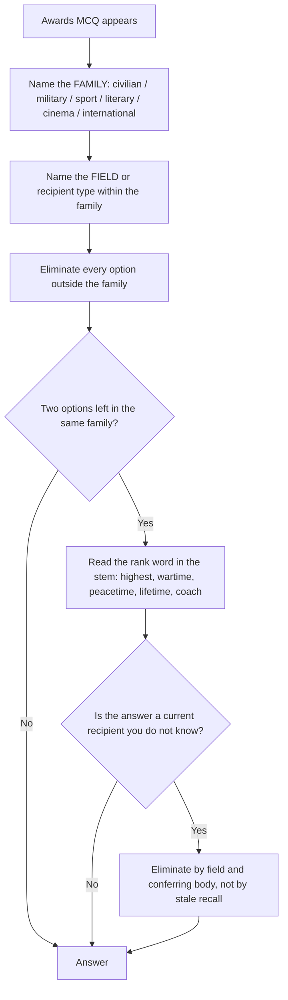

# Awards & Honours

Awards questions look like the easiest possible questions: recall a name, match it to a description. They are among the most lost marks in general knowledge for a specific and avoidable reason — **students learn award *names* but not the *system* the names belong to.** A system is a small number of ordered families, each with a field, a body and a rank. Once you have the families, most options eliminate themselves, including options naming awards you have never heard of.

The second reason this topic is lost is **shelf life**. The recipient of any award announced this year is a fact that expires next year. A study method built on last year's list is not just out of date, it is actively misleading, because the names feel familiar and get selected with confidence. The durable content here is the framework: who awards what, in which field, at which rank, and under what eligibility rule. The framework does not expire; only the names do.

**Family → field → rank.** Identify which family the question is about, use the field to eliminate options, and use the rank to order what is left. A candidate who knows only that a question is about awards already has enough to remove half the options.

### 🟢 Lite — Quick Review (1h–1d)

**Frame 1 — the six families, in one view**

| Family | Awards | Top of the family |
| --- | --- | --- |
| **Civilian** | Bharat Ratna, Padma Vibhushan, Padma Bhushan, Padma Shri | Bharat Ratna |
| **Military gallantry** | Param Vir Chakra, Maha Vir Chakra, Ashoka Chakra, Kirti Chakra, Vir Chakra | Param Vir Chakra (wartime) |
| **Sporting** | Major Dhyan Chand Khel Ratna, Dronacharya Award, Arjuna Award | Major Dhyan Chand Khel Ratna |
| **Literary** | Jnanpith Award, Sahitya Akademi Award, Saraswati Samman, Vyas Samman | Jnanpith Award |
| **Cinematic** | Dadasaheb Phalke Award; National Film Awards — Swarna Kamal, Rajat Kamal | Dadasaheb Phalke Award |
| **Performing arts** | Sangeet Natak Akademi Awards and Fellowship | Sangeet Natak Akademi Fellowship |

**Frame 2 — the civilian hierarchy, precisely**

Four awards, and the order is the whole content:

**Padma Shri → Padma Bhushan → Padma Vibhushan → Bharat Ratna.**

The Padma Awards, instituted in 1954, exist in three classes — Padma Shri, Padma Bhushan and Padma Vibhushan — and the **Bharat Ratna ranks above Padma Vibhushan**; it is not a fourth Padma class. The mnemonic that fixes the order: *Shri, Bhushan, Vibhushan* — the suffix **-shan** is constant and the prefix grows, Shri → Bhushan → Vibhushan.

Two structural facts are worth more than any individual awardee name:

- **The Padma Awards are for distinguished and exceptional service or performance in any field** — the fields are not restricted, which is why a plant breeder, a folk musician and a doctor can all receive one. Questions that assume a Padma awardee must be a "national figure in a narrow field" are misreading the award.
- **Eligibility excludes office-holders.** Under the Padma Award rules, a Padma award is not conferred on a person holding an office of profit or in the service of the Government. A question testing eligibility is decided by that rule.

The awardees are announced by the Government each year and published in a **Gazette notification**; the announcement is traditionally associated with Republic Day. The durable habit: treat the official notification as the source, and never a headline as a substitute for it.

**Frame 3 — the military gallantry classes and the one distinction that matters**

All five are for gallantry in action. The decisive split is **wartime versus peacetime**:

- **Param Vir Chakra** — the highest wartime gallantry award.
- **Ashoka Chakra** — the highest peacetime gallantry award.
- **Maha Vir Chakra**, **Kirti Chakra** and **Vir Chakra** — the other peacetime classes.

So a question asking "the highest gallantry award in India" is genuinely ambiguous between Param Vir Chakra (wartime, the highest overall) and Ashoka Chakra (the highest peacetime), and the stem's wording decides which is wanted. Candidates lose marks by reading only the first two words of the stem. The full rough order is: Param Vir Chakra, then Maha Vir Chakra and Ashoka Chakra at the same level, then Kirti Chakra, then Vir Chakra.

**Frame 4 — the sporting family, separated by recipient type**

- **Major Dhyan Chand Khel Ratna** — the highest honour in sport, for a lifetime of outstanding contribution. Note that it was **renamed** from the Rajiv Gandhi Khel Ratna, and questions that use the older name are testing whether you know the present designation.
- **Dronacharya Award** — for **coaches**.
- **Arjuna Award** — for **sportspersons**.

The family is identified by *who it is for*, not by rank in a list, and options deliberately swap the coach and the athlete.

**Frame 5 — the literary family, and who actually gives it**

- **Jnanpith Award** — the foremost literary honour; instituted in 1961.
- **Sahitya Akademi Award** — given by the Sahitya Akademi, India's National Academy of Letters, in many Indian languages.
- **Saraswati Samman** — instituted by the K. K. Birla Foundation, **not** a Government award. Questions that ask which body confers it are testing exactly this.
- **Vyas Samman** — also associated with the K. K. Birla Foundation, for Hindi literature.

The distinguishing feature to learn is the *conferring body*, because a stem that says "awarded by the Sahitya Akademi" narrows the answer to a specific subset, and a stem that says "the Saraswati Samman" is asking about a foundation.

**Frame 6 — the cinematic family**

- **Dadasaheb Phalke Award** — India's highest honour in cinema, the institutional equivalent of a lifetime achievement award in film.
- **National Film Awards**: **Swarna Kamal** is the Golden Lotus, the top honour for a feature film, and **Rajat Kamal** is the Silver Lotus, the next class down.

The naming is a morpheme puzzle worth learning as a pattern: *Kamal* means lotus, and *Swarna* is gold while *Rajat* is silver, so the award names encode their own rank. Award names that encode rank are a reliable memory hook, and students who notice the pattern retain the hierarchy without effort.

**Frame 7 — the named-after method**

Several awards are named after a person, and the person identifies both the field and the country of origin.

- **Param Vir Chakra** — *chakra* refers to a wheel, associated with the highest wartime gallantry.
- **Major Dhyan Chand Khel Ratna** — named after Dhyan Chand, the hockey player, so it is a *sporting* award.
- **Dronacharya** — from *drona* (guru in the Mahabharata tradition) and *acharya* (teacher), so it is an award for **coaching**. The name itself states the recipient type, which is why it is the coach's award and not the player's.
- **Dadasaheb Phalke** — named after the pioneer of Indian cinema, so it is a film award.
- **Bharat Ratna** — *ratna* means jewel.

The general rule: **decode the Sanskrit or Persian-derived morphemes in the award name, and the field and often the rank fall out.** *Ratan* and *ratna* both mean jewel, so both awards denote high honour, and the words that modify them (Swarna = gold, Rajat = silver, Padma = lotus) tell you the class.

**Frame 8 — the international frame**

- The **Nobel Prize** is awarded in Stockholm for Physics, Chemistry, Physiology or Medicine, and Literature, and in **Oslo for Peace**. The exception is not an accident and is a standard item.
- The economics prize is formally the **Sveriges Riksbank Prize in Economic Sciences in Memory of Alfred Nobel**, administered by the Nobel Foundation — which is why it is described as a Nobel prize but is not one of the original five.
- In Indian comparison questions, the **Bharat Ratna** is treated as the highest civilian award at home, and questions pairing "India's equivalent of the Nobel" generally point there.

### 🟡 Standard — Regular Study (2d–2mo)

**The three-axis method, and why one axis is usually enough**

Every awards question can be resolved by asking three questions in this order. Most of the time the second one ends it.

- **Axis 1 — which family?** Civilian, military, sporting, literary, cinematic, performing arts, or international. This alone frequently removes half the options, because option lists mix families freely.
- **Axis 2 — which field within the family?** Art, literature, science, public service, sport, coaching, cinema. This removes most of the rest.
- **Axis 3 — which rank within the field?** Only needed when two surviving options are in the same family and field, which is rare.

Students habitually start at axis 3, memorising a complete ranking, and then apply it to a question that axis 1 would have answered. The fix is to always name the family before the rank.

*Worked example 1.* Stem: "Which award is conferred on a coach in Indian sport?" Options: Arjuna Award, Dronacharya Award, Khel Ratna, Padma Shri. Axis 1 kills Padma Shri (civilian family, not sport-specific). Axis 2 kills the Arjuna (sportspersons) and the Khel Ratna (lifetime contribution across a career, not a specific category of person). The **Dronacharya** survives on the recipient-type fact, and the name itself confirms it, since *acharya* means teacher.

*Worked example 2.* Stem: "Which is India's highest peacetime gallantry award?" Options: Param Vir Chakra, Ashoka Chakra, Kirti Chakra, Vir Chakra. Axis 1 makes this a purely military question. Axis 3 is where the work is, and the answer turns on the single word **peacetime**. The Param Vir Chakra is the highest award but is a *wartime* award, so it fails the stem's condition; the Ashoka Chakra is the top peacetime class. Reading only "highest" is how the Param Vir Chakra gets chosen, and the stem's second word is what prevents it.

*Worked example 3.* Stem: "Which award is given by the Sahitya Akademi?" Options: Jnanpith Award, Sahitya Akademi Award, Saraswati Samman, Vyas Samman. Axis 1 reduces to the literary family, so all four survive. Axis 2 cannot separate them, because all four are literary. The stem supplies the body directly, and the Sahitya Akademi Award is the one that body confers — the Jnanpith is a distinct award, and the Saraswati Samman and Vyas Samman are associated with the K. K. Birla Foundation. This is the case where the stem's *conferring body* is the whole question, and the correct method is to memorise body-to-award pairs rather than rankings.

**The "highest" trap, and the six answers it can have**

"Highest" without a qualifier is the most dangerous phrase in this topic, because India has several different highest honours. Learn the list of what "highest" can mean, and then read the stem for which one it means.

- Highest **civilian** award → Bharat Ratna.
- Highest **gallantry** award overall → Param Vir Chakra.
- Highest **peacetime gallantry** award → Ashoka Chakra.
- Highest **sporting** honour → Major Dhyan Chand Khel Ratna.
- Highest **cinema** honour → Dadasaheb Phalke Award.
- Highest **literary** honour → Jnanpith Award.

Any stem that says "highest" without saying "in which field" should make you check the option list for a field qualifier. If every option carries one — "highest civilian", "highest sporting" — the qualifier is in the options and you read it there.

**Learning the Padma framework as a framework**

The Padma Awards are worth extra attention because they are the most commonly asked and the most commonly muddled. The structure has exactly four moving parts, and every Padma question is a variation on them:

- **The three classes:** Shri, Bhushan, Vibhushan, in ascending order of distinction.
- **The ceiling above them:** the Bharat Ratna, which outranks Padma Vibhushan but is not a Padma class.
- **The scope:** distinguished and exceptional service or performance in *any* field, not restricted to arts or public life.
- **The eligibility bar:** no office of profit, no service of the Government, subject to the exceptions written into the rules.

Four facts, and the whole family is answered. Note what is *not* in the structure: there is no "Padma Shri for science" variant and no separate Padma class for any field. A question that invents one is wrong, and the reason is the scope rule.

**The two rules that separate fact from folklore in this topic**

*Rule one: every award has a conferring body, and the body is a stable fact while the recipients are not.* The Padma Awards come from the Government; the Saraswati Samman comes from a foundation; the Sahitya Akademi Award comes from the academy; the Dronacharya and Arjuna awards are Government bodies; the Dadasaheb Phalke Award is conferred by the national film industry body. Learn body-to-award pairs and you have a question type that never expires.

*Rule two: award *names* often encode their own meaning, and decoding the name is faster than recalling the definition.* Gold, silver, lotus, jewel, teacher, wheel — the morphemes carry the class, and a student who has noticed that pattern can reconstruct most of a hierarchy from two or three words.

**Cross-field comparison questions**

Some items ask you to match an Indian award to its nearest international counterpart, or to order two awards from different fields. Handle them the same way: identify each award's field, then use the "highest in that field" list from the previous section. The Indian comparison targets are usually the Bharat Ratna at the level of a lifetime national honour, and the Dadasaheb Phalke Award in the international habit of a lifetime achievement prize in film.

A second type of comparison asks which award comes from which country — the Nobel from Sweden with the Peace exception to Norway, the Dronacharya and the rest from India, the Bharat Ratna from India. Those are pure one-to-one pairings, and the whole set is small enough to be finished rather than started.

**What is genuinely worth memorising, and what is not**

In this topic the memorisation budget should be spent on **structure**, because structure covers more marks per minute. In order of value:

1. The four civilian awards in order, and the Bharat Ratna's position relative to the Padmas.
2. The wartime/peacetime split among the gallantry awards.
3. The recipient type of each sporting award.
4. The conferring body of the literary awards.
5. The lotus and gold/silver naming of the film awards.
6. The Nobel Peace exception.

What is not worth memorising: the list of last year's recipients, the total number conferred in any year, and the profession of any specific awardee from a headline. These have a one-year shelf life, they appear in a small number of questions, and confident recall of a stale list is worse than not knowing, because it defeats your own elimination.

### 🔴 Extended — Deep Study (3mo+)

**The verification discipline — the part that makes this topic reliable**

The honest way to study an annual fact is different from the honest way to study a structural fact, and conflating them is the main defect in this topic.

- **Structural facts get memorised.** The order of the Padma classes, the wartime/peacetime split, the recipient types. They are true now and next year.
- **Annual facts get sourced and dated.** The current year's awardees, the current edition of any prize. The source is the awarding body's own notification; for the Padma Awards that is the Government notification, published in the Gazette. A news report is a pointer to the notification, not a substitute for it.

Practically, this means keeping a single dated list of "things to re-verify", checked once a month, instead of a growing archive of recipient names. It also means that in the exam hall, when a question names a current recipient you do not know, the correct move is the field-based elimination described earlier, not a hopeful guess. A bounded elimination gets most of the available mark; a confident guess from a stale list gets nothing and costs time.

**A three-pass study plan for a topic of this weight**

This is a small, fully closable topic, which is unusual and worth exploiting.

- **Pass one — the family map.** Write the six families and place every award you can name into one of them. Anything that will not fit is either misremembered or from outside the syllabus.
- **Pass two — the ordering.** For each family, write the awards in order and attach one distinguishing word to each: field, recipient type, or wartime/peacetime. One word per award is enough; a full sentence is wasted effort.
- **Pass three — the method drill.** Take ten questions you have not seen, name the family and the field for each *before* reading the options, and mark your answer. The gap between the family you named and the family the answer belonged to is your real error list.

Two or three hours across a few sittings completes the topic. After pass three, the only thing worth doing is keeping the error list current, and the correct response to a new award name you meet is to place it in a family — not to start a new list.

**Questions that are not really awards questions**

Some items in this area are disguised classification questions, and recognising the disguise is worth marks.

- **"Which is the highest civilian award?"** is a hierarchy question — answer from the ordered list.
- **"Who may receive the Padma Award?"** is an eligibility question — answer from the rules, not from a list of past recipients.
- **"Which award is named after a film pioneer?"** is a naming question — decode the name.
- **"The award given for a lifetime of contribution to sport is called ___"** is a description question — the stem is a definition and the answer is the name, exactly as in a vocabulary item. Do not overthink these; they are recall questions wearing a formal costume.
- **"Which award does this country confer?"** is a geography question — a one-to-one pairing, not a hierarchy.

Naming which kind of question you are looking at takes five seconds and stops you applying a ranking method to a naming question, which is the most common mismatch in this topic.

**The award-name morpheme table, as a study device**

A compact decoder for names you meet and have not studied, which is the only genuinely forward-looking skill this topic offers:

| Morpheme | Meaning | Awards using it |
| --- | --- | --- |
| Padma | lotus | The three Padma classes |
| Ratna / Ratan | jewel | Bharat Ratna, Khel Ratna |
| Swarna | gold | Swarna Kamal |
| Rajat | silver | Rajat Kamal |
| Kamal | lotus | National Film Awards |
| Chakra | wheel | The gallantry awards |
| Acharya | teacher | Dronacharya |
| Vibhushan | distinguished | Padma Vibhushan |
| Bhushan | ornament of India | Padma Bhushan |
| Shri | lord / auspicious | Padma Shri |

From this table, an unfamiliar award name becomes classifiable immediately: anything with *swarna* outranks anything with *rajat*, anything with *ratna* signals very high honour, and *acharya* signals a teaching role. The table is short, and it is the part of this topic that keeps paying after the recipient lists have expired.

**The honest limits of this topic, stated plainly**

Some items genuinely require a specific current fact, and no method will recover them if you have not studied that year. The correct behaviour under those conditions is to eliminate by field, pick the most institutionally plausible survivor, and accept that the item is a genuine coin-flip. Over-investing in this topic chasing the last item is a poor trade, because the structural content is where the available marks are and it is small enough to secure completely.

The broader lesson transfers beyond this topic: **a study method is only honest if it matches the shelf life of the fact.** Facts that expire annually should be sourced and dated; facts that persist should be memorised. Students lose marks in general knowledge by applying the wrong method to the wrong kind of fact, and that error costs more than any missing name ever will.

### 🧠 Memory Anchors

- **"Shri, Bhushan, Vibhushan, then Ratna."** The suffix -shan is constant and the prefix grows; Bharat Ratna sits above all three, not inside them.
- **"Wartime versus peacetime is the only gallantry question that matters."** Param Vir Chakra is wartime, Ashoka Chakra is the top peacetime class.
- **"Arjuna is the athlete, Dronacharya is the coach."** Identified by recipient type, never by rank in a list.
- **"The body's name is in the award's name."** *Dronacharya* means teacher, so it is the coach's award; *Swarna* is gold and *Rajat* is silver, so the film awards rank themselves.
- **"Highest without a field is not a question."** There are six different highest honours in India, so read the qualifier in the options as well as the stem.
- **"Peace is in Oslo, everything else is in Stockholm."** The Nobel exception is one line and it is always asked.
- **"A dated list is not knowledge."** Annual recipients have a one-year shelf life; structure does not.
- **Flashcard Q&A:**
  - *Order the four civilian awards from lowest.* → Padma Shri, Padma Bhushan, Padma Vibhushan, Bharat Ratna.
  - *Is the Bharat Ratna a Padma class?* → No; it is a separate honour that ranks above Padma Vibhushan.
  - *Which is the highest peacetime gallantry award?* → The Ashoka Chakra.
  - *What does -acharya mean, and what does it tell you?* → Teacher, so the Dronacharya Award is for coaches.
  - *What is the Sahitya Akademi?* → India's National Academy of Letters, which confers the Sahitya Akademi Award.
  - *Which body confers the Saraswati Samman?* → The K. K. Birla Foundation, not the Government.
  - *What does -ratna mean?* → Jewel, marking both the Bharat Ratna and the Khel Ratna as high honour.
  - *Where is the Nobel Peace Prize awarded?* → Oslo, while the other Nobel Prizes are awarded in Stockholm.
  - *Can a person holding an office of profit receive a Padma Award?* → No, under the Padma Award rules.
  - *Is the Major Dhyan Chand Khel Ratna the current name?* → Yes; it was renamed from the Rajiv Gandhi Khel Ratna.

### 🎯 Exam Traps & Error Log

1. **Treating the Bharat Ratna as a fourth Padma class.** It is a separate honour that ranks above Padma Vibhushan, and a question that lists the three Padma classes plus the Bharat Ratna is testing the distinction.
2. **Reversing the Padma order.** Shri, Bhushan, Vibhushan. The prefix grows with the distinction, and under time pressure the order inverts often.
3. **Answering "Param Vir Chakra" to a peacetime question.** It is the highest award but a wartime one, and the stem's second word is the whole test.
4. **Swapping the Arjuna and Dronacharya Awards.** One is for the sportsperson, one for the coach, and options reverse them deliberately.
5. **Reading only "highest" and missing the field qualifier.** The qualifier is often in the option list, not the stem.
6. **Attributing the Saraswati Samman to the Government.** It comes from a foundation, and a "which body" question is built on exactly that.
7. **Confusing the film award names.** Swarna Kamal is gold and top; Rajat Kamal is silver and next, and the morphemes state the order.
8. **Saying the Nobel Peace Prize is awarded in Stockholm.** It is awarded in Oslo; the rest are in Stockholm.
9. **Using the wrong name for the Khel Ratna.** The current designation is the Major Dhyan Chand Khel Ratna, and the older Rajiv Gandhi Khel Ratna is the older name.
10. **Selecting a remembered recipient for a current-year question.** A stale name feels familiar and is chosen with confidence; eliminate by field and conferring body instead, and accept an honest coin-flip.

### 🧪 Self-Test — 8 Questions with Worked Answers

Answer all eight on paper first, and name the family before you read option A.

1. **"Arrange in ascending order of distinction: Padma Bhushan, Padma Shri, Bharat Ratna, Padma Vibhushan."**
   *Worked answer:* **Padma Shri, Padma Bhushan, Padma Vibhushan, Bharat Ratna.** Method — the family is the civilian one, and this is a pure rank question, so axis 3 is the whole job. The three Padma classes share the suffix *-shan* and are ordered by the prefix: Shri, then Bhushan, then Vibhushan. The Bharat Ratna is not a Padma class; it is a separate honour that ranks above Padma Vibhushan. The trap is treating all four as one ladder of Padmas, which is the misconception the question is built on.

2. **"Which is the highest peacetime gallantry award in India?"**
   *Worked answer:* **The Ashoka Chakra.** Method — the family is military gallantry, and the decisive word in the stem is *peacetime*. The Param Vir Chakra is India's highest gallantry award overall, but it is a **wartime** award, so it fails the condition in the stem. Of the peacetime classes — Ashoka Chakra, Maha Vir Chakra, Kirti Chakra and Vir Chakra — the Ashoka Chakra is the top one. The whole item is decided by reading the stem to its last word, which is the trap: candidates who read only "highest" select Param Vir Chakra.

3. **"The Dronacharya Award is conferred for outstanding contribution in which area?"**
   *Worked answer:* **Coaching.** Method — the family is sporting, and the distinguishing axis here is recipient type. The Arjuna Award is for sportspersons, the Dronacharya for coaches, and the Khel Ratna for lifetime contribution across a career. The name confirms it independently: *drona* and *acharya* both carry the sense of teacher, so the award states its own recipient in its own name. Learn the family by recipient type and this whole question type is answered from the structure.

4. **"Which award is conferred by the Sahitya Akademi?"**
   *Worked answer:* **The Sahitya Akademi Award.** Method — here the *conferring body* is the whole question, so the useful stored fact is the body-to-award pair, not a ranking. The Sahitya Akademi is India's National Academy of Letters and confers its own Award, in addition to the Bhasha Samman for translation. The Jnanpith Award is a separate honour, and the Saraswati Samman and Vyas Samman are associated with the K. K. Birla Foundation rather than the Academy. A ranking approach cannot answer this; only a body-to-award pair can.

5. **"Which of the following is awarded by a Government body: (a) Saraswati Samman (b) Jnanpith Award (c) Padma Shri (d) Dadasaheb Phalke Award?"**
   *Worked answer:* **This item needs care, and the honest method is to eliminate on what you are sure of.** The Padma Shri is conferred by the Government of India under the Padma Award rules, which is certain. The Saraswati Samman is associated with the K. K. Birla Foundation, not the Government, so it is eliminated on a stored fact. The Dadasaheb Phalke Award is conferred by the national film industry body, which is also not the Government. That leaves the Jnanpith Award as the option whose conferring arrangement is a separate institution rather than a ministry, and the Padma Shri as the Government award. The value of this question is the method: two options were eliminated on one stored fact each, without any recall of a year or a recipient.

6. **"In the National Film Awards, which class ranks immediately below the Swarna Kamal?"**
   *Worked answer:* **The Rajat Kamal.** Method — decode the names rather than recall the hierarchy. *Swarna* is gold and *Rajat* is silver, and both contain *Kamal*, the lotus. Gold outranks silver, so the two names encode their own order, and the next class down from the Golden Lotus is the Silver Lotus. A companion question asking which is the highest honour in Indian cinema overall has a different answer — the **Dadasaheb Phalke Award** — and the distinction between a National Film Award and the industry's lifetime honour is worth keeping straight.

7. **"Where is the Nobel Peace Prize awarded, and where are the other Nobel Prizes awarded?"**
   *Worked answer:* **Oslo for Peace, Stockholm for the rest.** Method — this is a pure one-to-one pairing within the international family. Nobel Prizes in Physics, Chemistry, Physiology or Medicine, Literature and the economic sciences are awarded in Sweden, in Stockholm, while the Peace Prize is awarded in Norway, in Oslo. The exception is stable, well known, and a common item precisely because it is a genuine exception rather than a rule. The economics prize is the Sveriges Riksbank Prize in Economic Sciences in Memory of Alfred Nobel, administered by the Nobel Foundation, which is why it is grouped with the Nobels though it was not one of the original five.

8. **"A question asks for this year's recipient of an annual award and you have no reliable memory of it. What is the best strategy?"**
   *Worked answer:* **Eliminate by family, field and conferring body, then choose the most institutionally plausible survivor and accept it as a coin-flip.** Method — annual recipients have a one-year shelf life, so recall from an undated snapshot produces a confident wrong answer, which is worse than an honest bounded choice. The structure does not expire: name the family, narrow by field, and narrow again by which body actually confers it. If one option survives all three filters, it is almost certainly the answer even though you did not recall the name. If two survive, the stem's wording usually separates them — read it a second time. Then record the item in a dated list for re-verification, because the correct study behaviour for an annual fact is to source it, not to memorise it.

### 💡 Pro Tips

1. **Name the family first, then the field, then the rank.** Most students start at rank and over-apply it to questions that axis one would have answered.
2. **Learn award-to-body pairs, not just award orders.** Body pairs answer a question type that never expires, because conferring bodies do not change year to year.
3. **Memorise recipients by recipient type** — athlete, coach, lifetime contribution — rather than as a list of names.
4. **Decode award names for their morphemes.** Gold, silver, jewel, lotus, teacher; the name usually states the class.
5. **Read the stem to its last word before choosing.** "Peacetime" and "wartime" are doing all the work in the gallantry questions.
6. **Treat annual recipients as sources to check, not facts to store,** and keep one dated list instead of an archive.
7. **Build a one-word anchor per award.** Field, recipient type or wartime/peacetime. One word per award is enough; a full sentence is wasted effort.
8. **Match the method to the fact's shelf life.** Structure gets memorised, annual lists get sourced — and applying either method to the wrong kind of fact is where the marks in this topic actually go.

---

## Continue your study

- **[View this topic in your CUET UG roadmap](/roadmap/?exam=cuet&duration=1mo)** — see where "Awards & Honours" fits in your personalised plan
- **[Build a quick revision plan](/roadmap/?exam=cuet&duration=1d)** — 1-day sprint covering highest-weight topics
- **[CUET UG exam overview](/exams/cuet/)** — pattern, eligibility, and syllabus
- **[All General Test notes](/notes/cuet/general-test/)** — browse sibling topics in this subject

*Content adapted based on your selected roadmap duration. Switch tiers using the selector above.*
