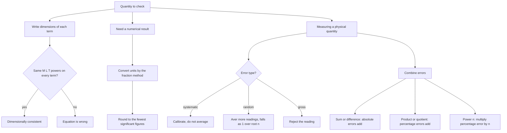

# Units & Measurement

Every numerical in CUET UG Physics is really a statement about how many base quantities combine. If you cannot reduce a result to metre-kilogram-second, you cannot check it, and if you cannot check it you cannot trust it. This chapter is small in content but it is the vocabulary for the whole paper — and it is the cheapest place to pick up marks because the questions are short, the formulas are few, and the mistakes are predictable.

### 🟢 Lite — Quick Review (1h–1d)

**A physical quantity = numerical value × unit.** Length is 5 m, not "5". Changing the unit changes the number and leaves the quantity unchanged.

**The seven SI base quantities, with units and symbols:**

| Quantity | Unit | Symbol | Defined by (2019 SI) |
|---|---|---|---|
| Length | metre | m | distance light travels in 1/299792458 s |
| Mass | kilogram | kg | fixed h = 6.62607015 × 10⁻³⁴ J s, used with m and molar mass |
| Time | second | s | 9192631770 cycles of the caesium-133 hyperfine transition |
| Electric current | ampere | A | charge of 1.602176634 × 10⁻¹⁹ C per second |
| Temperature | kelvin | K | 1.380649 × 10⁻²³ J per kelvin |
| Amount of substance | mole | mol | 6.02214076 × 10²³ entities |
| Luminous intensity | candela | cd | 1/683 watt per steradian at 540 THz |

Two supplementary units: **radian** (plane angle, dimensionless) and **steradian** (solid angle, dimensionless). The becquerel and gray are derived units with special names for radioactivity and absorbed dose, and the radian and steradian are dimensionless but still not SI base units.

**Dimensional formula.** Every derived quantity is written [Q] = Mᵃ Lᵇ Tᶜ. Memorise these eight; they cover most questions:

| Quantity | Formula | Dimensions |
|---|---|---|
| Force | F = ma | M L T⁻² |
| Work, energy | W = Fs | M L² T⁻² |
| Power | P = W/t | M L² T⁻³ |
| Pressure | P = F/A | M L⁻¹ T⁻² |
| Impulse, momentum | p = mv | M L T⁻¹ |
| Frequency | f = 1/T | T⁻¹ |
| Density | ρ = m/V | M L⁻³ |
| Velocity | v = s/t | L T⁻¹ |
| Acceleration | a = v/t | L T⁻² |

**The homogeneity principle.** Every term in a physical equation must have the same dimensions. Test: in v = u + at², [u] = L T⁻¹ but [at²] = (L T⁻²)(T²) = L, a bare length, so the equation is dimensionally invalid and therefore wrong. Contrast the correct constant-acceleration form s = ut + ½at², where [ut] = L and [at²] = L and the sum is legitimate. This one check kills a large fraction of the concept questions in this chapter.

**Error formulas, compact:**

- Absolute error in one reading: Δaᵢ = |a_mean − aᵢ|
- Mean absolute error: Δa_mean = (Σ Δaᵢ) / n
- Relative error: ε = Δa_mean / a_mean (dimensionless)
- Percentage error: %ε = ε × 100
- Errors in sums and differences **add**; errors in products and quotients **add as percentages**; a power n multiplies the percentage error by n.

**Significant figures, four rules:** count every non-zero digit; count zeros *between* non-zero digits; ignore leading zeros; count trailing zeros only if a decimal point is present. So 0.0520 kg has 3 s.f., 5.20 × 10² has 3 s.f., and bare 520 is ambiguous.

### 🟡 Standard — Regular Study (2d–2mo)

**SI conventions you will lose marks on.** Symbols are lowercase Roman and never change with plural or number: 5 kg, not 5 kgs. Seven units carry a capital because they are named after a scientist: A (ampere, André-Marie Ampère), K (kelvin, Lord Kelvin), mol is lowercase since 2019 despite the mole being an amount, cd (candela), N, Pa, J, W, V, C, Ω, S, F, T, H, Hz. Degree Celsius is written °C and is not an SI base unit. Numerical prefixes attach without a hyphen: kilometre km, centimetre cm, millisecond ms. The prefix changes the power of ten, not the capitalisation: 1 Mm is 10⁶ m, not a megametre written mM. A gram is 10⁻³ kg; writing "g" for kilogram is the single most common unit error in Indian answer sheets.

**Dimensions versus formulas — what the method can and cannot do.** Assume a quantity Q depends on variables a, b, c: Q = k·aᵛ·bʷ·cˣ with k dimensionless. Write the dimensions of both sides, equate the exponents of M, L and T, and solve. The method is powerful but has two hard limits, and both limits are favourite question stems:

1. **It cannot find dimensionless constants.** 2, π, ½ and e never appear. The velocity of a falling raindrop is k√(ρgh) dimensionally, but the √(⅓) that connects it to a free fall is invisible to the method.
2. **It cannot distinguish between physically different formulas with the same dimensions.** v = k√(Fg/ρ) and v = k√(Fρg) have identical dimensions. Both are "correct" dimensionally; only physics picks one.

A third practical limit: the formula must be expressible as a product of powers. Expressions with sums inside, like v = u + at, cannot be derived dimensionally, only tested.

**Dimensional homogeneity — worked checks.** Write each term's dimensions and look for a mismatch.

| Claimed relation | [Term 1] | [Term 2] | Verdict |
|---|---|---|---|
| F = ma | M L T⁻² | M L T⁻² | valid |
| v = u + at | L T⁻¹ | L T⁻¹ | valid |
| s = ut + ½at² | L | L | valid — both sides are lengths |
| v = u + at² | L T⁻¹ | L | **invalid** — a speed plus a length |
| p = m v² / L | M L T⁻¹ | M L T⁻¹ | valid — angular momentum |
| P = m(v² − u²)/2t | M L² T⁻² | M L² T⁻³ | **invalid** |

**Order of magnitude — the fastest numerical check.** Write the number in standard form and read off the power of ten. 7.6 × 10¹¹ and 6.8 × 10¹⁰ are both order 10¹¹. The size of a metre can be estimated in about four seconds: light crosses 1 km in 3.3 µs, and an atomic nucleus is roughly 10⁻⁵ of an atom's radius, about 10⁻¹⁵ m. Use this to reject a physics answer that is off by ten or twenty orders of magnitude before you spend time on the algebra.

**Measurement, precision, accuracy and the errors in between.** Accuracy is closeness to the true value; precision is how tightly repeated readings cluster. A cluster can be tight and still miss the target. Systematic errors shift every reading the same way — a zero error, a miscalibrated scale, parallax from reading at an angle, a constant temperature drift. They are corrected by calibration, not by averaging. Random errors scatter about the mean in both directions and shrink as 1/√n; that is the entire justification for taking multiple readings. Gross errors are blunders — writing 12 cm for 21 cm, reading the meniscus from above — and are removed from the data set rather than averaged in.

**Propagating errors.** If y = a + b, then Δy = Δa + Δb, because the worst case adds. If y = ab or y = a/b, then %Δy = %Δa + %Δb, because the relative factors multiply. If y = aⁿ, then %Δy = n·%Δa. Mixed problems are done part by part: compute the percentage uncertainty of the compound quantity first, then combine.

**Significant figures in arithmetic.** The result carries the fewest significant figures among the terms. 2.51 × 1.3 = 3.263, but 1.3 has 2 s.f., so the answer is 3.3. In addition the rule is the least decimal place, not the fewest figures: 12.5 + 3.27 = 15.77, reported to one decimal as 15.8. Excess digits in a measured value are not precision — they are decoration, and carrying them through a calculation only spreads the error.

**A clean far-distance measurement with parallax.** Put a rod of known small length L at a distant but unknown point D. Move the eye sideways through a measured baseline b. The near end appears to shift by Δx relative to the far end, so the angle subtended is θ ≈ Δx/L, and geometry also gives θ ≈ b/D. Therefore **D = bL/Δx**. Take b = 0.20 m, L = 1.00 m, Δx = 0.50 mm: D = 0.20 × 1.00 / (5.0 × 10⁻⁴) = 400 m. Small-angle approximation is valid because b/D and Δx/L are both tiny, which is exactly why the method suits far distances and why the numerator is a measured length rather than an angle.

### 🔴 Extended — Deep Study (3mo+)

**Why the 2019 redefinition matters to a physics student.** Before May 2019 the kilogram was defined as the mass of a platinum-iridium cylinder kept in Paris, and the metre as the distance between two marks on a platinum rod. Under the current definition the kilogram is fixed by the exact value of Planck's constant and the metre by the exact value of the speed of light, 299792458 m s⁻¹. Consequences you can state confidently: the kilogram is now defined through a fixed value of h, the second is still defined from a caesium transition, the kelvin is defined from the Boltzmann constant rather than from the triple point of water, and the mole from a fixed Avogadro number. The practical effect is that instruments in different laboratories can now realise these units without reference artefacts, and SI base units are realised rather than declared.

**Dimensionless quantities and the traps built around them.**

- The radian and steradian are dimensionless but are not dimensionless constants — they are named units.
- π, 2, ½, e, refractive index, relative density and efficiency are all dimensionless. A question asking for the dimension of refractive index expects "no dimensions", i.e. M⁰L⁰T⁰.
- Angles in radians are dimensionless too, so angular speed ω (T⁻¹) and linear speed v (LT⁻¹) are different quantities, not different forms of one.
- A quantity that is dimensionless can still change: strain, Poisson's ratio and refractive index are all numbers that vary from material to material.

**Conversion technique, two routes.** 1 km h⁻¹ to m s⁻¹: either multiply the number by the factors one at a time, 1 km = 1000 m and 1 h = 3600 s so 1 km h⁻¹ = 1000/3600 m s⁻¹, or note that the units cancel only if written as a fraction, (1000 m/1 km) × (1 h/3600 s). The fraction method is faster and is the one to use when a conversion has a squared or cubed power, such as turning g cm⁻³ into kg m⁻³: 1 g cm⁻³ = (10⁻³ kg/10⁻² m)³ = 1000 kg m⁻³.

**Practical density and a common inconsistency.** Aluminium has a density of about 2700 kg m⁻³ = 2.7 g cm⁻³. Steel is about 7800 kg m⁻³ = 7.8 g cm⁻³. A figure quoted as "7.8 g/cm³" for a material that is then used in a kg m⁻³ calculation is the classic source of a factor of 1000 in density problems; check the units before anything else.

**Dimensional derivation worked properly.** Find the dimensions of the quantity Y = (F · p) / (d³ · r⁴), where p is pressure, d is density and r is length.

1. [F] = M L T⁻², [p] = M L⁻¹ T⁻², [d] = M L⁻³, [r]⁴ = L⁴.
2. Numerator: (M L T⁻²)(M L⁻¹ T⁻²) = M² T⁻⁴.
3. Denominator: (M L⁻³) L⁴ = M L.
4. Therefore [Y] = M² T⁻⁴ / (M L) = M T⁻⁴. The mass in the numerator cancels one power from the density, which is the step students most often miss.

**A second derivation with a dimensionless constant left visible.** If the terminal speed v of a sphere falling through a viscous fluid depends on radius r, density ρ and viscosity η, assume v = k rᵃρᵇηᶜ. Then [v] = L T⁻¹, [r]ᵃ = Lᵃ, [ρ]ᵇ = Mᵇ L⁻³ᵇ, [η]ᶜ = Mᶜ L⁻²ᶜ T⁻ᶜ. Equating: M: b + c = 0; T: −c = −1, so c = 1 and b = −1; L: a − 3b − 2c = 1, so a + 3 − 2 = 1, a = 0. So **v = kη/(ρr)**. The dimensions are right; the factor k = 0.5 comes from solving the flow equation, which is exactly the limit the method cannot cross.

**Combining errors across a multi-step formula.** For Y = (a²√b)/c³: %ΔY = 2·%Δa + ½·%Δb + 3·%Δc. Note that the square root halves the percentage contribution of b while the cube of c triples it — powers scale the error linearly, they do not average it.

**Significant figures: when extra digits are honest.** Purely counted or defined quantities are exact and carry unlimited figures: the number 12 in a count, the value of g taken as 9.8 m s⁻² by definition of the standard value, the conversion 1 min = 60 s. The limiting precision comes from measurements, not from arithmetic. If a length is 2.5 ± 0.1 m, the 2.5 already says all there is to say — reporting 2.500 m invents precision the instrument does not have. The significant-figure count is a statement about measurement, and treating it as a formatting rule is the mistake.

**Angles and their units.** One complete revolution is 360° = 2π rad, so 1° = π/180 rad ≈ 0.01745 rad. A common self-check on a measured angle is that a small angle in radians roughly equals sin θ ≈ tan θ ≈ θ. If a problem gives sin 30° = 0.5 and you substitute 30, the units are wrong.

**Moles and the STP gas volume, stated correctly.** At the modern standard temperature and pressure — 273.15 K and 1 bar = 10⁵ Pa — one mole of an ideal gas occupies **24.8 L**. The figure 22.7 L belongs to the older convention of 1 atm = 1.013 × 10⁵ Pa, and mixing the two is a frequent error. This chapter supplies the underlying skill: pressure has units of pascals, so a bar and an atmosphere are different quantities, and the number that goes with the molar volume depends on which one the question used.

**Combining unit conversions in one line.** To get joules from newton-metres, from electron-volts, and from erg: 1 J = 1 N m = 1 kg m² s⁻²; 1 eV = 1.602176634 × 10⁻¹⁹ J exactly; 1 erg = 10⁻⁷ J. Once these three are internal, energy questions in the Modern Physics chapters stop being unit puzzles.

### 🧠 Memory Anchors

- **"Seven base, two supplementary, everything else derived."** The seven are length, mass, time, current, temperature, amount, luminous intensity; radian and steradian are supplementary.
- **"Right of the equals sign is the sentence."** Dimensional analysis only tells you whether a formula is *possible*. Choosing between two dimensionally identical formulas is physics, not algebra.
- **"Sums add errors, products add percentages."** That one line covers the whole propagation chapter.
- **"Trailing zeros need a decimal point."** 5.20 × 10² is three figures; 520 is a question, not a number.
- **"Systematic corrects by calibration, random corrects by counting."** Two mechanisms, one line.
- **Flashcard Q&A:**
  - *Dimensions of pressure?* → M L⁻¹ T⁻². Derive it, do not recite it.
  - *Can dimensional analysis find a dimensionless constant?* → No. That is exactly why it cannot find π or 2.
  - *Why is v = k√(Fg/ρ) not "proved" by dimensions?* → Both √(Fg/ρ) and √(Fρg) have the same dimensions, so the method cannot choose.
  - *Two readings of the same length are 10.0 cm and 10.1 cm. How many significant figures is the mean?* → 10.05 cm shows four, which is false precision; report 10.1 cm, matching the instrument.
  - *Volume in litres at STP: 22.7 or 24.8?* → 24.8 L at 1 bar; 22.7 L belongs to the older 1 atm standard.
  - *What is the dimension of refractive index?* → none; it is M⁰L⁰T⁰.

### 🎯 Exam Traps & Error Log

1. **Writing "grams" for kilograms.** Density in g cm⁻³ used directly in a kg m⁻³ formula is a factor-of-1000 error that survives to the final answer.
2. **Believing a dimensionally consistent equation is correct.** Dimensional analysis rejects wrong equations; it cannot confirm right ones. A dimensionally valid equation with a wrong physical law still gives a wrong answer.
3. **Adding two terms whose dimensions do not match.** In v = u + at², [u] = L T⁻¹ while [at²] = L, so the "sum" is a speed plus a distance. The correct constant-acceleration relations are s = ut + ½at² (both terms are lengths) and v = u + at (both terms are speeds). Write the two dimensions before you write the verdict.
4. **Counting leading zeros.** 0.0042 has 2 significant figures, not 4. Same for 0.00420 — that one is 3.
5. **Treating a trailing zero as significant without a decimal.** 520 to 2 s.f. is 5.2 × 10², which is different from 520 to 3 s.f.
6. **Adding percentage errors of two quantities that are then summed.** In A + B the percentage errors do not simply add; they must be weighted by the fraction each term contributes, so %ε_total = [%ε_A·A + %ε_B·B]/(A + B).
7. **Reporting too many figures in a mean.** The mean of several readings cannot be more precise than the readings themselves.
8. **Assuming averaging removes a systematic error.** Averaging a fixed zero error a hundred times still gives the wrong answer a hundred times.
9. **Writing degrees where radians are required** in small-angle approximations or in circular motion formulas, since ω is in rad s⁻¹.
10. **Changing the unit but not the value.** Saying "the length is 500 cm" after restating a 5 m measurement is right; forgetting the restatement and writing 5 cm is the error the whole chapter exists to prevent.

### 🧪 Self-Test — 8 Questions with Worked Answers

Work these on paper before checking. Each one uses a form the chapter actually uses.

1. **Check dimensionally whether $v = u + \log(at)$ can be a correct velocity relation.**
   [u] = L T⁻¹. The logarithm of a dimensional quantity is meaningless — you cannot take the log of something carrying units, since log is defined only for a pure number. So the equation fails at the first step, before you even compare dimensions. If the argument were written as $\log(at/d)$ with d a length, then [at/d] = (L T⁻²·T²)/L = 1, dimensionless and therefore log-able, and [log 1] is still not L T⁻¹, so v = u + log(...) would still fail unless u is a speed and the log term carries no units, which it does not. Conclusion: the relation is dimensionally invalid.
2. **Find the dimensions of $Y = \dfrac{F p}{d^{3} r^{4}}$, where p is pressure, d is density, r is a length.**
   Numerator: (M L T⁻²)(M L⁻¹ T⁻²) = M² T⁻⁴. Denominator: (M L⁻³)(L⁴) = M L. So [Y] = M T⁻⁴, with the length cancelling. Work the powers of M, L and T separately and you get the same answer: M²/M = M, L¹/L¹ = 1, T⁻⁴.
3. **A body falls from rest. Dimensional analysis gives $t \propto \sqrt{h/g}$. Find the proportionality constant by experiment and state why dimensions could not give it.**
   Time and distance and acceleration: [t] = T, [√(h/g)] = √(L/(L T⁻²)) = T. Dimensions are satisfied, so the form is possible, but the numerical factor is dimensionless and invisible to the method. Measuring free fall of a dense ball in a vacuum gives t = √(2h/g), so the constant is √2, not 1. This is the cleanest example of what the method cannot do.
4. **A 250 mm vernier has 50 divisions. Its least count is?**
   Least count = 1 main scale division / number of vernier divisions. 1 main scale division = 1 mm, so LC = 1/50 mm = 0.02 mm. The 50 is the number of VSD, not the number of divisions marked on the vernier scale — a very common mix-up. If the question instead gives 1 MSD = 0.5 mm, LC = 0.5/50 = 0.01 mm.
5. **Measurements of a mass are 50.16, 50.18, 50.17, 50.19 and 50.15 g. Report the mean, the mean absolute error and the percentage error.**
   Mean = (50.16 + 50.18 + 50.17 + 50.19 + 50.15)/5 = 250.85/5 = 50.17 g. Absolute deviations from the mean: 0.01, 0.01, 0.00, 0.02, 0.02, which sum to 0.06, so Δa_mean = 0.06/5 = 0.012 g. Relative error = 0.012/50.17 = 2.39 × 10⁻⁴, percentage error = 0.0239%. Report the mean to the same decimal place as the error, i.e. 50.17 ± 0.01 g, not 50.170 g.
6. **Two quantities are X = 4.0 ± 0.2 and Y = 2.0 ± 0.4. Find the percentage error in (a) X + Y and (b) XY.**
   (a) Absolute errors add: Δ(X + Y) = 0.2 + 0.4 = 0.6, and X + Y = 6.0, so %error = 0.6/6.0 × 100 = 10%. (b) Percentage errors add for a product: 5% + 20% = 25%. Note how much worse multiplication is than addition for the same inputs — errors compound through products, which is why percentage errors, not absolute errors, are the currency of a propagation question.
7. **Convert 36 km h⁻¹ into cm s⁻¹.**
   Write it as a fraction so the units cancel: 36 km/h × (1000 m/1 km) × (100 cm/1 m) × (1 h/3600 s) = 36 × 1000 × 100 / 3600 cm s⁻¹ = 1000 cm s⁻¹. The usual wrong answer comes from dividing by 3600 twice, or from forgetting that km → cm is a factor of 10⁵, not 10³.
8. **Is the relation $T \propto \sqrt{\ell/g}$ for a simple pendulum dimensionally correct, and what does it leave undetermined?**
   [√(ℓ/g)] = √(L ÷ L T⁻²) = √(T²) = T, which matches [T]. So the proportionality is dimensionally valid. It leaves the numerical factor undetermined: solving the equation of motion gives T = 2π√(ℓ/g), so the constant is 2π. Any question asking for that constant must be solved with Newton 2, not with dimensions.

### 💡 Pro Tips

1. **Write the seven base quantities and their units from memory at the start of every revision session.** It takes thirty seconds and it is the one list in the chapter that is never derived, only recalled.
2. **Do the homogeneity check before anything else in a "which relation is correct" question.** It eliminates three of the four options in the time it takes to write two dimension strings.
3. **Convert to base units, solve, convert back.** Mixing km h⁻¹ with m s²⁻¹ mid-calculation is the most common arithmetic failure in this chapter and the easiest to avoid.
4. **Check the answer by order of magnitude before you submit it.** If a speed came out as 3 × 10⁷ m s⁻¹, you have a factor-of-ten error somewhere and it costs ten seconds to find.
5. **Round once, at the end, and keep the guard digits while working.** 2.51 × 1.3 = 3.3, not 3.3, 3.26, 3.263. Rounding mid-calculation is how a correct method produces a wrong number.
6. **Memorise the error-combination rules as a table, not as prose.** Addition: absolute errors add. Multiplication: percentage errors add. Power n: multiply by n. Ten seconds of recall, and it covers the whole topic.
7. **For any vernier or screw-gauge question, identify MSD and VSD first and write both before dividing.** LC = 1 MSD / number of VSD, and the two use different numbers.
8. **Keep the 2019 SI redefinition in one sentence, not a paragraph.** "Defined by exact values of h, c, k_B, e and N_A" is enough to answer any definitional question; a longer account only creates chances to get a date wrong.
9. **Treat dimensional analysis as a filter, not a proof.** The moment you find two candidate formulas that both pass, stop — the remaining step is a physical argument, and no amount of algebra will replace it.
10. **Re-derive one dimension from scratch each week.** Write [F] = [m][a] = M · L T⁻² from first principles. The seven dimensions you can actually produce under exam pressure are the ones you have derived, not the ones you have read.

---

## Continue your study

- **[View this topic in your CUET UG roadmap](/roadmap/?exam=cuet&duration=1mo)** — see where "Units & Measurement" fits in your personalised plan
- **[Build a quick revision plan](/roadmap/?exam=cuet&duration=1d)** — 1-day sprint covering highest-weight topics
- **[CUET UG exam overview](/exams/cuet/)** — pattern, eligibility, and syllabus
- **[All Physics notes](/notes/cuet/physics/)** — browse sibling topics in this subject

---
*Content adapted based on your selected roadmap duration. Switch tiers using the selector above.*
