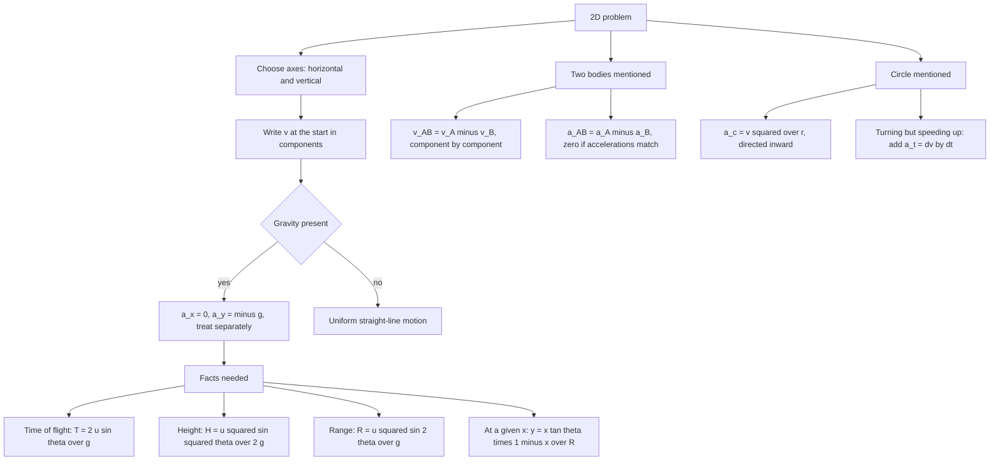

# Motion in 2D

Two-dimensional motion is Motion in 1D run twice on perpendicular axes at the same instant. The horizontal and vertical parts of a problem are independent, each obeys its own one-dimensional rule, and the only place they meet is when you are asked for something that mixes them — a direction, a range, a time of flight, or a speed. Most of this chapter is projectile motion, which is exactly that: one axis uniform, one axis uniformly accelerated.

### 🟢 Lite — Quick Review (1h–1d)

**The one idea everything rests on.** Motion in the x-direction does not affect motion in the y-direction. The horizontal velocity of a projectile is constant because aₓ = 0; the vertical velocity changes because a_y = −g. A ball can therefore be rising and moving sideways at the same time with no interaction between the two.

**Relative motion in a plane.** v_AB = v_A − v_B, and a_AB = a_A − a_B. For relative acceleration, if both bodies have the same acceleration (a projectile and a monkey, for example) the relative acceleration is zero and the relative motion is straight-line uniform.

**Projectile launched at speed u, angle θ above the horizontal, from level ground:**

| Quantity | Formula | Notes |
|---|---|---|
| Initial components | uₓ = u cos θ, u_y = u sin θ | uₓ constant, u_y decreases by g each second |
| Time of flight | T = 2u sin θ / g | only valid for level launch and landing |
| Maximum height | H = u² sin²θ / (2g) | from the launch level |
| Time to apex | u sin θ / g | exactly half the time of flight |
| Horizontal range | R = u² sin 2θ / g | the only formula with sin 2θ |
| Trajectory | y = x tan θ (1 − x/R) | valid only inside 0 ≤ x ≤ R |
| Speed at time t | v = √(u²cos²θ + (u sin θ − gt)²) | never zero above the ground |
| Velocity angle at time t | tan φ = (u sin θ − gt)/(u cos θ) | φ is the angle with the horizontal |

**Symmetry facts.** Complementary angles 45° + α and 45° − α give the same range. Range is maximum at θ = 45°, where R_max = u²/g. Greater launch speed means greater range and greater height, both as u².

**At the highest point** the vertical velocity is zero, the horizontal velocity is still u cos θ, so the speed is u cos θ, not zero, and the acceleration is still g downward. The trajectory at that instant is horizontal.

**Uniform circular motion**, radius r, speed v, angular speed ω = v/r:

- Period T = 2π/ω = 2πr/v, frequency f = 1/T
- Centripetal acceleration a_c = v²/r = ω²r, always directed toward the centre
- The velocity vector is always perpendicular to the radius; the acceleration is always perpendicular to the velocity — that is why the speed is constant while the direction turns

### 🟡 Standard — Regular Study (2d–2mo)

**Position, velocity and acceleration as vectors in a plane.** For a particle at (x, y) the velocity is (dx/dt, dy/dt) and the acceleration is (dvₓ/dt, dv_y/dt). The magnitude of a vector is √(a² + b²) and its direction is fixed by the components — get both right and half the questions in this topic are already done. A vector quantity in 2D has three attributes: magnitude, and an angle measured from a stated reference direction, usually the positive x-axis.

**Graphs in two dimensions.** On a position–time graph in 2D, the slope of the path traced out by the point is the velocity vector, not just its magnitude, so a curved path means the velocity is turning. On a velocity–time graph, the slope gives the acceleration vector. These readings are the same as in 1D; only the number of components has changed. The practical use: if a projectile path on an x–t plot is a straight line, the body has no acceleration along that axis.

**Projectile derivation, written out once so you never have to reconstruct it.**

1. Horizontal: aₓ = 0, so x = u cos θ · t. That is all there is to it — no acceleration, constant speed.
2. Vertical: a_y = −g, so y = u sin θ · t − ½ g t².
3. Time of flight: set y = 0 again, which gives t(u sin θ − ½gt) = 0. The non-zero root is T = 2u sin θ/g. The two halves of the flight are symmetric in time, so the apex comes at T/2.
4. Height: put v_y = 0 in v_y = u sin θ − gt to get t = u sin θ/g, then substitute to get H = u² sin²θ/(2g).
5. Range: substitute T into the horizontal equation, R = u cos θ × 2u sin θ/g = u² sin 2θ/g.
6. Trajectory: eliminate t using t = x/(u cos θ). Then y = x tan θ − gx²/(2u²cos²θ). Since R = 2u² sin θ cos θ/g, the second term equals x² tan θ/R, giving **y = x tan θ (1 − x/R)**. This factored form is the one worth memorising because it turns "find the height at horizontal position x" into a single substitution.

**Reading the range formula correctly.** R = u² sin 2θ/g. The 2θ inside the sine is the single most consequential typographical point in the chapter: it is not u² sin²θ, and it is not u² sin θ/2. The range is maximum when sin 2θ = 1, i.e. 2θ = 90°, θ = 45°, giving R_max = u²/g. R is symmetric about 45°, so 30° and 60° give the same range for the same u — the classic assertion-reason question. What differs is height: 60° is higher, 30° is flatter, so for a target that is high and near, choose the larger angle.

**Horizontal projectile from a height — a different boundary condition.** A body projected horizontally at speed u from the top of a tower of height h has uₓ = u, u_y = 0. It starts in free fall, so H = ½gt² gives t = √(2h/g), independent of u, and R = u√(2h/g). Increase u and the time of fall does not change at all; only the range grows. This is the clearest demonstration that the two components are truly independent.

**Instantaneous velocity and direction of a projectile.** At time t, vₓ = u cos θ and v_y = u sin θ − gt, so the speed is √(u²cos²θ + (u sin θ − gt)²) and the direction makes an angle φ with the horizontal where tan φ = (u sin θ − gt)/(u cos θ). Two consequences worth stating out loud: φ decreases steadily through the flight because v_y falls; and the speed is smallest at the apex, where it equals u cos θ, and largest at launch. A projectile that must hit a target with maximum speed should be fired nearly flat, while one that must clear a wall should be fired steeply.

**Projectile launched from a height above level ground.** When the launch point and landing point differ in height, the flight time comes from the quadratic y = u_y t − ½gt² and takes the form T = [u sin θ + √(u² sin²θ + 2gh)]/g with h the launch height. The range then follows from x = u cos θ · T. Do not apply T = 2u sin θ/g here — that form assumes the projectile returns to its launch height.

**Relative velocity in a plane.** v_AB = v_A − v_B with the subtraction done component by component. Rain falling vertically at 8 m s⁻¹ while a cyclist rides horizontally at 6 m s⁻¹: in the cyclist's frame the rain appears to come from ahead, with a backward horizontal component of 6 and a downward component of 8, so the apparent rain direction makes an angle arctan(6/8) = 36.9° with the vertical. Tilting the umbrella into the direction of travel by that angle keeps the rider dry. If the rain falls at 30° to the vertical instead, the apparent direction is not the arithmetic mean of the angles — take components, then the angle.

**Relative acceleration and the classic monkey-hunter question.** If a hunter aims a bullet directly at a monkey on a tree and the monkey drops, both the bullet and the monkey fall through the same distance in the same time, because both share a = g. The bullet hits. Aiming at where the monkey will be is wrong; aiming at where the monkey is, and letting gravity act on both, is right. The proof is that a_AB = a_bullet − a_monkey = 0, so the relative path is a straight line closing on a point that is at rest in the relative frame.

**Uniform circular motion.** The speed is constant, the direction is not, so the acceleration exists and is entirely centripetal. Magnitude a_c = v²/r = ω²r, directed along the radius toward the centre. Period T = 2π/ω and frequency f = ω/2π. Common questions ask the ratio of accelerations when the speed doubles, or when the radius doubles: a_c ∝ v² and a_c ∝ 1/r, so doubling v quadruples a_c and doubling r halves it.

### 🔴 Extended — Deep Study (3mo+)

**Non-uniform circular motion.** When the speed changes, the acceleration has two perpendicular pieces: the radial centripetal part a_c = v²/r toward the centre and the tangential part a_t = dv/dt along the tangent. The total magnitude is √(a_c² + a_t²), not a_c + a_t. This is why an object at constant speed on a circle feels only one acceleration while an accelerating one on a circle feels two, in perpendicular directions.

**Vertical circle — the part that is actually examined.** Take a body on a string moving in a vertical circle of radius r. At the top, the equation along the radius is T + mg = mv²/r, so **T = mv²/r − mg**. Two questions follow. First, is the string taut at the top? It stays taut only if v² ≥ gr; the critical speed at the top is √(gr). Second, which point has maximum tension? The bottom, where T = mv²/r + mg, so the ratio of maximum to minimum tension is (v² + gr)/(v² − gr). This "top of the loop" condition is the standard vehicle-over-a-bridge and roller-coaster problem with the same algebra.

**Centripetal force is not a new force.** It is the name for the net inward force. A car going round a level bend is held in by static friction; a satellite by gravity; an electron in a magnetic field by the magnetic force; a bead on a string by tension. If you find yourself writing "centripetal force = something" without asking which real force supplies it, the free-body diagram is missing a step. Only the direction and the inward net result are new.

**Banked roads.** On a level road the entire centripetal force must come from friction, and the maximum safe speed is v = √(μ_s r g). Tilting the road inward lets the normal reaction itself provide part of the inward force. Resolving N on a road banked at angle θ: N sin θ = mv²/r vertically-inward and N cos θ = mg vertically, so dividing gives tan θ = v²/(rg) and v = √(rg tan θ). The design speed v₀ = √(rg tan θ) is the speed at which no friction is needed at all. Above v₀ friction acts down the bank, giving v_max = √[rg(tan θ + μ_s)/(1 − μ_s tan θ)]. Below v₀ friction acts up the bank, giving v_min = √[rg(tan θ − μ_s)/(1 + μ_s tan θ)]. If the question asks why a vehicle skids outward on a fast bend and inward on a slow one, these two expressions are the answer.

**River-crossing navigation, the three objectives.** Let the river be width d, the current speed v_r, and the boat's speed in still water v_b.

- **Shortest time:** point the boat perpendicular to the bank. Time = d/v_b, and the downstream drift is v_r · d/v_b. The shortest time and the shortest path are different goals.
- **Shortest path (zero drift):** aim upstream so the boat's own velocity cancels the current in the cross-stream direction. With α measured from the bank, sin α = v_r/v_b, and this is only possible if v_b > v_r. Time = d/√(v_b² − v_r²). The crossing time is then longer than d/v_b — that is the price of arriving directly opposite.
- **Minimum drift when the current is faster than the boat** (v_r > v_b): the boat cannot cancel the current, so point the bow at an angle to the bank with sin θ = v_b/v_r to maximise the cross-stream component. Drift = d√[(v_r/v_b)² − 1].

The distinction between "shortest time" and "shortest path" is the concept being tested, not the algebra.

**A worked banked-road and friction example.** A road is banked at θ = 15° with μ_s = 0.20. Find the speed range for which the car does not skid. v₀ = √(rg tan 15°) with g = 10 gives √(10 × r × 0.268). For r = 50 m: v₀ = √134 ≈ 11.6 m s⁻¹. v_max = √[rg(tan θ + μ_s)/(1 − μ_s tan θ)] = √[50 × 10 × 0.468/0.946] = √247 ≈ 15.7 m s⁻¹. v_min = √[50 × 10 × 0.068/1.053] = √32.3 ≈ 5.7 m s⁻¹. So the car holds between about 5.7 and 15.7 m s⁻¹; below the lower limit it slides down the bank, above the upper limit it flies off the outer edge.

**Two-dimensional graphs that are actually asked about.** A projectile's y against x is a downward-opening parabola with vertex at the apex. Its y against t is a parabola opening downward with vertex at t = T/2. Its x against t is a straight line through the origin with slope u cos θ. If a question gives you a graph and asks for u and θ, read the slope of the x–t line for u cos θ, read the peak of the y–t curve for both T and H, and combine: T = 2H/(u sin θ) gives u sin θ directly.

**Connecting forward.** Two-dimensional kinematics is the language of the rest of mechanics. Relative acceleration is needed for the frames in Laws of Motion; v²/r reappears as the centripetal demand in Rotational Motion; the projectile path is the first place conservation of energy is visible as a height maximum. A student fluent in components here does not need to relearn them.

### 🧠 Memory Anchors

- **"Horizontal is calm, vertical is gravity."** aₓ = 0 forever; a_y = −g forever. Every projectile problem is that sentence plus bookkeeping.
- **"At the top: v_y = 0, v_x = u cos θ, a = g."** Three separate facts that students collapse into one wrong one.
- **"sin 2θ, and 45° is the max."** Range is symmetric about 45°, so 30 and 60 match.
- **"T = 2u sin θ/g needs level ground."** Change the launch height and the formula changes shape.
- **"y = x tan θ (1 − x/R)."** The factored trajectory is the shortest route to a height at a distance.
- **"v_AB is a subtraction, a_AB is a subtraction."** Components, always, never magnitudes.
- **"Centripetal is a name for the net inward force."** Ask which real force is doing it.
- **Flashcard Q&A:**
  - *Range at 30° vs 60°?* → equal, both u²·sin60°/g = (√3/2)u²/g.
  - *Speed at the top?* → u cos θ.
  - *Apex time vs total flight time?* → t = u sinθ/g, exactly half of T.
  - *Horizontal launch from height h: what fixes the fall time?* → only h and g. Speed does not.
  - *Monkey and bullet?* → both accelerate at g, so a_AB = 0 and the bullet hits.
  - *Doubling the speed of a circular particle?* → a_c goes up by a factor of 4.
  - *Design speed on a banked road?* → √(rg tan θ), the speed needing zero friction.
  - *Shortest crossing time vs shortest path?* → different goals; perpendicular heading gives the first.

### 🎯 Exam Traps & Error Log

1. **Writing u² sin²θ/g for the range.** The range carries sin 2θ. A quick check: the range at 90° must be zero, and sin²90° = 1 would not give that.
2. **Claiming the speed is zero at the highest point.** Only the vertical component is zero. The speed there is u cos θ, and the acceleration is still g.
3. **Using T = 2u sin θ/g for a projectile that lands below or above its launch level.** That form assumes it returns to launch height; use the quadratic root instead.
4. **Adding a fictitious "force" in the horizontal direction to keep a projectile on a straight line.** There is no horizontal force; the curvature of the path is entirely the vertical fall.
5. **Subtracting magnitudes instead of components in relative velocity.** A cyclist at 6 m s⁻¹ and rain at 8 m s⁻¹ do not give an apparent speed of 2 or 14; the components give √(6² + 8²) = 10 m s⁻¹.
6. **Assuming a projectile launched at 60° lands higher than one at 30° at the same range.** The range is equal; the apex heights differ (u²·3/8g versus u²·1/8g).
7. **Treating the angle of the velocity as the angle of the launch.** After launch, tan φ = (u sin θ − gt)/(u cos θ), and φ shrinks to zero at the apex even though the path is at its steepest there — the tangent to a parabola at its vertex is horizontal.
8. **Writing a_c = v²/r + dv/dt and calling it the total acceleration in uniform circular motion.** In uniform circular motion dv/dt = 0, so there is no tangential part at all.
9. **Forgetting that a projectile on level ground lands at zero height even if the ground is not level in the direction of flight** — level ground means y = 0 at both ends, not that the terrain is flat.
10. **Treating "shortest time" and "shortest path" as the same objective in a river problem.** They are minimised by different headings, and the exam question is usually about that difference.
11. **Assuming a banked road has zero friction above the design speed.** Above v₀ friction is required and acts down the bank; below v₀ it acts up the bank. The friction direction reversing is the point of the v_min and v_max pair.

### 🧪 Self-Test — 8 Questions with Worked Answers

Work each on paper, then compare. These are the forms this chapter actually tests.

1. **A ball is thrown at 20 m s⁻¹ at 30° above the horizontal. Find the time of flight, the maximum height and the range. Take $g = 10$ m s⁻².**
   uₓ = 20 cos 30° = 20 × 0.866 = 17.3 m s⁻¹. u_y = 20 sin 30° = 10 m s⁻¹. T = 2u_y/g = 2(10)/10 = 2 s. Apex time = 1 s. H = u_y²/(2g) = 100/20 = 5 m. R = u² sin 2θ/g = 400 × sin 60°/10 = 400 × 0.866/10 = 34.6 m. Cross-check: R should equal uₓ × T = 17.3 × 2 = 34.6 m. The two routes agreeing is the check; if they disagree you have dropped a factor of 2 in T.
2. **Two projectiles are launched with the same speed at 45° and at 60°. Compare their ranges, heights and times of flight.**
   Range: 45° gives sin 90° = 1; 60° gives sin 120° = 0.866, so the 45° shot travels 1/0.866 ≈ 1.15 times further. Height: H₄₅ = u²(½)/2g = u²/4g; H₆₀ = u²(¾)/2g = 3u²/8g, so the 60° shot reaches 1.5 times the height. Time: T₄₅ = 2u(0.707)/g = 1.414u/g; T₆₀ = 2u(0.866)/g = 1.732u/g, so the 60° shot stays up about 22% longer. High and slow, or far and flat — you trade one against the other, which is why the launch angle is a real design choice.
3. **A stone is dropped from the top of a 45 m tower at the same instant a ball is thrown horizontally at 20 m s⁻¹. When do they reach the ground, and how far apart are they?**
   Both start with zero vertical velocity and accelerate at g, so they take the same time: t = √(2h/g) = √(2 × 45/10) = 3 s. The stone falls straight down; the ball covers 20 × 3 = 60 m horizontally. They are 60 m apart when they land. This is the cleanest statement of the independence principle: the horizontal speed changes where the ball lands, not when.
4. **A projectile is at 20 m s⁻¹ at 60° with the horizontal. Find its speed and direction 1 s after launch. Take $g = 10$ m s⁻².**
   uₓ = 20 cos 60° = 10 m s⁻¹, constant. u_y = 20 sin 60° = 17.3 m s⁻¹. After 1 s, v_y = 17.3 − 10 = 7.3 m s⁻¹. Speed = √(10² + 7.3²) = √(100 + 53.3) = √153.3 = 12.4 m s⁻¹. Direction: tan φ = 7.3/10, φ = 36.2° above the horizontal. The launch angle was 60° and the flight angle is 36°, because gravity has eaten 10 m s⁻¹ of the vertical component in one second.
5. **Rain falls vertically at 12 m s⁻¹. A cyclist rides at 5 m s⁻¹. At what angle to the vertical should the umbrella be held?**
   Rain relative to cyclist: horizontal component 0 − 5 = −5 m s⁻¹ (i.e. the rain appears to move backwards at 5), vertical component −12 m s⁻¹. The apparent rain comes from ahead and above. tan θ = 5/12 = 0.417, θ = 22.6° to the vertical. So tilt the umbrella 22.6° into the direction of travel. Note that the apparent speed is √(5² + 12²) = 13 m s⁻¹, not 12 − 5 or 12 + 5 — the components are perpendicular, so Pythagoras applies.
6. **A satellite moves in a circle of radius 6.4 × 10⁶ m with period 24 h. Find its orbital speed and centripetal acceleration.**
   r = 6.4 × 10⁶ m, T = 24 × 3600 = 86400 s. Speed = 2πr/T = 2π(6.4 × 10⁶)/86400 = 4.02 × 10⁷/8.64 × 10⁴ = 465 m s⁻¹. a_c = v²/r = (465)²/(6.4 × 10⁶) = 216225/6.4 × 10⁶ = 0.0338 m s⁻². This small value is what keeps satellites in orbit — the force needed is only about 0.3% of g, and if gravity were switched off the satellite would fly off in a straight line at 465 m s⁻¹.
7. **A ball on a string goes round a vertical circle of radius r. At the top the string is just taut. What is the speed there, and what is the tension at the bottom?**
   At the top, T = 0 and the only inward force is gravity, so mg = mv²/r gives v = √(gr). The speed is the same at the bottom by conservation of energy, since height is the only thing that changed. At the bottom, T − mg = mv²/r = mgr, so T = mg + mgr = mg(1 + r/g). The bottom tension always exceeds the top tension, which is why strings fail at the bottom of a loop, not the top.
8. **A body moves in a circle of radius 5 m with speed increasing from 10 m s⁻¹ to 14 m s⁻¹ in 4 s. Find the magnitude of its acceleration at the end of the 4 s.**
   At the end, v = 14 m s⁻¹. Centripetal part a_c = v²/r = 196/5 = 39.2 m s⁻². Tangential part a_t = dv/dt = (14 − 10)/4 = 1 m s⁻². Total = √(39.2² + 1²) = √(1536.6 + 1) = √1537.6 = 39.2 m s⁻². The tangential term is almost invisible because v²/r is so large. Taking the two accelerations as 39.2 + 1 = 40.2 is wrong in principle, even when the numerical difference is small; in a case where v is small and a_t is large the error becomes obvious.

### 💡 Pro Tips

1. **Split every problem into a horizontal column and a vertical column before computing anything.** Most of the errors in this chapter are bookkeeping, and separate columns make bookkeeping errors visible.
2. **Memorise the four projectile results as one block** — T, H, t_apex, R — so you retrieve them together and cannot swap two.
3. **Use R = uₓ × T as a check on every range calculation.** The horizontal formula and the range formula are independent, so agreement is a genuine check.
4. **Read sin 2θ out loud when you write it.** Writing "sin two theta" is the cheapest insurance against sin²θ.
5. **In a relative-velocity problem, draw the two velocity vectors tail at tail and read the difference geometrically** before touching numbers. The picture settles the direction, and the direction is where the marks are.
6. **For the monkey-hunter problem, answer in one line: a_AB = 0, so the relative path is a straight line.** The physical story is optional; the equation settles it.
7. **For a banked road, always identify whether the question is above or below the design speed** before choosing a friction formula. Most wrong answers here come from using the wrong one of the two.
8. **Distinguish the trajectory angle from the velocity angle.** The path is steepest at the apex, but the velocity is horizontal there. These two angles are different quantities and questions exploit the confusion.
9. **Keep a small sketch habit.** Any projectile question, draw the arc, mark the apex, and label the range. Thirty seconds of drawing prevents nearly every component error.
10. **Revise circular motion through the "one new force" framing.** If you can name which real force supplies the centripetal acceleration in five different situations, you have learnt the chapter; if you are still treating centripetal force as an extra force to add, you have not.

---

## Continue your study

- **[View this topic in your CUET UG roadmap](/roadmap/?exam=cuet&duration=1mo)** — see where "Motion in 2D" fits in your personalised plan
- **[Build a quick revision plan](/roadmap/?exam=cuet&duration=1d)** — 1-day sprint covering highest-weight topics
- **[CUET UG exam overview](/exams/cuet/)** — pattern, eligibility, and syllabus
- **[All Physics notes](/notes/cuet/physics/)** — browse sibling topics in this subject
