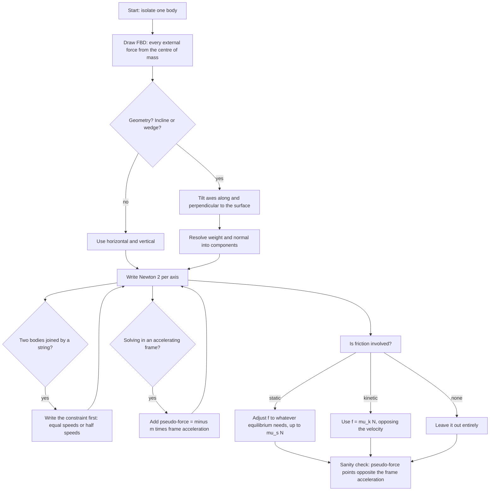

# Laws of Motion

Newton's three laws are the working rules of almost every mechanics question in the paper. Below them there is only one thing to decide, and deciding it correctly is worth most of the marks: which forces act on the body you have isolated, and in which direction. Get the free-body diagram right and the algebra is arithmetic; get it wrong and no amount of algebra helps.

### 🟢 Lite — Quick Review (1h–1d)

**First law — inertia.** A body keeps its state of rest or of uniform motion in a straight line unless a net external force acts. Mass is the measure of inertia: the greater the mass, the harder it is to change the velocity.

**Second law.** F = ma for constant mass. In its complete form, **F = dp/dt = d(mv)/dt**, which becomes m dv/dt when m is fixed and m dv/dt + v dm/dt when mass is added or removed — the rocket equation. Force has units of newton, 1 N = 1 kg m s⁻².

**Third law.** For every action there is an equal and opposite reaction, and the pair always acts **on two different bodies**, is of the same type, and is simultaneous. Two magnets do not cancel: the north pole of one is pushed and the south pole of the other is pushed the other way, on different objects.

**Friction.** Static friction adjusts itself to whatever value is needed, up to f_max = μ_s N; beyond that it cannot help and the body slides. Once sliding, f_k = μ_k N with μ_k < μ_s, so there is a sudden drop. The **angle of friction** φ satisfies tan φ = μ_s, and it is also the angle of repose — the largest incline a block will rest on.

**Pulley basics.** An ideal fixed pulley changes only the direction of the force. An ideal movable pulley is supported by two strands, so the effort is half the load. Ideal means massless string, massless frictionless pulley, inextensible string.

**Apparent weight in a lift** = m(g + a) going up, m(g − a) going down, and exactly zero in free fall. The scale reads the normal force, which is not the same as the true weight mg.

### 🟡 Standard — Regular Study (2d–2mo)

**Force classified two ways.** *Contact forces* need physical interaction: normal reaction perpendicular to a surface, tension along a string or rod (always pulling), friction along a surface opposing relative sliding, and the elastic spring force F = −kx. *Field forces* act at a distance through the field: gravity, electrostatic, magnetic. The distinction matters for free-body diagrams because a field force can act with no contact at all — a satellite has a gravitational force on it and touches nothing.

**Free-body diagrams — the method that carries marks.** Isolate the single body under study; draw it as a dot or a box; draw one arrow for every external force, starting at the centre of mass; label each; choose axes suited to the geometry. Leave out the forces the body exerts on others — they act on other bodies and belong on their own diagrams. On an inclined plane, tilt the y-axis along the slope and the x-axis perpendicular to it; then the two forces you must resolve are gravity and the normal, and everything reduces to components. A block on a 30° incline has N = mg cos 30° and a down-slope gravity component of mg sin 30°.

**Equilibrium.** ΣF = 0 in every direction means the body is at rest or in uniform motion — the two are dynamically identical and cannot be distinguished by Newton's laws alone. On an incline at the limiting angle, mg sin θ = μ_s mg cos θ, so tan θ = μ_s and θ equals the angle of friction.

**Friction in detail.** For a body at rest, 0 ≤ f_s ≤ μ_s N. f_s is not always μ_s N; it takes whatever value equilibrium demands, up to the maximum. This is the single most misunderstood point in the chapter — a book on a table is not automatically experiencing μ_s N of friction. Once the applied force exceeds μ_s N, the body moves and friction drops to f_k = μ_k N, which produces the characteristic jolt when an object starts moving. Rolling friction is far smaller than sliding friction, which is why wheels exist.

**Constraint equations — count the strands.** A string inextensible over one fixed pulley joining two bodies means the two move by equal distances in opposite directions, so v₁ = v₂, a₁ = a₂ in magnitude. For a movable pulley the load moves half as far as the effort end, so v_load = v_effort/2. Write the constraint before the Newton's-law equations; it eliminates a variable and prevents the most common arithmetic error in pulley problems.

**Atwood's machine, derived.** Masses m₁ and m₂ over a frictionless pulley. For m₂ heavier, m₂g − T = m₂a and T − m₁g = m₁a. Adding eliminates T: (m₂ − m₁)g = (m₁ + m₂)a, so **a = (m₂ − m₁)g/(m₁ + m₂)**. Substituting back gives **T = 2m₁m₂g/(m₁ + m₂)**. Both results are worth memorising; both are standard question stems. As m₂ → m₁, a → 0 and T → mg, the sensible limit.

**Incline, rest and slide.** A block stays at rest while mg sin θ ≤ μ_s mg cos θ. Once it slides, the net down-slope force is mg sin θ − μ_k mg cos θ, so **a = g(sin θ − μ_k cos θ)**. Two numerical consequences: on a frictionless plane a = g sin θ, independent of mass; and a block given an initial push far up a rough plane can stop and slide back, because friction reverses direction with the velocity.

**Impulse and momentum.** Impulse is F Δt and equals the change in momentum Δp. A longer contact time at smaller force gives the same momentum change — the reason a cricket player moves his hands back while catching. In every collision in an isolated system, total momentum is conserved even when kinetic energy is not; the ratio of final to initial kinetic energy is the coefficient of restitution.

**Worked example — block and wedge.** A block of mass m slides down the frictionless face of a wedge of mass M, itself free to move on a smooth horizontal floor. Taking the wedge's horizontal acceleration, a_wedge = m g sin θ cos θ/(M + m sin²θ), directed opposite to the block's horizontal slide. The block's acceleration down the incline face is a_block = (M + m) g sin θ/(M + m sin²θ). Both share the same denominator, which is the system mass corrected by the geometric factor sin²θ. The wedge moves at all because the block's normal reaction on the wedge has a horizontal component; that component is missing from the block's own diagram, which is why an isolated-block solution is wrong. Two limits confirm the algebra: M → ∞ leaves a_block → g sin θ, the fixed-wedge case, and a_wedge → 0 as m → 0, since a massless block cannot push anything sideways.

### 🔴 Extended — Deep Study (3mo+)

**Variable mass and why rockets work.** For a system whose mass changes, F_ext = d(mv)/dt = m dv/dt + v dm/dt. A rocket of mass m ejecting fuel at relative speed u gains thrust u(−dm/dt) with no external air pressure involved, so it accelerates in vacuum. For a body whose mass is being added to it by accretion from rest in its own frame, v dm/dt is the term that matters. This is why F = ma is only a special case, and why a chain falling onto a scale can read more than its own weight.

**Non-inertial frames — the pseudo-force recipe.** In a frame accelerating with acceleration a₀, Newton's laws hold if you add a fictitious force F_pseudo = −m a₀ on every body. The sign is the important part: the pseudo-force points opposite the frame's acceleration. Examples worth knowing precisely:

- **Lift accelerating upward** at a: pseudo-force ma downward, so the scale reads N = m(g + a). The passenger feels heavier.
- **Lift accelerating downward** at a: pseudo-force ma upward, so N = m(g − a). Lighter.
- **Free fall**, a = g downward: pseudo-force mg upward exactly cancels gravity, N = 0. This is the origin of apparent weightlessness, and it is why an astronaut in orbit floats — the station is falling, not floating.
- **Free fall in a lift, objects in the cabin** all share a = g, so relative acceleration is zero and everything appears to hang still. The same fact explains the "weightless" feeling of a dropped tower ride and the apparent absence of gravity inside a falling lift shaft.
- **Rotating frame (turntable), stationary object:** centrifugal pseudo-force mω²r outward. The real force is the inward normal force from the floor. Outside the frame, only the inward force exists and it is called centripetal.
- **Coriolis force** −2mω × v′ appears only when the object also moves in the rotating frame. It deflects the path of a body moving radially inward or outward on a turntable and is the reason large-scale air motion on Earth is deflected by the rotation.

**Circular motion as a Newton 2 application.** Nothing about circular motion is a separate law. You always write the inward equation for a specific scenario. A car on a level bend: f_s ≤ μ_s mg gives v ≤ √(μ_s rg). A car on a banked road of angle θ: N sin θ = mv²/r, N cos θ = mg, so v₀ = √(rg tan θ). A satellite in a circular orbit: mv²/r = GMm/r², so v = √(GM/r). A charged particle in a uniform magnetic field: mv²/r = qvB, so r = mv/qB. The algebra changes; the pattern does not.

**Apsidal angle and the ladder problem.** A uniform ladder of length L rests at angle θ against a frictionless wall with its foot on a rough floor of coefficient μ_s. It is on the point of slipping when tan θ = 1/(2μ_s), because the wall is frictionless and provides only a horizontal normal reaction, so only the floor contributes friction while the weight acts at the centre, half way along. The factor of 2 comes from the centre of mass being at L/2. This is a standard application of the equilibrium condition combined with torque, and it is the reason ladders slip at the base rather than at the top.

**Three-body and constraint subtleties.** When a movable pulley is itself accelerating, the two strands need not have equal tension, and the mass of the pulley cannot be ignored. Ideal-system answers assume massless strings, frictionless pulleys and inextensible ropes; when a question states a pulley has mass, the two tensions differ and the difference is what accelerates the pulley. Recognising which idealisation a question grants you is half of solving it.

**Worked example — block on a wedge with friction.** A block of mass m rests on a wedge of angle θ; the coefficient of friction between them is μ. Find the angle at which it begins to slide. N = mg cos θ, the up-slope friction limit is μ mg cos θ, and the down-slope component is mg sin θ. Setting them equal: tan θ = μ, so θ equals the angle of friction. This does not depend on m, which is a useful thing to be able to state when a question offers masses that cancel.

**Worked example — two blocks and a pulley with a table.** Block m₁ sits on a frictionless table, connected over a pulley to a hanging m₂. m₁g would be zero, so the system is driven by m₂ alone: a = m₂g/(m₁ + m₂), T = m₁m₂g/(m₁ + m₂). Add friction μ m₁g on the table and a = (m₂ − μm₁)g/(m₁ + m₂), with a = 0 when m₂ = μm₁. A question asking "what is the minimum value of m₂ for equilibrium" is answered by that last condition.

**Centre of mass and its use as a check.** For any isolated system the centre of mass moves with constant velocity, or stays at rest, regardless of the internal forces. In a two-block problem, if you can find the centre-of-mass trajectory independently of friction and the acceleration, and your answer disagrees, the free-body diagram is wrong. In an explosion or a collision, the centre of mass keeps moving exactly as if nothing happened — the standard reason a bullet's recoil is tiny while the momentum change is equal and opposite.

### 🧠 Memory Anchors

- **"Isolate, then draw, then resolve."** The order is not negotiable; a diagram drawn after you start calculating is already wrong.
- **"Action–reaction never cancels on one body."** If the two forces are on your diagram together, you have mixed up bodies.
- **"Static friction is a demand, not a fixed value."** It equals what equilibrium needs, capped at μ_s N.
- **"Angle of friction = angle of repose."** Both are arctan μ_s, and both answer "when does it start to slip".
- **"a = (m₂ − m₁)g/(m₁ + m₂), T = 2m₁m₂g/(m₁ + m₂)."** Atwood's two results, memorised as a pair.
- **"Apparent weight is the normal force."** A spring balance reads N, never mg, unless the frame is inertial.
- **"The pseudo-force points opposite the frame's acceleration."** Lift up → feel heavier; lift down → feel lighter; free fall → nothing.
- **Flashcard Q&A:**
  - *Two forces act on the same body in an equilibrium problem — is that third law?* → No. Equilibrium means ΣF = 0, which is the first law; action–reaction pairs act on different bodies.
  - *Book on a table, friction = μ_s N?* → Only at the point of slipping. At rest it is mg, or whatever equilibrium requires.
  - *Free fall inside a lift, reading on the scale?* → Zero.
  - *Ideal movable pulley lifting W?* → Effort W/2, mechanical advantage 2.
  - *Block on incline, normal reaction?* → mg cos θ, not mg.
  - *Impulse equals?* → Δp = F Δt.
  - *Wedge free to move, why?* → The block pushes the wedge through the horizontal component of the normal reaction.
  - *g in a lift accelerating up at a?* → apparent g is g + a.

### 🎯 Exam Traps & Error Log

1. **Writing the action and the reaction on the same free-body diagram and concluding the net force is zero so nothing moves.** They act on different bodies. The classic exam distractor.
2. **Using f = μ_s N for a body at rest.** Static friction takes the value equilibrium requires; μ_s N is only the ceiling.
3. **Setting the normal reaction equal to mg on an incline.** N = mg cos θ whenever the plane is at rest and there is no acceleration perpendicular to it.
4. **Forgetting that a movable pulley halves the load speed as well as the effort.** The effort end moves twice the distance, so v_effort = 2 v_load and a_effort = 2 a_load, and the power balance must still hold.
5. **Applying pseudo-forces in an inertial frame,** or applying them with the wrong sign. In an inertial frame there are none, and the only pseudo-force is F_pseudo = −m a₀.
6. **Treating "constant velocity" and "at rest" as different physical states.** Newton's first law cannot distinguish them; that is why the law says "at rest or moves with constant velocity".
7. **F = ma applied to a system where the mass is changing,** as in a rocket or a falling chain. Use F = dp/dt.
8. **Leaving the tension the same on both sides of a massive pulley.** With a massless frictionless pulley they are equal; with a massive one they are not, and the difference accelerates the pulley.
9. **Writing a = g(sin θ + μ cos θ) for a block sliding down.** Friction acts up the slope while the body moves down, so it subtracts.
10. **Resolving friction in the wrong direction after a body reverses.** Friction always opposes relative sliding, not the force, so its direction follows the velocity.
11. **Assuming weightlessness requires the absence of gravity.** Free fall needs gravity — without it there would be no free fall, and the pseudo-force would not cancel anything.

### 🧪 Self-Test — 8 Questions with Worked Answers

Attempt each on paper first. Every one uses a form this chapter actually uses.

1. **A 5 kg block rests on a horizontal table. The coefficient of friction is 0.4. What is the minimum horizontal force needed to start it moving, and what is its acceleration once it slides if $\mu_k = 0.3$?**
   N = mg = 5 × 9.8 = 49 N. Force needed = μ_s N = 0.4 × 49 = 19.6 N. Once sliding, f_k = 0.3 × 49 = 14.7 N, so a = (19.6 − 14.7)/5 = 0.98 m s⁻² with a 19.6 N push. Note the acceleration is small and positive; an applied force exactly at the threshold gives zero acceleration, not zero friction. If the force were 15 N, nothing would move at all, because 15 N is below the 19.6 N ceiling and static friction simply adjusts to 15 N.
2. **Two blocks of 2 kg and 3 kg hang from a frictionless pulley. Find the acceleration and the tension. Take $g = 10$ m s⁻².**
   a = (m₂ − m₁)g/(m₁ + m₂) = (3 − 2)(10)/5 = 2 m s⁻², the 3 kg block moving down. T = 2m₁m₂g/(m₁ + m₂) = 2(2)(3)(10)/5 = 24 N. Check: for the 2 kg block, T − m₁g = 24 − 20 = 4 N = m₁a = 2 × 2. Correct. Also check T < m₂g = 30 N, which must hold, and T > m₁g = 20 N, which it does. Both inequalities are a fast sanity test.
3. **A block is placed on a 30° incline with $\mu_s = 0.6$. Does it slide, and if so what is the acceleration with $\mu_k = 0.4$? Take $g = 10$.**
   N = mg cos 30° = 0.866 mg. Down-slope component = mg sin 30° = 0.5 mg. Maximum static friction = 0.6 × 0.866 mg = 0.52 mg, which exceeds 0.5 mg, so the block stays at rest. It is close: the angle of friction is arctan 0.6 = 31°, just above 30°. Had μ_s been 0.5, tan θ = 0.577 > 0.5 and it would have slid, with a = g(sin 30° − 0.4 cos 30°) = 10(0.5 − 0.346) = 1.54 m s⁻². Always compare tan θ with μ_s rather than eyeballing the components.
4. **A man of mass 60 kg stands on a weighing machine in a lift accelerating upward at 2 m s⁻². What does the machine read? Take $g = 10$.**
   The machine reads the normal force N. Forces on the man: N up, mg down, and a pseudo-force ma down in the lift frame — equivalently, from the ground frame N − mg = ma, so N = m(g + a) = 60 × 12 = 720 N. If the lift accelerates downward at 2, the reading falls to 480 N; in free fall it is 0. The true weight mg = 600 N is never what the machine shows unless the lift is stationary.
5. **A ball of mass 0.5 kg hits a wall at 20 m s⁻¹ and rebounds at 15 m s⁻¹. Find the impulse and the average force if contact lasts 0.02 s.**
   Taking the incident direction as positive, v_i = 20, v_f = −15, so Δp = m(v_f − v_i) = 0.5(−15 − 20) = −17.5 kg m s⁻¹. The impulse is 17.5 N s, directed away from the wall, i.e. the force of the wall on the ball points back along the incident path. Average force = impulse/Δt = 17.5/0.02 = 875 N. The sign convention is what makes this correct: the wall pushes the ball in the direction of the rebound, opposite to its incident velocity.
6. **A rope of length L and mass m hangs over a frictionless pulley with a length x on one side and L − x on the other. Find the acceleration of the system and the tension just above the pulley.**
   The two hanging segments have masses mx/L and m(L − x)/L, and each accelerates at a = g(2x − L)/L, directed toward the longer side. T = (2m₁m₂/(m₁+m₂))g with m₁ = mx/L, m₂ = m(L − x)/L gives T = 2m²g x(L − x)/[L·L(m)] ... carefully: m₁m₂ = m²x(L−x)/L² and m₁ + m₂ = m, so T = 2m²x(L−x)g/(L² · m) = 2mgx(L − x)/L². The maximum tension occurs at x = L/2 and equals mg/2, and the acceleration is zero there — the most common question on this setup, and the answer is that equal halves mean no net driving force.
7. **A 5 kg block on a frictionless table is connected by a string over a pulley to a 3 kg hanging block. Find the acceleration and the tension. Take $g = 10$.**
   The table block has no weight component along the string, so the only driving force is the hanging weight, 30 N. Total mass 8 kg, so a = 30/8 = 3.75 m s⁻². T = m₁a = 5 × 3.75 = 18.75 N, and the check with the hanging block is 30 − 18.75 = 11.25 N = 3 × 3.75. The tension is less than the hanging weight, as it must be. A frequent wrong answer sets a = g/2 by assuming both masses hang freely, which is not the situation.
8. **A body of mass 2 kg is at rest on a 5 kg wedge whose base is on a smooth horizontal surface. The incline is 30° and friction is absent. Find the horizontal acceleration of the wedge. Take $g = 10$.**
   a_wedge = m g sin θ cos θ/(M + m sin²θ) = 2 × 10 × 0.5 × 0.866/(5 + 2 × 0.25) = 8.66/5.5 = 1.57 m s⁻², in the direction opposite the block's horizontal slide. The block itself accelerates down the face at a_block = (M + m)g sin θ/(M + m sin²θ) = 7 × 10 × 0.5/5.5 = 35/5.5 = 6.36 m s⁻², which exceeds g sin θ = 5 m s⁻² because the wedge is receding underneath it. Check the limits: as m → 0 the wedge acceleration goes to zero, and as M → ∞ the block acceleration falls to 5 m s⁻², the fixed-wedge value. A sign error here shows up immediately as a wedge that accelerates *towards* the block.

### 💡 Pro Tips

1. **Draw the free-body diagram before you write a single equation,** and give each force a symbol the moment you draw it. Naming forces as you go is how FBDs stop being decorative.
2. **Write the constraint equation first in any pulley problem.** It tells you which bodies share an acceleration and usually removes one unknown.
3. **Ask "which body does this force act on?"** every time you draw a force. That one question eliminates the action–reaction error, which is the most-asked conceptual trap in the topic.
4. **Check tension against the two end forces.** In Atwood, T must be greater than m₁g and less than m₂g. If it is not, a sign is wrong.
5. **For pseudo-force problems, remember the direction:** opposite the frame's acceleration. Lift up → heavier, lift down → lighter, free fall → zero.
6. **Handle variable mass explicitly.** If a problem mentions a rocket, a leaking tank or a chain, go straight to F = dp/dt rather than F = ma.
7. **Solve a two-block problem twice, once from each block,** as in questions 2 and 7 above. It costs thirty seconds and it is the fastest way to find an algebra slip.
8. **Use limits as a check.** m₂ → m₁ in Atwood should give a = 0 and T = mg; M → ∞ in the wedge problem should give a = g sin θ. Limits catch sign errors that arithmetic does not.
9. **Keep the angle-of-friction identity at your fingertips:** tan φ = μ_s, and φ is the largest incline angle on which a block rests. Half the incline questions are that one line.
10. **Practise the inclined-plane resolution until it is automatic.** N = mg cos θ, down-slope = mg sin θ, and a = g(sin θ − μ cos θ) when sliding. Written automatically, it costs five seconds per question instead of two minutes.

---

## Continue your study

- **[View this topic in your CUET UG roadmap](/roadmap/?exam=cuet&duration=1mo)** — see where "Laws of Motion" fits in your personalised plan
- **[Build a quick revision plan](/roadmap/?exam=cuet&duration=1d)** — 1-day sprint covering highest-weight topics
- **[CUET UG exam overview](/exams/cuet/)** — pattern, eligibility, and syllabus
- **[All Physics notes](/notes/cuet/physics/)** — browse sibling topics in this subject
