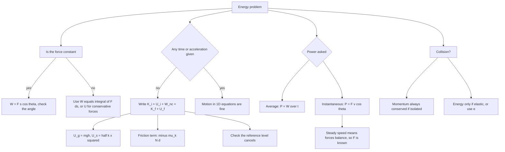

# Work Energy Power

Work, energy and power are the language of every question where time is awkward. A block dragged across a rough surface takes three equations of motion and one integral; with the work–energy theorem it takes two lines. Energy is not a separate topic so much as a second route to the same answer, and the rule for a student is simple: if the question gives no time and no acceleration, use energy.

### 🟢 Lite — Quick Review (1h–1d)

**Work by a constant force:** W = **F**·**s** = F s cos θ, where θ is the angle between the force and the displacement, F in newtons and s in metres, giving W in joules. The work is positive when θ is acute, zero when θ = 90°, negative when θ is obtuse. Work is zero if there is no displacement, and zero if the force is perpendicular to the motion — the centripetal force on a whirling stone does no work at all, which is why its speed never changes.

**The seven formulas worth having in your head:**

| Quantity | Formula | SI unit |
|---|---|---|
| Work | W = F s cos θ | joule (N m) |
| Kinetic energy | K = ½ m v² | joule |
| Work–energy theorem | W_net = K_f − K_i | joule |
| Gravitational potential energy | U_g = m g h | joule |
| Elastic potential energy | U_s = ½ k x² | joule |
| Average power | P = W / t | watt (J s⁻¹) |
| Instantaneous power | P = F v cos θ | watt |

**1 watt = 1 J s⁻¹. 1 kWh = 1000 W × 3600 s = 3.6 × 10⁶ J = 3.6 MJ.** The kilowatt-hour is a unit of energy, not power, and mixing the two is the commonest unit error in this topic.

**Conservative forces** — gravity and the spring force — do work that depends only on the endpoints, so a potential energy can be defined for them with W_conservative = −ΔU. **Non-conservative forces** — kinetic friction, air drag — do work that depends on the path, so no potential energy can be assigned and mechanical energy is not conserved.

**The master conservation statement:** E_mechanical = K + U is constant when no non-conservative force does net work. Otherwise E_mechanical drops by exactly the magnitude of the work they do.

**Gravity's work is m g h, never m g L.** Down an incline of length L, the work done by gravity is the weight times the vertical drop, not the distance travelled.

### 🟡 Standard — Regular Study (2d–2mo)

**Work needs both a force and a displacement.** A student carrying a bag while walking on the level does no work on the bag through the arm, because the force is vertical and the displacement horizontal. A person standing still holding a weight does zero work; the chemical energy conversion inside the body is a different matter and does not enter the mechanical work calculation. A force applied at a point that does not move does no work, whatever its magnitude — this is why a rigid support does no work on a load resting on it.

**Signs carry the meaning, and this is examinable.** Work done *by* gravity on a rising body is negative, and the body's gravitational potential energy rises by the same amount. Work done *by* friction is always negative in whatever frame you draw, because friction always opposes relative sliding. Work done *on* a body by a spring during compression is negative, and the stored elastic energy rises. A question asking whether the work is positive, negative or zero is asking about the angle θ, and that is the whole answer.

**The work–energy theorem.** The net work of all forces acting on a body equals the change in its kinetic energy: W_net = K_f − K_i. It is derived by substituting **a** = **v**·(d**v**/dx) so that **F**·d**s** becomes m**v**·d**v**, integrating to give ½m(v_f² − v_i²). The critical restriction: only the *net* work equals ΔK. The work of one chosen force does not, unless every other force happens to do zero work.

**Potential energy is defined only for conservative forces,** and only up to a constant. If U = mgh, then U is the same for two objects at the same height regardless of everything else, and the zero level can be placed anywhere without affecting any physical answer. The quantity that is physically meaningful is the difference, ΔU, which is why exam questions never depend on where you put the reference level.

**Spring potential energy.** For an ideal spring obeying Hooke's law, F = −kx with x measured from the natural length, the work done *by* the spring in going from x₁ to x₂ is W = ½k(x₁² − x₂²), so U_s = ½kx². Two derived facts that are asked regularly: the force needed to hold a spring compressed by x is kx, and to stretch it by x from the natural length to a length L is x/L of that; and the work needed to compress a spring from x₁ to x₂ is ½k(x₂² − x₁²), not kx Δx except for small changes.

**Worked example — spring and block, the two routes.** A 0.5 kg block rests on a frictionless surface against a spring of k = 200 N m⁻¹ compressed by 0.10 m. Released, it leaves the spring. Energy: ½kx² = ½(200)(0.01) = 1 J = ½mv², so v = √(2 × 1/0.5) = 2 m s⁻¹. Newton's route gives a = kx/m = 200 × 0.1/0.5 = 40 m s⁻², v² = 2as = 2 × 40 × 0.1 = 8, v = 2.83 m s⁻¹. The two disagree, and the discrepancy is instructive: acceleration is *not* constant while the block is in contact with the spring. During compression the spring force rises linearly from 0 to kx, so the force and hence the acceleration vary, and the constant-acceleration equations do not apply. As soon as the block separates, the force drops to zero and the acceleration becomes zero. The energy route handles the varying force automatically — which is why energy is the right tool for springs.

**Power.** Average power is P = W/t; instantaneous power is P = dW/dt = **F**·**v** = F v cos θ. The distinction matters for a falling raindrop or a spring release, where the force changes: the instantaneous power starts at zero and rises. When the force is along the motion, P = Fv, which is the form used for vehicles and conveyor belts.

**Worked example — engine power on an incline.** A 1500 kg car climbs a 10° incline at a steady 36 km h⁻¹ = 10 m s⁻¹ against a resistive force of 500 N. Steady speed means zero acceleration, so the driving force must balance gravity's down-slope component and the resistance: F = mg sin 10° + 500 = 1500 × 9.8 × 0.1736 + 500 = 2552 + 500 = 3052 N. Power = Fv = 3052 × 10 = 30 520 W = **30.5 kW**. Note that "constant speed" is the phrase that tells you the forces balance, and the mass of the car enters only through the climbing component, not through any acceleration.

**Efficiency** is η = useful output / total input × 100%, always less than 1 for a real device because some energy becomes heat and sound. Efficiency is dimensionless, so a question asking for it in joules is a signal to re-read.

### 🔴 Extended — Deep Study (3mo+)

**Variable forces and the integral.** When the force varies with position, W = ∫ **F**·d**s** along the path. Three standard shapes worth recognising on a force–displacement graph: the area under a constant force is a rectangle, under a spring force it is a triangle of base x and height kx, giving ½kx², and under a force rising linearly with time it is a trapezium. In every case the work is the signed area, and a graph that dips below the axis is doing negative work over that stretch.

**Energy and momentum in collisions — two conserved quantities, different conditions.** Linear momentum is conserved in every collision of an isolated system. Kinetic energy is conserved only in an elastic collision; with coefficient of restitution e, the kinetic energy after is (1 − e²) of that before. A perfectly inelastic collision conserves momentum with maximum loss of energy, and the bodies move together at the centre-of-mass velocity. Because momentum and energy are two independent equations, a two-body collision problem with e given is solvable; with e omitted it is not, and a question that gives only kinetic energies before and after is asking you to infer e.

**Why energy beats kinematics in long problems.** The work–energy theorem never needs the acceleration to be constant, and potential energy is path-independent, so a body can travel over a curved path, a loop, a series of hills, or a rough surface, and the answer is still one line. Any problem that gives a height, a spring compression, a friction coefficient and a speed is a signal to write K_i + U_i + W_nc = K_f + U_f, with W_nc = −μ_k N d for a rough horizontal surface.

**Vertical circular motion by energy.** For a body on the top of a loop, the mechanical energy at the top and bottom differ by mg × 2r, so v_bottom² = v_top² + 4gr. Combine that with the top condition T + mg = mv²/r to find the critical launch speed. The standard question — minimum speed at the top for the string to stay taut — is v = √(gr), and it is answered without a single equation of motion.

**Energy stored in a spring–mass system and its effective spring constant.** Two springs of constants k₁ and k₂ in series combine as 1/k = 1/k₁ + 1/k₂, in parallel as k = k₁ + k₂. These follow from reasoning about the extension: in series both springs stretch by the same amount so the forces add, in parallel both stretch by the same amount of the common end so the extensions add. A numerical worth doing once: k₁ = k₂ = k in parallel gives 2k, in series gives k/2 — the factor of 2 in each direction is what the questions test.

**Power in electrical and mechanical form.** P = VI in a circuit, and the mechanical power delivered by a motor that draws current I at voltage V with efficiency η is ηVI. Converting between the two is a standard numerical: a 1 kW motor running at full load for 10 minutes delivers 600 kJ of mechanical energy, which is also the 10 kWh read off an electricity bill. The distinction between energy on a bill and power on a nameplate is worth writing down once.

**The frame dependence of kinetic energy.** A passenger sitting motionless in a train has zero kinetic energy in the train frame and nonzero kinetic energy in the platform frame. The total energy of a system includes kinetic energy of the centre of mass plus internal energy, and a change of frame changes the first while leaving the second alone. This is why a collision is easiest in the centre-of-mass frame and why the phrase "energy is conserved" always needs the system specified.

**Work done against a constant force over a path that is not straight.** W = **F**·**s** uses the displacement vector from start to end, not the path length. A porter pushing a trolley round a circular track of circumference 2πr while the trolley returns to its starting point has zero displacement and therefore zero work by a constant force, however long the journey. Compare a constant *torque* in rotation, which does work 2π × torque per revolution — the linear case is genuinely different and the difference is worth stating when the question asks about a full circle.

**Power, force and velocity in one line.** Because P = Fv, any of the three determines the others. Doubling the speed doubles the power needed for the same force; halving the speed quarters it. For a vehicle climbing at constant speed against a fixed resistance, P ∝ v, which is why power, not energy, is the specification that matters for a hill climb.

### 🧠 Memory Anchors

- **"No work without both a force and a motion."** Either one alone is zero.
- **"Perpendicular is zero."** θ = 90° gives W = 0, and most such examples are centripetal forces.
- **"mgh, not mgL."** Gravity's work uses the vertical height change, never the path length.
- **"½ k x², not ½ k x."** The x² is the whole point; x is the extension from the natural length.
- **"Only net work equals ΔK."** One force's work is not ΔK unless the others do nothing.
- **"kWh is energy, W is power."** 3.6 × 10⁶ J is one kilowatt-hour.
- **"½kx² = ½mv²"** is the spring-release line, and it needs no acceleration anywhere.
- **Flashcard Q&A:**
  - *Work by the centripetal force?* → zero, always; the force is perpendicular to the motion.
  - *Work by gravity round a closed loop?* → zero, because gravity is conservative.
  - *Change the reference level of U — does ΔU change?* → No. Only differences are physical.
  - *Block leaves a spring of k, compression x — speed?* → v = x√(k/m).
  - *Power of a car at steady speed up a slope?* → P = (mg sinθ + F_resistive) v.
  - *A collision where the bodies stick together?* → momentum conserved, kinetic energy not.
  - *Efficiency of a device?* → output/input, always below 1.
  - *Does energy conservation need a frictionless surface?* → Not for the energy itself, but the friction term must be included as W_nc.

### 🎯 Exam Traps & Error Log

1. **Writing W = mgL for a body sliding down an incline of length L.** The work done by gravity is mgh, with h the vertical drop. L appears only when you also need the friction term, because friction is μ_k N L along the surface.
2. **Using the constant-acceleration equations on a spring.** The spring force changes as the block moves, so ½kx² = ½mv² is the correct route, not v² = 2as.
3. **Setting U_s = ½kx,** which is dimensionally wrong — energy needs x².
4. **Adding a potential energy to a change in kinetic energy without a friction term** on a rough surface. The mechanical energy difference *is* the energy lost to friction.
5. **Treating kWh as a unit of power.** It is energy. 1 kW is a rate; 1 kWh is 3.6 × 10⁶ J.
6. **Taking power as W × t.** Power is work per unit time, so P = W/t. The dimensional check [W][t] = J s is not a power.
7. **Claiming the centripetal force does work.** It is always perpendicular to the displacement, so its work is zero and the speed it maintains is constant.
8. **Using W = F s for a force along a curved path,** where s should be the displacement, not the arc length. The distinction matters whenever the path returns to the start.
9. **Assuming kinetic energy is conserved in a collision.** Momentum always is, within an isolated system; kinetic energy only in the elastic case.
10. **Forgetting that potential energy is only definable for conservative forces,** and writing U_f = −μ_k N d. Friction has no potential energy; it appears in the work term.
11. **Computing the useful power of a vehicle without checking that the speed is constant.** At constant speed the driving force equals the resistance, so F is known; if the speed is changing you need the acceleration too.
12. **Reporting efficiency with units.** η is a pure number, between 0 and 1 (or 0 to 100 per cent).

### 🧪 Self-Test — 8 Questions with Worked Answers

Work each one on paper before reading the solution. These are the forms this chapter actually uses.

1. **A body of mass 4 kg is pulled by a force of 30 N at 60° to the horizontal through 10 m on a horizontal surface. How much work is done, and what is the average power if it takes 5 s?**
   W = F s cos θ = 30 × 10 × cos 60° = 300 × 0.5 = 150 J. P = W/t = 150/5 = 30 W. Note the mass never enters — work by a specified force depends only on that force, the displacement and the angle. If the question had asked for the change in kinetic energy you would need the friction, which is not given.
2. **A 0.5 kg ball is dropped from 20 m. Find its speed at the ground and the power delivered by gravity at that instant. Take $g = 10$ m s⁻².**
   Energy: mgh = ½mv², so v = √(2gh) = √400 = 20 m s⁻¹. Power = Fv cos 0° = mg × 20 = 0.5 × 10 × 20 = 100 W. The angle between gravity and the downward velocity is zero, so the cosine is 1. Power grows as the ball speeds up even though the force is constant — that is instantaneous versus average power in action.
3. **A spring of $k = 100$ N m⁻¹ is compressed by 0.2 m and a 0.2 kg block is released on a frictionless surface. Find the launch speed and the time taken to leave the spring.**
   Energy: ½kx² = ½mv², so v = x√(k/m) = 0.2 × √(100/0.2) = 0.2 × √500 = 0.2 × 22.36 = 4.47 m s⁻¹. For the time, ω = √(k/m) = √500 = 22.36 rad s⁻¹, and for a spring release from maximum compression the motion is SHM through half a cycle, so t = π/ω = 3.14/22.36 = 0.14 s. The half-period route is the only clean one; the acceleration is not constant, so v = u + at does not apply.
4. **A car of mass 1000 kg accelerates from 10 m s⁻¹ to 30 m s⁻¹ in 6 s. Find the average power delivered.**
   ΔK = ½m(v_f² − v_i²) = ½(1000)(900 − 100) = 400 000 J. Average power = ΔK/t = 400 000/6 = 66 667 W ≈ 66.7 kW. Using W = ΔK rather than computing the force avoids assuming a constant acceleration that the problem never promised.
5. **A 0.2 kg ball is dropped onto a floor from 1 m and bounces back to 0.5 m. Find the coefficient of restitution.**
   Speed before impact: v₁ = √(2gh) = √20 = 4.47 m s⁻¹ downward. Speed after: v₂ = √(2 × 10 × 0.5) = √10 = 3.16 m s⁻¹ upward. e = v₂/v₁ = 3.16/4.47 = 0.707. The energy lost is ½mv₁² − ½mv₂² = 10 − 3.16 = 6.84 J, converted to heat and sound. The coefficient of restitution is dimensionless and less than 1, which is the signature of an inelastic collision.
6. **A 2 kg block slides down a frictionless incline of length 5 m and vertical height 3 m. Find the work done by gravity and the normal reaction, and the speed at the bottom. Take $g = 10$.**
   Work by gravity = mgh = 2 × 10 × 3 = 60 J. Work by the normal reaction is zero because it is perpendicular to the motion, even though N = mg cos θ is substantial. Net work = 60 J, so ½mv² = 60, v = √60 = 7.75 m s⁻¹. A student who writes mgL = 100 J gets 7.07 m s⁻¹ and is wrong; the incline is steeper than 45° in effect, and the 5 m path length is simply not what gravity uses.
7. **An electric heater is rated 1500 W. How much energy does it use in 2 hours, in joules and in kWh?**
   Energy = P t = 1500 × (2 × 3600) = 1500 × 7200 = 1.08 × 10⁷ J = 10.8 MJ. In kWh: 1.5 kW × 2 h = 3 kWh. Check: 3 kWh × 3.6 × 10⁶ J = 1.08 × 10⁷ J, consistent. The bill is in kWh because it is energy; the nameplate is in W because it is power.
8. **A pump raises 100 kg of water per minute through 20 m. What power is required, and what is its efficiency if it draws 400 W from the mains? Take $g = 10$.**
   Useful power = (mgh)/t = 100 × 10 × 20/60 = 20 000/60 = 333 W. Efficiency = 333/400 = 0.833, i.e. 83.3%. Efficiency must be below 1, and if your answer exceeds 1 the input and output have been swapped. Note the mass flow rate 100 kg per 60 s, not 100 kg per second — a factor-of-60 error here is the most common one in this question type.

### 💡 Pro Tips

1. **Ask whether the question gives time.** If it does not, write the energy equation; the motion equations will drag time into a place it does not belong.
2. **Use mgh for gravity, never mgL.** If the path is not vertical, ask what the vertical drop is before writing anything.
3. **Check the cosine first in every work question.** The sign and often the whole answer live in that one factor.
4. **Use W = ΔK rather than computing forces** when a question gives a change in speed. It is two lines instead of four and has fewer places to slip.
5. **Write the full conservation statement with the friction term visible:** K_i + U_i + W_nc = K_f + U_f. Writing only "energy is conserved" is what produces the answer that ignores friction.
6. **For any spring problem, go straight to ½kx² = ½mv².** The acceleration is not constant inside the spring, so the motion equations are the wrong tool even when they appear to give a number.
7. **Convert kWh to joules before substituting,** and keep joules as the working unit throughout. Mixed units in one line is the most reliable way to lose a mark you had earned.
8. **For vehicle power, remember "constant speed" means balanced forces.** F = mg sin θ + F_resistive, then P = Fv. That is the entire solution.
9. **Add a units check to every numerical.** J for energy and work, W for power, no units for efficiency. A unit mismatch in the last line is visible if you look.
10. **Practise the two routes to the same answer** — Newton's laws and energy — on three problems each. Doing both teaches you which route is shorter, and the shorter route is the one worth using in the exam.

---

## Continue your study

- **[View this topic in your CUET UG roadmap](/roadmap/?exam=cuet&duration=1mo)** — see where "Work Energy Power" fits in your personalised plan
- **[Build a quick revision plan](/roadmap/?exam=cuet&duration=1d)** — 1-day sprint covering highest-weight topics
- **[CUET UG exam overview](/exams/cuet/)** — pattern, eligibility, and syllabus
- **[All Physics notes](/notes/cuet/physics/)** — browse sibling topics in this subject

---
*Content adapted based on your selected roadmap duration. Switch tiers using the selector above.*
