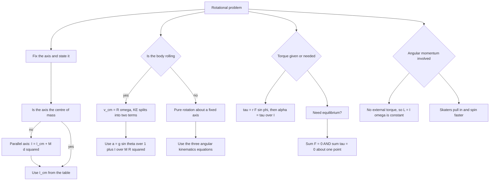

# Rotational Motion

Every particle of a rotating rigid body traces a circle about a common axis, and that single fact generates the whole chapter. Because each particle covers an angle θ in the same time, ω and α are shared by the entire body; because each sits at a different distance, mass enters through the sum Σmᵢrᵢ². That is the moment of inertia, the rotational stand-in for mass, and the reason a hollow ring resists rotation far more than a solid disc of the same size.

### 🟢 Lite — Quick Review (1h–1d)

**Rotational kinematic variables**, each with a linear twin:

| Rotational | Linear | Unit |
|---|---|---|
| Angular displacement θ | displacement s | radian |
| Angular velocity ω = dθ/dt | velocity v | rad s⁻¹ |
| Angular acceleration α = dω/dt | acceleration a | rad s⁻² |
| Moment of inertia I = Σmᵢrᵢ² | mass m | kg m² |
| Torque τ = rF sin φ | force F | N m |
| Angular momentum L = Iω | momentum p = mv | kg m² s⁻¹ |

**Newton's second law in rotation:** τ_net = Iα, and its general form τ = dL/dt.

**Angular kinematics** are identical in form to the linear ones, for constant α only: ω = ω₀ + αt, θ = ω₀t + ½αt², ω² = ω₀² + 2αθ.

**The standard moments of inertia.** Memorise this table; it is used constantly.

| Body | Axis | I |
|---|---|---|
| Thin ring | through centre, ⟂ to plane | MR² |
| Solid disc / solid cylinder | through centre, ⟂ to plane | ½MR² |
| Thin hollow sphere (shell) | through centre | ⅔MR² |
| Solid sphere | through centre | ⅖MR² |
| Uniform rod | through centre, ⟂ to length | ML²/12 |
| Uniform rod | through one end | ML²/3 |

**Two theorems.** Parallel axis: I = I_cm + Md², so no axis-parallel shift can ever reduce I below I_cm. Perpendicular axis (planar lamina only): I_z = I_x + I_y — it does not apply to a 3-D solid.

**Rolling without slipping:** v_cm = Rω, and KE_total = ½Mv²_cm + ½I_cmω². For a solid sphere that is ⅗Mv² + ⅕Mv² = ⅞Mv², not ½Mv². For a disc it is ¾Mv²; for a hoop it is Mv².

**Work and power in rotation:** W = τθ and P = τω, with W_net = ½Iω_f² − ½Iω_i².

### 🟡 Standard — Regular Study (2d–2mo)

**Rigid body and the centre of mass.** A rigid body is one in which the distance between any two particles is constant, so the shape cannot change. When a body rotates freely with no fixed axis, it rotates about its centre of mass, and the centre of mass itself moves as though the body were a point mass at that location. Rotational problems should always be referred to the centre of mass or to a stated fixed axis — a wheel rolling down a ramp rotates about its centre while the centre translates.

**Moment of inertia.** I = Σmᵢrᵢ² measures how mass is distributed relative to the axis. The same body has different I about different axes: a solid cylinder has ½MR² about its symmetry axis and ⅛MR² about a diameter, because the mass is further from the axis in that orientation. The radius of gyration k is defined by I = Mk², so k is a characteristic length of the body and not its actual size — for a solid sphere of radius R, k = R√(⅖) ≈ 0.775R, which is smaller than R and therefore tells you the mass is concentrated well inside the surface.

**Parallel-axis theorem, derived in one line.** Move the axis a distance d parallel to itself. The extra I is Md² because every element's lever arm from the new axis is larger by a component of d, and averaging the squares gives d². Two consequences: a rod about its end is ML²/12 + M(L/2)² = ML²/3, and any parallel shift increases I, so the centre-of-mass axis is the minimum-I axis for a given orientation.

**Perpendicular-axis theorem** states I_x + I_y = I_z for a plane lamina of negligible thickness. It holds for discs and rings because they are laminas, and it is how you get a hoop's I about a diameter: MR² = 2 × ½MR². It does not apply to a solid sphere or cylinder, and a question that applies it there is wrong.

**Torque.** τ = rF sin φ, a vector given by r × F, directed perpendicular to the plane of r and F. Its magnitude is zero when the force acts along the line of action of r, which is why pushing a door anywhere along the line from hinge to handle produces no turning, and why the handle is the useful place to push. Signs matter: assign anticlockwise positive and clockwise negative, and keep that convention for the whole problem.

**Rotational equilibrium** needs two conditions, not one: ΣF = 0 so the body does not translate, and Στ = 0 about any point so it does not rotate. A seesaw problem is almost always this pair. Worked: a uniform plank of length 4 m and mass 20 kg has a 60 kg person standing 0.5 m from one end, with the plank pivoted at its centre and balanced by a boy at distance d from the other end. Torque about the pivot: 60g × 1.5 = mg × d, and the plank's own torque is zero about its centre, so m = 90 kg at d = 1.0 m. Had the plank not been pivoted at its centre, its own weight would have entered the equation — a step students skip.

**Rotational kinematics** are derived exactly as the linear case, by integrating α = dω/dt twice with constant α, and they are valid only under that assumption. Angular velocity in rad s⁻¹ is dimensionless numerically, so ω and a ratio of lengths can be compared without units, which is why v = Rω is a pure number relation.

**Rolling without slipping.** The condition is that the point of contact is instantaneously at rest, giving v_cm = Rω. Slip would mean the contact point has a velocity relative to the ground and friction does work, draining energy. Rolling is not sliding: the kinetic friction for a rolling wheel is a static friction, small and mainly there to enforce the no-slip condition.

**Kinetic energy of a rolling body** is the sum of translational and rotational parts, and the split depends entirely on the shape:

| Body | I_cm | KE = ½Mv² + ½Iω² | As a fraction of Mv² |
|---|---|---|---|
| Solid sphere | ⅖MR² | ⅗Mv² + ⅕Mv² | ⅞ Mv² |
| Solid disc / cylinder | ½MR² | ¾Mv² | ¾ Mv² |
| Hoop / ring | MR² | Mv² | Mv² |

This table answers a standard question: for the same M and R rolling down the same incline, a solid sphere reaches the bottom fastest, then the disc, then the hoop. A hoop also needs the greatest torque to start rolling, for the same reason.

**Worked example — a cylinder rolling down an incline.** A solid cylinder of M = 4 kg, R = 0.2 m rolls without slipping from rest down a 3 m ramp inclined at 30°. Drop in height is h = 3 sin 30° = 1.5 m. Energy: Mgh = ½Mv² + ½Iω² with I = ½MR² and ω = v/R, so Mgh = ½Mv² + ¼Mv² = ¾Mv². Therefore v = √(4gh/3) = √(4 × 9.8 × 1.5/3) = √19.6 = 4.43 m s⁻¹. Newton's route: a = g sin θ/(1 + I/MR²) = (9.8 × 0.5)/(1 + 0.5) = 4.9/1.5 = 3.27 m s⁻², and v = √(2as) = √(2 × 3.27 × 3) = √19.6 = 4.43 m s⁻¹. Two independent routes, same answer — that agreement is the check that the rolling condition has been applied correctly.

**Angular momentum.** L = Iω for a rigid body about a fixed axis, and L = r × p for a single particle. If the net external torque is zero, L is conserved in both magnitude and direction. The spinning skater pulling in her arms is the standard demonstration: I falls as the mass moves inward, so ω must rise by the same factor to keep L fixed, and she speeds up without any external torque. Extending her arms does the reverse. The same conservation fixes the direction of a gyroscope's axis.

### 🔴 Extended — Deep Study (3mo+)

**Angular impulse.** J = ∫τ dt = ΔL, the exact rotational mirror of the linear impulse–momentum theorem. It is the right tool when a torque acts over a known short time rather than at a known angle — a bat striking a ball, a car wheel locking under braking, a diver entering the water. Because it is an impulse, the detailed history of τ during the contact does not matter, only its integral.

**Torque as the rotational equivalent of force — what the analogy does and does not buy.** The map is exact: m ↔ I, a ↔ α, F ↔ τ, p ↔ L, W = Fs ↔ W = τθ, F = ma ↔ τ = Iα, and the impulse–momentum pair. The one place it breaks is in the units of W = τθ: since θ is a pure number, work done by torque is in N m, which is joules, exactly as it should be. A second break is that I depends on the axis while m does not, so "the mass of the body" is unambiguous but "the moment of inertia of the body" is not — the axis must always be stated.

**Pulley with mass.** When a string passes over a pulley of radius R and moment of inertia I rather than an ideal massless one, the tensions on the two sides are unequal. For two hanging masses m₁ and m₂ with m₂ heavier: m₂g − T₂ = m₂a, T₁ − m₁g = m₁a, and for the pulley (T₂ − T₁)R = Iα = Ia/R. Adding the three gives (m₂ − m₁)g − Ia/R² = (m₁ + m₂)a, so a = (m₂ − m₁)g/(m₁ + m₂ + I/R²). A solid disc pulley of mass M_p has I/R² = M_p/2, so a = (m₂ − m₁)g/(m₁ + m₂ + M_p/2). Recognise the pattern: the pulley's rotational inertia acts exactly like an extra mass, and the massless-pulley answer is the special case that drops.

**Angular momentum of a rolling body and the "which quantity is conserved" question.** For a body rolling without slipping down an incline, mechanical energy is conserved and momentum is not, because the surface exerts a friction force. That contrast is exactly what the questions test. For a wheel of radius R rolling with v_cm, the total angular momentum about the contact point is L = I_cm ω + MRv_cm, and since v_cm = Rω this becomes (I_cm + MR²)ω. The contact point is instantaneously at rest, so it is the most convenient origin — a genuinely useful trick for instantaneous-centre problems.

**Rotation about a fixed axis through a point not the centre of mass.** The body then also translates, and the two motions superpose. The total kinetic energy is ½Mv²_cm + ½I_cmω², and the acceleration of the centre of mass comes from the net force as usual while the angular acceleration comes from the torque about the centre of mass. Keeping these two equations separate is what makes such problems tractable.

**Precession of a gyroscope.** A torque τ perpendicular to L changes the direction of L but hardly its magnitude, so the axis sweeps out a cone. The precession rate is Ω = τ/L = Mgr/(Iω), with r the distance from the pivot to the centre of mass. The key insight is that gravity is a large torque acting for a long time, and a gyroscope with a large L resists direction change; that is why a gyroscope can balance on a point, and why the same object topples when spun slowly.

**Energy in rotation.** KE = ½Iω², and for a body rolling without slipping this equals ½Mv²_cm(1 + k²/R²), where k is the radius of gyration. The factor (1 + k²/R²) is dimensionless and is what distinguishes a hoop (2) from a sphere (1 + ⅖ = 1.4). This single expression answers comparison questions, and it is worth deriving once so you never have to look up the table under pressure.

**The distinction between I and m in an energy sum.** Translational KE uses the total mass M and the speed of the centre of mass; rotational KE uses I_cm about the centre of mass and ω. Adding "½mv² + ½Iω²" where the first ½mv² uses the body's speed at some other point double-counts. A common exam trap is to use v = Rω for the translational term as well, which gives an answer too large by exactly the rotational share.

**Common wrong pairs, and why they are wrong.** L = mωr applies to a single particle, not a rigid body; for a rigid body it is Iω. The perpendicular-axis theorem applies to laminas only. Forgetting the ½ in ½Iω². Writing KE_rot as ½Iωr instead of ½Iω². Treating I as though it were a scalar mass when adding rotational and translational energies without converting ω to v. Each of these is a plausible-looking line that produces a clean but incorrect number.

**A worked comparison — three shapes down one incline.** Identical mass M and radius R rolling from rest down a ramp of height h: sphere reaches v = √(2gh/1.4) = 1.195√(2gh); disc reaches v = √(2gh/1.5) = 1.155√(2gh); hoop reaches v = √(2gh/2) = 0.707√(2gh). The sphere is fastest, and the hoop is dramatically slower — half the simple free-fall speed, because half its energy is going into turning rather than moving. Mass and radius cancel entirely, so the answer depends only on shape. That cancellation is worth stating explicitly, because a question giving large masses is testing whether you notice they do not matter.

### 🧠 Memory Anchors

- **"Radian is dimensionless, so v = Rω is a pure number."** That is why the ratio needs no units.
- **"Torque about the CM, force balance for translation."** Two equations, two different jobs.
- **"The CM axis gives the smallest I."** Every parallel shift adds Md², never subtracts.
- **"Perpendicular axis is for laminas only."** A solid sphere does not obey I_z = I_x + I_y.
- **"Push a door at the handle, not the hinge."** τ = rF sin φ is zero when sin φ = 0.
- **"Rolling is static friction, not kinetic."** A rolling wheel's contact point is at rest.
- **"½Mv²_cm plus ½I_cmω², in that order."** Translation uses M, rotation uses I_cm. Never swap.
- **"Shape decides the speed, not mass."** Sphere > disc > hoop, always, for the same M and R.
- **Flashcard Q&A:**
  - *I of a rod about its end?* → ML²/3, from ML²/12 + M(L/2)².
  - *I of a hoop about a diameter?* → ½MR², from I_z = 2I_diameter.
  - *Disc pulley between two masses — effective extra mass?* → M_p/2, because I/R² = M_p/2.
  - *Radius of gyration of a solid sphere?* → R√(2/5) ≈ 0.775R.
  - *A skater's ω doubles; what happens to I?* → Halves, since L = Iω is conserved.
  - *KE of a rolling solid sphere?* → 7/8 Mv².
  - *Work done by a constant torque?* → τθ.
  - *What is conserved with zero net external torque?* → Angular momentum, magnitude and direction.
  - *Torque of a force along the line of r?* → Zero, sin φ = 0.

### 🎯 Exam Traps & Error Log

1. **Writing L = mωr for a rigid body.** That is the single-particle form. For a rigid body about a fixed axis, L = Iω, and the two agree only in the limit of a point mass.
2. **Applying the perpendicular-axis theorem to a solid sphere or cylinder.** It is a statement about plane laminas; using it on a 3-D body gives a wrong answer with no warning.
3. **Forgetting the square in ½Iω²,** or writing ½Iωr. Rotational energy is ½Iω², exactly as translational is ½mv².
4. **Using v = Rω in the translational term.** Then the kinetic energy double-counts the rotation and comes out too large by ½Iω².
5. **Applying the angular kinematics equations with non-constant α.** They require constant α, exactly as the linear equations do.
6. **Taking moments about the wrong point,** or mixing clockwise and anticlockwise signs in the same equation. A cleaner habit is to take moments about the pivot so that the unknown pivot reaction drops out.
7. **Forgetting that equilibrium needs ΣF = 0 as well as Στ = 0.** A body can be in torque balance and still shoot off translationally.
8. **Assuming a massive pulley has equal tensions on both sides.** Equal only for a massless, frictionless pulley; the difference is what accelerates it.
9. **Claiming energy is conserved for a rolling body on a rough surface while ignoring friction.** For rolling without slipping on a level surface the mechanical energy *is* conserved, but on an incline the static friction does no net work — say so explicitly rather than assuming.
10. **Confusing the radius of gyration with the radius of the body.** k is a characteristic length defined by I = Mk² and is smaller than R for the standard shapes.
11. **Saying a rolling body has no friction at all.** It needs static friction to enforce the no-slip condition; it is sliding friction that is absent.
12. **Comparing moments of inertia of two bodies without fixing the axes.** I is meaningless without an axis, and a hoop's MR² about its centre is larger than a solid sphere's ⅖MR², but about a diameter the hoop gives ½MR² and the comparison flips for other shapes.

### 🧪 Self-Test — 8 Questions with Worked Answers

Attempt each on paper first. Every one uses a form this chapter actually uses.

1. **A uniform rod of mass $M$ and length $L$ rotates about an axis through one end. Find $I$, and compare it with $I$ about the centre.**
   About the end, I_end = ML²/3. About the centre, I_cm = ML²/12. The ratio is exactly 4, and the parallel-axis theorem reproduces it: ML²/12 + M(L/2)² = ML²/12 + ML²/4 = ML²/3. The centre-of-mass axis always gives the smaller value, and a rod end-on is the worst case — which is why a long rod pivoted at its end is so hard to control.
2. **A solid disc and a hoop of the same mass $M$ and radius $R$ start from rest and roll down the same incline. Which arrives first, and by how much?**
   Energy: Mgh = ½Mv²(1 + I/MR²). Disc: 1 + ½ = 1.5, so v_disc = √(2gh/1.5). Hoop: 1 + 1 = 2, so v_hoop = √(2gh/2). Ratio v_disc/v_hoop = √(2/1.5) = 1.155. The disc is about 15% faster. Mass and radius cancel, so the answer depends only on shape — and the reason is that the hoop puts twice as much of its energy into rotation and half as much into moving.
3. **A pulley of mass $M_p$ and radius $R$ is a uniform disc, and masses $m_1$ and $m_2$ hang from a string over it. Find the acceleration. Take $g = 10$, $m_1 = 2$ kg, $m_2 = 3$ kg, $M_p = 2$ kg.**
   For a disc, I/R² = ½M_p = 1 kg. So a = (m₂ − m₁)g/(m₁ + m₂ + I/R²) = (3 − 2)(10)/(2 + 3 + 1) = 10/6 = 1.67 m s⁻². Compare with the ideal massless pulley: 10/5 = 2 m s⁻². The massive pulley slows the system by exactly its effective mass. T₁ = m₁(g + a) = 2(11.67) = 23.3 N and T₂ = m₂(g − a) = 3(8.33) = 25 N, and the difference of 1.67 N times R gives the torque that spins up the pulley — a good check that the two tensions are genuinely unequal.
4. **A solid sphere of radius $R$ rolls without slipping. Write its total kinetic energy in terms of $Mv^2$ and find the ratio to a sliding block of the same speed.**
   KE = ½Mv² + ½(⅖MR²)(v/R)² = ½Mv² + ⅕Mv² = ⅗Mv² + ⅕Mv² = ⅞Mv². A sliding block has ½Mv², so the sphere carries ⅞/½ = 1.75 times the energy of the sliding block at the same speed, because ⅖ of it is rotational. This is exactly why a rolling ball is harder to bring to a halt for a given deceleration, and why the ratio for a rolling sphere is 7/5 — a standard multiple-choice number.
5. **A skater of moment of inertia $I_1$ spinning at $\omega_1$ pulls her arms in, reducing her $I$ to $I_2 = I_1/4$. Find the new angular velocity and explain the energy change.**
   No external torque acts on her, so L is conserved: I₁ω₁ = I₂ω₂, giving ω₂ = (I₁/I₂)ω₁ = 4ω₁. She spins four times as fast. Her rotational kinetic energy goes from ½I₁ω₁² to ½I₂ω₂² = ½(I₁/4)(4ω₁)² = 2I₁ω₁², i.e. it quadruples. The extra energy comes from the work her muscles do in pulling her arms in against the centrifugal tendency — angular momentum is conserved, energy is not, and the gap is muscle work. This is a favourite question precisely because the two conservation laws differ.
6. **A torque of 5 N m acts on a wheel of moment of inertia 2 kg m² that is initially at rest. Find the angular acceleration, and the angular velocity after 4 s and the angle turned through.**
   α = τ/I = 5/2 = 2.5 rad s⁻². Since α is constant, ω = αt = 2.5 × 4 = 10 rad s⁻¹. θ = ½αt² = ½(2.5)(16) = 20 rad. Cross-check with ω² = 2αθ: 100 = 2(2.5)(20) = 100. All three angular kinematics equations agree, exactly as the linear ones would — that formal identity is the point of the analogy.
7. **A uniform beam of length 6 m and mass 60 kg is supported at one end. A 40 kg person stands 2 m from the other end. Where is the centre of mass, and where must a pivot be placed for the beam alone to balance?**
   Take the supported end as the origin. The beam's CM is at 3 m, the person's at 4 m. Combined CM = (60 × 3 + 40 × 4)/(60 + 40) = (180 + 160)/100 = 3.4 m from the supported end, that is 2.6 m from the far end. To balance the beam plus person with a single pivot, the pivot must be at the combined CM, 3.4 m from that end. The key step is including both contributions; a beam balanced alone needs its pivot at 3 m, and that is a different answer, which is why the "alone" and "with a person" versions of this question are both common.
8. **A wheel of radius 0.3 m and moment of inertia 0.6 kg m² has a tangential force of 4 N applied at its rim. Find the angular acceleration, the torque needed for a 2 m/s² linear acceleration of the centre of mass for a 20 kg wheel, and the efficiency of using the force.**
   First: τ = 4 × 0.3 = 1.2 N m, α = 1.2/0.6 = 2 rad s⁻². Second: the force for a linear acceleration is F = Ma = 20 × 2 = 40 N, and the torque needed at the rim to achieve it is τ = 40 × 0.3 = 12 N m, giving α = 12/0.6 = 20 rad s⁻². Third: the ratio of translational to rotational work per unit angle is F·R/τ = 40/4 = 10, so a force of 40 N does ten times the useful work of a 4 N force. Efficiency here is not a heat-engine efficiency but a mechanical advantage of 10 — the wheel trades force for distance, and the gain is exactly R. Using too little force wastes the torque; that is the whole point of a handle.

### 💡 Pro Tips

1. **State the axis before touching any formula.** Moment of inertia is undefined without one, and about half the errors in this topic are axis errors.
2. **Memorise the six standard I values as one block** — MR², ½MR², ⅔MR², ⅖MR², ML²/12, ML²/3 — in the order ring, disc, shell, sphere, rod centre, rod end. Retrieval is faster when the order matches the table.
3. **Use the parallel-axis theorem instead of memorising a second table.** Six standard values plus one theorem covers every exam shape.
4. **Take moments about the pivot** in a beam or lever problem. The unknown reaction force at the pivot then drops out of the equation and you avoid solving for it.
5. **In a rolling problem, use energy first.** Mgh = ½Mv²(1 + I/MR²) is one line and avoids solving for α and then finding v.
6. **Check the two rolling routes against each other** once per revision session: a = g sin θ/(1 + I/MR²) and v = √(2gh/(1 + I/MR²)). Agreement means the rolling condition is in.
7. **For the massive-pulley problem, remember the effective extra mass is I/R².** For a disc that is M_p/2, for a hoop M_p — and the massless case is the limit.
8. **Do the units check on every rotational numerical:** torque in N m, I in kg m², α in rad s⁻², L in kg m² s⁻¹. Dimensional slips in this chapter are common and obvious once you look.
9. **Separate translation and rotation explicitly in your solution** — ½Mv²_cm on one line, ½I_cmω² on the next. Writing them together is how the v = Rω double-counting slips in.
10. **Learn the one comparison and its reason:** a solid sphere outruns a disc, which outruns a hoop, because a larger share of a hoop's energy goes into spinning. Once you can say that sentence, three separate questions are answered.

---

## Continue your study

- **[View this topic in your CUET UG roadmap](/roadmap/?exam=cuet&duration=1mo)** — see where "Rotational Motion" fits in your personalised plan
- **[Build a quick revision plan](/roadmap/?exam=cuet&duration=1d)** — 1-day sprint covering highest-weight topics
- **[CUET UG exam overview](/exams/cuet/)** — pattern, eligibility, and syllabus
- **[All Physics notes](/notes/cuet/physics/)** — browse sibling topics in this subject
