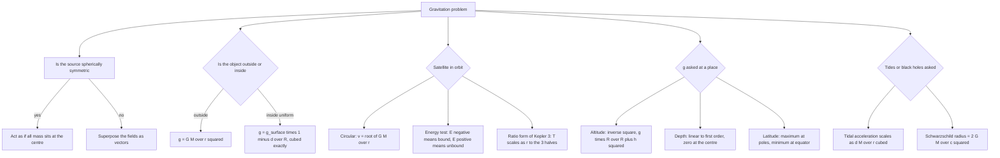

# Gravitation

Gravitation is the only force in the syllabus that is universal: it acts between every pair of masses, it is always attractive, and it never switches off. Everything else in this chapter — fields, potential, orbits, escape speed, tides — is a consequence of F = Gm₁m₂/r² plus Newton's second law. Learn that one formula well and the rest is bookkeeping.

### 🟢 Lite — Quick Review (1h–1d)

**Newton's law of universal gravitation.** F = Gm₁m₂/r², with G = 6.673 × 10⁻¹¹ N m² kg⁻² measured by Cavendish in 1798 with a torsion balance. F is along the line joining the two masses, directed inward on each, and equal and opposite.

**Gravitational field** g = F/m = GM/r², directed toward the source mass. It is a vector and obeys superposition: for several masses, add the individual fields as vectors.

**Gravitational potential** V = −GM/r, in J kg⁻¹. It is the work done per unit mass to bring a test mass from infinity to that point. The negative sign says gravity does positive work as things fall together, so the potential energy decreases.

**Potential energy** U = −Gm₁m₂/r, zero defined at infinite separation.

**Circular orbit around a mass M:**

- Orbital speed v = √(GM/r) = √(g r) measured from the centre
- Period T = 2π√(r³/GM)
- Kepler 3: T² = 4π²r³/(GM), so T² ∝ r³ for orbits about the same body
- Near Earth's surface: v ≈ 7.9 km s⁻¹, escape velocity v_e = √(2GM/r) = √(2gr) ≈ 11.2 km s⁻¹
- **v_e = √2 × v_orbital**, for any circular orbit about the same body

**Variation of g:**

- Height h above the surface: g' = g(R/(R+h))²
- Depth d below the surface: g' = g(1 − d/R), linear
- g is zero at the centre of the Earth and maximum at the poles

**Kepler's three laws:**

1. Planets move in ellipses with the Sun at one focus.
2. The line joining the Sun and a planet sweeps out equal areas in equal times — this is angular momentum conservation, L = mrv⊥ = constant.
3. T² ∝ a³ for all planets orbiting the same Sun.

### 🟡 Standard — Regular Study (2d–2mo)

**The force law and what it does not say.** F depends on the masses and the distance between their centres, not on what is between them — a mountain in between changes nothing in this law, and neither does a screen. The force is attractive because the sign is negative in the potential expression; there is no separate "negative G". Two important corollaries: the force on a body due to a spherically symmetric body is the same as if all its mass were concentrated at the centre (this is the shell theorem, and it is why Earth's g is GM/R² at the surface), and inside a uniform sphere only the enclosed mass contributes.

**Field, potential, and why both exist.** Field g = F/m answers "what force would a unit mass feel here?"; potential V answers "what work per unit mass was done in coming from infinity?" The two are related by V = −∫g dr, so for an inverse-square field V = −GM/r. Field lines point inward and get denser as you approach; equipotential surfaces are spheres for a point mass, and the field is always perpendicular to them. Where the field is zero the potential is constant but not necessarily zero — an important distinction that appears in questions about the interior of a planet.

**Variation of g with altitude.** Taking g at the surface and height h above it: g' = g(R/(R+h))² = g(1 + h/R)⁻². The square is the reason g falls off fast, and the useful approximation for h ≪ R is g' ≈ g(1 − 2h/R). Worked: at a height equal to one Earth radius, g' = g/4. A satellite at that altitude is not weightless at all; it is in free fall, and its "weightlessness" comes from falling rather than from being far away.

**Variation of g with depth.** Inside a uniform Earth, the mass outside radius R − d exerts no net force, and only the enclosed mass M′ = M(R − d)³/R³ counts. So g' = g(R − d)³/R³ = g(1 − d/R)³. Note the frequently quoted linear law g' = g(1 − d/R) is the *first-order approximation* valid for d ≪ R, used in numericals that ask for an approximate value; the exact cube is the physically correct result. At the centre d = R and g = 0.

**Why g varies with latitude.** Two separate effects. Earth's rotation makes a body at the equator move in a circle of radius R, needing an inward acceleration ω²R supplied by the ground, which reduces the effective g by ω²R — about 0.034 m s⁻², small but real. And Earth is an oblate spheroid, flattened at the poles, so the distance from the centre to the surface is larger at the equator. Both effects make g' minimum at the equator and maximum at the poles, and the difference is about 0.5%.

**Orbits from Newton's law — the whole derivation in five lines.** For a satellite of mass m in a circular orbit of radius r, gravity supplies the centripetal force: GMm/r² = mv²/r, so v = √(GM/r). Dividing both sides by r gives ω² = GM/r³, so T = 2π√(r³/GM). Both results drop out of the same equation, which is why they are never independent questions in substance.

**Kepler's second law from angular momentum.** The torque about the Sun is zero, so L = mrv⊥ is constant. In polar coordinates L = mr²(dθ/dt), and the areal velocity is dA/dt = ½r²dθ/dt = L/2m — constant. So the planet sweeps equal areas in equal times, fastest at perihelion where r is smallest and slowest at aphelion. This is a direct application of the Rotational Motion chapter, and stating the link makes the law memorable.

**Escape velocity.** Setting the total energy to zero for a body projected from the surface: ½mv² − GMm/R = 0, so v_e = √(2GM/R) = √(2gR). At Earth's surface with g = 9.8 and R = 6.4 × 10⁶ m, v_e = √(2 × 9.8 × 6.4 × 10⁶) = √(1.254 × 10⁸) = 1.12 × 10⁴ m s⁻¹ = 11.2 km s⁻¹. Escape velocity scales as √M and as 1/√r, so a planet twice as massive with the same radius has an escape speed √2 times larger. Escape velocity is also independent of the mass of the escaping body, which is the point of the square root in the formula.

**Worked example — orbital period.** A satellite orbits at a height of 6400 km above the Earth's surface, so its orbital radius is r = R + h = 6400 + 6400 = 12 800 km = 1.28 × 10⁷ m. With GM = 3.986 × 10¹⁴ m³ s⁻²: r³ = (1.28 × 10⁷)³ = 2.097 × 10²¹ m³. r³/GM = 2.097 × 10²¹/3.986 × 10¹⁴ = 5.26 × 10⁶ s². √ gives 2294 s, and T = 2π × 2294 = 14 415 s ≈ 240 minutes = 4.0 hours. A useful cross-check: the period grows as r^(3/2), and doubling the orbital radius from 6400 km to 12 800 km multiplies the period by 2^(3/2) = 2.83 relative to a 85-minute low orbit, and 85 × 2.83 ≈ 240 minutes. That single proportionality solves most orbital-period questions without a calculator.

**Kepler's third law and its two forms.** T² = 4π²r³/(GM) for orbits about one central body. Dividing the equations for two satellites about the same body, T₁²/T₂² = r₁³/r₂³, so T₁/T₂ = (r₁/r₂)^{3/2}. This ratio form is the one that appears in multiple-choice questions, and the exponent 3/2 is the whole content of the question.

**Energy of a satellite.** For a circular orbit, KE = ½mv² = ½m(GM/r) = GMm/2r, and U = −GMm/r. Total E = −GMm/2r, so E = −½KE and E = U/2. Two conclusions: a bound orbit has negative total energy, and a bound satellite must be supplied energy to escape, which is why the energy needed to lift a satellite from a lower orbit to a higher one is positive even though gravity pulls it up part of the way.

### 🔴 Extended — Deep Study (3mo+)

**Bound and unbound orbits — the energy test.** A trajectory is bound if E = KE + U is negative, unbound if it is positive. For a body at distance r with speed v, E = ½mv² − GMm/r is negative when v < v_escape at that radius. A parabolic trajectory is the exact boundary, E = 0, v = v_e. The same statement covers the three classical cases: a circular orbit has v = v_o < v_e and a negative E; an ellipse has E between −GMm/(2r_max) and 0; a hyperbola has E > 0. This one test answers a family of questions that otherwise look unrelated.

**Where geostationary satellites sit.** Three conditions: the orbital plane must lie in the equatorial plane, the orbit must be circular, and the period must equal one sidereal day, 23 h 56 min 4 s. The orbital radius that satisfies T = 2π√(r³/GM) is about 42 200 km from the centre, i.e. roughly 35 800 km above the surface. Three consequences worth stating: it must be above the equator and nowhere else, because an orbit in another plane would have to sweep a point that never crosses the same longitude twice a day; its speed is about 3.07 km s⁻¹; and its angular speed equals Earth's, which is why it appears fixed in the sky. A satellite in the right plane but at the wrong altitude drifts — east for lower, west for higher.

**Tidal forces.** The differential (tidal) acceleration across a body of size d due to a mass M at distance r scales as GdM/r³, not GM/r². The cubic in the denominator is what makes tides small for the Sun and large for the Moon. Numerically, the lunar tide is about 2.2 times the solar tide, which is why the Moon controls the tides despite the Sun's far greater mass. Spring tides occur at new and full moon, when the two pulls reinforce; neap tides occur at the quarter moons, when the Sun's pull is at right angles to the Moon's and the range is smallest. Tides are not caused by the Moon "pulling the oceans harder than it pulls the solid Earth" — the pull is essentially the same; the ocean is deformable and the solid Earth is not.

**Gravitational binding energy.** For a uniform sphere, the energy needed to disperse it entirely to infinity is 3GM²/5R. For Earth, that is about 2.3 × 10³² J. This is the energy released in accretion, in the merging of black holes, and in the formation of a supernova. It is also why a body in a highly eccentric orbit has a much more negative binding energy at perihelion, and why comets heat up as they fall in.

**The equivalence of gravitational and inertial mass.** Every experiment finds m_inertial = m_gravitational to about one part in 10¹². Newton did not need this, but Einstein did: the equivalence of the two masses is the content of the equivalence principle, which says gravity can be removed at a point by choosing a freely falling frame, and which is the foundation of general relativity. In a freely falling lift, both masses fall identically and the occupant feels weightless — the statement that occupied the earlier chapters as a pseudo-force trick is the same physics seen differently.

**The Schwarzschild radius.** R_s = 2GM/c² is the radius inside which the escape velocity would exceed the speed of light. For Earth, M = 6 × 10²⁴ kg gives R_s = 2(6.67 × 10⁻¹¹)(6 × 10²⁴)/(3 × 10⁸)² = 2(4.0 × 10¹⁴)/9 × 10¹⁶ = 8.9 × 10⁻³ m, about 9 mm. For the Sun it is about 3 km. Two correct statements follow: Earth would have to be compressed to roughly 9 mm radius to become a black hole, and the Sun's 3 km Schwarzschild radius is about 0.002% of its radius, which is why ordinary stars are not black holes despite being massive.

**Gravitational slingshot.** In the planet's own frame the spacecraft's incoming and outgoing speeds are equal, and the direction changes. Transforming back to the Sun's frame adds the planet's orbital velocity vector, and the craft leaves faster than it arrived. The speed gain is 2v_p sin(α/2), where v_p is the planet's orbital speed and α the angle between the incoming and outgoing directions measured in the planet's frame. A flyby is therefore a transfer of orbital energy from the planet, which loses a minute amount of it — conservation holds exactly.

**Kepler's laws from Newton's law.** The first law follows because an inverse-square central force produces conic sections, with the centre of force at a focus of any ellipse. The third law follows directly from T² = 4π²r³/GM. The second is angular momentum conservation, as above. Kepler worked these out from Tycho Brahe's observations about eighty years before Newton supplied the mechanism, which is a useful reminder that the laws are consequences, not assumptions.

**Field inside a ring or a shell — the counter-intuitive case.** At the centre of a thin ring, by symmetry the fields from opposite elements cancel exactly, so the field is zero even though the potential is not. This is the standard example of a point where the field vanishes but the potential is finite, and it is the cleanest demonstration that g = 0 and V = 0 are not the same statement.

### 🧠 Memory Anchors

- **"Inverse square in, inverse square out."** F ∝ 1/r² and g ∝ 1/r² for a spherically symmetric source.
- **"Potential is negative, zero at infinity."** U = −Gm₁m₂/r, and the minus is the sign of attraction.
- **"v_e = √2 v_o, and mass cancels."** Escape velocity does not depend on the escaping mass.
- **"T² ∝ r³, so T ∝ r^{3/2}."** The ratio form answers most orbital questions.
- **"Area swept in equal times, because L is conserved."** Kepler's second law is Rotational Motion wearing a hat.
- **"Tides go as 1/r³."** Not 1/r² — that cubic is the entire reason the Moon wins.
- **"g is zero at the centre, maximum at the poles."** Rotation and oblateness both favour the poles.
- **Flashcard Q&A:**
  - *v at the surface for a circular orbit?* → √(gR) ≈ 7.9 km/s.
  - *Escape speed from the Moon?* → √(2GM_moon/R_moon) ≈ 2.4 km/s, from the lower mass and radius.
  - *Total energy of a circular orbit?* → −GMm/2r, exactly half the potential energy.
  - *Why is a satellite weightless?* → It and its contents are both in free fall, not far from Earth.
  - *A body at double the orbital radius?* → Period × 2^{3/2} ≈ 2.83, speed ÷ √2.
  - *Field at the centre of a ring?* → zero by symmetry, while the potential is finite.
  - *Schwarzschild radius of Earth?* → about 9 mm.
  - *Equilibrium of two masses — what does it test?* → That gravitational and inertial mass are equal to 1 part in 10¹².

### 🎯 Exam Traps & Error Log

1. **Writing g' = g(R + h)²/R instead of g(R/(R + h))².** The field falls off with distance; the ratio goes inside the power. Doubling the height gives g/4, never 4g.
2. **Treating the depth relation as exactly linear.** g = g(1 − d/R) is the first-order approximation; the exact result for a uniform Earth is g(1 − d/R)³. Use the linear form only when the question asks for an approximation at shallow depth.
3. **Using the total mass of the Earth when the body is inside it.** Only the enclosed mass contributes, because the outer shells cancel by symmetry.
4. **Confusing the orbital radius r with the height h.** In T² ∝ r³, r is measured from the centre of the Earth, not from the surface. A satellite at height R has orbital radius 2R and period 2.83 times the surface-orbit period.
5. **Forgetting that gravitational potential is negative** and reporting a positive magnitude for the potential energy of an attracting pair.
6. **Writing E = −KE instead of E = −½KE for a circular orbit.** The total energy is minus *half* the kinetic energy, because KE = GMm/2r and U = −GMm/r = −2KE.
7. **Saying a satellite is weightless because it is far from Earth.** It is weightless because it is in free fall; an astronaut on the far side of the Moon within a few hundred kilometres would still feel substantial gravity.
8. **Applying the 1/r² law to tides.** Tidal acceleration falls as 1/r³, and that is what makes the lunar tide roughly twice the solar one despite the Sun's much larger mass.
9. **Assuming a geostationary satellite can sit anywhere above the Earth.** It must be in the equatorial plane with the right period, so its position is unique in radius and in latitude.
10. **Conflating g = 0 with V = 0.** At the centre of a ring the field vanishes by symmetry while the potential is a finite negative number.
11. **Using G where GM is needed,** or forgetting that GM = 3.986 × 10¹⁴ m³ s⁻² for Earth. G is universal; the combination is what appears in orbital formulae.
12. **Assuming escape velocity depends on the mass of the escaping object.** It does not — the mass cancels, which is why the formula has no m in it.

### 🧪 Self-Test — 8 Questions with Worked Answers

Attempt each on paper before reading the solution. Each uses a form this chapter actually uses.

1. **Find the acceleration due to gravity at a height equal to the Earth's radius, and at a depth equal to the Earth's radius.**
   Altitude: g' = g(R/(R + h))² with h = R, so g' = g(R/2R)² = g/4 = 2.45 m s⁻². Depth: with d = R, the point is the centre, and only the enclosed mass counts, so g' = 0. The two answers are not symmetric, and the difference is the concept being tested: outside, the field falls as 1/r², but inside, the mass enclosed shrinks as the cube of the remaining radius and cancels it.
2. **A satellite orbits Earth at a height of 3200 km. Find its orbital speed and period. Take $R = 6.4 \times 10^6$ m and $GM = 3.986 \times 10^{14}$ m³ s⁻².**
   Orbital radius r = 6.4 × 10⁶ + 3.2 × 10⁶ = 9.6 × 10⁶ m. v = √(GM/r) = √(3.986 × 10¹⁴/9.6 × 10⁶) = √(4.15 × 10⁷) = 6444 m s⁻¹ ≈ 6.44 km s⁻¹. T = 2πr/v = 2π(9.6 × 10⁶)/6444 = 6.03 × 10⁷/6444 = 9360 s ≈ 156 minutes. Note the speed is *lower* than the 7.9 km s⁻¹ of a near-surface orbit, because this satellite is farther out and gravity is weaker there.
3. **Show that a body in a circular orbit has total energy $E = -\tfrac{1}{2}KE$, and find the energy needed to shift it from radius $r$ to $2r$.**
   v = √(GM/r) gives KE = ½m(GM/r) = GMm/2r. U = −GMm/r. So E = GMm/2r − GMm/r = −GMm/2r, and KE = GMm/2r, so E = −KE/2. Shifting to 2r: E_i = −GMm/2r, E_f = −GMm/4r. ΔE = −GMm/4r + GMm/2r = +GMm/4r. The change is positive, so work must be supplied, even though the outward half of the path is helped by gravity — the kinetic energy falls faster than the potential energy rises. The standard textbook statement "energy required = GMm/4r" follows directly.
4. **A body is projected from the Earth's surface with speed 12 km s⁻¹, vertically upward. Will it return? Take $g = 9.8$ m s⁻² and $R = 6.4 \times 10^6$ m.**
   Escape velocity v_e = √(2gR) = √(2 × 9.8 × 6.4 × 10⁶) = √(1.254 × 10⁸) = 11.2 km s⁻¹. Since 12 km s⁻¹ > 11.2 km s⁻¹, the body escapes and never returns, even though it slows down as it rises. A finite turning point would require v² < 2gR, since the turning condition is ½mv² = GMm/r_max with r_max finite. Here v² = 1.44 × 10⁸ already exceeds 2gR = 1.254 × 10⁸, so there is no solution for r_max — the body coasts to infinity with its speed falling to zero only at infinity. A launch speed below 11.2 km s⁻¹ is bound, and at 11.2 km s⁻¹ exactly the trajectory is a parabola.
5. **Two satellites A and B orbit the same planet with orbital radii in the ratio 1 : 2. Compare their periods and speeds.**
   Kepler 3: T ∝ r^{3/2}, so T_B/T_A = 2^{3/2} = 2.83. Speed: v = √(GM/r) ∝ 1/√r, so v_B/v_A = 1/√2 = 0.707. The outer satellite is 2.83 times slower in period and 1.41 times slower in speed. The exponents 3/2 and −1/2 are worth deriving once, since every version of this question is the same comparison with different numbers.
6. **Find the gravitational field at the centre of a uniform thin ring of mass $M$ and radius $R$, and comment on the potential there.**
   By symmetry, every element of the ring has an element diametrically opposite it producing a field of equal magnitude in the opposite direction. All pairs cancel, so g = 0 at the centre. The potential does not cancel, because potential is a scalar: V = −GM/R summed over all elements, a finite negative value. So a body placed at the centre feels no force yet sits in a potential well, and would accelerate as soon as it moved off the exact centre. This is the standard demonstration that g = 0 and V = 0 are different statements.
7. **Compute the binding energy of a uniform sphere of mass $M$ and radius $R$ in terms of $GM^2/R$, and evaluate it for Earth.**
   B = 3GM²/5R. For Earth, M = 6 × 10²⁴ kg, R = 6.4 × 10⁶ m, G = 6.67 × 10⁻¹¹: GM² = 6.67 × 10⁻¹¹ × 3.6 × 10⁴⁹ = 2.4 × 10³⁹, times 3/5 gives 1.44 × 10³⁹, divided by 6.4 × 10⁶ gives 2.25 × 10³² J. This is roughly the energy released by the whole Earth's formation, and the reason a meteorite falling in can deliver megatons. The negative sign on the potential is what makes the *energy required to disperse* positive while the potential energy itself is negative.
8. **A planet has twice the radius of Earth and four times its mass. Find the ratios of surface gravity, escape velocity and orbital velocity for a low circular orbit.**
   g = GM/R², so g'/g = (4/1)(1/2)² = 1. The surface gravity is the same as Earth's. Escape velocity v_e = √(2GM/R) gives v'_e/v_e = √(4 × 1/2) = √2. Low circular orbital speed v = √(GM/R) likewise goes up by √2. The identical g is a standard surprise: doubling the radius while quadrupling the mass leaves the surface field unchanged, and both velocities rise by the same factor √2 because both depend on the same combination GM/R.

### 💡 Pro Tips

1. **Write r as the distance from the centre, every time.** The most common error in orbital problems is confusing orbital radius with height above the surface, and it changes the answer by 2^(3/2).
2. **Use the ratio form of Kepler's third law whenever two orbits are compared.** T₁/T₂ = (r₁/r₂)^{3/2} needs no constants and takes five seconds.
3. **Decide bound or unbound first in any escape or trajectory question.** A single energy comparison, E = ½mv² − GMm/r, settles the whole problem.
4. **Check the "inside or outside" question before applying GM/r².** Inside a spherically symmetric body, only the enclosed mass counts.
5. **Keep g(1 − d/R) labelled as an approximation** and g(1 − d/R)³ as exact, and write which one you used. The approximation is more often what a numerical wants, but you must be able to say why.
6. **Memorise v_e = √(2gR) rather than the GM form,** because g and R are the numbers you are given. Keep the GM form for satellites where g is not available.
7. **For tides, reach for 1/r³ immediately.** Seeing "tide" in the question should trigger the cubic before anything else.
8. **Tie Kepler's second law back to angular momentum in one sentence.** "Zero torque about the Sun, so L is constant, so the areal velocity is constant" is the whole proof and it earns the mark in two lines.
9. **For the geostationary question, answer with the three conditions** — equatorial plane, circular, one sidereal day — and the radius follows. The conditions are the content; the number is arithmetic.
10. **State GM = 3.986 × 10¹⁴ m³ s⁻² for Earth once and use it everywhere.** Orbital numericals with G = 6.67 × 10⁻¹¹ and a mass of 6 × 10²⁴ are slower and lose precision.

---

## Continue your study

- **[View this topic in your CUET UG roadmap](/roadmap/?exam=cuet&duration=1mo)** — see where "Gravitation" fits in your personalised plan
- **[Build a quick revision plan](/roadmap/?exam=cuet&duration=1d)** — 1-day sprint covering highest-weight topics
- **[CUET UG exam overview](/exams/cuet/)** — pattern, eligibility, and syllabus
- **[All Physics notes](/notes/cuet/physics/)** — browse sibling topics in this subject
