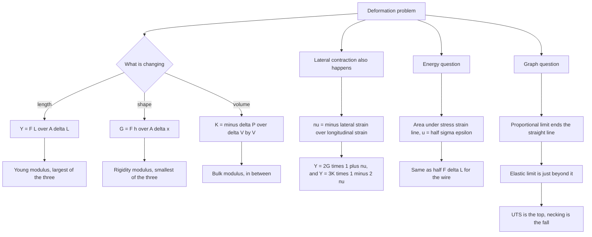

# Mechanical Properties

Stress and strain are the two words that convert "how hard is this being pulled" into numbers. Stress is force per unit area, strain is fractional change in dimension, and Young's modulus is their ratio. Almost every question in this chapter is one line of algebra once you know which of the three moduli the deformation calls for, so the real work is learning to tell a longitudinal deformation from a shear and from a volume change.

### 🟢 Lite — Quick Review (1h–1d)

**Three kinds of stress, three of strain, three moduli:**

| Deformation | Stress | Strain | Modulus | Relation |
|---|---|---|---|---|
| Length change | longitudinal σ = F/A | ε = ΔL/L | Young's modulus Y | Y = F L /(A ΔL) |
| Shape change | shearing τ = F/A | γ = Δx/h | rigidity modulus G | G = τ/γ = F h/(A Δx) |
| Volume change | volumetric ΔP | ΔV/V | bulk modulus K | K = −ΔP/(ΔV/V) |

**Units.** Stress is in pascals, 1 Pa = 1 N m⁻². Every strain is dimensionless. Every modulus is therefore in pascals as well, since it is a stress divided by a dimensionless number. A modulus written in newtons is always wrong.

**Signs.** Bulk modulus K = −ΔP/(ΔV/V) is positive because pressure up (ΔP > 0) and volume down (ΔV < 0) must give a positive result.

**Poisson's ratio** ν = −(lateral strain)/(longitudinal strain), always between 0 and 0.5 for a stable isotropic solid. The minus sign exists because stretching one way always narrows the other two.

**Relations between the moduli:** Y = 2G(1 + ν) and Y = 3K(1 − 2ν). Compressibility is C = 1/K, with units of Pa⁻¹.

**Elastic versus plastic.** Within the elastic limit the body returns exactly to its original shape when the load is removed. Beyond it the deformation stays. A ductile material (copper, aluminium, mild steel) has a long plastic region and can be drawn into a wire; a brittle one (cast iron, glass, ceramics) fractures soon after the elastic limit with almost no warning.

**Energy stored per unit volume** in the elastic region is the area under the stress–strain line, u = ½σε = σ²/(2Y) = Yε²/2. For a wire of volume V = AL, the stored energy is U = ½ F ΔL.

**Typical Young's moduli (Pa):** steel 2.0 × 10¹¹, copper 1.1 × 10¹¹, aluminium 7.0 × 10¹⁰, glass 6 × 10¹⁰, bone 2 × 10¹⁰, rubber about 10⁶. Six orders of magnitude separate steel from rubber, which is why rubber stretches so much under the same load.

### 🟡 Standard — Regular Study (2d–2mo)

**Stress is internal, not applied.** The stress at a point in a body is the internal restoring force per unit area that develops because of an applied load. When a wire is pulled at both ends by equal and opposite forces, the whole wire is in equilibrium and the resultant force on any cut portion is zero, but the internal stress across every cross-section is non-zero and equal to F/A. This is a standard conceptual question: a body in equilibrium can and does carry non-zero internal stress. A body in free fall, by contrast, has no internal stress at all, since nothing is pulling on it and gravity acts on every element equally.

**Longitudinal deformation.** For a wire of length L and area A under a tension F, σ = F/A and ε = ΔL/L, so Y = FL/(AΔL) and ΔL = FL/(AY). Two immediate consequences: the extension is proportional to the load and to the length, and inversely proportional to the area. Doubling the radius quarters the stress and the extension; that factor of four is the one students lose marks on.

**Shear deformation.** Force F applied parallel to a face of area A whose face is a distance h from a fixed face produces a tangential displacement Δx. Then τ = F/A, γ = Δx/h and G = τ/γ = Fh/(AΔx). Shear strain γ is the tangent of a small angle and is dimensionless, so G carries the same units as Y. A twist of a shaft is a shear deformation, which is why the rigidity modulus enters every torsion problem.

**Volume change.** A uniform increase in pressure ΔP changes the volume by ΔV. The volumetric strain is ΔV/V and the bulk modulus is K = −ΔP/(ΔV/V). Compressibility C = 1/K, and the bulk modulus of water is about 2.2 × 10⁹ Pa while that of steel is about 1.6 × 10¹¹ Pa, so water is roughly 70 times easier to compress — which is why sound travels much faster in water than in air. The sign convention is the only subtle part: ΔP and ΔV always have opposite signs, so the explicit minus keeps K positive.

**Poisson's ratio and lateral contraction.** Stretch a rod along its axis and it necks: Δd/d = −ν ΔL/L. Because a solid resists shear, lateral strain is always opposite in sign to longitudinal strain, and ν is positive. The range 0 < ν < 0.5 is a consequence of stability; ν = 0.5 would be an incompressible material, approached by rubber and never reached. Typical metals lie between 0.2 and 0.35, and ν is nearly independent of stress within the elastic range, which is why it is a useful material constant.

**The stress–strain curve, region by region.**

| Region | What happens | Reversible? |
|---|---|---|
| A to B | Proportional limit; stress ∝ strain, Hooke's law valid | yes |
| B to C | Elastic limit reached; still returns to original length | yes |
| C to D | Yield point passed; plastic flow begins | no |
| D to E | Strain hardening; stress rises more slowly to the UTS | no |
| E to F | Necking begins; cross-section shrinks, engineering stress falls | no |
| F | Fracture | no |

Two points are worth extra attention. First, the *proportional limit* is where the straight line ends; the *elastic limit* is slightly beyond it, and everything between them is elastic but not proportional. Conflating the two is a frequent error. Second, the fall after E is an artefact: the stress plotted is engineering stress, force divided by the *original* area. The true stress keeps rising until the final instant because the area is shrinking, which is why necking is dangerous in engineering even though the graph appears to relax.

**Ductile against brittle.** Ductile materials can absorb a lot of energy before breaking and warn you by deforming visibly. Brittle materials have almost no plastic region and fail suddenly. The area under the entire curve measures toughness — how much energy per unit volume is absorbed before failure — and a material can be strong and brittle (cast iron) or ductile and weaker (mild steel). A material must be both strong and tough to be useful in structures.

**Worked example — elongation of a steel wire.** A steel wire of length 2.0 m and cross-sectional area 4.0 × 10⁻⁶ m² is stretched by a 200 N load, with Y = 2.0 × 10¹¹ Pa. ΔL = FL/(AY) = (200 × 2.0)/((4.0 × 10⁻⁶)(2.0 × 10¹¹)) = 400/(8.0 × 10⁵) = 5.0 × 10⁻⁴ m = 0.50 mm. The stress is F/A = 200/4.0 × 10⁻⁶ = 5.0 × 10⁷ Pa, and the strain is ΔL/L = 5.0 × 10⁻⁴/2.0 = 2.5 × 10⁻⁴. Check: Y = σ/ε = 5.0 × 10⁷/2.5 × 10⁻⁴ = 2.0 × 10¹¹ Pa, which reproduces the given modulus exactly. Do this check every time; it takes ten seconds and catches an area or length error immediately.

**Energy in a stretched wire.** U = ½ F ΔL = ½ × 200 × 5.0 × 10⁻⁴ = 0.05 J. Equivalently, the volume is 4.0 × 10⁻⁶ × 2.0 = 8.0 × 10⁻⁶ m³ and the energy density is ½σε = ½(5.0 × 10⁷)(2.5 × 10⁻⁴) = 6.25 × 10³ J m⁻³, giving 6.25 × 10³ × 8.0 × 10⁻⁶ = 0.05 J. The factor of ½ is what makes it an area under a straight line rather than a rectangle, and it is the single most-missed detail in an energy question.

### 🔴 Extended — Deep Study (3mo+)

**Wires in series and parallel.** In series, both wires carry the same tension and the extensions add. If ΔL₁ = FL/(A₁Y₁) and ΔL₂ = FL/(A₂Y₂), the combined extension is F L(1/(A₁Y₁) + 1/(A₂Y₂)). In parallel the two wires are effectively one of twice the area, so the extension is FL/(2AY) at the same tension — the same result as two separate wires, since each carries half the load and each stretches half as much. These two results answer the standard "ratio of elongations" question directly and are worth deriving once.

**The NCERT identification problem.** A steel wire of length 4.7 m and area 3.0 × 10⁻⁵ m² stretches by the same amount as a copper wire of length 3.4 m and area 4.0 × 10⁻⁵ m² under the same tension. Since equal tension and equal extension mean FL/(AY) is the same for both, the ratio (L A_c Y_c)/(L_c A_s Y_s) = (4.7 × 4.0 × 10⁻⁵ × 1.1 × 10¹¹)/(3.4 × 3.0 × 10⁻⁵ × 2.0 × 10¹¹) = 20 680/20 400 = 1.014. The two are equal to within 1.4%, so the wires are made of the *same material*, and the given steel and copper values are inconsistent with that. This is the whole point of the problem: students are asked to notice that the data imply one common Y rather than two different ones. Work the ratio and let the arithmetic answer the question.

**Reconstruction of a wire.** A wire of Young's modulus Y, length L and area A is stretched by a force F to a length L + ΔL, then the force is removed and the wire is cut into two pieces of equal length. Each piece relaxes to a length (L + ΔL)/2, so the total final length is the original L and the extension is zero. But a graph of extension against length for the original wire is *not* a straight line, and a common question is whether the graph of the two pieces superposes on the original. Because the graph is concave downward over most of its range, the answer is no; the property that superposes exactly is the force–extension relation for a given cross-section, not the length–extension relation for a given force.

**Non-linear behaviour and the elastic energy argument.** Even a metal that passes through a linear region has a curved continuation; the straight line A–B is the only place where σ ∝ ε. Consequently ½σε is a valid stored energy only within that region, and the total energy absorbed before fracture is always larger than the elastic energy. The ratio of the two is a measure of how much of the material's capacity is used in the plastic region, and it is the reason structural design keeps working loads well inside the proportional limit.

**Fatigue.** A material stressed repeatedly below its yield point can still fail, after many cycles, at a stress far below the single-load fracture stress. The number of cycles to failure falls as the stress amplitude rises, and the failure is sudden with no visible warning. This is why aircraft components are specified by fatigue limits rather than by tensile strength, and why rotating shafts and springs — both loaded through many cycles — are designed with large safety factors.

**Poisson's ratio and its measurement.** Measuring the change in diameter of a rod under a known longitudinal strain gives ν directly. If a copper rod of diameter 10.000 mm is pulled to a longitudinal strain of 8.0 × 10⁻⁴ and the diameter becomes 9.99728 mm, the lateral strain is −0.00272/10.000 = −2.72 × 10⁻⁴, so ν = 2.72 × 10⁻⁴/8.0 × 10⁻⁴ = 0.34, the accepted value for copper. If instead the diameter measured 9.998 mm, the lateral strain would be −2.0 × 10⁻⁴ and ν would come out as 0.25, which is right for tungsten rather than copper. A diameter change of 2.7 microns on a 10 mm rod is a large effect for an instrument; a micrometer screw reads to 0.001 mm, so the measurement is genuinely delicate.

**Interconnection of the three moduli.** With two independent elastic constants for an isotropic solid, the third follows: Y = 2G(1 + ν) and Y = 3K(1 − 2ν). Since ν lies between 0 and 0.5, the ratio Y/K lies between 0 and 3, and G is always smaller than Y. Worked: if ν = 0.25 and Y = 2.0 × 10¹¹ Pa, then G = Y/2(1 + ν) = 2.0 × 10¹¹/2.5 = 8.0 × 10¹⁰ Pa and K = Y/3(1 − 2ν) = 2.0 × 10¹¹/1.5 = 1.33 × 10¹¹ Pa. Note that K exceeds G, as it must for any real solid.

**Torsion beyond the syllabus.** The torque required to twist a cylindrical shaft through a small angle φ is T = (πGIφ)/(2L), obtained from shear stress τ = Tr/J with J = πR⁴/2. The R⁴ dependence explains why hollow tubes are used in drive shafts: for the same mass of material, a hollow tube of the same outer diameter has almost the same torsional stiffness and far greater strength. It is the same fact as the A = πr² dependence in longitudinal loading, one power higher.

**Connecting forward.** Mechanical properties is where the two ideas from earlier chapters meet: Hooke's law is a small-displacement form of F = kx, and the stress–strain curve is the first place a student sees a genuinely non-linear relationship with a named region. The energy density ½σε is the elastic analogue of ½kx², and the same area-under-a-graph idea returns in electric field energy and in the work done in stretching a wire during current Electricity.

### 🧠 Memory Anchors

- **"Stress is internal."** Equilibrium means zero resultant on a cut piece, not zero stress in the material.
- **"Modulus = stress ÷ dimensionless strain, so pascals."** Never newtons.
- **"Double the radius, quarter the stress."** Area is πr², and the factor of four is the whole trap.
- **"Proportional limit ends the line; elastic limit ends the return."** Two different limits, two different definitions.
- **"The curve falling after UTS is an area artefact."** True stress keeps rising while the section necks.
- **"½ is the triangle, not the rectangle."** Energy density is ½σε.
- **"Rubber is 10⁵ times softer than steel."** Six orders of magnitude between rubber and bone, five between rubber and steel.
- **Flashcard Q&A:**
  - *Which modulus is largest?* → Young's modulus; the order is Y > K > G.
  - *Two wires, radii 1:2, same load — extension ratio?* → 4:1, since ΔL ∝ 1/r².
  - *Bulk modulus sign?* → Positive, because ΔP and ΔV have opposite signs.
  - *Range of ν?* → 0 < ν < 0.5, with 0.5 the incompressible limit.
  - *Energy stored in a wire?* → ½FΔL = ½σεAL.
  - *Water versus steel, compressibility?* → Water K ≈ 2.2 × 10⁹ Pa against steel 1.6 × 10¹¹ Pa; water is far more compressible.
  - *Does a body in free fall carry internal stress?* → No, which is why astronauts are weightless.
  - *Toughness versus resilience?* → Toughness is the whole area to fracture; resilience is only the elastic part.

### 🎯 Exam Traps & Error Log

1. **Dividing the force by the diameter instead of the area.** A is πr², so a factor of 2π is lost and the error compounds as r².
2. **Writing Young's modulus in newtons.** Strain is dimensionless, so Y must be in pascals. The dimensional check kills this in one line.
3. **Dropping the minus sign in K = −ΔP/(ΔV/V).** Pressure up and volume down give ΔV negative; without the sign, K comes out negative and is unphysical.
4. **Treating the proportional limit and the elastic limit as the same point.** The proportional limit is where the straight line ends; the elastic limit is where the body stops returning to its original shape, slightly beyond it.
5. **Calling the UTS the yield point.** Yield is where plastic flow starts, much earlier on the curve than the maximum stress.
6. **Reading the fall after the UTS as the material weakening.** Engineering stress uses the original area, so the fall is caused by necking; true stress keeps rising.
7. **Applying Hooke's law beyond the proportional limit.** The formula is the definition of Y in the linear region only; using it at large strain gives a number with no physical meaning.
8. **Saying a body in equilibrium has no internal stress.** The resultant on any free portion is zero; the stress across each cut is not.
9. **Assuming Poisson's ratio has no minus sign.** Stretching lengthens the rod and narrows the diameter, so the two strains have opposite signs and ν is defined positive.
10. **Adding percentage strains in series wires.** For wires in series, the elongations add directly; it is the loads that share, not the extensions.
11. **Using W for work when the symbol W is not needed at all.** Work here is ½FΔL, a product of a force and a length, and the factor ½ comes from the linear stress–strain relation.
12. **Comparing materials by Young's modulus without saying the deformation.** Comparing G to Y, or K to Y, answers a different question; each modulus applies to one kind of deformation.

### 🧪 Self-Test — 8 Questions with Worked Answers

Work each one on paper before reading the solution. Every question uses a form this chapter actually uses.

1. **Two wires of the same material and length have radii in the ratio 1 : 2. Under the same tension, compare the stresses and the elongations.**
   Stress σ = F/A ∝ 1/r², so the thicker wire carries one quarter the stress. Elongation ΔL = FL/(AY) also ∝ 1/r² for the same reason, so it too is one quarter. Both ratios are 4:1. A student who reasons "four times the area, so one quarter the stress" is right for stress and must then apply the same scaling to the elongation, which is a single further step and the usual place to stop short.
2. **A copper rod of diameter 10.000 mm is pulled to a longitudinal strain of $8.0 \times 10^{-4}$. Using $\nu = 0.34$, find the new diameter and the lateral strain.**
   Lateral strain = −ν × longitudinal strain = −0.34 × 8.0 × 10⁻⁴ = −2.72 × 10⁻⁴. Change in diameter = 2.72 × 10⁻⁴ × 10.000 mm = 0.00272 mm. New diameter = 10.000 − 0.00272 = **9.99728 mm**. The rod is 2.7 microns narrower, which is why micrometers rather than rulers are used. If a question instead gives a final diameter of 9.998 mm and asks for ν, the answer is 0.25, not 0.34 — the measurement, not the textbook value, is what fixes ν.
3. **A 2 m steel wire of area $4 \times 10^{-6}$ m² carries 200 N. Find the elongation, the stress and the elastic energy stored. Take $Y = 2.0 \times 10^{11}$ Pa.**
   ΔL = FL/(AY) = (200)(2)/((4 × 10⁻⁶)(2 × 10¹¹)) = 400/(8 × 10⁵) = 5.0 × 10⁻⁴ m = 0.50 mm. Stress = F/A = 5.0 × 10⁷ Pa. Strain = 2.5 × 10⁻⁴. Energy = ½FΔL = ½(200)(5.0 × 10⁻⁴) = 0.050 J. Check: ½σεV with V = 8 × 10⁻⁶ m³ gives ½(5.0 × 10⁷)(2.5 × 10⁻⁴)(8 × 10⁻⁶) = 0.050 J, the same. Three consistent answers from one formula is the standard way to close a numerical.
4. **A body in free fall has internal stress. True or false, and why?**
   False, and the reason is worth stating carefully. In free fall every element experiences the same gravitational acceleration, so any portion cut out of the body has zero net force on it and needs no internal force at the cut to stay together. Compare a rod hanging from a ceiling, which is in equilibrium and does carry non-zero internal stress in every cross-section. Equilibrium by itself does not tell you the stress; what matters is whether the load is applied to the body from outside.
5. **Two wires of identical material are joined in series and stretched by a tension of 10 N. Wire 1 has $A_1 = 2 \times 10^{-6}$ m², $L_1 = 1$ m; wire 2 has $A_2 = 4 \times 10^{-6}$ m², $L_2 = 2$ m. Take $Y = 2 \times 10^{11}$ Pa and compare the elongations.**
   ΔL₁ = FL/(A₁Y) = 10 × 1/((2 × 10⁻⁶)(2 × 10¹¹)) = 10/(4 × 10⁵) = 2.5 × 10⁻⁵ m. ΔL₂ = 10 × 2/((4 × 10⁻⁶)(2 × 10¹¹)) = 20/(8 × 10⁵) = 2.5 × 10⁻⁵ m. They are equal: the second wire has twice the area (halving the extension) and twice the length (doubling it), and the two effects cancel. In series the same tension runs through both and the elongations add, so the total is 5.0 × 10⁻⁵ m. A useful general statement: the wire with the greater L/A is the more extensible.
6. **A material has $Y = 2.0 \times 10^{11}$ Pa and Poisson's ratio 0.25. Find its rigidity and bulk moduli.**
   G = Y/2(1 + ν) = 2.0 × 10¹¹/2.5 = 8.0 × 10¹⁰ Pa. K = Y/3(1 − 2ν) = 2.0 × 10¹¹/1.5 = 1.33 × 10¹¹ Pa. The ordering Y > K > G holds, as it must for a real solid. If the answer had come out with K < G, the algebra has been done wrongly, not the physics. Compressibility would be C = 1/K = 7.5 × 10⁻¹² Pa⁻¹.
7. **On a stress–strain curve, mark the proportional limit, the elastic limit, the yield point, the UTS and the fracture point, and say which is which.**
   Proportional limit: end of the straight line, where σ ∝ ε stops. Elastic limit: just beyond it, the last point at which the body returns to its original length; the small region between is elastic but not proportional. Yield point: where permanent deformation begins and the curve turns over. UTS: the peak of the curve, the maximum engineering stress the material can carry. Fracture: after necking has reduced the cross-section, the body separates. The order is fixed, and mixing up yield with UTS is the commonest error in reading this graph.
8. **A cylindrical glass rod of radius 5 mm is squeezed end to end by a force of 100 N. Find the stress, the strain, and the decrease in volume as a fraction of the original. Take $Y_{\text{glass}} = 6 \times 10^{10}$ Pa and $\nu = 0.22$.**
   Area = πr² = π(5 × 10⁻³)² = 7.85 × 10⁻⁵ m². Stress = F/A = 100/(7.85 × 10⁻⁵) = 1.27 × 10⁶ Pa. Longitudinal strain = σ/Y = 1.27 × 10⁶/(6 × 10¹⁰) = 2.12 × 10⁻⁵. Now K = Y/3(1 − 2ν) = (6 × 10¹⁰/3)(0.56) = 1.12 × 10¹⁰ Pa, and the volumetric strain is ΔV/V = −σ/K = −1.27 × 10⁶/1.12 × 10¹⁰ = −1.13 × 10⁻⁴, i.e. the volume falls by about one part in 8800. Note that the volume strain is about five times the linear strain, which is why even stiff materials shrink measurably under a large load, and why the sign of ΔV is negative while the sign of K is positive.

### 💡 Pro Tips

1. **Decide the deformation before reaching for a formula.** Length, shape, or volume — that single decision picks Y, G or K and eliminates two of the three wrong answers immediately.
2. **Write A = πr² next to every stress calculation.** Most errors in this chapter are an area error, and the radius-squared factor is unforgiving.
3. **Check the units at the end of every numerical:** pascals for stress and every modulus, none for strain and for ν, joules for energy. A modulus in newtons is the commonest visible error.
4. **Memorise Y = 2G(1 + ν) and Y = 3K(1 − 2ν) as one pair.** Two formulas and one fact about ν between 0 and 0.5 cover every conversion question.
5. **For energy questions, remember the ½ comes from the triangle.** ½FΔL, ½σε, and ½σ²/Y are three forms of the same number.
6. **Read the stress–strain graph region by region rather than by eye.** Name the point you are pointing at: proportional, elastic, yield, UTS, necking, fracture.
7. **Keep the steel, copper and aluminium values memorised to two figures.** Most numericals use one of them and looking it up mid-question is a lost minute.
8. **In series-wire problems, remember same tension, added extensions.** In parallel, same extension, shared tension. Writing which quantity is shared first prevents both errors.
9. **State the sign convention for K out loud** — "pressure up, volume down, so K positive" — once at the start of the question. It costs three seconds and removes a recurring mark loss.
10. **Revise this chapter alongside Rotational Motion and Work-Energy,** because the three share ideas: ½kx² is ½σε, and ½Iω² is the same triangle with different labels. Recognising the shared shape is worth more than memorising the three topics separately.

---

## Continue your study

- **[View this topic in your CUET UG roadmap](/roadmap/?exam=cuet&duration=1mo)** — see where "Mechanical Properties" fits in your personalised plan
- **[Build a quick revision plan](/roadmap/?exam=cuet&duration=1d)** — 1-day sprint covering highest-weight topics
- **[CUET UG exam overview](/exams/cuet/)** — pattern, eligibility, and syllabus
- **[All Physics notes](/notes/cuet/physics/)** — browse sibling topics in this subject

---
*Content adapted based on your selected roadmap duration. Switch tiers using the pill selector above.*
