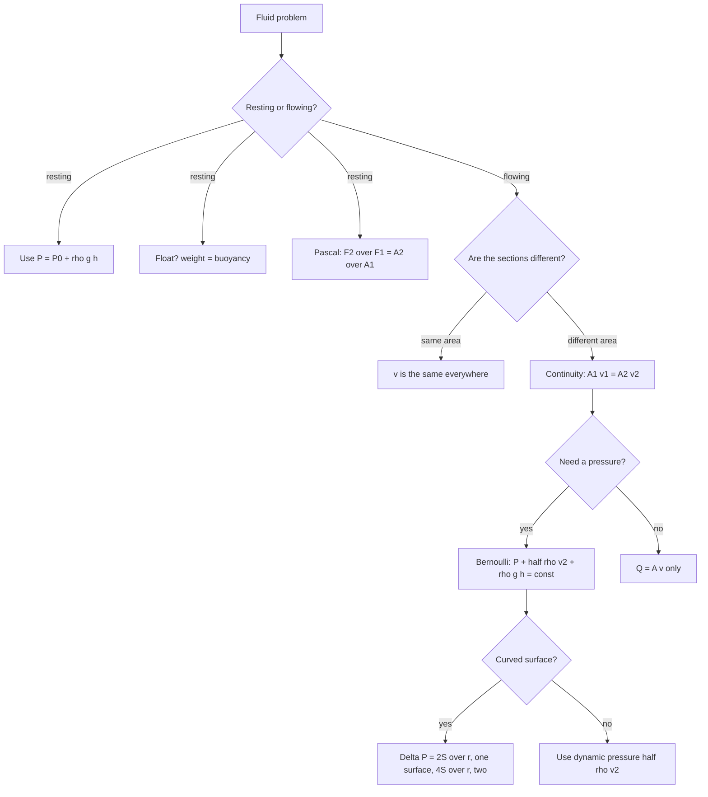

---

exam: cuet
examName: CUET UG
subject: physics
subjectName: Physics
topic: phy-009
topicName: Fluid Mechanics
weight: 3
country: india
generated: "2026-03-24T08:32:07.821611"
lastUpdated: "2026-09-16"
diagramPrompt: "Clean educational diagram showing Fluid Mechanics with clear labels, white background, labeled arrows for forces/fields/vectors, color-coded components, exam-style illustration"

---

# Fluid Mechanics

Fluid mechanics has one organising idea: **a fluid cannot sustain a shear stress at rest**, because it flows instead. Everything else in the chapter follows from that. Pressure in a stationary liquid acts in all directions and is equal in all directions at a point; a moving liquid obeys conservation of mass (continuity) and conservation of energy (Bernoulli); a fluid striking a surface produces a force (momentum, thrust); and any interface between a liquid and a gas behaves like a stretched membrane (surface tension). Fluids at rest are fluid statics; fluids in motion are fluid dynamics. NCERT Class 11 Chapter 10 and the class 12 chapters on viscosity and surface tension cover everything tested at this level.

The chapter is formula-heavy but the formulas are few. Roughly a dozen equations cover the whole syllabus, and the questions are almost always one of three shapes: apply a formula, compare two situations, or explain why something floats. That makes it a high-percentage-per-hour topic — worth finishing properly even though it is not the biggest chapter.

### 🟢 Lite — Quick Review (1h–1d)
> The formulas, the constants and the three comparisons that carry almost every question.

**The four quantities and their units**

| Quantity | Symbol | Definition | SI unit | Dimensions |
|---|---|---|---|---|
| Pressure | P | force per unit area, P = F/A | pascal (Pa = N m⁻²) | [M L⁻¹ T⁻²] |
| Density | ρ | mass per unit volume, ρ = m/V | kg m⁻³ | [M L⁻³] |
| Dynamic viscosity | η | internal friction of a fluid | Pa s | [M L⁻¹ T⁻¹] |
| Surface tension | S | force per unit length on a surface | N m⁻¹ | [M T⁻²] |

**Static fluid — five equations**

- **Pressure at depth:** P = P₀ + ρgh, where P₀ is the pressure at the surface, ρ the density in kg m⁻³, g = 9.8 m s⁻², h the depth in m. Independent of the shape or width of the container.
- **Pascal's law:** pressure applied to an enclosed incompressible fluid is transmitted undiminished in all directions. Hydraulic lift: **F₂/F₁ = A₂/A₁** = (r₂/r₁)².
- **Archimedes' principle:** buoyant force = weight of displaced fluid, **F_b = ρ_fluid · g · V_displaced**.
- **Floating vs sinking:** floats if ρ_object < ρ_fluid, sinks if ρ_object > ρ_fluid, neutrally buoyant if equal. Fraction submerged for a floating body = ρ_object/ρ_fluid.
- **Manometer:** in a U-tube with a liquid column difference h and one fluid of density ρ over mercury of density 13.6 × 10³ kg m⁻³, P_gas − P_atm = (ρ_Hg − ρ_liq) g h for a non-mercury liquid.

**Atmospheric pressure, the number to know**

P_atm = 1.013 × 10⁵ Pa = 76 cm of mercury = 760 mm Hg = 1.013 × 10⁵ N m⁻². Because ρ_Hg = 13.6 × 10³ kg m⁻³, a mercury barometer gives a clean 1 cm of Hg for every 1.33 × 10³ Pa.

**Moving fluid — four equations**

- **Continuity (mass conservation):** **A₁v₁ = A₂v₂** for an incompressible fluid. In mass form, ρ₁A₁v₁ = ρ₂A₂v₂.
- **Bernoulli (energy conservation along a streamline):** **P + ½ρv² + ρgh = constant**. All three terms in joules per unit volume.
- **Torricelli (efflux speed):** **v = √(2gh) = √(2ΔP/ρ)** when the surface above the hole is large enough that its velocity is negligible.
- **Venturi discharge:** Q = (A₁A₂/√(A₁² − A₂²)) · √(2(P₁ − P₂)/ρ).

**Surface tension — the three excess pressures**

Excess pressure ΔP = 2S/r for a **liquid drop** (one surface) and for an **air bubble** in a liquid (one surface); ΔP = 4S/r for a **soap bubble** (two surfaces); ΔP = S/r for a **liquid jet** (one cylindrical surface). Getting this wrong is expensive on any question that shows a drop, a bubble or a jet, so learn it as a count of surfaces rather than as three separate facts.

**Capillary rise:** h = 2S cos θ / (ρ g r), where θ is the angle of contact at the wall, r the tube radius. Water (θ ≈ 0, cos θ = +1) rises; mercury (θ ≈ 140°, cos θ negative) is depressed.

**Viscosity and drag**

- **Newton's law of viscosity:** F = −η A (dv/dx). The minus sign means the viscous force opposes the velocity gradient.
- **Stokes' law (sphere in a fluid):** F = 6πηrv.
- **Terminal velocity:** v_t = 2(ρ_sphere − ρ_fluid) g r² / (9η).
- **Poiseuille's flow through a narrow tube:** Q = πR⁴ ΔP / (8ηl). Note the **R⁴** — halving the radius cuts the flow to 1/16.
- **Reynolds number:** Re = ρvd/η. Re below about 1000 is laminar (steady, layered, streamlines never mix); above about 2000 is turbulent.

### 🟡 Standard — Regular Study (2d–2mo)
> Build the ideas behind the formulas, with the comparisons written out.

**Why pressure is a scalar and equal in all directions at a point**

Cut a small element out of a fluid at rest and enclose it in an imaginary surface. The surrounding fluid presses on every face. If the pressure on one face differed from the pressure on the opposite face, the element would be accelerated — but it is at rest. So pressure on all faces is equal, and the quantity is a scalar, not a vector. This is why pressure force adds directly, and why a "pressure direction" question is a trick question.

The consequence that appears constantly: **pressure depends on depth, not on the shape of the vessel**. A narrow tube and a wide funnel holding the same liquid to the same height have the same pressure at the bottom. A solid, horizontal, uniform object at the bottom of a lake feels more pressure from below than from above, which is why it is stable and why deep-sea hulls are built to resist it.

**Pascal's law and the hydraulic lift**

Squeeze a small piston of area A₁ with force F₁ and the pressure P₁ = F₁/A₁ is the same everywhere in the enclosed liquid, so a piston of area A₂ at the other end feels the same pressure and pushes back with F₂ = P₁A₂. Mechanical advantage = A₂/A₁ = (r₂/r₁)². Doubling the radius gives 4× the force; quadrupling it gives 16×. That square is the detail MCQs test. The law needs an **incompressible** fluid — air compresses and the pressure is not transmitted undiminished, which is why hydraulic brakes and lifts use oil, not air.

**Archimedes' principle and the three float cases**

Replace the submerged body by the fluid that would occupy its place. That fluid is in equilibrium under its own weight and the upward pressure force on its bottom, so the upward force must equal the fluid's weight: F_b = ρ_fluid · g · V_displaced. No new law is needed — the principle is a consequence of hydrostatic equilibrium.

Then everything else is bookkeeping. Let ρ_s be the object's density and V its total volume.

- Floating: weight = buoyancy, so ρ_s V g = ρ_f (V_sub) g, hence **V_sub/V = ρ_s/ρ_f**. The submerged fraction equals the density ratio.
- Suspended (fully submerged, no contact with the bottom): ρ_s = ρ_f. A hydrometer exploits this — a float with ballast that sinks deeper in light liquids.
- Sinking: ρ_s > ρ_f.

A ship of steel floats because it is hollow: its **average** density including the air inside is less than water. That is the standard answer to "how does a heavy ship float" and it is worth writing in those words.

**Measuring pressure: gauges, barometers and manometers**

A barometer measures absolute pressure and works because atmospheric pressure supports a column of mercury. In an open-tube manometer the gas pressure equals atmospheric pressure, so the reading is directly P_atm. In a **closed-tube (absolute) manometer**, the closed arm has a vacuum above the mercury, so the reading is P_abs = ρgh — that is the whole difference between the two instruments. A U-tube manometer with a non-mercury liquid in the limb containing the gas needs the subtraction P_gas − P_atm = (ρ_Hg − ρ_liquid) g h, because the column of the lighter liquid pushes down on the mercury side. Forgetting the subtraction is one of the most reliable ways to lose a mark.

**Continuity and the shape of a stream**

For an incompressible fluid, the mass crossing any cross-section per second must be the same, so ρAv = constant, and with ρ constant **Av = constant**. The consequence students miss: when a jet falls under gravity it narrows as it speeds up. The continuity equation fixes A ∝ 1/v, and Bernoulli fixes v growing as √(2gh), so A ∝ 1/√h. A falling stream is thin at the bottom for the same reason a wide river slows where it is shallow — the volume flow per second is conserved.

**Bernoulli, and the honest version of it**

Bernoulli says the total mechanical energy per unit volume of an incompressible, non-viscous fluid in steady flow along a streamline is constant: P + ½ρv² + ρgh = constant. In every application three of the four things are known, and you solve for the fourth.

The intuition: pressure energy does the work; when the flow speeds up in a narrow region, some of that pressure energy is converted to kinetic energy, so the pressure must fall. That is why a fast stream of air holds a paper strip up, why a spinning ball curves, and why pressure is lowest at the throat of a venturimeter.

Bernoulli's assumptions are the exam question: steady flow, incompressible, non-viscous, along a streamline, and negligible energy loss. A real pipe in a long run violates the last one badly, and blood flow through a narrowed artery is the standard example where the pressure drop exceeds the Bernoulli prediction because viscosity dissipates energy.

**The venturimeter and atomisers**

A venturimeter is a horizontal pipe that narrows. From continuity, v₂ = (A₁/A₂)v₁, and from Bernoulli along the pipe, P₁ − P₂ = ½ρ(v₂² − v₁²) = (ρv₁²/2)[(A₁/A₂)² − 1]. Solving for the flow rate gives the standard discharge formula. Atomisers and carburettors work on the same local idea: fast air at a constriction drops the pressure below atmospheric, and atmospheric air is sucked in to mix with the fuel.

**Viscosity — the temperature fact that reverses**

Viscosity is internal friction. Newton's law states that the viscous force between layers is proportional to the area of contact and to the velocity gradient, F = −ηA(dv/dx), and η is the constant of proportionality with SI unit Pa s. The force acts opposite to the gradient, which is why viscous drag always slows a moving body down.

The temperature behaviour splits the two states of matter, and this is the fact to memorise:

- **Liquids:** viscosity **decreases** as temperature rises. Cooking oil goes thin when hot; glycerine and honey pour easily after warming. Molecular cohesion is the main resistance in a liquid, and heating breaks the bonds holding molecules to each other.
- **Gases:** viscosity **increases** slightly as temperature rises. A gas molecule's random motion is the main resistance, and heating makes that motion faster.

**Stokes' law, terminal velocity and Poiseuille's law**

Stokes' law gives the drag on a small sphere moving slowly through a fluid: F = 6πηrv, valid only at low Reynolds number, which is why a falling raindrop quickly stops obeying it. Setting the drag equal to the net weight gives terminal velocity, v_t = 2(ρ_s − ρ_f)gr²/9η — and the r² dependence is why small particles settle fast and large ones take ages, which is the basis of sedimentation and of centrifugation.

Poiseuille's law for flow down a narrow tube of radius R and length l is Q = πR⁴ΔP/(8ηl). The fourth power of the radius is the memorable part, and it is why a partially blocked artery is dangerous well before it is fully blocked: halving the usable radius reduces the flow sixteenfold.

**Reynolds number**

Re = ρvd/η is dimensionless and compares inertial forces with viscous forces. Small Re, laminar flow: fluid layers slide past each other without mixing, the velocity profile across a pipe is a parabola, and the kinetic-energy correction factor is 3/2. Large Re, turbulent: chaotic mixing, roughly flat velocity profile, correction factor approaching 1. Flow speed, tube diameter and fluid density push Re up; viscosity and tube length push it down.

**Surface tension — one surface, two surfaces**

Surface tension arises because a molecule in the bulk is pulled equally in all directions by its neighbours, while a molecule at the surface has a net inward pull. The energy cost per unit area of creating a surface is S, and the force per unit length along a line on the surface is also S, measured in N m⁻¹.

The excess pressure across a curved surface follows from balancing the surface tension against the pressure difference over a hemisphere, and the result depends on how many surfaces there are: **one surface gives 2S/r, two surfaces give 4S/r**. A soap bubble has an inner and an outer surface, so 4S/r; a liquid drop has only one, so 2S/r. The same drop becomes a soap bubble and the excess pressure doubles at the same radius.

Related results: the work needed to increase a surface area by ΔA is W = SΔA, and for a soap bubble of radius r blown from zero, W = 8πr²S, since the total area is 8πr². Small drops are harder to blow up than large ones because the pressure needed is 4S/r, so the last stages of blowing a bubble need the most effort. Surface tension explains why a needle floats on water, why water climbs a capillary, why a camphor piece dances on water, and why small insects can stand on water.

**Capillary action and the angle of contact**

The rise or depression in a narrow tube is h = 2S cos θ/(ρgr), with θ the angle of contact between the liquid and the tube wall, measured inside the liquid. Water has θ ≈ 0 and wets glass, so cos θ = 1 and the liquid rises. Mercury has θ ≈ 140°, so cos θ is negative and the liquid is depressed. A tube of smaller radius produces a larger effect, so the formula has r in the denominator. This single formula also explains why water climbs a cotton wick in a lamp and why damp paper sticks to a wall.

### 🔴 Extended — Deep Study (3mo+)
> The derivations, the edge cases and the assumptions that are themselves examinable.

**Deriving the excess pressure across a curved surface**

Cut a spherical drop of radius r by a great circle. The pressure difference ΔP between inside and outside acts on the projected circular area πr², giving a net force ΔP·πr². The surface tension acts around the circumference 2πr with tension S, giving 2πrS. Setting them equal:

ΔP·πr² = 2πrS → **ΔP = 2S/r**

For a soap bubble, the inner surface pushes outward as well, so the restoring force doubles: **ΔP = 4S/r**. This derivation also shows that a large bubble is at lower pressure than a small one of the same liquid — two bubbles of different radii cannot both be stable, which is why a soap bubble always ends as a larger bubble with a smaller one beside it.

**Deriving the capillary rise from surface energy**

Consider a liquid column of radius r raised by h in a capillary. The wetted wall area is 2πrh, so the change in surface energy is ΔE = S·2πrh. The work done against gravity is ΔE = (πr²h)ρgh. Equating:

2πrhS = πr²hρgh → **h = 2S cos θ/(ρgr)**

The cancellation of h is itself instructive: the column can be any height, the balance is scale-free.

**Deriving continuity from a control volume**

Take a tube of uniform cross-section and mark a length Δl. In a small time Δt, fluid occupying A·v·Δt at the top enters and the same volume leaves at the bottom, otherwise the tube would be accumulating fluid with no reason. Writing mass rather than volume gives ρ₁A₁v₁ = ρ₂A₂v₂. For an incompressible fluid, ρ drops out.

**Applying Bernoulli to a siphon and to a bent tube**

A siphon is just Bernoulli with the outlet below the inlet, so the efflux speed depends on the height difference between the free surface and the spout, not on the shape of the pipe at all. Any amount of bending, climbing or narrowing can be inserted in between with no effect on the exit speed, provided friction is neglected. This is a favourite question because the intuition says "the pipe has to climb so the water must slow" — it does not, within the idealisation.

**Banking of roads and the limit speed**

On a frictionless banked road of angle θ, the horizontal component of the normal reaction provides the centripetal force: N sin θ = mv²/r and N cos θ = mg. Dividing gives **v_max = √(rg tan θ)**, the design speed for which no friction is needed at all. Friction allows a range of speeds, from √(rg tan(θ − φ)) to √(rg tan(θ + φ)) where φ is the angle of friction. A car is "grounded" on a banked curve because the reaction has a horizontal component, not because of some mysterious centripetal force of its own.

**Newton's law of viscosity with the coefficient in SI units**

From F = ηA(dv/dx) and F = −ηA(dv/dx), the unit of η follows directly: [η] = [F]/([A][dv/dx]) = (kg m s⁻²)/(m² · s⁻¹) = kg m⁻¹ s⁻¹ = Pa s. The poise is the CGS unit, 1 P = 0.1 Pa s. In many NCERT liquids, η is of order 10⁻³ Pa s (water at 20 °C about 1.0 × 10⁻³, glycerine about 1.5), while gases are of order 10⁻⁵ Pa s. That two-order-of-magnitude gap is what makes air feel thin even when it flows fast.

**Worked Example — venturimeter discharge**

A horizontal pipe narrows from a diameter of 4 cm to 2 cm. Water flows and the pressure gauge reads P₁ − P₂ = 2.0 × 10³ Pa. Find the volume flow rate, taking ρ = 1000 kg m⁻³.

1. Areas: A₁ = π(0.02)² = 1.2566 × 10⁻³ m², A₂ = π(0.01)² = 3.1416 × 10⁻⁴ m².
2. From continuity, v₂ = (A₁/A₂)v₁ = 4v₁.
3. From Bernoulli, ΔP = ½ρ(v₂² − v₁²) = ½(1000)(16v₁² − v₁²) = 7500v₁².
4. 2.0 × 10³ = 7500v₁² → v₁² = 0.2667 → v₁ = 0.516 m/s.
5. Q = A₁v₁ = 1.2566 × 10⁻³ × 0.516 = **6.5 × 10⁻⁴ m³ s⁻¹** = 0.65 litres per second.

Check: v₂ = 2.07 m/s, and ½(1000)(2.07² − 0.516²) = ½(1000)(4.28 − 0.27) = 2.0 × 10³ Pa. Consistent.

**Worked Example — a floating cube**

A wooden cube of side 20 cm and density 600 kg m⁻³ floats in water (ρ = 1000 kg m⁻³). Find the depth submerged and the buoyant force.

1. Volume = 0.2 × 0.2 × 0.2 = 8 × 10⁻³ m³. Mass = 600 × 8 × 10⁻³ = 4.8 kg.
2. Floating means F_b = weight, so F_b = 4.8 × 9.8 = **47 N**.
3. Depth h from ρ_water · g · A · h = mg → 1000 × 9.8 × 0.04 × h = 47 → h = 0.12 m.
4. Check with the ratio rule: V_sub/V = 600/1000 = 0.6, and 0.6 × 0.2 m = 0.12 m. Both routes agree.

**Worked Example — terminal velocity of a raindrop**

A raindrop of radius 0.5 mm falls through air of density 1.2 kg m⁻³ and viscosity 1.8 × 10⁻⁵ Pa s. Water has density 1000 kg m⁻³. Find the terminal velocity.

1. v_t = 2(ρ_s − ρ_f)gr²/(9η) = 2(1000 − 1.2)(9.8)(0.5 × 10⁻³)²/(9 × 1.8 × 10⁻⁵)
2. Numerator: 2 × 998.8 × 9.8 × 2.5 × 10⁻⁷ = 4.894 × 10⁻³
3. Denominator: 1.62 × 10⁻⁴
4. v_t = 4.894 × 10⁻³ / 1.62 × 10⁻⁴ = **30.2 m s⁻¹**, which is the well-known terminal speed of a large raindrop.

**Streamlines, pathlines and steady flow**

A streamline at any instant is drawn tangent to the local velocity of every particle in the flow. In steady flow, the pattern of streamlines is fixed in time, so a streamline is also the path followed by a single particle. In unsteady flow the two separate. Bernoulli applies along a streamline, not between arbitrary points, which is a real limitation for a swirling flow where streamlines spiral. In two-dimensional flow a streamline can be found by making a grid of flow direction vectors and drawing the curve that cuts them all.

### 🧠 Memory Anchors

- **"Pressure sees depth, not shape."** Same height, same pressure, whatever the vessel looks like. This is the single sentence that settles every hydrostatic MCQ that tries to confuse you with a funnel.
- **"One surface, two surfaces."** Excess pressure is 2S/r for a drop and 4S/r for a soap bubble. Count the interfaces instead of memorising two formulas.
- **"Liquids thin out when hot; gases thicken."** Viscosity versus temperature inverts between the two states of matter.
- **"Speed buys pressure."** Where the flow is fast the pressure is low. Venturi throat, aerofoil top surface, fast stream holding up a paper strip — one idea, three pictures.
- **"Flow is a river, not a truck."** The same volume per second must pass every cross-section, so narrowing means speeding up whether or not gravity is involved.
- **"Reynolds in one line: inertia versus viscosity."** Which one dominates decides whether streamlines hold together or mix.
- **Flashcard Q&A:**
  - *Why does a steel ship float?* → its average density including the enclosed air is less than water; only ρ_avg matters, not the density of the steel.
  - *Closed-tube manometer?* → reads absolute pressure, since the closed arm is a vacuum: P = ρgh.
  - *Fraction of a floating body submerged?* → ρ_object/ρ_fluid, independent of size.
  - *Halve a pipe's radius, Poiseuille flow becomes?* → 1/16 of the original.
  - *Why is water sprayed as a fine mist rather than a sheet?* → greater surface area, so surface tension breaks it into droplets quickly.
  - *Which is heavier, 10 kg of water or 10 kg of feathers?* → equal; this is the Archimedes-principle warm-up, and the full version of it is that a feather floats because of the large displaced volume of air.

### 🎯 Exam Traps & Error Log

1. **Writing ΔP = 2S/r for a soap bubble.** A soap bubble has two surfaces (inner and outer) and needs 4S/r. A drop and an air bubble have one surface and need 2S/r.
2. **Applying Archimedes to a body that is touching the bottom.** The liquid cannot get under it, so the buoyant force is not ρgV. This is how a ship sits on a sandbank.
3. **Forgetting the atmospheric subtraction in a manometer.** A closed U-tube with mercury reads absolute pressure directly; a U-tube containing a lighter liquid needs (ρ_Hg − ρ_liq)gh subtracted from P_atm.
4. **Confusing gauge with absolute pressure.** P_abs = P_gauge + P_atm. A barometer reads absolute; a car tyre gauge reads gauge, so an inflated tyre reads about 2.4 × 10⁵ Pa gauge and about 3.4 × 10⁵ Pa absolute.
5. **Reversing continuity as A₁/A₂ = v₂/v₁.** It is A₁v₁ = A₂v₂; the smaller area carries the higher speed.
6. **Forgetting ρgh in Bernoulli when the pipe is not horizontal.** Most marks are lost on vertical siphon and venturi problems because the height term is dropped.
7. **Treating Bernoulli as exact for a real pipe.** It ignores viscosity, so it overestimates the flow through a long narrow pipe. Poiseuille's law is the viscous-flow result.
8. **Using 9.8 instead of 10 in a clean-number problem,** or mixing g = 9.8 in one line of a calculation with 10 in the next. Pick the value the question supplies and stay with it.
9. **Assuming viscosity always falls with temperature.** That is only true for liquids. For gases it rises with temperature.
10. **Writing Poiseuille as R⁴ΔP with the wrong constant,** or Q = πR⁴ΔP/(8ηL) but then using the radius instead of the diameter from the question. If the question gives a diameter, halve it first.
11. **Saying surface tension pushes the drop apart.** It acts along the surface to minimise area, and the net effect on the interior of a drop is a tendency to contract — which is why large drops are energetically cheaper than small ones.
12. **Confusing the kinetic-energy correction factor.** It is 3/2 for laminar flow through a pipe and approaches 1 for turbulent flow. If a question gives the average speed and asks for the kinetic energy of the flowing fluid, use α = 3/2.

### 🧪 Self-Test — 8 Questions with Worked Answers

Work these on paper first. Every one of them uses a formula from the section above.

1. **A vertical column of water 10 m tall is open to the atmosphere. What is the gauge pressure at the bottom, and the absolute pressure?**

   Gauge = ρgh = 1000 × 9.8 × 10 = 9.8 × 10⁴ Pa. Absolute = gauge + P_atm = 9.8 × 10⁴ + 1.013 × 10⁵ = 1.99 × 10⁵ Pa. The gauge reading is the one a pressure gauge on a pipe shows; the absolute value is the one a barometer would read.

2. **An object of density 800 kg m⁻³ floats in water. What fraction of its volume is submerged, and what is its relative density with respect to water?**

   V_sub/V = ρ_o/ρ_f = 800/1000 = 0.8, so four-fifths of the volume is below the surface. Relative density = ρ_o/ρ_f = 0.8. Note both answers are the same number for different reasons — the fraction submerged and the relative density coincide only for a floating body.

3. **Water flows at 3 m/s through a pipe of area 2 × 10⁻³ m². The pipe narrows to 6 × 10⁻⁴ m². Find the new speed and the pressure drop.**

   Continuity: v₂ = (A₁/A₂)v₁ = (2 × 10⁻³/6 × 10⁻⁴)(3) = 10 m/s.
   Bernoulli, horizontal: P₁ − P₂ = ½ρ(v₂² − v₁²) = ½(1000)(100 − 9) = 4.55 × 10⁴ Pa. The pressure falls by 4.55 × 10⁴ Pa, so the narrow end is the low-pressure end.

4. **A soap bubble of radius 5 cm is formed in air. Surface tension is 0.03 N m⁻¹. Find the excess pressure inside, and repeat for a water drop of the same radius.**

   Soap bubble: ΔP = 4S/r = 4(0.03)/0.05 = 2.4 Pa. Water drop: ΔP = 2S/r = 2(0.03)/0.05 = 1.2 Pa. Same liquid, same radius, double the pressure in the bubble, because the bubble has two surfaces. A common wrong answer is to use 2S/r for both.

5. **A glass capillary of radius 0.5 mm holds water (S = 0.073 N m⁻¹, θ ≈ 0). Find the rise in metres.**

   h = 2S cos θ/(ρgr) = 2(0.073)(1)/[(1000)(9.8)(0.5 × 10⁻³)] = 0.146/4.9 = 0.0298 m, about 3.0 cm. If the question used mercury instead (θ ≈ 140°, cos θ ≈ −0.766), the sign flips and the answer is a depression of about 2.3 cm.

6. **A steel ball of radius 1 mm with density 7800 kg m⁻³ falls through glycerine of density 1260 kg m⁻³ and viscosity 1.5 Pa s. Find the terminal velocity.**

   v_t = 2(ρ_s − ρ_f)gr²/(9η) = 2(7800 − 1260)(9.8)(10⁻³)²/(9 × 1.5)
   Numerator = 2 × 6540 × 9.8 × 10⁻⁶ = 0.1282
   Denominator = 13.5
   v_t = 9.5 × 10⁻³ m s⁻¹. A very small value, which is the point: a steel ball in thick glycerine crawls, while in air the same ball would fall at tens of metres per second.

7. **A pipe of radius 4 cm carries water with a pressure difference of 2 × 10³ Pa over a length of 2 m. Find the flow rate. (η = 1 × 10⁻³ Pa s.)**

   Q = πR⁴ΔP/(8ηl) = π(0.04)⁴(2000)/(8 × 10⁻³ × 2)
   (0.04)⁴ = 2.56 × 10⁻⁶
   Numerator = π × 2.56 × 10⁻⁶ × 2000 = 1.608 × 10⁻²
   Denominator = 0.016
   Q = 1.005 m³ s⁻¹. The fourth power is what makes this large: halving the radius would give 1.005/16 = 0.063 m³ s⁻¹.

8. **Explain why water rises in a narrow tube of glass but is depressed in a tube of copper, even though the surface tension values of water and mercury are comparable.**

   Surface tension tells you the magnitude of the effect; the sign comes from the angle of contact, which is a property of the liquid–solid pair, not of the liquid alone. Water wets glass, so θ ≈ 0 and cos θ > 0, giving a rise. Mercury does not wet glass, so θ > 90° and cos θ < 0, giving a depression. The governing equation h = 2S cos θ/(ρgr) is the same in both cases; only the sign of cos θ changes. This is why a Hg thermometer works in a glass tube but a water thermometer of the same design would not read above about 96 °C.

### 💡 Pro Tips

1. **Decide static versus dynamic in the first three seconds.** If nothing is moving, no continuity, no Bernoulli, no ΔP = 2S/r. Half the chapter disappears at that decision.
2. **Write the units beside every symbol on your formula card** — Pa, kg m⁻³, N m⁻¹, Pa s, m s⁻¹. Most lost marks in this chapter are unit errors, not concept errors.
3. **Convert cm to m before you compute.** A 4 cm radius is 0.04 m, and 0.04⁴ is 2.56 × 10⁻⁶, not 2.56. This single conversion error costs marks in every surface-tension and Poiseuille problem.
4. **Use g = 9.8 only when the question uses 9.8.** Many problems are built around g = 10, and mixing 10 into a 9.8 answer creates a mismatch that looks like a physics error but is only bookkeeping.
5. **For a floating body, reach for the ratio rule before the force balance.** V_sub/V = ρ_o/ρ_f skips the weight, the volume and the multiplication in one step.
6. **Memorise the three excess-pressure cases as one rule with a count.** One surface is 2S/r, two surfaces is 4S/r. Ask "how many interfaces does the object have?" instead of "which formula applies?"
7. **Do the two-equation chain for venturi problems without hesitation:** continuity first, then Bernoulli, then solve. Students who try Bernoulli directly get a two-unknown, one-equation problem and stall.
8. **Learn the viscosity-temperature inversion as a pair.** Liquid down, gas up. It is one line, it comes up often, and there is no way to get it right by guessing.
9. **Sanity-check every result against the direction you expect.** Faster flow should mean lower pressure; a bigger bubble should mean lower excess pressure; a smaller tube should mean slower flow. Any answer that breaks the expected direction has an arithmetic or sign error.
10. **Keep Newton's law of viscosity and Poiseuille's formula physically separate.** Do not try to derive one from the other in your head; the exam only asks you to use the right one in the right situation — sphere versus narrow tube.

---

## Continue your study

- **[View this topic in your CUET UG roadmap](/roadmap/?exam=cuet&duration=1mo)** — see where "Fluid Mechanics" fits in your personalised plan
- **[Build a quick revision plan](/roadmap/?exam=cuet&duration=1d)** — 1-day sprint covering highest-weight topics
- **[CUET UG exam overview](/exams/cuet/)** — pattern, eligibility, and syllabus
- **[All Physics notes](/notes/cuet/physics/)** — browse sibling topics in this subject

---
*Content adapted based on your selected roadmap duration. Switch tiers using the selector above.*
