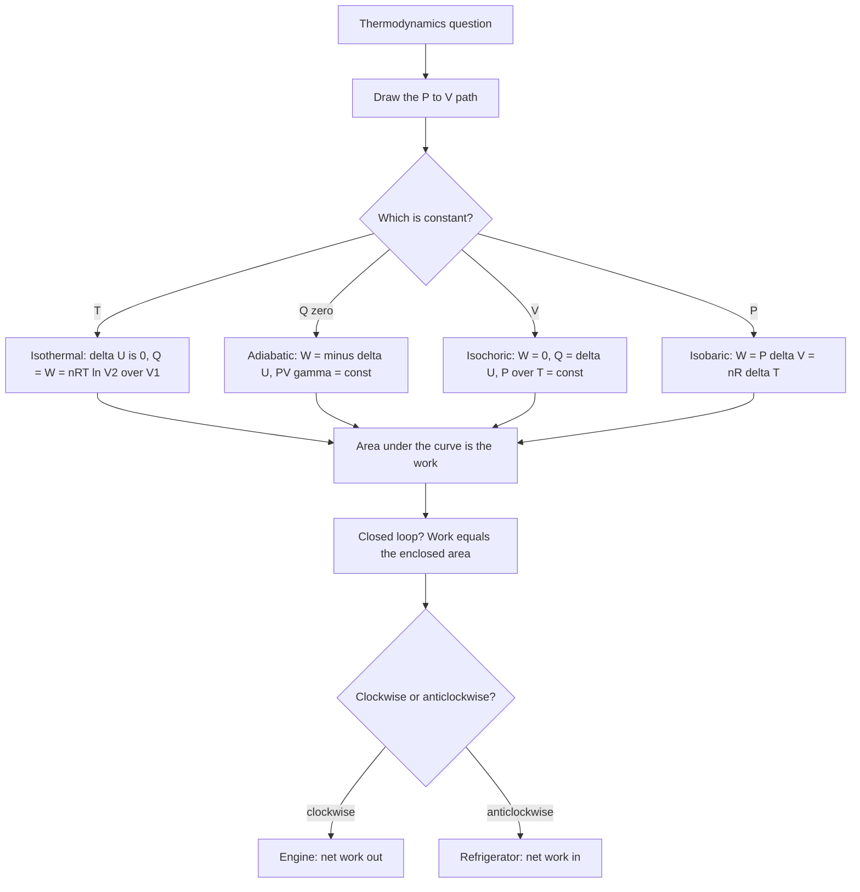

# Thermodynamics

Thermodynamics answers one kind of question: what can happen, what cannot, and at what rate. It never tells you what happens in a particular molecule — that is statistical mechanics. The chapter has a small set of laws, four named processes, one diagram that carries most of the marks (the P–V plot), and one scalar that decides the direction of everything: entropy.

Learn the four processes as a family rather than as four separate topics. They differ only in which of T, P, V is held constant, and every one of them is a line or a curve on the same P–V diagram. Once you can draw the four shapes, most of the questions are arithmetic on top of the picture.

### 🟢 Lite — Quick Review (1h–1d)
> The four laws, the four processes, the one efficiency formula and the sign convention.

**Sign convention used here.** Q is heat added **to** the system, W is work done **by** the system. Then the first law is **ΔQ = ΔU + ΔW**. Some Indian textbooks write ΔQ = ΔU + Δw with w the work done on the system; if your question uses that convention, W and w have opposite signs and the magnitude of every answer is unchanged. Pick one and stay with it.

**The four laws in one line each**

- **Zeroth:** if A is in equilibrium with B and B with C, then A is in equilibrium with C. This is what makes thermometers possible.
- **First:** energy is conserved. ΔQ = ΔU + ΔW. ΔU is a state function; Q and W are path functions.
- **Second:** no process converts heat entirely into work in a single cycle, and heat never flows from cold to hot on its own. In entropy language, the total entropy of the universe never decreases.
- **Third:** the entropy of a perfect crystal tends to zero as T → 0 K. This is why absolute zero is unattainable.

**State function vs path function.** Internal energy U, entropy S, temperature T, pressure P and volume V depend only on the current state. Heat Q and work W depend on the route taken between two states. Two paths from A to B give different Q and different W, but always the same ΔU.

**The four processes**

| Process | What is fixed | First law becomes | Ideal-gas relation | P–V shape |
|---|---|---|---|---|
| Isothermal | T | ΔU = 0, so Q = W | P₁V₁ = P₂V₂ | hyperbola |
| Adiabatic | Q = 0 | W = −ΔU | PV^γ = const | steeper than isothermal |
| Isochoric | V | W = 0, so Q = ΔU | P/T = const | vertical line |
| Isobaric | P | W = PΔV | V/T = const | horizontal line |

**Work in each process** (W = work done by the gas)

- Isothermal: **W = nRT ln(V₂/V₁)**
- Adiabatic: **W = (P₁V₁ − P₂V₂)/(γ − 1) = nC_V(T₂ − T₁)**
- Isobaric: **W = PΔV = nRΔT**
- Isochoric: **W = 0**
- Any reversible path: **W = ∫P dV**, the area under the curve. For a closed loop, W is the enclosed area, positive if the loop is traversed clockwise.

**Heat capacities.** For any ideal gas, **C_P − C_V = R** and **γ = C_P/C_V**. Monatomic: C_V = 3R/2, C_P = 5R/2, γ = 5/3. Diatomic: C_V = 5R/2, C_P = 7R/2, γ = 7/5. Internal energy of an ideal gas: **U = (f/2)nRT**, with f the number of active degrees of freedom.

**Carnot efficiency.** η = W/Q_hot = 1 − Q_cold/Q_hot = **1 − T_cold/T_hot**, both temperatures in kelvin. This is the ceiling for any engine working between those two temperatures.

**Second law in two equivalent statements.** Kelvin-Planck: no cyclic device can convert all the heat from a single reservoir into work. Clausius: no cyclic device can transfer heat from a colder to a hotter body without work input. They are the same law, restated.

**Entropy.** ΔS = ∫dQ_rev/T. For a reversible process ΔS_universe = 0; for a real (irreversible) process ΔS_universe > 0. State the sign, and half the entropy questions are already decided.

### 🟡 Standard — Regular Study (2d–2mo)
> The concepts behind the formulas, and what the P–V diagram is actually showing.

**Internal energy is a state function — and here is why it must be**

Take a gas from state A to state B by two different routes, one direct and one via a detour. Energy conservation gives ΔU = Q₁ − W₁ on one route and ΔU = Q₂ − W₂ on the other. Experimentally these two values are equal, and no route has been found where they differ. That is precisely what it means for U to be a state function, and it is the experimental basis of the first law rather than a mathematical trick.

For an ideal gas the internal energy depends only on temperature: U = (f/2)nRT. Not on pressure, not on volume, not on the path. A gas compressed at constant temperature has ΔU = 0 even though a large force was applied, because all the work leaves as heat.

**The equipartition theorem and f**

Each quadratic degree of freedom in a molecule — a translational term in each of x, y, z, plus a rotational term for each rotational axis, plus vibrational terms that each contribute two — carries an average energy of ½k_BT. For a monatomic gas only the three translations are active, f = 3. For a diatomic gas at ordinary temperature the two rotations about axes perpendicular to the bond are also active, f = 5. The two rotations about the molecular axis do not activate until temperatures of order 10³ K, and the vibrational modes need about 10³ K as well, which is why nitrogen and oxygen behave as f = 5 in a normal laboratory. That is the whole reason γ = 7/5 for air and not 7/3.

**Work from the P–V diagram**

Work is the area under the P–V curve, because dW = P dV multiplies pressure by the swept-out volume. Consequences you should be able to state without hesitating:

- Expansion (dV > 0) with positive P means positive work done by the gas. Compression is negative work.
- An isobaric line encloses a rectangle of area PΔV.
- An isotherm encloses more area than an adiabat drawn through the same starting point, because the gas stays hotter and presses harder. The area between the two curves, for the same expansion, is exactly the heat that had to be supplied to keep the temperature constant.
- A closed cycle: the net work is the enclosed area. A clockwise loop is an engine doing net positive work; an anticlockwise loop is a refrigerator, and a counter-clockwise loop appears on P–V diagrams as a refrigerator's cycle.
- A process along a vertical line (isochoric) encloses zero area, which is the geometric reason W = 0 there.

**Isothermal process**

T is constant, so for an ideal gas ΔU = 0 and Q = W exactly. The gas must absorb heat from the reservoir precisely to replace the energy it spends pushing the surroundings back, which is why an isothermal expansion is the standard way to produce work with a single reservoir and why the second law forbids it as a *complete* cycle. The work is W = nRT ln(V₂/V₁) = 2.303 nRT log₁₀(V₂/V₁), and the natural log means a tenfold expansion gives 2.303 nRT.

**Adiabatic process**

No heat crosses the boundary, so all the work comes out of internal energy. Expand adiabatically and the gas cools; compress it and it heats. This is why a bicycle pump gets hot. The relation PV^γ = constant, with γ = C_P/C_V, is a consequence of the ideal-gas law plus the first law plus Q = 0, and the larger γ is, the steeper the curve.

The two curves through the same point separate because they are two different physical stories: the isotherm needs a continuing supply of heat to hold its pressure up, the adiabat has none left after the initial work. On a P–V diagram the adiabat falls faster than the isotherm, and the two together bound a working cycle.

**Isochoric and isobaric**

Isochoric (rigid vessel, a common bomb calorimeter): no work is possible, so all the heat raises the internal energy and P/T is constant — the Gay-Lussac law. Isobaric (a piston free to move under constant external pressure): some of the heat does expansion work PΔV, so more heat is needed for the same temperature change than at constant volume, and V/T is constant. In a **Joule's experiment** free expansion of a gas into a vacuum, W = 0 and Q = 0, so ΔU = 0, which for an ideal gas means the temperature is unchanged. It is the cleanest demonstration in the chapter that internal energy depends on temperature alone.

**Carnot cycle and the meaning of reversible**

The Carnot engine runs on two isotherms and two adiabats. It is not a real machine: reversibility requires infinitely slow processes, zero friction and perfect thermal contact, all of which take infinite time. It matters anyway, because the Carnot theorem says that no engine between the same two temperatures can beat it. That makes it a benchmark, not a design.

The efficiency is η = 1 − T_cold/T_hot. Two things follow immediately. Efficiency is a function of the **two temperatures only** — it does not depend on the working substance, so no clever working fluid beats it. And both temperatures must be in kelvin. A Celsius substitution of 20 °C and 0 °C gives 1 − 0/20 = 100% efficiency, an impossibility, which is the quickest way to catch the error at the start of a question.

**Heat pumps and refrigerators**

A refrigerator does the reverse of an engine: it uses work W to draw Q_cold from a cold reservoir and dump Q_hot = Q_cold + W to a hot reservoir. Its coefficient of performance is COP = Q_cold/W, and for a Carnot refrigerator COP = T_cold/(T_hot − T_cold). A domestic refrigerator working between 4 °C and 37 °C has COP = 277/33 ≈ 8.4, so removing 84 J of heat per second costs only 10 J of work. Note that COP is a different quantity from efficiency and can be much larger than 1; a heat pump's COP is the heating output over the work input and is what gets quoted as a performance figure.

The second law says the machine must do work because heat will not flow from cold to hot by itself, and the sink temperature has to be the room, not the outside air, since the heat ends up there.

**Entropy**

Entropy measures the number of arrangements compatible with a given macrostate. Boltzmann's relation S = k_B ln Ω makes the counting explicit, and Clausius's thermodynamic definition ΔS = ∫dQ_rev/T gives it a measurable meaning. The second law says the total entropy of the system plus surroundings never decreases; for a reversible process the two changes cancel exactly, and for a real one the sum is positive.

The practical consequence is that spontaneous processes are not merely likely but overwhelmingly probable. Heat flows from hot to cold because the number of arrangements corresponding to the energy being spread out is vastly larger. Dissipation of mechanical energy into heat is irreversible because there is no statistical tendency back the other way.

**Reversible and irreversible in practice.** Reversible: isothermal expansion of a gas against an infinitesimal pressure difference, slow conduction of heat between bodies at almost equal temperatures, frictionless quasistatic piston motion. Irreversible: heat flowing across a finite temperature difference, friction, free expansion, mixing of two gases, an electric current through a resistor.

### 🔴 Extended — Deep Study (3mo+)
> Derivations, quantitative work, and the questions that test the assumptions themselves.

**Deriving PV^γ = constant for an adiabatic process**

Start from the first law with dQ = 0: nC_V dT = −P dV. Substituting P = nRT/V and using C_V/R = 1/(γ − 1):

(C_V/R)(dT/T) = −dV/V → (1/(γ−1))(dT/T) = −dV/V

Integrating from state 1 to state 2: (1/(γ−1)) ln(T₂/T₁) = −ln(V₂/V₁), so

T V^(γ−1) = constant, and using T = PV/R this becomes **PV^γ = constant**.

Two derived forms are worth having: **TV^(γ−1) = constant** and **T^γ P^(1−γ) = constant**. The three are the same relation rewritten, and MCQs often offer all three as separate options.

**Worked Example — isothermal expansion**

One mole of an ideal gas expands isothermally and reversibly at 300 K from 2 L to 4 L. Find the work done and the heat supplied.

1. W = nRT ln(V₂/V₁) = 1 × 8.314 × 300 × ln(4/2) = 2494.2 × 0.6931
2. W = **1.73 × 10³ J**
3. Isothermal means ΔU = 0, so Q = W = 1.73 × 10³ J.

If the same expansion were adiabatic instead, T₂ = T₁(V₁/V₂)^(γ−1) = 300 × (1/2)^0.4 = 227 K for a diatomic gas, and W = nC_V(T₂ − T₁) = 1 × 20.785 × (227 − 300) = −1.52 × 10³ J. The adiabatic work is smaller in magnitude, exactly as the area argument predicts.

**Worked Example — internal energy change from degrees of freedom**

Two moles of a monatomic ideal gas change temperature from 300 K to 500 K. Find ΔU.

1. Monatomic means f = 3, so U = (3/2)nRT.
2. ΔU = (3/2)nRΔT = 1.5 × 2 × 8.314 × 200 = 4988 J.
3. **ΔU = +4.99 × 10³ J**, absorbed from the surroundings as heat, since no work is involved in a rigid container.

The same temperature rise in 2 moles of diatomic gas gives (5/2)nRΔT = 8314 J. The internal energy is larger because more degrees of freedom are active.

**Worked Example — Carnot efficiency and the impossible engine**

An engine absorbs 2000 J per cycle from a source at 500 K and rejects 1200 J to a sink at 300 K.

1. Work done W = Q_hot − Q_cold = 2000 − 1200 = 800 J.
2. Actual efficiency η = 800/2000 = 0.40, that is 40%.
3. Carnot efficiency for the same two reservoirs: 1 − 300/500 = 0.40.
4. The two agree, so this engine is operating reversibly. Any real engine would be below 40%. An engine claiming 50% between 500 K and 300 K is violating the second law.

**Worked Example — entropy of mixing two bodies**

1 kg of water at 300 K and 1 kg of water at 400 K are mixed in an insulated container. c = 4200 J kg⁻¹ K⁻¹. Find the final temperature and the total entropy change.

1. Conservation: 4200(300 − T) = 4200(T − 400) → 300 − T = T − 400 → 2T = 700 → **T = 350 K**.
2. ΔS_cold = mc ln(T_f/T_i) = 4200 ln(350/300) = 4200 × 0.1542 = 647.5 J K⁻¹
3. ΔS_hot = 4200 ln(350/400) = 4200 × (−0.1335) = −560.8 J K⁻¹
4. ΔS_total = 647.5 − 560.8 = **+86.7 J K⁻¹**

Positive, as it must be for an irreversible heat-transfer process. The cold body gains more entropy than the hot body loses, because it gains at a lower temperature where the same heat is worth more entropy. That is the quantitative statement of the second law.

**Worked Example — Carnot refrigerator between two temperatures**

A Carnot refrigerator removes 200 J per cycle from a body at −10 °C and rejects it to a room at 30 °C. Find the work done and the COP.

1. T_cold = 263 K, T_hot = 303 K.
2. COP = T_cold/(T_hot − T_cold) = 263/40 = 6.58
3. W = Q_cold/COP = 200/6.58 = **30.4 J** per cycle
4. Q_hot = Q_cold + W = 230.4 J, which is the heat added to the room.

**Other cycles worth recognising.** The Otto cycle (constant-volume heat addition, constant-volume rejection, isentropic compression and expansion) is the ideal spark-ignition petrol engine. The Diesel cycle replaces the constant-volume addition with constant-pressure addition and has higher efficiency but a lower compression ratio. The Brayton cycle is constant-pressure compression and expansion, used in jet engines and gas turbines. All four are cycles in the same sense Carnot's is: a closed loop on the P–V diagram with net work equal to the enclosed area.

**Water's specific heat is not constant — and that is examinable**

For every other substance C_V is close to constant in temperature. For liquid water, C_V has a minimum near 35 °C and is about 4186 J kg⁻¹ K⁻¹ there, falling to about 4200 at 0 °C and about 4180 at 100 °C. Since U = ∫C_V dT rather than C_V T, the energy needed to heat water between two temperatures is found by integrating, and a question that asks for the heat to take water from 20 °C to 60 °C should be handled with an average C over that range. The physical reason is the hydrogen-bonded structure rearranging its hydrogen bonds, the same structure responsible for the density anomaly.

**Limits and the third law**

As T → 0 K the thermal motion dies out, the configurational disorder disappears and a perfect crystal has S = 0. Since reaching 0 K would require an infinite number of steps in practice, absolute zero is a limiting point, not a reachable state. This is the third law, and it is the reason the kelvin scale is anchored where it is.

### 🧠 Memory Anchors

- **"Isothermal is the only one with Q = W."** ΔU depends on T alone, so constant T means zero change in U, which forces Q = W.
- **"Adiabatic is the only one with Q = 0,"** and therefore the only one that changes temperature while doing work.
- **"Isochoric has no area, so no work."** Read W off the geometry rather than from memory.
- **"Vertical line is isochoric; horizontal line is isobaric."** On any P–V diagram that is enough to identify a process without reading the label.
- **"Adiabatic is steeper than isothermal."** Always, at every point, for the same starting state.
- **"Efficiency depends on the two temperatures only."** The working substance is irrelevant, which is exactly why Carnot sets a ceiling nobody beats.
- **"Kelvin, always kelvin."** 1 − 0/20 in Celsius gives 100% efficiency, and that absurd result is the fastest way to prove the conversion was skipped.
- **"Entropy wants a flat landscape."** Isolated systems move toward maximum entropy, which is why energy ends up as low-grade heat and never spontaneously re-concentrates.
- **Flashcard Q&A:**
  - *Which processes have W = 0?* → isochoric, and any path with no volume change.
  - *ΔU depends on?* → temperature only, for an ideal gas.
  - *γ for a monatomic gas?* → 5/3; for a diatomic at room temperature, 7/5.
  - *Is the adiabat above or below the isotherm?* → above, since the gas stays hotter.
  - *Clockwise loop?* → net positive work, an engine.
  - *Reversible process?* → ΔS_universe = 0; irreversible, ΔS_universe > 0.
  - *What does the Carnot theorem say?* → no real engine between the same two temperatures can exceed η_Carnot.

### 🎯 Exam Traps & Error Log

1. **Writing the first law with the wrong sign for work.** ΔQ = ΔU + ΔW means W is the work done *by* the system. If the question's convention is work done *on* the system, the sign flips — but only in the W term.
2. **Substituting Celsius temperatures into η = 1 − T_cold/T_hot.** The formula needs kelvin, always.
3. **Saying ΔU = 0 for an isobaric process.** It is zero for an *isothermal* one. Constant pressure does not mean constant temperature.
4. **Assuming the isotherm encloses less area than the adiabat.** The isotherm is above the adiabat, so it encloses more area. Isothermal work is always greater for the same expansion.
5. **Using 2.303 with the natural log.** W = 2.303 nRT log₁₀(V₂/V₁); W = nRT ln(V₂/V₁). Mixing the two constants is a silent factor-of-2.3 error.
6. **Forgetting the sign of the entropy change for the hot reservoir.** In a heat-flow problem the cold body gains entropy and the hot body loses it; the *net* is positive, and reporting only the first loses the mark.
7. **Claiming a real engine can beat Carnot.** No. If a question gives an efficiency above 1 − T_cold/T_hot, the engine is being described as impossible, which is sometimes exactly the point being tested.
8. **Writing PV = constant for an isothermal process.** It is P₁V₁ = P₂V₂ for a *fixed amount* of gas; PV is not constant as the gas flows through different stages of a cycle.
9. **Using C_P − C_V = R for a real gas.** It holds exactly only for an ideal gas.
10. **Confusing COP with efficiency.** A refrigerator's COP can exceed 1; it is a ratio of two energies, not a fraction.
11. **Saying the second law says energy is lost.** Energy is conserved; what is degraded is its quality, measured by entropy.
12. **Adding heat terms with mixed signs in a mixing problem.** Write heat lost by the hot body = heat gained by the cold body, as two positive quantities, before expanding anything.

### 🧪 Self-Test — 8 Questions with Worked Answers

Do these on paper first. Each is one of the standard question shapes for this chapter.

1. **Two moles of an ideal gas at 300 K expand isothermally to twice the volume. What is the work done, and how much heat is supplied?**

   W = nRT ln(V₂/V₁) = 2 × 8.314 × 300 × ln 2 = 4988 × 0.6931 = 3.46 × 10³ J. Since T is constant, ΔU = 0, so Q = W = 3.46 × 10³ J. The gas does not store or lose any energy; every joule of heat it takes in comes straight out as work.

2. **A gas follows PV = constant from P = 2 × 10⁵ Pa, V = 0.5 m³ to V = 1.5 m³. Find the final pressure and the work done.**

   P₂ = P₁V₁/V₂ = (2 × 10⁵)(0.5)/1.5 = 6.67 × 10⁴ Pa.
   W = nRT ln(V₂/V₁). Rather than find n and T, note that PV = nRT is constant here, so nRT = P₁V₁ = 1.0 × 10⁵ J. W = 1.0 × 10⁵ × ln 3 = 1.1 × 10⁵ J. Check by area: the curve is a rectangular hyperbola, and the area under it from V₁ to V₂ is nRT ln(V₂/V₁) = 1.10 × 10⁵ J.

3. **A monatomic ideal gas is compressed adiabatically from 2 m³ at 300 K to 0.5 m³. Find the final temperature. (γ = 5/3.)**

   TV^(γ−1) = constant → T₂ = T₁(V₁/V₂)^(γ−1) = 300 × (2/0.5)^(2/3) = 300 × 4^(2/3).
   4^(1/3) = 1.5874, so 4^(2/3) = 2.5198. T₂ = 300 × 2.5198 = **756 K**. The gas heats up because the work done on it has nowhere to go but into internal energy. The same numbers with PV^γ give P₂ = P₁(V₁/V₂)^γ as a check.

4. **An engine takes in 1000 J from a source at 600 K and rejects 400 J to a sink at 300 K. Is it possible?**

   Efficiency = (1000 − 400)/1000 = 60%. Carnot limit for 600 K and 300 K is 1 − 300/600 = 50%. A 60% engine exceeds the limit, so **it is not possible**; no cyclic device can convert heat to work with that efficiency between those reservoirs. The second law forbids it.

5. **Two moles of a diatomic ideal gas are heated at constant volume from 300 K to 400 K. Find Q and W.**

   Isochoric → W = 0. So Q = ΔU = (5/2)nRΔT = 2.5 × 2 × 8.314 × 100 = 4157 J, so Q = **4.16 × 10³ J**. If the same heating were done at constant pressure, more heat would be needed because part of it would do expansion work: Q = nC_PΔT = 2 × 29.1 × 100 = 5.82 × 10³ J.

6. **Explain why an adiabat is steeper than the isotherm through the same point on a P–V diagram.**

   Two reasons, and the second is the physical one. Mathematically, PV^γ = constant with γ > 1 falls off faster than PV = constant. Physically, the isotherm requires heat to flow in continuously to hold the temperature up as the gas expands; the adiabat receives no heat, so it does work by spending internal energy, its temperature drops, and its pressure falls further than the isotherm's. Without the heat input the gas simply cannot stay at the same pressure during expansion.

7. **A Carnot refrigerator operates between 0 °C and 40 °C and has a power input of 500 W. How much heat does it remove per second?**

   T_cold = 273 K, T_hot = 313 K, difference 40 K. COP = 273/40 = 6.83. Q_cold = COP × P = 6.83 × 500 = 3414 W. So about **3.4 kJ per second** is removed from the cold space, of which 2.9 kJ is dumped into the room. The efficiency of a heat pump in this arrangement is Q_hot/W = 3414 + 500 over 500 = 7.83.

8. **Two moles of an ideal gas are taken round the cycle ABCDA on a P–V diagram, where A = (1 m³, 10⁵ Pa), B = (1 m³, 3 × 10⁵ Pa), C = (3 m³, 3 × 10⁵ Pa), D = (3 m³, 10⁵ Pa). Find the net work done by the gas and say what the cycle is.**

   The four sides are: A→B isochoric (W = 0), B→C isobaric expansion at 3 × 10⁵ Pa, C→D isochoric (W = 0), D→A isobaric compression at 10⁵ Pa.
   W_BC = 3 × 10⁵ × (3 − 1) = 6 × 10⁵ J. W_DA = 1 × 10⁵ × (1 − 3) = −2 × 10⁵ J. Net W = 4 × 10⁵ J, which is also the enclosed rectangular area, (3 − 1) × (3 × 10⁵ − 10⁵) = 2 × 2 × 10⁵ = 4 × 10⁵ J. The path A→B→C→D is clockwise, so it is an **engine cycle**: heat is supplied on B→C, rejected on D→A, and the net output is 4 × 10⁵ J per cycle.

### 💡 Pro Tips

1. **Draw the P–V diagram before you write anything.** For any question that says "expansion", "compression" or "cycle", the shape fixes the formula and the sign. It costs ten seconds and prevents most lost marks.
2. **Check whether ΔU is zero before anything else.** Ask: is T constant? If yes, ΔU = 0 and Q = W. That one question resolves every isothermal problem instantly.
3. **Use the area picture for every work question.** Is it a rectangle, the area under a curve, or an enclosed loop? Each has its own formula and they are easy to mix up.
4. **Convert to kelvin in your head the moment a temperature appears in a ratio.** 1 − 0/20 is the giveaway that the conversion was skipped.
5. **In entropy problems, compute the sign of each part before adding.** Hot body negative, cold body positive, surroundings whatever the case, net positive. Writing the three signs first removes all ambiguity.
6. **Memorise f = 3 and f = 5 with their γ values, not separately.** 5/3 and 7/5 cover monatomic and diatomic; the extra degrees of freedom at high temperature are not in scope.
7. **State which convention you are using in the first line of a numerical.** "W is work done by the gas" removes an entire family of sign errors.
8. **Treat "more than Carnot" as a possible intended answer.** Questions about the second law often present an engine that violates the limit and ask whether it is possible; the answer is that it is not, and the reasoning is the mark.
9. **Keep the four relations PV = const, PV^γ = const, P/T = const, V/T = const on one card.** Identify the process, pick the line, substitute. Nothing more is needed.
10. **Sanity-check the direction of every temperature change.** Adiabatic expansion must cool; adiabatic compression must heat. If your answer does the opposite, you have used the wrong exponent sign.

---

## Continue your study

- **[View this topic in your CUET UG roadmap](/roadmap/?exam=cuet&duration=1mo)** — see where "Thermodynamics" fits in your personalised plan
- **[Build a quick revision plan](/roadmap/?exam=cuet&duration=1d)** — 1-day sprint covering highest-weight topics
- **[CUET UG exam overview](/exams/cuet/)** — pattern, eligibility, and syllabus
- **[All Physics notes](/notes/cuet/physics/)** — browse sibling topics in this subject

