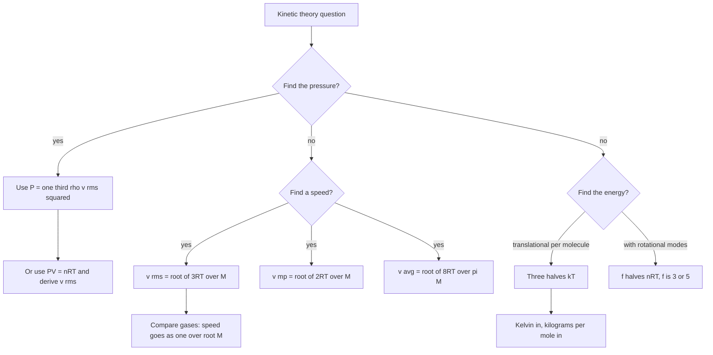

---

exam: cuet
examName: CUET UG
subject: physics
subjectName: Physics
topic: phy-012
topicName: Kinetic Theory
weight: 3
country: india
generated: "2026-03-24T08:32:07.823856"
lastUpdated: "2026-06-19"
diagramPrompt: "Clean educational diagram showing Kinetic Theory with clear labels, white background, labeled arrows for forces/fields/vectors, color-coded components, exam-style illustration"

---

# Kinetic Theory

Kinetic theory is the bridge between what you can measure (pressure, volume, temperature) and what molecules are actually doing. The payoff is a small set of powerful statements: pressure is momentum transfer, absolute temperature is proportional to average kinetic energy, and the speed of a gas molecule depends only on the temperature and the molar mass. Once those three are secure, most questions in the chapter are one substitution.

The chapter also supplies the microscopic explanation for results you already know macroscopically — the ideal gas law, the universal gas constant as Boltzmann's constant times Avogadro's number, and the ratio γ of specific heats. Study it that way rather than as a separate list of formulae.

### 🟢 Lite — Quick Review (1h–1d)
> The constants, the equations, and the three speeds in the right order.

**The constants you must have to hand**

| Constant | Symbol | Value |
|---|---|---|
| Boltzmann constant | k | 1.38 × 10⁻²³ J K⁻¹ |
| Universal gas constant | R | 8.314 J mol⁻¹ K⁻¹ |
| Avogadro number | N_A | 6.022 × 10²³ mol⁻¹ |
| Standard pressure | P₀ | 1.013 × 10⁵ Pa |

The link between them: **R = N_A k**. Every question that mixes k and R is decided by knowing which quantity is per molecule and which is per mole.

**The five equations that matter**

- **Ideal gas law, per mole:** PV = nRT. Per molecule: PV = NkT.
- **Pressure from molecular motion:** **P = ⅓ ρ v_rms²**, where ρ = m/V is the gas density.
- **RMS speed:** **v_rms = √(3RT/M) = √(3kT/m)**, with M in kg mol⁻¹ and m the mass of one molecule in kg.
- **Average translational kinetic energy:** per molecule **E = ⅗kT** — precisely, E = (3/2)kT; per mole, E = (3/2)RT.
- **Internal energy with degrees of freedom:** **U = (f/2)nRT**, with f the number of active degrees of freedom.

**The three characteristic speeds**

| Speed | Formula | Numerical factor |
|---|---|---|
| Most probable v_mp | √(2RT/M) | 1.414 √(RT/M) |
| Average v_avg | √(8RT/πM) | 1.596 √(RT/M) |
| RMS v_rms | √(3RT/M) | 1.732 √(RT/M) |

The order is fixed: **v_rms > v_avg > v_mp**. This is an assertion–reason favourite, and the reason is not that the rms is "largest because it is the biggest" — it is that the rms is biased by the few fastest molecules, whose large squares dominate ⟨v²⟩, while the average is a plain arithmetic mean and the most probable is the value at the peak of the distribution.

**Degrees of freedom, f**

| Gas | f | C_V | C_P | γ |
|---|---|---|---|---|
| Monatomic (He, Ar, Ne) | 3 | 3R/2 | 5R/2 | 5/3 = 1.67 |
| Diatomic (N₂, O₂, air) at room T | 5 | 5R/2 | 7R/2 | 7/5 = 1.40 |
| Polyatomic (CO₂, H₂O vapour) | 6 | 3R | 4R | 4/3 = 1.33 |

**Mean free path:** λ = 1/(√2 π d² n), with d the molecular diameter and n the number density. Pressure enters only through n = P/(kT), so **λ ∝ T/P**.

### 🟡 Standard — Regular Study (2d–2mo)
> Where each equation comes from, and what the model assumes.

**The five assumptions of the molecular model**

1. A gas consists of a very large number of molecules, each of negligible volume compared with the container.
2. The molecules move in all directions with random speeds, and between collisions each moves in a straight line at constant speed.
3. Collisions between molecules, and with the walls, are perfectly elastic, so total kinetic energy is conserved.
4. Newton's laws apply on all scales, including to a single molecule.
5. There are no intermolecular forces except during the instant of collision.

State these accurately: "molecules are in constant random motion" is right, but "molecules repel each other at all times" contradicts assumption 5 and is wrong.

**Deriving pressure from the collision of a single molecule**

Take a cubical vessel of side L, so V = L³, containing N molecules each of mass m. A molecule with x-velocity vₓ bounces between the two faces perpendicular to the x-axis. The time between successive impacts on one face is 2L/vₓ, and each impact changes its momentum by 2mvₓ. The force on that face is therefore rate of momentum transfer = 2mvₓ × vₓ/(2L) = mvₓ²/L.

Summing over all N molecules and dividing by the face area L²:

P = (m/(L³)) Σvₓ² = (N m v²_rms,x)/V

By symmetry the three directions share the energy equally, so v²_rms = 3 v²_rms,x. Therefore

**P = ⅓ (Nm/V) v_rms² = ⅓ ρ v_rms²**

The factor ⅓ is the counting of the three spatial directions, and it is the single most forgotten step in a derivation question.

**Deriving the rms speed and the ideal gas law from each other**

P = ⅓ ρ v_rms² and PV = nRT give, with ρ = nM/V:

(1/3)(nM/V)v_rms² = nRT/V → v_rms² = 3RT/M → **v_rms = √(3RT/M)**

Since ρ ∝ P at constant T, the box equation also gives P ∝ 1/V at constant T (Boyle's law) and P ∝ T at constant V (Gay-Lussac's law) directly.

**Temperature is average kinetic energy — the experimental evidence**

If v_rms ∝ √T, then the average kinetic energy of a molecule, ½mv_rms² = (3/2)kT, is directly proportional to T. This is the kinetic interpretation of absolute temperature, and it fixes the numerical value of the kelvin through k. Absolute zero is then the temperature at which the molecules' motion ceases, which is also the point where a gas condenses and where the third law says the entropy of a perfect crystal vanishes.

Note what the law does *not* say: it does not say the mean speed is zero at absolute zero in any useful sense, and it does not require every molecule to stop. It says the *average* energy is proportional to T.

**Degrees of freedom and the equipartition theorem**

Each independent quadratic term in the energy — ½mvₓ², ½mv_y², ½mv_z², and similarly each rotational term ½Iω² — carries an average energy of ½kT at thermal equilibrium. Summing over f active terms gives the mean energy per molecule (f/2)kT and the molar internal energy U = (f/2)RT.

Translational degrees are always active: three. Rotational degrees need an activation temperature, because the energy spacing between rotational levels is small for ordinary molecules. Two are active for a diatomic at room temperature (rotation about the bond axis involves a tiny moment of inertia and stays frozen out). Vibrational modes are strongly active only above about 10³ K, and each one that is active contributes **two** degrees of freedom, one from kinetic and one from potential.

The chain to the specific heats is then immediate: C_V = (∂U/∂T)_V = (f/2)R, C_P = C_V + R, γ = C_P/C_V = 1 + 2/f. Air has γ = 1.4, and that is the number used in every engine calculation.

**The speed distribution**

The Maxwell-Boltzmann distribution gives the fraction of molecules with speeds in a range:

dN/N = 4π (M/2πRT)^{3/2} v² exp(−Mv²/2RT) dv

Three features matter for the questions. The distribution starts at zero, rises to a single peak at v_mp, and falls off — never negative, one maximum, symmetric about nothing. The peak height increases with T and the curve broadens, so at higher temperature the same fraction of molecules lies inside a narrow speed band near the most probable speed, while the mean speed rises. And the whole distribution shifts to the right for lighter gases, which is why hydrogen escapes from a leaking vessel far faster than oxygen does.

**Graham's law of diffusion and effusion**

The rate at which one gas spreads through another, or leaks out of a small hole into a vacuum, is proportional to 1/√M. Hydrogen escapes a leaking tyre-cask three times faster than nitrogen, and a gas cylinder of a lighter gas is "empty" earlier than a heavy one of the same mass. The law follows from the kinetic energy at a given temperature being the same for all gases: ½mv² = (3/2)kT, so the speeds scale as 1/√m.

**Mean free path**

λ is the average distance a molecule travels between collisions. Collisions are needed to keep molecules from flying straight across the container, and that is why a gas is hard to evacuate: at low pressure the molecules rarely meet, so they hit the walls and are pumped out directly, but the gas that remains is increasingly the slow-moving part.

λ = 1/(√2 π d² n) and n = P/(kT), so λ ∝ T/P. The √2 arises because a moving molecule sweeps out a cylinder of cross-section πd² relative to stationary ones, and is additionally knocked off course by other moving molecules.

**Real gases and the van der Waals correction**

Two things the ideal model ignores. Molecules have finite size, so they cannot approach each other closer than roughly a diameter; the available volume is less than V, corrected by **b**. Molecules attract each other at moderate separations, so a molecule at the wall is pulled inward and the measured pressure is lower than the ideal prediction; this is the **a** term, entering as P + an²/V².

(P + an²/V²)(V − nb) = nRT

At high temperature and low pressure both corrections are negligible, and H₂, He and N₂ come closest to ideal behaviour because their intermolecular forces are weakest. Near condensation the attractive term dominates and the real pressure is **below** the ideal line; at very high pressure the excluded-volume term dominates and the real pressure is **above** it. That is the shape of every real P–V isotherm.

**Brownian motion**

In 1827 Robert Brown observed that pollen grains suspended in water jitter continuously and irregularly. The moving water molecules strike the grain far more often on one side at a given instant than on the other, so the net force is small but never zero and it keeps changing direction. Brownian motion is direct visual evidence for the molecular nature of matter, and it works for gases, liquids and even in an optical microscope for particles small enough to be seen.

### 🔴 Extended — Deep Study (3mo+)
> Quantities, distributions and the assumptions that questions are built on.

**Worked Example — rms speeds of common gases at 300 K**

| Gas | M (kg mol⁻¹) | v_rms (m s⁻¹) |
|---|---|---|
| H₂ | 0.002 | 1934 |
| He | 0.004 | 1368 |
| N₂ | 0.028 | 517 |
| O₂ | 0.032 | 483 |
| CO₂ | 0.044 | 412 |

Since v_rms ∝ 1/√M, hydrogen exceeds oxygen by √(32/2) = √16 = **4**, exactly. 1934/483 = 4.00. Air, with M ≈ 0.029, gives 517 m s⁻¹, which is also the value used in most estimates of sound speed, since sound is the bulk motion of the gas.

**Worked Example — internal energy of nitrogen**

4 mol of nitrogen at 27 °C (300 K) is heated at constant volume to 100 °C (373 K). Find the heat supplied. Nitrogen is diatomic, f = 5, so C_V = 5R/2 = 20.8 J mol⁻¹ K⁻¹.

1. ΔT = 73 K, and constant volume means W = 0, so Q = ΔU = nC_VΔT.
2. Q = 4 × 20.8 × 73 = 6074 J, so **Q ≈ 6.1 × 10³ J**.
3. Check with U = (5/2)nRT: U₁ = 2.5 × 4 × 8.314 × 300 = 24 942 J, U₂ = 2.5 × 4 × 8.314 × 373 = 31 011 J, difference 6069 J. Same answer.
4. Average translational KE per molecule at 300 K = (3/2)kT = 1.5 × 1.38 × 10⁻²³ × 300 = 6.2 × 10⁻²¹ J. That is a tiny number per molecule and about 1.5 × 10⁴ J per mole, which is why a teaspoon of gas at room temperature contains several joules of energy.

**Worked Example — mean free path of nitrogen**

Nitrogen at standard temperature and pressure has molecular diameter 3.7 × 10⁻¹⁰ m. Molar volume is about 24.8 L = 2.48 × 10⁻² m³.

1. Number density n = N_A/(molar volume) = 6.022 × 10²³/2.48 × 10⁻² = 2.43 × 10²⁵ m⁻³.
2. πd² = π(3.7 × 10⁻¹⁰)² = π × 1.369 × 10⁻¹⁹ = 4.30 × 10⁻¹⁹ m².
3. √2 π d² n = 1.414 × 4.30 × 10⁻¹⁹ × 2.43 × 10²⁵ = 1.478 × 10⁷ m⁻¹.
4. λ = 1/1.478 × 10⁷ = **6.8 × 10⁻⁸ m**, about 68 nm, or roughly 200 molecular diameters.

The consequence: at atmospheric pressure a molecule crosses its own length about 200 times before it collides again, yet a gas still exerts pressure because there are so many molecules per unit volume.

**Worked Example — effusion rate**

Compare the rate of effusion of hydrogen and oxygen at the same temperature.

1. r ∝ 1/√M → r(H₂)/r(O₂) = √(M(O₂)/M(H₂)) = √(32/2) = 4.
2. Hydrogen escapes **four times** as fast.
3. In terms of the speeds themselves the ratio is the same 4, since v ∝ 1/√M; the number of molecules escaping per second through a fixed hole scales the same way, because the flux through a hole is proportional to n ⟨v⟩ and the densities of the two gases are equal at the same P and T.

**Maxwell-Boltzmann in words**

The distribution exists because of two competing effects. Molecules with speed much above the mean lose more kinetic energy to collisions and are slowed, so a very fast molecule is statistically likely to lose speed. Molecules with speed much below the mean are unlikely to be accelerated to the next energy bracket. The result is a distribution that is zero at v = 0 (too few molecules are that slow), peaks at v_mp, and decays exponentially. The expression from the quantum partition function, worked through, gives v_mp = √(2RT/M), ⟨v⟩ = √(8RT/πM) and v_rms = √(3RT/M), and the three constants 1.414, 1.596 and 1.732 differ only because the distribution is not symmetric.

**The equipartition theorem's limitation**

Each quadratic term contributes ½kT *only* if the energy spacing between adjacent levels of that mode is small compared with kT. Rotational levels of a light molecule like H₂ are widely spaced, so even at room temperature the rotational mode is partly frozen out and hydrogen does not exactly have f = 5. Vibrational levels of most molecules are spaced by more than 10³ K, so vibration is inactive at ordinary temperatures. This is why a gas's γ is not a fixed constant for all T, and it is the physical reason behind the quantum-mechanical gas law.

**Connection to the pressure of a single gas molecule**

A molecule of mass m and speed v striking a wall normally transfers momentum 2mv, and hits the wall at a rate v/L. So the force is 2mv²/L and the pressure contribution is 2mv²/L³ = 2mv²/V. Summing over N molecules, P = (1/V) Σmv_i². This is a shorter derivation of the same result and it is worth doing once by hand, because it makes the factor ⅓ and the 2 in the collision obvious.

**Checks that catch wrong answers quickly**

- Halving the molar mass multiplies the speed by √2. If a question gives the four gases H₂, N₂, O₂ and CO₂ and the options put CO₂ fastest, the answer is wrong.
- Doubling the temperature multiplies the speed by √2. Options that double it are testing whether you applied the square root.
- v_rms > v_avg > v_mp in that order, always, for any gas at any temperature.
- λ increases with temperature and decreases with pressure. Any answer showing λ ∝ P is wrong.

### 🧠 Memory Anchors

- **"One third rho v squared."** Pressure, density, rms speed. The ⅓ is three spatial directions, and it is the step that goes missing in derivations.
- **"v_rms is a biased measure."** The fastest molecules dominate the mean of v², which is why it exceeds the plain average, which in turn exceeds the value at the peak. Order first, reasons second.
- **"Lighter is faster, always, at the same T."** v ∝ 1/√M, so H₂ beats O₂ by exactly 4, not by 16.
- **"Temperature is average energy."** E = (3/2)kT per molecule, (3/2)RT per mole. k versus R is the only difference between the two forms.
- **"f = 3 for monatomic, 5 for diatomic."** Three translations plus two rotations at room temperature. Vibration is asleep until about 10³ K.
- **"λ goes up with T and down with P."** Fewer molecules per volume, or faster molecules, means longer free flights.
- **"Real gases: a pulls, b pushes."** Attractions lower the pressure below ideal; excluded volume raises it above. Know which side of the ideal line to expect in each regime.
- **Flashcard Q&A:**
  - *Why is the rms larger than the average?* → the few very fast molecules contribute disproportionately to ⟨v²⟩ before the square root.
  - *R in terms of k?* → R = N_A k, 8.314 against 1.38 × 10⁻²³.
  - *Internal energy of an ideal gas depends on?* → temperature only, and on f for the molar form.
  - *γ for air?* → 1.4, because f = 5.
  - *Mean free path proportional to?* → T/P.
  - *What is Brownian motion?* → random motion of small particles suspended in a fluid, caused by unbalanced molecular bombardment; evidence for the molecular nature of matter.

### 🎯 Exam Traps & Error Log

1. **Forgetting the ⅓ in P = ⅓ρv².** Writing P = ρv² gives an answer three times too large; check against PV = nRT to catch it.
2. **Using k where R is required, or R where k is required.** Per molecule use k, per mole use R. Mixing them is the most common unit-type error in the chapter.
3. **Putting M in grams per mole into √(3RT/M).** M must be in kg mol⁻¹, so 2 g mol⁻¹ is 0.002, not 2. This is a factor-of-1000 error and it is easy to make silently.
4. **Using Celsius in a √T formula.** v ∝ √(absolute T). A gas at 27 °C is at 300 K, not 27, and the ratio 27 vs 300 is enormous.
5. **Reversing the speed order.** v_rms > v_avg > v_mp always. The most probable speed is the *smallest* of the three.
6. **Treating a diatomic gas as f = 3.** Rotational degrees of freedom are active at room temperature; only the axial rotation and vibration are frozen out.
7. **Counting a vibrational mode as one degree of freedom.** It contributes two when active, one kinetic and one potential.
8. **Dropping the √2 from the mean free path.** It is there because the molecules that collide are themselves moving.
9. **Saying molecules exert forces on each other all the time.** Assumption 5 says they interact only during collisions. A molecular-diameter argument is a correction, not a contradiction.
10. **Asserting that every molecule stops at absolute zero.** It is the *average* energy that tends to zero, and the third law that the entropy of a perfect crystal does.
11. **Saying the rms speed is the speed of a typical molecule.** It is not an actual speed any molecule has to have; it is a defined average.
12. **Confusing effusion with a chemical reaction rate.** Both may depend on √M, but effusion is a physical mixing process and involves no new substance.

### 🧪 Self-Test — 8 Questions with Worked Answers

Work each one before reading the solution. All eight use formulas from the three tiers above.

1. **Find the rms speed of oxygen at 27 °C. (M = 32 × 10⁻³ kg mol⁻¹.)**

   T = 300 K. v_rms = √(3RT/M) = √(3 × 8.314 × 300/0.032) = √(7478.6/0.032) = √(233 706) = **483 m s⁻¹**. The two conversions that matter here are 27 °C → 300 K and 32 g mol⁻¹ → 0.032 kg mol⁻¹. Get either wrong and the answer is off by a large factor.

2. **At what temperature does the rms speed of nitrogen double, given its speed is 500 m s⁻¹ at 300 K?**

   v ∝ √T, so doubling v needs a fourfold temperature: T₂ = T₁ × 2² = 300 × 4 = **1200 K** = 927 °C. The square root is the whole point; a question that doubles speed and quadruples temperature is testing exactly this.

3. **Two moles of a monatomic ideal gas are heated at constant pressure from 300 K to 400 K. Find Q, W and ΔU. (C_P = 5R/2, C_V = 3R/2.)**

   ΔU = nC_VΔT = 2 × 12.471 × 100 = **2494 J**.
   W = nRΔT = 2 × 8.314 × 100 = **1663 J** (from W = PΔV for an isobaric process).
   Q = ΔU + W = 2494 + 1663 = **4157 J**, and this is also nC_PΔT = 2 × 20.785 × 100 = 4157 J. The three answers satisfy the first law, which is the check that matters.

4. **Find the average translational kinetic energy of one molecule of a gas at 300 K, and the total translational energy of 1 mole.**

   Per molecule: (3/2)kT = 1.5 × 1.38 × 10⁻²³ × 300 = **6.2 × 10⁻²¹ J**.
   Per mole: multiply by N_A, or use (3/2)RT = 1.5 × 8.314 × 300 = **3741 J**.
   Cross-check: 6.2 × 10⁻²¹ × 6.022 × 10²³ = 6.2 × 6.022 × 10² = 3734 J. Same number, as R = N_A k requires.

5. **Arrange helium, hydrogen, oxygen and carbon dioxide in increasing order of rms speed at the same temperature, and state the ratio between the fastest and the slowest.**

   Since v ∝ 1/√M, the order of increasing speed is decreasing M: CO₂ (44) < O₂ (32) < He (4) < H₂ (2), so **CO₂ < O₂ < He < H₂**. Fastest/slowest = √(44/2) = √22 = **4.69**.

6. **A gas has rms speed 400 m s⁻¹ at 27 °C. Find its pressure, given the gas density is 1.2 kg m⁻³.**

   P = ⅓ ρv_rms² = ⅓ × 1.2 × (400)² = ⅓ × 1.2 × 160 000 = 64 000 Pa = **6.4 × 10⁴ Pa**. The ⅓ is not optional; without it the answer would be 1.92 × 10⁵ Pa. A gas at 1.2 kg m⁻³ and this speed is behaving roughly like air at ordinary pressure, which is a useful sanity check.

7. **Explain, using the kinetic model, why a gas exerts no pressure on the walls in a container moving in the zero-net-momentum frame, and why a gas at rest in a stationary container does.**

   In the zero-momentum frame the molecules move randomly, with equal numbers going in every direction. The impacts on opposite walls exactly balance, so the *net* force and hence the pressure is zero — the gas is not exerting a thrust. In a stationary container the frame is not the zero-momentum frame, so there is a net momentum transfer to the walls, which is exactly what pressure measures. The same statement explains rocket thrust: a gas expelled backwards pushes the vehicle forward, and a container that has already been pushed has a net pressure on the rear wall only.

8. **A gas follows PV^γ = constant. What is γ, and what does that tell you about the gas?**

   γ = C_P/C_V = 1 + 2/f, so f = 2/(γ − 1). A measured γ of 1.40 gives f = 2/0.4 = 5, which identifies the gas as **diatomic** — or monatomic, if the temperature is low enough that rotation is frozen out, which is not the case at room temperature. A γ of 1.67 gives f = 3, monatomic; 1.33 gives f = 6, polyatomic. This is a standard inference question in reverse, and the chain to memorise is f = 3 → 5/3, f = 5 → 7/5, f = 6 → 4/3.

### 💡 Pro Tips

1. **Convert T to kelvin and M to kg mol⁻¹ before touching a square root.** These two conversions cause most of the lost marks in this chapter, and both take seconds.
2. **Decide whether the question is about one molecule or one mole before choosing k or R.** If the question names N_A or a single molecule, use k; if it names n in moles, use R.
3. **Use v ∝ √(T/M) as one combined relation.** Most speed questions are a single ratio, and writing v₁/v₂ = √(T₁M₂/(T₂M₁)) settles them in one line.
4. **Check the ⅓ factor by substituting a known gas.** Air at 300 K should give P ≈ ⅓ × 1.2 × 517² ≈ 1.07 × 10⁵ Pa, which is atmospheric pressure. If your numbers do not come out near that, an assumption is missing.
5. **Memorise the three speed constants — 1.414, 1.596, 1.732 — in that order.** Then any of the three speeds is a one-step calculation from √(RT/M), and the ordering question is answered by comparing the constants rather than by reasoning.
6. **Treat the speed-distribution questions qualitatively and the speed-calculation questions quantitatively.** A question about how a graph changes with T is answered by "peak shifts right, curve broadens, peak height falls"; a question about a number needs √(3RT/M).
7. **Learn one real-gas example properly.** CO₂ at moderate pressure and room temperature has real pressure below the ideal prediction; CO₂ at very high pressure has real pressure above it. Being able to state both cases with the a and b terms explains the whole shape of a real isotherm.
8. **Use γ to identify a gas and f to identify the mode count.** If a question says γ = 1.4, answer f = 5, diatomic, and do not stop at the number.
9. **Keep the mean free path in the form λ ∝ T/P.** The proportionality is what a conceptual question wants, and it is easier to remember than the full expression with d and n.
10. **For any "which gas" question, convert to molar masses first.** Options usually list H₂, He, N₂, O₂, CO₂, Ne, and the answer is always the lightest one for speed questions and the heaviest one for collision-frequency questions.

---

*Content adapted based on your selected roadmap duration. Switch tiers using the selector above.*

## Continue your study

- **[View this topic in your CUET UG roadmap](/roadmap/?exam=cuet&duration=1mo)** — see where "Kinetic Theory" fits in your personalised plan
- **[Build a quick revision plan](/roadmap/?exam=cuet&duration=1d)** — 1-day sprint covering highest-weight topics
- **[CUET UG exam overview](/exams/cuet/)** — pattern, eligibility, and syllabus
- **[All Physics notes](/notes/cuet/physics/)** — browse sibling topics in this subject

