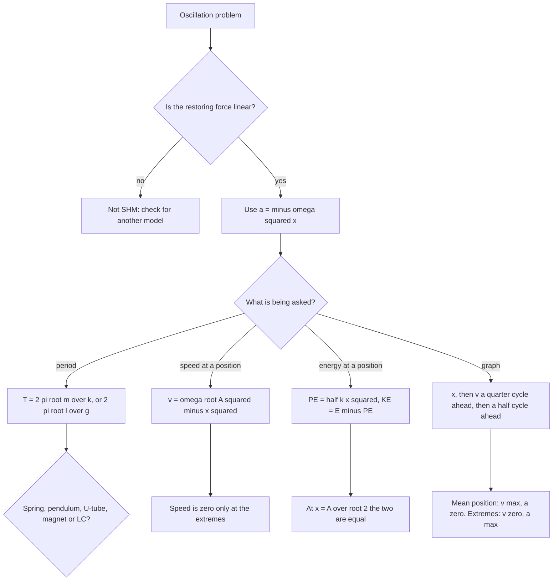

---

exam: cuet
examName: CUET UG
subject: physics
subjectName: Physics
topic: phy-013
topicName: SHM
weight: 4
country: india
generated: "2026-03-24T08:32:07.824604"
lastUpdated: "2026-06-19"
diagramPrompt: "Clean educational diagram showing SHM with clear labels, white background, labeled arrows for forces/fields/vectors, color-coded components, exam-style illustration"

---

# SHM

Simple harmonic motion is the only motion in mechanics whose exact solution is a sine, and that is why the chapter is so formula-friendly. A body in SHM has a restoring force proportional to displacement and directed back toward the equilibrium position. Once you have the restoring force law, the differential equation d²x/dt² = −ω²x has the solution x = A sin(ωt + φ), and the velocity, the acceleration, the energy and the time period all drop out of it.

The single most important thing to hold on to is the **phase ladder**: x, then v a quarter cycle ahead, then a half cycle ahead of x. Every graph, every "maximum at what position" question and every phase-ordering assertion is an application of that one fact.

### 🟢 Lite — Quick Review (1h–1d)
> The definition, the four equations, the two standard systems and the phase order.

**The definition.** A body executes SHM if the net restoring force on it is **F = −kx**, that is, directly proportional to the displacement and opposite in direction. The minus sign is the entire meaning of the word *restoring*.

From F = ma: **a = −(k/m)x = −ω²x**, so **ω = √(k/m)**.

**The four kinematic equations**

| Quantity | Equation in time | Equation in displacement |
|---|---|---|
| Displacement | x = A sin(ωt + φ) | — |
| Velocity | v = Aω cos(ωt + φ) | **v = ω√(A² − x²)** |
| Acceleration | a = −Aω² sin(ωt + φ) = −ω²x | a = −ω²x |
| Time period | T = 2π/ω = 2π√(m/k) | — |

**The phase ladder.** Displacement is the reference. Velocity **leads** displacement by **π/2** (a quarter cycle). Acceleration **leads** velocity by π/2, so acceleration **leads** displacement by **π** — x and a are in antiphase. Order: a → v → x, each a quarter cycle apart.

**Where the maxima are**

| Position | Displacement | Velocity | Acceleration | Energy form |
|---|---|---|---|---|
| Mean (equilibrium) | 0 | maximum, ±Aω | 0 | all kinetic |
| Extreme (end) | ±A | 0 | maximum, ∓Aω² | all potential |

**The two standard systems**

| System | Time period | Depends on | Independent of |
|---|---|---|---|
| Spring–mass | **T = 2π√(m/k)** | m, k | amplitude, g |
| Simple pendulum (small angle) | **T = 2π√(l/g)** | l, g | mass, amplitude |
| Liquid column in a U-tube | T = 2π√(L/2g) | L, g | liquid density |
| Bar magnet in a field | T = 2π√(I/MB) | I, M, B | orientation of magnet |
| LC circuit | T = 2π√(LC) | L, C | charge, resistance |

**Energy.** E = ½kA², constant. At displacement x: KE = ½k(A² − x²) and PE = ½kx². The energy is all potential at the extremes and all kinetic at the mean.

**Frequency and angular frequency.** f = 1/T in hertz; ω = 2πf = 2π/T in rad s⁻¹. They differ by 2π and confusing them is one of the most reliable ways to lose a mark.

### 🟡 Standard — Regular Study (2d–2mo)
> The concepts behind the equations, and the reasoning that answers the "why" questions.

**Why the acceleration equation defines SHM**

Write the second-order equation for a mass on a spring: m d²x/dt² = −kx, so d²x/dt² = −ω²x with ω² = k/m. Trial the solution x = Ae^(iωt), which gives d²x/dt² = −ω²x for any real ω. Taking the physically meaningful part, x = A sin(ωt + φ). Two consequences follow. The acceleration is always proportional to the displacement and always opposite in sign, so the force always points back to the equilibrium position; and the solution is a **harmonic** function, hence the name.

A quick test that separates SHM from other periodic motion: if the acceleration is proportional to displacement, it is SHM. Uniform circular motion is periodic but is not SHM, because its acceleration is centripetal, always pointing at the centre and always of constant magnitude. The **x-component of the radius of a point moving in a circle** does obey x = R cos ωt, and that projection is SHM. Projecting any sinusoidal motion onto a line gives SHM; that is why SHM and circular motion are treated together in questions.

**Velocity and acceleration as functions of displacement**

The time-domain equations contain the phase constant, which is awkward in a question that gives x. Differentiate and use the identity sin²θ + cos²θ = 1:

v = Aω cos(ωt + φ), so v² = A²ω² − ω²A² sin²(ωt + φ) = ω²(A² − x²)

giving **v = ω√(A² − x²)**. Three facts fall straight out. The speed is maximum at the mean and zero at the extremes. The sign of v tells whether the body is moving toward or away from the equilibrium position — v > 0 with x < 0 means it is returning. And a real speed only exists while x² ≤ A², which is the algebraic statement that the body cannot go beyond the extreme position.

Acceleration needs no derivation: a = −ω²x, valid at every instant, not just at the mean. An MCQ asking for the maximum acceleration expects Aω², and asking for the acceleration at the extreme should get the sign −ω²A when x = +A.

**Energy in SHM — where it goes**

Start from F = −kx and use the work-energy relation:

W = −∫kx dx from 0 to x = −½kx²

so PE = ½kx² measured from the equilibrium position. At the extreme, all the energy is potential: E = ½kA². Since the total energy is constant, KE = ½kA² − ½kx² = ½k(A² − x²) = ½mω²(A² − x²), which is the same as ½mv² with v from the previous section. Both expressions must agree at every point; if they do not, a sign has been dropped.

The useful ratios at a displacement x are KE/E = 1 − (x/A)² and PE/E = (x/A)². At x = A/√2 the two are equal, at x = A/2 the potential energy is a quarter of the total, and at x = A/3 the kinetic energy is 8/9 of the total. These ratios are common one-mark questions because the algebra is short.

**The spring–mass system**

From m d²x/dt² = −kx, ω = √(k/m) and **T = 2π√(m/k)**. Read the two dependences straight off the equation: quadrupling the mass doubles the period; quadrupling the spring constant halves it. The period is independent of amplitude, which is why a good watch keeps time whatever its balance amplitude.

A **vertical** spring looks different and behaves identically. Weight mg shifts the equilibrium down by x₀ = mg/k, and if you measure displacement from the *new* equilibrium the same equation holds. The period is unchanged: T = 2π√(m/k). The apparent difference in an accelerating lift is only a change in the effective g, and the period still does not contain g, because the weight merely shifts the equilibrium and does not alter k. This is worth stating explicitly, since "does g affect the period of a vertical spring?" is a standard trap.

**The simple pendulum**

For a bob of mass m on a light inextensible string of length l, the restoring torque about the pivot is −mgl sin θ and the moment of inertia is ml², so

ml² d²θ/dt² = −mgl sin θ

For small θ, sin θ ≈ θ in radians, which gives d²θ/dt² = −(g/l)θ, so ω = √(g/l) and **T = 2π√(l/g)**. The mass cancels: the bob's mass never appears, so a heavy bob and a light bob of the same length have the same period. The amplitude also cancels, within the small-angle approximation.

The approximation is the whole caveat. The period actually grows with amplitude, and the leading correction is T ≈ 2π√(l/g)(1 + θ₀²/16), which is accurate enough to use for a first-order estimate at any reasonable angle. A pendulum of amplitude 30° has a period about 1.7% longer than the small-angle formula gives, which is why precision pendulums use amplitudes under 5°.

**The liquid pendulum**

Fill a U-tube partly with liquid of total column length L and set it oscillating. The restoring force comes from the unbalanced weight of the height difference h, and the mass moved is ρA·l where l is the length of column that moves. Balancing gives d²h/dt² = −(2g/l)h, so **T = 2π√(L/2g)** with L the total length of the liquid column. The density of the liquid cancels out. A U-tube manometer used as an oscilloscope is the practical version of this.

### 🔴 Extended — Deep Study (3mo+)
> The extensions that turn the simple chapter into the full oscillation story.

**Spring combinations**

Two springs in **series** are equivalent to a single softer spring: 1/k_eff = 1/k₁ + 1/k₂, so k_eff = k₁k₂/(k₁ + k₂). The effective constant is smaller than either, so the period is longer. Two springs in **parallel** give k_eff = k₁ + k₂, a stiffer system than either, so the period is shorter. A mixture question usually gives the same k for both springs so that series gives k/2 and parallel gives 2k, which changes the period by a factor of 2 in either direction. Remember that the period contains √(m/k), so doubling k_eff divides T by √2.

**The floating-cylinder oscillator**

A uniform cylinder of density ρ_c floats vertically in a liquid of density ρ_w, with a length h immersed. Push it down a little and the extra upthrust is ΔF = ρ_w g A x, pushing it back up. The restoring acceleration is a = −ρ_w g A x/(ρ_c A h) = −(ρ_w/ρ_c)(g/h)x, so

**T = 2π√(hρ_c/(g(ρ_w − ρ_c)))**

This appears in competitive examinations because the density contrast is the interesting part. For a wooden cylinder of density 800 kg m⁻³ floating in water with h = 0.2 m, T = 2π√(0.2 × 800/(9.8 × 200)) = 2π√(160/1960) = 2π√0.0816 = 1.79 s. The interesting feature is that a bob denser than water cannot float, so the formula only makes sense for ρ_c < ρ_w; as ρ_c → ρ_w the period blows up, which is physically the statement that a cylinder neutrally buoyant and free to heave has no restoring force at all.

**Damped oscillations**

Real systems lose energy. Add a viscous force −bv, and the equation of motion becomes m d²x/dt² + b dx/dt + kx = 0. The solution has the form

x = A e^(−bt/2m) cos(ω't + φ), with **ω' = √(ω₀² − (b/2m)²)** where ω₀ = √(k/m)

So damping does two things: the amplitude decays exponentially as A₀e^(−bt/2m), and the frequency drops slightly below the natural value. The energy, being proportional to A², decays as e^(−bt/m), i.e. faster than the amplitude. **Under-damped** (b² < 4mk): oscillations continue. **Critically damped** (b² = 4mk): the system returns to equilibrium in the shortest time without oscillating, and this is what a good car suspension is tuned to. **Over-damped** (b² > 4mk): no oscillation at all, a slow return.

**Forced oscillations and resonance**

Add a driving force F₀ sin ω_d t. The steady-state amplitude is

A = (F₀/m) / √((ω₀² − ω_d²)² + (bω_d/m)²)

The denominator is smallest when the driving frequency matches the natural frequency, giving the maximum possible amplitude, and that is **resonance**. The sharpness is measured by the quality factor Q = ω₀m/b = π × (number of oscillations in the energy-decay time). High Q means a narrow, tall resonance; low Q means a broad, shallow one. The applied frequency is forced on the system, which is why a violin string driven at its own frequency rings and does not when driven elsewhere.

**Superposition and beats**

When two SHMs of the same amplitude and direction but slightly different frequencies act together, y = a sin ω₁t + a sin ω₂t resolves into a fast vibration at the mean frequency (ω₁ + ω₂)/2 whose amplitude is modulated by a slow beat at (ω₁ − ω₂)/2. The beats are heard when two nearby tuning forks are sounded together, and their frequency is the difference of the two frequencies. Beats are the experimental way of comparing frequencies without an absolute standard.

**Beyond the mechanical chapter — the same mathematics elsewhere**

- **LC circuit.** q = Q₀ cos(ωt), with ω = 1/√(LC) and T = 2π√(LC). Energy shuttles between the capacitor's electric field and the inductor's magnetic field, and the equations are identical to the mass-on-spring case with m → L and k → 1/C.
- **Bar magnet in a uniform field.** The magnet is twisted by a restoring torque −κθ, and with I its moment of inertia and MB the magnetic couple, **T = 2π√(I/MB)**. A suspended magnet is a torsion pendulum, which is exactly how a galvanometer is built.
- **Projectile motion, for contrast.** Horizontal motion is uniform and vertical motion is uniformly accelerated with constant g, so the path is a parabola. It is periodic in the mathematical sense only if the projectile keeps falling and coming back, which it does not. SHM and projectile motion share a solution form and almost nothing else, and questions that mix them are testing exactly this.

**Worked Example — spring–mass block**

A 0.5 kg mass hangs on a spring of constant 200 N m⁻¹ and is pulled 0.1 m from equilibrium, then released.

1. ω = √(k/m) = √(200/0.5) = √400 = 20 rad s⁻¹
2. T = 2π/ω = 2π/20 = **0.314 s**, so f = 1/T = 3.18 Hz
3. v_max = Aω = 0.1 × 20 = **2 m s⁻¹**
4. a_max = Aω² = 0.1 × 400 = **40 m s⁻²**
5. E = ½kA² = ½ × 200 × 0.01 = **1 J**
6. At x = 0.05 m, PE = ½ × 200 × 0.0025 = 0.25 J and KE = 1 − 0.25 = 0.75 J, matching the ratio rule 1 − (0.05/0.1)² = 0.75.

**Worked Example — pendulum on another planet**

A 1 m pendulum gives T = 2π√(1/9.8) = 2.01 s on Earth. On a planet with g = 4 m s⁻²:

1. T = 2π√(l/g) = 2π√(1/4) = 2π × 0.5 = **3.14 s**
2. The planet's lower g makes the pendulum slower, by the ratio √(9.8/4) = 1.56, and 2.01 × 1.56 = 3.14 s. Consistent.
3. A pendulum of the same length on the Moon (g = 1.62 m s⁻²) would have T = 2π√(1/1.62) = 4.94 s, which is why heavy bobs are used there: not to change the period, but so a small swing amplitude produces a visible displacement.

**Worked Example — vertical spring in a lift**

A 2 kg mass is on a spring of constant 100 N m⁻¹ inside a lift.

1. At rest, the extension is x₀ = mg/k = 2 × 9.8/100 = **0.196 m**.
2. The period is T = 2π√(m/k) = 2π√(2/100) = 2π × 0.1414 = **0.889 s**.
3. If the lift accelerates upward at 2 m s⁻², the apparent gravity is g + 2 = 11.8, so the new equilibrium is at x = 2 × 11.8/100 = 0.236 m, while the period stays 0.889 s.
4. In free fall the apparent g is zero, the spring returns to its natural length, and the system does not oscillate about any point — the period is no longer defined, because there is no restoring equilibrium.

**Worked Example — series and parallel springs**

Two identical springs of constant 50 N m⁻¹ support a 2 kg mass.

1. Series: k = 50 × 50/(50 + 50) = 25 N m⁻¹. T = 2π√(2/25) = 2π × 0.2828 = **1.78 s**.
2. Parallel: k = 50 + 50 = 100 N m⁻¹. T = 2π√(2/100) = 2π × 0.1414 = **0.889 s**.
3. Ratio T_series/T_parallel = 2, because the effective constant halves and the period goes as 1/√k.

### 🧠 Memory Anchors

- **"Restoring means minus."** F = −kx, a = −ω²x. The minus sign is the definition, not a bookkeeping detail.
- **"The ladder is x, v, a — quarter, quarter."** Velocity leads displacement; acceleration leads velocity; x and a are in antiphase. Every phase question is this sentence.
- **"Mean is fast, extreme is slow."** At x = 0 the speed is Aω; at x = ±A the speed is zero. If a graph shows the opposite, it is drawn wrong.
- **"Two systems, four variables."** The spring's T has m and k; the pendulum's T has l and g. Do not let a k appear in a pendulum question.
- **"Mass cancels for a pendulum, g cancels for a spring."** A bigger bob does not change the pendulum's period; a different planet does not change a spring's period.
- **"Energy is ½kA², always."** The answer to almost any "total mechanical energy" question, and it never changes with position or time.
- **"Same maths, different clothes."** LC circuits, bar magnets and torsion pendulums are all the mass-on-spring equation relabelled. Recognising the pattern is worth marks on its own.
- **Flashcard Q&A:**
  - *Angle by which velocity leads displacement?* → π/2, or T/4.
  - *Phase relation between x and a?* → antiphase, π apart.
  - *Displacement at which KE = PE?* → x = ±A/√2.
  - *Why is a simple pendulum's period independent of mass?* → m cancels from ml²θ'' = −mgl sin θ.
  - *What does a larger b do?* → the amplitude decays faster and the frequency drops slightly; enough of it removes oscillation entirely.
  - *Condition for resonance?* → driving frequency equal to natural frequency.
  - *Two springs in series: is k bigger or smaller?* → smaller, k₁k₂/(k₁+k₂), so the period gets longer.

### 🎯 Exam Traps & Error Log

1. **Writing F = kx.** Without the minus sign, the force accelerates the body away from equilibrium and the solution is an exponential runaway, not an oscillation.
2. **Saying velocity is maximum at the extreme position.** It is zero there; the speed is maximum only at the mean position.
3. **Using the small-angle pendulum formula at a large amplitude.** The restoring torque is −mgl sin θ, and only for small θ does sin θ ≈ θ hold in radians. The period is longer than 2π√(l/g) at larger amplitudes.
4. **Confusing ω with f.** ω = 2π/T in rad s⁻¹, f = 1/T in Hz. Mixing them gives answers wrong by a factor of 2π.
5. **Putting g into the spring-mass period.** T = 2π√(m/k) has no g in it. A vertical spring's period is the same as a horizontal one's.
6. **Using degrees where radians are needed.** The small-angle approximation sin θ ≈ θ is only valid with θ in radians; 30° is 0.524 rad, and sin 30° = 0.5 rather than 0.524.
7. **Forgetting that v = ω√(A² − x²) has no sign.** The formula gives a speed; the direction comes from whether x is decreasing or increasing.
8. **Saying the energy of an SHM is constant in a damped oscillator.** It is conserved only for the ideal undamped system; with damping, E ∝ e^(−bt/m).
9. **Writing the energy as ½kA² when the question wants the energy at a position.** They are equal only at x = ±A.
10. **Treating uniform circular motion as SHM.** It is periodic but its acceleration is not proportional to displacement. Only a projection of it is SHM.
11. **Saying the period depends on amplitude for an ideal spring.** It does not; that amplitude dependence is a real-pendulum effect, not a spring effect.
12. **Reversing the spring-combination rule.** Series reduces k, parallel adds it, and the period moves the opposite way because of the square root.

### 🧪 Self-Test — 8 Questions with Worked Answers

Attempt each on paper first. These are the eight shapes this chapter actually produces.

1. **A mass on a spring has period 0.4 s. The mass is doubled. Find the new period, then the period if the spring constant is also doubled.**

   T ∝ √(m/k). Doubling m gives T₂ = 0.4 × √2 = **0.566 s**.
   Then m → 2m and k → 2k gives 2m/2k = m/k unchanged, so the period returns to **0.4 s**.

2. **A particle executes SHM with amplitude 5 cm and period 2 s. Find its maximum speed, maximum acceleration and total energy per unit mass.**

   ω = 2π/T = π rad s⁻¹.
   v_max = Aω = 0.05 × π = **0.157 m s⁻¹**.
   a_max = Aω² = 0.05 × π² = **0.494 m s⁻²**.
   Energy per unit mass = ½v_max² = ½ × 0.0247 = **0.0123 J kg⁻¹**. It is easier to use ½v_max² than to find k first, since the two forms are the same expression.

3. **At what displacement is the kinetic energy half the total energy for the oscillator in Q2?**

   KE = ½k(A² − x²) and E = ½kA². Setting KE = E/2 gives A² − x² = A²/2, so x² = A²/2 and **x = ±A/√2 = ±3.54 cm**. This is the same displacement at which KE = PE, because both statements say KE is half the total energy; the coincidence is the useful part of the result.

4. **A 0.5 kg mass on a 100 N m⁻¹ spring is released from rest at 0.1 m from equilibrium. Find its speed at the mean position and the time to first reach the mean position.**

   E = ½kA² = ½ × 100 × 0.01 = 0.5 J, all kinetic at the mean.
   ½mv² = 0.5 → v = √(2 × 0.5/0.5) = **√2 = 1.41 m s⁻¹**.
   Starting from rest at the extreme means the motion is x = A cos ωt, and it reaches the mean at ωt = π/2, i.e. a quarter period: T = 2π√(0.5/100) = 2π × 0.0707 = 0.444 s, so t = **0.111 s**.

5. **Explain why a bob of mass 0.1 kg and a bob of mass 10 kg hung on identical 1 m strings have the same period, while a bob of the same mass on a 4 m string has twice the period.**

   The equation of motion ml²θ'' = −mgl sin θ has m on both sides, so the mass cancels and the period depends only on l and g: both bobs give T = 2π√(1/9.8) = 2.01 s. The 4 m string gives T = 2π√(4/9.8) = 4.02 s, exactly double, because T ∝ √l and √4 = 2. Mass is irrelevant for a pendulum; length is decisive.

6. **A block is attached to a spring and undergoes SHM with T = 2 s. Find the ratio of potential to kinetic energy when the displacement is half the amplitude, and the period of the same system if the spring is cut in half and both halves are used in parallel.**

   PE/E = (x/A)² = (1/2)² = 1/4, so KE/E = 3/4, and **PE:KE = 1:3**.
   Two identical half-springs in parallel give k_eff = k/2 + k/2 = k, the original constant, so the period is unchanged at **2 s**. Cutting a spring and reconnecting in parallel preserves the effective constant, which is a cleaner result than the obvious "it got shorter" intuition suggests.

7. **A driving force of frequency 8 Hz is applied to an oscillator of natural frequency 8 Hz with light damping. Describe what happens, and then what happens if the damping is increased while the driving frequency stays the same.**

   With light damping and a matched driving frequency, the system is at **resonance**: it reaches a large steady amplitude, and the energy delivered each cycle exactly replaces the energy lost to damping. The amplitude is limited by damping, and with less damping the peak is higher and the resonance band narrower (higher Q). Increasing the damping with the driving frequency held fixed reduces the steady amplitude and broadens the resonance. The peak stays at the natural frequency, because that is where the denominator of the amplitude expression is smallest, but the peak height falls and the curve becomes flatter and wider.

8. **A cylinder of density 900 kg m⁻³ floats in water with 15 cm of its length immersed. Find the period of vertical oscillation. (ρ_water = 1000 kg m⁻³, g = 9.8 m s⁻².)**

   Restoring acceleration is a = −(ρ_w/ρ_c)(g/h)x, so T = 2π√(hρ_c/(g(ρ_w − ρ_c))).
   T = 2π√(0.15 × 900/(9.8 × 100)) = 2π√(135/980) = 2π√0.1378 = 2π × 0.3712 = **2.33 s**.
   The formula needs ρ_w > ρ_c, since only then is there a net upthrust that grows when the cylinder is pushed down; that is why the density difference, not the density, appears in the denominator.

### 💡 Pro Tips

1. **Decide what the question is asking for before writing anything.** Period, speed at a position, energy at a position, or a graph — four different questions with four different equations, and they are easy to confuse under time pressure.
2. **Use the phase ladder to read every graph.** A graph is correct only if v is a quarter cycle ahead of x and a is a half cycle ahead of x. Check that first and most graph errors disappear.
3. **Convert amplitude to metres before squaring it.** 5 cm is 0.05 m, and 0.05² = 0.0025 rather than 0.25 — a factor of 100 that no mark survives.
4. **Memorise the dependence table as a grid.** Spring: T ∝ √m, T ∝ 1/√k. Pendulum: T ∝ √l, T ∝ 1/√g. Every "what happens if" MCQ is read straight off the grid.
5. **Prefer ½mv_max² to ½kA² when you do not know k.** The two are identical at the mean position, and the velocity form is often easier because v_max comes straight from Aω.
6. **For any "ratio of energies at displacement x" question, go straight to (x/A)².** Every ratio question reduces to that one fraction, and the algebra disappears.
7. **State the assumption for pendulum questions.** Write "for small oscillations, T = 2π√(l/g)" and you have already protected yourself if the amplitude is at all large.
8. **Keep the ideal-gas and oscillator constants in separate memory stores.** ω appears in both this chapter and the waves chapter with different meanings; the time-period version is safer for SHM.
9. **Check the dimensions of ω, f and T once a week.** rad s⁻¹, Hz, seconds. One line of writing prevents a 2π error that is otherwise invisible.
10. **Recognise the shared mathematics when it appears outside mechanics.** A question about an LC circuit or a suspended magnet is an SHM question in disguise, and solving it as one saves the whole detour.

---

*Content adapted based on your selected roadmap duration. Switch tiers using the selector above.*

## Continue your study

- **[View this topic in your CUET UG roadmap](/roadmap/?exam=cuet&duration=1mo)** — see where "SHM" fits in your personalised plan
- **[Build a quick revision plan](/roadmap/?exam=cuet&duration=1d)** — 1-day sprint covering highest-weight topics
- **[CUET UG exam overview](/exams/cuet/)** — pattern, eligibility, and syllabus
- **[All Physics notes](/notes/cuet/physics/)** — browse sibling topics in this subject

