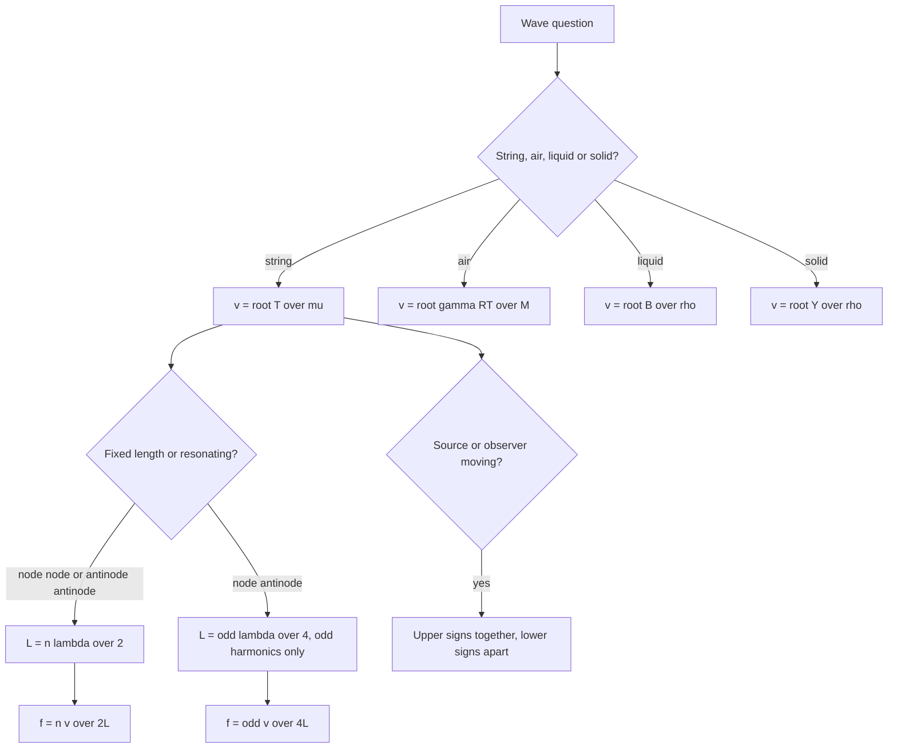

---

exam: cuet
examName: CUET UG
subject: physics
subjectName: Physics
topic: phy-014
topicName: Waves
weight: 4
country: india
generated: "2026-03-24T08:32:07.825351"
lastUpdated: 2026-03-24
diagramPrompt: "Clean educational diagram showing Waves with clear labels, white background, labeled arrows for forces/fields/vectors, color-coded components, exam-style illustration"

---
# Waves

A wave is a disturbance that carries energy and momentum through a medium while the medium itself stays put. Every particle of the medium oscillates about an equilibrium position and returns to it; nothing travels. The pattern of motion does. That single sentence separates wave motion from a stream of particles, and it is the idea behind most of the conceptual questions in this chapter.

The chapter divides into three jobs: find the speed of a wave in a given medium, find the frequencies a system can sustain (strings and pipes), and find what a moving source or observer hears (Doppler). Learn it in that order and the material stacks rather than piles up.

### 🟢 Lite — Quick Review (1h–1d)
> The four formulas, the pipe rule, and the sign convention for Doppler.

**The master relation.** v = fλ. One equation connects speed, frequency and wavelength, and it holds for every kind of wave. If one of the three changes, the other two adjust.

**Wave speed in a medium**

| Medium | Formula | Typical value |
|---|---|---|
| Stretched string | v = √(T/μ) | set by tension and mass per length |
| Gas | v = √(γP/ρ) = √(γRT/M) | 332 m s⁻¹ in air at 0 °C |
| Liquid | v = √(B/ρ), B bulk modulus | about 1500 m s⁻¹ in water |
| Solid rod | v = √(Y/ρ), Y Young's modulus | about 5000 m s⁻¹ in steel |

T is tension in N, μ the linear mass density in kg m⁻¹, R = 8.314 J mol⁻¹ K⁻¹, M molar mass in kg mol⁻¹, γ = 1.4 for air.

**Speed of sound in air, two ways**

- Exact, from the gas laws: v = √(γRT/M), so v ∝ √T in kelvin.
- Empirical and quick: **v = 331 + 0.6 t** m s⁻¹ with t in °C. At 0 °C, 331 m s⁻¹; at 20 °C, 343 m s⁻¹; at 27 °C, 347 m s⁻¹.

**Transverse versus longitudinal.** A transverse wave has particle displacement perpendicular to the direction of travel — light, string waves, water surface waves, S-waves in an earthquake. A longitudinal wave has displacement along the direction of travel — sound in air, pressure waves in a liquid, P-waves in an earthquake. Sound in air is longitudinal because air cannot sustain a shear stress; in a solid it can, and a shear wave is transverse.

**Standing waves in pipes — the rule that decides everything**

| Pipe | Ends | Length condition | Frequencies |
|---|---|---|---|
| Open (both ends open) | antinode, antinode | L = nλ/2 | f = nv/2L; n = 1, 2, 3 … all harmonics |
| Closed (one end closed) | node, antinode | L = (2n − 1)λ/4 | f = (2n − 1)v/4L; **odd harmonics only** |

**The same table for strings.** A string fixed at both ends is identical to an open pipe in its boundary conditions: L = nλ/2 and f = nv/2L.

**Doppler effect.** f' = f(v ± v_o)/(v ∓ v_s), where v is the wave speed, v_o the observer's speed and v_s the source's speed, all measured relative to the medium. **Upper signs when the source and observer move towards each other, lower signs when they move apart.**

**Beats.** f_beat = |f₁ − f₂|, measured in beats per second.

**Two-slit interference.** Fringe width β = Dλ/d, with D the screen distance and d the slit separation.

### 🟡 Standard — Regular Study (2d–2mo)
> The reasoning behind each formula, and the comparisons that appear as MCQs.

**Energy travels, matter does not**

Take a rope fixed at one end and give it a shake. The pattern of the disturbance moves down the rope, but any given piece of the rope moves back and forth about one place and returns. The same is true of the air in a sound wave: each air element oscillates about its equilibrium position while the pressure pulse moves through it at 332 m s⁻¹. What propagates is energy and momentum, not material.

Two corollaries that MCQs love. A swimmer floating in a boat that begins to bob does not travel to the shore with the boat's motion, and the wavelength is a property of the wave while the frequency is set by the source.

**Why v = √(T/μ) for a string**

Treat a short length Δx of string as a separate piece joined to the rest. The tension on the two ends pulls it into a curve; to keep the piece moving in a circle of radius R requires a resultant inward force, and that resultant is the difference between the two tensions. For a small arc, T' − T = T Δx/R, and setting this equal to the centripetal force per unit length, T/R = μv², gives μv² = T' − T. The curve of a travelling wave has a radius of curvature that varies over one wavelength, and the result of the algebra is v = √(T/μ). The two practical consequences are worth stating: a guitarist raises the pitch by tightening the string, and a heavier or thicker string of the same length sounds lower.

**Why v = √(γP/ρ) for a gas**

A sound wave in a gas is a compressional wave travelling at the speed of a pressure disturbance. Newton's formula assumes the compressions and rarefactions occur isothermally; Laplace showed this is wrong because compressions are fast enough to be adiabatic. Replacing the isothermal bulk modulus with the adiabatic one, B = γP, gives v = √(γP/ρ). Using the ideal-gas law ρ = PM/RT gives v = √(γRT/M), which is the form to use in numericals.

The important results follow immediately. Sound is faster in a lighter gas, so helium (M = 4 g mol⁻¹) carries sound at roughly 1007 m s⁻¹ against air's 331 — which is why a helium voice sounds squeaky to a listener but the helium itself is not moving faster. Sound is faster in a hotter gas, since v ∝ √T, so sound travels 4% faster at 27 °C than at 0 °C. And sound needs a medium, which is why there is no sound in a vacuum.

**The wave equation and its parts**

y(x, t) = a sin(ωt − kx + φ), where a is amplitude, ω = 2πf the angular frequency, k = 2π/λ the propagation constant and φ the initial phase. Two points follow. A point of constant phase satisfies ωt − kx = constant, so dx/dt = ω/k = fλ = v: the wave velocity falls straight out of the phase condition. And the whole pattern repeats in space with period λ and in time with period 1/f.

**Interference, coherence and the two-slit experiment**

Superposition says that when two waves overlap, the resultant displacement is their algebraic sum. Two waves interfere constructively where their path difference is nλ and destructively where it is (2n + 1)λ/2. The two-slit geometry converts a path difference into a position on a screen: for a point at distance x from the central maximum, the path difference is approximately xd/D, so the bright fringes satisfy x = nλD/d and the fringe width is

**β = λD/d**

A question can be asked from either end: change d and the fringes compress; change D and they spread; change λ and they spread. Bright fringes are at the centre and at equal intervals, dark ones exactly midway. The condition for sustained interference is coherence — a constant phase difference, which is why two independent sources do not produce a stable pattern while two slits illuminated by the same source do.

**Beats and how instruments are tuned**

Two tuning forks of 512 Hz and 515 Hz sounded together give 3 beats per second, so the beat frequency is the absolute difference. Increase the frequency of the lower fork and the beat rate falls to zero, at which point the two forks are exactly in unison — beats disappearing is the practical test for tuning. The beat period is 1/|f₁ − f₂|, which is a quarter second for the 3 bps case.

**Standing waves: nodes and antinodes**

Two identical waves travelling in opposite directions add to give a wave that does not travel. Particles at the nodes have zero amplitude and particles at the antinodes have the maximum; between them everything moves in phase. The standing wave is best written as a sum of two travelling waves, y = 2a sin kx cos ωt, where the sine factor locates the nodes and the cosine supplies the time behaviour. The distance between two adjacent nodes is λ/2, and between two adjacent antinodes also λ/2.

**Strings, pipes and the boundary conditions that set the length**

A string fixed at both ends has a node at each end, so L must contain a whole number of half-wavelengths: L = nλ/2, giving f = nv/2L. A pipe open at both ends has an antinode at each end — a pressure pulse reflects in phase from an open end, and the air at the mouth is free to move, so displacement is a maximum — giving the same L = nλ/2 and the same f = nv/2L. A pipe closed at one end has a node in displacement at the closed end, since the air cannot move against a rigid cap, and an antinode at the open end, so L must contain an odd number of quarter-wavelengths: L = (2n − 1)λ/4, giving f = (2n − 1)v/4L.

The closed pipe supporting only odd harmonics is not a quirk. A closed pipe of length L is acoustically the same length as an open pipe of 2L, so it sounds the note an open pipe twice as long would, and it has no octave harmonic — which is why a stopped pipe sounds hollow and thin compared with an open one of the same pitch.

**End correction.** In a real open pipe the wave does not reflect exactly at the mouth, because the air near the end is partly free to move. The effective length is L_eff = L + 2e, with e the end correction, roughly 0.6 times the pipe radius for each open end. Ignoring it is acceptable for a straight numerical and wrong for a careful one.

**Doppler effect — where it comes from**

Two effects are at work, and separating them explains the formula. If the source moves towards a stationary observer, it compresses the wavefronts in front of itself, so the wavelength genuinely shortens. If the observer moves towards a stationary source, no wavelength changes at all, but the observer meets the crests more often, so the observed frequency rises. For light, which has no medium to be stationary with respect to, the two cases are equivalent and the relativistic formula f' = f√((1 + β)/(1 − β)) applies, with β = v/c.

**Quality of a musical note.** Pitch is set by frequency. Loudness is set by intensity, and intensity is proportional to amplitude squared, so doubling the amplitude makes a note four times as intense — and roughly 6 dB louder, since loudness is logarithmic. Timbre is set by the mixture of harmonics, which is why a violin and a piano playing the same note are distinguishable.

### 🔴 Extended — Deep Study (3mo+)
> Resonance methods, shock waves, intensity, and the quantitative detail.

**Resonance column method**

The classic laboratory measurement of the speed of sound. A vertical pipe closed at the bottom is dipped into water, and a tuning fork of unknown frequency is held over the open end. The air column resonates when its length equals an odd multiple of λ/4, and the first resonance is the easiest to identify. L₁ + e = λ/4 gives the wavelength once the end correction e is known or eliminated; the second resonance at L₂ + e = 3λ/4 lets e be removed by subtraction, since

L₂ − L₁ = λ/2, so λ = 2(L₂ − L₁) and v = fλ

This method is the standard answer to "how is the wavelength of sound measured without seeing it", and the fact that only odd multiples appear is the direct experimental confirmation of the node-at-closed-end rule.

**Resonance in strings — the sonometer**

Two fixed bridges of adjustable separation carry a string under a known tension and mass per unit length. A vibrating tuning fork is held on the string, and a paper rider slides along until it stops slipping — that point is a node. Measuring the distance between two consecutive nodes gives λ/2, hence the frequency. The frequency of the nth harmonic is f = nv/2L, so a guitar with strings of the same length and tension but different linear densities sounds different notes, and shortening the speaking length raises the pitch, which is why pressing a string against a fret changes the note.

**Intensity and energy flux**

Intensity is energy crossing unit area per unit time, I = P/A. For a plane sound wave, I = ½ρvω²a², from which two results matter: intensity is proportional to the square of the amplitude, and the energy carried by a wave of fixed amplitude grows as the square of the frequency. The energy density of a progressive wave is uniform on average, and energy flows at the wave speed, so the average power per unit area is energy density times speed.

For a spherical wave the intensity falls as 1/r², since the same power spreads over an area proportional to r². This is why a sound becomes inaudible with distance, and it is the inverse-square law, not absorption, that does most of the work.

**Shock waves and the Mach cone**

When a source moves faster than the wave it produces, the wavefronts pile up into a cone trailing behind the source. The **Mach number** is M = v_source/v_wave, the half-angle α of the cone satisfies sin α = 1/M, and M = 1 is the sound barrier: at M slightly above 1 the Mach cone is a very wide, flat fan, and at M = 2 it is a 30° half-angle. A supersonic aircraft produces a sonic boom when the cone sweeps past an observer, which is a single sharp event rather than a continuous noise. The conventional speed of sound at 0 °C, 331 m s⁻¹, is what the M = 1 boundary is measured against.

**Reverberation**

Sound reflected many times from hard walls persists after the source stops, and its persistence time is the reverberation time. Long reverberation in a hall blurs speech, so halls are lined with soft material to absorb, and the absorption coefficient of a material is the fraction of incident sound energy it absorbs. This is the same energy logic as radiation and as viscous damping: anything rough or soft absorbs, anything smooth and hard reflects.

**Worked Example — fundamental frequency of a stretched string**

A string 1 m long has mass 0.01 kg and is under tension 100 N.

1. μ = m/L = 0.01/1 = 0.01 kg m⁻¹
2. v = √(T/μ) = √(100/0.01) = √10⁴ = 100 m s⁻¹
3. Fixed at both ends, so f₁ = v/2L = 100/2 = **50 Hz**
4. Doubling the tension multiplies v by √2 and f₁ by √2 as well; doubling the mass per metre halves the frequency. Both follow directly from the formula.

**Worked Example — open and closed pipes**

A pipe 0.6 m long contains air at 20 °C, so v = 331 + 0.6 × 20 = 343 m s⁻¹.

1. Open pipe, fundamental: f = v/2L = 343/1.2 = **285.8 Hz**
2. Closed pipe, fundamental: f = v/4L = 343/2.4 = **142.9 Hz**
3. The closed pipe of length L and the open pipe of length 2L have the same fundamental, which is the statement that a stopped pipe sounds an octave lower than an open pipe of twice the length.
4. The next frequency available in the closed pipe is 3 × 142.9 = 428.7 Hz, not 285.8 Hz, because only odd harmonics exist.

**Worked Example — Doppler with a moving siren**

A siren emitting 500 Hz is carried at 20 m s⁻¹ towards a stationary listener, with the speed of sound 340 m s⁻¹.

1. f' = f·v/(v − v_s) = 500 × 340/(340 − 20) = 500 × 340/320
2. f' = **531.3 Hz**
3. The rise is small, 31 Hz for a source moving at 6% of the sound speed, because the denominator only changes by 6%.
4. If instead the listener moved towards a stationary siren at 20 m s⁻¹, f' = f(v + v_o)/v = 500 × 360/340 = **529.4 Hz**. The two results are close but not identical, which is exactly the point: the source case changes the wavelength, the observer case changes the rate of interception.

**Worked Example — Young's double slit**

Two slits 0.5 mm apart are 1 m from a screen, lit with light of wavelength 600 nm.

1. β = λD/d = (600 × 10⁻⁹ × 1)/(0.5 × 10⁻³) = 600 × 10⁻⁹ × 2000 = 1.2 × 10⁻³ m
2. **β = 1.2 mm**
3. The first dark fringe is at β/2 = 0.6 mm, and the fifth bright fringe is at 5 × 1.2 = 6 mm.
4. Changing the slit separation to 0.25 mm halves the fringe width to 0.6 mm, since β ∝ 1/d.

**Worked Example — speed of sound in air at a temperature**

Find the speed of sound in air at 27 °C, given γ = 1.4 and M = 29 × 10⁻³ kg mol⁻¹.

1. T = 300 K.
2. v = √(γRT/M) = √(1.4 × 8.314 × 300/0.029) = √(3491.9/0.029) = √120 410 = **347 m s⁻¹**
3. Check with the empirical rule: 331 + 0.6 × 27 = 347.2 m s⁻¹. The two agree, which is a good check that the temperature has been converted correctly.

**How to read a standing-wave diagram**

Count the nodes and multiply the distance between them by 2 to get λ. If the pattern spans a length marked on the diagram, divide by the number of half-wavelengths it contains: n = 2L/λ for a node-node pattern and n = 2L/λ for an antinode-antinode one, but n = (2L/λ − 1) for a node-antinode one, since an odd number of quarter-wavelengths fits. Getting the "odd" into that count is what distinguishes the closed-pipe questions from the open-pipe ones.

### 🧠 Memory Anchors

- **"Nodes at fixed ends, antinodes at open ends."** Every pipe and string question is decided by this sentence before any algebra begins.
- **"Closed pipe means odd harmonics only."** A stopped pipe of length L sounds like an open pipe of length 2L. Say that sentence and you can derive the rest.
- **"Energy moves, matter does not."** Medium particles oscillate in place; that is why a floating swimmer does not drift.
- **"Sound is slower in heavy gases, faster in hot ones."** v ∝ √(1/M) and v ∝ √T. Both are direct readings of the formula.
- **"Tighter string, higher note; thicker string, lower note."** v = √(T/μ), and f = v/2L carries it straight to pitch.
- **"Beats measure the difference; silence means unison."** Turning fork tuning is a difference measurement, not an absolute one.
- **"Amplitude squared is loudness."** Double the amplitude, quadruple the intensity, and add about 6 dB.
- **Flashcard Q&A:**
  - *Fringe width?* → λD/d, wider screen or shorter wavelength spreads the fringes, closer slits spread them.
  - *End correction?* → L_eff = L + 2e with e ≈ 0.6r for each open end.
  - *Mach number?* → source speed divided by sound speed; M = 1 is the sound barrier.
  - *Why does a stopped pipe sound thinner?* → it has no even harmonics, so its tone lacks the octave.
  - *Supersonic source?* → the wavefronts pile into a cone; a sonic boom is the cone passing an observer.
  - *Is air able to carry a transverse wave?* → no; air cannot sustain shear, so sound in air must be longitudinal.

### 🎯 Exam Traps & Error Log

1. **Using 2L in the closed-pipe formula.** L = (2n − 1)λ/4 and f = (2n − 1)v/4L for a closed pipe; 2L and nv/2L are for open pipes and fixed strings.
2. **Treating a closed pipe as if it supported all harmonics.** It supports only f, 3f, 5f. Offering 2f as an answer is the giveaway.
3. **Mixing up the Doppler signs.** Upper signs when the source and observer approach each other, lower signs when they separate. A common slip is using the upper sign in the denominator for an approaching source.
4. **Assuming the source and observer cases give the same answer.** They do not, except in the non-relativistic limit for sound at low speeds, and the difference grows with speed.
5. **Using M in grams per mole in v = √(γRT/M).** M must be in kg mol⁻¹, so 29 g mol⁻¹ is 0.029.
6. **Forgetting the √T in the speed of sound.** Sound at 27 °C is about 347 m s⁻¹, not 331 and not 331 + 27.
7. **Confusing node and antinode at a closed pipe end.** A closed end is a node of displacement and an antinode of pressure; these questions are about displacement.
8. **Ignoring the direction of a wave in a diagram.** A transverse wave and a longitudinal wave look different on the same string drawing, and mistaking them inverts the phase relationships.
9. **Taking the fringe width formula as λd/D.** It is λD/d — fringe width increases with screen distance and decreases with slit separation.
10. **Saying the medium particles travel with the wave.** They oscillate about equilibrium and return; only the pattern and the energy travel.
11. **Writing the beat frequency as (f₁ + f₂).** It is the absolute difference, which is why beats are only produced by nearly equal frequencies.
12. **Forgetting the end correction when a question expects it.** L_eff = L + 2e applies to each open end, so a closed pipe with one open end gains 2e and an open pipe with two gains 4e.

### 🧪 Self-Test — 8 Questions with Worked Answers

Attempt these on paper first. Each maps to one of the standard question shapes for this chapter.

1. **A guitar string 0.64 m long has a linear density of 6.0 × 10⁻³ kg m⁻¹ and is under a tension of 80 N. Find its fundamental frequency.**

   v = √(T/μ) = √(80/6.0 × 10⁻³) = √(13 333) = 115.5 m s⁻¹.
   f₁ = v/2L = 115.5/(2 × 0.64) = 115.5/1.28 = **90.2 Hz**. This is close to the F2 note (87.3 Hz), which is where a low guitar string sits. Check the units: 80 N divided by 6 × 10⁻³ kg m⁻¹ has units of m² s⁻², so the square root is a speed.

2. **An open organ pipe 1.2 m long sounds a note at 20 °C. Find the fundamental, the first overtone, and the frequency of the same-length pipe closed at one end. (v = 343 m s⁻¹.)**

   Open pipe: f₁ = 343/2.4 = **142.9 Hz**. The first overtone is the second harmonic, 2f₁ = **285.8 Hz**.
   Closed pipe of the same length: fundamental = 343/4.8 = **71.4 Hz**, an octave below the open pipe, and its first overtone is 3 × 71.4 = 214.3 Hz rather than 142.9 Hz. A stopped pipe sounds an octave lower and hollower, both facts coming from the same boundary condition.

3. **A source of 440 Hz and a source of 456 Hz sound together. Find the beat frequency, the beat period, and what happens when the frequency of the first source is raised to 444 Hz.**

   Beat frequency = |456 − 440| = **16 Hz**, that is 16 beats per second.
   Beat period = 1/16 = **0.0625 s**, the time for the loudness to complete one cycle of waxing and waning.
   At 444 Hz the difference is 12 Hz, so the beats slow to 12 per second. Continuing to raise the lower frequency until it equals 456 Hz drives the beat rate to zero, and the two sounders then reinforce each other into a single steady tone of 456 Hz.

4. **A train approaches a stationary observer at 30 m s⁻¹, its horn sounding at 500 Hz. The speed of sound is 340 m s⁻¹. Find the observed frequency, and then find the frequency if the train passes the observer at the same speed.**

   Approaching: f' = f·v/(v − v_s) = 500 × 340/310 = **548.4 Hz**.
   Receding: f' = f·v/(v + v_s) = 500 × 340/370 = **459.5 Hz**.
   The drop from 548 Hz to 459 Hz at the moment of passing is the familiar effect, and the drop is not symmetric because the denominator changes from 310 to 370 rather than from 320 to 360.

5. **Explain why the frequency of a wave does not change when it passes from air into water, while its wavelength and speed both do.**

   The frequency is set by the source, which is oscillating at a fixed rate; it is imposed on every medium the wave enters. The speed is a property of the medium, and water, being far denser and far less compressible than air, carries the wave at about 1500 m s⁻¹ against 343 m s⁻¹ in air. Since v = fλ with f fixed, the wavelength must increase in proportion, from 343/440 = 0.78 m in air to 1500/440 = 3.4 m in water. The same argument applies at every boundary a wave crosses, and it is the reason a change of medium changes the refraction angle.

6. **Two strings of the same length are tuned to the same pitch. String A has twice the linear density of string B. Compare their tensions.**

   Same length and same frequency means the same wave speed, since v = 2Lf. With v the same and μ_A = 2μ_B, the relation v = √(T/μ) gives T_A/T_B = μ_A/μ_B = 2. So **string A is under twice the tension**. A thicker, heavier string must be pulled harder to reach the same note, which is exactly why bass strings are both thicker and more tensioned than treble strings.

7. **A pipe closed at one end, of length 0.85 m and radius 2 cm, resonates to a fork of frequency 100 Hz. Take the end correction as 0.6r and find the speed of sound. (r = 0.02 m.)**

   End correction e = 0.6 × 0.02 = 0.012 m, and the closed pipe has one open end, so L_eff = 0.85 + 0.024 = 0.874 m.
   For a closed pipe, f = v/4L_eff, so v = 4fL_eff = 4 × 100 × 0.874 = **349.6 m s⁻¹**.
   That corresponds to about 30 °C, so the measurements are self-consistent. Ignoring the end correction would have given 340 m s⁻¹, a 2.8% error that matters for precision work.

8. **A jet aircraft flies at 500 m s⁻¹ at an altitude where the speed of sound is 330 m s⁻¹. Find the Mach number and the half-angle of its shock cone.**

   M = v_source/v_wave = 500/330 = **1.52**, so the aircraft is supersonic.
   The Mach cone half-angle α satisfies sin α = 1/M = 1/1.52 = 0.658, so α = **41.1°**.
   A cone this narrow, trailing behind the aircraft and sweeping past an observer as it passes, is heard as a sonic boom. The half-angle shrinks as the aircraft goes faster, so the cone angle itself is a direct measure of speed.

### 💡 Pro Tips

1. **Identify the boundary conditions before any formula.** Fixed end, open end, fixed-fixed, open-open, closed-open. Choosing the length condition first removes every possible pipe error.
2. **Write μ = m/L explicitly** whenever a string's mass and length are given. A large share of string errors are really mass-per-length errors.
3. **Use M in kg mol⁻¹ in the speed-of-sound formula,** and check that the result comes out near 330 to 350 m s⁻¹ in air. A result of 11 000 m s⁻¹ means M is still in grams.
4. **Decide Doppler signs by drawing arrows.** Source and observer moving toward each other means both signs flip in the favourable direction. Spend the five seconds.
5. **Use the empirical v = 331 + 0.6t for quick estimates** and the exact v = √(γRT/M) when the question gives γ or M. Knowing both is worth a mark on either.
6. **For pipe questions, remember that the closed pipe of length L equals the open pipe of length 2L.** This one sentence answers half the pipe questions without algebra.
7. **Memorise the node and antinode locations as a list, not a picture:** string fixed-fixed → nodes at both ends; open pipe → antinodes at both ends; closed pipe → node at the closed end, antinode at the open end.
8. **Check the beat question with the units.** Beat frequency is in Hz (beats per second), and the beat period is its reciprocal. Mixing them is the standard error.
9. **For Young's double-slit questions, decide whether you want β or the fringe position** and use x = nλD/d for both; the position formula just adds the n.
10. **State that the frequency is fixed by the source** when a wave changes medium. It is the sentence that makes the "speed and wavelength change, frequency does not" answer writeable in one line.

---

*Content adapted based on your selected roadmap duration. Switch tiers using the pill selector above.*

## Continue your study

- **[View this topic in your CUET UG roadmap](/roadmap/?exam=cuet&duration=1mo)** — see where "Waves" fits in your personalised plan
- **[Build a quick revision plan](/roadmap/?exam=cuet&duration=1d)** — 1-day sprint covering highest-weight topics
- **[CUET UG exam overview](/exams/cuet/)** — pattern, eligibility, and syllabus
- **[All Physics notes](/notes/cuet/physics/)** — browse sibling topics in this subject

