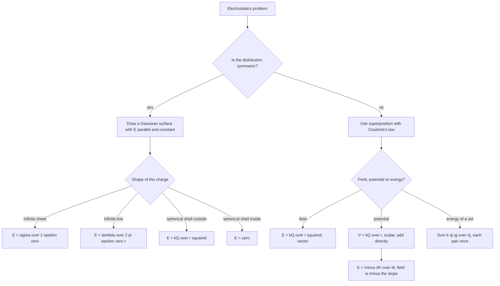

---

exam: cuet
examName: CUET UG
subject: physics
subjectName: Physics
topic: phy-015
topicName: Electrostatics
weight: 5
country: india
generated: "2026-03-24T08:32:07.826097"
lastUpdated: "2026-09-17"
diagramPrompt: "Clean educational diagram showing Electrostatics with clear labels, white background, labeled arrows for forces/fields/vectors, color-coded components, exam-style illustration"

---

# Electrostatics

Electrostatics deals with charges at rest. Four ideas carry the whole chapter: **Coulomb's law** for forces between point charges, **superposition** for everything more complicated, **Gauss's law** for the symmetric cases where superposition is impractical, and **potential** as the quantity that makes energy and work easy.

The chapter is worth the time it takes because the same four ideas reappear in current electricity, in the electromagnetic wave chapter and in the semiconductor and communication material. A charge sitting still already knows the equations a moving charge will need.

### 🟢 Lite — Quick Review (1h–1d)
> The constants, the equations, and the scaling ladder that answers most comparisons.

**Constants**

| Quantity | Symbol | Value |
|---|---|---|
| Coulomb's constant | k = 1/(4πε₀) | 9 × 10⁹ N m² C⁻² |
| Permittivity of free space | ε₀ | 8.854 × 10⁻¹² C² N⁻¹ m⁻² |
| Charge on the electron | e | 1.602 × 10⁻¹⁹ C |
| Electron volt | 1 eV | 1.602 × 10⁻¹⁹ J |

**The five equations**

- **Coulomb's law:** F = kq₁q₂/r², along the line joining the charges, attractive for unlike signs.
- **Field of a point charge:** E = kQ/r², radial, outward for +Q.
- **Potential of a point charge:** V = kQ/r, a scalar, + for +Q, taking V = 0 at infinity.
- **Potential energy of a pair:** U = kq₁q₂/r, positive for like signs, negative for unlike.
- **Gauss's law:** ∮E·dA = q_enc/ε₀.

**The scaling ladder — the comparison questions in one table**

| Quantity | Falls as | Direction or sign |
|---|---|---|
| Force between two point charges | 1/r² | along the line joining them |
| Field of a point charge | 1/r² | radial, outward for +Q |
| Potential of a point charge | 1/r | scalar, + for +Q |
| Field on the **axial** line of a dipole | 1/r³ | along p |
| Field on the **equatorial** line of a dipole | 1/r³ | opposite to p |
| Potential of a dipole | 1/r² | + on the axial side, − on the equatorial side |

Note the asymmetry: for a point charge the field falls as 1/r² and the potential as 1/r, but for a dipole both are one power steeper, 1/r³ and 1/r², because the net charge is zero and the leading term comes from the separation of the two charges.

**Field and potential are not the same kind of thing.** E is a vector, V is a scalar; E depends on the direction of the position vector, V does not. E has units of V/m and V of V. The link between them is **E = −dV/dr**, the minus sign saying that the field points in the direction of steepest decrease of potential.

**Dipole moment** p = qd, in C m, directed from −q to +q. The axial field is 2kp/r³ and the equatorial field kp/r³.

**Capacitance (the lead-in to the next note)**

- C = Q/V, in farads
- Parallel plates: C = ε₀A/d
- Series: 1/C_eq = Σ1/Cᵢ; Parallel: C_eq = ΣCᵢ
- Energy: U = ½CV² = ½QV = Q²/2C

### 🟡 Standard — Regular Study (2d–2mo)
> The reasoning behind the laws and the results that follow from them.

**Coulomb's law and what it assumes**

F = kq₁q₂/r² holds exactly for point charges in vacuum, and the difficulty in most problems is that real charges are not points. The resolution is the principle of superposition: for a continuous distribution, break the charge into infinitesimal pieces, write dF = kdq dq/r² for each, and integrate. A rod, a ring and a charged disc are all integrations of Coulomb's law, and once you recognise that, none of them is a new idea.

Two properties of charge itself belong here. Charge is **quantised**: it comes in units of e = 1.602 × 10⁻¹⁹ C, and a macroscopic charge is an integer multiple, q = ne, which is why a fractional charge is never observed. Charge is **conserved**: it cannot be created or destroyed, only transferred. Note the distinction from the electron volt, which is a unit of energy despite its name.

**Electric field and the test charge**

E is defined as the force on a unit positive test charge placed at the point, E = F/q₀. The test charge is a fiction: it is imagined to be so small that it does not disturb the source distribution. A negative test charge would feel a force in the opposite direction, which is why E is defined using a positive one and why E points in the direction of the force on a positive charge.

**Field lines, and what they do and do not tell you**

A field line is drawn tangent to E at every point, starting on positive charge and ending on negative charge. The rules worth knowing: field lines never intersect, because E has one direction at a point; the density of lines is proportional to the field strength; and for a point charge the number of lines is proportional to Q, so a 2Q charge has twice as many. The common misconception is that a field line "shows the path of a test charge". It does not. A charge released in a field follows a path determined by the whole field configuration, and near a point charge it falls radially inward, not along the drawn line.

**Electric potential and why it is easier than the field**

V is defined as the work done per unit positive charge in bringing a test charge from infinity to the point: V = W/q₀ = kQ/r. Three things follow. V is a scalar, so potential problems need no vector algebra. V at the midpoint of two equal charges is the arithmetic mean of the individual potentials, and the potential at the centre of a uniformly charged ring is kQ/R — a result that would be very hard to get from fields.

Equally important: **electrostatic work is path-independent**. The work done in taking a charge from A to B is the same whichever route is taken, because the integral of E·dl around any closed loop is zero for a static field. That is what "conservative" means, and it is why potential difference is well defined. Note the contrast with the magnetic case, where the closed-loop integral is not generally zero and a scalar potential cannot be defined.

V = 0 is a choice, not a fact. The physical quantity is the potential *difference* between two points, and the standard convention is to set V = 0 at infinity for an isolated distribution. Inside a conductor the potential is constant everywhere, which is the same statement as the field being zero there.

**Equipotential surfaces and the E = −dV/dr link**

Points at the same potential form a surface. The electric field is always perpendicular to the equipotential surface and always points from high potential to low. That perpendicularity is exactly the content of E = −dV/dr: the magnitude of the field is the rate at which potential changes with distance. Around a point charge, the equipotentials are concentric spheres, and the fact that the field is radial and perpendicular to them is the same fact seen twice.

**The dipole**

Two equal and opposite charges separated by a small distance have a dipole moment p = qd pointing from the negative charge to the positive one. On the axis, at distance r from the centre,

E_axial = 2kp/r³, in the direction of p

On the equatorial line, at the same distance,

E_equatorial = kp/r³, opposite to p

Both are along the line of the dipole but in opposite senses, which is the point of the comparison question. The potential on the axis falls as 1/r² and on the equator as 1/r² with the opposite sign, and both approach zero at infinity because the net charge is zero. Because the field falls as 1/r³, the field close to a dipole is enormously stronger than a point charge of the same magnitude would give — which is why a small charged rod attracts a light object more strongly than a distant equal charge does.

**Gauss's law**

In any closed surface, ∮E·dA = q_enc/ε₀. The left-hand side is the total electric flux, the net number of field lines crossing the surface, counted with sign. The statement is exact and always true; its usefulness depends entirely on whether you can choose a surface on which E is constant in magnitude and parallel to the area vector. That is the whole trick. If you can, the integral becomes E × A and the answer drops out. If you cannot, Gauss's law still holds but it tells you nothing without more work.

The four standard applications:

- **Infinite line of charge** of linear density λ, Gaussian surface a cylinder of radius r: E(2πrl) = λl/ε₀, so **E = λ/2πε₀r**, falling as 1/r.
- **Infinite plane sheet** of surface density σ, Gaussian surface a pillbox with area A on each face: 2EA = σA/ε₀, so **E = σ/2ε₀**, independent of distance. A flat sheet produces a uniform field, which is the case that most often breaks 1/r² intuition.
- **Uniformly charged spherical shell**, radius R, charge Q: outside (r > R) the field is exactly that of a point charge at the centre, E = kQ/r²; **inside (r < R) the field is zero** because the enclosed charge is zero.
- **Uniformly charged solid sphere** of radius R and total charge Q: outside again E = kQ/r², and **inside E = kQr/R³ = Qr/(4πε₀R³)**, rising linearly from the centre.

**Conductors in electrostatic equilibrium**

Three results, and together they are one idea. The electric field inside a conductor is zero; the entire excess charge sits on the surface; the potential is the same everywhere on and inside the conductor. The reason is that a free electron in a conductor accelerates in response to any field until it has moved far enough to cancel it. Zero internal field means no net force on the remaining free charge, so equilibrium is reached.

Three practical consequences. The charge is **not** spread uniformly over the surface: it crowds where the surface is sharply curved, so a sharp metal point carries a high local charge density and a high field. That is the whole principle of the lightning rod. Two conductors in contact come to the same potential, so **two connected spheres share charge in proportion to their radii**, Q₁/Q₂ = R₁/R₂. And a hollow conductor with no charge inside it has zero field in the cavity, which is why a closed metal case shields its contents — electrostatic shielding.

**Force between capacitor plates**

Consider the two plates of area A carrying charges +Q and −Q, neglecting the edge effects. Each plate experiences the field of the *other* plate only, which is σ/2ε₀ and not σ/ε₀, so the force on a plate of charge Q is

F = Q × σ/2ε₀ = **½ε₀AE²**

The factor ½ comes from exactly that halving, and a common wrong answer omits it. Because this field is inside the whole parallel-plate combination, the work needed to bring one plate in from infinity while the other stays fixed is the negative of this force times the distance, and that work is the energy stored.

### 🔴 Extended — Deep Study (3mo+)
> The quantitative detail, the dielectric story, and the results that fall out of Gauss's law.

**Worked Example — Coulomb force and the null-field point**

Two point charges, q₁ = +4 μC at the origin and q₂ = −6 μC at x = 0.30 m.

1. F = kq₁q₂/r² = (9 × 10⁹)(4 × 10⁻⁶)(6 × 10⁻⁶)/(0.30)²
2. Numerator: 9 × 10⁹ × 24 × 10⁻¹² = 0.216
3. F = 0.216/0.09 = **2.4 N, attractive**, since the signs are opposite.
4. Between the charges the two fields point the same way — both from +q₁ toward −q₂ — so they can never cancel there. The null point is outside the segment, on the side of the smaller charge.
5. Let it be a distance x from q₁, so x + 0.30 from q₂. Then 4/x² = 6/(x + 0.30)², and taking square roots: 2(x + 0.30) = √6 x, so 2x + 0.6 = 2.449x, giving **x = 1.34 m from q₁**, measured away from q₂.
6. Check: 4/(1.34)² = 2.23 and 6/(1.64)² = 2.23. Equal, as required.

**Worked Example — Gauss's law for a sheet and for a spherical shell**

(a) An infinite sheet carries σ = 2 × 10⁻⁶ C m⁻². E = σ/2ε₀ = 2 × 10⁻⁶/(2 × 8.854 × 10⁻¹²) = 1.13 × 10⁵ V m⁻¹, the same on either side and at any distance.

(b) A spherical shell of radius 0.10 m carries 3 μC. At r = 0.30 m: E = kQ/r² = 9 × 10⁹ × 3 × 10⁻⁶/0.09 = 3 × 10⁵ V m⁻¹, radially outward. At r = 0.05 m, **inside the shell**, the enclosed charge is zero, so E = 0. The field is discontinuous at the surface, jumping from 0 to σ/ε₀ = 3 × 10⁻⁶/8.854 × 10⁻¹² = 3.39 × 10⁵ V m⁻¹, which is exactly twice the value at r = 0.30 m, as σ/ε₀ = 2kQ/r² requires when r = R.

**Worked Example — potential at a point**

Three point charges, +2 μC at the origin, −3 μC at 0.20 m and +4 μC at 0.50 m on a straight line. Find the potential at the point 0.10 m from the origin on the same line, assuming it is on the side away from the other two.

1. V = k(2 × 10⁻⁶/0.10) + k(−3 × 10⁻⁶/0.30) + k(4 × 10⁻⁶/0.60)
2. V = 9 × 10⁹ × 10⁻⁶ × (20 − 10 + 6.67) = 9 × 10³ × 16.67
3. V = **1.5 × 10⁵ V**, positive because the nearest and largest contribution wins.
4. Notice that no angles appeared: the formula is the scalar sum, and it is V = Σkqᵢ/rᵢ with all rᵢ positive distances.

**Worked Example — energy of a charge system**

Three charges +q, +q and −2q are placed at the vertices of an equilateral triangle of side a.

1. There are three pairs, all at distance a, and the pairs are (+q, +q), (+q, −2q) and (+q, −2q).
2. U = k[q²/a + (−2q²)/a + (−2q²)/a] = k(−3q²)/a
3. U = **−3kq²/a**.
4. The net charge is zero, so this assembly is stable energetically against being far away only in the sense that the zero of energy is at infinity with U = 0; the negative U means work must be done to pull it apart. The per-pair calculation is the whole method: **sum kqᵢqⱼ/rᵢⱼ over all distinct pairs**, each pair counted once.

**Worked Example — self-energy and the hydrogen atom**

An isolated conducting sphere of radius R carrying charge Q stores U = Q²/(2C) = kQ²/2R, with C = 4πε₀R. This is the energy of assembling the charge from infinity, layer by layer, and it diverges as R → 0. That is one reason a point charge model cannot be pushed below the atomic scale.

Apply it to hydrogen. The proton and electron are separated by r = 0.529 × 10⁻¹⁰ m (the Bohr radius), and the potential energy is U = −ke²/r = −(9 × 10⁹)(1.602 × 10⁻¹⁹)²/(0.529 × 10⁻¹⁰) = −4.37 × 10⁻¹⁸ J = −27.2 eV. The kinetic energy from the virial theorem for a Coulomb system is K = +13.6 eV, so the total is E = −13.6 eV, the ionisation energy of hydrogen. A useful identity to remember: **for any Coulomb system, K = −U/2**.

**Worked Example — force and energy between capacitor plates**

A parallel-plate capacitor has C = 4 μF charged to 200 V. Find the energy stored, the charge, and the force between the plates if A = 0.01 m².

1. U = ½CV² = ½ × 4 × 10⁻⁶ × 40 000 = **0.08 J**
2. Q = CV = 4 × 10⁻⁶ × 200 = 8 × 10⁻⁴ C
3. From C = ε₀A/d, d = ε₀A/C = (8.854 × 10⁻¹² × 0.01)/(4 × 10⁻⁶) = 2.21 × 10⁻⁵ m, about 22 μm.
4. E = V/d = 200/2.21 × 10⁻⁵ = 9.05 × 10⁶ V m⁻¹
5. F = ½ε₀AE² = ½ × 8.854 × 10⁻¹² × 0.01 × (9.05 × 10⁶)² = **0.36 N**
6. Check with U = ½Fd: ½ × 0.36 × 2.21 × 10⁻⁵ = 3.98 × 10⁻⁶ J, not 0.08 J. The discrepancy is because the work done bringing the *second* plate in involves changing the charge, not holding it fixed. The two setups are different physical situations, and the force formula is the one for fixed Q.

**Dielectrics — what actually changes**

A dielectric is a material with no free charges but with bound charges that can shift slightly. An electric field polarises it, producing dipole moments aligned with the field and a bound surface charge on the faces adjacent to the plates. The bound charge opposes the free charge, so the field inside the dielectric is reduced.

The single result that generates the whole set: **if free charge is fixed, the field inside the dielectric falls by a factor κ, the dielectric constant.**

- **Battery connected (V fixed):** C becomes κC₀, Q becomes κQ₀, V unchanged, E unchanged (since V = Ed with d fixed), and U = ½CV² becomes κU₀. The extra charge flows in from the battery.
- **Battery disconnected (Q fixed):** C becomes κC₀, V becomes V₀/κ, E becomes E₀/κ, and U = Q²/2C becomes **U₀/κ**.

The second case is the one that carries the physical insight: the energy *decreases* when the dielectric is pulled in, so the field pulls it in spontaneously and does work as it goes. The energy does not disappear; it is converted to mechanical work as the slab is drawn between the plates. Conversely, pulling the slab out requires work to be done against the field.

**Where electrostatics ends and the next chapters begin**

- **Current electricity.** A capacitor discharging through a resistor gives an exponential decay with time constant RC; the charge follows the same differential-equation form as everything else in this course.
- **Magnetic effects.** A moving charge produces a magnetic field as well as an electric one, and the two combine in the Lorentz force F = q(E + v × B). Electrostatics is the v = 0 limit.
- **Electromagnetic waves.** Accelerating charges radiate, and the field energy density ½ε₀E² is the same energy per unit volume that appears when a capacitor is charged.
- **Nuclear physics.** The Coulomb repulsion is what a neutron star's enormous gravity has to fight, and the binding-energy curve for nuclei turns over because the strong force wins at short range and the Coulomb force wins at long range.

### 🧠 Memory Anchors

- **"Field is 1/r², potential is 1/r."** One power of r apart, and every point-charge comparison question follows from that pair.
- **"Dipoles are one power steeper on both."** 1/r³ for the field and 1/r² for the potential, because the net charge cancels.
- **"Potential adds, fields need angles."** Write V = Σkqᵢ/rᵢ and the vector work disappears. If a question gives a diagram, it is almost always easier through potential.
- **"Zero field inside a conductor, all charge on the surface."** One idea, three consequences: the surface crowding on sharp points, the Q ∝ R sharing rule for connected spheres, and electrostatic shielding.
- **"Gauss's law is always true and only sometimes useful."** Use it when E is constant in magnitude and direction on your surface; otherwise reach for superposition.
- **"The ½ in F = ½ε₀AE² is real."** A plate feels the field of the other plate, not of the pair.
- **"Fixed charge drops the energy; fixed voltage raises it."** The dielectric question is decided by asking which of V or Q is held.
- **Flashcard Q&A:**
  - *Is a field line the path of a test charge?* → no, it is a line drawn tangent to E at each point.
  - *E inside a conductor?* → zero, and the potential is constant throughout.
  - *Two connected spheres?* → Q₁/Q₂ = R₁/R₂, since they reach a common potential kQ/R.
  - *Why is electrostatic work path-independent?* → the closed-loop integral of E·dl is zero for a static field, so the field is conservative.
  - *Potential of a dipole on its axis?* → +kp/r²; on the equator, −kp/r².
  - *Coulomb energy of a sphere?* → kQ²/2R, which diverges as R → 0.

### 🎯 Exam Traps & Error Log

1. **Adding potentials with signs ignored.** V = kq/r is a scalar sum, so −3 μC at 0.2 m contributes negatively. Taking all magnitudes is the most common error in potential questions.
2. **Forgetting the ½ in F = ½ε₀AE².** A plate feels only the other plate's field, which is half the total.
3. **Saying the charge on a conductor is spread evenly over its surface.** It crowds where the curvature is greatest, and it is zero in a cavity with no charge inside.
4. **Placing the null-field point between two opposite charges.** Their fields point the same way between them, so the null point lies outside, on the side of the smaller charge.
5. **Using V = kQ/r for a charge at a point inside a uniformly charged shell.** The shell's field is zero inside, so its contribution to the potential is the *constant* kQ/R, not kQ/r. This is the most frequently missed exception in the chapter.
6. **Applying Gauss's law to a distribution with insufficient symmetry.** For two point charges no useful Gaussian surface exists; use superposition.
7. **Saying E is zero everywhere outside a charged conductor.** The field outside is exactly that of a point charge at the centre with the total charge Q.
8. **Confusing field with force and using q₀ in the wrong place.** E = F/q₀; the force on a charge q in a field E is F = qE.
9. **Writing the electric field of a dipole as kp/r³ for the axial line.** The axial field is **2kp/r³** and the equatorial is kp/r³. The factor 2 is a standard option in MCQs.
10. **Claiming field lines cross.** They never do; two directions at one point would mean two values of E there.
11. **Using U = QV instead of U = ½QV.** Every capacitor energy has the factor ½; the average during charging is half the final value, which is why the factor appears.
12. **Treating a dielectric as if it changes the free charge when the battery is connected.** With the battery connected the free charge does change, by a factor κ; with it disconnected the free charge cannot change at all.

### 🧪 Self-Test — 8 Questions with Worked Answers

Work these on paper before reading the answers. Each maps to a form the chapter actually uses.

1. **Two charges +2 μC and −8 μC are 0.5 m apart. Find the force, and the distance at which the field is zero.**

   F = kq₁q₂/r² = 9 × 10⁹ × 16 × 10⁻¹²/0.25 = 0.144/0.25 = **0.576 N, attractive**.
   Between them the fields align, so the null point is outside on the side of the smaller charge. Let it be x from the 2 μC charge, so x + 0.5 from the 8 μC charge: 2/x² = 8/(x + 0.5)². Taking roots, √2 (x + 0.5) = 2√2 x, so x + 0.5 = 2x, giving **x = 0.5 m from the smaller charge**. The ratio of the charge magnitudes sets the null distance directly, and here the 4:1 ratio makes the arithmetic simple.

2. **Find the electric field at the centre of a uniformly charged ring of radius R = 0.1 m carrying total charge Q = 2 μC, and explain the result.**

   By symmetry every element of the ring has a partner diametrically opposite it, and the two fields are equal and opposite at the centre. The net field is therefore **exactly zero**, whatever the charge and radius.
   The potential at the same point is not zero: V = kQ/R = 9 × 10⁹ × 2 × 10⁻⁶/0.1 = 1.8 × 10⁵ V, because every element is at the same distance and the contributions add as scalars. This is the cleanest illustration that a zero field does not imply a zero potential, and it is the basis of the levitating-charge problem.

3. **A conducting sphere of radius 10 cm carries 1 μC. Find its capacitance, its potential, and its surface charge density.**

   C = 4πε₀R = 4π × 8.854 × 10⁻¹² × 0.1 = 1.11 × 10⁻¹¹ F = **11.1 pF**.
   V = kQ/R = 9 × 10⁹ × 1 × 10⁻⁶/0.1 = **9 × 10⁴ V**.
   σ = Q/(4πR²) = 1 × 10⁻⁶/(4π × 0.01) = 7.96 × 10⁻⁶ C m⁻².
   All three are consistent: C = Q/V gives 10⁻⁶/9 × 10⁴ = 1.11 × 10⁻¹¹ F, which is the capacitance found independently.

4. **Two capacitors of 6 μF and 3 μF are connected in series across 12 V. Find the equivalent capacitance, the charge on each, and the voltage across each.**

   C_eq = C₁C₂/(C₁ + C₂) = 18/9 = **2 μF**.
   In series each carries the same charge: Q = C_eq V = 2 × 10⁻⁶ × 12 = **24 μC**.
   V₁ = Q/C₁ = 24/6 = 4 V, V₂ = 24/3 = 8 V, and 4 + 8 = 12 V as required.
   Note the inverse split: the smaller capacitor takes the larger share of the voltage, exactly as the larger resistance does in a series circuit.

5. **A parallel-plate capacitor of area 0.02 m² and separation 5 mm is connected to a 300 V battery. Find the capacitance, the charge, the field, and the energy.**

   C = ε₀A/d = 8.854 × 10⁻¹² × 0.02/5 × 10⁻³ = 3.54 × 10⁻¹¹ F = **35.4 pF**.
   Q = CV = 3.54 × 10⁻¹¹ × 300 = **1.06 × 10⁻⁸ C**.
   E = V/d = 300/0.005 = **6 × 10⁴ V m⁻¹**.
   U = ½CV² = ½ × 3.54 × 10⁻¹¹ × 90 000 = **1.59 × 10⁻⁶ J**.
   A sanity check worth doing: a centimetre-squared air capacitor holds tens of picofarads, so 35 pF is the right order.

6. **A 4 μF capacitor is charged to 100 V and then disconnected. A dielectric of constant κ = 4 is inserted. Find the new capacitance, voltage, charge and energy, and say what happens to the missing energy.**

   Q is fixed by the disconnection: Q = 4 × 10⁻⁶ × 100 = **4 × 10⁻⁴ C**, unchanged.
   C' = 4C = **16 μF**. V' = Q/C' = 4 × 10⁻⁴/16 × 10⁻⁶ = 25 V. U' = Q²/(2C') = (1.6 × 10⁻⁷)/(32 × 10⁻⁶) = 5 × 10⁻³ J.
   The original energy was ½ × 4 × 10⁻⁶ × 10 000 = 0.02 J, so the stored energy falls by a factor of 4, from 0.02 J to 0.005 J.
   The missing 0.015 J is **not destroyed**. The field pulls the slab in and does mechanical work on it as it slides between the plates, and the energy goes into the motion and the heat of the insertion. That is why a charged, isolated dielectric-filled capacitor feels a force drawing the dielectric further in.

7. **Three charges +1 μC, +2 μC and −3 μC are placed at the corners of a right-angled triangle with the +1 μC charge at the right angle, the +2 μC charge 3 m away along one side and the −3 μC charge 4 m away along the other. Find the potential energy of the assembly.**

   Sides: 3 m, 4 m and 5 m (the diagonal).
   Three pairs: (1, 2) at 3 m gives +2/3 in units of k×10⁻¹²; (1, −3) at 4 m gives −3/4; (2, −3) at 5 m gives −6/5.
   Sum = 0.6667 − 0.75 − 1.2 = −1.2833, in units of 10⁻¹² C²/m.
   U = 9 × 10⁹ × 10⁻¹² × (−1.2833) = **−1.155 × 10⁻² J**, that is about −1.16 × 10⁻² J.
   The assembly is bound, since U is negative: work must be supplied to pull it apart.

8. **Explain why the electric field at the centre of a uniformly charged non-conducting spherical shell is zero, while the electric field just outside it is not, and give the value of the field just outside in terms of σ.**

   Inside the shell, any Gaussian surface centred on the shell encloses **no** charge, so by Gauss's law the total flux is zero. By spherical symmetry the field has the same magnitude everywhere on that surface, so it must be zero everywhere inside. The field does not merely become small near the centre; it is exactly zero.
   Just outside, the surface encloses the entire charge Q, so the field is that of a point charge. Since Q = σ·4πR², we get E = kQ/R² = (σ4πR²)/(4πε₀R²) = **σ/ε₀**, about 3.39 × 10⁵ V m⁻¹ for σ = 3 × 10⁻⁶ C m⁻².
   So the field jumps discontinuously from zero inside to σ/ε₀ just outside, exactly doubling the value it has at twice the radius. The field lines begin on the outer surface of the shell and none exist in the interior, which is the same statement as the zero field. The contrast with the shell of a single point charge is instructive: a point charge has no inside, while a shell has an inside in which the potential is the constant kQ/R even though the field vanishes.

### 💡 Pro Tips

1. **Use potential instead of field whenever the question allows it.** V = Σkqᵢ/rᵢ needs no angles, no vector addition and no squares of distances. It is often half the work.
2. **Fix a zero of potential deliberately.** Taking V = 0 at infinity is a convention; setting it at the point you are measuring makes the work calculation trivial. Just say which you did.
3. **Decide first whether you are inside or outside.** The field inside a shell, a conductor or a cavity is zero, and the potential there is a constant — not kQ/r. Most of the lost marks in this chapter come from applying an outside formula to an inside point.
4. **For any "where is the field zero" question, sketch the field directions first.** Opposite charges never cancel between them; the null point is outside, on the side of the smaller charge. Like charges cancel between them, closer to the smaller.
5. **When you use Gauss's law, write down why the integral collapses** before you compute. "E is constant on the curved surface and parallel to dA" is the mark; the algebra after it is routine.
6. **For a conductor, remember there is no field inside and no volume charge.** Everything lives on the surface, which is why a hollow charged shell has a constant potential throughout its interior.
7. **Sanity-check capacitor results against the "centimetre-squared" scale.** A parallel-plate air capacitor of a few cm² at millimetre separation is tens of picofarads. An answer in microfarads is usually an arithmetic slip, and an answer in farads is usually a unit slip.
8. **Decide the dielectric question by asking whether the battery is connected.** Connected means V fixed and the energy rises; disconnected means Q fixed and the energy falls. Everything else follows.
9. **Keep the factor ½ in all three capacitor energy forms.** U = ½CV² = ½QV = Q²/(2C). U = QV is the energy at full charge only, not the energy delivered, because the charge builds up gradually.
10. **Learn the dipole axial factor of 2 as a separate fact.** Field on the axis is 2kp/r³ and on the equator kp/r³. Everything else about dipoles — directions, sign of potential, 1/r³ scaling — follows from the same two sentences.

---

## Continue your study

- **[View this topic in your CUET UG roadmap](/roadmap/?exam=cuet&duration=1mo)** — see where "Electrostatics" fits in your personalised plan
- **[Build a quick revision plan](/roadmap/?exam=cuet&duration=1d)** — 1-day sprint covering highest-weight topics
- **[CUET UG exam overview](/exams/cuet/)** — pattern, eligibility, and syllabus
- **[All Physics notes](/notes/cuet/physics/)** — browse sibling topics in this subject

---
*Content adapted based on your selected roadmap duration. Switch tiers using the selector above.*
