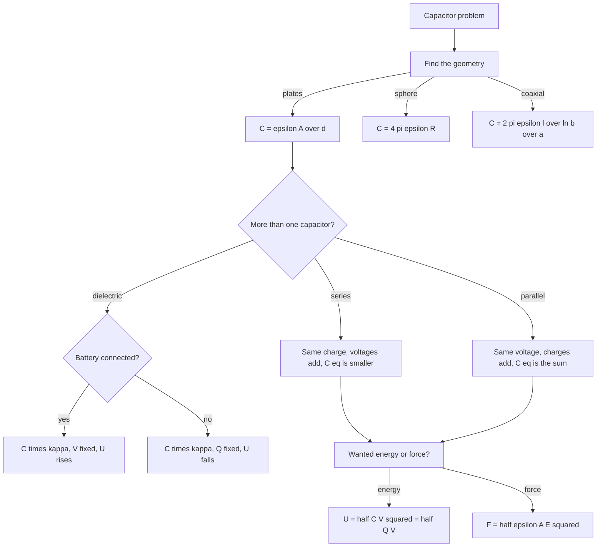

---

exam: cuet
examName: CUET UG
subject: physics
subjectName: Physics
topic: phy-016
topicName: Capacitance
weight: 4
country: india
generated: "2026-03-24T08:32:07.826829"
lastUpdated: "2026-09-08"
diagramPrompt: "Clean educational diagram showing Capacitance with clear labels, white background, labeled arrows for forces/fields/vectors, color-coded components, exam-style illustration"

---

# Capacitance

A capacitor stores charge and energy in an electric field. Its single property, **C = Q/V**, tells you how much charge a given potential difference will hold, and everything else in the chapter follows from that one ratio plus the geometry of the field between the conductors.

The chapter is small and highly repeatable. Learn three geometries (parallel plates, sphere, coaxial cylinder), two combination rules, and three energy formulas, and a large share of the questions reduce to picking the right one and substituting.

### 🟢 Lite — Quick Review (1h–1d)
> The definitions, the geometries, the two combination rules and the three energy forms.

**Definition.** C = Q/V, the charge stored per unit potential difference. SI unit the **farad** (F) = 1 C V⁻¹. Since one farad is enormous, real values are quoted in µF (10⁻⁶ F), nF (10⁻⁹ F) and pF (10⁻¹² F). A parallel-plate air capacitor of 100 cm² at 1 mm separation is about 90 pF, which is the scale to expect.

**Geometries**

| Arrangement | Capacitance | Variables |
|---|---|---|
| Parallel plates | **C = ε₀A/d** | A plate area (m²), d gap (m) |
| Parallel plates with dielectric | C = ε₀κA/d | κ relative permittivity |
| Isolated conducting sphere, radius R | **C = 4πε₀R** | = 1.11 × 10⁻¹⁰ R in farads with R in metres |
| Spherical capacitor, radii a and b | C = 4πε₀ab/(b − a) | a inner, b outer |
| Coaxial cylinder, radii a and b, length l | C = 2πε₀l/ln(b/a) | l is the cylinder length |

**Combinations**

- **Series:** 1/C_eq = 1/C₁ + 1/C₂ + … The equivalent is always **less than the smallest** individual capacitance. Every capacitor carries the **same charge**; the voltages **add** to the supply voltage.
- **Parallel:** C_eq = C₁ + C₂ + … The equivalent is the **sum**. Every capacitor has the **same voltage**; the charges **add**.

The useful way to remember it: in a series combination the voltage divides in inverse proportion to the capacitance, exactly as it does for resistances, and in a parallel combination the charge divides in proportion, exactly as it does for parallel resistances.

**Energy**, all three forms equal:

**U = ½CV² = ½QV = Q²/2C**

**Energy density** in the field: u = ½ε₀E², in J m⁻³.

**Force between the plates** of a parallel-plate capacitor: F = ½ε₀AE² = Q²/(2ε₀A). The ½ is present because each plate feels the field of the other plate only.

**Charging time.** In an RC circuit the charge approaches its final value as Q = Q₀(1 − e^(−t/RC)), and the time constant is **τ = RC**. After one time constant the capacitor holds 63% of the final charge; after discharge in one time constant it retains 37%.

**Alternating current.** Capacitive reactance X_C = 1/(ωC) = 1/(2πfC), in ohms.

### 🟡 Standard — Regular Study (2d–2mo)
> Where each formula comes from, and the reasoning behind the dielectric and energy results.

**Why C = Q/V and why the farad is awkward**

Capacitance is a property of the geometry and the material, not of the charge. Double the charge and the voltage doubles, and the ratio is unchanged. That is the point of the definition.

One farad would mean storing a coulomb at one volt, which would need plates about 1 cm² separated by 0.1 micrometres — impossible to build. Real capacitors run from tens of picofarads (a few cm² at millimetre separation) to thousands of microfarads (electrolytic, using a thin oxide layer and a rough, high-area electrode). So when a question says "find the capacitance" of parallel plates, **a picofarad answer is the expected one**; microfarads means you have lost a factor of 10⁶ somewhere.

**Deriving C = ε₀A/d for parallel plates**

Between two large plates of area A separated by d, with the edge effects ignored, the charge σ = Q/A sits on each face and the field between them is E = σ/ε₀. The potential difference is then V = Ed = Qd/(ε₀A). Substituting into C = Q/V gives

C = **ε₀A/d**

Three readings to take from that single formula. Capacitance is proportional to plate area, so doubling A doubles C. It is inversely proportional to separation, so halving d doubles C. It is proportional to the permittivity of whatever fills the gap, which is the whole content of the dielectric story. Note that C is independent of the actual charge, and that the formula assumes d is small compared with the plate dimensions — otherwise the field is not uniform and the formula underestimates the capacitance.

**Dielectrics — what the κ actually represents**

A dielectric has no free charge, but in an applied field its molecules polarise: bound charges shift so that the negative end faces the positive plate. The bound surface charge on the inner faces opposes the free charge on the plates, so the field inside the gap is reduced. The reduction factor is the relative permittivity κ = ε/ε₀, giving

C = ε₀κA/d = κC₀

Three useful values: air and vacuum κ ≈ 1, glass 4 to 10, water about 80. Water's very large value is a direct consequence of the permanent dipoles of the H₂O molecule being able to reorient, which is also why water stores so much energy per unit volume in a capacitor.

**Battery connected versus disconnected** — the single most important distinction in the chapter.

- **Battery connected (V fixed):** V cannot change. C becomes κC₀, so Q = CV becomes κQ₀, and the battery sends the extra charge in. E = V/d is unchanged, and U = ½CV² rises to κU₀. The field pulls the slab in against the battery's opposition.
- **Battery disconnected (Q fixed):** Q cannot change. V = Q/C falls to V₀/κ, E falls to E₀/κ, and U = Q²/2C falls to **U₀/κ**. The stored energy drops, and the difference does not vanish — it is converted into mechanical work as the slab is pulled in. This is why a dielectric is drawn into a charged isolated capacitor.

**Combinations, and the physical reading of each rule**

In series, the charge on each capacitor is the same because the same current flows and no charge accumulates at the junction. The equivalent capacitance is less than the smallest member because the same charge now has to be held over the total voltage, which is the sum of the individual voltages. In parallel, every capacitor is connected across the same potential difference, so each stores its own independent charge and the total charge is the sum.

The practical check: put two 10 µF capacitors in series and you get 5 µF; in parallel you get 20 µF. If an answer comes out larger than the largest member for a series combination, the reciprocal was taken the wrong way round.

**Energy — where the ½ comes from**

Charge flows onto a capacitor gradually, and the potential difference rises as it goes. The work done in moving the final increment dq is dW = V dq, and integrating V = q/C from 0 to Q gives

W = ∫₀^Q (q/C)dq = Q²/2C = ½QV = ½CV²

The ½ appears because the average potential difference during charging is only half the final value. This is worth stating in a full-mark answer, because "why is there a ½?" is a standard one-mark question. All three forms must be used with matching units — if C is in µF, V in volts, the answer is in microjoules, which is a common slip.

**Energy density and where the field energy lives**

u = ½ε₀E². The result is a density, not a total, so the total is u multiplied by the volume in which the field is significant. For parallel plates that volume is Ad, giving U = ½ε₀E²Ad, which reproduces ½CV² exactly. The general statement is that electric field energy is stored in the field itself, not in the metal, which is why the region between the plates has to be counted and not just the conductors.

**The force between the plates**

Take the field of the other plate alone, which is σ/2ε₀ and not σ/ε₀, and multiply by the charge on the plate:

F = Q × σ/2ε₀ = **½ε₀AE²**, equivalently Q²/(2ε₀A) and ½CV²/d

The factor ½ is the one that gets dropped. Note that the force is the same whether you hold V constant or Q constant, because the formula is written in terms of the plate charge and area, which do not change in the ideal parallel-plate model.

**Capacitors in an RC circuit**

With a resistor and a capacitor in series, the current falls off exponentially and the charge on the capacitor rises exponentially, both governed by the time constant τ = RC. At t = τ the capacitor is 63% charged, at 2τ about 86%, and at 5τ about 99%. The RC time constant is the physical reason a digital circuit needs a debounce delay, and the pairing of resistance and capacitance is what turns the electrical circuits in this chapter into timing circuits.

### 🔴 Extended — Deep Study (3mo+)
> The harder geometries, the partial-insertion cases, and the connections that make the topic worth learning.

**Spherical conductors**

An isolated conducting sphere of radius R has capacitance 4πε₀R, because the potential of the charged sphere is kQ/R and C = Q/V = 4πε₀R. In farads this is 1.11 × 10⁻¹⁰ R, so a 10 cm sphere holds about 11 pF.

A **spherical capacitor** with an inner sphere of radius a inside an outer concentric shell of radius b has Q = 4πε₀V ab/(b − a), giving C = 4πε₀ab/(b − a). The result is worth checking in the limit: as b → ∞ the formula tends to 4πε₀a, the isolated-sphere value, which is exactly the capacitance an isolated sphere should have.

**Coaxial cylinders and the logarithm**

Two concentric cylinders of radii a and b and length l, with l much greater than the radii, form a cylindrical capacitor of capacitance 2πε₀l/ln(b/a). The logarithm appears because the field falls as 1/r over a cylindrical surface of growing circumference, so the integral does not collapse to a simple product. This is the geometry used in coaxial cable, and the point of the design is that the capacitance per unit length can be set by the ratio b/a.

**Partial insertion of a dielectric — the NCERT exemplar case**

A slab of thickness t < d is pushed between plates of separation d, with the battery disconnected, so the total charge on the connected plates is fixed. The gap is now two regions in series: an air layer of thickness (d − t) with capacitance ε₀A/(d − t), and a dielectric layer of thickness t with capacitance ε₀κA/t. So

1/C = (d − t)/(ε₀A) + t/(ε₀κA), and C = ε₀Aκ/[(d − t) + t/κ]

Three results worth noting. When t = d, the expression reduces to κC₀ as expected. When t → 0, it reduces to C₀, since the slab has done nothing. And **for every intermediate t the capacitance is less than κC₀**, because the un-filled part of the gap is still air. The energy falls, but by less than the factor κ.

**A slab half the plate area instead of part of the gap**

A slab of dielectric covering half the area between fully separated plates gives two capacitors in parallel, C₁ = ε₀(A/2)/d and C₂ = ε₀κ(A/2)/d, so C = ε₀A(1 + κ)/(2d), which lies between C₀ and κC₀. The two partial-insertion cases — partial gap and partial area — give different answers for the same fraction inserted, because the electric field configuration is different. Questions on this distinction are common, and the resolution is always: **partial gap is a series combination, partial area is a parallel combination.**

**Energy in a field — the point-charge version**

The energy required to assemble a charge distribution is U = ½∫ρV dV, or equivalently the work done against the field. For a point charge brought in from infinity, U = ½qV, again with the ½ from the gradual build-up. For a charge q brought to a potential V maintained by a source, the work done is qV, but the *change* in stored field energy is ½qV, because the source returns half of what it supplied. That distinction between work done and energy stored is the source of most of the errors in energy questions.

**Capacitors in alternating current**

With an alternating voltage v = V₀ sin ωt, the charge and current also vary sinusoidally but lead the voltage by π/2. The opposition to current flow is the capacitive reactance X_C = 1/(ωC), and the current amplitude is I₀ = V₀ωC. Two consequences. A capacitor blocks steady DC in the long run, since the reactance goes to infinity as ω → 0. And a small capacitance is a large reactance, so a small capacitor in series passes high frequencies and blocks low ones — that is the principle of every coupling and filter capacitor in an electronic circuit.

**Applications worth recognising in a question**

- **Smoothing and filtering.** A large capacitor across a supply shunts ripple current; a small series capacitor passes AC and blocks DC.
- **Touch screens.** A grid of transparent electrodes forms a capacitor at every intersection; touching changes the local capacitance and the electronics detect it.
- **Defibrillators.** A bank of capacitors is charged over several seconds and discharged through the patient in a few milliseconds, which is exactly the ½CV² energy store doing its job.
- **Strobes and flash photography.** The same energy is released very quickly to produce a short, intense flash.
- **Electrostatic precipitators** in power stations use a charged plate to collect ash particles, and **electroplating** and **spray painting** use the same field to direct droplets.

**Worked Example — parallel plates from first principles**

Two circular plates of area 200 cm² are separated by 5 mm of air. Find the capacitance, the charge at 500 V, and the energy.

1. A = 200 cm² = 200 × 10⁻⁴ m² = 0.02 m²; d = 5 × 10⁻³ m
2. C = ε₀A/d = 8.854 × 10⁻¹² × 0.02/5 × 10⁻³ = 3.542 × 10⁻¹¹ F = **35.4 pF**
3. Q = CV = 3.542 × 10⁻¹¹ × 500 = **1.77 × 10⁻⁸ C** = 17.7 nC
4. U = ½CV² = ½ × 3.542 × 10⁻¹¹ × 2.5 × 10⁵ = **4.43 × 10⁻⁶ J** = 4.43 µJ
5. A cross-check worth doing, with a caveat: E = V/d = 1 × 10⁵ V m⁻¹, u = ½ε₀E² = ½ × 8.854 × 10⁻¹² × 1 × 10¹⁰ = 0.0443 J m⁻³, and the gap volume is Ad = 0.02 × 5 × 10⁻³ = 1 × 10⁻⁴ m³, giving U = 4.43 × 10⁻⁶ J — exact agreement here. The same check fails if d is made comparable to the plate width, because E = V/d assumes a uniform field. The rule: the energy-density route is a valid check only when the gap is small compared with the plate dimensions.

**Worked Example — series pair with a supply**

Two capacitors 6 µF and 3 µF are in series across 12 V. Find the equivalent capacitance, the charge on each, the voltage across each, and the energy in each.

1. C_eq = (6 × 3)/(6 + 3) = 2 µF
2. Q = C_eq × 12 = **24 µC**, and each capacitor carries 24 µC
3. V₁ = 24/6 = **4 V** across the 6 µF; V₂ = 24/3 = **8 V** across the 3 µF. Sum = 12 V.
4. U₁ = Q²/2C₁ = (24 × 10⁻⁶)²/(12 × 10⁻⁶) = 5.76 × 10⁻¹⁰/1.2 × 10⁻⁵ = **4.8 × 10⁻⁵ J**; U₂ = (24 × 10⁻⁶)²/(6 × 10⁻⁶) = **9.6 × 10⁻⁵ J**
5. Total = 1.44 × 10⁻⁴ J, and by ½C_eqV² = ½ × 2 × 10⁻⁶ × 144 = 1.44 × 10⁻⁴ J. The smaller capacitor stores **more** energy, which surprises people until they see the inverse voltage split.

**Worked Example — a mixed network**

C₁ = 6 µF and C₂ = 3 µF in series, with C₃ = 4 µF in parallel with that pair, across a 12 V battery.

1. Series branch: 1/C_s = 1/6 + 1/3 = 1/2, so C_s = **2 µF**
2. Total: C = 2 + 4 = **6 µF**
3. Total charge from the battery: Q_total = 6 × 10⁻⁶ × 12 = **72 µC**
4. Charge on C₃ = 4 × 10⁻⁶ × 12 = 48 µC, and the series branch carries 24 µC, which splits as 4 V and 8 V across C₁ and C₂.
5. Energy in C₃ alone: U = ½ × 4 × 10⁻⁶ × 144 = **288 µJ**.

**Worked Example — force between charged plates**

Two plates of area 0.01 m² separated by 1 mm are charged to 500 V. Find the force between them.

1. E = V/d = 500/10⁻³ = 5 × 10⁵ V m⁻¹
2. F = ½ε₀AE² = ½ × 8.854 × 10⁻¹² × 0.01 × (5 × 10⁵)²
3. F = ½ × 8.854 × 10⁻¹² × 0.01 × 2.5 × 10¹¹ = **1.11 × 10⁻² N**
4. Check with the charge form: C = ε₀A/d = 88.5 pF, Q = CV = 4.43 × 10⁻⁸ C, and F = Q²/(2ε₀A) = (4.43 × 10⁻⁸)²/(2 × 8.854 × 10⁻¹² × 0.01) = 1.96 × 10⁻¹⁵/1.77 × 10⁻¹³ = **1.11 × 10⁻² N**. Same answer.

**Worked Example — charging a capacitor through a resistor**

A 10 µF capacitor is charged through a 1 kΩ resistor. Find the time constant, the charge after one time constant, and the fraction remaining after 10 ms.

1. τ = RC = 1000 × 10 × 10⁻⁶ = **0.01 s = 10 ms**
2. After one time constant, Q = 0.632 Q₀. The "63% rule" is a statement about the exponential, not an approximation anyone chose.
3. After 10 ms, that is one time constant, so **36.8%** of the initial charge remains on discharge, or 63.2% of the final charge is present on charge.
4. The current at t = τ is 0.368 of its initial value, the same 1/e factor appearing in a different place.

### 🧠 Memory Anchors

- **"C is geometry, not charge."** Double Q and V doubles with it. If a question implies C changes with Q, the model is wrong.
- **"Picofarads for plates, microfarads for electrolytics."** Scale check: centimetre-squared plates at millimetre gaps give tens of pF. Microfarads from that geometry means a unit slip.
- **"Series is the same rule as resistors."** Voltage divides in inverse proportion to C; the equivalent is less than the smallest member.
- **"Parallel is the same rule as resistors."** Charge divides in proportion to C; the equivalent is the sum.
- **"The ½ is the average voltage during charging."** Say that sentence and the factor stops being mysterious.
- **"Ask whether the battery is connected."** That single question decides C, V, Q, E and U in every dielectric problem.
- **"Partial gap is series; partial area is parallel."** The two partial-insertion cases are genuinely different, and this sentence is the whole difference.
- **"Each plate feels only the other plate."** That is where the ½ in the force formula comes from.
- **Flashcard Q&A:**
  - *Two 10 µF in series?* → 5 µF; in parallel, 20 µF.
  - *Isolated sphere capacitance?* → 4πε₀R, which is 11.1 pF for R = 10 cm.
  - *Why does energy drop when a dielectric is inserted into an isolated capacitor?* → Q is fixed and U = Q²/2C, so C rising lowers U; the difference becomes mechanical work pulling the slab in.
  - *What is the charge at t = RC?* → 0.632 of the final value.
  - *X_C at zero frequency?* → infinite, which is why a capacitor blocks DC.
  - *Work done by the battery vs energy stored?* → the battery supplies QV, the field stores ½QV.

### 🎯 Exam Traps & Error Log

1. **Writing ½QV as QV,** or mixing the three energy forms with mismatched units. If C is in µF, the answer is in µJ.
2. **Using the parallel rule for a series pair.** 1/C_eq = Σ1/Cᵢ, and the answer is smaller than the smallest member. An answer larger than the largest member is a reciprocal error.
3. **Saying the voltage divides equally in series.** It divides in inverse proportion to capacitance, so the smaller capacitor takes the larger voltage and the larger energy.
4. **Claiming a dielectric changes the charge when the battery is disconnected.** It cannot; disconnecting fixes Q, and then V and E fall.
5. **Forgetting that the energy changes in a different direction in the two cases.** Battery connected: U rises to κU₀. Disconnected: U falls to U₀/κ.
6. **Mixing up partial gap and partial area insertion.** Partial gap thickness gives a series combination; partial area gives a parallel one, and the two give different answers for the same fraction.
7. **Using πε₀/d from a coaxial cable** on parallel plates, or the parallel-plate formula on a sphere. Read the geometry before the constants.
8. **Reporting a parallel-plate capacitance in microfarads.** It should be tens of picofarads for laboratory-sized plates; the unit conversion is usually the error.
9. **Dropping the ½ in F = ½ε₀AE².** It is the other plate's field, not the total.
10. **Treating C = ε₀A/d as exact for plates with d comparable to their width.** The uniform-field assumption breaks down and the true capacitance is larger.
11. **Forgetting that energy is stored in the field between the plates,** not in the conductors, and so the volume Ad must be counted.
12. **Writing the RC charging law with the wrong exponent sign.** Charging is 1 − e^(−t/RC) and discharging is e^(−t/RC). Reversing them describes a capacitor that uncharges while being connected.

### 🧪 Self-Test — 8 Questions with Worked Answers

Attempt these on paper first. Each one is a shape this chapter actually produces.

1. **Three capacitors of 2 µF, 3 µF and 6 µF are connected in parallel across 12 V. Find the equivalent capacitance, the charge on each, and the total energy.**

   C_eq = 2 + 3 + 6 = **11 µF**.
   In parallel all three have the full 12 V, so Q₁ = 24 µC, Q₂ = 36 µC, Q₃ = 72 µC, and the total is 132 µC, which matches C_eq × V = 11 × 12 = 132 µC.
   U = ½C_eqV² = ½ × 11 × 10⁻⁶ × 144 = **7.92 × 10⁻⁴ J** = 792 µJ.
   Check by adding: ½CV² for each gives 144 µJ, 216 µJ and 432 µJ, total 792 µJ.

2. **A 4 µF capacitor charged to 50 V is connected in parallel to an uncharged 12 µF capacitor by a thin wire. Find the common voltage and the fraction of energy lost.**

   In a parallel connection both capacitors reach the same voltage, and the total charge is conserved. Q_total = 4 × 10⁻⁶ × 50 = 2 × 10⁻⁴ C, and C_total = 16 µF.
   V = 2 × 10⁻⁴/16 × 10⁻⁶ = **12.5 V**. The compact form is V_final = V₀·C₁/(C₁ + C₂) = 50 × 4/16 = 12.5 V.
   U_i = ½ × 4 × 10⁻⁶ × 2500 = 5.0 × 10⁻³ J. U_f = ½ × 16 × 10⁻⁶ × 156.25 = 1.25 × 10⁻³ J.
   Energy lost = 3.75 × 10⁻³ J, that is **75% of the initial energy**; only one-quarter survives. The missing energy appears as a spark and as heat in the resistance of the connecting wire, and the loss fraction grows with the mismatch between the two capacitances — which is why switched-capacitor charge pumps transfer in many small steps rather than one large one.

3. **A parallel-plate capacitor has plates of area 0.05 m² separated by 4 mm. Find its capacitance, the energy density at 200 V, and the total energy.**

   C = ε₀A/d = 8.854 × 10⁻¹² × 0.05/4 × 10⁻³ = **1.107 × 10⁻¹⁰ F** = 110.7 pF.
   E = V/d = 200/4 × 10⁻³ = 5 × 10⁴ V m⁻¹
   u = ½ε₀E² = ½ × 8.854 × 10⁻¹² × 2.5 × 10⁹ = **1.107 × 10⁻² J m⁻³**
   Volume = Ad = 0.05 × 4 × 10⁻³ = 2 × 10⁻⁴ m³
   U = u × Ad = 1.107 × 10⁻² × 2 × 10⁻⁴ = **2.21 × 10⁻⁶ J**
   Check: ½CV² = ½ × 1.107 × 10⁻¹⁰ × 40 000 = 2.21 × 10⁻⁶ J. Both routes agree.

4. **A 10 µF capacitor is charged to 100 V and then connected in parallel to an uncharged 20 µF capacitor by a thin wire. Find the common voltage and the fraction of energy lost.**

   C_total = 30 µF and the total charge is Q₁ + Q₂ = 10 × 10⁻⁶ × 100 = 1 × 10⁻³ C.
   Common voltage V = 1 × 10⁻³/30 × 10⁻⁶ = **33.3 V**.
   Initial energy U_i = ½ × 10 × 10⁻⁶ × 10 000 = 0.05 J. Final energy U_f = ½ × 30 × 10⁻⁶ × 1111 = 0.0167 J.
   Energy lost = 0.05 − 0.0167 = **0.0333 J**, which is **two-thirds of the original**. Only one-third survives, and the missing energy is dissipated as heat in the resistance of the connecting wire. The general result is that charge sharing between unequal capacitors wastes a fixed fraction, which is why switched-capacitor circuits avoid it.

5. **A slab of dielectric of thickness 2 mm is inserted between plates 5 mm apart, of area 0.04 m², with the battery disconnected. Find the new capacitance, using κ = 4, and state its value relative to the original and to the fully filled value.**

   Air layer: 3 mm; dielectric layer: 2 mm. The two act in series, so
   1/C = 0.003/(ε₀ × 0.04) + 0.002/(4ε₀ × 0.04) = (0.003 + 0.0005)/(ε₀ × 0.04) = 0.0035/(3.5416 × 10⁻¹³) = 9.883 × 10⁹
   C = **1.012 × 10⁻¹⁰ F** = 101.2 pF.
   Original C₀ = ε₀A/d = 8.854 × 10⁻¹² × 0.04/5 × 10⁻³ = 7.083 × 10⁻¹¹ F = 70.8 pF.
   Fully filled value would be 4C₀ = 283 pF. So 101 pF is above the original, as it must be, and well below 283 pF, as it must be. Partial insertion never reaches the full factor.

6. **Explain why a capacitor stores energy in the region between its plates rather than in the metal itself, and where the energy density is greatest.**

   The charge on a conductor resides entirely on its **outer surface**, and for a parallel-plate capacitor the two plates carry equal and opposite charges. The field between them adds, so it is twice the field either plate would produce alone, while the fields outside cancel almost completely. A region with zero field stores no energy, so essentially all the stored energy is in the gap.
   The density u = ½ε₀E² is greatest exactly where the field is greatest, which is the gap. This is why a thick (large d) capacitor stores little energy for a given plate area, and why shrinking the gap raises the capacitance and the energy density together.

7. **A 100 µF capacitor at 12 V is discharged through a 220 Ω resistor. Find the time constant, the charge after one time constant, and the current at that instant.**

   τ = RC = 220 × 100 × 10⁻⁶ = 0.022 s = **22 ms**.
   After one time constant the charge is Q = 0.368 Q₀ = 0.368 × 1.2 × 10⁻³ = **4.42 × 10⁻⁴ C**.
   The current follows the same exponential: I = I₀ e^(−t/τ), and at t = τ it is 0.368 of I₀. The initial current is I₀ = V/R = 12/220 = 0.0545 A, so I = **0.0201 A** = 20.1 mA.
   Both the charge and the current fall by the same factor because both are proportional to the voltage across the capacitor, and the voltage falls as e^(−t/τ).

8. **Two identical parallel-plate capacitors are connected in series and then, in a second arrangement, in parallel, both across the same 12 V supply. Compare the total energy stored in each case, each capacitor being 5 µF.**

   Series: C_eq = 5/2 = 2.5 µF, U_s = ½ × 2.5 × 10⁻⁶ × 144 = **1.8 × 10⁻⁴ J** = 180 µJ.
   Parallel: C_eq = 10 µF, U_p = ½ × 10 × 10⁻⁶ × 144 = **7.2 × 10⁻⁴ J** = 720 µJ.
   The ratio is exactly 4, because U = ½C_eqV² at fixed V, and the parallel combination has four times the capacitance. The same four-to-one ratio holds for the charge drawn from the battery. Whichever way a capacitor network is wired at a fixed supply voltage, the energy is proportional to the equivalent capacitance, and the equivalent capacitance is largest in parallel.

### 💡 Pro Tips

1. **Convert A and d to SI before using C = ε₀A/d.** A given in cm² and d in mm is the normal form of the data, and both conversions are easy to skip. A cm² is 10⁻⁴ m², which is where factor-of-10² and 10⁶ slips come from.
2. **Use the picofarad scale as a sanity check.** Laboratory parallel-plate capacitors are tens to hundreds of picofarads. If your answer is in microfarads without an electrolytic in the question, something has gone wrong.
3. **Identify the connection before doing any algebra.** In series the charge is common, in parallel the voltage is common. Writing that down first eliminates the reciprocal error, which is the single most common mistake in the chapter.
4. **Decide the dielectric question with one question: is the battery connected?** Then V fixed or Q fixed, and every other quantity follows from C = Q/V and U = ½CV² or Q²/2C.
5. **Memorise the 63% and 37% numbers for the RC time constant.** They come from e⁻¹ = 0.368 and are worth remembering as a pair, since questions ask for both.
6. **Keep all energy formulas with their ½,** and match the units to the capacitance unit you used. A µF with a volt gives a microjoule, not a joule.
7. **For partial-dielectric problems, ask whether the dielectric covers part of the area or part of the gap.** Area is parallel, gap is series, and that decision settles the algebra.
8. **Use the energy-density route as an independent check** on any parallel-plate problem: u = ½ε₀E², multiply by Ad, and compare with ½CV². Agreement to two figures means the units and the formula are both right.
9. **Remember that a capacitor blocks steady DC.** The question "what happens as frequency goes to zero?" has the answer in X_C = 1/(ωC) → ∞, and it applies in both directions.
10. **Practise the two geometries you will actually be asked about** — parallel plates and a spherical conductor — until C = ε₀A/d and C = 4πε₀R are recallable without a pause. The coaxial logarithm is rarer and worth last priority.

---

## Continue your study

- **[View this topic in your CUET UG roadmap](/roadmap/?exam=cuet&duration=1mo)** — see where "Capacitance" fits in your personalised plan
- **[Build a quick revision plan](/roadmap/?exam=cuet&duration=1d)** — 1-day sprint covering highest-weight topics
- **[CUET UG exam overview](/exams/cuet/)** — pattern, eligibility, and syllabus
- **[All Physics notes](/notes/cuet/physics/)** — browse sibling topics in this subject

---
*Content adapted based on your selected roadmap duration. Switch tiers using the selector above.*
