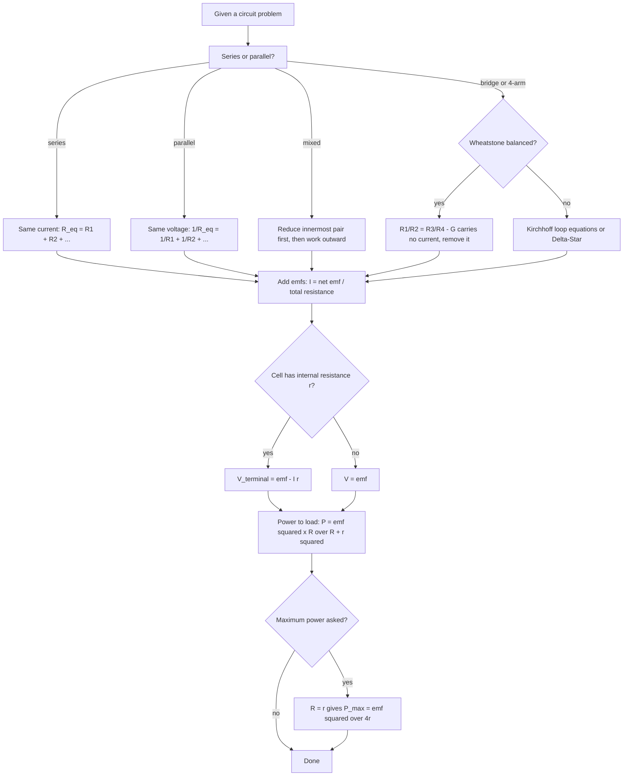

# Current Electricity

Every circuit question in this chapter is one of three things: a formula substitution, a network reduction, or a bridge/potentiometer balance condition. There is no conceptual picture to build, no diagram to interpret, and no data to analyse. Learn the formulas with their units, learn the two Kirchhoff laws, and learn the balance conditions properly — that is the whole chapter. The two ideas that catch most students are the sign of the terminal voltage of a real cell, and the fact that a potentiometer measures emf without drawing any current at all.

### 🟢 Lite — Quick Review (1h–1d)

**The definitions, in the words the exam uses**

- **Current** is the rate of flow of charge: $I = Q/t$, in coulomb per second = ampere. Conventional current is taken along the direction of positive charge flow, so in a metal it runs opposite to the electron drift.
- **Current density** $\vec{J}$ is current per unit area perpendicular to the flow: $\vec{J} = n e \vec{v_d}$, units A m⁻².
- **Resistivity** $\rho$ is a property of the material, not of the piece: $R = \rho L/A$. Units Ω·m. *Resistance* depends on the object, *resistivity* on the substance.
- **Conductivity** $\sigma = 1/\rho$, units S m⁻¹ (siemens per metre).
- **EMF** $\varepsilon$ is the energy transferred per unit charge by the source: $\varepsilon = W/Q$, units V. A cell with $\varepsilon = 1.5$ V gives 1.5 J of energy to every coulomb it pushes round the circuit.

**The formula table**

| Quantity | Formula | Symbols and units |
|---|---|---|
| Current | $I = Q/t$ | Q in C, t in s |
| Current in a conductor | $I = nAev_d$ | n in m⁻³, A in m², e = 1.602 × 10⁻¹⁹ C, $v_d$ in m s⁻¹ |
| Current density | $J = ne v_d = \sigma E$ | J in A m⁻², E in V m⁻¹ |
| Resistance | $R = \rho L/A$ | L in m, A in m² |
| Terminal voltage | $V = \varepsilon - Ir$ | r = internal resistance |
| Resistivity vs temperature | $\rho_T = \rho_0[1 + \alpha(T - T_0)]$ | $\alpha$ in K⁻¹ |
| Series combination | $R_{eq} = R_1 + R_2 + \cdots$ | same current flows |
| Parallel combination | $1/R_{eq} = 1/R_1 + 1/R_2 + \cdots$ | same voltage across each |
| Power in a resistor | $P = I^2 R = V^2/R = VI$ | P in W |
| Heat in time t | $Q = I^2Rt$ | J = V·C |
| Maximum power to load | $P_{max} = \varepsilon^2/4r$ at $R = r$ | — |
| Metre bridge balance | $R_1/R_2 = l_1/l_2$ | l in cm |
| Potentiometer | $\varepsilon = kl_x$ where $k = IR/L$ | k in V cm⁻¹ |

**The constants you will actually use**

| Constant | Value |
|---|---|
| Charge on electron e | 1.602 × 10⁻¹⁹ C |
| Resistivity of copper at 20 °C | 1.7 × 10⁻⁸ Ω·m |
| Temperature coefficient of copper | 3.93 × 10⁻³ K⁻¹ |
| Temperature coefficient of nichrome | 4 × 10⁻⁴ K⁻¹ |
| Resistivity of nichrome at 20 °C | 1.1 × 10⁻⁶ Ω·m |
| Free electrons per m³ in copper | 8.5 × 10²⁸ m⁻³ |

**Kirchhoff's two laws, stated in one line each.** The junction law says the algebraic sum of currents at a node is zero — charge does not pile up at a junction. The loop law says the algebraic sum of potential differences around any closed loop is zero — energy gained equals energy lost, which is the same statement as conservation of energy.

**Potentiometer: the one fact to hold on to.** It draws no current from the source being measured, so the reading is the true emf and is completely independent of the source's internal resistance. That is why it is used as the standard against which voltmeters are calibrated, and why a voltmeter — which does draw current — gives a lower reading for the same cell.

### 🟡 Standard — Regular Study (2d–2mo)

**Current and the microscopic picture**

In a conductor at rest, electrons move randomly in all directions, so the net current is zero. The average random speed at room temperature is about $10^6$ m s⁻¹ — the same order as the speed of sound in air, which is a good mental picture of how fast the electrons are actually jiggling. When a battery is connected, an electric field $E$ runs along the conductor and adds a small *drift* velocity $v_d$ on top of that random motion. The field itself is established essentially instantly along the wire, which is why a lamp across the room lights up the moment the switch is closed even though no individual electron travelled that far. The field propagates; the electrons do not need to.

Drift velocity is linked to the field by mobility: $v_d = \mu E$, where $\mu$ is the mobility in m² V⁻¹ s⁻¹. For copper, $\mu \approx 4.5 \times 10^{-3}$ m² V⁻¹ s⁻¹. In household wiring the field is small, of order 0.1 V m⁻¹, so the drift speed is only a few tenths of a millimetre per second. That is the point of the chapter: the current is real, the energy is being delivered, and the electrons are still barely moving.

**Ohm's law, and where it stops working**

Ohm's law says that for a conductor at constant physical conditions, the current is proportional to the potential difference across it: $V = IR$, or $I = V/R$. This is a statement about many materials, not a law of all conductors. It holds well for metal wires at ordinary temperatures, and it fails for a glowing filament (the tungsten resistance rises roughly tenfold as it heats, so the current does not stay proportional), for a semiconductor, and for a gas discharge tube. In the vector form, $\vec{J} = \sigma \vec{E}$, the same statement becomes local — true at every point rather than across a lumped resistor.

The microscopic form of Ohm's law is worth knowing because it explains why $R = \rho L/A$ has the form it does. If the same material is made into a wire twice as long, twice as many lattice vibrations and collisions are inserted into the current's path, so the resistance doubles. If the cross-sectional area is halved, the same current must be squeezed through half the width, doubling the current density $J$ and therefore doubling the field needed, which doubles the resistance. Hence $R \propto L/A$.

**Temperature dependence, and why two materials behave differently**

$\rho_T = \rho_0[1 + \alpha(T - T_0)]$. For a metal, $\alpha > 0$: heating increases the amplitude of the lattice vibrations, so the mean free path between collisions shortens and resistivity rises. A copper wire's resistance increases by roughly 0.4 % for every kelvin of rise. This is why fuses are made from a material with a *high* $\alpha$ — a small current surge heats the wire, the resistance climbs, and the wire melts. Nichrome is the opposite choice: its $\alpha$ is about 4 × 10⁻⁴ K⁻¹, nearly ten times smaller, so its resistance barely changes over a wide temperature range. Standard resistance boxes and the heating elements in irons and toasters are nichrome for exactly that reason.

For a semiconductor, $\alpha < 0$: a rise in temperature releases more charge carriers (electron–hole pairs), and the carrier density climbs far faster than the scattering worsens, so resistivity falls. The relation in this regime is not linear — it is of the Arrhenius form $\rho \propto e^{E_g/(2kT)}$, with $E_g$ the band gap. The practical consequence: a thermistor has a large, predictable *negative* temperature coefficient and makes an excellent temperature sensor.

**Combinations of resistors**

In series, the same current flows through each, so the potential drops add: $V = IR_1 + IR_2 = I(R_1 + R_2)$, giving $R_{eq} = R_1 + R_2$. In parallel, each branch has the same voltage, so the currents add, giving $1/R_{eq} = 1/R_1 + 1/R_2$. For two resistors, $R_{eq} = R_1R_2/(R_1 + R_2)$, and $R_{eq}$ is always *less* than the smaller of the two — the standard sanity check that catches a sign or arithmetic error instantly.

The symmetry is worth stating because it decides which formula to reach for: series means *same current, voltages add*; parallel means *same voltage, currents add*. If a question gives you currents, think series. If it gives you voltages, think parallel. Mixed networks — the common form in exams — need one step of series or parallel reduction, then the other, and then the total. The rule of thumb that always works: **reduce the innermost combination first and work outward**.

**EMF, internal resistance, and terminal voltage**

A real cell is an ideal emf $\varepsilon$ in series with a small internal resistance $r$. The internal resistance is real: it comes from the resistance of the electrolyte, the electrode surfaces, and the connecting wires. When the cell drives a current $I$, part of the emf is used up pushing current through $r$, so the voltage available across the external circuit is

$$V = \varepsilon - Ir$$

and for an open circuit ($I = 0$) $V = \varepsilon$. On short circuit ($R = 0$, $I = \varepsilon/r$) the terminal voltage is zero. Every cell question is an application of this one equation together with $I = \varepsilon/(R + r)$.

The maximum-power result follows from $P = I^2 R = \varepsilon^2 R/(R+r)^2$. Differentiating with respect to $R$ and setting the result to zero gives $R = r$, and substituting back gives $P_{max} = \varepsilon^2/4r$. The physics reading: maximum power transfer is a compromise, not an optimum in any other sense. When $R \ll r$ the cell is short-circuited and almost all the emf is lost internally; when $R \gg r$ the current is small and little power reaches the load. $R = r$ is the balance point between wasted emf and wasted current.

**Kirchhoff's laws and when to use them**

Use the junction law whenever three or more paths meet at a point, and the loop law whenever the network has a source and more than one loop. The method is mechanical: label every current, choose one direction per unknown (usually the direction you hope it goes, and a negative answer just means you guessed the direction wrong), apply the junction law at as many junctions as you have unknowns, apply the loop law around loops, then solve. A junction with exactly two paths needs no equation — the two currents are equal, which is the series case already handled.

**Wheatstone bridge and the metre bridge**

Four resistors form a quadrilateral; a galvanometer bridges the two midpoints. Let $R_1, R_2$ sit in one branch and $R_3, R_4$ in the other, with the source across $R_1 + R_2$ and the galvanometer across the two junctions. The current through $G$ is zero when the two potential dividers give equal drops:

$$\frac{R_1}{R_1 + R_2}\varepsilon = \frac{R_3}{R_3 + R_4}\varepsilon \quad\Rightarrow\quad \frac{R_1}{R_2} = \frac{R_3}{R_4}$$

This is the balance condition. When it holds, the bridge resistor carries nothing and can be removed without changing the equivalent resistance of the network at all — that is why a balanced bridge is easy and an unbalanced one is not. The unbalanced case has no shortcut: either solve Kirchhoff's equations or apply the Delta–Star transformation.

The metre bridge is a Wheatstone bridge in which one arm is a uniform wire 100 cm long stretched over a scale, with a sliding contact finding the balance point. Since the wire is uniform, its resistance is proportional to length, so

$$\frac{R}{X} = \frac{l_1}{l_2}, \qquad X = R\frac{l_2}{l_1}$$

where $l_1$ and $l_2$ are the balance lengths on the two sides. Two practical corrections are worth knowing: end corrections from the resistance of the copper strips joining the wire to the circuit, and the fact that the balance point is found by noting where the galvanometer deflection reverses sign, not by hunting for exactly zero.

**Potentiometer**

A long uniform wire of resistance $R$ across a source of emf $\varepsilon$ carries a steady current, so the potential falls uniformly along it. The potential gradient is

$$k = \frac{V}{L} = \frac{I}{L} = \frac{\varepsilon R}{L(R + r)}$$

in volts per metre, constant because the wire is uniform. An unknown emf connected through a key is balanced by sliding a contact until the galvanometer reads zero; at that point the unknown emf equals the drop over length $l_x$:

$$\varepsilon_x = k l_x$$

Two applications follow directly. Comparing two emfs with the same wire and current: $\varepsilon_1/\varepsilon_2 = l_1/l_2$ — the gradients cancel, so the ratio of emfs is the ratio of balance lengths. Measuring the internal resistance of a cell: with the key open the balance length is $l_1$ and $\varepsilon = kl_1$; with the key closed and a load $R$ across the cell, the terminal voltage is $V = kl_2$ with $I = \varepsilon/(R+r)$, and eliminating $\varepsilon$ gives

$$r = R\left(\frac{l_1}{l_2} - 1\right)$$

### 🔴 Extended — Deep Study (3mo+)

**Deriving $I = nAev_d$**

Take a conductor of cross-sectional area $A$ and let the field run along its axis. In a time interval $\Delta t$, the electrons with drift velocity $v_d$ advance $v_d\Delta t$ along the field. Every electron in the slab of length $v_d\Delta t$ crosses the reference cross-section during $\Delta t$. The volume of that slab is $A\,v_d\Delta t$, so the number of electrons crossing is $n A v_d \Delta t$ with $n$ the free-electron number density. The charge transported is therefore

$$Q = n A v_d \Delta t\, e$$

and dividing by $\Delta t$ gives $I = nAev_d$. Rearranged, the drift speed is $v_d = I/(nAe)$ — for a fixed current, a *thicker* wire carries the same electrons more slowly, which is why thick cable is used for high-current mains wiring.

**Why the current–voltage graph of a metal is a straight line through the origin**

A single electron gains energy $eE\lambda$ between collisions, where $\lambda$ is the mean free path, and loses it all in a collision. In steady state the mean gain per collision equals the mean loss, so $\lambda$ must be independent of $E$ for the current to be proportional to the field. For a metal at ordinary temperatures, $\lambda \approx 10^{-8}$ m and is genuinely field-independent, so $\vec{J} = \sigma\vec{E}$ holds. In a semiconductor, impact ionisation at high fields multiplies carriers and the curve bends upward; at very high fields, velocity saturation flattens it. Any question that says "the graph is no longer a straight line at high field" is asking about one of these two effects.

**Delta–Star transformation, used once you know you need it**

A Delta (triangle) of three resistors converts to an equivalent Star (three arms meeting at a node) with

$$R_A = \frac{R_{AB}R_{AC}}{R_{AB} + R_{BC} + R_{CA}}, \qquad R_B = \frac{R_{AB}R_{BC}}{R_{AB} + R_{BC} + R_{CA}}, \qquad R_C = \frac{R_{AC}R_{BC}}{R_{AB} + R_{BC} + R_{CA}}$$

Each star arm is the product of the two delta resistors *adjacent* to that star node, divided by the sum of all three. The shortcut worth memorising: for three equal resistors $R$ in Delta, each star arm is $R/3$; for three equal resistors $R$ in Star, each delta resistor is $3R$. Use the transformation only when reduction by series/parallel genuinely fails — a bridge of four unequal resistors is the standard case.

**Worked example — a two-loop network**

A circuit has two sources $\varepsilon_1 = 12$ V and $\varepsilon_2 = 6$ V with internal resistances 1 Ω and 0 Ω, connected in parallel to feed an external 5 Ω resistor. Take the junction at the top as node A, and let $I_1$ leave $\varepsilon_1$ into the junction and $I_2$ leave $\varepsilon_2$ into it, with $I$ leaving through the 5 Ω.

Junction law: $I_1 + I_2 = I$.
Loop 1, from the 12 V source through its 1 Ω and the 5 Ω: $\varepsilon_1 - I_1 \cdot 1 - 5I = 0$, so $12 - I_1 = 5I$.
Loop 2, from the 6 V source through the 5 Ω: $6 - 5I = 0$, so $I = 1.2$ A.
Then $I_1 = 12 - 5(1.2) = 6$ A, and $I_2 = 1.2 - 6 = -4.8$ A.

The negative sign on $I_2$ is not an error — the 6 V source is being driven backwards, i.e. it is absorbing power, because the 12 V source with its 1 Ω internal resistance can force 7.2 V across the load. Always check the sign by re-examining which source has the larger terminal voltage. Terminal voltage of the 12 V cell: $12 - 6 \times 1 = 6$ V. Terminal voltage of the 6 V cell: $6 - 0 \times 1.2 = 6$ V. Equal, as they must be since they share a node pair. That equality is the fastest way to check any parallel-source problem.

**Worked example — temperature rise of a wire**

A nichrome heating element has resistance 40 Ω at 20 °C and carries 5 A for 60 s. The specific heat capacity is 450 J kg⁻¹ K⁻¹ and the mass is 80 g. The temperature coefficient of nichrome is 4 × 10⁻⁴ K⁻¹.

Heat generated: $Q = I^2Rt = 25 \times 40 \times 60 = 60000$ J.
Mass in kg: $0.08$ kg. Heat needed per kelvin: $mc = 0.08 \times 450 = 36$ J K⁻¹.
Temperature rise: $\Delta T = 60000/36 \approx 1667$ K.
Resistivity check at that temperature: $\rho_T = \rho_0[1 + \alpha\Delta T]$, and $4 \times 10^{-4} \times 1667 = 0.67$, so the resistance is about 1.67 times its cold value. The whole calculation assumed constant resistance, so it slightly under-reports the heat actually generated. Saying so is better than hiding it — the real question "why must resistance change during heating?" is worth a mark on its own.

**Worked example — metre bridge with a real setup**

A 1 Ω standard resistance and an unknown resistance $X$ are in the two outer gaps; the copper strips in the other two gaps are neglected. The balance point is at 40.0 cm from the 1 Ω side. With the standard $R = 1$ Ω in the gap of length $l_1 = 40$ cm and $X$ opposite it in the gap of length $l_2 = 60$ cm:

$$\frac{R}{X} = \frac{l_1}{l_2} = \frac{40}{60} = \frac{2}{3} \quad\Rightarrow\quad X = R\frac{l_2}{l_1} = 1 \times \frac{60}{40} = 1.5\ \Omega$$

Two things to check. The balance point near 50 cm is expected, because a big resistance in a gap means a long wire opposite it keeps the arms in proportion. And for accuracy the experiment is repeated with the two gaps interchanged and the balance lengths averaged, which cancels end corrections and resistance of the central strip.

**Transient growth of current through an inductor with resistance**

Connect a real coil (resistance $R$, inductance $L$) to a battery $\varepsilon$. Kirchhoff's loop law gives $L\,dI/dt + IR = \varepsilon$, whose solution is

$$I(t) = \frac{\varepsilon}{R}\left(1 - e^{-Rt/L}\right)$$

The current starts at zero, not at $\varepsilon/R$, and climbs to the steady value with time constant $\tau = L/R$. The stored magnetic energy grows as $\tfrac{1}{2}LI^2$. Switching the battery off makes the current decay as $e^{-Rt/L}$. The exam point: an inductor opposes a *change* in current, so you can never suddenly change the current through an ideal inductor.

**Thermoelectric effects**

Join two dissimilar metals at two junctions and keep the junctions at different temperatures: a small emf appears, and with a closed circuit a current flows. This is the Seebeck effect, and the Seebeck coefficient $S = d\varepsilon/dT$ (in volts per kelvin) quantifies it — the thermocouple. Pass a current through such a junction and heat or cooling occurs, which is the Peltier effect, quantified by the Peltier coefficient $\Pi = ST$. Finally, a single homogeneous conductor with a temperature gradient along it develops an emf across its ends: the Thomson effect. All three are reversible, which distinguishes them from the resistive heating of an ordinary conductor.

A type-K thermocouple (chromel–alumel) gives roughly 40 μV per kelvin and is usable from about −200 °C to +1200 °C, which is why it is the workhorse of industrial temperature measurement.

**Heating effect, and where the joule actually goes**

The heat generated in a resistor is $Q = I^2Rt$, and the mechanical equivalent is $1\text{ cal} = 4.2$ J. A current of 5 A through 20 Ω for 10 s gives 5000 J. Three applications: a resistance wire in a heater or toaster, a fuse (a wire of suitable $\alpha$ and melting point that heats and breaks), and a resistance box (a wound coil of wire chosen for low $\alpha$ so the box's value does not drift as it warms).

### 🧠 Memory Anchors

- **"Series is same current, parallel is same voltage."** Every combination question starts with that one line, and the two formulas follow from it.
- **"Ammeter in series, voltmeter in parallel."** The ammeter must see the full current, the voltmeter must see the full potential difference.
- **"Potentiometer reads the emf, voltmeter reads the terminal voltage."** The gap between them is $Ir$ — that gap *is* the internal resistance question.
- **"Higher $alpha$, better fuse."** A fuse needs a resistance that climbs fast with temperature; a standard resistor needs one that does not.
- **"Balanced bridge carries nothing."** A null current is the reason the balance condition is a simple ratio and the reason a balanced bridge is trivially reducible.
- **"Uniform wire, uniform gradient."** A potentiometer works only because the wire is uniform; that is the entire reason $k$ is constant and $\varepsilon \propto l$.
- **Flashcard Q&A:**
  - *Copper wire doubled in length — resistance?* → doubles ($R \propto L$).
  - *Same wire, area halved?* → doubles ($R \propto 1/A$).
  - *Cell emf 1.5 V, internal resistance 0.5 Ω, short-circuited — current?* → $I = \varepsilon/r = 3$ A, terminal voltage 0.
  - *Why does a voltmeter read low for a cell?* → it draws current, so the terminal voltage falls to $\varepsilon - Ir$.
  - *Does $R = \rho L/A$ refer to the object or the material?* → $\rho L/A$ is the object's resistance; $\rho$ alone is the material's property.
  - *Nichrome in a toaster — which $\alpha$?* → a very small one, so the resistance stays steady as it heats.
  - *Bridge balanced, current through galvanometer?* → exactly zero.
  - *Thermal runaway in a semiconductor?* → heating releases carriers, resistance falls, more current flows, more heating.

### 🎯 Exam Traps & Error Log

1. **Writing $V = \varepsilon + Ir$ for a discharging cell.** The sign is $V = \varepsilon - Ir$ whenever the cell supplies current. The plus sign only appears when charging, where $V = \varepsilon + Ir$ is the voltage the charger must apply.
2. **Treating $R = \rho L/A$ as "resistivity of the wire."** $\rho$ belongs to the material. Ask what happens if you use a different metal at the same length and area, and the distinction is immediate.
3. **Forgetting that a parallel combination is always less than the smallest branch.** If your $R_{eq}$ comes out larger, you inverted the formula.
4. **Writing $P = V^2/R$ for a fixed-voltage supply and then treating $P$ as increasing with $R$.** With $V$ fixed, $P$ *decreases* as $R$ grows. With $I$ fixed, $P = I^2R$ increases. Always state which is held constant.
5. **Assuming a bridge with an unbalanced galvanometer can be reduced by series/parallel rules.** It cannot. The galvanometer is not in series or parallel with anything until it is shown to carry zero current.
6. **Using the balance lengths without checking which gap they belong to.** Swapping $l_1$ and $l_2$ inverts the answer. Fix the convention first: the known resistance sits opposite its own balance length.
7. **Treating the potentiometer as drawing current from the source.** The whole point of the null method is that at balance, no current flows in the secondary circuit, so the reading is the emf itself and not $\varepsilon - Ir$.
8. **Ignoring that copper wire heats up in a problem that asks for a large temperature rise.** A 1600 K rise in a metal changes the resistance by two-thirds; treating $R$ as constant over that range is an error, and saying so in the answer is worth marks.
9. **Forgetting that series/parallel rules break down with a source inside the combination.** Kirchhoff's laws handle a network with sources; the $R_{eq}$ formulas assume a passive network.
10. **Writing a current of "3 A" without sign or direction in Kirchhoff's method.** A negative current means the assumed direction was wrong; report the sign and the actual direction, not just the magnitude.

### 🧪 Self-Test — 8 Questions with Worked Answers

Work these on paper first; each one uses a form the chapter actually uses.

**1. A cell of emf 2 V and internal resistance 0.5 Ω is connected across a 3.5 Ω resistor. Find the current and the terminal voltage.**
Total resistance is $R + r = 3.5 + 0.5 = 4$ Ω, so $I = \varepsilon/(R+r) = 2/4 = 0.5$ A. Terminal voltage $V = \varepsilon - Ir = 2 - 0.5 \times 0.5 = 1.75$ V. Check: $V = IR = 0.5 \times 3.5 = 1.75$ V. Both routes agree, which is the standard check on any cell problem. Note that the terminal voltage is not the emf — this is the distinction most often tested.

**2. Three resistors of 2 Ω, 3 Ω and 6 Ω are connected in parallel across a 12 V battery. Find the total current.**
$\dfrac{1}{R_{eq}} = \dfrac{1}{2} + \dfrac{1}{3} + \dfrac{1}{6} = \dfrac{3 + 2 + 1}{6} = 1$, so $R_{eq} = 1$ Ω. Total current $I = V/R_{eq} = 12/1 = 12$ A. Branch currents check: 6 A, 4 A and 2 A, which sum to 12 A. The fact that $R_{eq} = 1$ Ω is less than the smallest branch (2 Ω) is the sanity check passing.

**3. A wire of resistivity $1.7 \times 10^{-8}$ Ω·m, length 50 m and area $2 \times 10^{-6}$ m² is used. Find its resistance at 20 °C and at 100 °C, given $\alpha = 3.93 \times 10^{-3}$ K⁻¹.**
At 20 °C: $R = \rho L/A = 1.7 \times 10^{-8} \times 50 / 2 \times 10^{-6} = 8.5 \times 10^{-7}/2 \times 10^{-6} = 0.425$ Ω.
At 100 °C: $\Delta T = 80$ K, so $\alpha\Delta T = 0.3144$, and $R_{100} = 0.425 \times 1.3144 = 0.5586$ Ω. A 31 % rise in resistance over 80 K — this is exactly why a long transmission cable cannot carry large currents at high voltage without the conductor heating.

**4. In a metre bridge, a 6 Ω resistance in one gap balances at 45 cm. What unknown resistance in the other gap gives that balance?**
$\dfrac{R}{X} = \dfrac{l_1}{l_2}$ with $R = 6$ Ω and $l_1 = 45$ cm, so $l_2 = 100 - 45 = 55$ cm.
$X = R\dfrac{l_2}{l_1} = 6 \times \dfrac{55}{45} = 7.33$ Ω. The unknown is larger than the standard, and the balance length on the standard's side (45 cm) is the shorter one — consistent, because a large resistance needs a long wire opposite it to keep the arms in proportion.

**5. A potentiometer wire of length 100 cm and resistance 10 Ω is connected across a cell of emf 2 V and negligible internal resistance. What emf is balanced by a length of 60 cm?**
The potential gradient $k = \varepsilon/L = 2/100 = 0.02$ V cm⁻¹. The wire resistance is not needed here because the cell has negligible internal resistance, so the full 2 V appears across the 100 cm. Then $\varepsilon_x = kl_x = 0.02 \times 60 = 1.2$ V. If the cell had an internal resistance $r$, the gradient would be $k = \varepsilon R/[L(R+r)]$ and the answer would be smaller — which is the practical reason potentiometers are used with low-internal-resistance driving cells.

**6. A 2 Ω and a 4 Ω resistor are in series across a 12 V supply. Then the same two are connected in parallel across 12 V. Compare the power dissipated by each resistor in the two cases.**
Series: $I = 12/6 = 2$ A. Power in the 2 Ω: $P = I^2R = 4 \times 2 = 8$ W. In the 4 Ω: $4 \times 4 = 16$ W. Total 24 W.
Parallel: each has 12 V across it. In the 2 Ω: $P = V^2/R = 144/2 = 72$ W. In the 4 Ω: $144/4 = 36$ W. Total 108 W.
So the *same pair* of resistors dissipates 4.5 times as much power in parallel as in series, even though the voltage is unchanged — because in parallel far more current flows. The exam point: "same voltage across each" does not mean "same total power."

**7. Two 1 Ω resistors form a Delta and are converted to a Star, alongside a 2 Ω resistor in the Delta. Find the three star arms.**
Sum of the three Delta resistors: $1 + 1 + 2 = 4$ Ω.
$R_A$ (adjacent to the two 1 Ω resistors): $\dfrac{1 \times 1}{4} = 0.25$ Ω.
$R_B$ (adjacent to 1 Ω and 2 Ω): $\dfrac{1 \times 2}{4} = 0.5$ Ω.
$R_C$: also $0.5$ Ω.
The rule: product of the two Delta resistors meeting at that star node, divided by the sum of all three. Note the star is never more resistive overall than the delta — a useful check.

**8. In a Wheatstone bridge, $R_1 = 100$ Ω, $R_2 = 200$ Ω, $R_3 = 400$ Ω and $R_4 = 800$ Ω. Is the bridge balanced, and what happens to the equivalent resistance if the galvanometer is removed?**
Balance requires $R_1/R_2 = R_3/R_4$. Left: $100/200 = 0.5$. Right: $400/800 = 0.5$. Equal, so the bridge is balanced. The galvanometer carries zero current, so removing it changes nothing. The network becomes $R_1 + R_2$ in parallel with $R_3 + R_4$ = $300$ Ω in parallel with $1200$ Ω, giving $R_{eq} = \dfrac{300 \times 1200}{1500} = 240$ Ω. A balanced bridge reduces by plain series/parallel rules; an unbalanced one does not.

### 💡 Pro Tips

1. **Fix the sign convention before you substitute.** For a cell supplying current, write $V = \varepsilon - Ir$ on the first line, before any numbers. Most cell errors are sign errors, and one written line eliminates them.
2. **Use $P = V^2/R$ and $P = I^2R$ deliberately, not by habit.** The formula you choose tells you what you are holding constant, and exam questions hinge on exactly that distinction.
3. **On a balanced bridge, delete the galvanometer without hesitation.** The null current is the entire reason the network reduces easily, and treating it as an ordinary branch costs you several minutes.
4. **In Kirchhoff problems, choose loop directions that make as many emfs positive as possible.** Equations with fewer minus signs have fewer algebra slips.
5. **Check every cell answer with $V = IR$ on the external circuit.** If the terminal voltage you computed does not equal $I$ times the external resistance, something is wrong.
6. **Learn resistances and $\alpha$ values for copper and nichrome only.** Manganin, constantan and iron are worth knowing as names, but no exam number depends on their exact figures; the copper and nichrome values are the ones that get used.
7. **Do the two classic cross-checks.** Parallel $R_{eq}$ must be below the smallest branch, and a metre bridge balance point should sit nearer the middle the closer the two resistances are.
8. **Practise the temperature-rise problems as energy conservation**, $I^2Rt = mc\Delta T$. It is one equation, it covers every heating question, and it keeps the energy in joules throughout.

## Continue your study

- **[View this topic in your CUET UG roadmap](/roadmap/?exam=cuet&duration=1mo)** — see where "Current Electricity" fits in your personalised plan
- **[Build a quick revision plan](/roadmap/?exam=cuet&duration=1d)** — 1-day sprint covering highest-weight topics
- **[CUET UG exam overview](/exams/cuet/)** — pattern, eligibility, and syllabus
- **[All Physics notes](/notes/cuet/physics/)** — browse sibling topics in this subject
