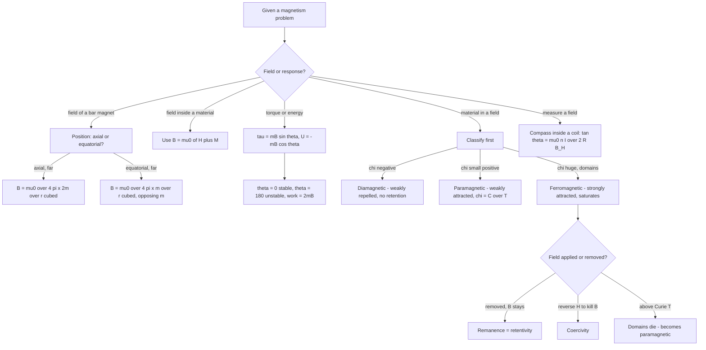

# Magnetism

Where the previous unit asked how a *current* makes a field, this one asks what a *material* does in a field. Two questions carry the whole chapter: what is the field of a bar magnet, and how do dia-, para- and ferromagnetic substances respond to an applied field. The rest — Earth's magnetism, the hysteresis loop, the tangent galvanometer — is measurement, and it reuses the same four quantities: $\vec{B}$, $\vec{H}$, magnetisation $\vec{M}$ and susceptibility $\chi$.

### 🟢 Lite — Quick Review (1h–1d)

**Bar magnet — the four facts**

- Every magnet has two poles, north and south, and a line joining them called the **magnetic axis**. Isolated magnetic poles do not exist in nature, so a bar magnet is always modelled as a **magnetic dipole**, with magnetic moment $m = ML$ directed from the south pole to the north pole (unit A·m²).
- A bar magnet placed in a uniform field feels a **torque** $\tau = mB\sin\theta$, but no net force. It rotates until its axis lies along the field.
- Stability: $\theta = 0°$ (moment along the field) is **stable**; $\theta = 180°$ (moment against the field) is **unstable**. A freely suspended magnet oscillates about the field direction and comes to rest along it.
- Work done in rotating a magnet from the anti-parallel to the parallel position is $2mB$.

**The field of a bar magnet** (outside the magnet only, as for a point dipole at large distance $r$ from the centre)

| Position | Field | Direction |
|---|---|---|
| On the axial line (beyond the north pole) | $B_{ax} = \dfrac{\mu_0}{4\pi}\dfrac{2m}{r^3}$ | along $\vec{m}$, out of the north pole |
| On the equatorial line (perpendicular bisector) | $B_{eq} = \dfrac{\mu_0}{4\pi}\dfrac{m}{r^3}$ | antiparallel to $\vec{m}$ |
| General polar angle $\theta$ | $B = \dfrac{\mu_0}{4\pi}\dfrac{m}{r^3}\sqrt{1 + 3\cos^2\theta}$ | — |

The equatorial field is exactly half the axial field at the same distance, and points in the *opposite* sense to the moment. That factor of two and that reversal are both frequently tested.

**Gauss's law for magnetism: $\oint \vec{B}\cdot d\vec{A} = 0$.** No magnetic monopole exists, so magnetic field lines never begin or end; they always close. A bar magnet's field outside is identical to that of an electric dipole, but there the field lines begin on + and end on −, whereas here the lines run north to south outside and south to north inside the magnet.

**The four field quantities, and how they differ**

| Symbol | Name | Defined as | Unit |
|---|---|---|---|
| $\vec{B}$ | Magnetic field (flux density) | force on a unit pole in vacuum, $F = m_0 B$ | tesla |
| $\vec{H}$ | Magnetic field intensity | free current enclosed by a loop: $H = nI$ | A m⁻¹ |
| $\vec{M}$ | Magnetisation | magnetic moment per unit volume, $M = m/V$ | A m⁻¹ |
| $\chi$ | Magnetic susceptibility | $M = \chi H$ | dimensionless |
| $\mu_r$ | Relative permeability | $\mu = \mu_0\mu_r$, and $\mu_r = 1 + \chi$ | dimensionless |

Inside a material, $\vec{B} = \mu_0(\vec{H} + \vec{M})$. Note that $\vec{B}$ is what a force or an emf responds to, and $\vec{H}$ is what the *free* currents in the circuit produce — which is why $H = nI$ for a solenoid regardless of what fills it.

**Material classes at a glance**

| Property | Diamagnetic | Paramagnetic | Ferromagnetic |
|---|---|---|---|
| $\chi$ | $\approx -10^{-5}$, negative | $\approx +10^{-3}$ to $10^{-5}$ | up to $10^5$, temperature dependent |
| Effect of field | weakly repelled | weakly attracted | strongly attracted |
| $\mu_r$ | slightly below 1 | slightly above 1 | very large |
| Mechanism | induced dipole opposes field | permanent dipoles align weakly | domains align spontaneously |
| Retains magnetisation | no | no (at ordinary T) | yes, up to the Curie point |
| Examples | bismuth, copper, silver, water | aluminium, platinum, oxygen | iron, cobalt, nickel, Fe₃O₄ |

**Earth's magnetism, in four numbers**

- **Declination $\delta$** — the angle between geographic north and magnetic north. Roughly 0–15° in most of India; zero along the magnetic meridian.
- **Dip or inclination $\alpha$** — the angle the total field makes with the horizontal. 0° at the magnetic equator, 90° at the magnetic poles; about 30–45° across much of India.
- **Horizontal component** $B_H = B\cos\alpha$; **vertical component** $B_V = B\sin\alpha$. At the surface of the Earth $B$ is of order 50 μT, with $B_H$ around 25–30 μT in India.
- **Magnetic meridian** — the vertical plane containing the geographical north–south direction and the Earth's field.

**Permanent magnets, in one line each**

A material makes a good permanent magnet if it has high **remanence** (residual $B$ after the external field is removed) and high **coercivity** (the reverse field needed to demagnetise it). Alnico and NdFeB are common; steel has high remanence but low coercivity, which suits permanent magnets, while soft iron and silicon steel have low coercivity, which suits transformer cores.

### 🟡 Standard — Regular Study (2d–2mo)

**Magnetic poles, Gauss's law, and why the two fields differ**

Coulomb's law for magnetism is written with an unknown constant: $F = \dfrac{\mu_0}{4\pi}\dfrac{m_1m_2}{r^2}$ for fictitious point poles $m_1$ and $m_2$. Integrating this over any closed surface gives zero net flux, because every field line entering the surface also leaves it — a consequence of the absence of monopoles. Electric field lines behave differently only because charge is a real thing and charge can be separated.

This gives a clean way to see a bar magnet's field. Imagine the bar replaced by two fictitious point poles $+m$ at the north end and $-m$ at the south end, a distance $2l$ apart, with the dipole moment $m_{\text{mag}} = 2ml$. Along the axis, a point at distance $r$ from the centre sees the two poles at $r - l$ and $r + l$:

$$B_{ax} = \frac{\mu_0 m}{4\pi}\left[\frac{1}{(r-l)^2} - \frac{1}{(r+l)^2}\right] \;\xrightarrow{r \gg l}\; \frac{\mu_0}{4\pi}\frac{2m_{\text{mag}}}{r^3}$$

On the equatorial line the two contributions point the same way, opposing the moment, and give $B_{eq} = \dfrac{\mu_0}{4\pi}\dfrac{m_{\text{mag}}}{r^3}$ for $r \gg 2l$. Both expressions are only valid *outside* the magnet; inside, the surface-pole model breaks down and you must use $\vec{B} = \mu_0(\vec{H} + \vec{M})$.

**Torque, energy and stability**

A dipole of moment $\vec{m}$ in a uniform field feels $\tau = \vec{m}\times\vec{B}$, and the potential energy is $U = -\vec{m}\cdot\vec{B} = -mB\cos\theta$. The energy is minimum at $\theta = 0$ and maximum at $\theta = 180°$, which is exactly the definition of stable and unstable equilibrium. Small angular oscillations about $\theta = 0$ have frequency

$$f = \frac{1}{2\pi}\sqrt{\frac{mB}{I}}$$

where $I$ is the moment of inertia of the magnet. This is the magnetometer, and it is why a magnetometer-based navigation compass works: the restoring torque is proportional to the displacement, so the needle oscillates and then settles along the meridian.

**Classification of magnetic materials — the mechanism, not the label**

**Diamagnetism** is an induced effect present in every material, but only visible where $\chi$ is small and negative. Applying a field produces a tiny orbital change that generates a moment *opposing* the field; the effect vanishes when the field is removed. Weak diamagnetism is masked by the much larger paramagnetism in most metals, which is why copper, silver and gold are described as diamagnetic while iron, cobalt and nickel are not.

**Paramagnetism** comes from permanent atomic dipoles — spin and orbital magnetic moments — that are randomly oriented in the absence of a field. A field aligns a small excess of them along itself, giving a small positive $\chi$ that falls roughly as $1/T$ (the Curie law, $\chi = C/T$). Aluminium, platinum, sodium, calcium and oxygen are examples.

**Ferromagnetism** is the case where the effect is enormous. Atomic magnetic moments in a ferromagnetic exchange spontaneously align in groups called **domains**, each domain fully magnetised. In an unmagnetised sample the domain moments point in random directions and cancel. Applying a field causes domain walls to move and domains to grow, so $M$ rises steeply; near saturation all domains point the same way and the curve flattens. Above the **Curie temperature** the thermal agitation destroys domain alignment and the material becomes merely paramagnetic, with $\chi = C/(T - T_c)$ by the Curie–Weiss law. The Curie point of iron is about 770 °C, of cobalt about 980 °C, of nickel about 358 °C.

**The hysteresis loop**

A $B$–$H$ loop is measured by cycling a sample through a magnetising field and recording the internal $B$ against $H$. Reading the loop:

- **Retentivity / remanence** — the value of $B$ remaining when $H$ is brought back to zero. High remanence means the material holds its magnetism.
- **Coercivity** — the value of $H$ that must be applied in the reverse direction to reduce $B$ to zero. High coercivity means the material resists demagnetisation.
- The **area of the loop** is the energy lost as heat per unit volume per cycle, which is why transformer cores are laminated and made of soft iron with narrow loops.

Soft materials (soft iron, silicon steel, mumetal) have narrow loops, low coercivity and small hysteresis loss; they are the right choice for transformer cores and electromagnets, which are magnetised and demagnetised continuously. Hard materials (steel, Alnico) have wide loops, high coercivity and high retentivity; they are the right choice for permanent magnets, which should not lose their field.

**Earth's magnetism**

The Earth behaves roughly as a giant dipole whose south magnetic pole lies near the geographic north. The horizontal component is measured with a **tangent galvanometer**: a compass needle is placed at the centre of a vertical coil of $n$ turns, and when the coil is rotated to put its plane perpendicular to the Earth's horizontal field, the deflection $\theta$ obeys

$$\tan\theta = \frac{\mu_0 n I}{2 R B_H} \quad\Rightarrow\quad B_H = \frac{\mu_0 n I}{2R\tan\theta}$$

The horizontal field turns the needle by $\theta$ while the coil's own field turns it by 90°, and the two combine in the tangent relation. Because the relation uses $\tan\theta$ rather than $\sin\theta$, a question that swaps them is testing whether the candidate knows the geometry, not the formula.

**Converting a galvanometer into an ammeter or a voltmeter**

A galvanometer of resistance $G$ and full-scale current $I_g$ is a sensitive but low-range instrument.

- **As an ammeter** reading up to $I$: a low-resistance **shunt** $S$ in parallel with the galvanometer carries the excess current. At full scale $I_g G = (I - I_g)S$, so $S = \dfrac{I_g G}{I - I_g}$. A shunt makes the instrument's resistance far *smaller* than the circuit's, so it barely disturbs it.
- **As a voltmeter** reading up to $V$: a high resistance in **series** carries the same small current while dropping most of the potential difference. $V = I_g(G + R)$, so $R = \dfrac{V}{I_g} - G$. The instrument's resistance becomes far *larger* than the circuit's.

The mnemonic that survives: **ammeter = shunt = parallel = small resistance; voltmeter = multiplier = series = large resistance.** The physics behind it is the same in both cases — the meter must draw negligible current and drop negligible voltage in the circuit it measures.

### 🔴 Extended — Deep Study (3mo+)

**The demagnetising field and the demagnetising factor**

A magnetised bar magnet itself produces a field, and inside the magnet that field opposes the magnetisation. Write the internal field as $H = H_{\text{applied}} - N M$, where $N$ is the **demagnetising factor**, which depends only on the *shape* of the sample and not on its material. For a very long thin needle $N \to 0$; for a sphere $N = 1/3$; for a flat disc magnetised perpendicular to its face $N \to 1$.

Two consequences matter. A long thin magnet holds its field far better than a short stubby one of the same material, which is why permanent magnets are made elongated. And a material's response in a material of its own shape must be solved self-consistently, since $M = \chi H = \chi(H_a - NM)$ gives $M = \chi H_a/(1 + \chi N)$ — the self-demagnetising correction is what keeps very high $\chi$ materials from showing infinite permeability.

**Magnetisation, domains and the hysteresis mechanism**

The exchange interaction between neighbouring spins is what makes domains form at all; without it, ferromagnetism would be impossible because thermal agitation would randomise every moment. A domain wall is a transition region of a few hundred atomic spacings in which the moment rotates from one direction to the next.

Cycling the field then reads as: below the **coercive force**, domain walls move elastically and the change is reversible — this is the region of the loop where the material could be used as a memory element. Beyond it, walls move by irreversible jumps, the loop is wide, and energy is dissipated as heat. Once the field exceeds the **saturation field**, all domains are aligned and no further magnetisation is possible; the $M$–$H$ curve flattens there while the $B$–$H$ loop still opens, because $B$ continues to grow through $\mu_0M$.

**Energy and losses — the quantitative picture**

Hysteresis energy loss per unit volume per cycle equals the **area enclosed by the loop**, in joules per cubic metre per cycle. Steinmetz' empirical form is $P_h = \eta B_{max}^{1.6} f / \rho$, so raising the supply frequency or the peak flux raises the core loss as a power. Eddy-current loss scales as $P_e \propto t^2 f^2 B^2$, where $t$ is the lamination thickness, which is why cores are built from thin insulated sheets — halving $t$ cuts the eddy-current loss by a factor of four.

**What limits a permanent magnet**

Three quantities decide how good a material is: **remanence** (how much $B$ survives), **coercivity** (how much reverse field it survives) and **curie temperature** (how hot you can heat it while making it). A magnet is not a fixed object: if a steel magnet is heated above its Curie point, the domain structure is destroyed and it is permanently demagnetised. It can also be demagnetised by a sharp blow or by placing it in a strong reverse field, both of which let domains slip past their coercive barriers. Alnico retains good remanence but loses it badly above about 200 °C; NdFeB is stronger but has a lower working temperature — which is why phone magnets and car magnets are different alloys.

**Worked example — force between two bar magnets**

Two identical bar magnets, each of moment $m$, are placed end to end along their common axis with a gap $d$ between the near poles, so the centre-to-centre distance is $r = l + d + l = 2l + d$ if each magnet has pole separation $2l$. Treat each as a point dipole. When the facing poles are **unlike**, the configuration is like-charges-facing in the dipole picture and the force is attractive; the axial force between two collinear dipoles separated by $r$ is

$$F = \frac{3\mu_0 m_1 m_2}{2\pi r^4}$$

directed to pull them together. When the facing poles are **like**, the same magnitude is repulsive. The $1/r^4$ fall-off is worth noticing: two dipoles interact far more weakly than the $1/r^3$ of either field alone, because the fields themselves decay. Rotate one magnet to a perpendicular (equatorial) orientation and the axial expression no longer applies — that case carries a different coefficient — so always state the geometry in words before choosing a formula.

**Worked example — mutual force between two small magnets**

Two magnets of moment 10 A·m² each are placed 0.20 m apart, collinear and parallel, north pole of one facing south pole of the other.

$r = 0.2$ m, so $r^4 = 0.0016$ m⁴.
$F = \dfrac{3 \times 4\pi\times 10^{-7}\times 100}{2\pi \times 0.0016} = \dfrac{1.2\pi\times 10^{-4}}{3.2\pi\times 10^{-3}} = 3.75\times 10^{-2}$ N.

Attractive. A small number, and that is the point — a classroom bar magnet is weak, and this is why the same experiment with a horseshoe magnet closing a small gap pulls a paperclip hard: the air gap is a few millimetres rather than 20 cm, and the $1/r^4$ dependence does the rest.

**Worked example — a bar magnet in a field**

A magnet of moment 0.5 A·m² is placed in a uniform field of 0.02 T at an angle of 60° to the field.

$\tau = mB\sin 60° = 0.5 \times 0.02 \times 0.866 = 8.66\times 10^{-3}$ N·m.
$U = -mB\cos 60° = -0.5 \times 0.02 \times 0.5 = -5\times 10^{-3}$ J.

Work needed to turn it slowly from parallel to the given angle: $\Delta U = U_{60} - U_0 = -5\times 10^{-3} - (-1\times 10^{-2}) = +5\times 10^{-3}$ J. The field does that much work in rotating the magnet into alignment. Note that $\tau$ and $\Delta U$ use different trigonometric functions — $\sin$ for the torque and $\cos$ for the energy — and mixing them up is the standard error.

**Worked example — magnetisation curve and susceptibility**

A toroidal solenoid of 1000 turns, mean radius 0.10 m, carries a current of 0.5 A, and its core is filled with a material of relative permeability 500.

$H = nI = (N/2\pi r)I = \dfrac{1000}{0.628} \times 0.5 = 1592 \times 0.5 = 796$ A m⁻¹.
$B = \mu_0 \mu_r H = 4\pi\times 10^{-7} \times 500 \times 796 = 0.50$ T.
$M = \chi H = (\mu_r - 1)H = 499 \times 796 = 3.97\times 10^5$ A m⁻¹.
Check: $B = \mu_0(H + M) = 4\pi\times 10^{-7}(796 + 3.97\times 10^5) = 4\pi\times 10^{-7}\times 3.978\times 10^5 \approx 0.50$ T. Consistent.

The distinction between $H$ and $B$ is what this whole chapter exists to teach: $H$ is set by the coil alone, $B$ is multiplied by the material's response.

**The limits of the linear model**

Linear behaviour ($B = \mu H$, constant $\mu$) holds only while the material is *not* saturated. For a ferromagnet the graph curves sharply, and after the first cycle the material is no longer in its virgin state, so the whole path is history-dependent — that history dependence is what hysteresis *is*. Diamagnets and paramagnets stay linear over enormous ranges, which is why their permeabilities can be quoted as single numbers while a ferromagnet's cannot.

### 🧠 Memory Anchors

- **"Moment points south to north."** A magnet's dipole moment, like a current loop's, points in the direction the right-hand rule gives — from the south pole to the north pole. Getting this backwards flips the direction of the equatorial field.
- **"Axial is double, equatorial is opposite."** $B_{ax} = 2B_{eq}$ at the same distance, and the equatorial field runs against the moment. Both halves of that sentence are testable independently.
- **"$\mu_r = 1 + \chi$."** One relation connects the two things a question might ask for.
- **"Ampere = shunt = parallel; voltmeter = multiplier = series."** The resistance must be small for a current measurement and large for a voltage measurement, for the same reason in both cases.
- **"Area of the loop = energy lost per cycle."** Narrow loop, soft iron, transformer core. Wide loop, hard steel, permanent magnet.
- **"Soft means it gives it up easily."** Soft iron loses its magnetisation at the slightest reverse field, which is exactly why it makes good transformer cores and bad permanent magnets.
- **Flashcard Q&A:**
  - *Gauss's law for magnetism?* → $\oint \vec{B}\cdot d\vec{A} = 0$; no monopoles.
  - *Field on the equatorial line?* → $\mu_0 m/4\pi r^3$, antiparallel to $\vec{m}$.
  - *Work to turn a magnet from anti-parallel to parallel?* → $2mB$.
  - *$\chi$ of a perfect diamagnet?* → −1 (a superconductor), because $B = 0$ inside.
  - *What kills ferromagnetism?* → heating above the Curie point, or a reverse field exceeding the coercivity.
  - *Is $\vec{B}$ or $\vec{H}$ set by the coil?* → $\vec{H}$; $\vec{B}$ also includes the material's $\vec{M}$.
  - *Why is Earth's field measured with a horizontal component?* → the field is inclined, and the tangent galvanometer responds to the horizontal part.
  - *Demagnetising factor of a long thin needle?* → nearly zero.

### 🎯 Exam Traps & Error Log

1. **Writing the moment of a bar magnet as pointing north to south.** The dipole moment of a current loop points along the right-hand rule, i.e. south pole to north pole. Reversing it reverses the predicted direction of the equatorial field.
2. **Forgetting the factor of 2 in the axial field,** or writing the equatorial field parallel to $\vec{m}$. At the same distance, the axial field is twice the equatorial and the equatorial one is antiparallel.
3. **Applying the dipole formulas *inside* the magnet.** The fictitious-pole model is only valid outside; inside, use $B = \mu_0(H + M)$ or the demagnetising-field treatment.
4. **Confusing $\vec{H}$ with $\vec{B}$.** $H = nI$ is what the free current produces; $B$ also carries the material's contribution. A question giving a solenoid current and asking for the field *in* a core needs $B = \mu_0\mu_r nI$, and the field in the core is hundreds of times larger.
5. **Using $\sin\theta$ in the energy instead of $\cos\theta$.** $\tau = mB\sin\theta$ and $U = -mB\cos\theta$ are different functions; the torque is largest at 90° and the energy is smallest at 0°.
6. **Calling the equatorial direction stable.** Only alignment *with* the field is stable. A magnet released anti-parallel flips through 180°.
7. **Shunting an ammeter in series or a voltmeter in parallel.** An ammeter in series works; a voltmeter in parallel works. The two errors are each other's inverse and both destroy the measurement.
8. **Forgetting the internal resistance $G$ of the galvanometer** when converting it. The shunt formula uses $I_gG$, and the multiplier formula subtracts $G$ at the end.
9. **Using $\tan\theta$ where the geometry calls for $\sin\theta$** in the tangent galvanometer, or assuming the coil's field adds to the Earth's rather than replacing it at the moment of balance.
10. **Claiming a paramagnet stays magnetised after the field is removed.** Without domains there is no mechanism to retain magnetisation; the moments randomise as soon as the field goes.
11. **Treating $\chi$ and $\mu_r$ as independent.** They differ by exactly 1. A quoted relative permeability of 1000 means $\chi = 999$, not 1000.
12. **Using the solenoid field formula outside a long solenoid.** $B = \mu_0 nI$ assumes a long solenoid; near the centre of a short coil the field is lower and the demagnetising effect matters.

### 🧪 Self-Test — 8 Questions with Worked Answers

**1. A bar magnet of moment 2 A·m² is placed in a uniform field of 0.05 T. Find the torque when the axis is at 30° to the field, and the work to bring it from the parallel position to this one.**
$\tau = mB\sin 30° = 2 \times 0.05 \times 0.5 = 0.05$ N·m.
$U_{30} = -mB\cos 30° = -2 \times 0.05 \times 0.866 = -0.0866$ J. $U_0 = -mB = -0.1$ J.
Work done by an external agent: $\Delta U = -0.0866 - (-0.1) = +0.0134$ J.
The field is doing that much work in the same direction. Both numbers together — torque *and* energy — is the standard two-part form of this question.

**2. Two bar magnets of moment 1 A·m² each are placed with their axes collinear and 0.10 m apart, north pole of one facing south pole of the other. Find the force.**
$F = \dfrac{3\mu_0 m_1m_2}{2\pi r^4} = \dfrac{3 \times 4\pi\times 10^{-7}\times 1}{2\pi \times (0.1)^4} = \dfrac{12\pi\times 10^{-7}}{2\pi\times 10^{-4}} = \dfrac{12}{2}\times 10^{-3} = 6\times 10^{-3}$ N.
Attractive. If the facing poles were like poles, the magnitude is the same and the force is repulsive. The $r^4$ dependence is the detail worth remembering: the fall-off is steeper than the $r^{-3}$ of either field.

**3. A solenoid of 800 turns per metre carries 1.2 A. Find $H$ and, with a core of relative permeability 200, find $B$.**
$H = nI = 800 \times 1.2 = 960$ A m⁻¹.
$B = \mu_0\mu_r H = 4\pi\times 10^{-7}\times 200\times 960 = 2.41\times 10^{-1}$ T ≈ 0.24 T.
$M = \chi H = 199 \times 960 = 1.91\times 10^5$ A m⁻¹, so $B = \mu_0(H+M) = 4\pi\times 10^{-7}(960 + 1.91\times 10^5) \approx 0.24$ T. Same answer, which is the internal consistency check. Note that $H$ depends only on the coil — the core does not appear in it.

**4. A galvanometer has $G = 200$ Ω and $I_g = 1$ mA. Convert it into (a) a 0–5 A ammeter and (b) a 0–10 V voltmeter.**
(a) $S = \dfrac{I_gG}{I - I_g} = \dfrac{10^{-3}\times 200}{5 - 10^{-3}} = \dfrac{0.2}{4.999} = 0.0400$ Ω. The ammeter's resistance is $G\parallel S \approx 0.04$ Ω, far below the circuit it will measure, so it barely disturbs it.
(b) $R = \dfrac{V}{I_g} - G = \dfrac{10}{10^{-3}} - 200 = 10000 - 200 = 9800$ Ω. The voltmeter's total resistance is $G + R = 10000$ Ω, far above the circuit's, so it draws negligible current.
The asymmetry is the design principle: a meter must not load the circuit it measures.

**5. A long cylindrical magnet has length 8 cm and diameter 1.5 cm. Its dipole moment is 0.6 A·m². Find the field at 20 cm from its centre on the axial line.**
The magnet is elongated, so the far-field dipole expression applies at $r = 0.20$ m.
$B_{ax} = \dfrac{\mu_0}{4\pi}\dfrac{2m}{r^3} = 10^{-7}\times\dfrac{1.2}{(0.2)^3} = 10^{-7}\times\dfrac{1.2}{0.008} = 1.5\times 10^{-5}$ T.
On the equatorial line at the same distance the field would be $7.5\times 10^{-6}$ T, directed opposite to the moment. Both numbers are of order tens of microtesla, the same scale as the Earth's field — which is why a bar magnet in a laboratory compass visibly deflects the needle.

**6. A coil of $n$ turns and mean radius $r$ is placed on a table, and a compass needle at its centre is rotated by $90^\circ$ when a current $I$ is switched on. The same needle is deflected by $\theta$ from the magnetic meridian. Find the horizontal component of the Earth's field and the declination.**
The coil's field at its centre, when the plane is perpendicular to the needle, is $B_c = \mu_0 n I/2r$. Setting the total deflection to $90^\circ$ means the coil's field and the Earth's horizontal field are perpendicular, so
$\tan 90^\circ = \dfrac{\mu_0 n I}{2r B_H} \Rightarrow B_H = \dfrac{\mu_0 n I}{2r\tan 90^\circ} = 0$ in that limit,
which shows why the experiment is *not* done at 90°: the deflection is set to a finite angle $\theta$, and then
$$B_H = \frac{\mu_0 n I}{2r\tan\theta}$$
The declination $\delta$ is read directly from the magnetic meridian drawn on the paper beneath the compass. Do the measurement away from electrical wiring and steel furniture — a current in a nearby cable deflects the needle by far more than the Earth's field does.

**7. A toroid of 500 turns and mean radius 0.15 m carries 0.8 A. Find the field at a point 0.15 m from the axis inside the core, and state the field outside.**
$B = \dfrac{\mu_0 N I}{2\pi r} = \dfrac{4\pi\times 10^{-7}\times 500\times 0.8}{2\pi \times 0.15} = \dfrac{1.6\pi\times 10^{-4}}{0.3\pi} = 5.33\times 10^{-4}$ T.
Outside the toroid the enclosed current is zero, so the field is zero — that is the toroid's chief advantage over a solenoid for confining a field.
At 0.10 m inside, where $r$ is smaller, the field would be $\frac{0.15}{0.10} = 1.5$ times larger: the field varies as $1/r$ within the core. Treating the whole core as having one field is an approximation valid only for a thin toroid.

**8. The magnetisation curve of a material is given at one point: $H = 10^3$ A m⁻¹ and $B = 0.5$ T. Find $M$ and $\chi$, and state the class of the material.**
$M = B/\mu_0 - H = \dfrac{0.5}{4\pi\times 10^{-7}} - 10^3 = 3.98\times 10^5 - 1.0\times 10^3 = 3.97\times 10^5$ A m⁻¹.
$\chi = M/H = 3.97\times 10^5/10^3 = 397$.
$\mu_r = 1 + \chi = 398$.
A susceptibility of order $10^2$–$10^3$ is ferromagnetic, not paramagnetic (which is of order $10^{-3}$). Note the size of the correction: at this field the $H$ term is 2500 times smaller than the $M$ term, which is exactly why $\mu_r$ and $\chi$ are so nearly equal for ferromagnetic materials and why the distinction is meaningless at that scale.

### 💡 Pro Tips

1. **Draw the magnet before calculating.** Marking N and S, the axis, and the point being asked about takes ten seconds and settles the direction questions that no amount of algebra can.
2. **Say the geometry in words first** — "on the axial line, beyond the north pole" — then pick the formula. Most wrong answers in this chapter are the right formula applied at the wrong point on the magnet.
3. **Memorise $\mu_r = 1 + \chi$ and use it as a check.** If a solution quotes $\chi = 1000$ and $\mu_r = 900$, one of them has slipped.
4. **Use the $B$–$H$ loop as a vocabulary diagram.** Remanence, coercivity, saturation and hysteresis loss are all *features of that loop*, so knowing the loop explains all four at once.
5. **In galvanometer conversions, write the full-scale condition explicitly** — "at full scale $I_gG = (I - I_g)S$" — and the arithmetic follows without a second thought.
6. **Keep the units in the rescaling visible.** A field of 0.24 T in a solenoid core against 960 A m⁻¹ of $H$ is a factor of ~200, and knowing the factor is a useful final sanity check.
7. **Learn Earth's field qualitatively, not numerically.** The relationships $B_H = B\cos\alpha$ and $B_V = B\sin\alpha$, plus the definitions of declination and dip, are worth far more marks than a memorised declination for a particular city.
8. **Do the torque and energy questions as a pair.** Whatever the question asks, having both $\tau = mB\sin\theta$ and $U = -mB\cos\theta$ on the page uses up the rest of the question.

## Continue your study

- **[View this topic in your CUET UG roadmap](/roadmap/?exam=cuet&duration=1mo)** — see where "Magnetism" fits in your personalised plan
- **[Build a quick revision plan](/roadmap/?exam=cuet&duration=1d)** — 1-day sprint covering highest-weight topics
- **[CUET UG exam overview](/exams/cuet/)** — pattern, eligibility, and syllabus
- **[All Physics notes](/notes/cuet/physics/)** — browse sibling topics in this subject
