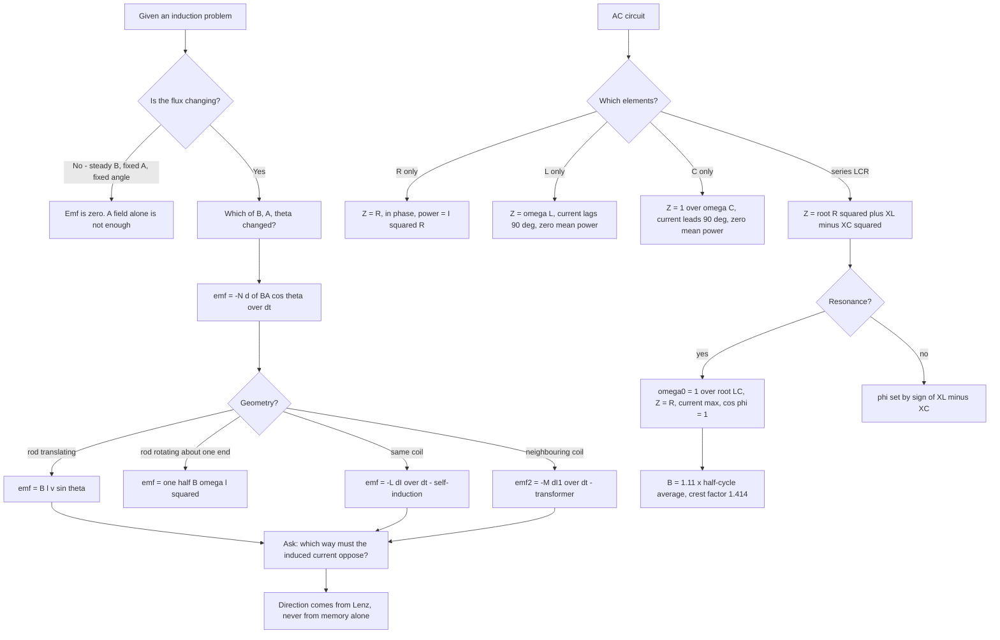

# Electromagnetic Induction and Alternating Current

Two ideas carry this chapter. The first is that a *changing* magnetic flux is the trigger — not a magnetic field, and not motion, but a change in the flux through a circuit. The second is that an induced emf always opposes the change that produced it, so no process in this chapter ever creates energy from nothing. Everything else — self-inductance, the AC generator, the transformer, the LCR resonance — is one of those two ideas applied to a different geometry.

### 🟢 Lite — Quick Review (1h–1d)

**The two laws, stated precisely**

- **Faraday's law:** $\varepsilon = -N\dfrac{d\Phi}{dt}$ where $\Phi = BA\cos\theta$ is the flux through **one** turn. The minus sign is not decoration; it encodes Lenz's law.
- **Lenz's law:** the induced current flows in the direction that opposes the change in flux which produced it. The mechanical work you do in moving a magnet is converted to electrical energy in the circuit — you cannot get current without paying for it.

**A table of every induction formula you need**

| Situation | Induced emf | Variables |
|---|---|---|
| General loop | $\varepsilon = -N\dfrac{d(BA\cos\theta)}{dt}$ | $\Phi$ in Wb, t in s |
| Stationary loop, changing field | $\varepsilon = -NA\cos\theta\dfrac{dB}{dt}$ | — |
| Rod of length $\ell$ moving at $v$ | $\varepsilon = B\ell v\sin\theta$ | $\ell$ in m, v in m s⁻¹ |
| Rod rotating about one end | $\varepsilon = \tfrac{1}{2}B\omega\ell^2$ | $\omega$ in rad s⁻¹ |
| Self-induction | $\varepsilon = -L\dfrac{dI}{dt}$ | L in henry |
| Mutual induction | $\varepsilon_2 = -M\dfrac{dI_1}{dt}$ | M in henry |

**Inductance values**

- Solenoid: $L = \dfrac{\mu_0 N^2 A}{\ell}$
- Toroid: $L = \dfrac{\mu_0 N^2 r}{2\pi R}$, where $r$ = cross-section radius and $R$ = mean radius
- Parallel plate capacitor-style coil: $L = \dfrac{\mu_0 A}{d}$ in air, $\dfrac{\mu_0\mu_r\varepsilon_r A}{d}$ if filled
- Two coils: $M = k\sqrt{L_1L_2}$ with $0 \le k \le 1$
- Energy stored: $U = \tfrac{1}{2}LI^2$; energy density in vacuum: $u = \dfrac{B^2}{2\mu_0}$

**Alternating current — the definitions**

| Quantity | Symbol | Value for a sine wave |
|---|---|---|
| Instantaneous emf | $\varepsilon$ | $\varepsilon_0\sin\omega t$ |
| Peak / maximum | $\varepsilon_0$ | amplitude |
| RMS | $\varepsilon_{rms}$ | $\varepsilon_0/\sqrt{2} = 0.707\,\varepsilon_0$ |
| Average over a full cycle | — | zero |
| Average over a half cycle | $\varepsilon_{av}$ | $2\varepsilon_0/\pi = 0.637\,\varepsilon_0$ |
| Form factor | $\varepsilon_{rms}/\varepsilon_{av}$ | 1.11 |
| Crest (peak) factor | $\varepsilon_0/\varepsilon_{rms}$ | 1.414 |

Mains supply is 230 V **rms**, so the peak is $230\sqrt{2} \approx 325$ V. Every household rating, every appliance label and every "safe" statement about mains refers to the rms value, not the peak.

**Circuit elements under AC**

| Element | Impedance | Phase relationship | Increases with frequency? |
|---|---|---|---|
| Resistor $R$ | $R$ | current and voltage in phase | no |
| Inductor $L$ | $X_L = \omega L$ | current **lags** voltage by 90° | yes |
| Capacitor $C$ | $X_C = \dfrac{1}{\omega C}$ | current **leads** voltage by 90° | no (falls) |

**Series LCR**

$$Z = \sqrt{R^2 + \left(\omega L - \frac{1}{\omega C}\right)^2}, \qquad \tan\phi = \frac{\omega L - 1/(\omega C)}{R}, \qquad \cos\phi = \frac{R}{Z}$$

At resonance $\omega_0 = 1/\sqrt{LC}$, so $X_L = X_C$, $Z$ is a minimum equal to $R$, the current is a maximum, and $\phi = 0$.

**Mean power and power factor**

$$\bar{P} = \varepsilon_{rms} I_{rms}\cos\phi = I_{rms}^2 R = \frac{\varepsilon_{rms}^2 R}{Z^2}$$

$\cos\phi$ is the **power factor**. In a purely reactive circuit $\cos\phi = 0$ and the mean power is zero even though currents flow — energy shuttles back and forth between source and reactive element and is never dissipated.

**Transformer, ideal**

$$\frac{\varepsilon_s}{\varepsilon_p} = \frac{N_s}{N_p} = \frac{I_p}{I_s}, \qquad \varepsilon_p I_p = \varepsilon_s I_s$$

Voltage transforms up in the same ratio that current transforms down. That single fact is why AC is used for transmission: raise the voltage a hundredfold and the line current falls a hundredfold, so the $I^2R$ heating in the transmission line falls by a factor of $10^4$.

### 🟡 Standard — Regular Study (2d–2mo)

**What counts as "changing flux"**

The emf is induced when $d\Phi/dt \neq 0$, which can come from any of three sources: the field strength $B$ changes, the area $A$ changes, or the angle $\theta$ between them changes. A conductor sitting in a steady uniform field with fixed area and fixed orientation has no emf, however strong the field is. That is the single most common conceptual error in the chapter, and the assertion–reason option "a conductor in a magnetic field always has an emf" is testing exactly that.

Lenz's law in words, case by case:

- **Flux into the page increasing** → induced current flows so as to produce a field *out* of the page → **anticlockwise**.
- **Flux into the page decreasing** → induced current flows to support the into-page field → **clockwise**.
- **Loop moving away from a north pole** → flux through the loop decreases → induced current makes the loop's face a north pole → current **anticlockwise** as seen from the magnet.

**Motional emf**

A rod of length $\ell$ moving with velocity $\vec{v}$ in a field $\vec{B}$ feels a force $qvB$ on each free electron, so charge piles up at one end until the electric force from that separation balances the magnetic force. The resulting potential difference is the emf, and for motion perpendicular to the field, $\varepsilon = B\ell v$. More generally $\varepsilon = B\ell v\sin\theta$ where $\theta$ is the angle between $\vec{v}$ and $\vec{B}$ — a rod moving *along* its own length and *along* the field has no emf at all.

If the rod rotates about one end with angular velocity $\omega$, every element at distance $x$ moves with speed $v = \omega x$ and contributes $d\varepsilon = Bx\omega\,dx$, so

$$\varepsilon = \int_0^{\ell} B\omega x\,dx = \frac{1}{2}B\omega\ell^2$$

This is the principle of the homopolar generator and of the Faraday disc. Note the $\ell^2$: doubling the length quadruples the emf, which is different from the $\ell$ dependence of a translating rod.

**Self-induction**

Every current-carrying coil produces its own magnetic field, and some of that flux links back through the same coil. When the current changes, the linked flux changes, so the coil induces an emf in itself opposing that change. By definition $\Phi = LI$, so

$$\varepsilon = -L\frac{dI}{dt}$$

$L$ depends on the coil's geometry and on the material's permeability, and scales as $N^2$: doubling the number of turns quadruples the inductance, because the flux linking (∝ N) and the turns themselves (∝ N) both contribute. Energy is stored in the field, $U = \tfrac{1}{2}LI^2$, and the voltage across an inductance at instant $I$ is $V = LI/t$ for a current built up uniformly from zero in time $t$ — which is why switching circuits produce large "back emf" spikes at the moment of interruption.

**Mutual induction and the transformer**

If a changing current in coil 1 links flux through a nearby coil 2, an emf appears in coil 2: $\varepsilon_2 = -M\,dI_1/dt$, with $M$ the mutual inductance, bounded by $M = k\sqrt{L_1L_2}$ for $0 \le k \le 1$. $k = 1$ means perfect coupling — every flux line from coil 1 threads coil 2 — which is a theoretical ideal since real coils always leak some flux.

A transformer is mutual induction with a deliberate design: a laminated iron core to raise $k$, an alternating primary current to keep changing the flux, and different turn counts to set the voltage ratio. Because $V$ is proportional to the rate of change of flux and to the number of turns, $\varepsilon_p/\varepsilon_s = N_p/N_s$ exactly for an ideal core. Since power is conserved, $I_p/I_s = N_s/N_p$.

**Eddy currents**

A bulk conductor in a changing field has currents circulating in closed loops inside it, perpendicular to the flux. They dissipate energy as heat and they oppose the flux change, in full agreement with Lenz's law. The energy loss scales as $t^2f^2B^2$, where $t$ is the thickness of the material in the direction of the flux and $f$ the frequency. Two engineering consequences follow immediately: **laminate the core** into thin insulated sheets, and **use a high-resistivity** material such as silicon steel. An induction cooktop uses the eddy current in the steel pan itself as the heating element, which is why a pan must be ferromagnetic and why the hob is flat and glass-topped.

**From the AC generator to the phasor**

A coil of area $A$ and $N$ turns rotating with angular speed $\omega$ in a uniform field $B$ has a flux $NBA\cos\theta$ with $\theta = \omega t$, giving $\varepsilon = NBA\omega\sin\omega t$ and peak emf $\varepsilon_0 = NBA\omega$. The slip rings deliver AC; reversing the connection of the coil ends every half-turn — a **commutator** — delivers DC. That is the whole difference between an alternator and a dynamo.

A sinusoidal quantity is represented by a rotating vector called a **phasor**: length = amplitude, angle = phase at t = 0, rotating anticlockwise with angular speed $\omega$. Adding phasors is vector addition, and the whole of AC circuit theory is vector arithmetic. The rule that carries the chapter is: voltage leads current through an inductor and lags it through a capacitor, so the total voltage in series is the vector sum of $V_R$ (along $I$), $V_L$ (90° ahead of $I$) and $V_C$ (90° behind $I$), which gives

$$\varepsilon = \sqrt{V_R^2 + (V_L - V_C)^2}$$

**Resonance and its quality factor**

The series LCR circuit is exactly the mechanical resonance of a mass on a spring, with $L$ playing the part of mass and $1/C$ of stiffness. At $\omega_0 = 1/\sqrt{LC}$ the reactive terms cancel, impedance collapses to $R$, and current peaks. The sharpness is set by the **quality factor**

$$Q = \frac{\omega_0 L}{R} = \frac{1}{\omega_0 C R}$$

The **half-power points** are the frequencies where the power has dropped to half its peak, which for this circuit means $Z = \sqrt{2}R$, i.e. $|X_L - X_C| = R$. The **bandwidth** between them is

$$\Delta\omega = \frac{R}{L} = \frac{\omega_0}{Q}$$

A radio receiver is tuned by adjusting $C$ so that the wanted station lands on $\omega_0$; a high $Q$ gives a narrow band and rejects neighbouring stations. A low $Q$ gives a broad, stable response — which is what you want in an audio circuit, and the reason loudspeakers are designed with low $Q$ damping.

### 🔴 Extended — Deep Study (3mo+)

**Transient response of an LR circuit**

Connecting a battery $\varepsilon$ to a coil of resistance $R$ and inductance $L$, the loop law gives $L\,dI/dt + IR = \varepsilon$. The solution has a transient and a steady part:

$$I(t) = \frac{\varepsilon}{R}\left(1 - e^{-Rt/L}\right)$$

The current starts at **zero**, not at $\varepsilon/R$, and approaches $\varepsilon/R$ with time constant $\tau = L/R$. The stored energy rises as $\tfrac{1}{2}LI^2$. This is the mathematical statement of "an inductor opposes a change in current", and it is the reason a lamp does not flash to full brightness instantly when a switch is closed. On disconnection the current cannot stop instantly; it decays through whatever resistance the circuit offers, and a large inductive emf appears across the opening switch, which is what a flyback diode across a relay coil exists to suppress.

**Energy in a charging capacitor**

Charging a capacitor $C$ to voltage $V$ stores $\tfrac{1}{2}CV^2$, entirely in the electric field between the plates. The energy delivered by the battery is $CV^2$, so exactly half is dissipated as heat in the circuit and half is stored. That factor of two is a direct consequence of Lenz's law: the growing charge in the capacitor produces a growing field that pushes back on the charging current.

**Skin effect and why it matters above 100 Hz**

An alternating current in a conductor produces its own changing magnetic field, which by Lenz's law pushes the current towards the surface. The current is then confined to a layer of thickness

$$\delta = \sqrt{\frac{2}{\omega\mu\sigma}}$$

which at 50 Hz in copper is about 9 mm — no practical effect on household wire, but at radio frequencies it is micrometres. The effective cross-section shrinks, the resistance rises, and this is why high-frequency conductors are plated with silver or made of stranded fine wires.

**The transformer, in detail**

For an ideal transformer: $V_p I_p = V_s I_s$, and the ratio of voltages equals the ratio of turns. Step up for transmission, step down for use. The secondary load appears at the primary multiplied by the square of the turns ratio, which is a standard question: a 230 V to 2300 V step-up with a 1 kΩ load draws 2.3 A in the secondary and, ideally, 23 mA at the primary.

Real transformers lose energy in four ways, and knowing all four is worth marks:

- **Copper loss** $I^2R$ in the windings, proportional to load current — it is zero at no load.
- **Hysteresis loss** in the core, proportional to $f B_{max}^{1.6}$.
- **Eddy-current loss** in the core, proportional to $t^2f^2B^2$, cut by laminating.
- **Flux leakage** — not all the primary flux threads the secondary, so $k < 1$ and the actual ratio is not exact.

Efficiency is $\eta = \dfrac{V_sI_s}{V_pI_p}\times 100\%$. An induction furnace, an induction motor and a fluorescent lamp ballast are all the same device used differently.

**Power, power factor, and why industry cares**

$\bar{P} = \varepsilon_{rms}I_{rms}\cos\phi$. The apparent power $\varepsilon_{rms}I_{rms}$ is what the cables and transformers must be rated for; the real power is what the bill is based on. A low power factor means a large apparent power for the same useful work, i.e. larger, heavier, lossier cables. The remedy is a **power factor correction capacitor** connected in parallel with the inductive load, which supplies the leading current locally so the line current falls without reducing the useful power. This is a genuine engineering fact, not a trick: industrial plants are routinely penalised for a power factor below about 0.9.

**Resonance curves and their shapes**

Plotting $I$ against $\omega$ for a fixed source gives a peak at $\omega_0$. A large $R$ flattens the peak and widens it; a small $R$ sharpens it. The sharpness has a physical meaning — at high $Q$ the circuit's stored energy exceeds the energy lost per cycle by a large factor, so it takes many cycles for the drive to be able to change the circuit's state. This is why a high-$Q$ receiver is sensitive but takes longer to settle, and it is the same trade-off as a high-$Q$ pendulum.

**Worked example — a rod falling down a pair of rails**

Two vertical parallel rails, separated by $\ell$, connected at the bottom by a resistance $R$; a rod of mass $m$ slides down them in a horizontal field $B$, forming a closed circuit. The motional emf is $\varepsilon = B\ell v$, the current is $I = B\ell v/R$, and the magnetic force on the rod is $F = I\ell B = B^2\ell^2v/R$, opposing the fall. At terminal velocity, $mg = B^2\ell^2 v/R$, so

$$v = \frac{mgR}{B^2\ell^2}$$

Three things to notice. The magnetic force is proportional to $v$, so equilibrium is a terminal velocity and not a stop. The force opposes the motion, as Lenz's law requires. And the answer depends on $m$, so a lighter rod falls faster — the field provides a velocity-dependent drag, not a constant one.

**Worked example — 230 V mains, pure inductance**

An inductor of $L = 0.5$ H is connected to 230 V rms at 50 Hz.
$X_L = \omega L = 2\pi\times 50 \times 0.5 = 157$ Ω.
$I_{rms} = 230/157 = 1.46$ A.
Peak current $I_0 = \sqrt{2}\times 1.46 = 2.07$ A.
Mean power $\bar{P} = I_{rms}^2R = 0$, since an ideal inductor has no resistance.

The current is as large as it is and the power dissipated is still zero. That is the definition of a purely reactive circuit, and it is the trap in any question that asks for "power consumed by a pure inductor".

**Worked example — series LCR at resonance**

$R = 50$ Ω, $L = 0.2$ H, $C = 5 \times 10^{-6}$ F, source 100 V rms.
$\omega_0 = 1/\sqrt{LC} = 1/\sqrt{0.2 \times 5\times 10^{-6}} = 1/\sqrt{10^{-6}} = 1000$ rad s⁻¹.
$f_0 = 1000/2\pi = 159$ Hz.
At resonance, $Z = R = 50$ Ω, so $I_{rms} = 100/50 = 2$ A, the maximum for any frequency in this circuit.
$\bar{P} = I^2R = 4 \times 50 = 200$ W.
$Q = \omega_0 L/R = 1000 \times 0.2/50 = 4$.
Bandwidth $\Delta\omega = R/L = 50/0.2 = 250$ rad s⁻¹, and $\omega_0/Q = 1000/4 = 250$. The two agree, which is the check that $Q$ and bandwidth have been defined consistently.

Away from resonance, at say $\omega = 2000$ rad s⁻¹: $X_L = 400$ Ω, $X_C = 1/(2000 \times 5\times 10^{-6}) = 100$ Ω, so $X_L - X_C = 300$ Ω and $Z = \sqrt{2500 + 90000} = 304$ Ω, giving $I = 0.33$ A. The current has fallen to about one sixth of its peak, well outside the bandwidth of 250 rad s⁻¹ around 1000.

**Worked example — a rod rotating in a field**

A conducting rod of length 0.4 m rotates about one end at 300 rad s⁻¹ in a field of 0.2 T, perpendicular to the plane of rotation.
$\varepsilon = \tfrac{1}{2}B\omega\ell^2 = \tfrac{1}{2}\times 0.2\times 300\times 0.16 = 4.8$ V peak.
The emf is sinusoidal, because only the component of the field in the plane of the rod's instantaneous position contributes, and that component varies as the cosine of the rotation angle.

### 🧠 Memory Anchors

- **"Change, not presence."** Induced emf comes from $d\Phi/dt$. A field that is strong but steady produces nothing.
- **"Oppose the change, not the field."** Lenz's law refers to the *change* in flux. Increasing into-page flux gives an anticlockwise current; decreasing gives clockwise. Both are "opposing", in different senses.
- **"Solenoid inductance is $N^2$."** Doubling turns quadruples $L$, because both the linked flux and the number of turns increase.
- **"Transitions are fast, steady states are easy."** A new state is far from equilibrium and dissipates the most power; at equilibrium the power is least. This single idea covers transformers, motors, generators, heaters and batteries.
- **"Inductor leads, capacitor lags."** Current *lags* voltage in $L$; current *leads* voltage in $C$. At resonance the two phase shifts cancel to zero.
- **"230 V is rms, 325 V is the peak."** Every appliance rating and every safety statement uses the rms value.
- **Flashcard Q&A:**
  - *Emf when a rod moves along its own length in a field?* → zero, because $\sin 0° = 0$.
  - *Rotating rod — why $\ell^2$?* → each element contributes in proportion to its distance from the axis, and the integral gives the square.
  - *Energy stored in an inductor?* → $\tfrac{1}{2}LI^2$; in a capacitor, $\tfrac{1}{2}CV^2$.
  - *Half the energy from the source in charging a capacitor?* → the other half is heat, a Lenz's-law consequence.
  - *Resonant frequency of 1 H and 1 μF?* → $1/\sqrt{10^{-6}} = 10^3$ rad s⁻¹, i.e. 159 Hz.
  - *Why laminate a transformer core?* → eddy-current loss goes as the square of lamination thickness.
  - *Power used by an ideal inductor?* → zero; current and voltage are 90° out of phase, so $\cos\phi = 0$.
  - *How do you double the frequency of a sine wave's source?* → nothing in the inductor changes; you halve $X_L$ and halve $X_C$.

### 🎯 Exam Traps & Error Log

1. **Claiming a conductor has an emf just because it is in a field.** Only a *change* in flux produces an emf. A rod at rest in a uniform field, or moving parallel to the field, has none.
2. **Dropping the minus sign in Faraday's law** and then trying to fix the sign of the answer later. The sign and Lenz's law are the same statement; keep the minus and read the direction off the physics.
3. **Applying Lenz's law to the field rather than to the change.** For an increasing anticlockwise current in a coil, the field increases; the induced current must oppose that increase, so it flows clockwise — a self-induced emf in the same coil opposes the current that caused it.
4. **Using $\varepsilon = B\ell v$ when the rod is not perpendicular to the field,** or when it is oriented along its own length. The general form is $B\ell v\sin\theta$.
5. **Writing the rotating-rod emf as $B\omega\ell$ instead of $\tfrac{1}{2}B\omega\ell^2$.** The half and the square both come from integrating $\omega x$ from 0 to $\ell$.
6. **Forgetting the $N$ in $\varepsilon = -N\,d\Phi/dt$** for a multi-turn coil, or double-counting it by using $\Phi = NBA\cos\theta$ *and* the $N$.
7. **Using $2\varepsilon_0/\pi$ for the average over a full cycle.** That is the average over a **half** cycle; over a full cycle the mean of a sine wave is exactly zero.
8. **Quoting 230 V as the peak of the mains.** It is the rms value; the peak is $230\sqrt 2 \approx 325$ V.
9. **Reversing the phase rules.** Current lags voltage in an inductor and leads it in a capacitor. Getting this backwards makes a resonance question produce anti-resonance.
10. **Assuming resonance means a large impedance.** It means a *minimum* impedance $R$ and a *maximum* current, power and power factor.
11. **Reporting power for a pure inductor or capacitor as $VI$.** The correct mean power is $VI\cos\phi = 0$; what flows is reactive power in volt-amperes reactive.
12. **Ignoring that a transformer cannot work on DC.** With a steady current the primary flux is constant, $d\Phi/dt = 0$, and no emf appears in the secondary. This is why every practical transformer is driven by AC.

### 🧪 Self-Test — 8 Questions with Worked Answers

**1. A square loop of side 10 cm has 50 turns and lies in a uniform field of 0.3 T. The field makes 30° with the normal, and the loop is rotated so the angle becomes 60° in 0.2 s. Find the average induced emf.**
$A = (0.1)^2 = 10^{-2}$ m². $\Phi_1 = NBA\cos 30° = 50 \times 0.3 \times 10^{-2} \times 0.866 = 0.13$ Wb.
$\Phi_2 = 50 \times 0.3 \times 10^{-2} \times 0.5 = 0.075$ Wb.
$|\Delta\Phi| = 0.055$ Wb in 0.2 s, so $\varepsilon_{av} = 0.055/0.2 = 0.275$ V.
The sign of the emf follows from the *decrease* in flux: the induced current now flows in the direction that maintains the original flux, which by Lenz's law is the same sense as the original flux.

**2. A rod of length 0.5 m is moved at 2 m s⁻¹ perpendicular to its length and to a field of 0.05 T. Find the emf, and then the emf if the rod is rotated about one end at 10 rad s⁻¹ instead.**
Translating: $\varepsilon = B\ell v = 0.05 \times 0.5 \times 2 = 0.05$ V.
Rotating: $\varepsilon = \tfrac{1}{2}B\omega\ell^2 = \tfrac{1}{2}\times 0.05\times 10\times 0.25 = 0.0625$ V.
Note how close they are — a coincidence of the chosen numbers, and a useful reminder that the two formulae are structurally different ($B\ell v$ versus $\tfrac12 B\omega\ell^2$) even when the numbers coincide.

**3. A solenoid of 1000 turns and cross-section 10 cm² has length 50 cm. Find its self-inductance, and the emf induced if the current changes from 2 A to 5 A in 0.01 s.**
$A = 10^{-4}$ m², $\ell = 0.5$ m.
$L = \dfrac{\mu_0N^2A}{\ell} = \dfrac{4\pi\times 10^{-7}\times 10^6\times 10^{-4}}{0.5} = \dfrac{4\pi\times 10^{-5}}{0.5} = 8\pi\times 10^{-5} = 2.51\times 10^{-4}$ H.
$\varepsilon = L\dfrac{\Delta I}{\Delta t} = 2.51\times 10^{-4}\times\dfrac{3}{0.01} = 0.075$ V.
Energy stored at 5 A: $\tfrac{1}{2}LI^2 = 0.5\times 2.51\times 10^{-4}\times 25 = 3.1\times 10^{-3}$ J.

**4. Two coils have self-inductances 0.4 H and 0.9 H with a coupling coefficient of 0.6. Find the mutual inductance, and the emf induced in the second when the first current changes at 200 A s⁻¹.**
$M = k\sqrt{L_1L_2} = 0.6\sqrt{0.36} = 0.6\times 0.6 = 0.36$ H.
$\varepsilon_2 = M\dfrac{dI_1}{dt} = 0.36 \times 200 = 72$ V.
Note that $\sqrt{0.4\times 0.9} = \sqrt{0.36} = 0.6$ — check the multiplication before taking the root, since the neat answer is a trap for arithmetic slips.

**5. A 230 V rms supply drives a pure inductor of 0.5 H at 50 Hz. Find the rms current, the peak current, the phase difference and the mean power.**
$\omega = 2\pi\times 50 = 314$ rad s⁻¹.
$X_L = \omega L = 314 \times 0.5 = 157$ Ω.
$I_{rms} = 230/157 = 1.46$ A; $I_0 = \sqrt 2 \times 1.46 = 2.07$ A.
Phase: current lags voltage by 90°, so $\cos\phi = \cos 90° = 0$.
$\bar{P} = V_{rms}I_{rms}\cos\phi = 0$ W.

A current of 1.46 A flows, and the meter connected in the circuit reads essentially zero watts. The reactive power $V_{rms}I_{rms} = 336$ VAR describes the energy shuttling back and forth, not energy consumed.

**6. A series LCR circuit has $R = 20$ Ω, $L = 0.1$ H, $C = 10^{-4}$ F driven at the resonant frequency by a 60 V rms source. Find the resonant frequency, the current, the power and the half-power frequencies.**
$\omega_0 = 1/\sqrt{LC} = 1/\sqrt{0.1\times 10^{-4}} = 1/\sqrt{10^{-5}} = 316$ rad s⁻¹, i.e. $f_0 = 50.3$ Hz.
At resonance $Z = R = 20$ Ω, so $I_{rms} = 60/20 = 3$ A.
$\bar{P} = I^2R = 9 \times 20 = 180$ W.
$Q = \omega_0L/R = 316 \times 0.1/20 = 1.58$.
Half-power bandwidth: $\Delta\omega = R/L = 200$ rad s⁻¹, so the half-power frequencies are $316 \pm 100$ rad s⁻¹, i.e. 216 and 416 rad s⁻¹.
Check: at $\omega = 216$, $X_L = 21.6$ Ω and $X_C = 1/(216 \times 10^{-4}) = 46.3$ Ω, giving $X_C - X_L = 24.7 \approx R$ — the half-power condition $|X_L - X_C| = R$ is satisfied, as required.

**7. A primary coil of 200 turns and a secondary of 1000 turns are on an ideal core, and the primary is connected to 100 V rms. Find the secondary voltage, and the primary current when the secondary delivers 20 W.**
$V_s/V_p = N_s/N_p = 1000/200 = 5$, so $V_s = 500$ V.
$I_s = P/V_s = 20/500 = 0.04$ A.
$I_p = I_s \times (N_s/N_p) = 0.04 \times 5 = 0.2$ A.
Check: $V_pI_p = 100 \times 0.2 = 20$ W = $V_sI_s = 500 \times 0.04$. Power in equals power out — the defining property of an ideal transformer.
With $k < 1$ in a real transformer the secondary voltage would be slightly *less* than 500 V, because some flux leaks.

**8. A capacitor of 20 μF is connected to a 50 Hz supply. Find its reactance, the rms current for a 230 V supply, and the phase relationship.**
$\omega = 314$ rad s⁻¹. $X_C = 1/\omega C = 1/(314 \times 20\times 10^{-6}) = 1/(6.28\times 10^{-3}) = 159$ Ω.
$I_{rms} = 230/159 = 1.45$ A.
The current **leads** the voltage by 90°, so $\cos\phi = 0$ and the mean power is zero.
Note that $X_C$ for 20 μF at 50 Hz (159 Ω) is numerically equal to $X_L$ for 0.5 H at 50 Hz (157 Ω, to rounding) — the frequency dependence of the two reactances is opposite in every respect, which is exactly what makes cancellation possible.

### 💡 Pro Tips

1. **Write the flux first, then differentiate.** $\varepsilon = -N\dfrac{d(BA\cos\theta)}{dt}$ is unambiguous, whereas trying to remember which of $B$, $A$ or $\theta$ carries the derivative is guesswork.
2. **Never write the direction of an induced current from memory.** Identify whether the flux is increasing or decreasing, decide which field would oppose it, and then use the right-hand rule. Thirty seconds, and it is never wrong.
3. **Keep the sine and cosine straight in AC work.** Voltage across a pure inductor leads current by 90°, and $\bar{P} = VI\cos\phi$. If you have written $\sin$ where the answer needed $\cos$, redo the line.
4. **Memorise $\omega_0 = 1/\sqrt{LC}$ as a ratio, not a number,** and sanity-check the result by computing $X_L$ and $X_C$ at that frequency. They must be equal; if they are not, the frequency is wrong.
5. **Use rms consistently.** Convert to peak only when the question explicitly asks for a peak, and convert back before computing power. Mixing the two is the most common source of a $\sqrt 2$ error.
6. **In transformer problems, always check $V_pI_p = V_sI_s$ at the end.** It catches an inverted current ratio instantly.
7. **Learn the loss mechanisms as a list — copper, hysteresis, eddy current, leakage** — and attach one sentence to each. A question on "why transformer cores are laminated" then needs no thought.
8. **Practise the three resonant-circuit numbers together: $Z = R$, $I_{max} = V/R$, and $\cos\phi = 1$.** They are one result stated three ways, and every resonance question uses at least two of them.

## Continue your study

- **[View this topic in your CUET UG roadmap](/roadmap/?exam=cuet&duration=1mo)** — see where "Electromagnetic Induction and Alternating Current" fits in your personalised plan
- **[Build a quick revision plan](/roadmap/?exam=cuet&duration=1d)** — 1-day sprint covering highest-weight topics
- **[CUET UG exam overview](/exams/cuet/)** — pattern, eligibility, and syllabus
- **[All Physics notes](/notes/cuet/physics/)** — browse sibling topics in this subject
