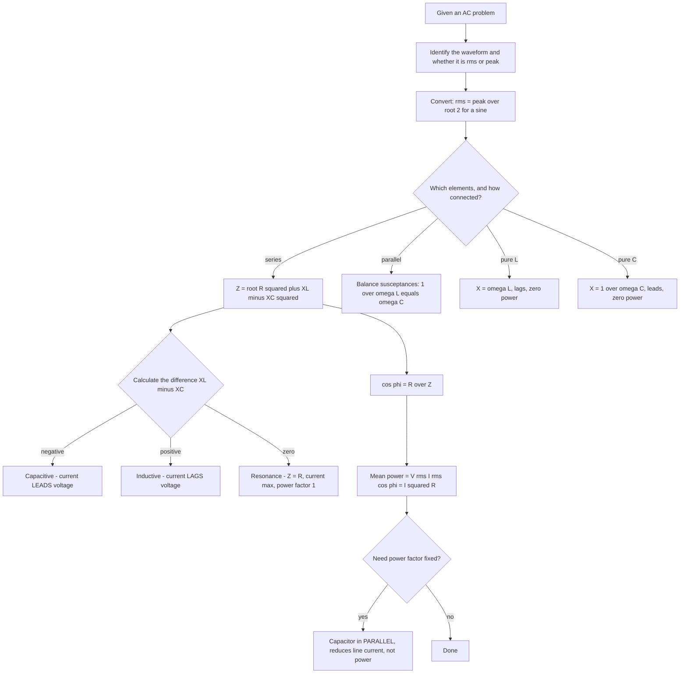

# Alternating Current

Mains electricity is 230 V at 50 Hz, and that single sentence is the reason this chapter exists: a voltage that reverses 100 times a second cannot be described by Ohm's law alone, because the current through a coil or capacitor does not follow the voltage. Everything in this chapter is the consequence of that lag. Learn the three element responses, the phasor diagram, and the power formula, and the rest of the syllabus on AC follows.

### 🟢 Lite — Quick Review (1h–1d)

**The starting definitions**

- **Alternating current** reverses its direction periodically. A **sinusoidal** emf is written $\varepsilon = \varepsilon_0\sin(\omega t)$ with $\varepsilon_0$ the amplitude, $\omega = 2\pi f$ the angular frequency in rad s⁻¹, and $f$ the frequency in hertz.
- **The period** is $T = 1/f$; for Indian mains, $T = 0.02$ s and $\omega = 100\pi \approx 314$ rad s⁻¹.
- **RMS value** is defined so that the mean heating effect equals that of a DC of the same value. For a sine wave $\varepsilon_{rms} = \varepsilon_0/\sqrt{2}$. All AC ratings — 230 V mains, 5 A fuses, 1100 W toasters — are rms values.
- **Average over a full cycle is zero**, because the positive and negative half cycles cancel. **Average over a half cycle** is $2\varepsilon_0/\pi$.

**Waveform constants**

| Waveform | RMS | Average (half cycle) | Form factor | Crest factor |
|---|---|---|---|---|
| Sine | $\varepsilon_0/\sqrt 2$ | $2\varepsilon_0/\pi$ | 1.11 | 1.414 |
| Square | $\varepsilon_0$ | $\varepsilon_0$ | 1.00 | 1.00 |
| Triangular | $\varepsilon_0/\sqrt 3$ | $\varepsilon_0/2$ | 1.155 | 1.732 |

Form factor = rms ÷ average; crest factor = peak ÷ rms. A crest factor of 1 for a square wave is a real diagnostic: square waves stress insulation harder than sines of the same rms value.

**The three elements — this table is the chapter**

| Element | Impedance | Phase | Frequency dependence |
|---|---|---|---|
| Resistor $R$ | $R$ | in phase | none |
| Inductor $L$ | $X_L = \omega L$ | current **lags** by 90° | rises with $f$ |
| Capacitor $C$ | $X_C = 1/\omega C$ | current **leads** by 90° | falls with $f$ |

**Series LCR**

$$Z = \sqrt{R^2 + (X_L - X_C)^2}, \quad \tan\phi = \frac{X_L - X_C}{R}, \quad \cos\phi = \frac{R}{Z} = \text{power factor}$$

Resonance at $\omega_0 = 1/\sqrt{LC}$, where $Z = R$ (minimum), $I$ is maximum, and $\phi = 0$.
Quality factor $Q = \omega_0 L/R$; bandwidth $\Delta\omega = R/L = \omega_0/Q$.

**Power**

$$\bar{P} = \varepsilon_{rms}I_{rms}\cos\phi = I_{rms}^2 R$$

Purely reactive elements dissipate **zero** mean power. Reactive power $Q_r = \varepsilon_{rms}I_{rms}\sin\phi$ is measured in volt-amperes reactive, and apparent power $\varepsilon_{rms}I_{rms}$ in volt-amperes.

**Transformer**

$$\frac{\varepsilon_s}{\varepsilon_p} = \frac{N_s}{N_p} = \frac{I_p}{I_s}, \qquad \varepsilon_p I_p = \varepsilon_s I_s$$

### 🟡 Standard — Regular Study (2d–2mo)

**Why AC is the form we generate and transmit**

Two properties, both from induction, make AC the only practical choice for the grid. A transformer works only with a changing flux, so a steady DC primary would produce nothing in the secondary — a transformer is useless on DC. And because the voltage ratio equals the turns ratio, a step-up transformer raises the transmission voltage while lowering the current, so the line loss $I^2R$ falls as the inverse square of the voltage ratio. Transmitting at 400 kV instead of 20 kV cuts the current and the heating by a factor of twenty. Generation is also naturally AC, since a rotating coil in a magnetic field produces a sine wave; DC is obtained only by adding a commutator, which introduces losses and wear that a transformer does not.

**The phasor, and why it is the whole trick**

A sine wave can be represented by a rotating vector — a **phasor** — whose length is the amplitude and whose angle is the instantaneous phase, rotating anticlockwise at angular speed $\omega$. Because all the waves in a circuit have the same $\omega$, one picture of that picture captures every instant. What you gain is this: quantities separated by 90° are perpendicular vectors, so they add as vector components rather than arithmetically.

For a series RLC circuit, draw the current along the horizontal axis. Then $V_R$ lies along it, $V_L$ is 90° above it, and $V_C$ is 90° below it. The applied voltage is the resultant:

$$\varepsilon^2 = V_R^2 + (V_L - V_C)^2$$

That subtraction of $V_C$ from $V_L$ is the entire content of the phase idea. If $V_L = V_C$ the two cancel, the voltage equals $V_R$ alone, the phase angle is zero and the circuit is purely resistive — which is the definition of resonance.

**The three circuits, one at a time**

**Purely resistive.** $V$ and $I$ are in phase, $I = V/R$, and the mean power is $I^2R = V^2/R = VI$. Incandescent lamps and electric irons are close to this case.

**Purely inductive.** The self-induced emf $-L\,dI/dt$ opposes the current's growth, so the current lags the voltage by 90°. The impedance is $\omega L$, so current falls as frequency rises. A choke coil is a deliberate inductor in series, used to limit AC current without significant power loss, because an ideal inductor returns all the energy it absorbs — its only loss is the small $I^2R$ of the winding. Mean power is zero.

**Purely capacitive.** The current must build up the charge on the plates, so the current leads the voltage by 90°. The impedance is $1/\omega C$, so current *rises* as frequency rises — the opposite behaviour to an inductor, and the reason the two can cancel. This is the basis of power factor correction: a capacitor in parallel with an inductive load supplies the leading component locally, reducing the current drawn from the line. Mean power is zero.

**Series resonance and the quality factor**

At $\omega_0 = 1/\sqrt{LC}$ the circuit behaves as a pure resistance of value $R$, so the current is at its maximum and the power factor is unity. The sharpness of the peak is the quality factor $Q = \omega_0L/R$; the half-power bandwidth is $\Delta\omega = R/L = \omega_0/Q$. High $Q$ means a narrow, tall peak — a selective circuit, good for a radio receiver, fragile and slow to respond. Low $Q$ means a broad, flat response — a stable circuit, which is what an audio amplifier stage wants.

Note also that the **current is maximum but the voltage across $L$ or $C$ can be much larger than the applied voltage** at resonance. $V_L = I X_L$ can exceed $V$ by a factor $Q$. This voltage magnification is why a resonant circuit can break down its own insulation, and why resonance is useful in a Tesla coil or a radio transmitter.

**Power, power factor, and the industrial consequence**

The instantaneous power in an AC circuit is $p(t) = \varepsilon_0 I_0\sin\omega t\,\sin(\omega t - \phi)$; averaged over a cycle the cross terms vanish, leaving

$$\bar{P} = \varepsilon_{rms}I_{rms}\cos\phi$$

$\cos\phi$ is the power factor. A resistive load has $\cos\phi = 1$; an unloaded transformer or induction motor can have $\cos\phi$ well below 0.8. Low power factor is a genuine cost: the current drawn from the supply is high, so cables, transformers and switchgear must be oversized, and a supplier may charge for it. The standard fix is a capacitor bank in parallel, which corrects $\cos\phi$ towards 1 and cuts the line current without changing the useful power delivered.

**Measuring AC quantities — which instrument for which job**

- **A moving-iron ammeter and voltmeter** work on AC because the iron is magnetised by the current's rms value in either direction; the reading is the rms. They are the cheapest and least accurate, and are fine for mains panels.
- **A moving-coil instrument reads DC only.** To use it on AC you need a rectifier and a meter calibrated in rms.
- **A dynamometer-type instrument** has a fixed coil and a moving coil carrying the current in both, so the deflecting torque is proportional to $i_1i_2$ and is the same in either direction. It works on AC and DC — and it is the principle of the **dynamometer-type wattmeter**, in which the current coil carries the load current and the pressure coil takes the voltage. Its reading is the *mean* power directly, which is exactly what makes it the standard AC power instrument.
- **A frequency meter** measures $f$ directly; a **power factor meter** measures $\cos\phi$ directly.

**Three-phase supply**

Three sinusoids of equal amplitude and frequency are generated 120° apart, $i_1 = I_0\sin\omega t$, $i_2 = I_0\sin(\omega t + 120°)$, $i_3 = I_0\sin(\omega t + 240°)$. Because they sum to zero at every instant, the neutral current is zero, which is why three-phase systems need no thick neutral conductor.

| | Star (Y) | Delta (Δ) |
|---|---|---|
| Line voltage | $V_L = \sqrt 3\,V_{ph}$ | $V_L = V_{ph}$ |
| Line current | $I_L = I_{ph}$ | $I_L = \sqrt 3\,I_{ph}$ |
| Total power | $3 V_{ph}I_{ph}\cos\phi = \sqrt 3 V_L I_L\cos\phi$ | same |

Three-phase transmission carries more power for the same conductor material, and the rotating field it produces is what makes a three-phase induction motor self-starting. Indian mains is 415 V line-to-line, i.e. 240 V per phase.

### 🔴 Extended — Deep Study (3mo+)

**Complex impedance and admittance**

Writing $Z = R + j(X_L - X_C)$ with $j^2 = -1$ compresses the whole phasor diagram into algebra: $jX_L$ is "90° ahead" and $-jX_C$ is "90° behind", and addition is ordinary complex addition. The magnitude $|Z| = \sqrt{R^2 + X^2}$ is the impedance, the argument is the phase angle. The reciprocal $Y = 1/Z = G + jB$ is the **admittance** in siemens, and it is the natural quantity for parallel circuits, exactly as conductance is for parallel resistors. A resonance is then simply a statement that the imaginary part of the admittance vanishes.

**The general RLC network, not just series**

A parallel RLC has an entirely different resonance condition. For a parallel combination, resonance occurs when $\omega_0 = 1/\sqrt{LC}$ *only* if $R$ is absent; with a resistor in parallel the susceptances must balance, $\dfrac{1}{\omega_0L} = \omega_0C$, which gives the same frequency, but the peak in current is a peak in a different quantity, and the impedance at resonance is not simply $R$. The exam-useful statement is: **series resonance gives a maximum current and a minimum impedance; parallel resonance gives a maximum impedance and a minimum source current.** Anything that mixes the two is wrong.

**Quality factor, damping, and the mechanical analogy**

Series LCR is the electrical twin of a mass on a spring with viscous damping. The correspondences are exact: $L \leftrightarrow m$, $1/C \leftrightarrow k$, $R \leftrightarrow b$, $\omega_0 \leftrightarrow \sqrt{k/m}$, and $Q \leftrightarrow$ the inverse damping ratio. This is not a metaphor; the two equations are the same equation, which is why a radio, a swing and a quartz watch all share the same resonance behaviour, including the existence of an exponentially damped transient on top of the steady oscillation.

**Growth and decay of charge in an LCR circuit**

On connecting a DC source to a series LCR circuit, the current does not jump to its final value. The complete solution is the sum of a forced oscillation at the driving frequency and a free oscillation at $\omega_0$ which decays with time constant $2L/R$. In a series circuit the transient persists only if the free oscillation can actually occur, i.e. if the resistance is small enough that the circuit is underdamped. In a parallel LCR circuit the free oscillation is undamped by construction, which is the basis of the **tank circuit** used in oscillators. This is the electrical form of a beating or a transient in a mechanical oscillator, and it is where the two-half-cycle energy exchange of a free LC circuit actually shows up.

**Free LC oscillations**

A capacitor discharging through an ideal inductor — no resistance — is the purest AC source in physics. Charge obeys $q = q_0\cos\omega_0t$ with $\omega_0 = 1/\sqrt{LC}$, and the total energy $\tfrac{1}{2}q^2/C + \tfrac{1}{2}LI^2$ is constant, sloshing between the electric field of the capacitor and the magnetic field of the inductor. The frequency is set entirely by $L$ and $C$, so tuning a radio is exactly this: turn a variable capacitor and change the frequency you can receive. A quartz crystal is an $LC$ oscillator with very high $Q$ and enormous mechanical inertia in its lattice, which is why a watch keeps time to a few seconds a day.

**The transformer under load, and regulation**

With a resistive load on the secondary, the secondary current's magnetising effect opposes the primary flux, and the primary draws more current to compensate. Two losses scale differently: the copper loss $I^2R$ grows as the square of the load, so it dominates at full load, while core loss is almost independent of load. **Voltage regulation** is the percentage drop in secondary voltage from no load to full load; it is small for a large transformer, and small for a step-up transformer. When a transformer is deliberately short-circuited, the current is limited only by the winding resistance and the leakage reactance, which is why it is a serious fault and not merely an inconvenience.

**Skin effect, proximity effect, and conductors**

A conductor carrying AC pushes its own current towards the surface (Lenz's law applied to itself). The skin depth is $\delta = \sqrt{2/(\omega\mu\sigma)}$: about 9 mm in copper at 50 Hz, but under a millimetre at radio frequencies. The effective resistance therefore rises with frequency, which is why radio-frequency conductors are silver-plated or made of fine strands. The **proximity effect** is the same crowding caused by a neighbouring conductor carrying current in the opposite direction, and it is why bus bars in substations are arranged to minimise it. A twisted pair reduces both effects for signal lines, and that is the physical reason twisting exists.

**Ferroresonance**

A ferroresonant circuit combines a saturable iron core (a non-linear inductance whose value falls as the core approaches saturation) with a capacitor. Because the inductance is not constant, the circuit has more than one stable operating point and can jump between them, producing a large sub-harmonic surge — a well-documented cause of transformer and capacitor-switching damage. The practical lesson: a circuit element whose value depends on the current is outside linear circuit theory, and a question that mentions a saturable core is telling you the answer cannot be found with the phasor diagram.

**Worked example — a series RLC at two frequencies**

$R = 40$ Ω, $L = 0.3$ H, $C = 20$ μF, driven by 200 V rms.

At $f = 50$ Hz: $\omega = 314$ rad s⁻¹. $X_L = 314 \times 0.3 = 94.2$ Ω. $X_C = 1/(314 \times 20\times 10^{-6}) = 159.2$ Ω.
$X_L - X_C = -65$ Ω. $Z = \sqrt{1600 + 4225} = \sqrt{5825} = 76.3$ Ω.
$I = 200/76.3 = 2.62$ A. $\cos\phi = 40/76.3 = 0.524$. $\bar{P} = I^2R = 6.86 \times 40 = 274$ W.
The circuit is **capacitive** (the negative sign), so the current leads the voltage by $\cos^{-1}(0.524) = 58.4°$.

At $f = 130$ Hz: $\omega = 817$ rad s⁻¹. $X_L = 245$ Ω. $X_C = 1/(817 \times 20\times 10^{-6}) = 61.2$ Ω.
$X_L - X_C = 184$ Ω. $Z = \sqrt{1600 + 33856} = 188.4$ Ω. $I = 1.06$ A, and the circuit is now **inductive** with $\cos\phi = 40/188.4 = 0.212$.
The current is far smaller, the power factor far worse, and the mean power has dropped to 45 W — all because the circuit is far from resonance.

At resonance: $f_0 = 1/(2\pi\sqrt{LC}) = 1/(2\pi\sqrt{0.3\times 20\times 10^{-6}}) = 1/(2\pi \times 0.002449) = 65$ Hz. $Z = R = 40$ Ω, $I = 5$ A, $\bar{P} = 1000$ W, $\cos\phi = 1$.

Read the three together: 50 Hz is below resonance and capacitive, 130 Hz is above resonance and inductive, 65 Hz is resonance. Below $\omega_0$, $X_C$ dominates; above it, $X_L$ dominates. That one sentence resolves every phase question in the chapter.

**Worked example — power factor correction**

A 230 V, 50 Hz supply drives a motor taking 5 kW at a power factor of 0.7 lagging. Find the line current, and the current after a capacitor corrects the power factor to 0.9.

Line current before: $\bar{P} = VI\cos\phi$, so $I = 5000/(230 \times 0.7) = 31.1$ A.
Reactive power before: $Q_r = VI\sin\phi = 230 \times 31.1 \times \sqrt{1 - 0.49} = 7153 \times 0.714 = 5107$ VAR.
After correction to $\cos\phi = 0.9$: $I' = 5000/(230\times 0.9) = 24.2$ A, while $Q_r' = 230 \times 24.2 \times 0.436 = 2428$ VAR.
The capacitor must supply $Q_c = 5107 - 2428 = 2679$ VAR, so $C = Q_c/(\varepsilon^2\omega) = 2679/(230^2 \times 314) = 2679/1.661\times 10^7 = 1.61\times 10^{-4}$ F ≈ 161 μF.

The useful power is unchanged at 5 kW, the line current falls from 31.1 A to 24.2 A, and the cable losses fall in proportion to the square of that. Nothing about the motor changed — this is pure compensation, and it is why industry is charged for a poor power factor.

**Worked example — form factor from a waveform**

A square wave alternates between +$E_0$ and −$E_0$ for equal times. Its mean square value over a full cycle is $E_0^2$, so $E_{rms} = \sqrt{E_0^2} = E_0$. The average over a half cycle is $E_0$. Hence form factor $= E_0/E_0 = 1.00$ and crest factor $= E_0/E_0 = 1.00$.

Compare with a sine wave of the same peak: rms 0.707 $E_0$, average 0.637 $E_0$, form factor 1.11, crest 1.414. The square wave's zero crest factor says its peak equals its rms, so a device rated on rms sees no excess stress — while a sine wave of the same rms carries a 41 % higher peak. Inverter output is often a modified square wave precisely because switching devices then experience the least voltage stress.

### 🧠 Memory Anchors

- **"Lag L, lead C, cancel at resonance."** Inductor: current lags. Capacitor: current leads. Equal reactances: the two phase shifts cancel to zero.
- **"Series is current resonance, parallel is voltage resonance."** Series gives maximum current; parallel gives maximum impedance and minimum source current.
- **"230 V is rms; the peak is 325 V."** Every appliance rating and every safety statement uses rms.
- **"Reactive power does not get paid for, but it is paid for in cables."** A poor power factor does not reduce useful power; it raises current, and current is what heats cable and transformers.
- **"Capacitor in parallel, not in series."** Power factor correction adds a capacitor across the load. In series it would change the operating point instead.
- **"Nothing works on DC."** A transformer needs a changing flux; an inductor passes DC after the transient. Every AC device in the syllabus fails on DC for this reason.
- **Flashcard Q&A:**
  - *Average of a sine over a full cycle?* → zero.
  - *Form factor of a sine?* → 1.11; of a square wave? → 1.00.
  - *Resonant frequency of 1 H and 4 μF?* → $1/\sqrt{4\times 10^{-6}} = 500$ rad s⁻¹ ≈ 79.6 Hz.
  - *Power of a 10 A pure capacitor?* → zero; $\cos 90° = 0$.
  - *Below resonance — inductive or capacitive?* → capacitive, $X_C > X_L$.
  - *Why is a 3-phase neutral thin?* → the three currents sum to zero at every instant.
  - *Which meter reads AC power directly?* → the dynamometer-type wattmeter, because its torque depends on the product of current and voltage.
  - *Skin depth in copper at 50 Hz?* → about 9 mm; at megahertz it is micrometres.

### 🎯 Exam Traps & Error Log

1. **Confusing rms and peak values.** Every AC rating is rms. Mixing them puts a $\sqrt 2$ error into the whole calculation, and it cancels nowhere.
2. **Writing $2\varepsilon_0/\pi$ as the average over a full cycle.** That is the half-cycle average; the full-cycle mean of a sine wave is exactly zero.
3. **Reversing the phase relationships.** Current **lags** in an inductor, **leads** in a capacitor. Swapping them makes a resonance question produce anti-resonance.
4. **Adding $X_L$ and $X_C$ instead of subtracting them in a series circuit.** They are perpendicular phasors 180° apart, so the net reactance is their difference.
5. **Using $Z = \sqrt{R^2 + (X_L + X_C)^2}$ for a series circuit,** or applying the series formula to a parallel one. The two circuits have different resonance behaviour.
6. **Assuming a pure inductor consumes power.** $\bar{P} = VI\cos 90° = 0$. A current reading and a zero watt reading together are the classic test.
7. **Forgetting that $Q$ means current maximum in a series circuit and impedance maximum in a parallel one.**
8. **Using $1.11$ as a conversion between rms and peak.** Form factor relates rms to the *average*; crest factor $1.414$ relates peak to rms. Mixing the two constants is a silent error.
9. **Leaving the capacitor out of a power-factor question.** The line current changes; the real power does not. A solution that reports a different kW output for the same load is wrong.
10. **Putting the correction capacitor in series with the load.** Correction is a shunt; series connection changes the circuit, it does not correct it.
11. **Writing $V_L = V$ at resonance.** At resonance the *applied* voltage equals $V_R$, while $V_L$ and $V_C$ individually can be $Q$ times larger. That voltage magnification is real.
12. **Assuming a transformer works on a steady DC supply.** With constant current there is no $d\Phi/dt$ and no secondary emf. Any DC in a transformer's primary is a fault.
13. **Comparing star and delta three-phase relations incorrectly.** $V_L = \sqrt3 V_{ph}$ in star, $V_L = V_{ph}$ in delta; $I_L = I_{ph}$ in star, $I_L = \sqrt3 I_{ph}$ in delta. Total power is $\sqrt3 V_L I_L\cos\phi$ either way.

### 🧪 Self-Test — 8 Questions with Worked Answers

**1. A 230 V, 50 Hz supply feeds a pure inductor of 0.15 H. Find the impedance, the rms current, the peak current, the phase angle and the mean power.**
$\omega = 2\pi\times 50 = 314$ rad s⁻¹.
$X_L = \omega L = 314 \times 0.15 = 47.1$ Ω.
$I_{rms} = 230/47.1 = 4.88$ A; $I_0 = \sqrt2 \times 4.88 = 6.90$ A.
Phase: current lags voltage by 90°, $\phi = 90°$, $\cos\phi = 0$.
$\bar{P} = 0$ W. A current of nearly 5 A flows and no power is dissipated at all.

**2. A capacitor of 8 μF is connected across 230 V, 50 Hz. Find the reactance, the current, and the energy stored at the peak.**
$X_C = 1/\omega C = 1/(314 \times 8\times 10^{-6}) = 1/(2.512\times 10^{-3}) = 398$ Ω.
$I_{rms} = 230/398 = 0.578$ A. Current leads voltage by 90°.
Peak voltage $V_0 = 230\sqrt2 = 325$ V, so the stored energy is $U = \tfrac{1}{2}CV_0^2 = 0.5 \times 8\times 10^{-6}\times 105625 = 0.42$ J.
At the rms value the stored energy is half that, $0.21$ J — an average over a cycle of a quantity that pulses in and out of twice per cycle.

**3. A series RLC circuit has $R = 30$ Ω, $L = 0.5$ H and $C = 3.2$ μF. Find the resonant frequency, the impedance and current at resonance for a 120 V rms source, and the quality factor.**
$\omega_0 = 1/\sqrt{LC} = 1/\sqrt{0.5 \times 3.2\times 10^{-6}} = 1/\sqrt{1.6\times 10^{-6}} = 1/(1.265\times 10^{-3}) = 790.6$ rad s⁻¹.
$f_0 = 790.6/2\pi = 125.8$ Hz.
At resonance $Z = R = 30$ Ω, so $I = 120/30 = 4$ A.
$Q = \omega_0L/R = 790.6 \times 0.5/30 = 13.2$.
Voltage across the inductor at resonance: $V_L = IX_L = 4 \times 790.6 \times 0.5 = 1581$ V — more than thirteen times the applied voltage. That magnification, $V_L/V = Q$, is the practical hazard and the practical use of a high-$Q$ circuit.

**4. A 200 V, 50 Hz supply feeds a series combination of 60 Ω and a 30 μF capacitor. Find the current, the phase and the mean power.**
$X_C = 1/(314 \times 30\times 10^{-6}) = 1/(9.42\times 10^{-3}) = 106$ Ω.
$Z = \sqrt{60^2 + 106^2} = \sqrt{3600 + 11236} = \sqrt{14836} = 121.8$ Ω.
$I = 200/121.8 = 1.64$ A.
$\cos\phi = 60/121.8 = 0.493$, so $\phi = 60.5°$, and the current **leads** the voltage because the circuit is capacitive.
$\bar{P} = I^2R = 2.69 \times 60 = 161$ W.
Cross-check with $VI\cos\phi = 200 \times 1.64 \times 0.493 = 162$ W. The two routes agreeing is the check worth writing down.

**5. A waveform alternates between +12 V and −12 V, each for 2 ms. Find its rms value, its average over a full cycle, its form factor and its crest factor.**
Period $T = 4$ ms, so $f = 250$ Hz. Square wave, amplitude 12 V.
$E_{rms} = 12$ V (a square wave spends all its time at the peak, so the mean square is the peak square).
Average over a full cycle: **zero**; over a half cycle: 12 V.
Form factor $= 12/12 = 1.00$. Crest factor $= 12/12 = 1.00$.
Compare with a sine wave of the same rms: form factor 1.11, crest 1.414. A square wave's zero crest factor is why a modified-square inverter stresses its switches least.

**6. A 1 kW, 230 V single-phase load operates at a power factor of 0.8 lagging. Find the current and the reactive power, and state what happens to the current if the power factor is corrected to unity.**
$I = P/(V\cos\phi) = 1000/(230 \times 0.8) = 5.43$ A.
$\sin\phi = \sqrt{1 - 0.64} = 0.6$, so $Q_r = VI\sin\phi = 230 \times 5.43 \times 0.6 = 750$ VAR.
At unity power factor, $I' = P/V = 1000/230 = 4.35$ A, a 20 % reduction, with the real power unchanged at 1 kW.
The saving is in the cable: the $I^2R$ loss falls from $(5.43)^2$ to $(4.35)^2$, a reduction of about 36 % in the feeder loss for the same delivered power.

**7. A 50 Hz three-phase supply has a line voltage of 415 V. Find the phase voltage and the phase current in a star-connected load drawing 10 kW at a power factor of 0.9, and state the total line current.**
Star: $V_{ph} = V_L/\sqrt3 = 415/1.732 = 240$ V.
Phase current $I_{ph} = P/(\sqrt3 V_L\cos\phi) = 10000/(1.732 \times 415 \times 0.9) = 10000/646.7 = 15.5$ A.
In star, $I_L = I_{ph} = 15.5$ A.
The 240 V phase voltage is the reason a 415 V supply can drive a 240 V-rated appliance directly in star, and the reason an unbalanced star load needs a neutral conductor to keep each phase voltage at 240 V.

**8. A series LCR circuit ($R = 50$ Ω, $L = 0.6$ H, $C = 4$ μF) is driven at 50 Hz by a 100 V rms source. Find the impedance, the current, the power factor, the mean power, and the current at resonance.**
At 50 Hz: $\omega = 314$ rad s⁻¹. $X_L = 314 \times 0.6 = 188.5$ Ω. $X_C = 1/(314 \times 4\times 10^{-6}) = 1/(1.256\times 10^{-3}) = 796$ Ω.
$X_L - X_C = -607.5$ Ω. $Z = \sqrt{2500 + 369056} = \sqrt{371556} = 609.6$ Ω.
$I = 100/609.6 = 0.164$ A. $\cos\phi = 50/609.6 = 0.082$, so $\bar{P} = 100 \times 0.164 \times 0.082 = 1.35$ W.
At resonance: $f_0 = 1/(2\pi\sqrt{0.6 \times 4\times 10^{-6}}) = 1/(2\pi \times 1.549\times 10^{-3}) = 102.7$ Hz, $Z = 50$ Ω, $I = 2$ A, $\bar{P} = 200$ W.
The current at 50 Hz is about twelve times smaller than at resonance, and the power a hundred and forty-eight times smaller. The circuit at 50 Hz is so far below resonance that the capacitor dominates almost completely.

### 💡 Pro Tips

1. **Draw the phasor diagram before doing arithmetic.** One horizontal $V_R$, one $V_L$ up, one $V_C$ down, and the magnitude comes from Pythagoras — it also shows the sign of the phase before you compute it.
2. **Compute $X_L$ and $X_C$ separately and look at their difference first.** If the difference is negative the circuit is capacitive and the current leads; this predicts the sign of your answer before you start.
3. **Keep the rms/peak convention fixed at the top of the solution.** Write "all values rms" once and every subsequent line is unambiguous.
4. **Use $f_0 = 1/(2\pi\sqrt{LC})$ and sanity-check it against $X_L = X_C$ at that frequency.** If they differ by more than a few per cent, there is an arithmetic error.
5. **For power questions, reach for $I^2R$ rather than $VI\cos\phi$.** $I^2R$ requires only the current and the resistance, and it cannot be misapplied to a circuit where the current is not yet known.
6. **Memorise only two waveform constants for the sine wave** — rms $=\varepsilon_0/\sqrt2$ and half-cycle average $=2\varepsilon_0/\pi$ — and derive the form and crest factors from them.
7. **In power factor questions, state clearly that the useful power is unchanged.** That single sentence is what distinguishes a correct answer from one that has adjusted the load instead of the reactive current.
8. **In three-phase questions, pick star or delta and commit to its two relations before computing.** Mixing $V_L = \sqrt3V_{ph}$ with $I_L = \sqrt3 I_{ph}$ is the classic slip, and the two belong to different connections.

## Continue your study

- **[View this topic in your CUET UG roadmap](/roadmap/?exam=cuet&duration=1mo)** — see where "Alternating Current" fits in your personalised plan
- **[Build a quick revision plan](/roadmap/?exam=cuet&duration=1d)** — 1-day sprint covering highest-weight topics
- **[CUET UG exam overview](/exams/cuet/)** — pattern, eligibility, and syllabus
- **[All Physics notes](/notes/cuet/physics/)** — browse sibling topics in this subject
